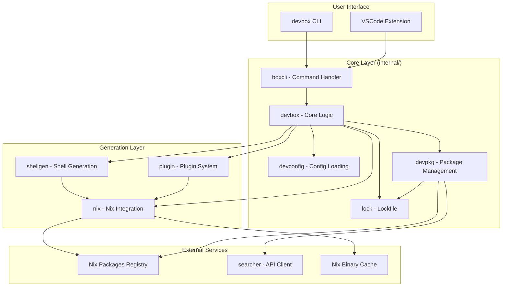
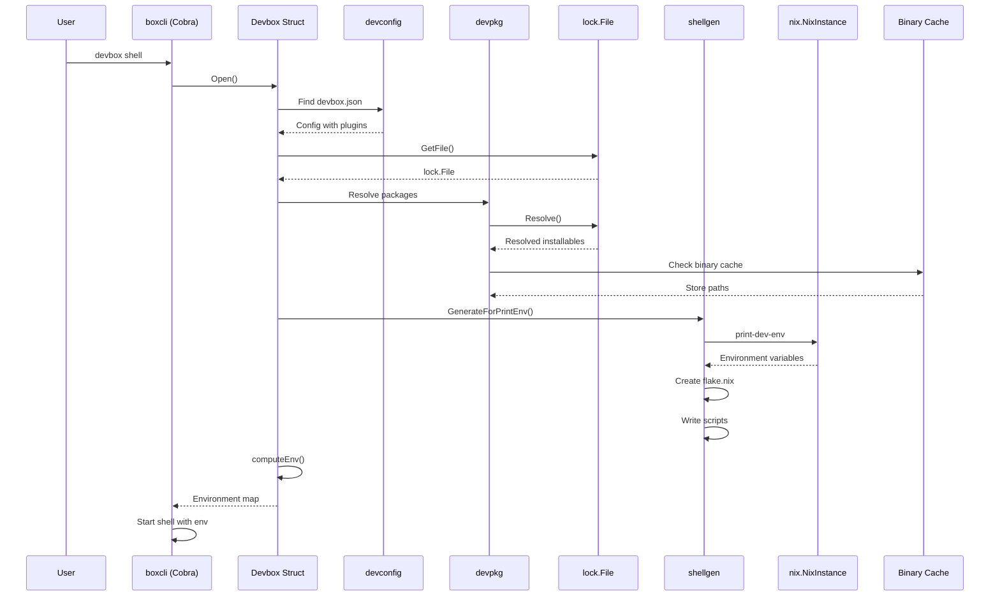
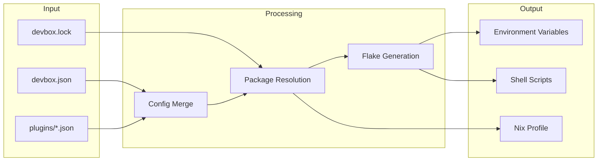

# Project Exploration: Devbox

## Overview

Devbox is a command-line tool that creates isolated, reproducible development environments using Nix packages without requiring users to understand Nix. It enables developers to define their development environment through a simple `devbox.json` configuration file, which specifies packages, environment variables, and shell scripts.

The tool leverages the Nix package manager under the hood but abstracts away its complexity, providing a familiar developer experience similar to package managers like `npm` or `yarn`, but for system-level dependencies. Devbox supports over 400,000 packages from the Nix package registry and enables teams to share consistent development environments across different platforms (Linux, macOS).

Key value propositions include:
- **Reproducibility**: Every developer gets the exact same versions of tools
- **Isolation**: Development environments don't pollute the host system
- **Portability**: The same devbox.json can be used to create local shells, Docker containers, or devcontainers
- **No Nix knowledge required**: Simple JSON configuration without learning Nix language

## Repository

- **Location:** `/home/darkvoid/Boxxed/@formulas/src.jettify/devbox`
- **Remote:** `git@github.com:jetify-com/devbox.git`
- **Primary Language:** Go (100%)
- **License:** Apache 2.0

## Directory Structure

```
devbox/
├── cmd/                          # CLI entry points
│   └── devbox/
│       └── main.go               # Main entry point - calls boxcli.Main()
├── internal/                     # Core implementation packages
│   ├── boxcli/                   # Cobra CLI command definitions
│   │   ├── root.go               # Root command setup, middleware registration
│   │   ├── shell.go              # devbox shell command
│   │   ├── run.go                # devbox run command
│   │   ├── add.go                # devbox add command
│   │   ├── rm.go                 # devbox remove command
│   │   ├── init.go               # devbox init command
│   │   ├── install.go            # devbox install command
│   │   ├── update.go             # devbox update command
│   │   ├── search.go             # devbox search command
│   │   ├── info.go               # devbox info command
│   │   ├── services.go           # devbox services command
│   │   ├── generate.go           # devbox generate command (dockerfile, devcontainer)
│   │   ├── secrets.go            # devbox secrets command
│   │   ├── global.go             # devbox global command (system-wide packages)
│   │   ├── featureflag/          # Feature flag definitions
│   │   ├── midcobra/             # Cobra middleware implementations
│   │   └── usererr/              # User-friendly error types
│   ├── devbox/                   # Core Devbox struct and operations
│   │   ├── devbox.go             # Main Devbox struct with Shell(), RunScript(), etc.
│   │   ├── shell.go              # Shell initialization logic
│   │   ├── packages.go           # Package installation and management
│   │   ├── services.go           # Service management via process-compose
│   │   ├── secrets.go            # Secrets management integration
│   │   ├── generate/             # Code generation (Dockerfile, devcontainer)
│   │   ├── shellcmd/             # Shell command execution
│   │   └── devopt/               # Options structs for Devbox operations
│   ├── devconfig/                # Configuration file handling
│   │   ├── config.go             # Config loading, recursive plugin loading
│   │   ├── configfile/           # devbox.json parsing and schema
│   │   └── init.go               # Config initialization
│   ├── devpkg/                   # Package representation and resolution
│   │   ├── package.go            # Package struct with resolution logic
│   │   ├── outputs.go            # Package output handling
│   │   ├── pkgtype/              # Package type detection (runx, flake, nix)
│   │   └── validation.go         # Package validation
│   ├── lock/                     # Lockfile management
│   │   ├── lockfile.go           # devbox.lock parsing and resolution
│   │   ├── package.go            # Locked package representation
│   │   ├── resolve.go            # Package resolution logic
│   │   └── statehash.go          # State hashing for cache validation
│   ├── nix/                      # Nix command wrappers and integration
│   │   ├── nix.go                # Core nix command execution
│   │   ├── command.go            # Nix command builder
│   │   ├── flake.go              # Nix flake operations
│   │   ├── search.go             # Nix package search
│   │   ├── install.go            # Nix package installation
│   │   └── nixprofile/           # Nix profile management
│   ├── plugin/                   # Plugin system implementation
│   │   ├── plugin.go             # Plugin manager and lifecycle
│   │   ├── manager.go            # Plugin manager struct
│   │   ├── github.go             # GitHub-sourced plugins
│   │   ├── local.go              # Local plugins
│   │   ├── builtins.go           # Built-in plugin definitions
│   │   └── services.go           # Plugin service integration
│   ├── shellgen/                 # Shell environment generation
│   │   ├── generate.go           # Main generation logic
│   │   ├── flake_plan.go         # Flake generation planning
│   │   ├── scripts.go            # Script file generation
│   │   └── tmpl/                 # Go templates for generated files
│   ├── searcher/                 # Package search API client
│   │   ├── client.go             # API client for nixhub.io
│   │   └── parse.go              # Package name parsing
│   ├── services/                 # Background service management
│   │   ├── manager.go            # Service manager using process-compose
│   │   └── config.go             # Service configuration parsing
│   ├── telemetry/                # Telemetry and error reporting
│   │   ├── sentry.go             # Sentry error tracking
│   │   └── segment.go            # Segment analytics
│   ├── templates/                # Project templates (init scaffolding)
│   ├── pullbox/                  # Remote config pulling (S3, Git)
│   ├── patchpkg/                 # Package patching (e.g., glibc patches)
│   ├── build/                    # Build metadata
│   ├── cachehash/                # Content hashing for caching
│   ├── cmdutil/                  # Command utilities
│   ├── conf/                     # Configuration utilities
│   ├── cuecfg/                   # Config file parsing (JSON, TOML, YAML)
│   ├── debug/                    # Debug utilities and timers
│   ├── envir/                    # Environment variable utilities
│   ├── fileutil/                 # File system utilities
│   ├── goutil/                   # Go-specific utilities
│   ├── redact/                   # Error message redaction
│   ├── setup/                    # Nix setup wizard
│   ├── ux/                       # User experience messages
│   ├── vercheck/                 # Version checking
│   └── xdg/                      # XDG directory spec compliance
├── plugins/                      # Built-in plugin definitions
│   ├── postgresql/               # PostgreSQL plugin with process-compose.yaml
│   ├── mysql/                    # MySQL plugin with flake.nix
│   ├── mariadb/                  # MariaDB plugin
│   ├── nginx/                    # Nginx plugin
│   ├── apache/                   # Apache plugin
│   ├── caddy/                    # Caddy plugin
│   ├── redis/                    # Redis plugin
│   ├── valkey/                   # Valkey plugin
│   ├── php/                      # PHP plugin with flake.nix
│   ├── python/                   # Python plugin with venv support
│   ├── nodejs.json               # Node.js plugin definition
│   ├── ruby.json                 # Ruby plugin definition
│   ├── rustc.json                # Rust compiler plugin
│   ├── rustup.json               # Rust toolchain plugin
│   ├── haskell/                  # Haskell plugin
│   ├── poetry/                   # Python poetry plugin
│   ├── builtins.go               # Built-in plugin registry
│   └── README.md                 # Plugin contribution guide
├── examples/                     # Example devbox configurations
│   ├── development/              # Language-specific dev environments
│   │   ├── go/                   # Go development setup
│   │   ├── python/               # Python development setup
│   │   ├── nodejs/               # Node.js development setup
│   │   ├── rust/                 # Rust development setup
│   │   └── ...                   # Other languages (java, ruby, php, etc.)
│   ├── databases/                # Database development setups
│   │   ├── postgres/             # PostgreSQL setup
│   │   ├── mysql/                # MySQL setup
│   │   ├── redis/                # Redis setup
│   │   └── ...
│   ├── stacks/                   # Full application stacks
│   │   ├── django/               # Django framework stack
│   │   ├── rails/                # Ruby on Rails stack
│   │   ├── laravel/              # Laravel PHP stack
│   │   └── ...
│   ├── cloud_development/        # Cloud development environments
│   ├── data_science/             # Data science environments
│   ├── servers/                  # Web server configurations
│   └── plugins/                  # Plugin usage examples
├── testscripts/                  # Integration tests using testscripts
│   ├── add/                      # Tests for 'devbox add' command
│   ├── shell/                    # Tests for shell initialization
│   ├── run/                      # Tests for 'devbox run' command
│   ├── plugin/                   # Plugin tests
│   ├── generate/                 # Generation tests (direnv, dockerfile)
│   ├── languages/                # Language-specific tests
│   └── testrunner/               # Test runner utilities
├── nix/                          # Nix-specific utilities
│   ├── flake/                    # Flake reference parsing
│   └── command.go                # Nix command helpers
├── pkg/                          # Public packages
│   └── autodetect/               # Project type autodetection
├── vscode-extension/             # VSCode extension
│   ├── src/
│   │   ├── devbox.ts             # Devbox CLI integration
│   │   └── extension.ts          # Extension entry point
│   └── package.json              # Extension manifest
├── .schema/                      # JSON schemas
│   ├── devbox.schema.json        # devbox.json schema
│   └── devbox-plugin.schema.json # plugin.json schema
├── devbox.json                   # Devbox's own development environment
├── devbox.lock                   # Locked dependencies for this repo
├── flake.nix                     # Nix flake for building devbox itself
├── go.mod                        # Go module definition
├── go.sum                        # Go dependencies checksum
├── .goreleaser.yaml              # Release build configuration
├── .golangci.yml                 # Go lint configuration
├── .github/workflows/            # GitHub Actions CI/CD
└── scripts/                      # Build and maintenance scripts
```

## Architecture

### High-Level Diagram



### Execution Flow



## Component Breakdown

### CLI Layer (internal/boxcli)

- **Location:** `internal/boxcli/`
- **Purpose:** Defines all CLI commands using the Cobra framework
- **Dependencies:** Internal packages, cobra, pflag
- **Dependents:** cmd/devbox/main.go

The CLI layer is organized as individual command files (`shell.go`, `run.go`, `add.go`, etc.) that each define a Cobra command. The `root.go` file sets up the root command and registers middleware for debugging, telemetry, and tracing.

Key features:
- Uses middleware pattern for cross-cutting concerns (telemetry, debugging)
- Commands delegate to `internal/devbox` for actual logic
- Supports feature flags for experimental features
- Has hidden internal commands for debugging

### Core Devbox (internal/devbox)

- **Location:** `internal/devbox/`
- **Purpose:** Main business logic for Devbox operations
- **Dependencies:** All internal packages
- **Dependents:** CLI commands, VSCode extension

The `Devbox` struct is the central orchestrator that:
- Loads and merges configuration with plugins
- Manages the lockfile
- Computes shell environments
- Coordinates package installation
- Generates shell scripts and flake files

Key methods:
- `Shell()` - Starts an interactive shell
- `RunScript()` - Runs a script from devbox.json
- `EnvExports()` - Returns environment variable exports
- `Install()` - Installs packages without running hooks
- `GenerateDevcontainer()` / `GenerateDockerfile()` - Generates container configs

### Configuration System (internal/devconfig)

- **Location:** `internal/devconfig/`
- **Purpose:** Load, parse, and merge devbox.json configurations
- **Dependencies:** internal/lock, internal/plugin

The configuration system:
- Supports recursive plugin loading
- Merges environment variables, scripts, and init hooks from plugins
- Handles both direct file paths and relative directory searches
- Implements parent directory search (like `git` does)

Key concepts:
- `Config` struct contains root config plus included plugins
- Plugins are loaded recursively and can have their own plugins
- Circular dependency detection
- Built-in plugins are automatically matched to packages

### Package Management (internal/devpkg)

- **Location:** `internal/devpkg/`
- **Purpose:** Represent and resolve Devbox packages
- **Dependencies:** internal/lock, internal/nix, internal/searcher

Packages can be:
1. **Devbox packages**: `name@version` format (e.g., `python@3.10`)
2. **Flake references**: `github:owner/repo/rev#attr`
3. **Local flakes**: `./path#attr`
4. **RunX packages**: `runx://org/repo`

The package resolution:
- Checks lockfile first for cached resolution
- Falls back to searcher API for devbox packages
- Normalizes attribute paths via Nix search
- Handles platform-specific availability

### Lockfile (internal/lock)

- **Location:** `internal/lock/`
- **Purpose:** Deterministic package locking
- **Dependencies:** internal/cachehash, internal/nix

The lockfile stores:
- Resolved flake references with commit hashes
- System-specific store paths
- Output names and paths
- Plugin versions

Key features:
- Version 1 format with JSON schema
- Stores outputs for each system (aarch64-linux, x86_64-darwin, etc.)
- Maintains both modern `Outputs` field and legacy `StorePath` for compatibility
- State hash tracking for cache validation

### Nix Integration (internal/nix)

- **Location:** `internal/nix/`
- **Purpose:** Execute Nix commands and parse output
- **Dependencies:** nix/flake

Core responsibilities:
- Execute `nix print-dev-env`, `nix profile install`, `nix search`
- Handle experimental flags (flakes, nix-command)
- Parse insecure package errors
- Manage Nix daemon interactions
- Build flakes locally

Key functions:
- `PrintDevEnv()` - Get shell environment from flake
- `Command()` - Build nix command with proper flags
- `Search()` - Search nixpkgs
- `EnsureNixpkgsPrefetched()` - Cache nixpkgs flake

### Plugin System (internal/plugin)

- **Location:** `internal/plugin/`
- **Purpose:** Extend packages with additional configuration
- **Dependencies:** internal/devconfig, internal/services

Plugins can:
- Set environment variables
- Create configuration files
- Define init hooks
- Register services via process-compose.yaml

Plugin sources:
1. **Built-in**: Compiled into devbox binary (plugins/*.json)
2. **GitHub**: Sourced from GitHub repositories
3. **Local**: From local file paths

Plugin lifecycle:
1. Match package to plugin via regex or name
2. Load plugin.json template
3. Process Go templates with placeholders
4. Create files in `.devbox/virtenv/` or `devbox.d/`
5. Execute init hooks on shell start

### Shell Generation (internal/shellgen)

- **Location:** `internal/shellgen/`
- **Purpose:** Generate flake.nix and shell scripts
- **Dependencies:** internal/devbox, internal/nix

Generates:
- `.devbox/gen/flake/flake.nix` - Flake for nix develop
- `.devbox/gen/flake/shell.nix` - Legacy shell.nix
- `.devbox/gen/scripts/*` - Shell scripts for run commands
- `.devbox/.nix-print-dev-env-cache` - Cached environment

Template files in `internal/shellgen/tmpl/`:
- `flake.nix.tmpl` - Flake generation
- `shell.nix.tmpl` - Shell.nix generation
- `script-wrapper.tmpl` - Script execution wrapper
- `glibc-patch.nix.tmpl` - glibc patching flake

### Services (internal/services)

- **Location:** `internal/services/`
- **Purpose:** Manage background services
- **Dependencies:** process-compose

Services are defined via `process-compose.yaml` files:
- Can come from plugins (e.g., postgresql plugin)
- Can be user-defined in project root
- Managed via `devbox services start/stop/restart`

### Searcher (internal/searcher)

- **Location:** `internal/searcher/`
- **Purpose:** API client for package search
- **Dependencies:** HTTP client

Connects to `nixhub.io` API to:
- Resolve package names to flake references
- Search for packages
- Get package metadata

## Entry Points

### Main Entry Point

- **File:** `cmd/devbox/main.go`
- **Description:** Application entry point
- **Flow:**
  1. Calls `boxcli.Main()`
  2. Sets up telemetry upload handler
  3. Executes root command with middleware

```go
func main() {
    boxcli.Main()
}
```

### Shell Command

- **File:** `internal/boxcli/shell.go`
- **Description:** Start interactive development shell
- **Flow:**
  1. Parse flags (--pure, --print-env, etc.)
  2. Call `devbox.Open()` to load config
  3. Check for shell inception (prevent nested shells)
  4. Call `box.Shell()` which:
     - Ensures state is up to date
     - Computes environment
     - Creates devbox symlink
     - Starts shell with init hooks

### Run Command

- **File:** `internal/boxcli/run.go`
- **Description:** Run scripts or arbitrary commands
- **Flow:**
  1. Load config via `devbox.Open()`
  2. Generate scripts to files
  3. Compute environment
  4. Call `nix.RunScript()` with environment

### Add Command

- **File:** `internal/boxcli/add.go`
- **Description:** Add packages to devbox.json
- **Flow:**
  1. Parse package names and flags
  2. Load config
  3. Create `devpkg.Package` instances
  4. Resolve packages via lockfile
  5. Update devbox.json
  6. Optionally install packages

## Data Flow



## External Dependencies

| Dependency | Purpose |
|------------|---------|
| **Nix/Nixpkgs** | Package manager and registry (400,000+ packages) |
| **cobra** | CLI framework for Go |
| **process-compose** | Service orchestration (like docker-compose for processes) |
| **nixhub.io** | Package search and resolution API |
| **Segment** | Analytics for usage tracking |
| **Sentry** | Error tracking and reporting |
| **AWS SDK** | S3 integration for remote configs (pullbox) |
| **Jetify envsec** | Secrets management |

## Configuration

### devbox.json

The primary configuration file with these sections:

```json
{
  "name": "project-name",
  "description": "Project description",
  "packages": ["go@1.21", "python@3.11"],
  "env": {
    "GOENV": "off",
    "PATH": "$PWD/bin:$PATH"
  },
  "shell": {
    "init_hook": ["echo 'Setup commands'"],
    "scripts": {
      "build": "go build ./...",
      "test": "go test ./..."
    }
  },
  "include": ["github:jetify-com/devbox/plugins/python"],
  "env_from": "jetify",
  "nixpkgs": {
    "commit": "abc123..."
  }
}
```

### devbox.lock

Automatically generated lockfile:

```json
{
  "lockfile_version": "1",
  "packages": {
    "go@1.21": {
      "resolved": "github:NixOS/nixpkgs/...",
      "version": "1.21.0",
      "source": "devbox-search",
      "systems": {
        "x86_64-linux": {
          "outputs": [{"name": "out", "path": "/nix/store/..."}]
        }
      }
    }
  }
}
```

### Plugin Configuration (plugin.json)

```json
{
  "name": "postgresql",
  "version": "1.0.0",
  "description": "PostgreSQL database",
  "env": {
    "PGDATA": "{{ .Virtenv }}/postgres/data"
  },
  "create_files": {
    "{{ .DevboxDir }}/process-compose.yaml": "process-compose.yaml"
  },
  "init_hook": ["echo 'PostgreSQL ready'"]
}
```

### Environment Variables

| Variable | Purpose |
|----------|---------|
| `DEVBOX_PROJECT_ROOT` | Root directory of devbox project |
| `DEVBOX_WD` | Current working directory |
| `DEVBOX_CONFIG_DIR` | Configuration directory (`devbox.d/`) |
| `DEVBOX_PACKAGES_DIR` | Nix profile directory |
| `DEVBOX_SHELL_ENABLED` | Set when inside devbox shell |
| `DEVBOX_PURE_SHELL` | Set in pure shell mode |
| `NIX_PKGS_COMMIT` | nixpkgs commit hash being used |

## Testing

### Test Framework

Devbox uses the **testscripts** framework (github.com/rogpeppe/go-internal/testscript) for integration testing.

**Location:** `testscripts/`

### Test Structure

Tests are `.test.txt` files organized by feature:

```
testscripts/
├── add/           # Tests for 'devbox add'
├── shell/         # Shell initialization tests
├── run/           # Script execution tests
├── plugin/        # Plugin functionality tests
├── generate/      # Dockerfile/direnv generation
├── languages/     # Language-specific tests (python, php)
└── lockfile/      # Lockfile operation tests
```

### Test Commands

Custom test commands beyond standard testscripts:
- `devbox init` - Initialize devbox
- `devbox add <pkg>` - Add package
- `devbox run <cmd>` - Run command
- `path.len <n>` - Assert PATH length
- `json.superset <a> <b>` - Assert JSON containment

### Running Tests

```bash
# Run all tests
devbox run test

# Run project tests only
devbox run test-projects-only

# Run with Docker for Linux-specific tests
devbox run docker-testscripts
```

### Docker Testing

Linux-specific tests run in Docker containers:
- `testscripts/Dockerfile` defines the test environment
- Pre-compiled test binaries avoid Go toolchain in container
- Tests mounted volumes for Nix store access

## Key Insights

1. **Nix Abstraction Layer**: Devbox is fundamentally a user-friendly abstraction over Nix. It generates flake.nix files dynamically and uses `nix print-dev-env` to get environment variables.

2. **Plugin Architecture**: Plugins are Go JSON templates that can set environment variables, create files, and define services. They're processed at shell initialization time.

3. **Lockfile Design**: The lockfile stores resolved flake references per-system, enabling cross-platform team environments while maintaining determinism.

4. **Shell Environment Layering**: Environment is built in layers:
   - Current environment (filtered)
   - Nix print-dev-env output
   - Plugin environment variables
   - devbox.json env section
   - PATH is concatenated in plugin->nix->system order

5. **Generate-on-Use**: Shell generation happens on-demand, creating `.devbox/gen/` directory with flake.nix and scripts. This allows dynamic configuration based on current state.

6. **Binary Cache Optimization**: Devbox checks if packages are in the binary cache before attempting to build, avoiding unnecessary compilation.

7. **State Hash Caching**: A state hash is computed and stored to detect when the environment needs recomputation, avoiding unnecessary `nix print-dev-env` calls.

8. **Pure Shell Support**: The `--pure` flag creates isolated shells that inherit minimal variables (HOME, PATH to nix, TERM) from the host.

9. **Service Integration**: Background services are managed via process-compose, with plugins able to register services through process-compose.yaml files.

10. **VSCode Integration**: The VSCode extension provides IDE integration including auto-shell, reopen-in-devbox-shell, and command palette actions.

## Open Questions

1. **Pullbox Implementation**: The `internal/pullbox/` directory suggests remote configuration pulling from S3/Git, but the full implementation details and use cases are unclear from code exploration alone.

2. **RunX Integration**: The `runx://` package type exists but its relationship to the main Nix-based packages and how it's executed needs deeper investigation.

3. **glibc Patching**: There's a `patchpkg/` package and `glibc-patch.nix.tmpl` for patching glibc, but the exact use cases and when this is triggered needs clarification.

4. **Auth System**: The `auth.go` command exists but is behind a feature flag. The authentication system's purpose (likely for Jetify Cloud integration) needs exploration.

5. **Global Packages**: The `global.go` command suggests system-wide package management. How this differs from per-project packages and its implementation details need review.

6. **Envsec Integration**: The `env_from: jetify` option and `internal/envsec` usage for secrets management - the full flow and security model needs examination.

7. **Telemetry Implementation**: While Segment and Sentry are used, the specific events tracked and data sent for telemetry purposes isn't fully documented in code.

8. **Plugin Versioning**: How plugin versions are negotiated between lockfile and source, and what happens when plugin definitions change.
