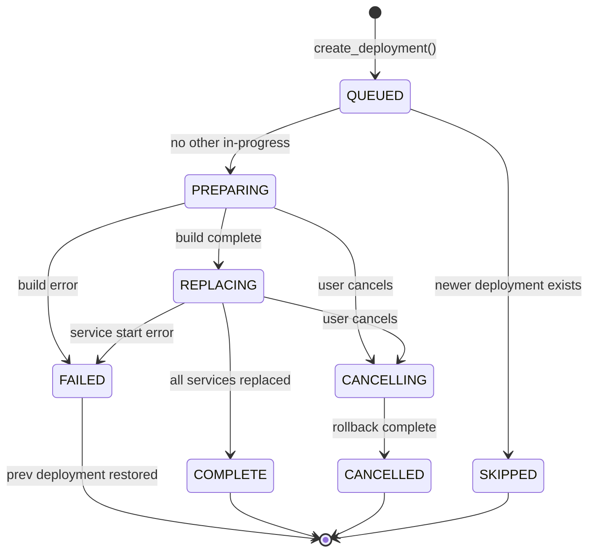

# Deep Dive: disco-daemon

## Overview

The disco-daemon is the core of the Disco platform. It is a Python 3.12 FastAPI application that runs inside a Docker container as a Docker Swarm service. It serves as the single control plane for all operations: managing projects, orchestrating deployments, configuring the reverse proxy, handling GitHub webhooks, scheduling cron jobs, and managing the Swarm cluster.

## Application Startup

The application is defined in `disco/app.py`. The FastAPI lifespan context manager starts the `AsyncWorker` as a background coroutine on the same event loop:

```python
@asynccontextmanager
async def lifespan(app: FastAPI):
    loop = asyncio.get_running_loop()
    async_worker.set_loop(loop)
    worker_task = loop.create_task(async_worker.work())
    yield
    async_worker.stop()
    await worker_task
```

The daemon is started via: `uvicorn disco.app:app --port 80 --host 0.0.0.0`

It runs on port 80 inside the `disco-main` Docker network. Caddy reverse-proxies external HTTPS traffic to it.

## Database Layer

### Schema

The daemon uses SQLite (at `/disco/data/disco.sqlite3`) with both sync and async session factories:

- **Sync engine:** Used in synchronous FastAPI endpoints (marked with `get_db_sync` dependency)
- **Async engine:** Used in async endpoints and the AsyncWorker (via `aiosqlite`)

The `check_same_thread=False` is set because SQLite connections may be shared across asyncio tasks.

### Models (16 total)

```mermaid
erDiagram
    Project ||--o{ Deployment : has
    Project ||--o{ ProjectEnvironmentVariable : has
    Project ||--o{ ProjectDomain : has
    Project ||--o{ ProjectKeyValue : has
    Project ||--o| ProjectGithubRepo : has
    Project ||--o{ CommandRun : has

    Deployment ||--o{ DeploymentEnvironmentVariable : snapshot
    Deployment ||--o{ CommandRun : has
    Deployment }o--|| ApiKey : triggered_by
    Deployment }o--o| Deployment : prev_deployment

    ApiKey ||--o{ ApiKeyUsage : tracks
    ApiKey ||--o{ Deployment : triggers

    ApiKeyInvite }o--|| ApiKey : created_by

    GithubApp ||--o{ GithubAppInstallation : has
    GithubAppInstallation ||--o{ GithubAppRepo : has

    KeyValue : "internal config store"
    CorsOrigin : "allowed CORS origins"
    PendingGithubApp : "temporary, for OAuth flow"
```

Key design decisions:
- **Deployment snapshots environment variables:** Each deployment copies the project's env vars into `DeploymentEnvironmentVariable` records, ensuring that a deployment's configuration is immutable even if project env vars are later changed.
- **Environment variables are encrypted at rest** using a Docker secret (`disco_encryption_key`) with the `encryption.py` module.
- **KeyValue table** stores platform-wide settings like `DISCO_HOST`, `HOST_HOME`, `REGISTRY_HOST`, `DISCO_VERSION`.

### Migrations

Alembic manages migrations with 15 version files spanning v0.1.0 to v0.18.0. Each migration is tied to a daemon version bump.

## API Layer

All endpoints are registered as FastAPI APIRouters in `app.py`. The API uses two authentication schemes:

1. **HTTP Basic Auth:** The API key ID is sent as the username (password is empty). This is what the CLI uses.
2. **JWT Bearer Token:** The JWT's `kid` header identifies the API key. The JWT is verified using the API key ID as the HMAC secret, with the `DISCO_HOST` as the audience. This enables API access from web applications.

### Endpoint Groups

| Router | Path Prefix | Key Operations |
|--------|-------------|----------------|
| `meta` | `/api/meta` | Server info, stats (SSE), host update, upgrade |
| `projects` | `/api/projects` | CRUD, export (for migration) |
| `deployments` | `/api/projects/{name}/deployments` | Deploy, cancel, list, output (SSE) |
| `run` | `/api/projects/{name}/run` | Ad-hoc command execution |
| `envvariables` | `/api/projects/{name}/env` | Get/set/remove env vars |
| `projectdomains` | `/api/projects/{name}/domains` | Add/remove custom domains |
| `volumes` | `/api/projects/{name}/volumes` | List, import (upload), export (download) |
| `scale` | `/api/projects/{name}/scale` | Get/set replica counts |
| `nodes` | `/api/nodes` | Add/list/remove Swarm nodes |
| `apikeys` | `/api/api-keys` | List/remove API keys |
| `apikeyinvites` | `/api/api-key-invites` | Create/accept invites for sharing access |
| `syslog` | `/api/syslog` | Add/list/remove syslog destinations |
| `tunnels` | `/api/tunnels` | Create/extend/close SSH tunnels |
| `corsorigins` | `/api/cors-origins` | Manage CORS allowed origins |
| `githubapps` | `/api/github-apps`, `/.webhooks/github-apps` | GitHub App manifest flow, webhook processing |
| `cgi` | Various | CGI proxy to addon containers |
| `events` | `/api/events` | SSE event stream |
| `logs` | `/api/projects/{name}/logs` | Log streaming |

## Deployment Orchestration (deploymentflow.py)

This is the most critical module. The deployment pipeline:

### State Machine



### Pipeline Steps

1. **Queue Check:** If another deployment is in-progress for the same project, stay queued. If a newer deployment is also queued, skip this one.

2. **PREPARING Phase:**
   - Clone/fetch from GitHub (if applicable)
   - Checkout specific commit or latest
   - Read `disco.json` from the repo
   - Build Docker images (using `docker build` with BuildKit secrets for env vars)
   - Push images to registry (if multi-node)
   - For static/generator sites: copy files to Caddy serving directory

3. **REPLACING Phase:**
   - Create an overlay network for the deployment
   - Run `hook:deploy:start:before` (e.g., database migrations)
   - Stop conflicting port services from previous deployment
   - Start new Docker Swarm services (with health checks, volumes, networks)
   - Update Caddy upstream to point to new services (atomic traffic switch)
   - Run `hook:deploy:start:after`
   - Reload cron schedules
   - Stop previous deployment's services

4. **Error Handling:**
   - On failure at any step: status becomes FAILED, previous deployment is restored
   - On cancellation: `asyncio.CancelledError` is caught, previous deployment is restored
   - The `recovery=True` flag makes rollback operations best-effort (exceptions are logged but not re-raised)

### Image Naming

Images are named using the pattern:
```
disco/project-{project_name}-{service_or_image_name}:{deployment_number}
```

With a registry:
```
{registry_host}/disco/project-{project_name}-{service_or_image_name}:{deployment_number}
```

## Docker Integration (docker.py)

All Docker operations are performed by shelling out to the `docker` CLI (via `asyncio.create_subprocess_exec` or `subprocess.Popen`). Key operations:

- **Image building:** Uses `docker build` with `--secret` flags for BuildKit secrets. CPU is throttled to 50% during builds.
- **Service management:** Uses `docker service create/rm/scale` with labels for tracking.
- **Network management:** Creates per-deployment overlay networks (`disco-project-{name}-{number}`).
- **Swarm management:** Join tokens, node labeling, node draining/removal.
- **Container runs:** For hooks and crons, creates containers with `docker container create`, attaches networks, then starts with `docker container start --attach`.

The daemon container mounts `/var/run/docker.sock` to control the host's Docker daemon.

## Caddy Integration (caddy.py)

Communication with Caddy is done via its admin API over a Unix socket at `/disco/caddy-socket/caddy.sock`. A custom `requests` adapter (`CaddyAdapter`) handles the Unix socket transport.

Key operations:
- **Route management:** Each project gets a route identified by `@id: disco-project-{name}` with domain-based matching
- **Upstream switching:** During deployment, the `reverse_proxy` upstream dial address is atomically updated from old service to new service
- **Static serving:** For static sites, the handler switches from `reverse_proxy` to `file_server`
- **Domain management:** Adding/removing domains updates the `host` match list
- **Apex/www redirects:** Automatic 301 redirects between apex and www domains

The initial Caddy configuration is written as JSON to `/initconfig/config.json` during `disco init`. It sets up:
- Unix socket admin listener
- A single server listening on :443 (or :80 if behind Cloudflare Tunnel)
- The disco-daemon as the default upstream for the disco host domain
- HTTP/1.1 and HTTP/2 protocols

## AsyncWorker (asyncworker.py)

The worker runs in the same process as FastAPI, sharing the event loop. It provides:

### Task Queue
- `asyncio.Queue` for deployment tasks
- Tasks are cancellable (used for deployment cancellation)
- Each task gets a unique ID tracked in `_queue_tasks`

### Cron System
Two types of crons:

**Disco Crons** (system maintenance):
- Every second: tick (no-op placeholder)
- Every minute: stop expired SSH tunnels
- Every hour: clean up DB connections, clean up rogue tunnels
- Every day: clean up rogue syslog services, remove unused Docker images, prune build cache

**Project Crons** (user-defined):
- Loaded from live deployments on startup
- Each cron runs a Docker container with the project's image, env vars, and volumes
- Paused during deployments, resumed after
- Schedule parsed via `croniter`

### Event Loop

The worker loops on a 1-second tick, checking for due crons. Between ticks, it also checks the queue with a timeout matching the time until the next second boundary. This gives sub-second responsiveness for queued tasks while keeping cron timing accurate.

## Security

- **API key authentication:** Keys stored as bcrypt hashes. Usage is recorded per-request for audit.
- **Encryption at rest:** Environment variables are encrypted using a key stored as a Docker secret. The `encryption.py` module handles envelope encryption.
- **Caddy admin isolation:** Unix socket prevents project containers from accessing the reverse proxy config.
- **Docker build secrets:** Environment variables are passed to builds via BuildKit's `--secret` mechanism, avoiding exposure in image layers.
- **CORS:** Configurable per-server, loaded at startup and dynamically updatable via middleware patching.
- **GitHub webhook verification:** HMAC-SHA256 signature verification on incoming webhooks.

## Server Bootstrap (scripts/init.py)

The `disco_init` command:
1. Creates the SQLite database and stamps Alembic to head
2. Stores initial key-value pairs (host, version, etc.)
3. Creates the first API key (printed to stdout)
4. Creates host directories (`~/disco/caddy-socket`, `~/disco/projects`, `~/disco/srv`)
5. Initializes Docker Swarm with the specified advertise address
6. Labels the node as `disco-role=main`
7. Creates `disco-main` and `disco-logging` overlay networks
8. Generates and stores the encryption key as a Docker secret
9. Writes Caddy's initial JSON config
10. Starts Caddy as a Docker container
11. Starts the disco daemon as a Docker Swarm service
12. Optionally sets up Cloudflare Tunnel

## Filesystem Layout (inside daemon container)

```
/disco/
|-- app/           # Application code (mounted from image)
|   |-- disco/     # Python package
|   `-- alembic.ini
|-- data/          # Docker volume: disco-data
|   `-- disco.sqlite3
|-- projects/      # Bind mount: ~/disco/projects (git repos)
|-- srv/           # Bind mount: ~/disco/srv (static site files)
|-- caddy-socket/  # Bind mount: ~/disco/caddy-socket
|   `-- caddy.sock
`-- caddy/         # Docker volumes: caddy-data + caddy-config
    |-- data/
    `-- config/
```
