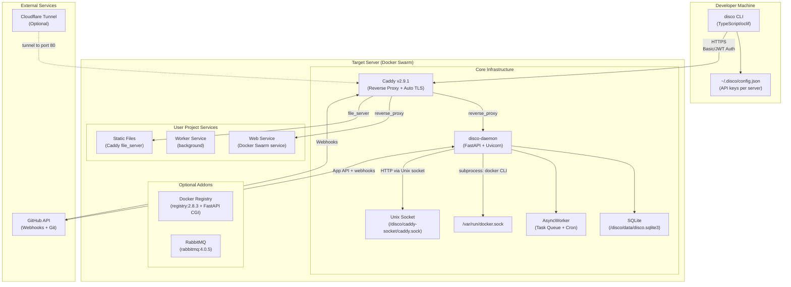
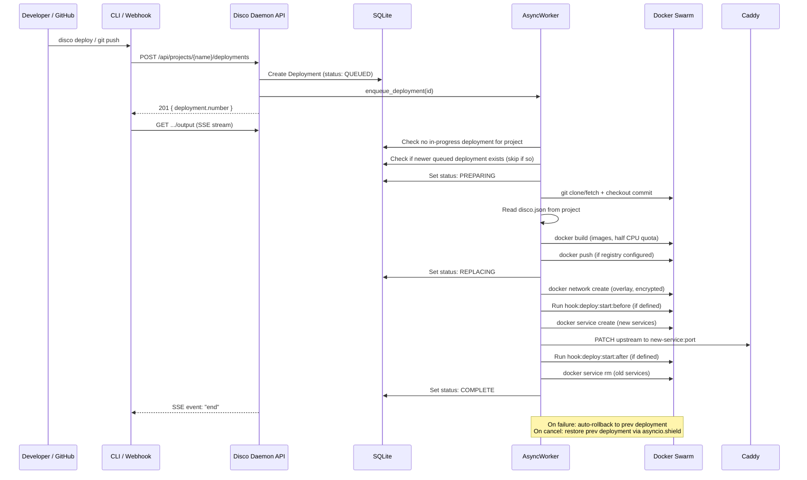
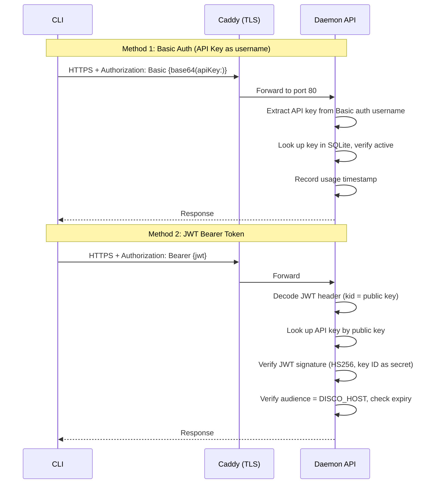
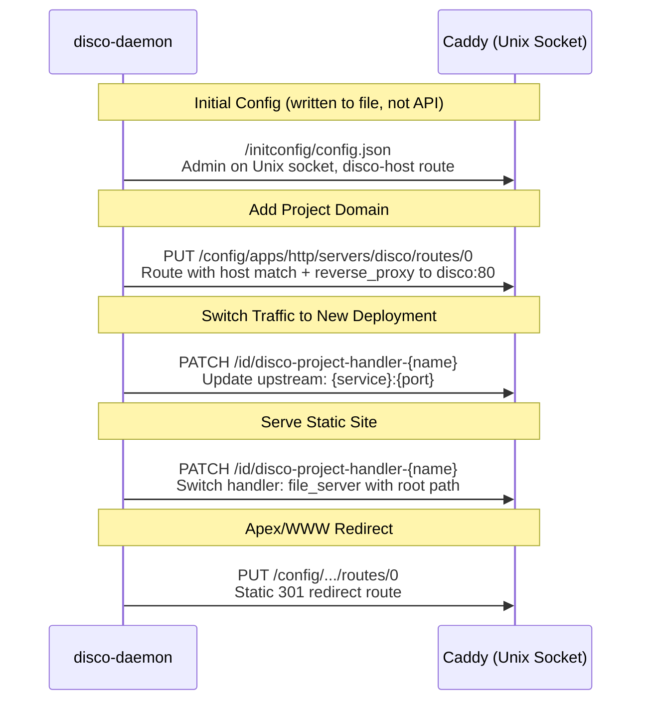
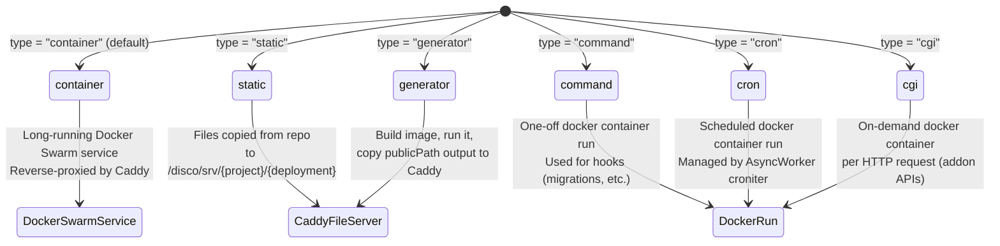

# Project Exploration: Disco (letsdisco.dev)

## Overview

Disco is a self-hosted Platform-as-a-Service (PaaS) that enables developers to deploy and manage web projects on their own servers. It provides a complete deployment pipeline: the user points Disco at a VPS via SSH, it installs Docker, initializes Docker Swarm, sets up Caddy as a reverse proxy with automatic HTTPS, and exposes a REST API through which projects are managed. Think of it as a self-hosted Heroku or Render that runs on any Linux server.

The platform supports multiple deployment types: container-based web services (any language/framework with a Dockerfile), static sites (plain HTML), generator sites (static site generators like Hugo), cron jobs, one-off commands (deployment hooks), and CGI-style request handlers. GitHub integration provides automatic deployments on push via GitHub App webhooks. The `disco.json` file in each project root defines the service topology -- a purpose-built deployment descriptor similar in spirit to `docker-compose.yml` but designed specifically for the Disco deployment model.

The codebase is organized as a collection of independent repositories (each with its own git history, license, and packaging) aggregated into a single directory. The core components are: a Python daemon (the server-side brain, v0.26.0), a TypeScript CLI (the user-facing tool, v0.5.48), a Docker Registry addon, a RabbitMQ addon configuration, an eventsource SSE client library, and six example projects demonstrating different deployment patterns.

## Repository

- **Location:** `/home/darkvoid/Boxxed/@formulas/src.deployanywhere/src.disco`
- **Remote:** Multiple repos -- CLI: `github.com/letsdiscodev/cli`, eventsource-client: `github.com/rexxars/eventsource-client`
- **Primary Language:** Python 3.12 (daemon), TypeScript (CLI)
- **License:** MIT (Copyright 2024 Antoine Leclair and Greg Sadetsky)

## Directory Structure

```
src.disco/
|-- cli/                              # TypeScript CLI tool (oclif-based, v0.5.48)
|   |-- bin/                          # Entry point scripts (dev.js, run.js)
|   |-- src/
|   |   |-- auth-request.ts           # HTTP/SSE request helpers with API key auth
|   |   |-- config.ts                 # ~/.disco/config.json management
|   |   |-- index.ts                  # oclif entry point
|   |   |-- commands/
|   |   |   |-- deploy.ts             # Deploy a project (POST + SSE output stream)
|   |   |   |-- init.ts               # Initialize a new server via SSH (~715 lines)
|   |   |   |-- logs.ts               # Stream container logs
|   |   |   |-- run.ts                # Run one-off commands in project containers
|   |   |   |-- apikeys/              # list, remove
|   |   |   |-- deploy/               # cancel, list, output
|   |   |   |-- discos/               # list (configured disco instances)
|   |   |   |-- domains/              # add, list, remove
|   |   |   |-- env/                  # get, list, remove, set
|   |   |   |-- github/               # apps (add, list, manage, prune), repos (list)
|   |   |   |-- invite/               # accept, create (API key invitations)
|   |   |   |-- meta/                 # host, info, stats, upgrade
|   |   |   |-- nodes/                # add, list, remove (Swarm nodes)
|   |   |   |-- postgres/             # addon (install, remove, update), databases, instances, create, tunnel
|   |   |   |-- projects/             # add, list, move, remove
|   |   |   |-- registry/             # addon (install, remove, update)
|   |   |   |-- scale/                # get, set
|   |   |   |-- syslog/               # add, list, remove
|   |   |   |-- volumes/              # export, import, list
|   |-- test/                         # Mocha test suite (sparse: init.test.ts only)
|   |-- package.json
|   |-- tsconfig.json
|
|-- disco-daemon/                     # Python daemon (FastAPI, v0.26.0)
|   |-- disco/
|   |   |-- __init__.py               # __version__ = "0.26.0"
|   |   |-- app.py                    # FastAPI app + AsyncWorker lifespan
|   |   |-- auth.py                   # Basic auth / JWT bearer authentication
|   |   |-- config.py                 # CADDY_VERSION, DB URLs, BUSYBOX_VERSION
|   |   |-- middleware.py             # Dynamic CORS middleware
|   |   |-- errors.py                 # ProcessStatusError
|   |   |-- endpoints/                # FastAPI routers (19 endpoint modules)
|   |   |   |-- deployments.py        # Create, list, cancel deployments + SSE output
|   |   |   |-- projects.py           # Create, list, delete, export projects
|   |   |   |-- cgi.py                # CGI-style request proxying to addon containers
|   |   |   |-- meta.py               # Server info, upgrade, host management
|   |   |   |-- nodes.py              # Docker Swarm node add/remove/list
|   |   |   |-- volumes.py            # Volume import/export
|   |   |   |-- githubapps.py         # GitHub App manifest flow + webhooks
|   |   |   |-- (12 more modules)     # apikeys, domains, env vars, logs, scale, syslog, etc.
|   |   |-- models/                   # SQLAlchemy ORM models (16 model classes)
|   |   |   |-- db.py                 # Engine + session factories (sync: Session, async: AsyncSession)
|   |   |   |-- project.py            # Project: name, deployments, domains, env_vars, github_repo
|   |   |   |-- deployment.py         # Deployment: number, status, commit_hash, disco_file, project_id
|   |   |   |-- apikey.py             # API key with usage tracking
|   |   |   |-- meta.py               # Base declarative class, DateTimeTzAware type
|   |   |   |-- (12 more models)      # Github apps, installations, repos, domains, key-values, etc.
|   |   |-- utils/                    # Business logic layer (20 modules)
|   |   |   |-- deploymentflow.py     # Core deployment pipeline (~1017 lines)
|   |   |   |-- docker.py             # Docker CLI wrapper (~1414 lines)
|   |   |   |-- caddy.py              # Caddy admin API client via Unix socket
|   |   |   |-- github.py             # GitHub App integration + webhook processing (~1040 lines)
|   |   |   |-- asyncworker.py        # Background task queue + cron scheduler (~530 lines)
|   |   |   |-- discofile.py          # disco.json Pydantic schema
|   |   |   |-- encryption.py         # Fernet encryption for env var secrets
|   |   |   |-- (13 more utils)       # dns, filesystem, logs, stats, tunnels, projects, etc.
|   |   |-- scripts/                  # Standalone lifecycle scripts
|   |   |   |-- init.py               # Server bootstrapping (DB, Swarm, Caddy, daemon service)
|   |   |   |-- update.py             # Daemon version upgrades
|   |   |   |-- leave_swarm.py        # Node removal from Swarm
|   |   |   |-- setcorelogging.py     # Logging configuration
|   |   |-- alembic/                  # Database migrations
|   |   |   |-- versions/             # 15 migration files (v0.1.0 through v0.18.0)
|   |-- Dockerfile                    # Python 3.12.9 + Docker CLI + SSH
|   |-- docker-compose.yml            # Dev environment (hypercorn, port 6543)
|   |-- pyproject.toml                # Entry points: disco_worker, disco_init, disco_update, etc.
|   |-- requirements.in               # 19 direct dependencies
|   |-- requirements.txt              # Compiled (pinned) dependencies
|   |-- alembic.ini
|
|-- disco-addon-docker-registry/      # Docker Registry addon (Python/FastAPI)
|   |-- addon/
|   |   |-- api.py                    # FastAPI app (2 routers: addon + users)
|   |   |-- cgi.py                    # CGI entry point (addon_cgi script)
|   |   |-- deploy.py                 # Deployment hook (addon_deploy script)
|   |   |-- config.py                 # Addon configuration
|   |   |-- endpoints/                # addon.py, users.py
|   |   |-- models/                   # db.py, keyvalue.py, meta.py, user.py
|   |   |-- alembic/                  # Addon-specific migrations
|   |-- disco.json                    # Addon deployment: registry:2.8.3 + CGI endpoint + deploy hook
|   |-- Dockerfile
|   |-- pyproject.toml                # Entry points: addon_cgi, addon_deploy
|
|-- disco-rabbitmq/                   # RabbitMQ addon (config only)
|   |-- disco.json                    # rabbitmq:4.0.5-management, port 15672, exposed internally
|
|-- eventsource-client/               # SSE client library (npm, v1.1.3, by rexxars)
|   |-- src/
|   |   |-- client.ts                 # Core EventSource client (async iterator, reconnection)
|   |   |-- abstractions.ts           # Environment abstraction layer
|   |   |-- default.ts, node.ts       # Platform-specific entry points
|   |   |-- types.ts, constants.ts    # Type definitions
|   |-- test/                         # Cross-platform tests (Node, Bun, Deno, browser)
|   |-- package.json                  # v1.1.3, depends on eventsource-parser
|
|-- example-django-site/              # Django with SQLite volume + migration hook
|-- example-fastapi/                  # Minimal FastAPI (port 8000)
|-- example-flask-site/               # Flask
|-- example-go-site/                  # Go
|-- example-hugo-site/                # Hugo SSG (generator type, floryn90/hugo image)
|-- example-static-site/              # Plain HTML (static type, publicPath: dist)
```

## Architecture

### High-Level Diagram



### Component Breakdown

#### 1. Disco Daemon (Core Server)
- **Location:** `disco-daemon/`
- **Purpose:** The server-side brain of Disco. A FastAPI application running inside Docker Swarm that exposes a REST API for all platform operations. Orchestrates the entire deployment lifecycle: builds Docker images, manages Swarm services, configures Caddy routing, handles rollbacks, runs cron jobs, processes GitHub webhooks, and manages encryption of secrets.
- **Key Technologies:** Python 3.12, FastAPI, SQLAlchemy (sync + async), SQLite (via aiosqlite), Alembic, Pydantic v2, uvicorn, sse-starlette, PyJWT, Fernet encryption
- **Dependencies:** Docker CLI (subprocess), Caddy admin API (Unix socket), GitHub API
- **Dependents:** CLI (HTTPS API), GitHub (webhooks), addon CGI endpoints

#### 2. Disco CLI
- **Location:** `cli/`
- **Purpose:** Developer-facing command-line tool. Handles server initialization (SSH into a fresh VPS, install Docker, bootstrap Disco), and ongoing management (deploy, scale, domains, env vars, logs, etc.). Stores per-server API key credentials in `~/.disco/config.json`.
- **Key Technologies:** TypeScript, oclif v4, node-ssh, node-fetch, eventsource (SSE), @inquirer/prompts, tunnel-ssh
- **Dependencies:** disco-daemon API over HTTPS
- **Dependents:** End users (developers/operators)

#### 3. Docker Registry Addon
- **Location:** `disco-addon-docker-registry/`
- **Purpose:** Self-hosted Docker image registry for multi-node Swarm deployments. Deployed as a Disco project itself using the CGI service type for its management API. When installed, images built during deployment are pushed to this registry so all Swarm worker nodes can pull them.
- **Key Technologies:** Python, FastAPI, SQLAlchemy, bcrypt, registry:2.8.3 Docker image
- **Dependencies:** Disco daemon (deployed as a Disco project via disco.json)
- **Dependents:** Disco daemon (pushes/pulls images when `REGISTRY_HOST` is configured)

#### 4. RabbitMQ Addon
- **Location:** `disco-rabbitmq/`
- **Purpose:** Pre-configured RabbitMQ instance deployable as a Disco project. Demonstrates the addon pattern: a `disco.json` that uses an upstream Docker image with volumes for data persistence and `exposedInternally: true` for inter-project communication.
- **Dependencies:** rabbitmq:4.0.5-management Docker image
- **Dependents:** User projects that need a message broker

#### 5. EventSource Client
- **Location:** `eventsource-client/`
- **Purpose:** A cross-platform Server-Sent Events (SSE) client library supporting browsers, Node.js, Bun, and Deno. This is an independent open-source project by Espen Hovlandsdal (`rexxars/eventsource-client`), bundled here likely for reference or vendoring. Provides async iteration over SSE streams with automatic reconnection.
- **Dependencies:** eventsource-parser v3
- **Dependents:** CLI (indirectly, via the `eventsource` npm package)

#### 6. Example Projects
- **Location:** `example-django-site/`, `example-fastapi/`, `example-flask-site/`, `example-go-site/`, `example-hugo-site/`, `example-static-site/`
- **Purpose:** Reference implementations demonstrating how to write `disco.json` for different deployment patterns -- container services, static sites, generator sites (Hugo), deployment hooks (Django migrations), and volumes.

## Entry Points

### CLI: `disco init root@server.example.com`
- **File:** `cli/src/commands/init.ts`
- **Description:** Bootstraps a fresh Linux server as a Disco host. The most complex CLI command (~715 lines).
- **Flow:**
  1. SSH into the server (handles key management, non-root users, password prompts)
  2. Setup root SSH access if connecting as non-root user
  3. Install Docker via apt if not present
  4. Optionally upload a local Docker image (for development)
  5. Run `disco_init` inside the `letsdiscodev/daemon` container
  6. `disco_init` (Python script): creates SQLite database, stamps Alembic head, initializes Docker Swarm, creates overlay networks (`disco-main`, `disco-logging`), generates encryption key as Docker secret, writes Caddy initial config, starts Caddy container, starts disco-daemon as Swarm service, optionally configures Cloudflare tunnel
  7. Extract generated API key from init output
  8. Save server config to `~/.disco/config.json`

### CLI: `disco deploy --project mysite`
- **File:** `cli/src/commands/deploy.ts`
- **Description:** Triggers a deployment and streams output in real time
- **Flow:**
  1. POST to `https://{host}/api/projects/{name}/deployments` with optional commit hash or disco.json
  2. Daemon creates a Deployment record (status: QUEUED), enqueues it via the async worker
  3. CLI opens an SSE connection to `/api/projects/{name}/deployments/{number}/output`
  4. Real-time output is streamed until an `end` event signals completion

### Daemon: FastAPI Application Startup
- **File:** `disco-daemon/disco/app.py`
- **Description:** The main daemon process, started by `uvicorn disco.app:app --port 80 --host 0.0.0.0`
- **Flow:**
  1. Module-level: imports all endpoint routers, sets up logging
  2. `lifespan()` context manager: gets the event loop, starts `async_worker.work()` as a co-task
  3. AsyncWorker loads system crons (second, minute, hour, day) and all project crons from the database
  4. 19 routers are mounted, serving the complete REST API
  5. Root GET `/` returns `{"disco": true}` (health check)

### Daemon: Deployment Pipeline
- **File:** `disco-daemon/disco/utils/deploymentflow.py`
- **Description:** Core deployment orchestration, the most complex module (~1017 lines)
- **Flow:**
  1. `enqueue_deployment()` puts the deployment task on the async worker queue
  2. `process_deployment()`:
     - Checks for in-progress deployments on the same project (waits if one exists)
     - Checks if a newer deployment is queued (skips current if so -- optimization)
     - Sets status to PREPARING
     - `prepare_deployment()`: clone/fetch from GitHub, checkout commit, read disco.json, build Docker images, push to registry if configured, handle static/generator sites
     - Sets status to REPLACING
     - Runs `hook:deploy:start:before` if defined
     - `replace_deployment()`: create overlay network, start new services, update Caddy routing, stop old services
     - Runs `hook:deploy:start:after` if defined
     - Sets status to COMPLETE
  3. On exception: rolls back to previous deployment, sets status to FAILED
  4. On cancellation (`asyncio.CancelledError`): rolls back, sets status to CANCELLED
  5. After completion: checks for next queued deployment on the same project

## Data Flow

### Deployment Lifecycle



### Authentication Flow



### Caddy Configuration Flow



### disco.json Service Type State Machine



## External Dependencies

### Daemon (Python)

| Dependency | Version | Purpose |
|------------|---------|---------|
| fastapi | 0.115.11 | REST API framework |
| uvicorn | 0.34.0 | ASGI server |
| sqlalchemy | 2.0.38 | ORM (dual sync + async sessions) |
| aiosqlite | 0.21.0 | Async SQLite driver |
| alembic | 1.15.1 | Database schema migrations |
| pydantic | 2.10.6 | Request/response validation, disco.json parsing |
| PyJWT | 2.10.1 | JWT authentication (HS256) |
| cryptography | 44.0.2 | Fernet symmetric encryption for secrets at rest |
| sse-starlette | 2.2.1 | Server-Sent Events for streaming deployment output |
| croniter | 6.0.0 | Cron schedule expression parsing |
| requests | 2.32.3 | Sync HTTP client (Caddy Unix socket API, GitHub API) |
| aiohttp | 3.11.13 | Async HTTP client |
| bcrypt | 4.3.0 | Password hashing |
| friendlywords | 1.1.3 | Random project name suffix generation |
| greenlet | 3.1.1 | Required by SQLAlchemy async |
| aiofiles | 24.1.0 | Async file operations |

### CLI (TypeScript)

| Dependency | Version | Purpose |
|------------|---------|---------|
| @oclif/core | ^4 | CLI framework (command routing, flags, help) |
| node-ssh | ^13.2.0 | SSH connections for `disco init` |
| node-fetch | ^3.3.2 | HTTP requests to daemon API |
| eventsource | ^3.0.6 | SSE client for streaming logs/output |
| @inquirer/prompts | ^7.4.0 | Interactive CLI prompts (SSH key selection, passwords) |
| tunnel-ssh | ^5.1.2 | SSH tunneling for `postgres:tunnel` |
| chalk | ^5.3.0 | Terminal output coloring |
| cli-progress | ^3.12.0 | Progress bars during server init |
| compare-versions | ^6.1.1 | Semantic version comparison |
| detect-port | ^2.1.0 | Local port availability checking |
| open | ^10.1.0 | Open URLs in default browser |
| undici | ^7.7.0 | HTTP client (modern fetch) |

### Infrastructure Dependencies

| Component | Version | Purpose |
|-----------|---------|---------|
| Docker + Docker Swarm | (host-installed) | Container orchestration, overlay networking |
| Caddy | 2.9.1 | Reverse proxy, automatic TLS, static file serving, admin API |
| Python | 3.12.9 | Daemon runtime (in Docker image) |
| Node.js | >= 18.0.0 | CLI runtime |
| busybox | 1.37.0 | Utility container for host disk usage checks |
| logspout (gliderlabs) | latest | Syslog forwarding from Docker containers |
| cloudflared | latest | Optional Cloudflare tunnel proxy |

## Configuration

### Server-Side Configuration

The daemon stores all runtime configuration in an SQLite database at `/disco/data/disco.sqlite3`. Key-value pairs in the `keyvalues` table hold:

| Key | Description |
|-----|-------------|
| `DISCO_HOST` | Public hostname (e.g., `disco.example.com`) |
| `DISCO_VERSION` | Installed daemon version |
| `DISCO_ADVERTISE_ADDR` | IP address for Docker Swarm advertising |
| `HOST_HOME` | Home directory path on the host machine |
| `REGISTRY_HOST` | Docker registry host (null if no registry addon) |
| `CLOUDFLARE_TUNNEL_TOKEN` | Optional Cloudflare tunnel token |

Hardcoded constants in `disco/config.py`:
```python
CADDY_VERSION = "2.9.1"
SQLALCHEMY_DATABASE_URL = "sqlite:////disco/data/disco.sqlite3"
SQLALCHEMY_ASYNC_DATABASE_URL = "sqlite+aiosqlite:////disco/data/disco.sqlite3"
DISCO_TUNNEL_VERSION = "1.0.0"
BUSYBOX_VERSION = "1.37.0"
```

### Client-Side Configuration

The CLI stores per-server credentials in `~/.disco/config.json`:

```json
{
    "discos": {
        "disco.example.com": {
            "name": "disco.example.com",
            "host": "disco.example.com",
            "apiKey": "<32-character-hex-key>"
        }
    }
}
```

When only one disco instance is configured, the `--disco` flag is optional. Multiple instances are supported and selected by name.

### Project Configuration (disco.json)

Each deployable project includes a `disco.json` at its root:

```json
{
    "version": "1.0",
    "services": {
        "web": {
            "type": "container",
            "image": "default",
            "port": 8000,
            "build": "npm install && npm run build",
            "command": "npm start",
            "volumes": [{"name": "data", "destinationPath": "/data"}],
            "publishedPorts": [{"publishedAs": 5432, "fromContainerPort": 5432}],
            "exposedInternally": false,
            "health": {"command": "curl -f http://localhost:8000/health"},
            "timeout": 300
        },
        "hook:deploy:start:before": {
            "type": "command",
            "command": "python manage.py migrate"
        },
        "nightly-cleanup": {
            "type": "cron",
            "schedule": "0 0 * * *",
            "command": "python cleanup.py"
        }
    },
    "images": {
        "custom": {"dockerfile": "Dockerfile.custom", "context": "./backend"}
    }
}
```

**Service Types:**
- `container` (default): Long-running Docker Swarm service, reverse-proxied by Caddy
- `static`: Files copied directly from repo to Caddy file_server
- `generator`: Build runs in Docker, output copied to Caddy file_server (e.g., Hugo)
- `command`: One-shot container for deployment hooks (pre/post deploy)
- `cron`: Scheduled container runs, managed by the AsyncWorker's croniter
- `cgi`: Per-request Docker container (addon extension mechanism)

### Encryption at Rest

Environment variable values are encrypted using Fernet symmetric encryption before storage in SQLite. The encryption key is managed as a Docker Swarm secret (`disco_encryption_key`) and read from `/run/secrets/disco_encryption_key` at runtime. This ensures the database file alone cannot expose secrets.

## Testing

### CLI
- **Framework:** Mocha + Chai
- **Location:** `cli/test/`
- **Coverage:** Minimal -- only `init.test.ts` exists
- **Run:** `npm test` (also runs ESLint via `posttest`)
- **CI:** GitHub Actions workflows (`onPushToMain.yml`, `test.yml`)

### Daemon
- **Framework:** No test files found
- **Static Analysis:** mypy for type checking, ruff for linting/formatting (configured in `pyproject.toml`, scripts in `bin/`)
- **Note:** The daemon has no automated test suite despite being the most complex component

### EventSource Client
- **Framework:** Custom "waffletest" runner + Playwright for browser tests
- **Location:** `eventsource-client/test/`
- **Platforms:** Node.js, Bun, Deno, browser (Chromium via Playwright)
- **Run:** `npm test` (Node + browser), `npm run test:bun`, `npm run test:deno`
- **CI:** GitHub Actions workflows (`build.yml`, `test.yml`)

## Key Insights

- **Docker Swarm over Kubernetes.** Disco intentionally uses Docker Swarm for orchestration. This is dramatically simpler to bootstrap on a single VPS (just `docker swarm init`) and aligns with the "deploy anywhere" philosophy. Multi-node support is built in via Swarm's native clustering. Services use labels (`disco.project.name`, `disco.service.name`, `disco.deployment.number`) for lifecycle tracking and cleanup.

- **Caddy as a programmable ingress controller.** All HTTPS traffic flows through a single Caddy instance, dynamically configured via its admin API over a Unix socket. This ensures only the Disco daemon can modify routing rules -- no project container can access the socket. Caddy handles automatic TLS certificate provisioning via Let's Encrypt. Routes are managed using Caddy's `@id` tagging system, enabling targeted updates (e.g., switching an upstream from deployment N to N+1) without rewriting the entire config.

- **Blue-green deployment with automatic rollback.** The deployment pipeline catches both exceptions and `asyncio.CancelledError`, automatically rolling back to the previous live deployment. Rollback restores Docker services and Caddy routing. The `asyncio.shield` wrapper on the "maybe keep queued or skip" decision prevents cancellation from corrupting deployment state.

- **Deployment queue with skip optimization.** If multiple deployments are queued for the same project, intermediate ones are skipped (status `SKIPPED`) and only the latest is processed. This avoids unnecessary builds when rapid pushes occur. Deployments in progress block new ones from starting for the same project.

- **"Easy mode" Dockerfile generation.** When a service defines `image` + `build` in disco.json (no custom Dockerfile), the daemon auto-generates a Dockerfile: `FROM {image} / WORKDIR /project / COPY . /project / RUN --mount=type=secret,id=.env env $(cat /run/secrets/.env | xargs) {command}`. This uses Docker BuildKit secrets to inject environment variables during build without leaking them into image layers.

- **CGI as an addon extension mechanism.** The `cgi` service type allows addons to expose API endpoints that run as short-lived Docker containers per request. The daemon proxies requests to the container, passing CGI environment variables and streaming stdin/stdout. This is how the Docker Registry addon's management API works without requiring a long-running sidecar.

- **AsyncWorker is a single-threaded event loop.** The worker combines a FIFO task queue (for deployments) with a cron scheduler (for system maintenance and user project crons). It runs as a co-routine within the FastAPI lifespan, sharing the same asyncio event loop. This avoids the complexity of a separate message broker while still providing non-blocking task processing. Cron resolution is per-second.

- **Both sync and async database access.** The daemon maintains both synchronous and asynchronous SQLAlchemy session factories. GET endpoints often use sync sessions (simpler, no await needed), while write operations and the deployment pipeline use async sessions. This is a pragmatic pattern enabled by FastAPI's support for both sync and async route handlers.

- **GitHub App integration (not OAuth).** Disco creates GitHub Apps for repository access. This provides fine-grained repository-level permissions and webhook delivery. The webhook handler processes `push` events (auto-deploy), `installation` events (app install/uninstall), and `installation_repositories` events (repo add/remove). Access tokens are cached with expiry tracking.

- **Docker CLI via subprocess, not SDK.** The daemon interacts with Docker entirely through subprocess calls to the `docker` CLI binary. This keeps the dependency surface small and makes every operation map to a `docker` command that could be run manually for debugging. The build process limits CPU to half the available cores via `--cpu-quota`.

- **The init command is remarkably comprehensive.** `disco init` (715 lines) handles SSH key management (including creating new keys), Docker installation, root access setup, Swarm initialization, overlay network creation, encryption key generation, Caddy bootstrapping, daemon service creation, and Cloudflare tunnel setup -- all orchestrated from the CLI over SSH. It works with both password and key-based SSH authentication.

## Open Questions

- **No daemon test suite.** The daemon is the most complex component (~5000+ lines of business logic in `utils/`) with critical concerns like deployment rollback, Docker orchestration, and encryption, yet has no automated tests. The deployment flow relies on stateful interactions with Docker and Caddy, which would require careful mocking or integration test infrastructure.

- **Single-node SQLite constraint.** SQLite's single-writer limitation means the daemon must run on a single Swarm node (`node.labels.disco-role==main`). For high-availability scenarios, migrating to PostgreSQL would be needed, but the current dual sync/async SQLAlchemy setup makes this a non-trivial migration.

- **Docker Swarm network IP exhaustion.** The code contains a comment referencing moby/moby#37338 -- Docker Swarm fails to free IP addresses when removing overlay networks. Each deployment creates a new overlay network. Long-running installations with frequent deployments could eventually exhaust the IP address pool.

- **CGI per-request container overhead.** Each CGI request spawns a Docker container create/start/stop/remove cycle. For addons with frequent API calls, this has significant latency and resource overhead. A persistent sidecar pattern might be more efficient for high-traffic addons.

- **Postgres addon missing.** The CLI has extensive `postgres:` commands (create, tunnel, databases, instances) but no `disco-addon-postgres` directory is present in this snapshot. The addon source lives elsewhere.

- **Concurrent cross-project deployments.** The AsyncWorker uses a single global task queue. While per-project serialization is enforced (only one in-progress deployment per project), the global queue means a slow deployment for project A blocks all other projects from starting their deployments until A's task begins executing. The queue is asyncio-based so CPU-bound Docker builds would block the event loop if not properly delegated to subprocesses (which they are, via `asyncio.create_subprocess_exec`).

- **No rate limiting.** The daemon API has authentication but no rate limiting or request throttling. A compromised API key could potentially queue unlimited deployments or make excessive API calls.
