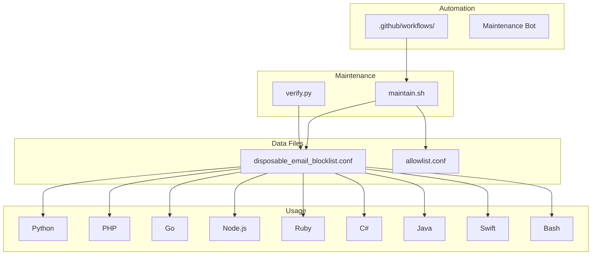
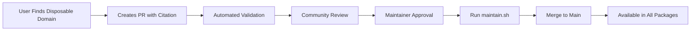
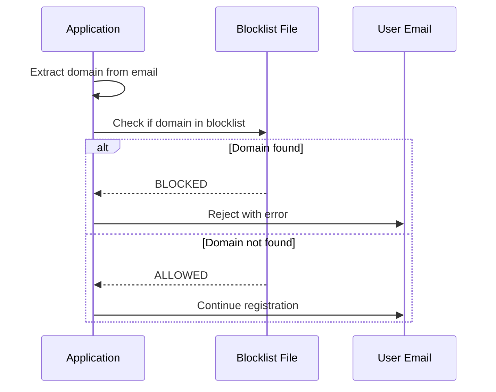

# Project Exploration: disposable-email-domains

## Overview

This repository maintains a comprehensive, community-curated list of disposable and temporary email address domains. These domains are commonly used to create throwaway email accounts for spam, abuse, or bypassing email verification systems.

The project provides simple blocklist and allowlist files that can be integrated into any application or service to filter out disposable email addresses during user registration or other email-based workflows.

## Repository

- **Location:** `/home/darkvoid/Boxxed/@formulas/src.augmentcode/disposable-email-domains`
- **Remote:** git@github.com:augmentcode/disposable-email-domains
- **Primary Language:** Shell, Python
- **License:** CC0 (Public Domain)

## Directory Structure

```
disposable-email-domains/
├── disposable_email_blocklist.conf    # Main blocklist of disposable domains
├── allowlist.conf                     # Domains incorrectly flagged as disposable
├── maintain.sh                        # Maintenance script for list processing
├── verify.py                          # Verification script for domains
├── requirements.txt                   # Python dependencies
├── .gitignore                         # Git ignore patterns
├── LICENSE.txt                        # CC0 license
├── README.md                          # Documentation and usage examples
└── .github/
    ├── FUNDING.yml                    # Sponsorship information
    ├── pull_request_template.md       # PR submission guidelines
    ├── ISSUE_TEMPLATE/
    │   └── add-domain-request.md      # Template for domain addition requests
    └── workflows/
        ├── maintain.yml               # Automated maintenance workflow
        └── pr.yml                     # PR validation workflow
```

## Architecture

### High-Level Diagram



### File Formats

#### Blocklist (`disposable_email_blocklist.conf`)

Simple text file with one domain per line:
```
1secmail.com
10minutemail.com
temp-mail.org
guerrillamail.com
...
```

- Second-level domains only (e.g., `example.com` not `mail.example.com`)
- Lowercase
- Sorted alphabetically
- No duplicates

#### Allowlist (`allowlist.conf`)

Same format as blocklist, contains domains that are often misidentified as disposable but are legitimate:
```
example.com
legitimate-service.org
...
```

### Component Breakdown

#### Maintenance Script (`maintain.sh`)

**Location:** `maintain.sh`

**Purpose:** Processes and normalizes the blocklist

**Operations:**
1. Converts uppercase to lowercase
2. Sorts entries alphabetically
3. Removes duplicates
4. Removes allowlisted domains from blocklist
5. Validates format

**Usage:**
```bash
./maintain.sh
```

#### Verification Script (`verify.py`)

**Location:** `verify.py`

**Purpose:** Validates domains in the blocklist

**Functionality:**
- Checks DNS records for domains
- Identifies invalid or expired domains
- Ensures domains still operate as disposable email services

**Dependencies:**
```txt
# requirements.txt
dnspython
```

#### GitHub Actions Workflows

**`.github/workflows/maintain.yml`:**
- Runs maintenance tasks periodically
- Updates blocklist format
- Creates automated PRs for cleanup

**`.github/workflows/pr.yml`:**
- Validates PR submissions
- Checks domain format
- Verifies new domains are actually disposable

## Entry Points

### Adding a New Domain

1. Add domain to `disposable_email_blocklist.conf`
2. Run `./maintain.sh` to normalize
3. Submit PR with citation (where the domain provides disposable email)

### Using in Applications

The blocklist can be consumed in multiple ways:

1. **Direct file read:** Read the `.conf` file and check domain membership
2. **PyPI package:** Install via `pip install disposable-email-domains`
3. **Remote fetch:** Download from GitHub raw URL
4. **NPM package:** Use `disposable-email-domains-js`

## Data Flow

### Domain Addition Workflow



### Email Validation Flow



## External Dependencies

| Dependency | Version | Purpose |
|------------|---------|---------|
| dnspython | Latest | DNS record verification |
| @octokit/rest | Latest | GitHub API (workflows) |

## Configuration

### Environment Variables

No environment variables required for basic usage.

### GitHub Actions

Workflows use standard GitHub Actions runners with Python for verification scripts.

## Testing

### Manual Verification

```bash
# Test a domain against the blocklist
python3 -c "
domain = 'test@10minutemail.com'.split('@')[1]
with open('disposable_email_blocklist.conf') as f:
    blocklist = set(line.strip() for line in f)
print(f'{domain} is {\"blocked\" if domain in blocklist else \"allowed\"}')"
```

### Automated Testing

PR validation workflow checks:
- Domain format (valid domain syntax)
- Not already in list
- Not in allowlist
- Citation provided

## Key Insights

1. **Community-Driven:** The project relies on community contributions to maintain an up-to-date list of disposable domains.

2. **Simple Format:** Uses plain text files for maximum compatibility across programming languages and platforms.

3. **Real-World Impact:** Cited by PyPI as one of the most impactful mechanisms for preventing spam account creation.

4. **CC0 License:** Dedicated to public domain, allowing unrestricted use including commercial applications.

5. **Maintenance Automation:** Automated scripts ensure consistent formatting and reduce manual maintenance burden.

## Usage Examples (from README)

### Python
```python
with open('disposable_email_blocklist.conf') as blocklist:
    blocklist_content = {line.rstrip() for line in blocklist.readlines()}
if email.partition('@')[2] in blocklist_content:
    message = "Please enter your permanent email address."
```

### PyPI Package
```python
from disposable_email_domains import blocklist
'bearsarefuzzy.com' in blocklist  # True
```

### Go
```go
var disposableList = make(map[string]struct{}, 3500)
func isDisposableEmail(email string) bool {
    segs := strings.Split(email, "@")
    _, disposable = disposableList[strings.ToLower(segs[len(segs)-1])]
    return disposable
}
```

### Node.js
```javascript
async function isDisposable(email) {
  if (!blocklist) {
    const content = await readFile('disposable_email_blocklist.conf', 'utf-8')
    blocklist = content.split('\r\n').slice(0, -1)
  }
  return blocklist.includes(email.split('@')[1])
}
```

## Changelog

| Date | Event |
|------|-------|
| 2025-01-09 | GitHub Sponsorship enabled |
| 2021-11-02 | Transferred to @disposable-email-domains org |
| 2019-04-18 | @di joined as core maintainer |
| 2017-07-31 | @deguif joined as core maintainer |
| 2016-12-06 | Available as PyPI module |
| 2016-07-27 | Converted to second-level domains |
| 2014-09-02 | First commit |

## Open Questions

1. How often are dead/invalid domains removed from the blocklist?
2. What criteria determine if a domain should be added to the allowlist?
3. Is there rate limiting on the DNS verification to avoid being flagged as a scanner?

## Related Projects

- [disposable-email-domains-js](https://github.com/mziyut/disposable-email-domains-js) - NPM package
- [disposable-email-domains (PyPI)](https://pypi.org/project/disposable-email-domains) - Python package
- [anti-disposable-email](https://github.com/rocketlaunchr/anti-disposable-email) - Go package
