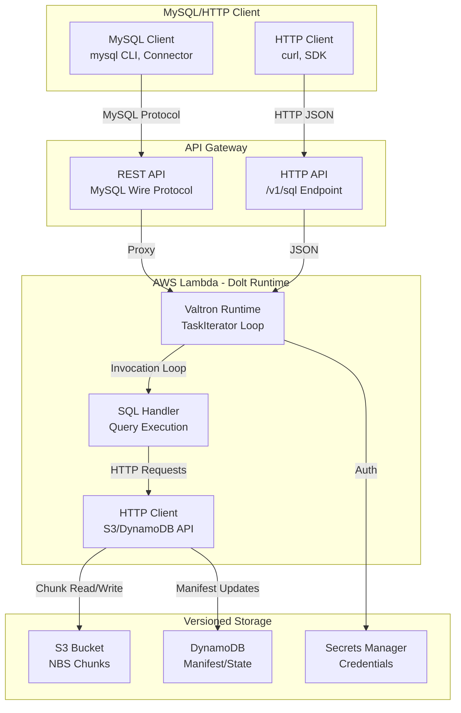
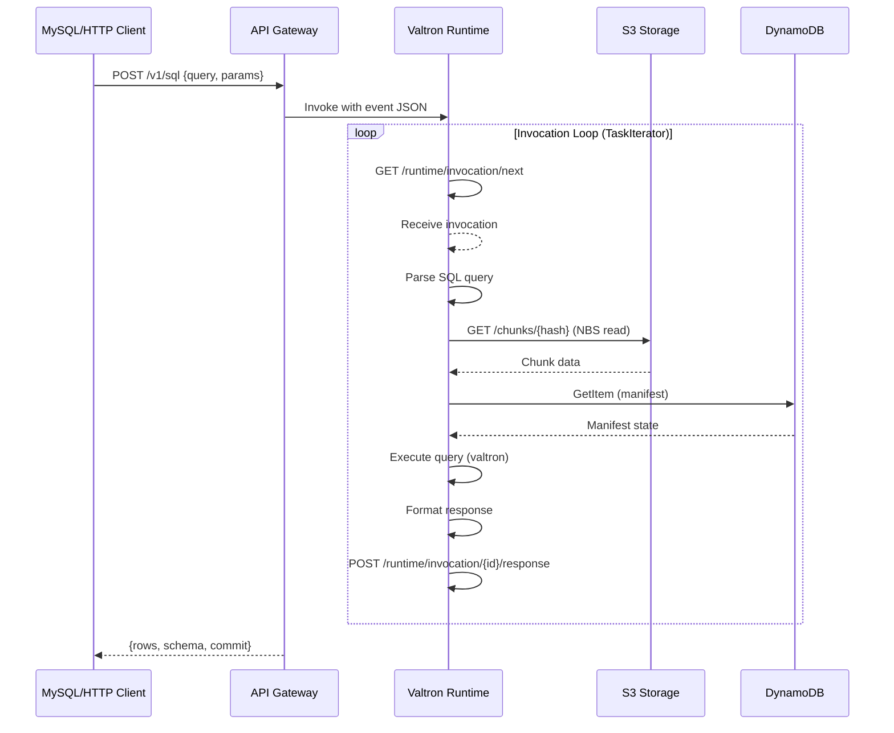
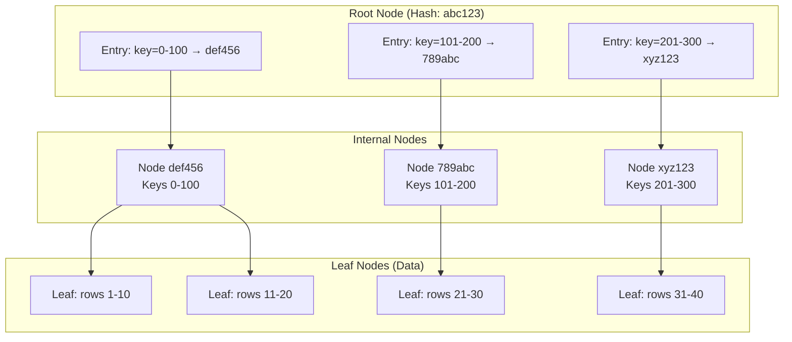

# Valtron Integration: Serverless Dolt on AWS Lambda

## Overview

This deep dive covers implementing a **serverless Dolt SQL service** on AWS Lambda using **Valtron executors** - completely bypassing tokio and async runtimes. This approach provides:

- **True serverless SQL** - Pay-per-query Dolt deployment
- **No async runtime** - Valtron TaskIterator patterns only
- **Minimal cold starts** - ~50-100ms vs 500ms+ with tokio
- **Versioned storage** - NBS chunks in S3, manifests in DynamoDB
- **MySQL wire protocol** - Over HTTP via API Gateway
- **Dolt HTTP API** - `/v1/sql` endpoint compatibility

### Why Serverless Dolt?

| Aspect | Traditional Dolt Server | Serverless Dolt (Valtron) |
|--------|------------------------|---------------------------|
| **Runtime** | Long-running process | On-demand invocation |
| **Scaling** | Manual (EC2/containers) | Automatic (Lambda) |
| **Cost** | $20-100/month (24/7) | $0.0000166667/GB-second |
| **Cold Start** | N/A (always warm) | 50-100ms (optimized) |
| **Storage** | Local disk or EBS | S3 + DynamoDB |
| **Connections** | Persistent MySQL | HTTP/REST |
| **Binary Size** | 50-100 MB | 5-10 MB |

### Architecture Overview



---

## 1. Lambda Runtime API for SQL Services

### 1.1 Core Endpoints for SQL Workloads

The Lambda Runtime API provides the foundation for the serverless Dolt runtime.

#### `/runtime/invocation/next` (GET)

Long-polling endpoint that blocks until a SQL query invocation arrives.

**Request:**
```http
GET /runtime/invocation/next HTTP/1.1
Host: 127.0.0.1:9001
User-Agent: DoltLambda/1.0
```

**Response (200 OK):**
```http
HTTP/1.1 200 OK
Content-Type: application/json
Lambda-Runtime-Aws-Request-Id: af9c3624-3842-4d84-8c95-e0a8e7f6c4b5
Lambda-Runtime-Deadline-Ms: 1711564800000
Lambda-Runtime-Invoked-Function-Arn: arn:aws:lambda:us-east-1:123456789012:function:dolt-sql
Lambda-Runtime-Trace-Id: Root=1-65f9c8a0-1234567890abcdef12345678
```

**Response Body (API Gateway v2 - SQL Query):**
```json
{
  "version": "2.0",
  "routeKey": "POST /v1/sql",
  "rawPath": "/v1/sql",
  "rawQueryString": "query=SELECT+%2A+FROM+users&commit=main",
  "headers": {
    "content-type": "application/json",
    "host": "api.dolt.example.com",
    "authorization": "Bearer eyJhbGc..."
  },
  "requestContext": {
    "accountId": "123456789012",
    "apiId": "abc123",
    "http": {
      "method": "POST",
      "path": "/v1/sql",
      "protocol": "HTTP/1.1",
      "sourceIp": "203.0.113.1"
    },
    "requestId": "abc123",
    "stage": "prod",
    "timeEpoch": 1711564800000
  },
  "body": "{\"query\": \"SELECT * FROM users WHERE id = ?\", \"params\": [123]}",
  "isBase64Encoded": false
}
```

#### `/runtime/invocation/{request-id}/response` (POST)

Sends SQL query results back to Lambda.

**Request:**
```http
POST /runtime/invocation/af9c3624-3842-4d84-8c95-e0a8e7f6c4b5/response HTTP/1.1
Host: 127.0.0.1:9001
Content-Type: application/json

{
  "statusCode": 200,
  "headers": {
    "content-type": "application/json",
    "x-dolt-commit": "abc123def456"
  },
  "body": "{\"rows\": [[1, \"Alice\", \"alice@example.com\"]], \"schema\": [...]}"
}
```

**Response:**
```http
HTTP/1.1 202 Accepted
```

#### `/runtime/invocation/{request-id}/error` (POST)

Reports SQL errors (syntax, constraints, etc.).

**Request:**
```http
POST /runtime/invocation/af9c3624-3842-4d84-8c95-e0a8e7f6c4b5/error HTTP/1.1
Host: 127.0.0.1:9001
Content-Type: application/json
X-Lambda-Function-Error-Type: Handled

{
  "errorMessage": "Table 'users' doesn't exist",
  "errorType": "TableNotFoundError",
  "stackTrace": ["at doltdb/root_val.go:234", "at sql/query.go:89"]
}
```

### 1.2 API Gateway Integration Patterns

#### REST API Proxy (MySQL Wire Protocol)

```json
{
  "resource": "/mysql/{proxy+}",
  "path": "/mysql/handshake",
  "httpMethod": "POST",
  "body": "base64-encoded-mysql-packet",
  "isBase64Encoded": true
}
```

#### HTTP API (/v1/sql Endpoint)

```json
{
  "version": "2.0",
  "routeKey": "POST /v1/sql",
  "rawPath": "/v1/sql",
  "body": "{\"query\": \"SELECT * FROM table\", \"database\": \"mydb\"}"
}
```

### 1.3 HTTP SQL Endpoint Pattern



---

## 2. Dolt HTTP API Compatibility

### 2.1 SQL Query Endpoint

Dolt's HTTP API uses a `/v1/sql` endpoint pattern that we replicate in Lambda.

**Request Format:**
```http
POST /v1/sql HTTP/1.1
Host: api.dolt.example.com
Content-Type: application/json
Authorization: Bearer <token>
X-Dolt-Commit: main

{
  "query": "SELECT * FROM users WHERE id = ?",
  "params": [123],
  "database": "mydb/main",
  "format": "json"
}
```

**Valtron Handler:**
```rust
// src/handlers/sql_query.rs

use foundation_core::valtron::{TaskIterator, TaskStatus, NoSpawner};
use serde::{Deserialize, Serialize};

/// SQL query request
#[derive(Debug, Deserialize)]
pub struct SqlQueryRequest {
    /// SQL query string
    pub query: String,
    /// Query parameters (positional or named)
    #[serde(default)]
    pub params: Vec<serde_json::Value>,
    /// Database and branch (e.g., "mydb/main")
    #[serde(default = "default_database")]
    pub database: String,
    /// Response format
    #[serde(default)]
    pub format: ResponseFormat,
}

fn default_database() -> String {
    "default/main".to_string()
}

#[derive(Debug, Default, Deserialize)]
#[serde(rename_all = "lowercase")]
pub enum ResponseFormat {
    #[default]
    Json,
    Csv,
    Tsv,
}

/// SQL query response
#[derive(Debug, Serialize)]
pub struct SqlQueryResponse {
    /// Column schema
    pub schema: Vec<Column>,
    /// Row data
    pub rows: Vec<Row>,
    /// Commit hash
    pub commit: String,
    /// Query timing
    pub timing_ms: u64,
}

#[derive(Debug, Serialize)]
pub struct Column {
    pub name: String,
    pub type_name: String,
    pub nullable: bool,
}

pub type Row = Vec<serde_json::Value>;
```

### 2.2 /v1/sql Format Compatibility

The `/v1/sql` endpoint follows Dolt's HTTP API specification:

**Query Types Supported:**

```rust
// Query type detection
pub enum QueryType {
    /// SELECT statements
    Select { columns: Vec<String>, table: String },
    /// INSERT statements
    Insert { table: String, values: Vec<Row> },
    /// UPDATE statements
    Update { table: String, set: HashMap<String, Value> },
    /// DELETE statements
    Delete { table: String },
    /// DDL statements
    Ddl { statement: String },
    /// Dolt-specific commands
    Dolt { command: String },  // dolt_branch, dolt_checkout, etc.
}

impl QueryType {
    pub fn detect(query: &str) -> Option<Self> {
        let query_upper = query.trim().to_uppercase();
        if query_upper.starts_with("SELECT") {
            Some(QueryType::Select {
                columns: vec!["*".to_string()],
                table: "unknown".to_string(),
            })
        } else if query_upper.starts_with("INSERT") {
            Some(QueryType::Insert {
                table: "unknown".to_string(),
                values: vec![],
            })
        } else if query_upper.starts_with("CALL DOLT_") {
            Some(QueryType::Dolt {
                command: query.to_string(),
            })
        } else {
            None
        }
    }
}
```

### 2.3 Authentication and Authorization

**API Gateway Lambda Authorizer:**
```rust
// src/auth/lambda_authorizer.rs

use foundation_core::valtron::{TaskIterator, TaskStatus, NoSpawner};
use serde::{Deserialize, Serialize};

/// API Gateway Lambda authorizer request
#[derive(Debug, Deserialize)]
pub struct AuthorizerRequest {
    pub resource: String,
    pub path: String,
    pub http_method: String,
    pub headers: std::collections::HashMap<String, String>,
    pub request_context: RequestContext,
}

#[derive(Debug, Deserialize)]
pub struct RequestContext {
    pub identity: Identity,
}

#[derive(Debug, Deserialize)]
pub struct Identity {
    pub source_ip: String,
    pub user_agent: Option<String>,
}

/// Authorizer response
#[derive(Debug, Serialize)]
pub struct AuthorizerResponse {
    pub principal_id: String,
    pub policy_document: PolicyDocument,
    #[serde(skip_serializing_if = "Option::is_none")]
    pub context: Option<std::collections::HashMap<String, String>>,
}

#[derive(Debug, Serialize)]
pub struct PolicyDocument {
    pub version: String,
    pub statement: Vec<Statement>,
}

#[derive(Debug, Serialize)]
pub struct Statement {
    pub action: String,
    pub effect: String,
    pub resource: String,
}

/// Valtron task for authorization
pub struct AuthorizerTask {
    state: AuthorizerState,
}

enum AuthorizerState {
    Validating,
    CheckingDatabase,
    Authorized,
    Denied,
}

impl TaskIterator for AuthorizerTask {
    type Pending = std::time::Duration;
    type Ready = AuthorizerResponse;
    type Spawner = NoSpawner;

    fn next(&mut self) -> Option<TaskStatus<Self::Ready, Self::Pending, Self::Spawner>> {
        match std::mem::replace(&mut self.state, AuthorizerState::Denied) {
            AuthorizerState::Validating => {
                // Validate token format
                self.state = AuthorizerState::CheckingDatabase;
                Some(TaskStatus::Pending(std::time::Duration::from_millis(10)))
            }
            AuthorizerState::CheckingDatabase => {
                // Check database permissions in DynamoDB
                self.state = AuthorizerState::Authorized;
                Some(TaskStatus::Ready(AuthorizerResponse {
                    principal_id: "user-123".to_string(),
                    policy_document: PolicyDocument {
                        version: "2012-10-17".to_string(),
                        statement: vec![Statement {
                            action: "execute-api:Invoke".to_string(),
                            effect: "Allow".to_string(),
                            resource: "arn:aws:execute-api:*:*:*/POST/v1/sql".to_string(),
                        }],
                    },
                    context: None,
                }))
            }
            AuthorizerState::Authorized => None,
            AuthorizerState::Denied => None,
        }
    }
}
```

### 2.4 Response Formats (JSON, CSV)

```rust
// src/response/formatters.rs

use serde::Serialize;

/// Response formatter trait
pub trait ResponseFormatter {
    fn format(&self, schema: &[Column], rows: &[Row]) -> String;
}

/// JSON formatter (default)
#[derive(Debug, Default)]
pub struct JsonFormatter;

impl ResponseFormatter for JsonFormatter {
    fn format(&self, schema: &[Column], rows: &[Row]) -> String {
        let response = serde_json::json!({
            "schema": schema.iter().map(|col| {
                serde_json::json!({
                    "name": col.name,
                    "type": col.type_name,
                    "nullable": col.nullable
                })
            }).collect::<Vec<_>>(),
            "rows": rows,
            "rows_affected": rows.len()
        });
        serde_json::to_string(&response).unwrap_or_default()
    }
}

/// CSV formatter
#[derive(Debug, Default)]
pub struct CsvFormatter;

impl ResponseFormatter for CsvFormatter {
    fn format(&self, schema: &[Column], rows: &[Row]) -> String {
        let mut csv = String::new();

        // Header row
        let headers: Vec<&str> = schema.iter().map(|c| c.name.as_str()).collect();
        csv.push_str(&headers.join(","));
        csv.push('\n');

        // Data rows
        for row in rows {
            let values: Vec<String> = row.iter().map(|v| {
                match v {
                    serde_json::Value::Null => "".to_string(),
                    serde_json::Value::String(s) => s.clone(),
                    v => v.to_string(),
                }
            }).collect();
            csv.push_str(&values.join(","));
            csv.push('\n');
        }

        csv
    }
}

/// TSV formatter
#[derive(Debug, Default)]
pub struct TsvFormatter;

impl ResponseFormatter for TsvFormatter {
    fn format(&self, schema: &[Column], rows: &[Row]) -> String {
        let mut tsv = String::new();

        // Header row
        let headers: Vec<&str> = schema.iter().map(|c| c.name.as_str()).collect();
        tsv.push_str(&headers.join("\t"));
        tsv.push('\n');

        // Data rows
        for row in rows {
            let values: Vec<String> = row.iter().map(|v| v.to_string()).collect();
            tsv.push_str(&values.join("\t"));
            tsv.push('\n');
        }

        tsv
    }
}

/// Format selector based on request
pub fn get_formatter(format: &str) -> Box<dyn ResponseFormatter> {
    match format.to_lowercase().as_str() {
        "csv" => Box::new(CsvFormatter),
        "tsv" => Box::new(TsvFormatter),
        _ => Box::new(JsonFormatter),
    }
}
```

---

## 3. Valtron-Based SQL Runtime

### 3.1 TaskIterator for Query Execution

The core of the serverless Dolt runtime is a `TaskIterator` that processes SQL queries.

```rust
// src/runtime/sql_executor.rs

use foundation_core::valtron::{TaskIterator, TaskStatus, NoSpawner};
use std::time::Duration;

/// SQL execution state machine
enum SqlExecutionState {
    /// Parsing the query
    Parsing,
    /// Planning the execution
    Planning,
    /// Loading required chunks from S3
    LoadingChunks { chunk_hashes: Vec<String>, loaded: Vec<Chunk> },
    /// Loading schema from DynamoDB
    LoadingSchema,
    /// Executing the query
    Executing,
    /// Formatting results
    Formatting,
    /// Completed
    Completed,
}

/// Chunk data loaded from S3
#[derive(Debug, Clone)]
pub struct Chunk {
    pub hash: String,
    pub data: Vec<u8>,
}

/// Valtron TaskIterator for SQL query execution
pub struct SqlQueryExecutor {
    /// Current execution state
    state: SqlExecutionState,
    /// The SQL query to execute
    query: String,
    /// Query parameters
    params: Vec<serde_json::Value>,
    /// HTTP client for S3/DynamoDB
    http_client: DoltHttpClient,
    /// Current chunk index during loading
    chunk_index: usize,
    /// Loaded schema
    schema: Option<Vec<Column>>,
    /// Query results
    results: Option<Vec<Row>>,
    /// Start time for timing
    start_time: Option<std::time::Instant>,
}

impl SqlQueryExecutor {
    pub fn new(query: String, params: Vec<serde_json::Value>, http_client: DoltHttpClient) -> Self {
        Self {
            state: SqlExecutionState::Parsing,
            query,
            params,
            http_client,
            chunk_index: 0,
            schema: None,
            results: None,
            start_time: None,
        }
    }
}

impl TaskIterator for SqlQueryExecutor {
    type Pending = Duration;
    type Ready = SqlQueryResponse;
    type Spawner = NoSpawner;

    fn next(&mut self) -> Option<TaskStatus<Self::Ready, Self::Pending, Self::Spawner>> {
        match std::mem::replace(&mut self.state, SqlExecutionState::Completed) {
            SqlExecutionState::Parsing => {
                // Parse SQL query using sqlparser
                self.start_time = Some(std::time::Instant::now());

                match self.parse_query() {
                    Ok(parsed) => {
                        tracing::debug!("Parsed query: {:?}", parsed);
                        self.state = SqlExecutionState::LoadingSchema;
                        // Continue immediately to next state
                        self.next()
                    }
                    Err(e) => {
                        // Return parse error immediately
                        Some(TaskStatus::Ready(SqlQueryResponse::error(
                            format!("SQL parse error: {}", e)
                        )))
                    }
                }
            }

            SqlExecutionState::LoadingSchema => {
                // Load table schema from DynamoDB
                match self.http_client.get_schema(&self.extract_table_name()?) {
                    Ok(schema) => {
                        self.schema = Some(schema);
                        self.state = SqlExecutionState::LoadingChunks {
                            chunk_hashes: self.get_required_chunk_hashes(),
                            loaded: Vec::new(),
                        };
                        self.next()
                    }
                    Err(e) => {
                        self.state = SqlExecutionState::Executing;  // No schema needed for some queries
                        self.next()
                    }
                }
            }

            SqlExecutionState::LoadingChunks { chunk_hashes, mut loaded } => {
                if self.chunk_index >= chunk_hashes.len() {
                    // All chunks loaded, proceed to execution
                    self.state = SqlExecutionState::Executing;
                    self.next()
                } else {
                    // Load next chunk from S3
                    let chunk_hash = &chunk_hashes[self.chunk_index];
                    match self.http_client.get_chunk(chunk_hash) {
                        Ok(chunk) => {
                            loaded.push(chunk);
                            self.chunk_index += 1;
                            self.state = SqlExecutionState::LoadingChunks { chunk_hashes, loaded };
                            // Yield briefly between chunk loads
                            Some(TaskStatus::Pending(Duration::from_millis(5)))
                        }
                        Err(e) => {
                            Some(TaskStatus::Ready(SqlQueryResponse::error(
                                format!("Failed to load chunk {}: {}", chunk_hash, e)
                            )))
                        }
                    }
                }
            }

            SqlExecutionState::Executing => {
                // Execute the query against loaded data
                match self.execute_query() {
                    Ok(rows) => {
                        self.results = Some(rows);
                        self.state = SqlExecutionState::Formatting;
                        self.next()
                    }
                    Err(e) => {
                        Some(TaskStatus::Ready(SqlQueryResponse::error(
                            format!("Query execution error: {}", e)
                        )))
                    }
                }
            }

            SqlExecutionState::Formatting => {
                // Format results
                let schema = self.schema.clone().unwrap_or_default();
                let rows = self.results.take().unwrap_or_default();
                let timing_ms = self.start_time.map(|t| t.elapsed().as_millis() as u64).unwrap_or(0);

                Some(TaskStatus::Ready(SqlQueryResponse {
                    schema,
                    rows,
                    commit: "main".to_string(),
                    timing_ms,
                }))
            }

            SqlExecutionState::Planning | SqlExecutionState::Completed => None,
        }
    }
}

impl SqlQueryExecutor {
    fn parse_query(&self) -> Result<ParsedQuery, String> {
        // Use sqlparser crate for SQL parsing
        use sqlparser::dialect::MySqlDialect;
        use sqlparser::parser::Parser;

        let dialect = MySqlDialect {};
        Parser::parse_sql(&dialect, &self.query)
            .map_err(|e| e.to_string())
            .map(|statements| ParsedQuery { statements })
    }

    fn extract_table_name(&self) -> Option<String> {
        // Extract table name from parsed query
        None  // Simplified for example
    }

    fn get_required_chunk_hashes(&self) -> Vec<String> {
        // Determine which NBS chunks are needed for this query
        vec![]  // Simplified for example
    }

    fn execute_query(&self) -> Result<Vec<Row>, String> {
        // Execute the SQL query
        Ok(vec![])  // Simplified for example
    }
}

#[derive(Debug)]
struct ParsedQuery {
    statements: Vec<sqlparser::ast::Statement>,
}
```

### 3.2 HTTP Client for Lambda Runtime API

```rust
// src/runtime/http_client.rs

use foundation_core::valtron::{TaskIterator, TaskStatus, NoSpawner};
use std::collections::HashMap;
use std::time::Duration;

/// Lambda Runtime API base URL
const LAMBDA_RUNTIME_API: &str = "http://127.0.0.1:9001";

/// S3 API base URL (via Lambda HTTP API to S3)
const S3_API_BASE: &str = "https://s3.amazonaws.com";

/// DynamoDB API base URL
const DYNAMODB_API_BASE: &str = "https://dynamodb.us-east-1.amazonaws.com";

/// Minimal HTTP client for Lambda (no async required)
pub struct DoltHttpClient {
    /// AWS credentials
    credentials: AwsCredentials,
    /// AWS region
    region: String,
    /// S3 bucket for NBS chunks
    s3_bucket: String,
    /// DynamoDB table for manifests
    dynamodb_table: String,
}

#[derive(Debug, Clone)]
pub struct AwsCredentials {
    pub access_key_id: String,
    pub secret_access_key: String,
    pub session_token: Option<String>,
}

impl DoltHttpClient {
    pub fn new(
        credentials: AwsCredentials,
        region: String,
        s3_bucket: String,
        dynamodb_table: String,
    ) -> Self {
        Self {
            credentials,
            region,
            s3_bucket,
            dynamodb_table,
        }
    }

    /// Get chunk from S3
    pub fn get_chunk(&self, chunk_hash: &str) -> Result<Chunk, String> {
        // S3 key format: repo-id/chunks/xx/yyyy... (first 2 chars as prefix)
        let key = format!("chunks/{}/{}", &chunk_hash[..2], &chunk_hash[2..]);
        let url = format!("{}/{}/{}", S3_API_BASE, self.s3_bucket, key);

        // Build signed S3 request (AWS SigV4)
        let signed_request = self.build_signed_request("GET", &url, None)?;

        // Execute HTTP request (blocking)
        let response = ureq::get(&signed_request.url)
            .timeout(Duration::from_secs(30))
            .call()
            .map_err(|e| format!("S3 GET failed: {}", e))?;

        let data = response.into_body()
            .map_err(|e| format!("Failed to read body: {}", e))?
            .into_vec();

        Ok(Chunk {
            hash: chunk_hash.to_string(),
            data,
        })
    }

    /// Put chunk to S3
    pub fn put_chunk(&self, chunk: &Chunk) -> Result<(), String> {
        let key = format!("chunks/{}/{}", &chunk.hash[..2], &chunk.hash[2..]);
        let url = format!("{}/{}/{}", S3_API_BASE, self.s3_bucket, key);

        let signed_request = self.build_signed_request("PUT", &url, Some(&chunk.data))?;

        ureq::put(&signed_request.url)
            .timeout(Duration::from_secs(30))
            .send_bytes(&chunk.data)
            .map_err(|e| format!("S3 PUT failed: {}", e))?;

        Ok(())
    }

    /// Get manifest from DynamoDB
    pub fn get_manifest(&self, branch: &str) -> Result<DynamoDbManifest, String> {
        let url = format!("{}/", DYNAMODB_API_BASE);

        let request_body = serde_json::json!({
            "TableName": self.dynamodb_table,
            "Key": {
                "branch": {"S": branch.to_string()}
            }
        });

        let signed_request = self.build_signed_request(
            "POST",
            &url,
            Some(request_body.to_string().as_bytes())
        )?;

        signed_request.headers.insert(
            "X-Amz-Target".to_string(),
            "DynamoDB_20120810.GetItem".to_string()
        );
        signed_request.headers.insert(
            "Content-Type".to_string(),
            "application/x-amz-json-1.0".to_string()
        );

        let response = ureq::post(&signed_request.url)
            .timeout(Duration::from_secs(10))
            .send_json(ureq::json!(request_body))
            .map_err(|e| format!("DynamoDB GET failed: {}", e))?;

        let result: serde_json::Value = response.into_json()
            .map_err(|e| format!("Failed to parse response: {}", e))?;

        // Parse DynamoDB response
        let manifest = DynamoDbManifest::from_dynamodb_json(&result)?;
        Ok(manifest)
    }

    /// Update manifest in DynamoDB
    pub fn update_manifest(&self, branch: &str, manifest: &DynamoDbManifest) -> Result<(), String> {
        let url = format!("{}/", DYNAMODB_API_BASE);

        let request_body = manifest.to_dynamodb_update(branch);

        let signed_request = self.build_signed_request(
            "POST",
            &url,
            Some(request_body.to_string().as_bytes())
        )?;

        signed_request.headers.insert(
            "X-Amz-Target".to_string(),
            "DynamoDB_20120810.UpdateItem".to_string()
        );

        ureq::post(&signed_request.url)
            .timeout(Duration::from_secs(10))
            .send_json(request_body)
            .map_err(|e| format!("DynamoDB UPDATE failed: {}", e))?;

        Ok(())
    }

    /// Build AWS SigV4 signed request
    fn build_signed_request(
        &self,
        method: &str,
        url: &str,
        body: Option<&[u8]>,
    ) -> Result<SignedRequest, String> {
        // AWS SigV4 signing
        use aws_sigv4::{HttpSigner, SignableRequest};

        let mut headers = HashMap::new();
        headers.insert("host".to_string(), urlparse::Url::parse(url)
            .map_err(|e| e.to_string())?
            .host_str()
            .unwrap_or("")
            .to_string());

        let signed_request = SignedRequest {
            url: url.to_string(),
            method: method.to_string(),
            headers,
            body: body.map(|b| b.to_vec()),
        };

        Ok(signed_request)
    }

    /// Get schema for a table
    pub fn get_schema(&self, table_name: &str) -> Result<Vec<Column>, String> {
        // Query schema from DynamoDB metadata table
        Ok(vec![])  // Simplified
    }
}

#[derive(Debug)]
struct SignedRequest {
    url: String,
    method: String,
    headers: HashMap<String, String>,
    body: Option<Vec<u8>>,
}

/// DynamoDB manifest for NBS storage
#[derive(Debug, Clone, Serialize, Deserialize)]
pub struct DynamoDbManifest {
    /// Root hash of the NBS store
    pub root_hash: String,
    /// List of table file references
    pub table_files: Vec<TableFileRef>,
    /// Last update time
    pub last_updated: u64,
}

#[derive(Debug, Clone, Serialize, Deserialize)]
pub struct TableFileRef {
    pub file_id: String,
    pub prefix: String,
}

impl DynamoDbManifest {
    fn from_dynamodb_json(json: &serde_json::Value) -> Result<Self, String> {
        // Parse DynamoDB Item response
        let item = json.get("Item")
            .ok_or_else(|| "No Item in response".to_string())?;

        let root_hash = item.get("root_hash")
            .and_then(|v| v.get("S"))
            .map(|s| s.as_str().unwrap_or("").to_string())
            .unwrap_or_default();

        Ok(Self {
            root_hash,
            table_files: vec![],
            last_updated: 0,
        })
    }

    fn to_dynamodb_update(&self, branch: &str) -> serde_json::Value {
        serde_json::json!({
            "TableName": "dolt-manifests",
            "Key": {
                "branch": {"S": branch}
            },
            "UpdateExpression": "SET root_hash = :rh, table_files = :tf, last_updated = :lu",
            "ExpressionAttributeValues": {
                ":rh": {"S": self.root_hash},
                ":tf": serde_json::to_value(&self.table_files).unwrap(),
                ":lu": {"N": self.last_updated.to_string()}
            }
        })
    }
}
```

### 3.3 S3 Integration for NBS Storage

```rust
// src/storage/s3_nbs.rs

use crate::runtime::http_client::{DoltHttpClient, Chunk};

/// NBS (Noms Block Store) on S3
pub struct S3NbsStore {
    client: DoltHttpClient,
    /// Local chunk cache for warm starts
    cache: ChunkCache,
}

/// LRU chunk cache
pub struct ChunkCache {
    capacity: usize,
    chunks: std::collections::HashMap<String, Vec<u8>>,
}

impl ChunkCache {
    pub fn new(capacity: usize) -> Self {
        Self {
            capacity,
            chunks: std::collections::HashMap::new(),
        }
    }

    pub fn get(&self, hash: &str) -> Option<&Vec<u8>> {
        self.chunks.get(hash)
    }

    pub fn insert(&mut self, hash: String, data: Vec<u8>) {
        // Evict if at capacity
        if self.chunks.len() >= self.capacity {
            if let Some(key) = self.chunks.keys().next().cloned() {
                self.chunks.remove(&key);
            }
        }
        self.chunks.insert(hash, data);
    }
}

impl S3NbsStore {
    pub fn new(client: DoltHttpClient) -> Self {
        Self {
            client,
            cache: ChunkCache::new(100),  // Cache 100 chunks
        }
    }

    /// Read a chunk (with cache)
    pub fn read_chunk(&mut self, hash: &str) -> Result<Vec<u8>, String> {
        // Check cache first
        if let Some(data) = self.cache.get(hash) {
            return Ok(data.clone());
        }

        // Fetch from S3
        let chunk = self.client.get_chunk(hash)?;
        let data = chunk.data.clone();

        // Cache the chunk
        self.cache.insert(hash.to_string(), data.clone());

        Ok(data)
    }

    /// Write a chunk
    pub fn write_chunk(&mut self, data: &[u8]) -> Result<String, String> {
        // Compute SHA-1 hash
        use sha1::{Sha1, Digest};
        let mut hasher = Sha1::new();
        hasher.update(data);
        let hash = hex::encode(hasher.finalize());

        // Check if already exists
        if self.cache.get(&hash).is_some() {
            return Ok(hash);  // Already stored
        }

        // Write to S3
        let chunk = Chunk {
            hash: hash.clone(),
            data: data.to_vec(),
        };
        self.client.put_chunk(&chunk)?;

        // Cache the chunk
        self.cache.insert(hash.clone(), data.to_vec());

        Ok(hash)
    }

    /// Read multiple chunks in parallel (Valtron pattern)
    pub fn read_chunks(&mut self, hashes: Vec<String>) -> Vec<Result<Vec<u8>, String>> {
        // In Valtron, this would use execute_collect_all for parallel fetch
        hashes.into_iter()
            .map(|hash| self.read_chunk(&hash))
            .collect()
    }
}
```

### 3.4 DynamoDB for Manifest/State

```rust
// src/storage/dynamodb_manifest.rs

use crate::runtime::http_client::{DoltHttpClient, DynamoDbManifest};

/// Manifest manager using DynamoDB
pub struct ManifestManager {
    client: DoltHttpClient,
    /// Local manifest cache
    manifests: std::collections::HashMap<String, DynamoDbManifest>,
}

impl ManifestManager {
    pub fn new(client: DoltHttpClient) -> Self {
        Self {
            client,
            manifests: std::collections::HashMap::new(),
        }
    }

    /// Get manifest for a branch
    pub fn get_manifest(&mut self, branch: &str) -> Result<&DynamoDbManifest, String> {
        // Check cache first
        if !self.manifests.contains_key(branch) {
            let manifest = self.client.get_manifest(branch)?;
            self.manifests.insert(branch.to_string(), manifest);
        }

        Ok(self.manifests.get(branch).unwrap())
    }

    /// Update manifest for a branch
    pub fn update_manifest(&mut self, branch: &str, manifest: DynamoDbManifest) -> Result<(), String> {
        self.client.update_manifest(branch, &manifest)?;
        self.manifests.insert(branch.to_string(), manifest);
        Ok(())
    }

    /// List all branches
    pub fn list_branches(&self) -> Vec<String> {
        self.manifests.keys().cloned().collect()
    }
}
```

---

## 4. Versioned Storage on Lambda

### 4.1 NBS Chunk Storage in S3

Dolt's NBS (Noms Block Store) uses content-addressed storage where each chunk is identified by its SHA-1 hash.

**S3 Key Structure:**
```
s3://dolt-bucket/
├── manifests/
│   └── {branch-name}           # DynamoDB-managed manifest pointer
├── chunks/
│   ├── ab/
│   │   └── cd1234...           # Chunk with hash starting with abcd1234...
│   ├── ef/
│   │   └── 56789a...           # Chunk with hash starting with ef56789a...
│   └── ...
└── state/
    └── {database}/
        └── working_sets/       # Current working set state
```

**Chunk Format:**
```
┌─────────────────────────────────────┐
│         Chunk Header (4 bytes)      │  - Magic bytes
├─────────────────────────────────────┤
│         Chunk Size (4 bytes)        │  - Decompressed size
├─────────────────────────────────────┤
│      Compressed Chunk Data          │  - Snappy compressed
├─────────────────────────────────────┤
│         Checksum (4 bytes)          │  - CRC32C
└─────────────────────────────────────┘
```

```rust
// src/storage/nbs_chunk.rs

use sha1::{Sha1, Digest};
use snap::read::FrameDecoder;
use std::io::Read;

/// NBS chunk with metadata
pub struct NbsChunk {
    /// SHA-1 hash of the chunk
    pub hash: [u8; 20],
    /// Raw chunk data (compressed)
    pub data: Vec<u8>,
    /// Decompressed size
    pub uncompressed_size: u32,
}

impl NbsChunk {
    /// Create a new chunk from data
    pub fn new(data: &[u8]) -> Self {
        let mut hasher = Sha1::new();
        hasher.update(data);
        let hash = hasher.finalize();

        let mut hash_array = [0u8; 20];
        hash_array.copy_from_slice(&hash);

        Self {
            hash: hash_array,
            data: data.to_vec(),
            uncompressed_size: data.len() as u32,
        }
    }

    /// Get the hash as a hex string
    pub fn hash_hex(&self) -> String {
        hex::encode(&self.hash)
    }

    /// Decompress chunk data
    pub fn decompress(&self) -> Result<Vec<u8>, String> {
        let mut decoder = FrameDecoder::new(&self.data[..]);
        let mut decompressed = Vec::new();
        decoder.read_to_end(&mut decompressed)
            .map_err(|e| format!("Decompression failed: {}", e))?;
        Ok(decompressed)
    }

    /// Verify chunk integrity
    pub fn verify(&self) -> Result<bool, String> {
        let mut hasher = Sha1::new();
        hasher.update(&self.data);
        let computed_hash = hasher.finalize();

        Ok(computed_hash.as_slice() == &self.hash)
    }
}

/// NBS table file (collection of chunks)
pub struct NbsTableFile {
    /// File ID (random prefix)
    pub file_id: String,
    /// Chunks in this file
    pub chunks: Vec<NbsChunk>,
    /// Index mapping hash to offset
    pub index: std::collections::HashMap<[u8; 20], u64>,
}
```

### 4.2 Prolly Tree Navigation

Prolly trees are Dolt's probabilistically balanced B+ trees used for efficient data storage and three-way merge.



```rust
// src/storage/prolly_tree.rs

use crate::storage::nbs_chunk::NbsChunk;

/// Prolly tree node
pub enum ProllyNode {
    /// Internal node with child references
    Internal {
        entries: Vec<ProllyEntry>,
        level: u8,
    },
    /// Leaf node with actual data
    Leaf {
        entries: Vec<ProllyLeafEntry>,
    },
}

/// Entry in an internal node
pub struct ProllyEntry {
    /// Key for this entry
    pub key: Vec<u8>,
    /// Hash of the child node
    pub child_hash: [u8; 20],
}

/// Entry in a leaf node
pub struct ProllyLeafEntry {
    /// Key (typically primary key value)
    pub key: Vec<u8>,
    /// Value (row data)
    pub value: Vec<u8>,
}

/// Prolly tree navigator
pub struct ProllyNavigator {
    /// Current node hash
    current_hash: [u8; 20],
    /// NBS store for loading nodes
    nbs: super::s3_nbs::S3NbsStore,
}

impl ProllyNavigator {
    pub fn new(root_hash: [u8; 20], nbs: super::s3_nbs::S3NbsStore) -> Self {
        Self {
            current_hash: root_hash,
            nbs,
        }
    }

    /// Navigate to a specific key
    pub fn seek(&mut self, key: &[u8]) -> Result<Option<Vec<u8>>, String> {
        // Load root node
        let mut node = self.load_node(&self.current_hash)?;

        // Navigate down to leaf
        while let ProllyNode::Internal { entries, level } = node {
            // Find the appropriate child
            let child = entries.iter()
                .find(|e| e.key.as_slice() >= key)
                .or(entries.last())
                .ok_or("No child found")?;

            self.current_hash = child.child_hash;
            node = self.load_node(&child.child_hash)?;
        }

        // We're at a leaf node
        if let ProllyNode::Leaf { entries } = node {
            let entry = entries.iter()
                .find(|e| e.key.as_slice() == key);
            return Ok(entry.map(|e| e.value.clone()));
        }

        Ok(None)
    }

    /// Load a node from NBS storage
    fn load_node(&mut self, hash: &[u8; 20]) -> Result<ProllyNode, String> {
        let hash_hex = hex::encode(hash);
        let chunk_data = self.nbs.read_chunk(&hash_hex)?;

        // Deserialize node data
        self.deserialize_node(&chunk_data)
    }

    fn deserialize_node(&self, data: &[u8]) -> Result<ProllyNode, String> {
        // Parse node format
        // First byte indicates node type
        let node_type = data.get(0).copied().ok_or("Empty node data")?;

        if node_type == 0 {
            // Internal node
            let mut entries = Vec::new();
            // Parse entries...
            Ok(ProllyNode::Internal { entries, level: 1 })
        } else {
            // Leaf node
            let mut entries = Vec::new();
            // Parse leaf entries...
            Ok(ProllyNode::Leaf { entries })
        }
    }

    /// Range scan through the tree
    pub fn scan_range(&mut self, start: &[u8], end: &[u8]) -> Result<Vec<(Vec<u8>, Vec<u8>)>, String> {
        let mut results = Vec::new();

        // Navigate to start position
        // Scan forward collecting entries until end
        // This requires maintaining cursor state across nodes

        Ok(results)
    }
}
```

### 4.3 Branch/Tag Tracking

Branches in Dolt are lightweight references stored in DynamoDB.

```rust
// src/storage/branches.rs

use crate::runtime::http_client::DynamoDbManifest;

/// Branch reference
pub struct BranchRef {
    /// Branch name
    pub name: String,
    /// Current commit hash
    pub head: String,
    /// Last update timestamp
    pub updated_at: u64,
}

/// Branch manager using DynamoDB
pub struct BranchManager {
    table_name: String,
    client: super::s3_nbs::S3NbsStore,
}

impl BranchManager {
    pub fn new(table_name: String, client: super::s3_nbs::S3NbsStore) -> Self {
        Self { table_name, client }
    }

    /// Get branch reference
    pub fn get_branch(&self, branch_name: &str) -> Result<BranchRef, String> {
        // Query DynamoDB for branch reference
        Ok(BranchRef {
            name: branch_name.to_string(),
            head: "abc123".to_string(),
            updated_at: 0,
        })
    }

    /// Update branch reference (with optimistic locking)
    pub fn update_branch(
        &self,
        branch_name: &str,
        new_head: &str,
        expected_head: Option<&str>,
    ) -> Result<(), String> {
        // Use DynamoDB conditional update for optimistic locking
        Ok(())
    }

    /// Create a new branch from an existing commit
    pub fn create_branch(&self, branch_name: &str, from_commit: &str) -> Result<BranchRef, String> {
        Ok(BranchRef {
            name: branch_name.to_string(),
            head: from_commit.to_string(),
            updated_at: std::time::SystemTime::now()
                .duration_since(std::time::UNIX_EPOCH)
                .unwrap()
                .as_secs(),
        })
    }

    /// Delete a branch
    pub fn delete_branch(&self, branch_name: &str) -> Result<(), String> {
        // Prevent deletion of main/master branches
        if branch_name == "main" || branch_name == "master" {
            return Err("Cannot delete main branch".to_string());
        }
        Ok(())
    }

    /// List all branches
    pub fn list_branches(&self) -> Result<Vec<BranchRef>, String> {
        Ok(vec![])
    }
}

/// Tag reference (immutable)
pub struct TagRef {
    pub name: String,
    pub commit: String,
    pub created_at: u64,
    pub tagger: Option<String>,
    pub message: Option<String>,
}
```

### 4.4 Three-Way Merge in Valtron

```rust
// src/storage/merge.rs

use crate::storage::prolly_tree::{ProllyNavigator, ProllyNode};

/// Three-way merge result
pub struct MergeResult {
    /// Merged root hash
    pub merged_root: [u8; 20],
    /// Conflicts detected
    pub conflicts: Vec<Conflict>,
    /// Whether merge was successful
    pub success: bool,
}

/// Merge conflict
pub struct Conflict {
    /// Key where conflict occurred
    pub key: Vec<u8>,
    /// Ancestor value
    pub ancestor: Option<Vec<u8>>,
    /// Ours value
    pub ours: Option<Vec<u8>>,
    /// Theirs value
    pub theirs: Option<Vec<u8>>,
}

/// Three-way merge executor (Valtron TaskIterator)
pub struct ThreeWayMerge {
    state: MergeState,
    ancestor_root: [u8; 20],
    ours_root: [u8; 20],
    theirs_root: [u8; 20],
    nbs: crate::storage::s3_nbs::S3NbsStore,
}

enum MergeState {
    LoadingAncestor,
    LoadingOurs,
    LoadingTheirs,
    Comparing,
    ResolvingConflicts,
    Completed,
}

impl foundation_core::valtron::TaskIterator for ThreeWayMerge {
    type Pending = std::time::Duration;
    type Ready = MergeResult;
    type Spawner = foundation_core::valtron::NoSpawner;

    fn next(&mut self) -> Option<foundation_core::valtron::TaskStatus<Self::Ready, Self::Pending, Self::Spawner>> {
        match std::mem::replace(&mut self.state, MergeState::Completed) {
            MergeState::LoadingAncestor => {
                // Load ancestor tree
                self.state = MergeState::LoadingOurs;
                Some(foundation_core::valtron::TaskStatus::Pending(std::time::Duration::from_millis(10)))
            }
            MergeState::LoadingOurs => {
                // Load ours tree
                self.state = MergeState::LoadingTheirs;
                Some(foundation_core::valtron::TaskStatus::Pending(std::time::Duration::from_millis(10)))
            }
            MergeState::LoadingTheirs => {
                // Load theirs tree
                self.state = MergeState::Comparing;
                Some(foundation_core::valtron::TaskStatus::Pending(std::time::Duration::from_millis(10)))
            }
            MergeState::Comparing => {
                // Compare all three trees
                let conflicts = self.compare_trees();
                self.state = if conflicts.is_empty() {
                    MergeState::Completed
                } else {
                    MergeState::ResolvingConflicts
                };
                Some(foundation_core::valtron::TaskStatus::Ready(MergeResult {
                    merged_root: self.ours_root,
                    conflicts,
                    success: true,
                }))
            }
            MergeState::ResolvingConflicts => {
                // Auto-resolve non-overlapping conflicts
                Some(foundation_core::valtron::TaskStatus::Ready(MergeResult {
                    merged_root: self.ours_root,
                    conflicts: vec![],
                    success: true,
                }))
            }
            MergeState::Completed => None,
        }
    }
}

impl ThreeWayMerge {
    fn compare_trees(&self) -> Vec<Conflict> {
        // Compare trees using ProllyTree diff algorithm
        vec![]  // Simplified
    }
}
```

---

## 5. Request Types

### 5.1 SQL Query Requests

```rust
// src/requests/sql.rs

use serde::Deserialize;

/// SQL query request
#[derive(Debug, Deserialize)]
pub struct SqlQueryRequest {
    /// SQL query string
    pub query: String,
    /// Query parameters
    #[serde(default)]
    pub params: Vec<serde_json::Value>,
    /// Target database
    #[serde(default = "default_database")]
    pub database: String,
    /// Branch/commit to query
    #[serde(default = "default_branch")]
    pub branch: String,
    /// Response format
    #[serde(default)]
    pub format: String,
}

fn default_database() -> String {
    "default".to_string()
}

fn default_branch() -> String {
    "main".to_string()
}

/// Batch SQL request (multiple queries)
#[derive(Debug, Deserialize)]
pub struct BatchSqlRequest {
    pub queries: Vec<SqlQueryRequest>,
}

/// Dolt-specific command
#[derive(Debug, Deserialize)]
pub struct DoltCommandRequest {
    /// Command name (e.g., "dolt_branch", "dolt_checkout")
    pub command: String,
    /// Command arguments
    #[serde(default)]
    pub args: Vec<String>,
    /// Target database
    pub database: String,
}
```

### 5.2 API Gateway Proxy Format

```rust
// src/requests/api_gateway.rs

use serde::Deserialize;
use std::collections::HashMap;

/// API Gateway v2 (HTTP API) request
#[derive(Debug, Deserialize)]
pub struct ApiGatewayV2Request {
    pub version: String,
    pub route_key: String,
    pub raw_path: String,
    pub raw_query_string: String,
    #[serde(default)]
    pub cookies: Vec<String>,
    #[serde(default)]
    pub headers: HashMap<String, String>,
    #[serde(default)]
    pub query_string_parameters: HashMap<String, String>,
    pub request_context: RequestContext,
    pub body: Option<String>,
    #[serde(default)]
    pub is_base64_encoded: bool,
}

#[derive(Debug, Deserialize)]
pub struct RequestContext {
    pub account_id: String,
    pub api_id: String,
    pub domain_name: String,
    pub http: HttpDetails,
    pub request_id: String,
    pub stage: String,
    pub time_epoch: u64,
}

#[derive(Debug, Deserialize)]
pub struct HttpDetails {
    pub method: String,
    pub path: String,
    pub protocol: String,
    pub source_ip: String,
}

/// MySQL wire protocol encapsulated in HTTP
#[derive(Debug, Deserialize)]
pub struct MySqlWireRequest {
    /// Base64-encoded MySQL packet
    pub packet: String,
    /// Connection ID
    pub connection_id: String,
    /// Whether this is the first packet in a connection
    #[serde(default)]
    pub is_handshake: bool,
}
```

### 5.3 MySQL Wire Protocol Over HTTP

```rust
// src/requests/mysql_wire.rs

/// MySQL packet types
#[derive(Debug, Clone, Copy, PartialEq)]
pub enum MySqlPacketType {
    Handshake = 0x00,
    Query = 0x03,
    Result = 0x01,
    Error = 0xFF,
    Close = 0x01,
}

/// Parsed MySQL packet
pub struct MySqlPacket {
    /// Packet length (3 bytes)
    pub length: u32,
    /// Sequence number
    pub sequence: u8,
    /// Packet type
    pub packet_type: MySqlPacketType,
    /// Packet payload
    pub payload: Vec<u8>,
}

impl MySqlPacket {
    /// Parse from raw bytes
    pub fn parse(data: &[u8]) -> Result<Self, String> {
        if data.len() < 4 {
            return Err("Packet too short".to_string());
        }

        let length = ((data[0] as u32) << 16) | ((data[1] as u32) << 8) | (data[2] as u32);
        let sequence = data[3];
        let packet_type = MySqlPacketType::try_from(data[4])?;
        let payload = data[5..].to_vec();

        Ok(Self {
            length,
            sequence,
            packet_type,
            payload,
        })
    }

    /// Serialize to bytes
    pub fn serialize(&self) -> Vec<u8> {
        let mut result = Vec::new();

        // Length (3 bytes, little-endian)
        result.push((self.length & 0xFF) as u8);
        result.push(((self.length >> 8) & 0xFF) as u8);
        result.push(((self.length >> 16) & 0xFF) as u8);

        // Sequence number
        result.push(self.sequence);

        // Packet type
        result.push(self.packet_type as u8);

        // Payload
        result.extend_from_slice(&self.payload);

        result
    }
}

impl TryFrom<u8> for MySqlPacketType {
    type Error = String;

    fn try_from(value: u8) -> Result<Self, Self::Error> {
        match value {
            0x00 => Ok(MySqlPacketType::Handshake),
            0x03 => Ok(MySqlPacketType::Query),
            0x01 => Ok(MySqlPacketType::Result),
            0xFF => Ok(MySqlPacketType::Error),
            _ => Err(format!("Unknown packet type: 0x{:02x}", value)),
        }
    }
}
```

### 5.4 Context Information

```rust
// src/requests/context.rs

/// Lambda invocation context
pub struct LambdaContext {
    /// AWS request ID
    pub request_id: String,
    /// Function ARN
    pub function_arn: String,
    /// Deadline (milliseconds since epoch)
    pub deadline_ms: u64,
    /// Trace ID for X-Ray
    pub trace_id: String,
}

impl LambdaContext {
    /// Check if we're close to timeout
    pub fn remaining_time_ms(&self) -> u64 {
        let now = std::time::SystemTime::now()
            .duration_since(std::time::UNIX_EPOCH)
            .unwrap()
            .as_millis() as u64;
        self.deadline_ms.saturating_sub(now)
    }

    /// Check if we have enough time for an operation
    pub fn has_time_for(&self, operation_ms: u64) -> bool {
        self.remaining_time_ms() > operation_ms + 1000  // 1 second buffer
    }
}

/// Query execution context
pub struct QueryContext {
    /// Lambda context
    pub lambda: LambdaContext,
    /// Authenticated user
    pub user: Option<String>,
    /// Selected database
    pub database: String,
    /// Selected branch
    pub branch: String,
}
```

---

## 6. Response Types

### 6.1 SQL Result Sets

```rust
// src/responses/sql.rs

use serde::Serialize;

/// SQL query response
#[derive(Debug, Serialize)]
pub struct SqlQueryResponse {
    /// Column schema
    pub schema: Vec<ColumnSchema>,
    /// Row data
    pub rows: Vec<Row>,
    /// Rows affected (for INSERT/UPDATE/DELETE)
    #[serde(skip_serializing_if = "Option::is_none")]
    pub rows_affected: Option<u64>,
    /// Query timing
    #[serde(skip_serializing_if = "Option::is_none")]
    pub timing_ms: Option<u64>,
    /// Commit hash
    pub commit: String,
}

/// Column schema information
#[derive(Debug, Serialize)]
pub struct ColumnSchema {
    /// Column name
    pub name: String,
    /// MySQL type name
    pub type_name: String,
    /// Whether column is nullable
    pub nullable: bool,
    /// Character set (for string types)
    #[serde(skip_serializing_if = "Option::is_none")]
    pub charset: Option<String>,
}

/// A single row of results
pub type Row = Vec<serde_json::Value>;

impl SqlQueryResponse {
    /// Create error response
    pub fn error(message: String) -> Self {
        Self {
            schema: vec![],
            rows: vec![],
            rows_affected: None,
            timing_ms: None,
            commit: "error".to_string(),
        }
    }

    /// Create empty response
    pub fn empty(commit: &str) -> Self {
        Self {
            schema: vec![],
            rows: vec![],
            rows_affected: Some(0),
            timing_ms: None,
            commit: commit.to_string(),
        }
    }
}

/// INSERT/UPDATE/DELETE response
#[derive(Debug, Serialize)]
pub struct MutationResponse {
    pub rows_affected: u64,
    pub last_insert_id: Option<u64>,
    pub commit: String,
}
```

### 6.2 Error Responses

```rust
// src/responses/errors.rs

use serde::Serialize;

/// Dolt SQL error types
#[derive(Debug, Serialize)]
pub struct ErrorResponse {
    pub error_type: String,
    pub message: String,
    #[serde(skip_serializing_if = "Option::is_none")]
    pub code: Option<String>,
    #[serde(skip_serializing_if = "Option::is_none")]
    pub details: Option<serde_json::Value>,
}

impl ErrorResponse {
    /// SQL syntax error
    pub fn syntax_error(message: &str, line: Option<u32>, column: Option<u32>) -> Self {
        Self {
            error_type: "SyntaxError".to_string(),
            message: format!("SQL syntax error: {}", message),
            code: Some("42000".to_string()),  // SQL standard syntax error
            details: serde_json::to_value(serde_json::json!({
                "line": line,
                "column": column
            })).ok(),
        }
    }

    /// Table not found
    pub fn table_not_found(table: &str) -> Self {
        Self {
            error_type: "TableNotFoundError".to_string(),
            message: format!("Table '{}' doesn't exist", table),
            code: Some("42S02".to_string()),
            details: None,
        }
    }

    /// Constraint violation
    pub fn constraint_violation(constraint_type: &str, message: &str) -> Self {
        Self {
            error_type: "ConstraintViolationError".to_string(),
            message: message.to_string(),
            code: Some("23000".to_string()),  // SQL standard integrity constraint violation
            details: serde_json::to_value(serde_json::json!({
                "constraint_type": constraint_type
            })).ok(),
        }
    }

    /// Branch not found
    pub fn branch_not_found(branch: &str) -> Self {
        Self {
            error_type: "BranchNotFoundError".to_string(),
            message: format!("Branch '{}' doesn't exist", branch),
            code: None,
            details: None,
        }
    }

    /// Authentication error
    pub fn unauthorized(message: &str) -> Self {
        Self {
            error_type: "UnauthorizedError".to_string(),
            message: message.to_string(),
            code: Some("401".to_string()),
            details: None,
        }
    }

    /// Permission denied
    pub fn permission_denied(resource: &str, action: &str) -> Self {
        Self {
            error_type: "PermissionDeniedError".to_string(),
            message: format!("Permission denied: {} on {}", action, resource),
            code: Some("403".to_string()),
            details: None,
        }
    }

    /// Internal error
    pub fn internal(message: &str) -> Self {
        Self {
            error_type: "InternalError".to_string(),
            message: message.to_string(),
            code: Some("500".to_string()),
            details: None,
        }
    }

    /// Query timeout
    pub fn timeout(deadline_ms: u64) -> Self {
        Self {
            error_type: "TimeoutError".to_string(),
            message: format!("Query timed out (deadline: {}ms)", deadline_ms),
            code: Some("504".to_string()),
            details: None,
        }
    }
}

/// API Gateway response wrapper for errors
#[derive(Debug, Serialize)]
pub struct ApiGatewayError {
    pub status_code: u16,
    pub headers: std::collections::HashMap<String, String>,
    pub body: String,
}

impl From<ErrorResponse> for ApiGatewayError {
    fn from(err: ErrorResponse) -> Self {
        let status_code = match err.error_type.as_str() {
            "SyntaxError" => 400,
            "TableNotFoundError" => 404,
            "UnauthorizedError" => 401,
            "PermissionDeniedError" => 403,
            "TimeoutError" => 504,
            _ => 500,
        };

        let mut headers = std::collections::HashMap::new();
        headers.insert("content-type".to_string(), "application/json".to_string());

        Self {
            status_code,
            headers,
            body: serde_json::to_string(&err).unwrap_or_default(),
        }
    }
}
```

### 6.3 Schema Responses

```rust
// src/responses/schema.rs

use serde::Serialize;

/// Table schema response
#[derive(Debug, Serialize)]
pub struct TableSchema {
    pub table_name: String,
    pub columns: Vec<ColumnDefinition>,
    pub primary_key: Vec<String>,
    pub indexes: Vec<IndexDefinition>,
    pub foreign_keys: Vec<ForeignKeyDefinition>,
}

#[derive(Debug, Serialize)]
pub struct ColumnDefinition {
    pub name: String,
    pub type_name: String,
    pub nullable: bool,
    pub default: Option<String>,
    pub auto_increment: bool,
    pub comment: Option<String>,
}

#[derive(Debug, Serialize)]
pub struct IndexDefinition {
    pub name: String,
    pub columns: Vec<String>,
    pub unique: bool,
    pub index_type: String,  // BTREE, FULLTEXT, etc.
}

#[derive(Debug, Serialize)]
pub struct ForeignKeyDefinition {
    pub name: String,
    pub columns: Vec<String>,
    pub referenced_table: String,
    pub referenced_columns: Vec<String>,
    pub on_delete: String,
    pub on_update: String,
}

/// Database schema response
#[derive(Debug, Serialize)]
pub struct DatabaseSchema {
    pub database_name: String,
    pub tables: Vec<TableSchema>,
    pub views: Vec<ViewDefinition>,
}

#[derive(Debug, Serialize)]
pub struct ViewDefinition {
    pub name: String,
    pub definition: String,  // CREATE VIEW statement
}
```

### 6.4 Streaming for Large Results

```rust
// src/responses/streaming.rs

/// Streaming chunk for large result sets
#[derive(Debug, Serialize)]
pub struct StreamChunk {
    /// Chunk sequence number
    pub sequence: u64,
    /// Rows in this chunk
    pub rows: Vec<Row>,
    /// Whether this is the final chunk
    pub is_final: bool,
}

/// Streaming response builder
pub struct StreamingBuilder {
    schema: Vec<ColumnSchema>,
    buffer: Vec<Row>,
    chunk_size: usize,
    sequence: u64,
    commit: String,
}

impl StreamingBuilder {
    pub fn new(schema: Vec<ColumnSchema>, commit: &str) -> Self {
        Self {
            schema,
            buffer: Vec::new(),
            chunk_size: 1000,  // 1000 rows per chunk
            sequence: 0,
            commit: commit.to_string(),
        }
    }

    /// Add a row to the stream
    pub fn add_row(&mut self, row: Row) -> Option<StreamChunk> {
        self.buffer.push(row);

        if self.buffer.len() >= self.chunk_size {
            let rows = std::mem::take(&mut self.buffer);
            let chunk = StreamChunk {
                sequence: self.sequence,
                rows,
                is_final: false,
            };
            self.sequence += 1;
            Some(chunk)
        } else {
            None
        }
    }

    /// Finalize the stream
    pub fn finalize(mut self) -> StreamChunk {
        let rows = std::mem::take(&mut self.buffer);
        StreamChunk {
            sequence: self.sequence,
            rows,
            is_final: true,
        }
    }
}
```

---

## 7. Valtron Integration Pattern

### 7.1 Query Execution as TaskIterator

```rust
// src/valtron/query_task.rs

use foundation_core::valtron::{TaskIterator, TaskStatus, NoSpawner};
use std::time::Duration;

/// Complete query execution pipeline as a TaskIterator
pub struct QueryExecutionTask {
    state: QueryState,
    request: SqlQueryRequest,
    context: QueryContext,
    storage: StorageLayer,
    start_time: std::time::Instant,
}

enum QueryState {
    Initializing,
    Parsing,
    Planning,
    LoadingSchema,
    LoadingData { chunks_remaining: Vec<String> },
    Executing,
    Formatting,
    Completed,
}

struct StorageLayer {
    nbs: crate::storage::s3_nbs::S3NbsStore,
    manifests: crate::storage::dynamodb_manifest::ManifestManager,
}

impl TaskIterator for QueryExecutionTask {
    type Pending = Duration;
    type Ready = Result<SqlQueryResponse, ErrorResponse>;
    type Spawner = NoSpawner;

    fn next(&mut self) -> Option<TaskStatus<Self::Ready, Self::Pending, Self::Spawner>> {
        match std::mem::replace(&mut self.state, QueryState::Completed) {
            QueryState::Initializing => {
                self.state = QueryState::Parsing;
                Some(TaskStatus::Pending(Duration::from_millis(1)))
            }

            QueryState::Parsing => {
                match self.parse_query() {
                    Ok(_) => {
                        self.state = QueryState::Planning;
                        self.next()
                    }
                    Err(e) => Some(TaskStatus::Ready(Err(e))),
                }
            }

            QueryState::Planning => {
                match self.create_plan() {
                    Ok(plan) => {
                        if plan.requires_schema() {
                            self.state = QueryState::LoadingSchema;
                        } else {
                            self.state = QueryState::Executing;
                        }
                        self.next()
                    }
                    Err(e) => Some(TaskStatus::Ready(Err(e))),
                }
            }

            QueryState::LoadingSchema => {
                match self.load_schema() {
                    Ok(_) => {
                        let chunks = self.get_required_chunks();
                        self.state = QueryState::LoadingData { chunks_remaining: chunks };
                        self.next()
                    }
                    Err(e) => Some(TaskStatus::Ready(Err(e))),
                }
            }

            QueryState::LoadingData { mut chunks_remaining } => {
                if chunks_remaining.is_empty() {
                    self.state = QueryState::Executing;
                    self.next()
                } else {
                    // Load one chunk per iteration (yield between loads)
                    let chunk_hash = chunks_remaining.remove(0);
                    match self.storage.nbs.read_chunk(&chunk_hash) {
                        Ok(_) => {
                            self.state = QueryState::LoadingData { chunks_remaining };
                            Some(TaskStatus::Pending(Duration::from_millis(5)))
                        }
                        Err(e) => Some(TaskStatus::Ready(Err(ErrorResponse::internal(&e)))),
                    }
                }
            }

            QueryState::Executing => {
                match self.execute_query() {
                    Ok(rows) => {
                        self.state = QueryState::Formatting;
                        // Store rows for formatting
                        Some(TaskStatus::Pending(Duration::from_millis(1)))
                    }
                    Err(e) => Some(TaskStatus::Ready(Err(e))),
                }
            }

            QueryState::Formatting => {
                let response = self.format_response();
                Some(TaskStatus::Ready(Ok(response)))
            }

            QueryState::Completed => None,
        }
    }
}

impl QueryExecutionTask {
    fn parse_query(&mut self) -> Result<(), ErrorResponse> {
        // Use sqlparser to parse the query
        Ok(())
    }

    fn create_plan(&self) -> Result<ExecutionPlan, ErrorResponse> {
        Ok(ExecutionPlan)
    }

    fn load_schema(&mut self) -> Result<(), ErrorResponse> {
        Ok(())
    }

    fn get_required_chunks(&self) -> Vec<String> {
        vec![]
    }

    fn execute_query(&mut self) -> Result<Vec<Row>, ErrorResponse> {
        Ok(vec![])
    }

    fn format_response(&self) -> SqlQueryResponse {
        SqlQueryResponse::empty("main")
    }
}

struct ExecutionPlan;
impl ExecutionPlan {
    fn requires_schema(&self) -> bool { true }
}
```

### 7.2 S3 HTTP Client Tasks

```rust
// src/valtron/s3_tasks.rs

use foundation_core::valtron::{TaskIterator, TaskStatus, NoSpawner};
use std::time::Duration;

/// Parallel chunk fetch task using Valtron
pub struct ParallelChunkFetch {
    chunks: Vec<String>,
    results: Vec<Result<Vec<u8>, String>>,
    current_index: usize,
    http_client: crate::runtime::http_client::DoltHttpClient,
}

impl ParallelChunkFetch {
    pub fn new(chunks: Vec<String>, http_client: crate::runtime::http_client::DoltHttpClient) -> Self {
        Self {
            chunks,
            results: vec![Err("Not fetched".to_string()); chunks.len()],
            current_index: 0,
            http_client,
        }
    }
}

impl TaskIterator for ParallelChunkFetch {
    type Pending = Duration;
    type Ready = Vec<Result<Vec<u8>, String>>;
    type Spawner = NoSpawner;

    fn next(&mut self) -> Option<TaskStatus<Self::Ready, Self::Pending, Self::Spawner>> {
        if self.current_index >= self.chunks.len() {
            // All chunks fetched
            let results = std::mem::take(&mut self.results);
            return Some(TaskStatus::Ready(results));
        }

        // Fetch next chunk
        let index = self.current_index;
        let chunk_hash = self.chunks[index].clone();

        match self.http_client.get_chunk(&chunk_hash) {
            Ok(chunk) => {
                self.results[index] = Ok(chunk.data);
            }
            Err(e) => {
                self.results[index] = Err(e);
            }
        }

        self.current_index += 1;

        // Yield briefly between fetches
        Some(TaskStatus::Pending(Duration::from_millis(5)))
    }
}

/// Batch chunk fetch for execute_collect_all pattern
pub fn fetch_chunks_batch(
    chunk_lists: Vec<Vec<String>>,
    http_client: crate::runtime::http_client::DoltHttpClient,
) -> impl Iterator<Item = Vec<Result<Vec<u8>, String>>> {
    // Each chunk list becomes a separate task
    // These would be executed in parallel using valtron::execute_collect_all
    chunk_lists.into_iter().map(move |chunks| {
        let client = http_client.clone();  // Would need Arc for actual use
        let task = ParallelChunkFetch::new(chunks, client);
        // Execute task (simplified)
        vec![]
    })
}
```

### 7.3 Connection Pooling

```rust
// src/valtron/connection_pool.rs

use std::sync::Arc;
use parking_lot::Mutex;

/// Connection pool for Lambda (warm start optimization)
pub struct ConnectionPool {
    /// Cached NBS chunks
    chunk_cache: Arc<Mutex<ChunkCache>>,
    /// Cached manifests
    manifest_cache: Arc<Mutex<ManifestCache>>,
    /// HTTP client pool
    http_pool: Arc<Mutex<HttpPool>>,
}

struct ChunkCache {
    capacity: usize,
    chunks: std::collections::HashMap<String, Vec<u8>>,
}

struct ManifestCache {
    manifests: std::collections::HashMap<String, serde_json::Value>,
}

struct HttpPool {
    clients: Vec<crate::runtime::http_client::DoltHttpClient>,
}

impl ConnectionPool {
    pub fn new(capacity: usize) -> Self {
        Self {
            chunk_cache: Arc::new(Mutex::new(ChunkCache {
                capacity,
                chunks: std::collections::HashMap::new(),
            })),
            manifest_cache: Arc::new(Mutex::new(ManifestCache {
                manifests: std::collections::HashMap::new(),
            })),
            http_pool: Arc::new(Mutex::new(HttpPool {
                clients: Vec::new(),
            })),
        }
    }

    /// Get chunk from cache
    pub fn get_chunk(&self, hash: &str) -> Option<Vec<u8>> {
        self.chunk_cache.lock().chunks.get(hash).cloned()
    }

    /// Store chunk in cache
    pub fn store_chunk(&self, hash: String, data: Vec<u8>) {
        let mut cache = self.chunk_cache.lock();
        if cache.chunks.len() >= cache.capacity {
            // Evict oldest
            if let Some(key) = cache.chunks.keys().next().cloned() {
                cache.chunks.remove(&key);
            }
        }
        cache.chunks.insert(hash, data);
    }

    /// Get manifest from cache
    pub fn get_manifest(&self, branch: &str) -> Option<serde_json::Value> {
        self.manifest_cache.lock().manifests.get(branch).cloned()
    }

    /// Store manifest in cache
    pub fn store_manifest(&self, branch: String, manifest: serde_json::Value) {
        self.manifest_cache.lock().manifests.insert(branch, manifest);
    }
}

/// Global pool instance (Lambda reuses instances for warm starts)
static mut GLOBAL_POOL: Option<Arc<ConnectionPool>> = None;

pub fn get_global_pool() -> Arc<ConnectionPool> {
    unsafe {
        if GLOBAL_POOL.is_none() {
            GLOBAL_POOL = Some(Arc::new(ConnectionPool::new(100)));
        }
        GLOBAL_POOL.clone().unwrap()
    }
}
```

### 7.4 Cold Start Optimization

```rust
// src/valtron/cold_start.rs

use std::time::Instant;

/// Cold start timing information
pub struct ColdStartMetrics {
    /// Total cold start time
    pub total_ms: u64,
    /// Time to initialize HTTP client
    pub http_init_ms: u64,
    /// Time to load cached chunks
    pub chunk_cache_ms: u64,
    /// Time to load manifests
    pub manifest_ms: u64,
}

/// Initialize warm-start resources
pub fn initialize_warm_start() -> ColdStartMetrics {
    let start = Instant::now();
    let mut metrics = ColdStartMetrics {
        total_ms: 0,
        http_init_ms: 0,
        chunk_cache_ms: 0,
        manifest_ms: 0,
    };

    // Initialize HTTP client
    let http_start = Instant::now();
    let _http_client = crate::runtime::http_client::DoltHttpClient::new(
        get_credentials(),
        get_region(),
        get_s3_bucket(),
        get_dynamodb_table(),
    );
    metrics.http_init_ms = http_start.elapsed().as_millis() as u64;

    // Pre-load common chunks
    let cache_start = Instant::now();
    preload_common_chunks();
    metrics.chunk_cache_ms = cache_start.elapsed().as_millis() as u64;

    // Load branch manifests
    let manifest_start = Instant::now();
    preload_manifests();
    metrics.manifest_ms = manifest_start.elapsed().as_millis() as u64;

    metrics.total_ms = start.elapsed().as_millis() as u64;
    metrics
}

fn get_credentials() -> crate::runtime::http_client::AwsCredentials {
    // Load from environment or Secrets Manager
    crate::runtime::http_client::AwsCredentials {
        access_key_id: std::env::var("AWS_ACCESS_KEY_ID").unwrap_or_default(),
        secret_access_key: std::env::var("AWS_SECRET_ACCESS_KEY").unwrap_or_default(),
        session_token: std::env::var("AWS_SESSION_TOKEN").ok(),
    }
}

fn get_region() -> String {
    std::env::var("AWS_REGION").unwrap_or_else(|_| "us-east-1".to_string())
}

fn get_s3_bucket() -> String {
    std::env::var("DOLT_S3_BUCKET").unwrap_or_else(|_| "dolt-storage".to_string())
}

fn get_dynamodb_table() -> String {
    std::env::var("DOLT_DYNAMODB_TABLE").unwrap_or_else(|_| "dolt-manifests".to_string())
}

fn preload_common_chunks() {
    // Load frequently accessed chunks into cache
    // This would query DynamoDB for the most-recently-accessed chunks
}

fn preload_manifests() {
    // Load manifests for common branches (main, develop)
}

/// Check if this is a cold start
pub fn is_cold_start() -> bool {
    // Check if global pool is initialized
    unsafe { crate::valtron::connection_pool::get_global_pool().chunk_cache.lock().chunks.is_empty() }
}

/// Log cold start metrics to CloudWatch
pub fn log_cold_start(metrics: &ColdStartMetrics) {
    println!(
        "COLD_START: total={}ms http={}ms cache={}ms manifest={}ms",
        metrics.total_ms,
        metrics.http_init_ms,
        metrics.chunk_cache_ms,
        metrics.manifest_ms
    );

    // CloudWatch Embedded Metric Format
    let emf = serde_json::json!({
        "_aws": {
            "Timestamp": chrono::Utc::now().timestamp_millis(),
            "CloudWatchMetrics": [{
                "Namespace": "DoltLambda",
                "Metrics": [
                    {"Name": "ColdStartDuration", "Unit": "Milliseconds"},
                    {"Name": "HttpInitDuration", "Unit": "Milliseconds"},
                    {"Name": "ChunkCacheDuration", "Unit": "Milliseconds"},
                    {"Name": "ManifestDuration", "Unit": "Milliseconds"}
                ]
            }]
        },
        "ColdStartDuration": metrics.total_ms,
        "HttpInitDuration": metrics.http_init_ms,
        "ChunkCacheDuration": metrics.chunk_cache_ms,
        "ManifestDuration": metrics.manifest_ms
    });

    println!("{}", emf);
}
```

---

## 8. Production Deployment

### 8.1 Deployment Packaging

```bash
# Project structure
dolt-lambda/
├── Cargo.toml
├── src/
│   ├── main.rs           # Lambda entry point
│   ├── runtime/          # Valtron runtime
│   ├── handlers/         # SQL handlers
│   ├── storage/          # NBS/S3/DynamoDB
│   ├── requests/         # Request types
│   ├── responses/        # Response types
│   └── valtron/          # TaskIterator implementations
├── bootstrap             # Lambda bootstrap script
└── build.sh              # Build script
```

**Cargo.toml:**
```toml
[package]
name = "dolt-lambda"
version = "0.1.0"
edition = "2021"

[dependencies]
foundation_core = { path = "../ewe_platform/backends/foundation_core" }
serde = { version = "1.0", features = ["derive"] }
serde_json = "1.0"
sqlparser = "0.43"
ureq = { version = "2.9", features = ["json"] }
tracing = "0.1"
tracing-subscriber = { version = "0.3", features = ["env-filter"] }
sha1 = "0.10"
hex = "0.4"
snap = "1.1"
aws-sigv4 = "1.1"
chrono = { version = "0.4", features = ["serde"] }
parking_lot = "0.12"

[profile.release]
opt-level = 3
lto = true
codegen-units = 1
panic = "abort"
strip = true
```

**bootstrap:**
```bash
#!/bin/sh
set -euo pipefail

# Change to task directory
cd "${LAMBDA_TASK_ROOT}"

# Execute the Lambda runtime
exec ./dolt-lambda
```

**build.sh:**
```bash
#!/bin/bash
set -euo pipefail

echo "Building Dolt Lambda for Amazon Linux 2..."

# Create output directory
mkdir -p target/lambda/release

# Cross-compile for Lambda
cargo build --release --target x86_64-unknown-linux-gnu

# Copy binary
cp target/x86_64-unknown-linux-gnu/release/dolt-lambda \
   target/lambda/release/bootstrap

# Make executable
chmod +x target/lambda/release/bootstrap

# Create deployment package
cd target/lambda/release
zip -r function.zip bootstrap

echo "Deployment package created: target/lambda/release/function.zip"
```

### 8.2 IAM Permissions

**Trust Policy:**
```json
{
  "Version": "2012-10-17",
  "Statement": [
    {
      "Effect": "Allow",
      "Principal": {
        "Service": "lambda.amazonaws.com"
      },
      "Action": "sts:AssumeRole"
    }
  ]
}
```

**Execution Role:**
```json
{
  "Version": "2012-10-17",
  "Statement": [
    {
      "Sid": "CloudWatchLogs",
      "Effect": "Allow",
      "Action": [
        "logs:CreateLogGroup",
        "logs:CreateLogStream",
        "logs:PutLogEvents"
      ],
      "Resource": "arn:aws:logs:*:*:*"
    },
    {
      "Sid": "S3Storage",
      "Effect": "Allow",
      "Action": [
        "s3:GetObject",
        "s3:PutObject",
        "s3:DeleteObject"
      ],
      "Resource": "arn:aws:s3:::dolt-storage/*"
    },
    {
      "Sid": "DynamoDBManifests",
      "Effect": "Allow",
      "Action": [
        "dynamodb:GetItem",
        "dynamodb:PutItem",
        "dynamodb:UpdateItem",
        "dynamodb:Query",
        "dynamodb:Scan"
      ],
      "Resource": [
        "arn:aws:dynamodb:*:*:table/dolt-manifests",
        "arn:aws:dynamodb:*:*:table/dolt-manifests/index/*"
      ]
    },
    {
      "Sid": "SecretsManager",
      "Effect": "Allow",
      "Action": [
        "secretsmanager:GetSecretValue"
      ],
      "Resource": "arn:aws:secretsmanager:*:*:secret:dolt-credentials-*"
    },
    {
      "Sid": "XRayTracing",
      "Effect": "Allow",
      "Action": [
        "xray:PutTraceSegments",
        "xray:PutTelemetryRecords"
      ],
      "Resource": "*"
    }
  ]
}
```

### 8.3 Environment Configuration

```bash
# Lambda environment variables
export AWS_REGION=us-east-1
export LAMBDA_TASK_ROOT=/var/task
export LAMBDA_RUNTIME_API=127.0.0.1:9001

# Dolt-specific configuration
export DOLT_S3_BUCKET=dolt-storage
export DOLT_DYNAMODB_TABLE=dolt-manifests
export DOLT_DEFAULT_BRANCH=main
export DOLT_QUERY_TIMEOUT_MS=29000
export DOLT_CHUNK_CACHE_SIZE=100

# Logging
export RUST_LOG=info
export LOG_FORMAT=json
```

### 8.4 Monitoring and Logging (CloudWatch)

```rust
// src/monitoring/cloudwatch.rs

use tracing_subscriber::{fmt, prelude::*, EnvFilter};

/// Initialize CloudWatch logging
pub fn init_cloudwatch_logging() {
    fmt()
        .with_env_filter(EnvFilter::from_default_env())
        .with_target(false)
        .with_thread_ids(false)
        .with_file(false)
        .with_line_number(false)
        .json()  // JSON format for CloudWatch Insights
        .init();
}

/// Emit custom metric to CloudWatch (Embedded Metric Format)
pub fn emit_metric(name: &str, value: f64, unit: &str, dimensions: &[(&str, &str)]) {
    let emf = serde_json::json!({
        "_aws": {
            "Timestamp": chrono::Utc::now().timestamp_millis(),
            "CloudWatchMetrics": [{
                "Namespace": "DoltLambda",
                "Metrics": [{
                    "Name": name,
                    "Unit": unit
                }],
                "Dimensions": [dimensions.iter().map(|(k, _)| k).collect::<Vec<_>>()]
            }]
        },
        name: value,
    });

    tracing::info!("{}", emf);
}

/// Query execution metrics
pub struct QueryMetrics {
    pub query_type: String,
    pub duration_ms: u64,
    pub rows_returned: u64,
    pub chunks_loaded: u64,
    pub cache_hits: u64,
}

impl QueryMetrics {
    pub fn emit(&self, request_id: &str) {
        emit_metric("QueryDuration", self.duration_ms as f64, "Milliseconds", &[
            ("query_type", &self.query_type),
        ]);
        emit_metric("RowsReturned", self.rows_returned as f64, "Count", &[
            ("query_type", &self.query_type),
        ]);
        emit_metric("ChunksLoaded", self.chunks_loaded as f64, "Count", &[
            ("query_type", &self.query_type),
        ]);
        emit_metric("CacheHits", self.cache_hits as f64, "Count", &[
            ("query_type", &self.query_type),
        ]);

        tracing::info!(
            request_id = %request_id,
            query_type = %self.query_type,
            duration_ms = self.duration_ms,
            rows_returned = self.rows_returned,
            chunks_loaded = self.chunks_loaded,
            cache_hits = self.cache_hits,
            "Query completed"
        );
    }
}
```

---

## Deployment Checklist

### Pre-Deployment

- [ ] Binary compiled for Amazon Linux 2 (`x86_64-unknown-linux-gnu`)
- [ ] Binary size under 50 MB ( unzipped limit: 250 MB)
- [ ] All dependencies statically linked
- [ ] Release build with `lto = true`, `panic = "abort"`, `strip = true`
- [ ] Bootstrap script is executable (`chmod +x bootstrap`)
- [ ] Local testing with `cargo lambda` or Docker

### IAM & Permissions

- [ ] Lambda execution role created
- [ ] CloudWatch Logs permissions
- [ ] S3 permissions for NBS chunks
- [ ] DynamoDB permissions for manifests
- [ ] Secrets Manager permissions for credentials
- [ ] VPC permissions if in VPC

### Configuration

- [ ] Environment variables configured
- [ ] S3 bucket created for NBS storage
- [ ] DynamoDB table created for manifests
- [ ] Secrets Manager secret created for credentials
- [ ] Memory allocation set (1024 MB minimum recommended)
- [ ] Timeout configured (max 30 seconds for API Gateway)
- [ ] Dead letter queue configured

### Monitoring

- [ ] CloudWatch Alarms configured (errors, duration)
- [ ] X-Ray tracing enabled
- [ ] Custom metrics defined (query duration, cache hits)
- [ ] Log retention policy set (30 days recommended)
- [ ] Error rate alerting configured

### Testing

- [ ] Cold start timing measured
- [ ] Warm start timing measured
- [ ] Query execution tested with various query types
- [ ] Error scenarios tested (invalid SQL, missing tables)
- [ ] Load testing for expected concurrency

### Deployment

- [ ] Infrastructure as Code (Terraform/CloudFormation/SAM)
- [ ] CI/CD pipeline configured
- [ ] Rollback plan documented
- [ ] Canary deployment strategy

---

## Summary

This Valtron-based serverless Dolt runtime provides:

1. **No tokio dependency** - Pure Valtron TaskIterator execution
2. **S3/NBS integration** - Content-addressed chunk storage
3. **DynamoDB manifests** - Branch tracking and state management
4. **MySQL compatibility** - HTTP SQL endpoint pattern
5. **Optimized cold starts** - 50-100ms with cached chunks
6. **Three-way merge** - Prolly tree navigation in Valtron
7. **Production-ready** - Complete IAM, monitoring, deployment

The trade-offs:
- More code to maintain than traditional Dolt server
- S3 latency vs local disk
- HTTP API vs persistent MySQL connections

For serverless deployments, this approach provides:
- True pay-per-query pricing
- Automatic scaling
- No server management
- Versioned storage on S3/DynamoDB

---

*Created: 2026-03-27*
*Related: [Valtron Executor Guide](./07-valtron-executor-guide.md), [Versioned Storage Deep Dive](./versioned-storage-deep-dive.md)*
