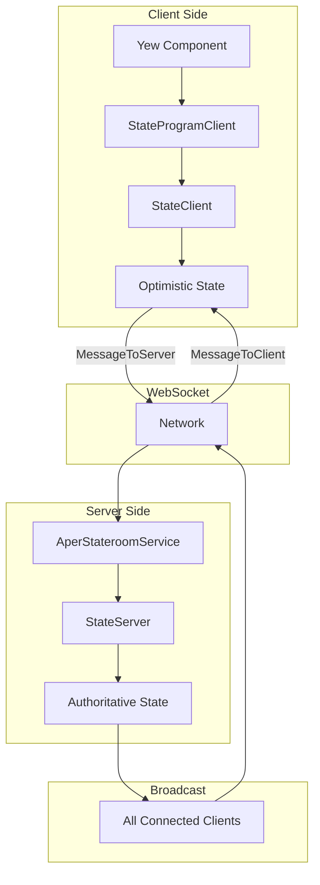

# Driftingspace/Aper: Complete Exploration

## Overview

**Aper** is a Rust library for synchronizing state across multiple clients in real-time using **state machines**. The core innovation is representing all application state as deterministic state machines where transitions are serialized and broadcast to all clients, ensuring consistent state across the network.

### Why This Exploration Exists

This is a **complete textbook** that takes you from zero real-time synchronization knowledge to understanding how to build and deploy production real-time collaborative applications with Rust.

### Key Characteristics

| Aspect | Aper |
|--------|------|
| **Core Innovation** | State machine synchronization over WebSockets |
| **Dependencies** | serde, uuid, fractional_index, im-rc |
| **Lines of Code** | ~2,000 (core library) |
| **Purpose** | Real-time state synchronization for multi-user applications |
| **Architecture** | StateMachine trait, StateClient/StateServer, Stateroom integration |
| **Runtime** | Native Rust, WebAssembly (wasm-bindgen), WebSockets |
| **Use Cases** | Multiplayer games, collaborative apps, real-time dashboards |

---

## Complete Table of Contents

This exploration consists of multiple deep-dive documents. Read them in order for complete understanding:

### Part 1: Foundations
1. **[Zero to Real-Time Engineer](00-zero-to-realtime-engineer.md)** - Start here if new to real-time sync
   - What is state synchronization?
   - Centralized vs peer-to-peer architectures
   - Deterministic state machines
   - Transition-based updates
   - CRDTs vs state machines

### Part 2: Core Implementation
2. **[Aper Architecture](01-aper-architecture-deep-dive.md)**
   - StateMachine trait and derive macro
   - Transition and Conflict types
   - NeverConflict for simple types
   - Deterministic apply() method

3. **[Data Structures Deep Dive](02-data-structures-deep-dive.md)**
   - Atom and AtomRc (atomic replacements)
   - Counter (increment/decrement)
   - List (CRDT-style ordered lists)
   - Map (key-value state machines)
   - Constant (immutable values)

4. **[Sync Protocol Deep Dive](03-sync-protocol-deep-dive.md)**
   - StateClient and StateServer
   - MessageToServer/MessageToClient
   - Version numbers and transition tracking
   - Optimistic state updates
   - Conflict handling

5. **[Stateroom Integration Deep Dive](04-stateroom-deep-dive.md)**
   - StateProgram trait
   - TransitionEvent with timestamps
   - AperStateroomService
   - Timer-based transitions
   - Client identification

6. **[Yew Frontend Deep Dive](05-yew-frontend-deep-dive.md)**
   - StateProgramComponent
   - StateProgramViewComponent
   - WebSocket client connection
   - Session persistence
   - Reactive rendering

### Part 3: Rust Patterns
7. **[Rust Revision](rust-revision.md)**
   - Ownership patterns for state machines
   - Rc for shared state
   - Serde serialization strategies
   - Type-level determinism guarantees
   - Code examples

### Part 4: Production
8. **[Production-Grade Implementation](production-grade.md)**
   - Performance optimizations
   - Memory management
   - Connection pooling
   - State persistence
   - Monitoring and observability

9. **[Valtron Integration](05-valtron-integration.md)**
   - Lambda deployment patterns
   - HTTP API compatibility
   - Request/response types
   - Production deployment (NO async/tokio)

---

## Quick Reference: Aper Architecture

### High-Level Flow



### Component Summary

| Component | Lines | Purpose | Deep Dive |
|-----------|-------|---------|-----------|
| StateMachine Trait | 50 | Core trait for state machines | [Aper Architecture](01-aper-architecture-deep-dive.md) |
| Data Structures | 400 | Atom, List, Map, Counter | [Data Structures](02-data-structures-deep-dive.md) |
| Sync Protocol | 200 | Client/Server message handling | [Sync Protocol](03-sync-protocol-deep-dive.md) |
| Stateroom | 250 | Server integration | [Stateroom](04-stateroom-deep-dive.md) |
| Yew Frontend | 200 | WebAssembly UI | [Yew Frontend](05-yew-frontend-deep-dive.md) |
| WebSocket Client | 100 | Typed WebSocket connection | [Sync Protocol](03-sync-protocol-deep-dive.md) |

---

## File Structure

```
aper/
├── aper/                          # Core library
│   ├── src/
│   │   ├── lib.rs                 # StateMachine trait, NeverConflict
│   │   ├── data_structures/
│   │   │   ├── mod.rs             # Exports all data structures
│   │   │   ├── atom.rs            # Atom<T> - atomic replacements
│   │   │   ├── atom_rc.rs         # AtomRc<T> - Rc-based atoms
│   │   │   ├── constant.rs        # Constant<T> - immutable values
│   │   │   ├── counter.rs         # Counter - increment/decrement
│   │   │   ├── list.rs            # List<T> - CRDT-style lists
│   │   │   └── map.rs             # Map<K,V> - key-value state machines
│   │   └── sync/
│   │       ├── mod.rs             # Sync module exports
│   │       ├── messages.rs        # MessageToServer/MessageToClient
│   │       ├── client.rs          # StateClient implementation
│   │       └── server.rs          # StateServer implementation
│   │
│   ├── aper_derive/               # Procedural derive macro
│   │   └── src/lib.rs             # StateMachine derive implementation
│   │
│   ├── aper-stateroom/            # Server integration
│   │   ├── src/
│   │   │   ├── lib.rs             # AperStateroomService
│   │   │   ├── state_program.rs   # StateProgram trait
│   │   │   └── state_program_client.rs # StateProgramClient
│   │
│   ├── aper-yew/                  # Yew (WebAssembly) frontend
│   │   ├── src/
│   │   │   ├── lib.rs             # StateProgramComponent
│   │   │   ├── view.rs            # StateProgramViewComponent
│   │   │   └── update_interval.rs # Timer utilities
│   │
│   ├── aper-serve/                # Server binary
│   │   └── src/lib.rs             # serve() function
│   │
│   ├── aper-websocket-client/     # WebSocket client
│   │   └── src/
│   │       ├── client.rs          # AperWebSocketStateProgramClient
│   │       ├── typed.rs           # TypedWebsocketConnection
│   │       └── websocket.rs       # Raw WebSocket handling
│   │
│   └── examples/
│       ├── counter/               # Simple counter example
│       ├── drop-four/             # Connect Four game
│       └── timer/                 # Timer example
```

---

## How to Use This Exploration

### For Complete Beginners (Zero Real-Time Sync Experience)

1. Start with **[00-zero-to-realtime-engineer.md](00-zero-to-realtime-engineer.md)**
2. Read each section carefully, work through examples
3. Continue through all deep dives in order
4. Implement along with the explanations
5. Finish with production-grade and valtron integration

**Time estimate:** 20-40 hours for complete understanding

### For Experienced Rust Developers

1. Skim [00-zero-to-realtime-engineer.md](00-zero-to-realtime-engineer.md) for context
2. Deep dive into areas of interest (state machines, sync protocol, CRDTs)
3. Review [rust-revision.md](rust-revision.md) for advanced patterns
4. Check [production-grade.md](production-grade.md) for deployment considerations

### For Game Developers

1. Review [drop-four example](src.driftingspace/aper/examples/drop-four/) directly
2. Use deep dives as reference for specific components
3. Study the Board and PlayState implementations
4. Extract insights for your own game logic

---

## Running Aper

```bash
# Navigate to an example
cd /path/to/aper/examples/counter

# Build and run the service (server)
cargo run --package counter-service

# Build and serve the client (WASM)
# In another terminal, serve the static files
cargo install basic-http-server
basic-http-server examples/counter/static
```

### Example Counter Application

```rust
// Common code (shared between client and server)
use aper::{StateMachine, NeverConflict};
use serde::{Serialize, Deserialize};

#[derive(Serialize, Deserialize, Clone, Debug, Default)]
pub struct Counter { value: i64 }

#[derive(Serialize, Deserialize, Clone, Debug, PartialEq)]
pub enum CounterTransition {
    Add(i64),
    Subtract(i64),
    Reset,
}

impl StateMachine for Counter {
    type Transition = CounterTransition;
    type Conflict = NeverConflict;

    fn apply(&self, event: &CounterTransition) -> Result<Self, NeverConflict> {
        let mut new_self = self.clone();
        match event {
            CounterTransition::Add(i) => new_self.value += i,
            CounterTransition::Subtract(i) => new_self.value -= i,
            CounterTransition::Reset => new_self.value = 0,
        }
        Ok(new_self)
    }
}
```

---

## Key Insights

### 1. Deterministic State Machines

The core requirement is that `apply()` must be deterministic:

```rust
// GOOD: Pure function, depends only on self and transition
fn apply(&self, transition: &Transition) -> Result<Self, Conflict> {
    Ok(Self { value: self.value + transition.amount })
}

// BAD: Uses external state (time, random, etc.)
fn apply(&self, transition: &Transition) -> Result<Self, Conflict> {
    // DON'T DO THIS - breaks synchronization!
    Ok(Self { value: self.value + std::time::now().timestamp() })
}
```

### 2. Transition-Based Updates

All state changes flow through transitions:

```rust
// Construct a transition (does NOT change state)
let transition = counter.add(5);

// Apply transition to change state
counter = counter.apply(&transition).unwrap();
```

### 3. Optimistic State on Client

Clients update immediately, server is authoritative:

```
Client state flow:
1. User clicks "+1"
2. Client applies transition locally (optimistic)
3. Client sends transition to server
4. Server applies and broadcasts
5. Client receives confirmation
6. If conflict: request full state reset
```

### 4. Version Tracking

Every state change has a version number:

```rust
pub struct StateVersionNumber(pub u32);

// Server increments on each transition
self.version.0 += 1;

// Clients track peer transitions
MessageToClient::PeerTransition {
    transition,
    version: StateVersionNumber(42),
}
```

### 5. Stateroom for Server Integration

Stateroom provides WebSocket server infrastructure:

```rust
impl<P: StateProgram + Default> SimpleStateroomService for AperStateroomService<P> {
    fn connect(&mut self, client_id: ClientId, ctx: &impl StateroomContext) {
        // Send initial state to connecting client
        let response = StateProgramMessage::InitialState { ... };
        ctx.send_message(MessageRecipient::Client(client_id), ...);
    }

    fn message(&mut self, client_id: ClientId, message: &str, ctx: &impl StateroomContext) {
        // Process transitions from clients
        let message: MessageToServer<P> = serde_json::from_str(message).unwrap();
        self.process_message(message, Some(client_id), ctx);
    }
}
```

---

## From Aper to Real-Time Applications

| Aspect | Aper | Production Systems |
|--------|------|-------------------|
| Transport | WebSocket | WebSocket, WebRTC, QUIC |
| Server | Stateroom (single-node) | Distributed clusters |
| State | In-memory | Redis, PostgreSQL |
| Scale | ~100 concurrent users | Millions |
| Persistence | Optional | Required |

**Key takeaway:** The core patterns (deterministic state machines, transition broadcasting, version tracking) scale with infrastructure changes.

---

## Your Path Forward

### To Build Real-Time Sync Skills

1. **Implement a custom StateMachine** (e.g., a todo list)
2. **Build a multi-player game** (like drop-four)
3. **Add persistence** (save state to database)
4. **Deploy with Valtron** (Lambda deployment)
5. **Study CRDTs** (alternative approach)

### Recommended Resources

- [Aper Documentation](https://aper.dev)
- [Stateroom README](https://github.com/drifting-in-space/stateroom)
- [CRDT Papers](https://crdt.tech/papers.html)
- [Yew Documentation](https://yew.rs)

---

## Document History

| Date | Change |
|------|--------|
| 2026-03-27 | Initial exploration created |
| 2026-03-27 | Deep dives 00-05 outlined |
| 2026-03-27 | Rust revision and production-grade planned |

---

*This exploration is a living document. Revisit sections as concepts become clearer through implementation.*
