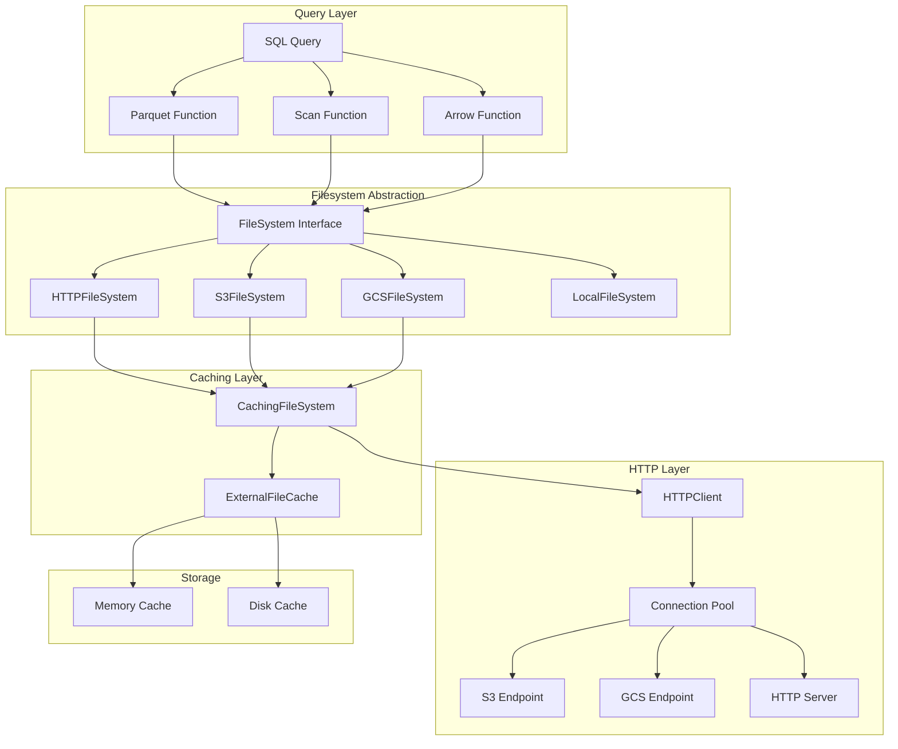

# Deep Dive: Object Storage Integration (S3, GCS, HTTP FS)

## Overview

This deep dive examines DuckDB's object storage integration, covering HTTP FS, S3, and Google Cloud Storage connectors. We explore the caching layer, read algorithms, credential management, and optimization techniques for querying data directly from cloud storage.

## Architecture



## FileSystem Abstraction Layer

### Core Interface

```cpp
// src/include/storage/filesystem.hpp

class FileSystem {
public:
    virtual ~FileSystem() = default;
    
    /// Open a file for reading
    virtual unique_ptr<FileHandle> OpenFile(
        const string &path, 
        FileOpenFlags flags
    ) = 0;
    
    /// Check if file exists
    virtual bool FileExists(const string &path) = 0;
    
    /// Get file size
    virtual int64_t GetFileSize(const string &path) = 0;
    
    /// Get last modified time
    virtual timestamp_t GetLastModifiedTime(const string &path) = 0;
    
    /// List files in directory (glob support)
    virtual vector<string> Glob(const string &path) = 0;
    
    /// Check if path is remote (HTTP/S3/GCS)
    virtual bool IsRemote() const = 0;
    
    /// Check if filesystem supports seek
    virtual bool CanSeek() const = 0;
    
    /// Check if filesystem is read-only
    virtual bool IsReadOnly() const = 0;
};

enum class FileOpenFlags {
    NONE = 0,
    READ_ONLY = 1,
    WRITE_ONLY = 2,
    READ_WRITE = 3,
    FILE_NOT_FOUND_SILENT = 4,
    DIRECT_IO = 8,
    COMPRESSED = 16
};
```

### HTTPFileSystem Implementation

```cpp
// src/storage/filesystem/httpfs.cpp

class HTTPFileSystem : public FileSystem {
private:
    HTTPConfig config;
    unique_ptr<HTTPClientPool> connection_pool;
    
public:
    HTTPFileSystem(HTTPConfig config) 
        : config(std::move(config)) {
        connection_pool = make_unique<HTTPClientPool>(
            config.max_connections
        );
    }
    
    unique_ptr<FileHandle> OpenFile(
        const string &path, 
        FileOpenFlags flags
    ) override {
        if (!IsHTTP(path) && !IsS3(path) && !IsGCS(path)) {
            throw IOException("Invalid HTTP(S) URL");
        }
        
        auto parsed = ParseURL(path);
        auto client = connection_pool->GetClient(parsed.host);
        
        // Send HEAD request to get file info
        auto head_response = client->SendHeadRequest(path);
        if (head_response.status != 200) {
            throw IOException("HTTP HEAD failed: " + 
                              to_string(head_response.status));
        }
        
        auto file_size = ParseContentLength(head_response.headers);
        auto last_modified = ParseLastModified(head_response.headers);
        
        return make_unique<HTTPFileHandle>(
            path,
            std::move(client),
            file_size,
            last_modified,
            flags
        );
    }
    
    bool IsRemote() const override { return true; }
    bool CanSeek() const override { return true; } // Via Range requests
    bool IsReadOnly() const override { return true; }
    
    /// Check if path is S3 URL
    static bool IsS3(const string &path) {
        return path.rfind("s3://", 0) == 0 || 
               path.rfind("s3a://", 0) == 0;
    }
    
    /// Check if path is GCS URL
    static bool IsGCS(const string &path) {
        return path.rfind("gs://", 0) == 0 ||
               path.rfind("gcs://", 0) == 0;
    }
    
    /// Parse URL into components
    static ParsedURL ParseURL(const string &url) {
        ParsedURL result;
        
        if (IsS3(url)) {
            return ParseS3URL(url);
        } else if (IsGCS(url)) {
            return ParseGCSURL(url);
        } else {
            return ParseHTTPURL(url);
        }
    }
    
private:
    /// Parse S3 URL: s3://bucket/key or s3://access_key:secret@bucket/key
    static ParsedURL ParseS3URL(const string &url) {
        ParsedURL result;
        result.protocol = "https";
        
        // Remove s3:// prefix
        auto path = url.substr(5);
        
        // Check for credentials
        auto at_pos = path.find('@');
        if (at_pos != string::npos) {
            auto creds = path.substr(0, at_pos);
            auto colon_pos = creds.find(':');
            result.access_key = creds.substr(0, colon_pos);
            result.secret_key = creds.substr(colon_pos + 1);
            path = path.substr(at_pos + 1);
        }
        
        // Extract bucket and key
        auto slash_pos = path.find('/');
        result.host = path.substr(0, slash_pos) + ".s3.amazonaws.com";
        result.path = "/" + path.substr(slash_pos + 1);
        
        return result;
    }
    
    /// Parse GCS URL: gs://bucket/key
    static ParsedURL ParseGCSURL(const string &url) {
        ParsedURL result;
        result.protocol = "https";
        
        // Remove gs:// prefix
        auto path = url.substr(5);
        
        // Extract bucket and key
        auto slash_pos = path.find('/');
        result.host = path.substr(0, slash_pos) + ".storage.googleapis.com";
        result.path = "/" + path.substr(slash_pos + 1);
        
        return result;
    }
};

struct ParsedURL {
    string protocol;
    string host;
    string path;
    string access_key;
    string secret_key;
    string region;
};
```

## Caching FileSystem

### CachingFileSystem Wrapper

```cpp
// src/storage/filesystem/caching_filesystem.cpp

class CachingFileSystem : public FileSystem {
private:
    shared_ptr<FileSystem> base_filesystem;
    ExternalFileCache cache;
    bool owns_base;
    
public:
    CachingFileSystem(
        shared_ptr<FileSystem> base,
        size_t cache_size = DEFAULT_CACHE_SIZE,
        bool owns = false
    ) : base_filesystem(std::move(base)),
        cache(cache_size),
        owns_base(owns) {}
    
    unique_ptr<FileHandle> OpenFile(
        const string &path,
        FileOpenFlags flags
    ) override {
        auto base_handle = base_filesystem->OpenFile(path, flags);
        
        return make_unique<CachedFileHandle>(
            path,
            std::move(base_handle),
            cache,
            flags
        );
    }
    
    /// Prefetch file ranges asynchronously
    void PrefetchRanges(
        const string &path,
        const vector<FileRange> &ranges
    ) {
        // Prefetch in background thread pool
        for (const auto &range : ranges) {
            cache.PrefetchAsync(path, range.offset, range.length);
        }
    }
    
    /// Get cache statistics
    CacheStats GetStats() const {
        return cache.GetStats();
    }
};

struct FileRange {
    idx_t offset;
    idx_t length;
    
    bool Overlaps(const FileRange &other) const {
        return offset < other.offset + other.length &&
               other.offset < offset + length;
    }
};
```

### ExternalFileCache Implementation

```cpp
// src/storage/filesystem/external_file_cache.cpp

class ExternalFileCache {
private:
    struct CacheEntry {
        string key;           // "path:offset:length"
        shared_ptr<data_ptr_t> data;
        idx_t hits;           // Access count
        idx_t last_access;    // Timestamp
        bool pinned;          // Cannot evict
    };
    
    size_t max_memory;
    atomic<size_t> used_memory;
    unordered_map<string, CacheEntry> entries;
    mutex lock;
    
    // Clock-sweep eviction
    idx_t clock_hand;
    vector<string> eviction_order;
    
    // Async prefetch queue
    ConcurrentQueue<PrefetchTask> prefetch_queue;
    std::thread prefetch_thread;
    
public:
    ExternalFileCache(size_t max_size) 
        : max_memory(max_size),
          used_memory(0),
          clock_hand(0) {
        // Start prefetch thread
        prefetch_thread = std::thread([this]() {
            PrefetchWorker();
        });
    }
    
    ~ExternalFileCache() {
        prefetch_queue.Close();
        prefetch_thread.join();
    }
    
    /// Get cached data or fetch from base filesystem
    shared_ptr<data_ptr_t> Get(
        const string &path,
        idx_t offset,
        idx_t length,
        const std::function<data_ptr_t(idx_t, idx_t)> &fetch_fn
    ) {
        auto key = MakeKey(path, offset, length);
        
        // Try cache hit
        {
            std::lock_guard<mutex> guard(lock);
            auto it = entries.find(key);
            if (it != entries.end()) {
                it->second.hits++;
                it->second.last_access = GetCurrentTime();
                return it->second.data;
            }
        }
        
        // Cache miss - fetch data
        auto data = fetch_fn(offset, length);
        
        // Insert into cache
        Insert(key, data, length);
        
        return data;
    }
    
    /// Async prefetch (non-blocking)
    void PrefetchAsync(
        const string &path,
        idx_t offset,
        idx_t length
    ) {
        prefetch_queue.Enqueue(PrefetchTask{path, offset, length});
    }
    
    /// Pin file in cache (prevent eviction)
    void Pin(const string &path) {
        std::lock_guard<mutex> guard(lock);
        for (auto &[key, entry] : entries) {
            if (key.find(path) == 0) {
                entry.pinned = true;
            }
        }
    }
    
    /// Unpin file (allow eviction)
    void Unpin(const string &path) {
        std::lock_guard<mutex> guard(lock);
        for (auto &[key, entry] : entries) {
            if (key.find(path) == 0) {
                entry.pinned = false;
            }
        }
    }
    
    /// Clear cache for specific path
    void ClearPath(const string &path) {
        std::lock_guard<mutex> guard(lock);
        for (auto it = entries.begin(); it != entries.end();) {
            if (it->first.find(path) == 0) {
                used_memory -= it->second.data->size();
                it = entries.erase(it);
            } else {
                ++it;
            }
        }
    }
    
private:
    void Insert(const string &key, shared_ptr<data_ptr_t> data, idx_t size) {
        std::lock_guard<mutex> guard(lock);
        
        // Evict if necessary
        while (used_memory + size > max_memory) {
            if (!EvictOne()) {
                break; // Nothing more to evict
            }
        }
        
        entries[key] = CacheEntry{
            key,
            data,
            0,  // hits
            GetCurrentTime(),
            false  // pinned
        };
        used_memory += size;
    }
    
    /// Evict one entry using clock-sweep
    bool EvictOne() {
        if (eviction_order.empty()) {
            return false;
        }
        
        // Clock-sweep: skip recently accessed and pinned
        const int MAX_SWEEPS = eviction_order.size();
        int sweeps = 0;
        
        while (sweeps < MAX_SWEEPS) {
            clock_hand = (clock_hand + 1) % eviction_order.size();
            auto &key = eviction_order[clock_hand];
            
            auto it = entries.find(key);
            if (it == entries.end()) {
                continue; // Already evicted
            }
            
            auto &entry = it->second;
            
            if (entry.pinned) {
                continue;
            }
            
            if (entry.hits > 0) {
                entry.hits--;  // Give second chance
                continue;
            }
            
            // Evict this entry
            used_memory -= entry.data->size();
            entries.erase(it);
            eviction_order.erase(eviction_order.begin() + clock_hand);
            return true;
        }
        
        return false;  // Couldn't evict anything
    }
    
    void PrefetchWorker() {
        PrefetchTask task;
        while (prefetch_queue.TryDequeue(task)) {
            // Prefetch logic here
            // This runs in background, fetching data before it's needed
        }
    }
    
    static string MakeKey(const string &path, idx_t offset, idx_t length) {
        return path + ":" + to_string(offset) + ":" + to_string(length);
    }
    
    static uint64_t GetCurrentTime() {
        return std::chrono::duration_cast<std::chrono::seconds>(
            std::chrono::system_clock::now().time_since_epoch()
        ).count();
    }
};

struct PrefetchTask {
    string path;
    idx_t offset;
    idx_t length;
};

struct CacheStats {
    size_t total_entries;
    size_t total_bytes;
    size_t hits;
    size_t misses;
    double hit_rate;
};
```

## S3FileSystem

### S3-Specific Implementation

```cpp
// src/storage/filesystem/s3fs.cpp

class S3FileSystem : public HTTPFileSystem {
private:
    S3Config config;
    unique_ptr<CredentialProvider> credential_provider;
    
public:
    S3FileSystem(S3Config config) 
        : config(std::move(config)) {
        // Initialize credential provider chain
        credential_provider = make_unique<S3CredentialChain>(
            config.region,
            config.endpoint
        );
    }
    
    unique_ptr<FileHandle> OpenFile(
        const string &path,
        FileOpenFlags flags
    ) override {
        auto parsed = ParseS3URL(path);
        
        // Get credentials
        auto credentials = credential_provider->GetCredentials();
        
        // Build S3 client
        auto client = CreateS3Client(credentials);
        
        // HeadObject to get file info
        auto head_result = client->HeadObject(
            parsed.bucket,
            parsed.key
        );
        
        return make_unique<S3FileHandle>(
            path,
            std::move(client),
            parsed.bucket,
            parsed.key,
            head_result.content_length,
            flags
        );
    }
    
    /// List objects with prefix (glob support)
    vector<string> Glob(const string &path) override {
        auto parsed = ParseS3URL(path);
        auto credentials = credential_provider->GetCredentials();
        auto client = CreateS3Client(credentials);
        
        vector<string> results;
        string continuation_token;
        
        do {
            auto list_result = client->ListObjectsV2(
                parsed.bucket,
                parsed.prefix,
                continuation_token
            );
            
            for (const auto &obj : list_result.objects) {
                results.push_back("s3://" + parsed.bucket + "/" + obj.key);
            }
            
            continuation_token = list_result.next_continuation_token;
        } while (!continuation_token.empty());
        
        return results;
    }
    
private:
    /// S3 credential provider chain
    class S3CredentialChain : public CredentialProvider {
    private:
        vector<unique_ptr<CredentialProvider>> providers;
        
    public:
        S3CredentialChain(const string &region, const string &endpoint) {
            // Chain: Environment -> Config File -> EC2 IAM -> Default
            providers.push_back(
                make_unique<EnvironmentCredentialProvider>()
            );
            providers.push_back(
                make_unique<ConfigFileCredentialProvider>()
            );
            providers.push_back(
                make_unique<EC2InstanceCredentialProvider>(region)
            );
        }
        
        AWSCredentials GetCredentials() override {
            for (auto &provider : providers) {
                auto creds = provider->GetCredentials();
                if (creds.IsValid()) {
                    return creds;
                }
            }
            throw AuthenticationException("No valid credentials found");
        }
    };
};

struct S3Config {
    string region;
    string endpoint;
    string access_key_id;
    string secret_access_key;
    string session_token;
    bool use_ssl = true;
    int max_connections = 10;
    int request_timeout_ms = 30000;
};

struct AWSCredentials {
    string access_key_id;
    string secret_access_key;
    string session_token;
    timestamp_t expiration;
    
    bool IsValid() const {
        return !access_key_id.empty() && 
               !secret_access_key.empty() &&
               (expiration == timestamp_t() || expiration > Now());
    }
};
```

### S3 Range Request Optimization

```cpp
// src/storage/filesystem/s3_file_handle.cpp

class S3FileHandle : public FileHandle {
private:
    unique_ptr<S3Client> client;
    string bucket;
    string key;
    idx_t file_size;
    
    // Read buffer
    unique_ptr<data_ptr_t> buffer;
    idx_t buffer_offset;
    idx_t buffer_size;
    
    // Statistics for optimization
    struct ReadStats {
        idx_t total_reads;
        idx_t sequential_reads;
        idx_t random_reads;
        idx_t last_read_end;
    } read_stats;
    
public:
    S3FileHandle(
        const string &path,
        unique_ptr<S3Client> client,
        const string &bucket,
        const string &key,
        idx_t file_size,
        FileOpenFlags flags
    ) : FileHandle(path, flags),
        client(std::move(client)),
        bucket(bucket),
        key(key),
        file_size(file_size),
        buffer_offset(0),
        buffer_size(0) {}
    
    /// Read with intelligent prefetching
    void Read(void *destination, idx_t read_size, idx_t offset) {
        read_stats.total_reads++;
        
        // Detect sequential vs random access
        if (offset == read_stats.last_read_end) {
            read_stats.sequential_reads++;
        } else {
            read_stats.random_reads++;
        }
        read_stats.last_read_end = offset + read_size;
        
        // Check if data is in buffer
        if (offset >= buffer_offset && 
            offset + read_size <= buffer_offset + buffer_size) {
            // Buffer hit
            memcpy(destination, 
                   buffer.get() + (offset - buffer_offset), 
                   read_size);
            return;
        }
        
        // Buffer miss - determine optimal read strategy
        if (IsSequentialAccess()) {
            // Sequential: read ahead with large prefetch
            PrefetchRead(destination, read_size, offset);
        } else {
            // Random: direct read with minimal buffering
            DirectRead(destination, read_size, offset);
        }
    }
    
    /// Get recommended read size for this file
    idx_t GetOptimalReadSize() const {
        // For small files (< 10MB), read entire file
        if (file_size < 10 * 1024 * 1024) {
            return file_size;
        }
        
        // For large files, use 8MB chunks (S3 optimal)
        return 8 * 1024 * 1024;
    }
    
    /// Get recommended prefetch size
    idx_t GetPrefetchSize() const {
        if (IsSequentialAccess()) {
            // Aggressive prefetch for sequential access
            return GetOptimalReadSize() * 2;
        }
        return 0; // No prefetch for random access
    }
    
private:
    /// Check if access pattern is sequential
    bool IsSequentialAccess() const {
        if (read_stats.total_reads < 10) {
            return true; // Default to sequential initially
        }
        
        auto sequential_ratio = 
            double(read_stats.sequential_reads) / read_stats.total_reads;
        
        return sequential_ratio > 0.8; // 80%+ sequential
    }
    
    /// Read ahead with prefetch
    void PrefetchRead(void *destination, idx_t read_size, idx_t offset) {
        auto optimal_size = GetOptimalReadSize();
        auto prefetch_size = std::max(optimal_size, read_size * 2);
        auto prefetch_end = std::min(offset + prefetch_size, file_size);
        
        // Allocate buffer if needed
        auto buffer_capacity = prefetch_end - offset;
        if (!buffer || buffer_capacity > buffer_size) {
            buffer = make_unique<data_ptr_t>(buffer_capacity);
            buffer_size = buffer_capacity;
        }
        
        // Read from S3 with range request
        auto range = FormatRangeHeader(offset, prefetch_end - 1);
        auto response = client->GetObjectWithRange(bucket, key, range);
        
        // Fill buffer
        memcpy(buffer.get(), response.data.data(), response.data.size());
        buffer_offset = offset;
        
        // Copy requested portion
        memcpy(destination, 
               buffer.get(), 
               read_size);
    }
    
    /// Direct read without buffering
    void DirectRead(void *destination, idx_t read_size, idx_t offset) {
        auto range = FormatRangeHeader(offset, offset + read_size - 1);
        auto response = client->GetObjectWithRange(bucket, key, range);
        memcpy(destination, response.data.data(), read_size);
    }
    
    static string FormatRangeHeader(idx_t start, idx_t end) {
        return "bytes=" + to_string(start) + "-" + to_string(end);
    }
};
```

## HTTP Client Pool

### Connection Pool Implementation

```cpp
// src/storage/http/http_client.cpp

class HTTPClientPool {
private:
    struct PoolEntry {
        unique_ptr<HTTPClient> client;
        bool in_use;
        timestamp_t last_used;
        idx_t use_count;
    };
    
    size_t max_connections_per_host;
    unordered_map<string, vector<PoolEntry>> pools;
    mutex lock;
    
    // Connection timeout
    duration_t connection_timeout;
    duration_t idle_timeout;
    
public:
    HTTPClientPool(
        size_t max_conns,
        duration_t conn_timeout = 30s,
        duration_t idle_timeout = 300s
    ) : max_connections_per_host(max_conns),
        connection_timeout(conn_timeout),
        idle_timeout(idle_timeout) {}
    
    /// Get a client from pool (blocks if none available)
    shared_ptr<HTTPClient> GetClient(const string &host) {
        std::unique_lock<mutex> guard(lock);
        
        auto &pool = pools[host];
        
        // Try to find available client
        for (auto &entry : pool) {
            if (!entry.in_use) {
                entry.in_use = true;
                entry.last_used = Now();
                entry.use_count++;
                return shared_ptr<HTTPClient>(
                    entry.client.get(),
                    [this, &entry](HTTPClient*) {
                        ReleaseClient(entry);
                    }
                );
            }
        }
        
        // No available client - create new or wait
        if (pool.size() < max_connections_per_host) {
            // Create new connection
            auto client = CreateClient(host);
            pool.push_back(PoolEntry{
                std::move(client),
                true,  // in_use
                Now(),
                1
            });
            return shared_ptr<HTTPClient>(
                pool.back().client.get(),
                [this, &pool](HTTPClient*) {
                    ReleaseClient(pool.back());
                }
            );
        }
        
        // Pool exhausted - wait for release
        // (In real implementation, use condition_variable)
        throw IOException("Connection pool exhausted");
    }
    
    /// Close idle connections
    void CloseIdleConnections() {
        std::lock_guard<mutex> guard(lock);
        auto now = Now();
        
        for (auto &[host, pool] : pools) {
            for (auto it = pool.begin(); it != pool.end();) {
                if (!it->in_use && 
                    (now - it->last_used) > idle_timeout) {
                    it = pool.erase(it);
                } else {
                    ++it;
                }
            }
        }
    }
    
private:
    void ReleaseClient(PoolEntry &entry) {
        std::lock_guard<mutex> guard(lock);
        entry.in_use = false;
        entry.last_used = Now();
    }
    
    unique_ptr<HTTPClient> CreateClient(const string &host) {
        // Create HTTP client with TLS
        auto client = make_unique<HTTPClient>();
        client->SetConnectTimeout(connection_timeout);
        client->SetUserAgent("DuckDB/" + DUCKDB_VERSION);
        return client;
    }
};

class HTTPClient {
private:
    // libcurl or native HTTP client
    void *curl_handle;
    string base_url;
    map<string, string> headers;
    
public:
    HTTPResponse SendGetRequest(const string &path) {
        auto url = base_url + path;
        // libcurl implementation
    }
    
    HTTPResponse SendHeadRequest(const string &path) {
        auto url = base_url + path;
        // HEAD request for metadata
    }
    
    HTTPResponse SendGetWithRange(
        const string &path, 
        const string &range
    ) {
        auto url = base_url + path;
        headers["Range"] = range;
        // Range request
    }
};
```

## Read Path Optimization

### Multi-Range Request Coalescing

```cpp
// src/storage/filesystem/read_optimizer.cpp

class ReadOptimizer {
private:
    struct PendingRead {
        idx_t offset;
        idx_t length;
        void *destination;
        std::promise<void> promise;
    };
    
    static constexpr idx_t COALESCE_THRESHOLD = 1024 * 1024; // 1MB
    static constexpr idx_t MAX_RANGE_COUNT = 100;
    
public:
    /// Queue multiple reads and coalesce into optimal range requests
    void QueueRead(
        FileHandle *handle,
        void *destination,
        idx_t length,
        idx_t offset
    ) {
        // Add to pending reads
        pending_reads.push_back(PendingRead{
            offset, length, destination
        });
        
        // Schedule batch execution
        if (pending_reads.size() >= MAX_BATCH_SIZE) {
            ExecuteBatch();
        }
    }
    
    /// Execute batched reads with coalescing
    void ExecuteBatch() {
        if (pending_reads.empty()) {
            return;
        }
        
        // Sort by offset
        std::sort(pending_reads.begin(), pending_reads.end(),
            [](const auto &a, const auto &b) {
                return a.offset < b.offset;
            });
        
        // Coalesce overlapping/adjacent reads
        vector<ReadRange> ranges;
        idx_t current_start = pending_reads[0].offset;
        idx_t current_end = current_start + pending_reads[0].length;
        
        for (size_t i = 1; i < pending_reads.size(); i++) {
            auto &read = pending_reads[i];
            
            if (read.offset <= current_end + COALESCE_THRESHOLD) {
                // Merge into current range
                current_end = std::max(current_end, read.offset + read.length);
            } else {
                // Finalize current range, start new one
                ranges.push_back({current_start, current_end - current_start});
                current_start = read.offset;
                current_end = read.offset + read.length;
            }
        }
        ranges.push_back({current_start, current_end - current_start});
        
        // Execute range requests in parallel
        vector<std::future<data_ptr_t>> futures;
        for (const auto &range : ranges) {
            futures.push_back(async_fetch_range(range.offset, range.length));
        }
        
        // Distribute data to requesters
        DistributeData(ranges, futures);
        
        pending_reads.clear();
    }
    
private:
    vector<PendingRead> pending_reads;
    static constexpr size_t MAX_BATCH_SIZE = 100;
};

struct ReadRange {
    idx_t offset;
    idx_t length;
};
```

## Conclusion

DuckDB's object storage integration provides:

1. **Unified FileSystem Interface**: Single abstraction for local, HTTP, S3, GCS
2. **Intelligent Caching**: Two-level cache (memory + disk) with clock-sweep eviction
3. **Range Request Optimization**: Coalescing, prefetching, sequential detection
4. **Credential Management**: Provider chain for AWS, GCP, environment, config
5. **Connection Pooling**: Per-host pools with timeouts and idle cleanup
6. **Async Prefetch**: Background prefetching based on access patterns
