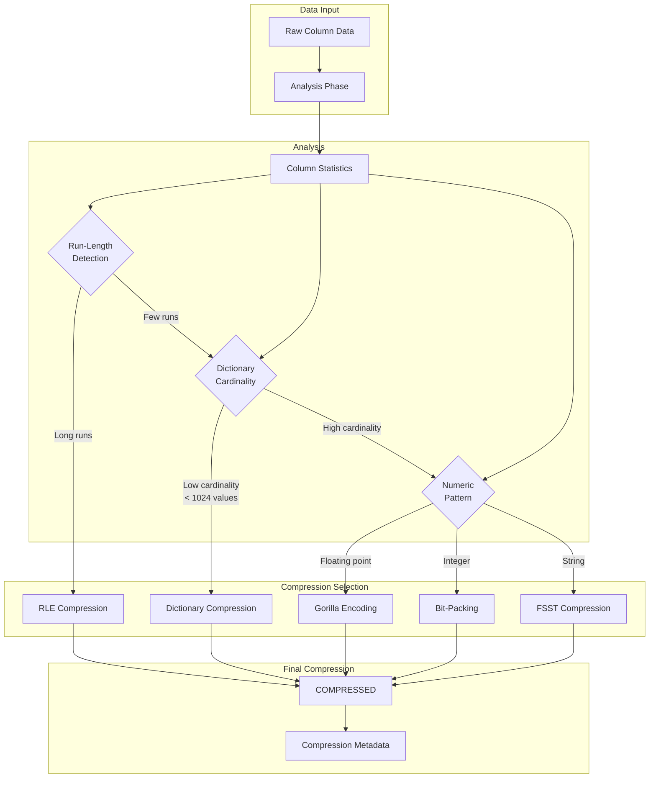

# Deep Dive: Compression Algorithms

## Overview

This deep dive examines DuckDB's compression algorithms, covering FSST (Fast Static Symbol Table), Run-Length Encoding, Dictionary Compression, Bit-Packing, Gorilla encoding, and the auto-selection logic that chooses the optimal compression per column segment.

## Architecture



## Compression Interface

```cpp
// src/include/storage/compression.hpp

enum class CompressionType : uint8_t {
    UNCOMPRESSED = 0,
    CONSTANT = 1,      // All values identical
    RLE = 2,           // Run-length encoding
    DICTIONARY = 3,    // Dictionary compression
    BITpacking = 4,    // Bit-packing
    GORILLA = 5,       // Gorilla (floating point)
    FSST = 6,          // Fast Static Symbol Table
    PDELT = 7,         // Position Delta
    ALP = 8,           // Adaptive Lossless Precision
};

class CompressionFunction {
public:
    virtual ~CompressionFunction() = default;
    
    /// Get compression type
    virtual CompressionType GetType() const = 0;
    
    /// Get compressed size
    virtual idx_t GetCompressedSize() const = 0;
    
    /// Get compression ratio
    virtual double GetRatio(idx_t original_size) const {
        return double(GetCompressedSize()) / original_size;
    }
    
    /// Create scan state for decompression
    virtual unique_ptr<CompressionScanState> InitializeScan() const = 0;
};

/// Scan state for decompression
class CompressionScanState {
protected:
    CompressionFunction *function;
    idx_t position;       // Current position in compressed data
    idx_t total_count;    // Total values
    
public:
    CompressionScanState(CompressionFunction *func, idx_t count)
        : function(func), position(0), total_count(count) {}
    
    virtual ~CompressionScanState() = default;
    
    /// Decompress next batch
    virtual void Decompress(Vector &output, idx_t count) = 0;
    
    /// Seek to position
    virtual void Seek(idx_t new_position) = 0;
    
    /// Get current position
    idx_t GetPosition() const { return position; }
};

/// Column segment with compression
struct ColumnSegment {
    CompressionType compression_type;
    unique_ptr<CompressionFunction> function;
    unique_ptr<data_ptr_t> compressed_data;
    idx_t original_count;
    idx_t original_size;
    
    /// Scan from segment
    unique_ptr<CompressionScanState> InitializeScan() const {
        return function->InitializeScan();
    }
};
```

## Run-Length Encoding (RLE)

```cpp
// src/storage/compression/rle_compression.cpp

class RLECompressionFunction : public CompressionFunction {
private:
    struct RLESegment {
        Value value;      // The repeated value
        idx_t count;      // How many times it repeats
    };
    
    vector<RLESegment> segments;
    idx_t total_count;
    
    // Packed format for storage
    struct PackedSegment {
        uint64_t value_bits;   // Value (for small types)
        uint32_t count;        // Run length
        uint8_t value_length;  // For variable-length values
    };
    
    vector<PackedSegment> packed_segments;
    vector<data_ptr_t> variable_data;  // For strings/blobs
    
public:
    CompressionType GetType() const override {
        return CompressionType::RLE;
    }
    
    idx_t GetCompressedSize() const override {
        return packed_segments.size() * sizeof(PackedSegment) +
               variable_data.size();
    }
    
    /// Compress data using RLE
    static unique_ptr<RLECompressionFunction> Compress(
        const Vector &input,
        idx_t count
    ) {
        auto function = make_unique<RLECompressionFunction>();
        function->total_count = count;
        
        idx_t i = 0;
        while (i < count) {
            RLESegment segment;
            segment.value = input.GetValue(i);
            segment.count = 1;
            
            // Count run length
            while (i + segment.count < count &&
                   input.GetValue(i + segment.count) == segment.value) {
                segment.count++;
            }
            
            function->segments.push_back(segment);
            i += segment.count;
        }
        
        // Pack segments for storage
        function->PackSegments();
        
        return function;
    }
    
    unique_ptr<CompressionScanState> InitializeScan() const override {
        return make_unique<RLEScanState>(this, total_count);
    }
    
private:
    void PackSegments() {
        for (const auto &seg : segments) {
            PackedSegment packed;
            packed.count = seg.count;
            
            if (seg.value.type().IsNumeric()) {
                // Store numeric value directly
                packed.value_bits = seg.value.GetValue<uint64_t>();
                packed.value_length = 0;
            } else {
                // Store variable-length data separately
                packed.value_length = seg.value.ToString().size();
                variable_data.insert(
                    variable_data.end(),
                    seg.value.ToBlobData(),
                    seg.value.ToBlobData() + packed.value_length
                );
            }
            
            packed_segments.push_back(packed);
        }
    }
};

/// RLE scan state for decompression
class RLEScanState : public CompressionScanState {
private:
    const RLECompressionFunction *rle;
    idx_t segment_index;      // Current segment
    idx_t position_in_segment; // Position within segment
    Value current_value;      // Cached value
    
public:
    RLEScanState(const RLECompressionFunction *func, idx_t count)
        : CompressionScanState(func, count),
          rle(func),
          segment_index(0),
          position_in_segment(0) {
        if (!rle->segments.empty()) {
            current_value = rle->segments[0].value;
        }
    }
    
    void Decompress(Vector &output, idx_t count) override {
        assert(count <= Vector::STANDARD_VECTOR_SIZE);
        
        auto output_data = output.GetData.template<T>();
        idx_t output_pos = 0;
        
        while (output_pos < count && segment_index < rle->segments.size()) {
            auto &segment = rle->segments[segment_index];
            idx_t remaining_in_segment = segment.count - position_in_segment;
            idx_t to_copy = std::min(remaining_in_segment, count - output_pos);
            
            // Copy value repeatedly
            for (idx_t i = 0; i < to_copy; i++) {
                output.SetValue(output_pos + i, segment.value);
            }
            
            output_pos += to_copy;
            position_in_segment += to_copy;
            
            // Move to next segment if needed
            if (position_in_segment >= segment.count) {
                segment_index++;
                position_in_segment = 0;
                if (segment_index < rle->segments.size()) {
                    current_value = rle->segments[segment_index].value;
                }
            }
        }
        
        position += output_pos;
        output.SetSize(output_pos);
    }
    
    void Seek(idx_t new_position) override {
        position = new_position;
        
        // Find segment containing position
        idx_t cumulative = 0;
        for (segment_index = 0; segment_index < rle->segments.size(); segment_index++) {
            if (cumulative + rle->segments[segment_index].count > new_position) {
                position_in_segment = new_position - cumulative;
                current_value = rle->segments[segment_index].value;
                return;
            }
            cumulative += rle->segments[segment_index].count;
        }
    }
};
```

## Dictionary Compression

```cpp
// src/storage/compression/dictionary_compression.cpp

class DictionaryCompressionFunction : public CompressionFunction {
private:
    // Dictionary: index -> value
    vector<Value> dictionary;
    
    // Codes: position -> dictionary index
    vector<uint16_t> codes;  // 16-bit = max 65536 dictionary entries
    
    // Statistics
    idx_t total_count;
    idx_t unique_count;
    
    // Storage format
    struct DictionaryHeader {
        uint32_t dictionary_size;  // Number of unique values
        uint32_t total_count;      // Total values
        uint8_t bits_per_code;     // Bits needed per code
        uint8_t value_type;        // Logical type
    };
    
    data_ptr_t dictionary_data;
    data_ptr_t codes_data;
    
public:
    CompressionType GetType() const override {
        return CompressionType::DICTIONARY;
    }
    
    idx_t GetCompressedSize() const override {
        return sizeof(DictionaryHeader) +
               dictionary_data.size() +
               codes_data.size();
    }
    
    /// Compress data using dictionary
    static unique_ptr<DictionaryCompressionFunction> Compress(
        const Vector &input,
        idx_t count
    ) {
        auto function = make_unique<DictionaryCompressionFunction>();
        function->total_count = count;
        
        // Build dictionary
        unordered_map<Value, uint16_t> value_to_index;
        
        function->codes.resize(count);
        
        for (idx_t i = 0; i < count; i++) {
            auto value = input.GetValue(i);
            
            auto it = value_to_index.find(value);
            if (it != value_to_index.end()) {
                // Existing value
                function->codes[i] = it->second;
            } else {
                // New value
                uint16_t new_index = function->dictionary.size();
                
                if (new_index >= 65536) {
                    // Too many unique values for dictionary
                    // Fall back to different compression
                    return nullptr;
                }
                
                value_to_index[value] = new_index;
                function->dictionary.push_back(value);
                function->codes[i] = new_index;
            }
        }
        
        function->unique_count = function->dictionary.size();
        function->Serialize();
        
        return function;
    }
    
    unique_ptr<CompressionScanState> InitializeScan() const override {
        return make_unique<DictionaryScanState>(this, total_count);
    }
    
    /// Check if dictionary compression is beneficial
    static bool ShouldUseDictionary(const Vector &input, idx_t count) {
        // Count unique values
        unordered_set<Value> unique_values;
        
        for (idx_t i = 0; i < count; i++) {
            unique_values.insert(input.GetValue(i));
            
            // Early termination: too many unique values
            if (unique_values.size() > count * 0.5 ||  // > 50% unique
                unique_values.size() > 1024) {          // Absolute limit
                return false;
            }
        }
        
        // Dictionary worthwhile if < 10% unique values
        return unique_values.size() < count * 0.1;
    }
    
private:
    void Serialize() {
        // Serialize dictionary
        for (const auto &value : dictionary) {
            auto blob = value.ToBlob();
            dictionary_data.insert(
                dictionary_data.end(),
                blob.begin(),
                blob.end()
            );
        }
        
        // Serialize codes (packed)
        auto bits_needed = BitsNeededForValue(unique_count - 1);
        codes_data.resize((codes.size() * bits_needed + 7) / 8);
        
        BitWriter writer(codes_data);
        for (idx_t code : codes) {
            writer.WriteBits(code, bits_needed);
        }
    }
    
    static uint8_t BitsNeededForValue(uint16_t max_value) {
        if (max_value <= 1) return 1;
        if (max_value <= 3) return 2;
        if (max_value <= 7) return 3;
        if (max_value <= 15) return 4;
        if (max_value <= 31) return 5;
        if (max_value <= 63) return 6;
        if (max_value <= 127) return 7;
        if (max_value <= 255) return 8;
        if (max_value <= 511) return 9;
        if (max_value <= 1023) return 10;
        if (max_value <= 2047) return 11;
        if (max_value <= 4095) return 12;
        if (max_value <= 8191) return 13;
        if (max_value <= 16383) return 14;
        if (max_value <= 32767) return 15;
        return 16;
    }
};

/// Dictionary scan state
class DictionaryScanState : public CompressionScanState {
private:
    const DictionaryCompressionFunction *dict;
    vector<Value> decoded_values;  // Cached decoded values
    idx_t decode_position;
    
public:
    DictionaryScanState(
        const DictionaryCompressionFunction *func,
        idx_t count
    ) : CompressionScanState(func, count),
        dict(func),
        decode_position(0) {
        // Pre-decode dictionary
        decoded_values.reserve(dict->dictionary.size());
        // Decode dictionary values...
    }
    
    void Decompress(Vector &output, idx_t count) override {
        idx_t output_pos = 0;
        
        while (output_pos < count && position < dict->total_count) {
            // Get code for current position
            auto code = dict->codes[position];
            
            // Look up value in dictionary
            output.SetValue(output_pos, dict->dictionary[code]);
            
            position++;
            output_pos++;
        }
        
        output.SetSize(output_pos);
    }
    
    void Seek(idx_t new_position) override {
        position = new_position;
    }
};
```

## FSST (Fast Static Symbol Table)

```cpp
// src/storage/compression/fsst_compression.cpp

class FSSTCompressionFunction : public CompressionFunction {
private:
    // Symbol table: byte -> (output_code, length)
    struct Symbol {
        uint16_t code;    // Output code (0-255 = literal, 256+ = symbol)
        uint8_t length;   // Length of symbol (1-8 bytes)
        uint8_t data[8];  // Symbol data
    };
    
    // Encode table: 256 entries for single bytes
    Symbol encode_table[256];
    
    // Decode table: code -> symbol data
    vector<Symbol> decode_table;
    
    // Compression statistics
    idx_t original_size;
    idx_t compressed_size;
    
    // FSST parameters
    static constexpr idx_t MAX_SYMBOLS = 256;
    static constexpr idx_t MAX_SYMBOL_LEN = 8;
    static constexpr idx_t TRAINING_SAMPLE_SIZE = 16384;
    
public:
    CompressionType GetType() const override {
        return CompressionType::FSST;
    }
    
    idx_t GetCompressedSize() const override {
        return compressed_size + sizeof(encode_table);
    }
    
    /// Compress data using FSST
    static unique_ptr<FSSTCompressionFunction> Compress(
        const Vector &input,
        idx_t count
    ) {
        auto function = make_unique<FSSTCompressionFunction>();
        
        // Collect training samples
        auto samples = CollectTrainingSamples(input, count);
        
        // Build symbol table from samples
        function->BuildSymbolTable(samples);
        
        // Compress data
        function->CompressData(input, count);
        
        return function;
    }
    
    unique_ptr<CompressionScanState> InitializeScan() const override {
        return make_unique<FSSTScanState>(this, original_size);
    }
    
private:
    /// Collect samples for training
    vector<string> CollectTrainingSamples(const Vector &input, idx_t count) {
        vector<string> samples;
        idx_t sample_size = 0;
        
        for (idx_t i = 0; i < count && sample_size < TRAINING_SAMPLE_SIZE; i++) {
            if (!input.IsNull(i)) {
                auto str = input.GetValue(i).ToString();
                samples.push_back(str);
                sample_size += str.size();
            }
        }
        
        return samples;
    }
    
    /// Build symbol table using greedy algorithm
    void BuildSymbolTable(const vector<string> &samples) {
        // Count byte frequencies
        uint64_t byte_freq[256] = {0};
        for (const auto &sample : samples) {
            for (uint8_t byte : sample) {
                byte_freq[byte]++;
            }
        }
        
        // Initialize encode table with literals
        for (int i = 0; i < 256; i++) {
            encode_table[i] = Symbol{
                uint16_t(i),  // Code = byte value (literal)
                1,            // Length = 1
                {uint8_t(i)}  // Data = byte
            };
        }
        
        // Count bigram frequencies
        map<pair<uint8_t, uint8_t>, uint64_t> bigram_freq;
        for (const auto &sample : samples) {
            for (idx_t i = 0; i + 1 < sample.size(); i++) {
                bigram_freq[{uint8_t(sample[i]), uint8_t(sample[i+1])}]++;
            }
        }
        
        // Greedily add best symbols
        uint16_t next_code = 256;
        
        while (next_code < MAX_SYMBOLS) {
            // Find best bigram to merge
            pair<uint8_t, uint8_t> best_bigram;
            uint64_t best_freq = 0;
            
            for (const auto &[bigram, freq] : bigram_freq) {
                if (freq > best_freq) {
                    best_freq = freq;
                    best_bigram = bigram;
                }
            }
            
            if (best_freq < 10) {
                break;  // Not worth adding more symbols
            }
            
            // Create new symbol
            Symbol new_symbol;
            new_symbol.code = next_code;
            new_symbol.data[0] = best_bigram.first;
            new_symbol.data[1] = best_bigram.second;
            new_symbol.length = 2;
            
            // Update encode table
            encode_table[best_bigram.first] = new_symbol;
            
            // Remove bigram from consideration
            bigram_freq.erase(best_bigram);
            
            next_code++;
        }
        
        // Build decode table
        decode_table.resize(next_code);
        for (int i = 0; i < 256; i++) {
            decode_table[i] = encode_table[i];
        }
    }
    
    /// Compress data
    void CompressData(const Vector &input, idx_t count) {
        original_size = 0;
        compressed_size = 0;
        
        for (idx_t i = 0; i < count; i++) {
            if (!input.IsNull(i)) {
                auto str = input.GetValue(i).ToString();
                original_size += str.size();
                compressed_size += CompressString(str);
            }
        }
    }
    
    idx_t CompressString(const string &input) {
        idx_t output_size = 0;
        idx_t i = 0;
        
        while (i < input.size()) {
            auto &symbol = encode_table[uint8_t(input[i])];
            
            if (symbol.length == 1) {
                // Literal byte
                output_size++;
                i++;
            } else {
                // Symbol
                output_size += 2;  // Code takes 2 bytes
                i += symbol.length;
            }
        }
        
        return output_size;
    }
};

/// FSST scan state
class FSSTScanState : public CompressionScanState {
private:
    const FSSTCompressionFunction *fsst;
    data_ptr_t compressed_data;
    idx_t compressed_offset;
    
public:
    FSSTScanState(const FSSTCompressionFunction *func, idx_t size)
        : CompressionScanState(func, size),
          fsst(func),
          compressed_offset(0) {}
    
    void Decompress(Vector &output, idx_t count) override {
        idx_t output_pos = 0;
        
        while (output_pos < count && compressed_offset < compressed_data.size()) {
            // Decode next string
            auto str = DecodeString();
            output.SetValue(output_pos, Value(str));
            output_pos++;
        }
        
        position += output_pos;
        output.SetSize(output_pos);
    }
    
    string DecodeString() {
        string result;
        
        while (compressed_offset < compressed_data.size()) {
            uint16_t code = ReadCode();
            
            if (code < 256) {
                // Literal
                result += char(code);
            } else {
                // Symbol
                auto &symbol = fsst->decode_table[code];
                result.append(symbol.data, symbol.data + symbol.length);
            }
            
            // End of string marker
            if (/* end marker */) {
                break;
            }
        }
        
        return result;
    }
    
    void Seek(idx_t new_position) override {
        // FSST requires sequential decoding
        // Must decompress from start to reach position
        compressed_offset = 0;
        for (idx_t i = 0; i < new_position; i++) {
            DecodeString();
        }
        position = new_position;
    }
};
```

## Gorilla Encoding (Floating Point)

```cpp
// src/storage/compression/gorilla_compression.cpp

class GorillaCompressionFunction : public CompressionFunction {
private:
    // Gorilla encoding: XOR consecutive values
    // Leading zeros + bit width + XOR bits
    
    struct EncodedBlock {
        uint32_t first_value_bits;  // First value as-is (64-bit double)
        uint32_t block_size;        // Number of values in block
        data_ptr_t control_bits;    // 2 bits per value after first
        data_ptr_t xor_bits;        // XOR data
    };
    
    vector<EncodedBlock> blocks;
    idx_t total_count;
    
    // Control bits
    static constexpr uint8_t CONTROL_SAME = 0;      // Same as previous
    static constexpr uint8_t CONTROL_XOR = 1;       // XOR with new bits
    static constexpr uint8_t CONTROL_NEW_RANGE = 2; // New significant bits
    
public:
    CompressionType GetType() const override {
        return CompressionType::GORILLA;
    }
    
    idx_t GetCompressedSize() const override {
        idx_t size = 0;
        for (const auto &block : blocks) {
            size += sizeof(uint64_t) +           // First value
                    block.control_bits.size() +  // Control bits
                    block.xor_bits.size();       // XOR data
        }
        return size;
    }
    
    /// Compress floating point data using Gorilla encoding
    static unique_ptr<GorillaCompressionFunction> Compress(
        const Vector &input,
        idx_t count
    ) {
        auto function = make_unique<GorillaCompressionFunction>();
        function->total_count = count;
        
        auto input_data = input.GetData<double>();
        
        EncodedBlock current_block;
        current_block.first_value_bits = 0;
        double previous_value = 0;
        
        for (idx_t i = 0; i < count; i++) {
            double value = input_data[i];
            
            if (i == 0) {
                // First value stored as-is
                current_block.first_value_bits = 
                    *reinterpret_cast<uint64_t*>(&value);
                current_block.block_size = 1;
                previous_value = value;
            } else {
                // XOR with previous
                uint64_t prev_bits = *reinterpret_cast<uint64_t*>(&previous_value);
                uint64_t curr_bits = *reinterpret_cast<uint64_t*>(&value);
                uint64_t xor_value = prev_bits ^ curr_bits;
                
                if (xor_value == 0) {
                    // Same as previous - use CONTROL_SAME
                    AppendControlBit(current_block, CONTROL_SAME);
                } else {
                    // Calculate significant bits
                    auto [leading_zeros, trailing_zeros] = 
                        CountSignificantBits(xor_value);
                    
                    // Append XOR bits with metadata
                    AppendXorData(current_block, xor_value, 
                                 leading_zeros, trailing_zeros);
                }
                
                current_block.block_size++;
                previous_value = value;
            }
            
            // Start new block if full
            if (current_block.block_size >= BLOCK_SIZE) {
                function->blocks.push_back(current_block);
                current_block = EncodedBlock();
            }
        }
        
        // Flush final block
        if (current_block.block_size > 0) {
            function->blocks.push_back(current_block);
        }
        
        return function;
    }
    
    unique_ptr<CompressionScanState> InitializeScan() const override {
        return make_unique<GorillaScanState>(this, total_count);
    }
    
private:
    static constexpr idx_t BLOCK_SIZE = 1024;
    
    /// Count leading and trailing zeros
    static pair<uint8_t, uint8_t> CountSignificantBits(uint64_t value) {
        if (value == 0) {
            return {64, 0};
        }
        
        uint8_t leading = CountLeadingZeros(value);
        uint8_t trailing = CountTrailingZeros(value);
        
        return {leading, trailing};
    }
    
    void AppendControlBit(EncodedBlock &block, uint8_t bit) {
        // Pack 2 control bits per value
        // Implementation depends on current bit position
    }
    
    void AppendXorData(
        EncodedBlock &block,
        uint64_t xor_value,
        uint8_t leading_zeros,
        uint8_t trailing_zeros
    ) {
        // Control: NEW_RANGE + leading zeros (5 bits) + bit width (6 bits)
        // Then: significant bits
        
        uint8_t bit_width = 64 - leading_zeros - trailing_zeros;
        
        AppendControlBit(block, CONTROL_NEW_RANGE);
        
        // Write leading zeros count (5 bits)
        WriteBits(block, leading_zeros, 5);
        
        // Write bit width (6 bits)
        WriteBits(block, bit_width, 6);
        
        // Write significant bits
        uint64_t significant = (xor_value >> trailing_zeros) & 
                               ((1ULL << bit_width) - 1);
        WriteBits(block, significant, bit_width);
    }
};

/// Gorilla scan state
class GorillaScanState : public CompressionScanState {
private:
    const GorillaCompressionFunction *gorilla;
    idx_t block_index;
    idx_t position_in_block;
    uint64_t current_bits;
    double current_value;
    
public:
    GorillaScanState(const GorillaCompressionFunction *func, idx_t count)
        : CompressionScanState(func, count),
          gorilla(func),
          block_index(0),
          position_in_block(0),
          current_bits(0),
          current_value(0) {
        // Initialize with first value
        if (!gorilla->blocks.empty()) {
            current_bits = gorilla->blocks[0].first_value_bits;
            current_value = *reinterpret_cast<double*>(&current_bits);
        }
    }
    
    void Decompress(Vector &output, idx_t count) override {
        idx_t output_pos = 0;
        
        while (output_pos < count && position < total_count) {
            output.SetValue(output_pos, Value(current_value));
            output_pos++;
            position++;
            
            if (position_in_block < gorilla->blocks[block_index].block_size - 1) {
                // Decode next value in block
                DecodeNextValue();
            } else {
                // Move to next block
                block_index++;
                position_in_block = 0;
                
                if (block_index < gorilla->blocks.size()) {
                    current_bits = gorilla->blocks[block_index].first_value_bits;
                    current_value = *reinterpret_cast<double*>(&current_bits);
                }
            }
        }
        
        output.SetSize(output_pos);
    }
    
    void DecodeNextValue() {
        auto &block = gorilla->blocks[block_index];
        
        // Read control bits (2 bits)
        uint8_t control = ReadControlBits(block);
        
        if (control == CONTROL_SAME) {
            // Value same as previous - nothing to do
        } else if (control == CONTROL_NEW_RANGE) {
            // Read leading zeros (5 bits)
            uint8_t leading = ReadBits(block, 5);
            
            // Read bit width (6 bits)
            uint8_t width = ReadBits(block, 6);
            
            // Read significant bits
            uint64_t significant = ReadBits(block, width);
            
            // Reconstruct XOR value
            uint64_t xor_value = significant << (64 - leading - width);
            
            // XOR with previous
            current_bits ^= xor_value;
            current_value = *reinterpret_cast<double*>(&current_bits);
        }
        
        position_in_block++;
    }
    
    void Seek(idx_t new_position) override {
        // Must decode sequentially to reach position
        position = 0;
        block_index = 0;
        position_in_block = 0;
        
        while (position < new_position) {
            DecodeNextValue();
            position++;
        }
    }
};
```

## Compression Selection

```cpp
// src/storage/compression/compression_selector.cpp

class CompressionSelector {
public:
    /// Select best compression for column data
    static CompressionType SelectCompression(
        const Vector &input,
        idx_t count,
        const LogicalType &type
    ) {
        // Check for constant first (cheapest)
        if (IsConstant(input, count)) {
            return CompressionType::CONSTANT;
        }
        
        // Type-specific selection
        if (type.IsNumeric()) {
            return SelectNumericCompression(input, count, type);
        }
        
        if (type.IsString()) {
            return SelectStringCompression(input, count);
        }
        
        // Default
        return CompressionType::UNCOMPRESSED;
    }
    
private:
    /// Check if all values are identical
    static bool IsConstant(const Vector &input, idx_t count) {
        if (count == 0) return true;
        
        Value first;
        bool found_first = false;
        
        for (idx_t i = 0; i < count; i++) {
            if (input.IsNull(i)) continue;
            
            if (!found_first) {
                first = input.GetValue(i);
                found_first = true;
            } else if (input.GetValue(i) != first) {
                return false;
            }
        }
        
        return found_first;  // True if at least one non-null value
    }
    
    /// Select compression for numeric data
    static CompressionType SelectNumericCompression(
        const Vector &input,
        idx_t count,
        const LogicalType &type
    ) {
        // Check for RLE
        if (HasLongRuns(input, count)) {
            return CompressionType::RLE;
        }
        
        // Check for dictionary (low cardinality integers)
        if (type.IsInteger() && DictionaryCompressionFunction::ShouldUseDictionary(input, count)) {
            return CompressionType::DICTIONARY;
        }
        
        // Floating point: Gorilla encoding
        if (type.IsFloatingPoint()) {
            return CompressionType::GORILLA;
        }
        
        // Integer: bit-packing
        if (type.IsInteger()) {
            return CompressionType::BITpacking;
        }
        
        return CompressionType::UNCOMPRESSED;
    }
    
    /// Select compression for string data
    static CompressionType SelectStringCompression(
        const Vector &input,
        idx_t count
    ) {
        // Check for RLE
        if (HasLongRuns(input, count)) {
            return CompressionType::RLE;
        }
        
        // Check for dictionary
        if (DictionaryCompressionFunction::ShouldUseDictionary(input, count)) {
            return CompressionType::DICTIONARY;
        }
        
        // FSST for general strings
        if (count >= 100) {  // Need enough data for training
            return CompressionType::FSST;
        }
        
        return CompressionType::UNCOMPRESSED;
    }
    
    /// Check if data has long runs suitable for RLE
    static bool HasLongRuns(const Vector &input, idx_t count) {
        if (count < 10) return false;
        
        idx_t run_length = 1;
        idx_t total_in_runs = 0;
        
        for (idx_t i = 1; i < count; i++) {
            if (input.GetValue(i) == input.GetValue(i-1)) {
                run_length++;
            } else {
                if (run_length >= 4) {  // Minimum run length
                    total_in_runs += run_length;
                }
                run_length = 1;
            }
        }
        
        // Check final run
        if (run_length >= 4) {
            total_in_runs += run_length;
        }
        
        // RLE worthwhile if > 50% of data in runs of 4+
        return total_in_runs > count * 0.5;
    }
};
```

## Conclusion

DuckDB's compression system provides:

1. **Multiple Algorithms**: RLE, Dictionary, FSST, Gorilla, Bit-packing, P-Delta
2. **Auto-Selection**: Choose optimal compression based on data characteristics
3. **Vectorized Decompression**: Fast decompression into vectors
4. **Segment-Level Compression**: Each segment independently compressed
5. **Compression Statistics**: Track ratios for optimization
6. **Type-Specific**: Different strategies for strings, integers, floats
