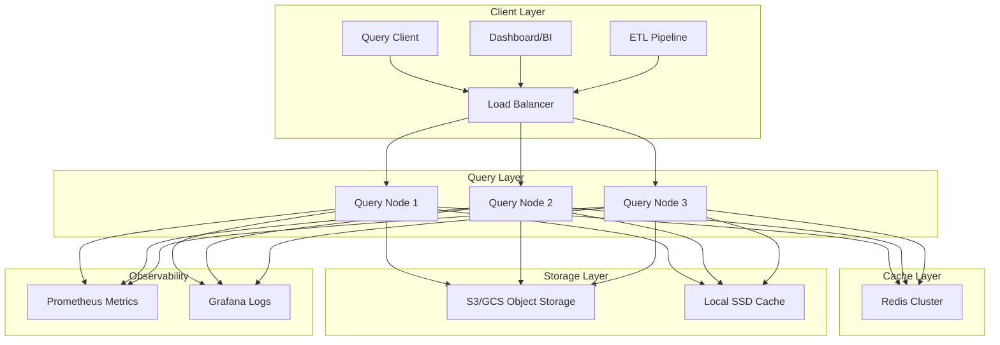

# Production-Grade Analytical Database Applications

## Overview

This guide covers production deployment patterns for analytical database applications built with DuckDB or Rust equivalents (DataFusion, Arrow). We cover deployment architectures, monitoring, performance tuning, security, and operational considerations.

## Architecture Overview



## Deployment Patterns

### Embedded Deployment

```rust
// src/deployment/embedded.rs

use datafusion::prelude::*;
use std::sync::Arc;
use tokio::sync::RwLock;

/// Embedded database instance (single-process)
pub struct EmbeddedDatabase {
    context: SessionContext,
    config: DatabaseConfig,
    metrics: Arc<RwLock<DatabaseMetrics>>,
}

impl EmbeddedDatabase {
    pub async fn new(config: DatabaseConfig) -> Result<Self, DatabaseError> {
        let mut context = SessionContext::new();
        
        // Configure memory pool
        let memory_pool = Arc::new(
            FairSpillPool::new(config.max_memory_bytes)
        );
        context.runtime_env().memory_pool = memory_pool;
        
        // Configure disk cache
        if let Some(cache_path) = &config.cache_path {
            std::fs::create_dir_all(cache_path)?;
            context.runtime_env().cache_path = Some(cache_path.clone());
        }
        
        // Register object store
        if let Some(s3_config) = &config.s3_config {
            Self::register_s3_store(&context, s3_config).await?;
        }
        
        Ok(Self {
            context,
            config,
            metrics: Arc::new(RwLock::new(DatabaseMetrics::default())),
        })
    }
    
    pub async fn query(&self, sql: &str) -> Result<QueryResult, DatabaseError> {
        let start = std::time::Instant::now();
        
        // Execute query
        let dataframe = self.context.sql(sql).await?;
        let batches = dataframe.collect().await?;
        
        // Record metrics
        {
            let mut metrics = self.metrics.write().await;
            metrics.queries_executed += 1;
            metrics.total_query_time += start.elapsed();
            metrics.rows_returned += batches.iter().map(|b| b.num_rows()).sum::<usize>();
        }
        
        Ok(QueryResult {
            batches,
            execution_time: start.elapsed(),
        })
    }
    
    pub async fn get_metrics(&self) -> DatabaseMetrics {
        self.metrics.read().await.clone()
    }
}

#[derive(Clone, Debug)]
pub struct DatabaseConfig {
    pub max_memory_bytes: usize,
    pub cache_path: Option<String>,
    pub s3_config: Option<S3Config>,
    pub max_concurrent_queries: usize,
    pub query_timeout: std::time::Duration,
}

#[derive(Clone, Debug, Default)]
pub struct DatabaseMetrics {
    pub queries_executed: u64,
    pub total_query_time: std::time::Duration,
    pub rows_returned: u64,
    pub cache_hits: u64,
    pub cache_misses: u64,
}

pub struct QueryResult {
    pub batches: Vec<arrow::record_batch::RecordBatch>,
    pub execution_time: std::time::Duration,
}
```

### Client-Server Deployment

```rust
// src/deployment/server.rs

use axum::{
    extract::{Path, State, Query},
    http::StatusCode,
    routing::{get, post},
    Json, Router,
};
use serde::{Deserialize, Serialize};
use std::sync::Arc;
use tokio::sync::{Mutex, Semaphore};

/// Database server with HTTP API
pub struct DatabaseServer {
    database: Arc<EmbeddedDatabase>,
    query_semaphore: Arc<Semaphore>,
    active_queries: Arc<Mutex<Vec<QueryInfo>>>,
}

impl DatabaseServer {
    pub fn new(database: EmbeddedDatabase, config: &ServerConfig) -> Self {
        Self {
            database: Arc::new(database),
            query_semaphore: Arc::new(Semaphore::new(config.max_concurrent_queries)),
            active_queries: Arc::new(Mutex::new(Vec::new())),
        }
    }
    
    pub fn into_router(self) -> Router {
        let state = Arc::new(AppState {
            database: self.database.clone(),
            query_semaphore: self.query_semaphore.clone(),
            active_queries: self.active_queries.clone(),
        });
        
        Router::new()
            .route("/health", get(health_handler))
            .route("/query", post(query_handler))
            .route("/metrics", get(metrics_handler))
            .route("/tables", get(tables_handler))
            .route("/query/:id", get(query_status_handler))
            .with_state(state)
    }
}

struct AppState {
    database: Arc<EmbeddedDatabase>,
    query_semaphore: Arc<Semaphore>,
    active_queries: Arc<Mutex<Vec<QueryInfo>>>,
}

#[derive(Serialize, Deserialize)]
pub struct QueryRequest {
    pub sql: String,
    pub timeout_secs: Option<u64>,
}

#[derive(Serialize, Deserialize)]
pub struct QueryResponse {
    pub columns: Vec<ColumnSchema>,
    pub rows: Vec<RowData>,
    pub execution_time_ms: u64,
    pub rows_returned: usize,
}

#[derive(Serialize, Deserialize)]
pub struct ColumnSchema {
    pub name: String,
    pub data_type: String,
}

#[derive(Serialize, Deserialize)]
pub struct RowData {
    pub values: Vec<serde_json::Value>,
}

#[derive(Clone, Serialize, Deserialize)]
pub struct QueryInfo {
    pub id: String,
    pub sql: String,
    pub started_at: String,
    pub status: QueryStatus,
}

#[derive(Clone, Serialize, Deserialize, PartialEq)]
pub enum QueryStatus {
    Running,
    Completed,
    Failed { error: String },
}

async fn health_handler(
    State(_state): State<Arc<AppState>>,
) -> Json<HealthStatus> {
    Json(HealthStatus {
        status: "healthy".to_string(),
        timestamp: chrono::Utc::now().to_rfc3339(),
    })
}

async fn query_handler(
    State(state): State<Arc<AppState>>,
    Json(request): Json<QueryRequest>,
) -> Result<Json<QueryResponse>, StatusCode> {
    // Acquire query permit
    let _permit = state
        .query_semaphore
        .acquire()
        .await
        .map_err(|_| StatusCode::SERVICE_UNAVAILABLE)?;
    
    // Generate query ID
    let query_id = uuid::Uuid::new_v4().to_string();
    
    // Track active query
    {
        let mut queries = state.active_queries.lock().await;
        queries.push(QueryInfo {
            id: query_id.clone(),
            sql: request.sql.clone(),
            started_at: chrono::Utc::now().to_rfc3339(),
            status: QueryStatus::Running,
        });
    }
    
    // Execute query with timeout
    let timeout = std::time::Duration::from_secs(
        request.timeout_secs.unwrap_or(300)
    );
    
    let result = tokio::time::timeout(
        timeout,
        state.database.query(&request.sql)
    ).await;
    
    // Update query status
    {
        let mut queries = state.active_queries.lock().await;
        if let Some(query) = queries.iter_mut().find(|q| q.id == query_id) {
            query.status = match &result {
                Ok(Ok(_)) => QueryStatus::Completed,
                Ok(Err(e)) => QueryStatus::Failed { error: e.to_string() },
                Err(_) => QueryStatus::Failed { error: "Query timeout".to_string() },
            };
        }
    }
    
    // Convert result
    match result {
        Ok(Ok(query_result)) => {
            let columns = query_result.batches[0]
                .schema()
                .fields()
                .iter()
                .map(|f| ColumnSchema {
                    name: f.name().clone(),
                    data_type: f.data_type().to_string(),
                })
                .collect();
            
            let rows = query_result.batches
                .iter()
                .flat_map(|batch| {
                    (0..batch.num_rows()).map(move |row_idx| {
                        RowData {
                            values: (0..batch.num_columns())
                                .map(|col_idx| {
                                    arrow_json::writer::value_to_json(
                                        batch.column(col_idx),
                                        row_idx,
                                    ).unwrap_or(serde_json::Value::Null)
                                })
                                .collect(),
                        }
                    })
                })
                .collect();
            
            Ok(Json(QueryResponse {
                columns,
                rows,
                execution_time_ms: query_result.execution_time.as_millis() as u64,
                rows_returned: rows.len(),
            }))
        }
        Ok(Err(e)) => Err(StatusCode::BAD_REQUEST),
        Err(_) => Err(StatusCode::REQUEST_TIMEOUT),
    }
}

async fn metrics_handler(
    State(state): State<Arc<AppState>>,
) -> Json<DatabaseMetrics> {
    state.database.get_metrics().await.into()
}

async fn tables_handler(
    State(state): State<Arc<AppState>>,
) -> Json<Vec<TableInfo>> {
    // Get table list from catalog
    Json(vec![])
}

async fn query_status_handler(
    State(state): State<Arc<AppState>>,
    Path(query_id): Path<String>,
) -> Result<Json<QueryInfo>, StatusCode> {
    let queries = state.active_queries.lock().await;
    
    queries
        .iter()
        .find(|q| q.id == query_id)
        .map(|q| Json(q.clone()))
        .ok_or(StatusCode::NOT_FOUND)
}

#[derive(Serialize)]
pub struct HealthStatus {
    pub status: String,
    pub timestamp: String,
}

#[derive(Serialize)]
pub struct ServerConfig {
    pub max_concurrent_queries: usize,
    pub bind_address: String,
    pub tls_config: Option<TlsConfig>,
}

#[derive(Serialize)]
pub struct TlsConfig {
    pub cert_path: String,
    pub key_path: String,
}

#[derive(Serialize)]
pub struct TableInfo {
    pub name: String,
    pub row_count: u64,
    pub size_bytes: u64,
}
```

## Monitoring & Observability

### Prometheus Metrics

```rust
// src/observability/metrics.rs

use prometheus::{
    Counter, Gauge, Histogram, HistogramOpts, Opts, Registry,
};
use std::sync::Arc;

pub struct DatabaseMetrics {
    pub queries_total: Counter,
    pub queries_duration: Histogram,
    pub rows_read: Counter,
    pub rows_returned: Counter,
    pub bytes_read: Counter,
    pub cache_hits: Counter,
    pub cache_misses: Counter,
    pub active_queries: Gauge,
    pub memory_used: Gauge,
    pub errors_total: Counter,
}

impl DatabaseMetrics {
    pub fn new(registry: &Registry) -> Result<Self, prometheus::Error> {
        let queries_total = Counter::new(
            "db_queries_total",
            "Total number of queries executed"
        )?;
        
        let queries_duration = Histogram::with_opts(
            HistogramOpts::new(
                "db_query_duration_seconds",
                "Query execution time in seconds"
            )
            .buckets(vec![
                0.001, 0.005, 0.01, 0.025, 0.05, 0.1, 0.25, 0.5, 1.0, 2.5, 5.0, 10.0, 30.0, 60.0
            ])
        )?;
        
        let rows_read = Counter::new(
            "db_rows_read_total",
            "Total number of rows read from storage"
        )?;
        
        let rows_returned = Counter::new(
            "db_rows_returned_total",
            "Total number of rows returned to clients"
        )?;
        
        let bytes_read = Counter::new(
            "db_bytes_read_total",
            "Total bytes read from storage"
        )?;
        
        let cache_hits = Counter::new(
            "db_cache_hits_total",
            "Total cache hits"
        )?;
        
        let cache_misses = Counter::new(
            "db_cache_misses_total",
            "Total cache misses"
        )?;
        
        let active_queries = Gauge::new(
            "db_active_queries",
            "Number of currently executing queries"
        )?;
        
        let memory_used = Gauge::new(
            "db_memory_used_bytes",
            "Current memory usage in bytes"
        )?;
        
        let errors_total = Counter::new(
            "db_errors_total",
            "Total number of query errors"
        )?;
        
        registry.register(Box::new(queries_total.clone()))?;
        registry.register(Box::new(queries_duration.clone()))?;
        registry.register(Box::new(rows_read.clone()))?;
        registry.register(Box::new(rows_returned.clone()))?;
        registry.register(Box::new(bytes_read.clone()))?;
        registry.register(Box::new(cache_hits.clone()))?;
        registry.register(Box::new(cache_misses.clone()))?;
        registry.register(Box::new(active_queries.clone()))?;
        registry.register(Box::new(memory_used.clone()))?;
        registry.register(Box::new(errors_total.clone()))?;
        
        Ok(Self {
            queries_total,
            queries_duration,
            rows_read,
            rows_returned,
            bytes_read,
            cache_hits,
            cache_misses,
            active_queries,
            memory_used,
            errors_total,
        })
    }
}

/// Query timer guard
pub struct QueryTimerGuard<'a> {
    metrics: &'a DatabaseMetrics,
    start: std::time::Instant,
    rows_read: u64,
    bytes_read: u64,
}

impl<'a> QueryTimerGuard<'a> {
    pub fn new(metrics: &'a DatabaseMetrics) -> Self {
        metrics.queries_total.inc();
        metrics.active_queries.inc();
        
        Self {
            metrics,
            start: std::time::Instant::now(),
            rows_read: 0,
            bytes_read: 0,
        }
    }
    
    pub fn record_rows_read(&mut self, rows: u64) {
        self.rows_read = rows;
    }
    
    pub fn record_bytes_read(&mut self, bytes: u64) {
        self.bytes_read = bytes;
    }
}

impl<'a> Drop for QueryTimerGuard<'a> {
    fn drop(&mut self) {
        let duration = self.start.elapsed().as_secs_f64();
        self.metrics.queries_duration.observe(duration);
        self.metrics.active_queries.dec();
        self.metrics.rows_read.inc_by(self.rows_read);
        self.metrics.bytes_read.inc_by(self.bytes_read);
    }
}
```

### Distributed Tracing

```rust
// src/observability/tracing.rs

use tracing::{info_span, instrument, Span};
use tracing_subscriber::{layer::SubscriberExt, Registry};

/// Configure tracing for database
pub fn init_tracing(service_name: &str) -> Result<(), Box<dyn std::error::Error>> {
    // OpenTelemetry integration
    let otel_layer = tracing_opentelemetry::layer();
    
    // JSON logging for production
    let json_layer = tracing_subscriber::fmt::layer()
        .json()
        .with_target(true)
        .with_thread_ids(true);
    
    // Filter layer
    let filter_layer = tracing_subscriber::EnvFilter::try_from_default_env()
        .unwrap_or_else(|_| "info".into());
    
    Registry::default()
        .with(otel_layer)
        .with(json_layer)
        .with(filter_layer)
        .init();
    
    Ok(())
}

/// Instrumented query execution
#[instrument(
    name = "database_query",
    skip(db, sql),
    fields(
        sql = %truncate_sql(sql),
        query_id = %uuid::Uuid::new_v4()
    )
)]
pub async fn execute_query(
    db: &EmbeddedDatabase,
    sql: &str,
) -> Result<QueryResult, DatabaseError> {
    let result = db.query(sql).await?;
    
    tracing::info!(
        rows_returned = result.batches.iter().map(|b| b.num_rows()).sum::<usize>(),
        execution_time_ms = result.execution_time.as_millis() as u64,
        "Query completed"
    );
    
    Ok(result)
}

fn truncate_sql(sql: &str) -> String {
    if sql.len() > 200 {
        format!("{}...", &sql[..200])
    } else {
        sql.to_string()
    }
}
```

## Performance Tuning

### Memory Configuration

```rust
// src/tuning/memory.rs

use datafusion::execution::memory_pool::{
    MemoryPool, FairSpillPool, GreedyMemoryPool,
};

pub struct MemoryTuning {
    /// Total system memory
    total_memory: usize,
    
    /// Memory pool configuration
    pool_config: MemoryPoolConfig,
}

impl MemoryTuning {
    pub fn new(total_memory: usize) -> Self {
        Self {
            total_memory,
            pool_config: MemoryPoolConfig::default(),
        }
    }
    
    /// Configure memory pool based on workload
    pub fn configure_pool(&self) -> Arc<dyn MemoryPool> {
        match self.pool_config.pool_type {
            PoolType::FairSpill => {
                Arc::new(FairSpillPool::new(
                    self.total_memory * self.pool_config.memory_fraction
                ))
            }
            PoolType::Greedy => {
                Arc::new(GreedyMemoryPool::new(
                    self.total_memory * self.pool_config.memory_fraction
                ))
            }
        }
    }
    
    /// Tune for OLAP workloads (large scans, aggregations)
    pub fn tune_for_olap(&mut self) {
        self.pool_config = MemoryPoolConfig {
            pool_type: PoolType::FairSpill,
            memory_fraction: 0.8,  // Use 80% of available memory
            spill_threshold: 0.7,   // Start spilling at 70%
        };
    }
    
    /// Tune for mixed OLTP/OLAP workloads
    pub fn tune_for_mixed(&mut self) {
        self.pool_config = MemoryPoolConfig {
            pool_type: PoolType::Greedy,
            memory_fraction: 0.6,
            spill_threshold: 0.5,
        };
    }
}

#[derive(Clone, Copy)]
pub struct MemoryPoolConfig {
    pub pool_type: PoolType,
    pub memory_fraction: f64,
    pub spill_threshold: f64,
}

impl Default for MemoryPoolConfig {
    fn default() -> Self {
        Self {
            pool_type: PoolType::FairSpill,
            memory_fraction: 0.7,
            spill_threshold: 0.6,
        }
    }
}

pub enum PoolType {
    FairSpill,
    Greedy,
}
```

### Query Optimization Hints

```rust
// src/tuning/query_hints.rs

/// Query hints for optimization
pub struct QueryHints {
    /// Enable/disable predicate pushdown
    pub predicate_pushdown: bool,
    
    /// Enable/disable projection pushdown
    pub projection_pushdown: bool,
    
    /// Enable/disable common subexpression elimination
    pub cse: bool,
    
    /// Enable/disable scalar subquery optimization
    pub scalar_subquery: bool,
    
    /// Target partitions count for parallel scan
    pub target_partitions: usize,
    
    /// Minimum rows for parallel execution
    pub parallel_threshold: usize,
}

impl Default for QueryHints {
    fn default() -> Self {
        Self {
            predicate_pushdown: true,
            projection_pushdown: true,
            cse: true,
            scalar_subquery: true,
            target_partitions: num_cpus::get(),
            parallel_threshold: 100_000,
        }
    }
}

impl QueryHints {
    /// Configure for low-latency queries
    pub fn low_latency() -> Self {
        Self {
            target_partitions: 1,  // Avoid parallelism overhead
            parallel_threshold: 1_000_000,
            ..Default::default()
        }
    }
    
    /// Configure for throughput-optimized queries
    pub fn high_throughput() -> Self {
        Self {
            target_partitions: num_cpus::get() * 2,
            parallel_threshold: 10_000,
            ..Default::default()
        }
    }
}
```

## Security

### Authentication & Authorization

```rust
// src/security/auth.rs

use jsonwebtoken::{decode, encode, DecodingKey, EncodingKey, Header, Validation};
use serde::{Deserialize, Serialize};
use sha2::{Sha256, Digest};
use std::collections::HashMap;

#[derive(Clone)]
pub struct DatabaseUser {
    pub username: String,
    pub password_hash: Vec<u8>,
    pub roles: Vec<String>,
    pub permissions: Vec<Permission>,
}

#[derive(Clone, Debug)]
pub struct Permission {
    pub resource: String,  // Table, schema, or database name
    pub actions: Vec<Action>,
}

#[derive(Clone, Debug, PartialEq)]
pub enum Action {
    Select,
    Insert,
    Update,
    Delete,
    Create,
    Drop,
    Alter,
}

#[derive(Debug, Serialize, Deserialize)]
pub struct Claims {
    pub sub: String,  // Subject (username)
    pub exp: usize,   // Expiration time
    pub roles: Vec<String>,
}

pub struct Authenticator {
    users: HashMap<String, DatabaseUser>,
    jwt_secret: Vec<u8>,
}

impl Authenticator {
    pub fn new(jwt_secret: &str) -> Self {
        Self {
            users: HashMap::new(),
            jwt_secret: jwt_secret.as_bytes().to_vec(),
        }
    }
    
    pub fn add_user(&mut self, user: DatabaseUser) {
        self.users.insert(user.username.clone(), user);
    }
    
    pub fn authenticate(&self, username: &str, password: &str) -> Result<String, AuthError> {
        let user = self.users.get(username)
            .ok_or(AuthError::InvalidCredentials)?;
        
        // Verify password
        let password_hash = hash_password(password);
        if password_hash != user.password_hash {
            return Err(AuthError::InvalidCredentials);
        }
        
        // Generate JWT token
        let claims = Claims {
            sub: username.to_string(),
            exp: (chrono::Utc::now() + chrono::Duration::hours(24)).timestamp() as usize,
            roles: user.roles.clone(),
        };
        
        let token = encode(
            &Header::default(),
            &claims,
            &EncodingKey::from_secret(&self.jwt_secret)
        )?;
        
        Ok(token)
    }
    
    pub fn verify_token(&self, token: &str) -> Result<Claims, AuthError> {
        let token_data = decode::<Claims>(
            token,
            &DecodingKey::from_secret(&self.jwt_secret),
            &Validation::default()
        )?;
        
        Ok(token_data.claims)
    }
    
    pub fn check_permission(
        &self,
        username: &str,
        resource: &str,
        action: &Action
    ) -> Result<(), AuthError> {
        let user = self.users.get(username)
            .ok_or(AuthError::UserNotFound)?;
        
        for permission in &user.permissions {
            if permission.resource == resource || permission.resource == "*" {
                if permission.actions.contains(action) || permission.actions.contains(&Action::Alter) {
                    return Ok(());
                }
            }
        }
        
        Err(AuthError::PermissionDenied)
    }
}

fn hash_password(password: &str) -> Vec<u8> {
    let mut hasher = Sha256::new();
    hasher.update(password.as_bytes());
    hasher.finalize().to_vec()
}

#[derive(Debug, thiserror::Error)]
pub enum AuthError {
    #[error("Invalid credentials")]
    InvalidCredentials,
    #[error("User not found")]
    UserNotFound,
    #[error("Permission denied")]
    PermissionDenied,
    #[error("Token error: {0}")]
    TokenError(#[from] jsonwebtoken::errors::Error),
}
```

## Production Checklist

```
Deployment:
□ Container orchestration (Kubernetes, ECS, Nomad)
□ Load balancing with health checks
□ Auto-scaling based on query load
□ Graceful shutdown with query draining
□ Configuration management (env vars, secrets)

Monitoring:
□ Prometheus metrics endpoint
□ Health check endpoint (/health)
□ Query execution time tracking
□ Memory usage monitoring
□ Error rate alerting
□ Slow query logging

Security:
□ TLS for client connections
□ JWT authentication
□ Role-based access control
□ Query whitelisting (optional)
□ Audit logging

Performance:
□ Memory pool configuration
□ Disk cache sizing (SSD recommended)
□ Connection pooling
□ Query timeout limits
□ Concurrent query limits

Operations:
□ Log aggregation (ELK, Loki)
□ Distributed tracing (Jaeger, Zipkin)
□ Backup strategy for local cache
□ Disaster recovery plan
□ Runbook for common issues
```

## Conclusion

Production analytical database deployments require:

1. **Scalable Architecture**: Load balancing, horizontal scaling
2. **Observability**: Metrics, tracing, structured logging
3. **Security**: Authentication, authorization, encryption
4. **Performance Tuning**: Memory, parallelism, caching
5. **Operational Excellence**: Monitoring, alerting, runbooks
