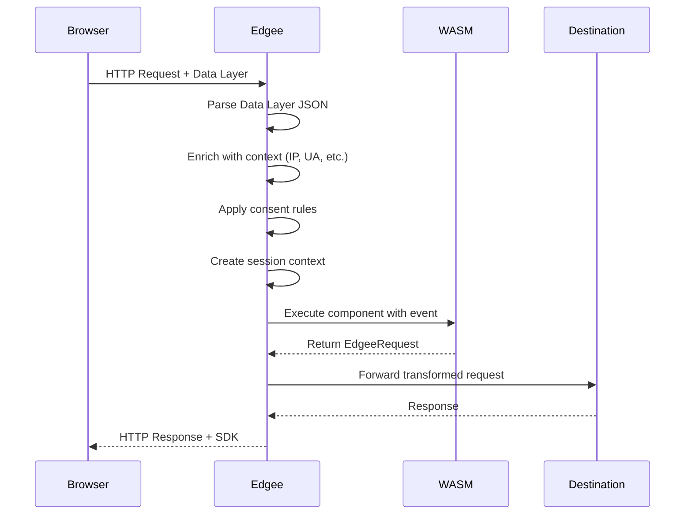
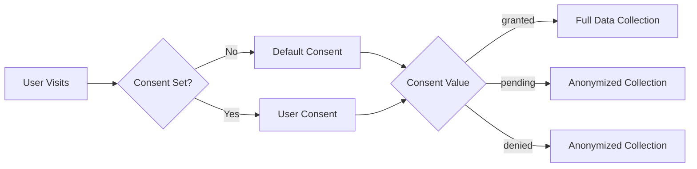

# Project Exploration: Edgee Cloud - Edge Data Platform

## Overview

Edgee Cloud is an edge computing platform designed for data collection and analytics at the edge. It operates as a reverse proxy that intercepts HTTP requests and runs WebAssembly components to implement features like data collection for analytics, warehousing, and attribution. The platform enables privacy-first data collection by processing events at the edge before forwarding them to various analytics destinations.

Key characteristics:
- **Edge-first architecture**: Runs on edge networks and CDNs (Fastly, Cloudflare)
- **WebAssembly component model**: Extensible plugin system using WIT (WebAssembly Interface Types)
- **Privacy compliance**: Built-in consent management and data anonymization
- **Multi-language support**: Components can be written in Rust, Go, JavaScript, TypeScript, Python, C, and C#
- **Real-time processing**: Sub-millisecond compute times for data transformation

## Directory Structure

```
/home/darkvoid/Boxxed/@formulas/src.rust/src.edgee-cloud/
├── edgee/                              # Core edge proxy (Rust)
│   ├── crates/
│   │   ├── cli/                        # Edgee CLI tool
│   │   ├── server/                     # HTTP/HTTPS server & proxy
│   │   ├── components-runtime/         # Wasmtime-based component runtime
│   │   └── api-client/                 # Edgee API client
│   ├── edgee.sample.toml               # Sample configuration
│   └── README-proxy.md                 # Proxy documentation
│
├── edgee-wit/                          # WebAssembly Interface Types
│   └── wit/
│       ├── data-collection.wit         # Data collection interface
│       └── consent-mapping.wit         # Consent management interface
│
├── edgee-data-collection-wit/          # Data collection WIT definitions
│   └── wit/data-collection.wit
│
├── edgee-consent-management-wit/       # Consent management WIT
│   └── wit/
│
├── Data Destination Components:
│   ├── amazon-data-firehose-component/ # AWS Firehose integration
│   ├── amazon-s3-component/            # AWS S3 integration
│   ├── amplitude-component/            # Amplitude analytics
│   ├── piano-analytics-component/      # Piano Analytics
│   ├── pinterest-capi-component/       # Pinterest CAPI
│   ├── plausible-component/            # Plausible analytics
│   ├── segment-component/              # Segment (Twilio)
│   └── ga-component/                   # Google Analytics (external)
│
├── Example Components (multi-language):
│   ├── example-c-component/            # C language example
│   ├── example-csharp-component/       # C# example
│   ├── example-go-component/           # Go example
│   ├── example-js-component/           # JavaScript example
│   ├── example-py-component/           # Python example
│   ├── example-rust-component/         # Rust example
│   └── example-ts-component/           # TypeScript example
│
├── mcp-server-edgee/                   # Model Context Protocol server
└── homebrew-edgee/                     # Homebrew formula
```

## Architecture

### High-Level Diagram

```mermaid
flowchart TB
    subgraph Client["Client Browser"]
        JS[JavaScript SDK]
        DL[Data Layer]
    end

    subgraph Edge["Edge Edge Proxy"]
        HTTPS[HTTPS Entry Point]
        ROUTE[Routing Controller]
        HTML[HTML Handler]
        DC[Data Collection Processor]
        CONSENT[Consent Manager]
    end

    subgraph WASM["WebAssembly Components"]
        AMP[Amplitude]
        GA[Google Analytics]
        SEG[Segment]
        CUSTOM[Custom Components]
    end

    subgraph Backend["Origin Backend"]
        APP[Web Application]
    end

    subgraph Destinations["Data Destinations"]
        API[Data Collection API]
        EXT[External Analytics APIs]
    end

    Client -->|HTTPS Request| HTTPS
    HTTPS --> ROUTE
    ROUTE -->|Proxy| Backend
    Backend -->|HTML Response| HTML
    HTML -->|SDK Injection| DC
    DL -->|Events| DC
    DC --> CONSENT
    CONSENT -->|Authorized Events| WASM
    WASM -->|HTTP Requests| EXT
    DC -->|Raw Events| API

    style Edge fill:#1a4d2e
    style WASM fill:#2d5a87
    style Destinations fill:#5a3d7a
```



## Core Platform

### Edge Proxy (`edgee/crates/server/`)

The Edgee proxy is built with Rust using modern async frameworks:

**Key Technologies:**
- `hyper` - HTTP/1 and HTTP/2 server
- `tokio` - Async runtime
- `rustls` - TLS termination
- `lol_html` - Streaming HTML rewriting
- `tower-http` - Middleware services

**Request Flow:**

1. **Incoming Request** - HTTP/HTTPS entry point with TLS termination
2. **Routing Decision** - Domain/backend matching with path-based routing
3. **Special Endpoints**:
   - `/_edgee/sdk.js` - Serves the client-side SDK
   - `/_edgee/event` - Direct event ingestion endpoint
   - `/_edgee/csevent` - Third-party SDK event endpoint
4. **Proxy Mode** - Forwards requests to origin backend
5. **Response Processing** - HTML rewriting for SDK injection
6. **Data Collection** - Extracts and processes analytics events

**Configuration (edgee.toml):**

```toml
[log]
level = "info"

[http]
address = "0.0.0.0:80"
force_https = true

[https]
address = "0.0.0.0:443"
cert = "/var/edgee/cert/server.pem"
key = "/var/edgee/cert/edgee.key"

[[components.data_collection]]
id = "amplitude"
file = "/var/edgee/wasm/amplitude.wasm"
settings.amplitude_api_key = "YOUR-API-KEY"
```

### CLI Tool (`edgee/crates/cli/`)

The Edgee CLI provides development and deployment tooling:

| Command | Description |
|---------|-------------|
| `edgee login` | Authenticate with Edgee API |
| `edgee components new` | Scaffold new component |
| `edgee components build` | Compile component to WASM |
| `edgee components check` | Validate against WIT interface |
| `edgee components test` | Test with sample events |
| `edgee components push` | Push to Component Registry |
| `edgee serve` | Run local proxy server |

## WebAssembly Component System

### WIT Interface Definitions

Edgee uses WebAssembly Interface Types (WIT) to define component contracts:

**Data Collection Interface** (`edgee-wit/wit/data-collection.wit`):

```wit
package edgee:components@1.0.0;

interface data-collection {
    type dict = list<tuple<string,string>>;

    enum event-type { page, track, user }
    enum consent { pending, granted, denied }

    record event {
        uuid: string,
        timestamp: s64,
        event-type: event-type,
        data: data,
        context: context,
        consent: option<consent>,
    }

    record edgee-request {
        method: http-method,
        url: string,
        headers: dict,
        forward-client-headers: bool,
        body: string,
    }

    page: func(e: event, settings: dict) -> result<edgee-request, string>;
    track: func(e: event, settings: dict) -> result<edgee-request, string>;
    user: func(e: event, settings:dict) -> result<edgee-request, string>;
}
```

**Consent Mapping Interface** (`edgee-wit/wit/consent-mapping.wit`):

```wit
interface consent-mapping {
    enum consent { pending, granted, denied }
    map: func(cookies: dict, settings: dict) -> option<consent>;
}
```

### Component Runtime (`edgee/crates/components-runtime/`)

The runtime uses Wasmtime to execute WebAssembly components:

```rust
pub struct ComponentsContext {
    pub engine: Engine,
    pub components: Components,
}

pub struct Components {
    pub data_collection_1_0_0: HashMap<String, DataCollectionV100Pre<HostState>>,
    pub consent_management_1_0_0: HashMap<String, ConsentManagementV100Pre<HostState>>,
}
```

**Key Features:**
- Async component execution with Wasmtime
- WASI support for system access
- Component pre-instantiation for performance
- Versioned interface support (v1.0.0)
- Host state management for WASI context

### Component Development Example (Rust)

```rust
use crate::exports::edgee::components::data_collection::{Guest, Event, EdgeeRequest, HttpMethod};

wit_bindgen::generate!({world: "data-collection", path: ".edgee/wit"});
export!(Component);

struct Component;

impl Guest for Component {
    fn page(event: Event, settings: Dict) -> Result<EdgeeRequest, String> {
        // Transform event into destination API request
        Ok(EdgeeRequest {
            method: HttpMethod::Post,
            url: "https://api.amplitude.com/2/httpapi".to_string(),
            headers: vec![...],
            body: transform_to_amplitude_format(&event),
            forward_client_headers: true,
        })
    }

    fn track(event: Event, settings: Dict) -> Result<EdgeeRequest, String> { ... }
    fn user(event: Event, settings: Dict) -> Result<EdgeeRequest, String> { ... }
}
```

## Data Collection

### Event Types

| Event Type | Description | Trigger |
|------------|-------------|---------|
| **Page** | Page view tracking | Automatic on page load |
| **Track** | Custom event tracking | User actions, conversions |
| **User** | User identification | Login, registration |

### Data Flow



### Payload Processing Pipeline

1. **Data Layer Extraction** - Parse JSON from `<script id="__EDGEE_DATA_LAYER__">`
2. **Context Enrichment**:
   - Client IP (from request or X-Forwarded-For)
   - User-Agent and client hints
   - Geographic data (continent, country, city)
   - Screen dimensions
   - Locale and timezone
3. **Session Management**:
   - Edgee cookie (`edgee_s`) for session tracking
   - Session ID, count, start flag
   - First/last seen timestamps
4. **User Context**:
   - Encrypted user cookie (`edgee_u`)
   - User ID, anonymous ID, properties
5. **Consent Application**:
   - Check user consent status
   - Apply anonymization if needed
   - Skip processing if denied

### Client-Side Integration

```html
<!-- Data Layer (placed in head) -->
<script id="__EDGEE_DATA_LAYER__" type="application/json">
{
  "data_collection": {
    "consent": "granted",
    "events": [{
      "type": "page",
      "data": {"title": "Home Page"}
    }]
  }
}
</script>

<!-- Edgee SDK (async loading) -->
<script async src="https://your-domain.com/_edgee/sdk.js"></script>
```

```javascript
// Using the SDK
edgee.consent("granted");
edgee.track("purchase", { amount: 99.99 });
edgee.user({ userId: "user123", email: "user@example.com" });
```

## Consent Management

### Consent States

| State | Description | Anonymization |
|-------|-------------|---------------|
| `pending` | No consent decision yet | Applied |
| `granted` | User consented to tracking | Not applied |
| `denied` | User denied consent | Applied |

### Consent Flow



### Consent Management Component

The consent mapping component allows custom consent logic:

```rust
impl ConsentMappingGuest for Component {
    fn map(cookies: Dict, settings: Dict) -> Option<Consent> {
        // Check for consent cookie
        if let Some(consent_value) = cookies.get("cookie_consent") {
            return match consent_value.as_str() {
                "all" => Some(Consent::Granted),
                "none" => Some(Consent::Denied),
                _ => Some(Consent::Pending),
            };
        }
        None
    }
}
```

### IP Anonymization

When consent is not granted, the system anonymizes the client IP:
- IPv4: Last octet removed (e.g., `192.168.1.0`)
- IPv6: Last 80 bits removed

## Destination Components

### Available Destinations

| Component | Description | Settings |
|-----------|-------------|----------|
| **Amplitude** | Product analytics | `amplitude_api_key`, `amplitude_endpoint` |
| **Google Analytics** | Web analytics | `ga_measurement_id` |
| **Segment** | Customer data platform | `segment_project_id`, `segment_write_key` |
| **Piano Analytics** | Digital analytics | `site_id`, `collect_domain` |
| **Pinterest CAPI** | Pinterest conversion API | `pixel_id`, `access_token` |
| **Plausible** | Privacy-friendly analytics | `domain`, `track_outbound` |
| **Amazon S3** | Data warehousing | `bucket`, `region`, `credentials` |
| **Amazon Firehose** | Data streaming | `delivery_stream`, `credentials` |

### Component Event Mapping (Amplitude Example)

| Edgee Event | Amplitude Event | Description |
|-------------|-----------------|-------------|
| Page | `[Amplitude] Page Viewed` | Page view with session tracking |
| Track | Custom Event Name | Direct event name mapping |
| User | `identify` | User property updates |

### Configuration Options

```toml
[[components.data_collection]]
id = "amplitude"
file = "/var/edgee/wasm/amplitude.wasm"

# Event controls
settings.edgee_page_event_enabled = true
settings.edgee_track_event_enabled = true
settings.edgee_user_event_enabled = true

# Privacy
settings.edgee_anonymization = true
settings.edgee_default_consent = "pending"

# Destination-specific
settings.amplitude_api_key = "..."
settings.amplitude_endpoint = "https://api2.amplitude.com/2/httpapi"
```

## Multi-Language Component Support

Edgee supports component development in multiple languages through the WebAssembly component model:

| Language | Build Tool | WASI Target |
|----------|------------|-------------|
| Rust | `cargo build --target wasm32-wasip2` | wasip2 |
| Go | `GOOS=wasip1 GOARCH=wasm go build` | wasip1 |
| JavaScript | `jco componentize` | SpiderMonkey |
| TypeScript | `jco componentize` | SpiderMonkey |
| Python | `componentize-py` | Custom |
| C | `clang --target=wasm32` | wasi |
| C# | `dotnet publish` | Custom |

### Example Component Structure

```
my-component/
├── src/
│   └── lib.rs          # Component implementation
├── wit/
│   └── deps.toml       # WIT dependencies
├── edgee-component.toml # Component manifest
├── Cargo.toml          # Rust dependencies
└── Makefile           # Build scripts
```

## Performance Characteristics

### Latency Budget

| Phase | Typical Time | Description |
|-------|--------------|-------------|
| TLS Termination | <1ms | Rustls decryption |
| Routing | <1ms | Path/domain matching |
| Proxy (upstream) | Network | Backend response time |
| HTML Rewriting | 1-5ms | lol_html streaming |
| Data Collection | 5-20ms | WASM component execution |
| Event Forwarding | Async | Non-blocking HTTP |

**Total compute time**: Typically 10-30ms added to response time

### Optimization Strategies

1. **Component Pre-instantiation**
   - WASM modules compiled once at startup
   - Multiple instances share the same engine
   - Reduces cold start latency

2. **Async Event Forwarding**
   - Events sent to destinations asynchronously
   - Response not blocked by external APIs
   - Tokio spawn for parallel execution

3. **Streaming HTML Processing**
   - lol_html processes HTML in a single pass
   - No full document buffering needed
   - Minimal memory overhead

4. **Connection Pooling**
   - HTTP client connections reused
   - Reduces TLS handshake overhead
   - Configurable pool sizes

### Resource Usage

- **Memory**: ~50-100MB base + ~5MB per WASM component
- **CPU**: Single-threaded event loop, scales horizontally
- **File Descriptors**: Proportional to concurrent connections

## Key Insights

### Architectural Strengths

1. **Clean Separation of Concerns**
   - Proxy logic isolated in `edgee-server` crate
   - Component runtime abstracted in `edgee-components-runtime`
   - WIT interfaces define clear boundaries

2. **WebAssembly Component Model**
   - True polyglot support through WIT
   - Secure sandboxing via WASI
   - Hot-reloadable components without restart

3. **Privacy by Design**
   - Consent enforcement at the edge
   - Data minimization before forwarding
   - Encrypted user cookies

4. **Developer Experience**
   - CLI tooling for component lifecycle
   - Component Registry for sharing
   - Multi-language SDK support

### Integration Points

1. **MCP Server** - AI/LLM integration for Edgee API management
2. **Component Registry** - Public/private component hosting
3. **Data Collection API** - Raw event ingestion for warehousing
4. **Homebrew Formula** - Easy local installation

### Use Cases

- **Analytics Consolidation**: Single integration point for multiple analytics tools
- **Privacy Compliance**: GDPR/CCPA consent enforcement at the edge
- **Performance Optimization**: Reduce client-side JavaScript bundle sizes
- **Data Sovereignty**: Process and filter data before leaving your infrastructure
- **A/B Testing**: Route traffic based on experiment configuration

---

*Exploration completed using source code analysis of the edgee-cloud repository.*
