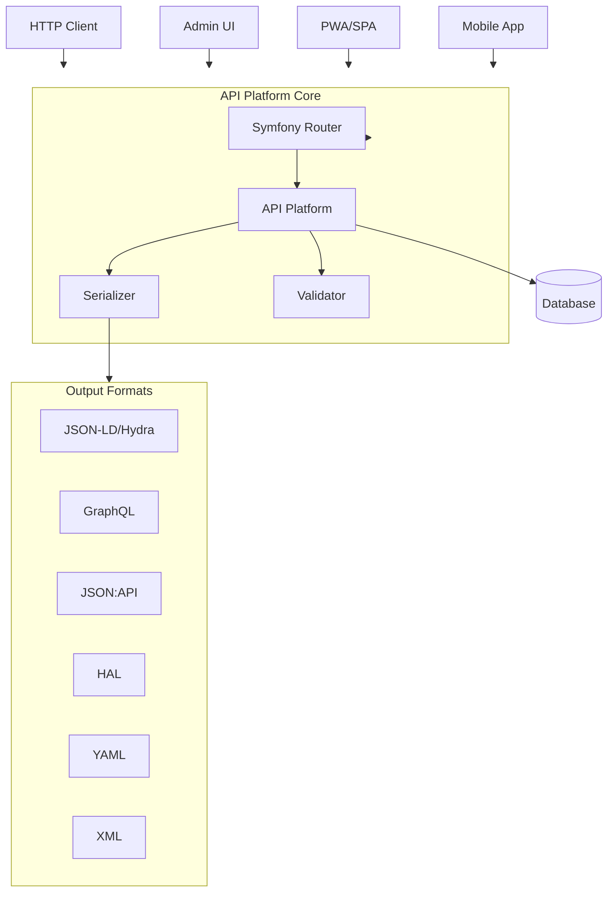
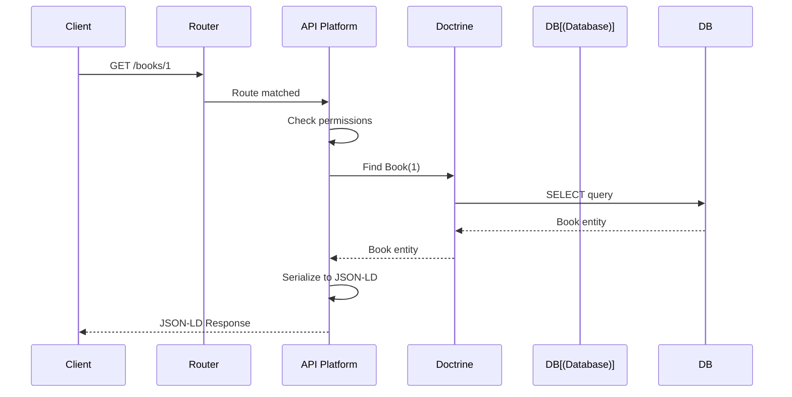

# Project Exploration: API Platform

## Overview

API Platform is a next-generation web framework designed to easily create API-first projects. Built on top of Symfony, it provides automatic exposure of data models as hypermedia REST and GraphQL APIs with minimal configuration.

**Key Characteristics:**
- **API-First** - Design APIs before building UIs
- **Hydra/JSON-LD** - Semantic web standards support
- **GraphQL Support** - Automatic GraphQL API generation
- **Admin Interface** - Auto-generated Material Design admin
- **Client Generators** - Generate React, Vue, React Native apps

## Repository Structure

```
api-platform/
├── api/                          # Main API application
│   ├── bin/
│   │   └── console               # Symfony console
│   ├── config/
│   │   ├── packages/             # Package configurations
│   │   │   ├── api_platform.yaml # API Platform config
│   │   │   ├── doctrine.yaml     # Doctrine ORM config
│   │   │   └── ...
│   │   ├── routes.yaml           # Route definitions
│   │   └── services.yaml         # Service definitions
│   ├── frankenphp/               # FrankenPHP configuration
│   ├── migrations/               # Doctrine migrations
│   ├── public/
│   │   └── index.php             # Entry point
│   ├── src/
│   │   ├── Entity/               # Doctrine entities
│   │   │   └── *.php
│   │   └── State/                # Custom state processors
│   ├── tests/                    # Integration tests
│   ├── composer.json             # PHP dependencies
│   ├── Dockerfile                # Docker configuration
│   ├── .env                      # Environment config
│   └── symfony.lock
│
├── compose.yaml                  # Docker Compose config
├── compose.override.yaml         # Local overrides
├── compose.prod.yaml             # Production config
├── helm/                         # Kubernetes Helm charts
│   └── api-platform/
├── pwa/                          # Progressive Web App
│   ├── src/
│   │   ├── components/           # React components
│   │   └── pages/                # Next.js pages
│   └── package.json
│
└── e2e/                          # End-to-end tests
```

## Architecture

### High-Level Diagram



### Request Flow



## Core Concepts

### Resources (Entities)

Resources are PHP classes that represent API endpoints:

```php
<?php
// api/src/Entity/Book.php
namespace App\Entity;

use ApiPlatform\Metadata\ApiResource;
use ApiPlatform\Metadata\Get;
use ApiPlatform\Metadata\GetCollection;
use ApiPlatform\Metadata\Post;
use ApiPlatform\Metadata\Put;
use ApiPlatform\Metadata\Delete;
use Doctrine\ORM\Mapping as ORM;
use Symfony\Component\Validator\Constraints as Assert;

#[ORM\Entity]
#[ApiResource(
    operations: [
        new GetCollection(),      // GET /books
        new Get(),                // GET /books/{id}
        new Post(),               // POST /books
        new Put(),                // PUT /books/{id}
        new Delete(),             // DELETE /books/{id}
    ]
)]
class Book
{
    #[ORM\Id]
    #[ORM\GeneratedValue]
    #[ORM\Column(type: 'integer')]
    public ?int $id = null;

    #[ORM\Column]
    #[Assert\NotBlank]
    public ?string $title = null;

    #[ORM\Column]
    public ?string $isbn = null;

    #[ORM\Column]
    public ?\DateTimeImmutable $publishedAt = null;
}
```

### API Operations

```php
use ApiPlatform\Metadata\ApiResource;
use ApiPlatform\Metadata\Get;
use ApiPlatform\Metadata\GetCollection;
use ApiPlatform\Metadata\Post;
use ApiPlatform\Metadata\Put;
use ApiPlatform\Metadata\Delete;
use ApiPlatform\Metadata\Patch;

#[ApiResource(
    operations: [
        // REST operations
        new GetCollection(
            path: '/books',
            paginationEnabled: true,
            paginationItemsPerPage: 10,
        ),
        new Get(
            path: '/books/{id}',
            requirements: ['id' => '\d+'],
        ),
        new Post(
            path: '/books',
            validationContext: ['groups' => ['create']],
        ),
        new Put('/books/{id}'),
        new Patch('/books/{id}'),  // Partial update
        new Delete('/books/{id}'),

        // Custom operations
        new Get(
            '/books/{id}/reviews',
            controller: BookReviewController::class,
        ),
    ]
)]
class Book { }
```

### Relations

```php
use ApiPlatform\Metadata\ApiRelation;
use Doctrine\Common\Collections\ArrayCollection;

#[ORM\Entity]
class Book
{
    #[ORM\ManyToOne(targetEntity: Author::class)]
    #[ORM\JoinColumn(nullable: false)]
    public ?Author $author = null;

    #[ORM\ManyToMany(targetEntity: Category::class)]
    public ArrayCollection $categories;

    #[ORM\OneToMany(
        mappedBy: 'book',
        targetEntity: Review::class,
        cascade: ['persist', 'remove']
    )]
    public ArrayCollection $reviews;
}
```

## Content Negotiation

API Platform supports multiple output formats automatically:

```bash
# Request different formats
curl -H "Accept: application/ld+json" https://api/books/1
curl -H "Accept: application/json" https://api/books/1
curl -H "Accept: application/graphql+json" https://api/graphql
curl -H "Accept: application/hal+json" https://api/books/1
curl -H "Accept: application/vnd.api+json" https://api/books/1
curl -H "Accept: application/xml" https://api/books/1
curl -H "Accept: application/yaml" https://api/books/1
curl -H "Accept: text/csv" https://api/books.csv
```

## GraphQL Support

### Automatic GraphQL API

```graphql
# Query a single resource
query {
  book(id: "/api/books/1") {
    id
    title
    isbn
    author {
      id
      name
    }
  }
}

# Query a collection
query {
  books(pagination: {page: 1, itemsPerPage: 10}) {
    collection
    totalCount
  }
}

# Mutation (create)
mutation {
  createBook(input: {
    title: "New Book"
    isbn: "123-456"
    author: "/api/authors/1"
  }) {
    book {
      id
      title
    }
  }
}
```

### Custom GraphQL Queries

```php
use ApiPlatform\Metadata\GraphQl\Query;
use ApiPlatform\Metadata\GraphQl\Mutation;

#[ApiResource(
    graphQlOperations: [
        new Query(
            name: 'item_query',
            resolver: 'app.graphql.query.book_item'
        ),
        new Query(
            name: 'collection_query',
            resolver: 'app.graphql.query.book_collection'
        ),
        new Mutation(
            name: 'create',
            resolver: 'app.graphql.mutation.book_create'
        ),
        new Mutation(
            name: 'update',
            resolver: 'app.graphql.mutation.book_update'
        ),
    ]
)]
class Book { }
```

## Filters

### Built-in Filters

```php
use ApiPlatform\Metadata\ApiFilter;
use ApiPlatform\Doctrine\Orm\Filter\SearchFilter;
use ApiPlatform\Doctrine\Orm\Filter\OrderFilter;
use ApiPlatform\Doctrine\Orm\Filter\DateFilter;
use ApiPlatform\Doctrine\Orm\Filter\RangeFilter;
use ApiPlatform\Doctrine\Orm\Filter\ExistsFilter;

#[ApiResource]
#[ApiFilter(SearchFilter::class, properties: [
    'title' => 'partial',
    'isbn' => 'exact',
    'author' => 'exact',
])]
#[ApiFilter(OrderFilter::class, properties: [
    'title' => 'ASC',
    'publishedAt' => 'DESC',
])]
#[ApiFilter(DateFilter::class, properties: ['publishedAt'])]
#[ApiFilter(RangeFilter::class, properties: ['price'])]
#[ApiFilter(ExistsFilter::class, properties: ['isbn'])]
class Book { }
```

### Usage

```bash
# Search filter
GET /books?title=php

# Order filter
GET /books?order[title]=ASC

# Date filter
GET /books?publishedAt[after]=2024-01-01

# Range filter
GET /books?price[between]=10,50

# Combined
GET /books?title=php&order[publishedAt]=DESC
```

## Validation

```php
use Symfony\Component\Validator\Constraints as Assert;

#[ORM\Entity]
class Book
{
    #[ORM\Column]
    #[Assert\NotBlank(groups: ['create', 'update'])]
    #[Assert\Length(min: 2, max: 255)]
    public ?string $title = null;

    #[ORM\Column]
    #[Assert\Isbn]
    public ?string $isbn = null;

    #[ORM\Column]
    #[Assert\NegativeOrZero]
    public ?float $price = null;

    #[ORM\Column]
    #[Assert\Email]
    public ?string $authorEmail = null;
}
```

## Event System

### State Processors

```php
use ApiPlatform\Metadata\Operation;
use ApiPlatform\State\ProcessorInterface;

class BookProcessor implements ProcessorInterface
{
    public function process(mixed $data, Operation $operation, array $uriVariables = [], array $context = []): mixed
    {
        // Before persist
        if ($data instanceof Book) {
            $data->setSlug($this->slugify($data->getTitle()));
        }

        // Persist
        $this->entityManager->persist($data);
        $this->entityManager->flush();

        // After persist
        $this->notifySubscribers($data);

        return $data;
    }

    private function slugify(string $text): string {
        // Implementation
    }
}
```

### Event Listeners

```php
// config/services.yaml
services:
    App\EventListener\BookListener:
        tags:
            - { name: kernel.event_listener, event: 'kernel.view' }
```

```php
namespace App\EventListener;

use App\Entity\Book;
use Symfony\Component\HttpKernel\Event\ViewEvent;

class BookListener
{
    public function onKernelView(ViewEvent $event): void
    {
        $controllerResult = $event->getControllerResult();

        if (!$controllerResult instanceof Book) {
            return;
        }

        // Modify response
        $controllerResult->setLastModified(new \DateTime());
    }
}
```

## Security

### Access Control

```php
use ApiPlatform\Metadata\ApiResource;
use ApiPlatform\Metadata\Get;
use ApiPlatform\Metadata\Post;
use Symfony\Component\Security\Http\Attribute\IsGranted;

#[ApiResource(
    operations: [
        new GetCollection(),
        new Get(),
        new Post(
            security: "is_granted('ROLE_ADMIN')"
        ),
    ],
    security: "is_granted('ROLE_USER')"
)]
class Book { }
```

### Voter

```php
use App\Entity\Book;
use Symfony\Component\Security\Core\Authorization\Voter\Voter;

class BookVoter extends Voter
{
    protected function supports(string $attribute, mixed $subject): bool
    {
        return in_array($attribute, ['BOOK_EDIT', 'BOOK_DELETE'])
            && $subject instanceof Book;
    }

    protected function voteOnAttribute(string $attribute, mixed $subject, TokenInterface $token): bool
    {
        $user = $token->getUser();
        /** @var Book $book */
        $book = $subject;

        return $user === $book->getAuthor();
    }
}
```

## Admin Interface

API Platform includes an auto-generated admin interface:

```
# Access the admin
http://localhost/admin
```

Features:
- List views with filters
- Create/Edit forms
- Delete confirmation
- Search
- Pagination
- Field customization

### Admin Configuration

```typescript
// pwa/src/admin/customApp.tsx
import { HydraAdmin } from '@api-platform/admin';

const App = () => (
  <HydraAdmin
    entrypoint="https://api.example.com"
    title="My API Admin"
  />
);
```

## Client Generator

### Generate React App

```bash
npx @api-platform/client-generator-react https://api.example.com
```

### Generated Structure

```
my-app/
├── src/
│   ├── components/
│   │   ├── BookList.tsx
│   │   ├── BookEdit.tsx
│   │   └── BookShow.tsx
│   ├── App.tsx
│   └── index.tsx
└── package.json
```

## Configuration

### api_platform.yaml

```yaml
# config/packages/api_platform.yaml
api_platform:
    title: My API
    version: 1.0.0
    show_webby: false

    # Formats
    formats:
        jsonld: ['application/ld+json']
        json: ['application/json']
        html: ['text/html']

    # GraphQL
    graphql:
        enabled: true
        graphiql:
            enabled: true

    # Pagination
    collection:
        pagination:
            enabled: true
            items_per_page: 30
            maximum_items_per_page: 100

    # ETag
    etag:
        enabled: true

    # CORS
    cors:
        allow_origin: ['*']
        allow_methods: ['GET', 'POST', 'PUT', 'DELETE']
        allow_headers: ['Content-Type', 'Authorization']
```

## Testing

### Integration Tests

```php
use ApiPlatform\Symfony\Bundle\Test\ApiTestCase;

class BookTest extends ApiTestCase
{
    public function testCreateBook(): void
    {
        $response = static::createClient()->request('POST', '/books', [
            'json' => [
                'title' => 'Test Book',
                'isbn' => '123-456',
            ],
            'headers' => [
                'Content-Type' => 'application/ld+json',
            ],
        ]);

        $this->assertResponseStatusCodeSame(201);
        $this->assertJsonContains(['title' => 'Test Book']);
    }

    public function testGetBook(): void
    {
        $response = static::createClient()->request('GET', '/books/1');

        $this->assertResponseIsSuccessful();
        $this->assertResponseHeaderSame('content-type', 'application/ld+json');
    }
}
```

## Key Insights

1. **Convention over Configuration** - Minimal setup for standard CRUD APIs.

2. **Semantic Web Ready** - JSON-LD and Hydra for linked data.

3. **Multi-Format** - REST, GraphQL, JSON:API, HAL out of the box.

4. **Symfony Integration** - Full access to Symfony ecosystem.

5. **Admin Included** - Ready-to-use admin interface.

6. **Type Safe** - PHP 8 attributes for metadata.

7. **Extensible** - Custom operations, filters, validators.

8. **Docker Ready** - Complete Docker Compose setup.

## Open Considerations

1. **Performance at Scale** - How does it handle large datasets?

2. **Caching Strategy** - What caching layers are recommended?

3. **Rate Limiting** - Built-in rate limiting support?

4. **Versioning** - API versioning strategies?

5. **Documentation** - OpenAPI/Swagger generation details?

6. **Microservices** - Integration with message queues?

7. **Real-time** - WebSocket/Server-Sent Events support?

8. **Multi-tenancy** - How to implement tenant isolation?
