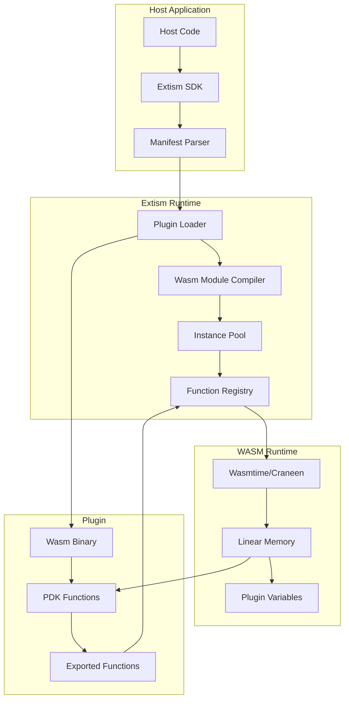

# Deep Dive: Extism WASM Plugin System

## Overview

This deep dive explores the internal architecture of Extism's WebAssembly plugin system. We examine how plugins are loaded, instantiated, executed, and isolated, along with the memory model that enables safe communication between host and plugin.

## Architecture



## Plugin Loading Pipeline

### 1. Manifest Parsing

```rust
/// Plugin manifest structure
#[derive(Debug, Clone, serde::Serialize, serde::Deserialize)]
pub struct Manifest {
    /// Plugin name
    pub name: Option<String>,
    /// WebAssembly modules
    pub wasm: Vec<Wasm>,
    /// Plugin configuration
    pub config: Option<serde_json::Value>,
    /// Allowed HTTP hosts
    pub allowed_hosts: Option<Vec<String>>,
    /// Allowed filesystem paths
    pub allowed_paths: Option<HashMap<String, String>>,
    /// Memory limits
    pub memory_limit: Option<u64>,
}

/// Wasm module source
#[derive(Debug, Clone)]
pub enum Wasm {
    /// From file path
    File { path: PathBuf },
    /// From URL
    Url { url: Url },
    /// From binary data
    Memory { data: Vec<u8> },
}

impl Manifest {
    pub fn new(wasm: impl IntoIterator<Item = Wasm>) -> Self {
        Self {
            name: None,
            wasm: wasm.into_iter().collect(),
            config: None,
            allowed_hosts: None,
            allowed_paths: None,
            memory_limit: None,
        }
    }
}
```

### 2. Module Compilation

```rust
use wasmtime::{Engine, Module, Store};

/// Plugin loader compiles and caches Wasm modules
pub struct PluginLoader {
    engine: Engine,
    module_cache: HashMap<WasmHash, Module>,
}

impl PluginLoader {
    pub fn new() -> Self {
        let config = wasmtime::Config::new()
            .cranelift_opt_level(wasmtime::OptLevel::Speed)
            .consume_fuel(true)  // For execution limits
            .epoch_interruption(true);  // For timeouts
        
        let engine = Engine::new(&config).unwrap();
        
        Self {
            engine,
            module_cache: HashMap::new(),
        }
    }
    
    pub fn load_module(&mut self, wasm: &Wasm) -> Result<Module, Error> {
        // Check cache first
        let hash = wasm.hash();
        if let Some(cached) = self.module_cache.get(&hash) {
            return Ok(cached.clone());
        }
        
        // Load and compile
        let bytes = wasm.fetch()?;
        let module = Module::from_binary(&self.engine, &bytes)?;
        
        // Cache for reuse
        self.module_cache.insert(hash, module.clone());
        
        Ok(module)
    }
}
```

### 3. Instance Creation

```rust
use wasmtime::{Instance, Store, Linker};

/// Plugin instance wrapper
pub struct PluginInstance {
    store: Store<PluginData>,
    instance: Instance,
    memory: MemoryHandle,
}

struct PluginData {
    /// Plugin-scoped variables
    variables: HashMap<String, Vec<u8>>,
    /// Configuration
    config: serde_json::Value,
    /// Memory offset tracker
    memory_offset: usize,
    /// Host function context
    host_context: Arc<dyn Any + Send + Sync>,
}

impl PluginInstance {
    pub fn new(
        module: &Module,
        config: serde_json::Value,
        host_functions: &HostFunctions,
    ) -> Result<Self, Error> {
        // Create store with plugin data
        let mut store = Store::new(
            module.engine(),
            PluginData {
                variables: HashMap::new(),
                config,
                memory_offset: 0,
                host_context: Arc::new(()),
            },
        );
        
        // Create linker for host functions
        let mut linker = Linker::new(module.engine());
        
        // Register Extism runtime functions
        linker.func_wrap("extism", "alloc", |caller, len: i32| {
            // Allocate memory in plugin linear memory
            let plugin_data = caller.data_mut();
            let offset = plugin_data.memory_offset;
            plugin_data.memory_offset += len as usize;
            Ok(offset as i64)
        })?;
        
        linker.func_wrap("extism", "free", |caller, offset: i64| {
            // Free allocated memory
            Ok(())
        })?;
        
        linker.func_wrap("extism", "load_u8", |caller, offset: i64| {
            // Load byte from memory
            let plugin_data = caller.data_mut();
            // ... implementation
            Ok(0i32)
        })?;
        
        linker.func_wrap("extism", "store_u8", |caller, offset: i64, byte: i32| {
            // Store byte to memory
            Ok(())
        })?;
        
        // Register host functions
        for (name, func) in host_functions.iter() {
            linker.func_new("env", name, func_wrapper(func))?;
        }
        
        // Instantiate module
        let instance = linker.instantiate(&mut store, module)?;
        
        // Get exported memory
        let memory = instance
            .get_memory(&mut store, "memory")
            .ok_or(Error::NoMemory)?;
        
        Ok(Self {
            store,
            instance,
            memory,
        })
    }
}
```

## Memory Model Deep Dive

### Linear Memory Layout

```
┌─────────────────────────────────────────────────────────┐
│              WASM Linear Memory (Plugin)                 │
│                                                          │
│  0 ┌──────────────────────────────────────────────────┐ │
│    │              Wasm Module Data                    │ │
│    │  - Data segments (constants, strings)            │ │
│    │  - Function table                                │ │
│    │  - Type information                              │ │
│    ├──────────────────────────────────────────────────┤ │
│    │              Stack Growth ↓                       │ │
│    │                                                  │ │
│    │                                                  │ │
│    ├──────────────────────────────────────────────────┤ │
│    │              Heap (malloc) ↑                      │ │
│    │  - Allocated objects                             │ │
│    │  - Input/output buffers                          │ │
│    ├──────────────────────────────────────────────────┤ │
│    │              PDK Variables                        │ │
│    │  - var::set/get storage                          │ │
│    │  - Persistent across calls                       │ │
│    └──────────────────────────────────────────────────┘ │
│                                                          │
│  Memory size grows dynamically (up to limit)            │
└─────────────────────────────────────────────────────────┘
```

### Memory Allocation

```rust
/// PDK memory allocation (plugin side)
#[no_mangle]
pub extern "C" fn alloc(length: usize) -> *mut u8 {
    // Allocate from plugin heap
    unsafe {
        let layout = std::alloc::Layout::from_size_align_unchecked(
            length,
            1,
        );
        std::alloc::alloc(layout)
    }
}

/// PDK memory free (plugin side)
#[no_mangle]
pub extern "C" fn free(ptr: *mut u8) {
    unsafe {
        let layout = std::alloc::Layout::from_size_align_unchecked(
            1,
            1,
        );
        std::alloc::dealloc(ptr, layout);
    }
}

/// Host reading from plugin memory
pub fn read_from_memory(
    &mut self,
    offset: u64,
    length: usize,
) -> Result<Vec<u8>, Error> {
    let mut buffer = vec![0u8; length];
    
    self.memory.read(
        &mut self.store,
        offset as usize,
        &mut buffer,
    )?;
    
    Ok(buffer)
}

/// Host writing to plugin memory
pub fn write_to_memory(
    &mut self,
    offset: u64,
    data: &[u8],
) -> Result<(), Error> {
    self.memory.write(
        &mut self.store,
        offset as usize,
        data,
    )?;
    
    Ok(())
}
```

### Zero-Copy Optimization

```rust
/// For large data, use memory views to avoid copies
pub struct MemoryView<'a> {
    memory: &'a wasmtime::Memory,
    store: &'a mut wasmtime::Store<PluginData>,
}

impl<'a> MemoryView<'a> {
    pub fn read_slice(&self, offset: usize, length: usize) -> &[u8] {
        // Direct memory access without copying
        unsafe {
            std::slice::from_raw_parts(
                self.memory.data_ptr(self.store).add(offset),
                length,
            )
        }
    }
    
    pub fn write_slice(&mut self, offset: usize, data: &[u8]) {
        unsafe {
            std::ptr::copy_nonoverlapping(
                data.as_ptr(),
                self.memory.data_ptr(self.store).add(offset),
                data.len(),
            );
        }
    }
}
```

## Plugin Variables System

### Variable Storage

```rust
/// Plugin-scoped persistent variables
pub mod var {
    use std::collections::HashMap;
    
    /// In-memory variable storage
    struct VarStorage {
        variables: HashMap<String, Vec<u8>>,
    }
    
    impl VarStorage {
        pub fn get(&self, key: &str) -> Option<&Vec<u8>> {
            self.variables.get(key)
        }
        
        pub fn set(&mut self, key: String, value: Vec<u8>) {
            self.variables.insert(key, value);
        }
        
        pub fn remove(&mut self, key: &str) -> Option<Vec<u8>> {
            self.variables.remove(key)
        }
    }
    
    /// PDK interface for variables
    pub fn get<T: serde::de::DeserializeOwned>(
        key: &str,
    ) -> Result<Option<T>, Error> {
        // Read from host memory
        let data = host_fn!("var_get"(key))?;
        if data.is_empty() {
            return Ok(None);
        }
        Ok(Some(serde_json::from_slice(&data)?))
    }
    
    pub fn set<T: serde::Serialize>(
        key: &str,
        value: T,
    ) -> Result<(), Error> {
        let data = serde_json::to_vec(&value)?;
        host_fn!("var_set"(key, data))?;
        Ok(())
    }
}
```

### Variable Persistence

```rust
/// Variables persist across function calls but not across plugin reloads
impl PluginInstance {
    /// Variables are cleared when plugin is recreated
    pub fn reload(&mut self) -> Result<(), Error> {
        // Clear variables on reload
        self.store.data_mut().variables.clear();
        
        // Re-instantiate module
        self.instance = self.create_instance()?;
        
        Ok(())
    }
    
    /// Export/Import variables for persistence
    pub fn export_variables(&self) -> HashMap<String, Vec<u8>> {
        self.store.data().variables.clone()
    }
    
    pub fn import_variables(&mut self, vars: HashMap<String, Vec<u8>>) {
        self.store.data_mut().variables = vars;
    }
}
```

## Function Registry

### Function Discovery

```rust
/// Registry of exported plugin functions
pub struct FunctionRegistry {
    functions: HashMap<String, FunctionSignature>,
}

#[derive(Debug, Clone)]
pub struct FunctionSignature {
    pub name: String,
    pub params: Vec<ValType>,
    pub results: Vec<ValType>,
}

impl FunctionRegistry {
    pub fn from_instance(instance: &Instance, store: &Store<PluginData>) -> Self {
        let mut functions = HashMap::new();
        
        for export in instance.exports(store) {
            if let Some(func) = export.into_func() {
                let ty = func.ty(store);
                
                functions.insert(
                    export.name().to_string(),
                    FunctionSignature {
                        name: export.name().to_string(),
                        params: ty.params().to_vec(),
                        results: ty.results().to_vec(),
                    },
                );
            }
        }
        
        Self { functions }
    }
    
    pub fn get(&self, name: &str) -> Option<&FunctionSignature> {
        self.functions.get(name)
    }
    
    pub fn list(&self) -> Vec<&str> {
        self.functions.keys().map(|s| s.as_str()).collect()
    }
}
```

### Function Calling Convention

```rust
/// Plugin function calling
impl PluginInstance {
    pub fn call<A: IntoWasmArgs, R: FromWasmReturn>(
        &mut self,
        function_name: &str,
        args: A,
    ) -> Result<R, Error> {
        // Get function
        let func = self.instance
            .get_func(&mut self.store, function_name)
            .ok_or_else(|| Error::FunctionNotFound(function_name.to_string()))?;
        
        // Convert arguments to Wasm values
        let wasm_args = args.into_wasm_args();
        
        // Call function
        let results = func.call(&mut self.store, &wasm_args)?;
        
        // Convert results
        Ok(R::from_wasm_return(&results))
    }
}

/// Argument conversion trait
pub trait IntoWasmArgs {
    fn into_wasm_args(self) -> Vec<wasmtime::Val>;
}

impl IntoWasmArgs for () {
    fn into_wasm_args(self) -> Vec<wasmtime::Val> {
        vec![]
    }
}

impl IntoWasmArgs for &str {
    fn into_wasm_args(self) -> Vec<wasmtime::Val> {
        // For string arguments, we need to:
        // 1. Allocate memory in plugin
        // 2. Write string bytes
        // 3. Return pointer
        vec![wasmtime::Val::I64(self.as_ptr() as i64)]
    }
}

/// Return value conversion
pub trait FromWasmReturn {
    fn from_wasm_return(results: &[wasmtime::Val]) -> Self;
}

impl FromWasmReturn for i32 {
    fn from_wasm_return(results: &[wasmtime::Val]) -> Self {
        results[0].unwrap_i32()
    }
}
```

## Error Handling

### Plugin Errors

```rust
#[derive(Debug, thiserror::Error)]
pub enum PluginError {
    #[error("Function not found: {0}")]
    FunctionNotFound(String),
    
    #[error("Memory access error: {0}")]
    MemoryAccess(String),
    
    #[error("Execution timeout")]
    Timeout,
    
    #[error("Memory limit exceeded: {0} bytes")]
    MemoryLimitExceeded(u64),
    
    #[error("Host function error: {0}")]
    HostFunctionError(String),
    
    #[error("Serialization error: {0}")]
    Serialization(#[from] serde_json::Error),
    
    #[error("Wasm runtime error: {0}")]
    WasmRuntime(#[from] wasmtime::Error),
}
```

### Error Propagation

```rust
/// Errors from plugin are returned as result codes or error strings
#[plugin_fn]
pub fn process(data: String) -> FnResult<String> {
    if data.is_empty() {
        // Return error
        return Err(Error::msg("Input cannot be empty"));
    }
    
    Ok(format!("Processed: {}", data))
}

/// Host handles errors
impl Plugin {
    pub fn call_safe<A, R>(&mut self, func: &str, args: A) -> Result<R, PluginError> {
        // Set up timeout
        self.set_epoch_deadline(5);  // 5 seconds
        
        // Call function
        match self.call(func, args) {
            Ok(result) => Ok(result),
            Err(Error::WasmRuntime(e)) if e.to_string().contains("timeout") => {
                Err(PluginError::Timeout)
            }
            Err(e) => Err(e.into()),
        }
    }
}
```

## Examples

### Multi-Module Plugin

```rust
// Manifest with multiple Wasm modules
let manifest = Manifest::new(vec![
    Wasm::file("core.wasm"),
    Wasm::file("helpers.wasm"),
]);

let plugin = Plugin::new(&manifest, [], true)?;

// Functions from both modules are available
plugin.call::<&str, &str>("core_function", "input")?;
plugin.call::<&str, &str>("helper_function", "input")?;
```

### Function Pointer Passing

```rust
// Host function that plugin can call
fn callback_handler(
    plugin: &mut CurrentPlugin,
    inputs: &[Val],
    outputs: &mut [Val],
) -> Result<(), Error> {
    let offset = inputs[0].unwrap_i64() as u64;
    let data = plugin.memory_get::<Vec<u8>>(offset)?;
    
    println!("Callback called with: {:?}", data);
    
    Ok(())
}

// Plugin calls the callback
#[plugin_fn]
pub fn run_with_callback() -> FnResult<()> {
    host_fn!("callback_handler"(b"Hello from plugin"));
    Ok(())
}
```

## Conclusion

The Extism WASM plugin system provides:

1. **Secure isolation**: Each plugin runs in its own memory space
2. **Efficient memory**: Linear memory with zero-copy optimizations
3. **Persistent state**: Plugin-scoped variables
4. **Type-safe calling**: Argument/return conversion traits
5. **Error handling**: Comprehensive error types and propagation
6. **Multi-module support**: Link multiple Wasm modules
