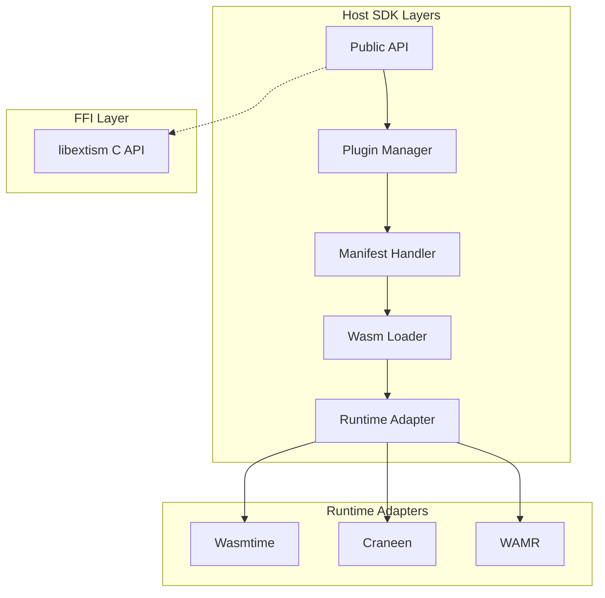

# Deep Dive: Host SDK Architecture

## Overview

This deep dive explores the Host SDK architecture across multiple languages. The Extism Host SDK provides a universal interface for loading and executing WebAssembly plugins while maintaining security, isolation, and performance.

## SDK Architecture



## Rust SDK Deep Dive

### Plugin Structure

```rust
use extism::{Plugin, Manifest, Wasm, CurrentPlugin, Error};

/// Basic plugin loading
pub fn load_plugin(wasm_path: &str) -> Result<Plugin, Error> {
    let manifest = Manifest::new([Wasm::file(wasm_path)]);
    Plugin::new(&manifest, [], true)
}

/// Plugin with configuration
pub fn load_plugin_with_config(
    wasm_path: &str,
    config: serde_json::Value,
) -> Result<Plugin, Error> {
    let manifest = Manifest::new([Wasm::file(wasm_path)])
        .with_config(config);
    Plugin::new(&manifest, [], true)
}

/// Plugin with capabilities
pub fn load_plugin_with_capabilities(
    wasm_path: &str,
    allowed_hosts: Vec<String>,
) -> Result<Plugin, Error> {
    let manifest = Manifest::new([Wasm::file(wasm_path)])
        .with_allowed_hosts(allowed_hosts);
    Plugin::new(&manifest, [], true)
}
```

### Plugin Manager

```rust
use std::collections::HashMap;
use std::sync::{Arc, Mutex};

/// Manage multiple plugins
pub struct PluginManager {
    plugins: HashMap<String, Plugin>,
    cache: Arc<Mutex<ModuleCache>>,
}

impl PluginManager {
    pub fn new() -> Self {
        Self {
            plugins: HashMap::new(),
            cache: Arc::new(Mutex::new(ModuleCache::new())),
        }
    }
    
    pub fn register(
        &mut self,
        name: String,
        manifest: Manifest,
    ) -> Result<(), Error> {
        let plugin = Plugin::new(&manifest, [], true)?;
        self.plugins.insert(name, plugin);
        Ok(())
    }
    
    pub fn call<A, R>(&mut self, name: &str, func: &str, args: A) -> Result<R, Error>
    where
        A: IntoWasmArgs,
        R: FromWasmReturn,
    {
        let plugin = self.plugins
            .get_mut(name)
            .ok_or_else(|| Error::msg("Plugin not found"))?;
        plugin.call(func, args)
    }
    
    pub fn unregister(&mut self, name: &str) -> Option<Plugin> {
        self.plugins.remove(name)
    }
}
```

### Host Functions

```rust
use extism::{CurrentPlugin, Error, Val};

/// Define a host function
fn log_function(
    plugin: &mut CurrentPlugin,
    inputs: &[Val],
    outputs: &mut [Val],
) -> Result<(), Error> {
    // Get input from plugin memory
    let offset = inputs[0].unwrap_i64() as u64;
    let message = plugin.memory_get_str(offset)?;
    
    println!("Plugin log: {}", message);
    
    Ok(())
}

/// Host function with state
struct LogState {
    prefix: String,
    count: u32,
}

fn log_with_state(
    plugin: &mut CurrentPlugin,
    inputs: &[Val],
    outputs: &mut [Val],
) -> Result<(), Error> {
    // Access host state
    let state = plugin.host_state::<LogState>()
        .ok_or_else(|| Error::msg("No host state"))?;
    
    let offset = inputs[0].unwrap_i64() as u64;
    let message = plugin.memory_get_str(offset)?;
    
    println!("{} [{}]: {}", state.prefix, state.count, message);
    
    // Update state
    let state = plugin.host_state_mut::<LogState>().unwrap();
    state.count += 1;
    
    Ok(())
}

/// Register host function
let manifest = Manifest::new([Wasm::file("plugin.wasm")]);
let mut plugin = Plugin::new(&manifest, [], true)?;

plugin.add_host_function("log", log_function);
```

### Memory Access

```rust
/// Direct memory access
pub fn read_plugin_memory(
    plugin: &mut Plugin,
    offset: u64,
    length: usize,
) -> Result<Vec<u8>, Error> {
    plugin.memory_get::<Vec<u8>>(offset)
}

/// Write to plugin memory
pub fn write_plugin_memory(
    plugin: &mut Plugin,
    offset: u64,
    data: &[u8],
) -> Result<(), Error> {
    plugin.memory_set(offset, data)
}

/// Get pointer from function call
pub fn call_and_read(
    plugin: &mut Plugin,
    func: &str,
    args: &str,
) -> Result<String, Error> {
    // Call returns memory pointer
    let ptr = plugin.call::<&str, extism::Ptr>(func, args)?;
    
    // Read from returned pointer
    let result = plugin.memory_get::<String>(ptr)?;
    
    Ok(result)
}
```

## JavaScript SDK

### Plugin Loading

```javascript
import { Plugin, Manifest } from '@extism/extism';

// Load from URL
const plugin = await Plugin.fromUrl('plugin.wasm');

// Load from manifest
const manifest = {
    wasm: [{ url: 'plugin.wasm' }],
    config: { key: 'value' }
};
const plugin = await new Plugin(manifest);

// Load from file (Node.js)
import { readFileSync } from 'fs';
const wasmData = readFileSync('plugin.wasm');
const plugin = await new Plugin([{ data: wasmData }]);
```

### Function Calling

```javascript
// Simple call
const result = await plugin.call('greet', 'World');
console.log(result);

// Call with options
const result = await plugin.call('greet', 'World', {
    encoding: 'utf8'
});

// Multiple calls
const results = await Promise.all([
    plugin.call('func1', 'input1'),
    plugin.call('func2', 'input2'),
]);
```

### Host Functions (JS)

```javascript
import { Plugin, Manifest } from '@extism/extism';

// Define host function
const hostFunctions = {
    log: (plugin, input) => {
        console.log('Plugin says:', input);
        return 'OK';
    }
};

const manifest = {
    wasm: [{ url: 'plugin.wasm' }],
    host_functions: hostFunctions
};

const plugin = await new Plugin(manifest);
```

## Go SDK

### Plugin Loading

```go
package main

import "github.com/extism/go-sdk"

func main() {
    // From file
    manifest := extism.Manifest{
        Wasm: []extism.Wasm{{
            Path: "plugin.wasm",
        }},
    }
    
    plugin, err := extism.NewPlugin(manifest)
    if err != nil {
        panic(err)
    }
    defer plugin.Close()
    
    // Call function
    result, err := plugin.Call("greet", []byte("World"))
    if err != nil {
        panic(err)
    }
    
    fmt.Println(string(result))
}
```

### Host Functions (Go)

```go
func logFunction(plugin *extism.CurrentPlugin, inputs []extism.Val, outputs []extism.Val) error {
    // Get input
    data := plugin.Memory().Get(inputs[0].I64())
    fmt.Println("Plugin:", string(data))
    return nil
}

manifest := extism.Manifest{
    Wasm: []extism.Wasm{{Path: "plugin.wasm"}},
    HostFunctions: map[string]extism.HostFunction{
        "log": logFunction,
    },
}

plugin, _ := extism.NewPlugin(manifest)
```

## Python SDK

### Plugin Loading

```python
import extism

# Basic plugin
plugin = extism.Plugin("plugin.wasm")

# With config
plugin = extism.Plugin("plugin.wasm", config={"key": "value"})

# With capabilities
plugin = extism.Plugin(
    "plugin.wasm",
    allowed_hosts=["https://api.example.com"]
)
```

### Function Calling

```python
# Simple call
result = plugin.call("greet", "World")
print(result)

# With encoding
result = plugin.call("greet", "World", encoding="utf-8")
```

## FFI Layer (libextism)

### C API

```c
#include <extism.h>

// Initialize
ExtismCurrentPlugin* plugin;
ExtismCompileOptions* options = extism_compile_options_new();
extism_compile_options_set_wasm(options, "plugin.wasm");

// Compile
ExtismPlugin* compiled = extism_plugin_compile(options);

// Create instance
plugin = extism_plugin_new(compiled);

// Call
uint8_t* output;
Size output_len;
extism_plugin_call(plugin, "greet", input, input_len, &output, &output_len);

// Cleanup
extism_plugin_free(plugin);
extism_compile_options_free(options);
```

### FFI Bindings

```rust
/// Rust FFI wrapper
#[repr(C)]
pub struct ExtismPlugin {
    id: u64,
}

#[no_mangle]
pub extern "C" fn extism_plugin_compile(
    options: *const ExtismCompileOptions,
) -> *mut ExtismPlugin {
    // Compile and return plugin pointer
}

#[no_mangle]
pub extern "C" fn extism_plugin_call(
    plugin: *mut ExtismPlugin,
    function_name: *const c_char,
    input: *const u8,
    input_len: Size,
    output: *mut *mut u8,
    output_len: *mut Size,
) -> i32 {
    // Call plugin function
}
```

## Performance Considerations

### Plugin Pooling

```rust
use std::sync::Arc;
use tokio::sync::Mutex;

/// Pool of reusable plugin instances
pub struct PluginPool {
    plugins: Arc<Mutex<Vec<Plugin>>>,
    manifest: Manifest,
}

impl PluginPool {
    pub fn new(manifest: Manifest, size: usize) -> Result<Self, Error> {
        let mut plugins = Vec::with_capacity(size);
        
        for _ in 0..size {
            plugins.push(Plugin::new(&manifest, [], true)?);
        }
        
        Ok(Self {
            plugins: Arc::new(Mutex::new(plugins)),
            manifest,
        })
    }
    
    pub async fn acquire(&self) -> Result<PluginGuard, Error> {
        let mut plugins = self.plugins.lock().await;
        
        if let Some(plugin) = plugins.pop() {
            Ok(PluginGuard {
                plugin: Some(plugin),
                pool: Arc::clone(&self.plugins),
            })
        } else {
            // Create new instance
            let plugin = Plugin::new(&self.manifest, [], true)?;
            Ok(PluginGuard {
                plugin: Some(plugin),
                pool: Arc::clone(&self.plugins),
            })
        }
    }
}

pub struct PluginGuard {
    plugin: Option<Plugin>,
    pool: Arc<Mutex<Vec<Plugin>>>,
}

impl Drop for PluginGuard {
    fn drop(&mut self) {
        if let Some(plugin) = self.plugin.take() {
            // Return to pool
            let pool = self.pool.clone();
            tokio::spawn(async move {
                let mut plugins = pool.lock().await;
                plugins.push(plugin);
            });
        }
    }
}
```

### Caching

```rust
use std::path::PathBuf;
use sha2::{Sha256, Digest};

/// Module cache for faster startup
pub struct ModuleCache {
    cache_dir: PathBuf,
    modules: HashMap<WasmHash, Module>,
}

impl ModuleCache {
    pub fn new() -> Self {
        let cache_dir = std::env::temp_dir().join("extism-cache");
        std::fs::create_dir_all(&cache_dir).ok();
        
        Self {
            cache_dir,
            modules: HashMap::new(),
        }
    }
    
    pub fn get_or_compile(&mut self, wasm: &Wasm) -> Result<Module, Error> {
        let hash = self.hash_wasm(wasm)?;
        
        if let Some(cached) = self.modules.get(&hash) {
            return Ok(cached.clone());
        }
        
        // Check file cache
        let cached_path = self.cache_dir.join(format!("{:x}", hash));
        if cached_path.exists() {
            let bytes = std::fs::read(&cached_path)?;
            let module = Module::from_binary(&self.engine, &bytes)?;
            self.modules.insert(hash, module.clone());
            return Ok(module);
        }
        
        // Compile and cache
        let bytes = wasm.fetch()?;
        let module = Module::from_binary(&self.engine, &bytes)?;
        
        // Save to file cache
        std::fs::write(&cached_path, &bytes)?;
        
        self.modules.insert(hash, module.clone());
        Ok(module)
    }
    
    fn hash_wasm(&self, wasm: &Wasm) -> Result<WasmHash, Error> {
        let bytes = wasm.fetch()?;
        let mut hasher = Sha256::new();
        hasher.update(&bytes);
        Ok(hasher.finalize())
    }
}
```

## Conclusion

The Extism Host SDK provides:

1. **Multi-language support**: Rust, JS, Go, Python, and more
2. **Universal API**: Same interface across languages
3. **Host functions**: Extend plugin capabilities safely
4. **Memory management**: Safe access to plugin memory
5. **Performance**: Plugin pooling, module caching
6. **FFI layer**: libextism C API for language bindings
