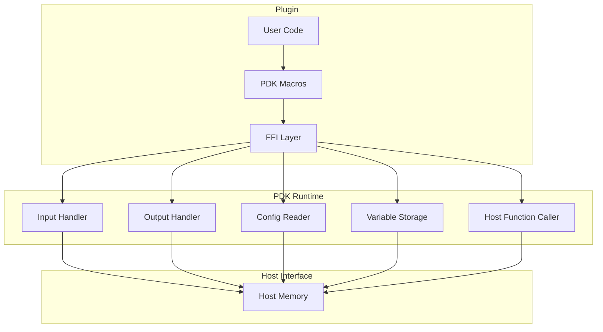

# Deep Dive: PDK (Plugin Development Kit)

## Overview

The Plugin Development Kit (PDK) provides the interface for writing WebAssembly plugins that run on the Extism runtime. This deep dive explores the internals of the PDK across multiple languages, focusing on how input/output is handled, how host functions are called, and how plugin state is managed.

## PDK Architecture



## Rust PDK Deep Dive

### Plugin Function Macro

```rust
// Source: extism_pdk/src/lib.rs

/// The #[plugin_fn] macro transforms functions into exported Wasm functions
#[proc_macro_attribute]
pub fn plugin_fn(attr: TokenStream, item: TokenStream) -> TokenStream {
    let mut func = parse_macro_input!(item as syn::ItemFn);
    
    // Wrap function body to handle input/output
    let wrapped = quote! {
        #[no_mangle]
        pub extern "C" fn __extism_main() -> u64 {
            // Read input from host
            let input_offset = unsafe { extism::input_offset() };
            let input_length = unsafe { extism::input_length() };
            
            // Deserialize input
            let input_data = unsafe {
                std::slice::from_raw_parts(
                    input_offset as *const u8,
                    input_length as usize,
                )
            };
            
            // Parse based on function signature
            let args = ::extism_pdk::from_slice(input_data);
            
            // Call user function
            let result = user_function(args);
            
            // Serialize and set output
            let output = ::extism_pdk::to_vec(&result?).unwrap();
            let output_ptr = output.as_ptr() as u64;
            let output_len = output.len() as u64;
            
            // Transfer ownership to host
            unsafe { extism::set_output(output_ptr, output_len) };
            
            0 // Success
        }
        
        #func
    };
    
    wrapped.into()
}
```

### Input/Output Handling

```rust
// Source: extism_pdk/src/io.rs

/// Read input from host
pub fn input() -> Vec<u8> {
    unsafe {
        let ptr = extism_sys::input_offset();
        let len = extism_sys::input_length();
        
        std::slice::from_raw_parts(
            ptr as *const u8,
            len as usize,
        ).to_vec()
    }
}

/// Read input as string
pub fn input_str() -> Result<String, Error> {
    let input = input();
    String::from_utf8(input).map_err(|e| Error::Utf8Error(e))
}

/// Set output to host
pub fn set_output(data: &[u8]) {
    unsafe {
        let ptr = data.as_ptr() as u64;
        let len = data.len() as u64;
        extism_sys::set_output(ptr, len);
    }
}

/// Set output string
pub fn set_output_str(s: &str) {
    set_output(s.as_bytes());
}
```

### Memory Allocation

```rust
// Source: extism_pdk/src/alloc.rs

/// Allocate memory in Wasm heap
#[no_mangle]
pub extern "C" fn alloc(length: usize) -> *mut u8 {
    unsafe {
        let layout = std::alloc::Layout::from_size_align_unchecked(
            length,
            1,
        );
        let ptr = std::alloc::alloc(layout);
        
        if ptr.is_null() {
            std::alloc::handle_alloc_error(layout);
        }
        
        ptr
    }
}

/// Free allocated memory
#[no_mangle]
pub extern "C" fn free(ptr: *mut u8) {
    unsafe {
        let layout = std::alloc::Layout::from_size_align_unchecked(1, 1);
        std::alloc::dealloc(ptr, layout);
    }
}

/// Box allocator for PDK
pub struct PdkAllocator;

unsafe impl std::alloc::GlobalAlloc for PdkAllocator {
    unsafe fn alloc(&self, layout: Layout) -> *mut u8 {
        alloc(layout.size())
    }
    
    unsafe fn dealloc(&self, ptr: *mut u8, layout: Layout) {
        free(ptr);
    }
}
```

### Configuration Access

```rust
// Source: extism_pdk/src/config.rs

/// Get configuration value as string
pub fn get(key: &str) -> Result<Option<String>, Error> {
    let key_bytes = key.as_bytes();
    
    unsafe {
        let result_ptr = extism_sys::config_get(
            key_bytes.as_ptr() as u64,
            key_bytes.len() as u64,
        );
        
        if result_ptr == 0 {
            return Ok(None);
        }
        
        // Read result from memory
        let result = read_string_from_memory(result_ptr);
        Ok(Some(result))
    }
}

/// Get configuration and parse as type
pub fn get_as<T: serde::de::DeserializeOwned>() -> Result<T, Error> {
    let all_config = get_all()?;
    serde_json::from_value(all_config)
        .map_err(|e| Error::JsonError(e))
}

/// Get all configuration as JSON
pub fn get_all() -> Result<serde_json::Value, Error> {
    unsafe {
        let result_ptr = extism_sys::config_get_all();
        let result = read_string_from_memory(result_ptr);
        serde_json::from_str(&result)
            .map_err(|e| Error::JsonError(e))
    }
}
```

### Variable Storage

```rust
// Source: extism_pdk/src/var.rs

/// Get variable from plugin storage
pub fn get<T: serde::de::DeserializeOwned>(key: &str) -> Result<Option<T>, Error> {
    let key_bytes = key.as_bytes();
    
    unsafe {
        let result_ptr = extism_sys::var_get(
            key_bytes.as_ptr() as u64,
            key_bytes.len() as u64,
        );
        
        if result_ptr == 0 {
            return Ok(None);
        }
        
        let result = read_string_from_memory(result_ptr);
        let value: T = serde_json::from_str(&result)?;
        Ok(Some(value))
    }
}

/// Set variable in plugin storage
pub fn set<T: serde::Serialize>(key: &str, value: T) -> Result<(), Error> {
    let key_bytes = key.as_bytes();
    let value_bytes = serde_json::to_vec(&value)?;
    
    unsafe {
        extism_sys::var_set(
            key_bytes.as_ptr() as u64,
            key_bytes.len() as u64,
            value_bytes.as_ptr() as u64,
            value_bytes.len() as u64,
        );
    }
    
    Ok(())
}

/// Remove variable
pub fn remove(key: &str) -> Result<(), Error> {
    let key_bytes = key.as_bytes();
    
    unsafe {
        extism_sys::var_remove(
            key_bytes.as_ptr() as u64,
            key_bytes.len() as u64,
        );
    }
    
    Ok(())
}

/// Get all variables
pub fn get_all() -> Result<std::collections::HashMap<String, serde_json::Value>, Error> {
    unsafe {
        let result_ptr = extism_sys::var_get_all();
        let result = read_string_from_memory(result_ptr);
        let map: std::collections::HashMap<String, serde_json::Value> = 
            serde_json::from_str(&result)?;
        Ok(map)
    }
}
```

### Host Function Calls

```rust
// Source: extism_pdk/src/host_fn.rs

/// Call a host function
#[macro_export]
macro_rules! host_fn {
    ($name:ident ($($arg:expr),*)) => {{
        let args = vec![$(::extism_pdk::to_vec(&$arg)?),*];
        let result_ptr = unsafe {
            extism_sys::call_host(
                stringify!($name).as_ptr() as u64,
                stringify!($name).len() as u64,
                args.as_ptr() as u64,
                args.len() as u64,
            )
        };
        ::extism_pdk::from_ptr(result_ptr)
    }};
}

/// HTTP request via host
pub fn http_request(req: HttpRequest) -> Result<HttpResponse, Error> {
    let req_bytes = serde_json::to_vec(&req)?;
    
    unsafe {
        let result_ptr = extism_sys::http_request(
            req_bytes.as_ptr() as u64,
            req_bytes.len() as u64,
        );
        
        let result = read_string_from_memory(result_ptr);
        let response: HttpResponse = serde_json::from_str(&result)?;
        Ok(response)
    }
}

/// Get random bytes from host
pub fn random(buffer: &mut [u8]) -> Result<(), Error> {
    unsafe {
        extism_sys::random(
            buffer.as_mut_ptr() as u64,
            buffer.len() as u64,
        );
    }
    Ok(())
}

/// Sleep via host
pub fn sleep(milliseconds: u64) -> Result<(), Error> {
    unsafe {
        extism_sys::sleep(milliseconds);
    }
    Ok(())
}
```

### Error Handling

```rust
// Source: extism_pdk/src/error.rs

#[derive(Debug, thiserror::Error)]
pub enum Error {
    #[error("UTF-8 encoding error: {0}")]
    Utf8Error(#[from] std::string::FromUtf8Error),
    
    #[error("JSON error: {0}")]
    JsonError(#[from] serde_json::Error),
    
    #[error("Host function error: {0}")]
    HostFunctionError(String),
    
    #[error("HTTP error: {0}")]
    HttpError(String),
    
    #[error("Memory error: invalid pointer")]
    MemoryError,
    
    #[error("Config key not found: {0}")]
    ConfigNotFound(String),
    
    #[error("Variable not found: {0}")]
    VariableNotFound(String),
}

/// Result type alias
pub type FnResult<T> = Result<T, Error>;
```

## Go PDK

### Plugin Structure

```go
// Source: github.com/extism/go-pdk

package pdk

// Input returns the input data from host
func Input() []byte {
    length := input_length()
    if length == 0 {
        return []byte{}
    }
    
    ptr := input_offset()
    return load(ptr, length)
}

// SetOutput sets the output data for host
func SetOutput(data []byte) {
    if len(data) == 0 {
        return
    }
    
    ptr := allocBytes(data)
    set_output(ptr, uint64(len(data)))
}

// LoadVar loads a variable from storage
func LoadVar(key string, value interface{}) error {
    data := var_get([]byte(key))
    if data == nil {
        return errors.New("variable not found")
    }
    
    return json.Unmarshal(data, value)
}

// StoreVar stores a variable in storage
func StoreVar(key string, value interface{}) error {
    data, err := json.Marshal(value)
    if err != nil {
        return err
    }
    
    var_set([]byte(key), data)
    return nil
}

// GetConfig gets a configuration value
func GetConfig(key string) string {
    data := config_get([]byte(key))
    return string(data)
}
```

### HTTP in Go PDK

```go
type HttpRequest struct {
    Url     string            `json:"url"`
    Method  string            `json:"method"`
    Headers map[string]string `json:"headers"`
    Body    []byte            `json:"body,omitempty"`
}

type HttpResponse struct {
    Status  int               `json:"status"`
    Headers map[string]string `json:"headers"`
    Body    []byte            `json:"body"`
}

func HttpRequest(req HttpRequest) (*HttpResponse, error) {
    data, _ := json.Marshal(req)
    ptr := allocBytes(data)
    
    resultPtr := http_request(ptr, uint64(len(data)))
    result := load(resultPtr, -1)
    
    var resp HttpResponse
    err := json.Unmarshal(result, &resp)
    return &resp, err
}
```

## AssemblyScript PDK

### Plugin Structure

```typescript
// Source: @extism/as-pdk

import { console } from "assemblyscript";

// Export macro
export function plugin_fn(target: any, key: string, descriptor: any): void {
    const originalMethod = descriptor.value;
    
    descriptor.value = function(...args: any[]): void {
        // Read input
        const inputOffset = extism.input_offset();
        const inputLength = extism.input_length();
        
        // Parse input
        const inputData = Uint8Array.wrap(inputOffset, inputLength);
        const input = decode(inputData);
        
        // Call method
        const result = originalMethod.call(this, input);
        
        // Set output
        const output = encode(result);
        extism.set_output(output.dataStart, output.byteLength);
    };
    
    // Export the wrapper function
    exportFunction(key);
}

// Memory allocation
export function alloc(size: i32): usize {
    return __new(size, idof<Uint8Array>());
}

// Input/Output
export namespace extism {
    export function input_offset(): usize {
        return extism_host.input_offset();
    }
    
    export function input_length(): usize {
        return extism_host.input_length();
    }
    
    export function set_output(offset: usize, length: usize): void {
        extism_host.set_output(offset, length);
    }
    
    export function config_get(key: string): string | null {
        const result = extism_host.config_get(changetype<usize>(key), key.length << 1);
        if (result === 0) return null;
        return <string>result;
    }
}
```

### Example Plugin

```typescript
import { plugin_fn } from "@extism/as-pdk";

@plugin_fn
export function greet(name: string): string {
    return `Hello, ${name}!`;
}

@plugin_fn
export function add(a: i32, b: i32): i32 {
    return a + b;
}

@plugin_fn
export function process_array(input: Uint8Array): Uint8Array {
    const output = new Uint8Array(input.length);
    for (let i = 0; i < input.length; i++) {
        output[i] = input[i] * 2;
    }
    return output;
}
```

## Building Plugins

### Rust Plugin Build

```bash
# Add wasm target
rustup target add wasm32-unknown-unknown

# Build release
cargo build --release --target wasm32-unknown-unknown

# Output: target/wasm32-unknown-unknown/release/plugin.wasm

# Optional: optimize with wasm-opt
wasm-opt -O3 target/wasm32-unknown-unknown/release/plugin.wasm \
    -o plugin.optimized.wasm
```

### Go Plugin Build

```bash
# Install TinyGo
# https://tinygo.org/getting-started/install/

# Build
tinygo build -o plugin.wasm -target=wasi plugin.go

# Or with specific GOOS
GOOS=wasip1 GOARCH=wasm tinygo build -o plugin.wasm plugin.go
```

### AssemblyScript Plugin Build

```bash
# Install dependencies
npm install --save-dev assemblyscript @extism/as-pdk

# Build
npx asc plugin.ts --target release

# Output: build/release.wasm
```

## Examples

### Image Processing Plugin (Rust)

```rust
use extism_pdk::*;
use image::{DynamicImage, ImageFormat};

#[plugin_fn]
pub fn resize(image_data: Vec<u8>, width: u32, height: u32) -> FnResult<Vec<u8>> {
    // Decode image
    let img = image::load_from_memory(&image_data)
        .map_err(|e| Error::msg(format!("Failed to decode image: {}", e)))?;
    
    // Resize
    let resized = img.resize_exact(width, height, image::imageops::FilterType::Lanczos3);
    
    // Encode back to bytes
    let mut output = Vec::new();
    resized.write_to(&mut output, ImageFormat::Png)
        .map_err(|e| Error::msg(format!("Failed to encode image: {}", e)))?;
    
    Ok(output)
}
```

### Markdown to HTML (Go)

```go
package main

import (
    "github.com/extism/go-pdk"
    "github.com/yuin/goldmark"
)

//export render
func render() uint32 {
    input := string(pdk.Input())
    
    var buf bytes.Buffer
    goldmark.Convert([]byte(input), &buf)
    
    pdk.SetOutput(buf.Bytes())
    return 0
}
```

## Conclusion

The PDK provides:

1. **Simple API**: `#[plugin_fn]` macro for Rust
2. **Input/Output**: Automatic serialization
3. **Configuration**: Key-value access from host
4. **Variables**: Persistent plugin state
5. **Host functions**: Call host-provided functionality
6. **Multi-language**: Rust, Go, AssemblyScript, C, Zig
