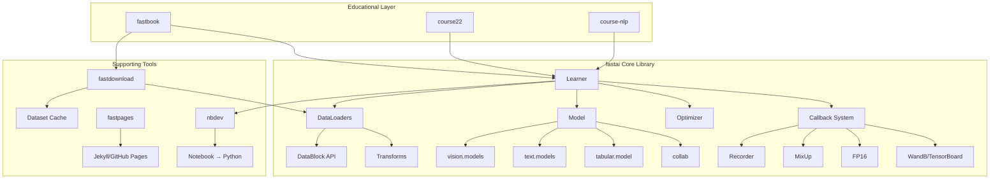
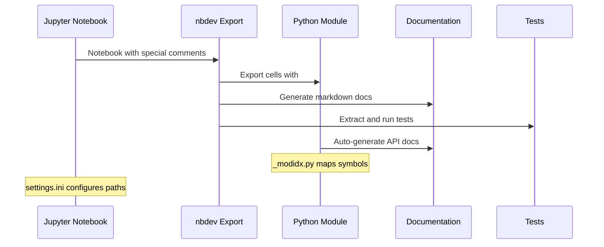
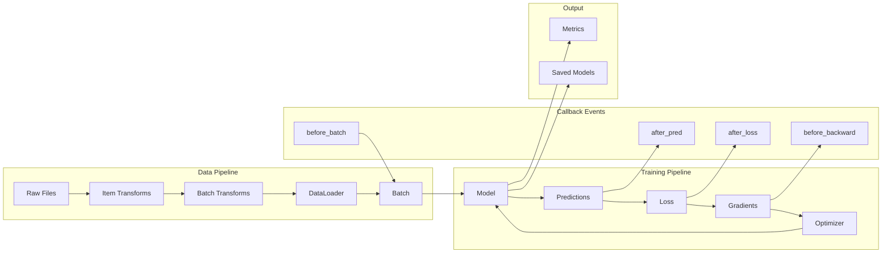
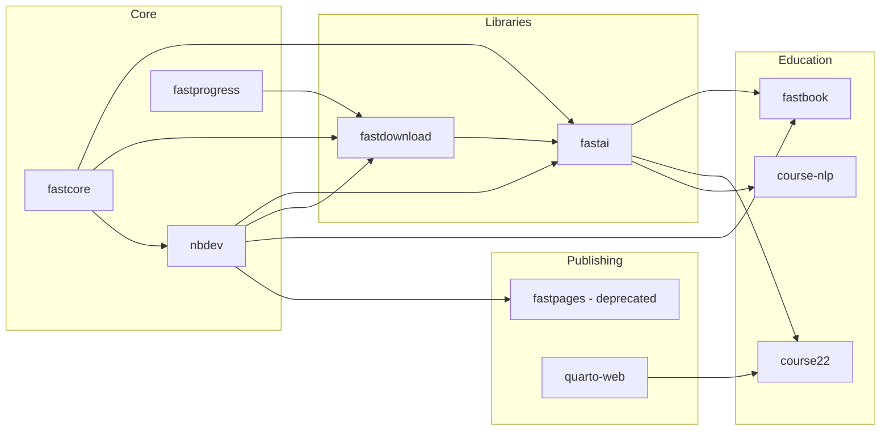

# Project Exploration: fastai Ecosystem

## Overview

The fastai ecosystem is a comprehensive collection of deep learning tools, educational resources, and developer utilities built around the fastai library - a high-level PyTorch-based deep learning framework. The ecosystem is designed to make deep learning accessible to practitioners while remaining flexible enough for researchers.

At its core, fastai provides a layered API that offers both high-level components for quick results in standard domains (computer vision, NLP, tabular data, collaborative filtering) and low-level components for building new approaches. The ecosystem is unique in its "notebook-first" development philosophy, powered by nbdev, which allows developers to create Python libraries entirely from Jupyter notebooks.

The projects in this source snapshot include the main fastai library (v2.8.3), the fastbook educational materials, fastdownload for dataset management, fastpages for technical blogging, and extensive course materials for both introductory and advanced deep learning topics.

## Repository

- **Location:** /home/darkvoid/Boxxed/@formulas/src.fastai
- **Remote:** Multiple (fastai/fastbook/fastdownload/fastpages on GitHub)
- **Primary Language:** Python, Jupyter Notebook
- **License:** Apache 2.0 (fastai, fastdownload), GPL v3 + restrictions (fastbook), MIT (fastpages)

## Directory Structure

```
/home/darkvoid/Boxxed/@formulas/src.fastai/
├── fastai/                          # Main fastai library (v2.8.3)
│   ├── fastai/                      # Core library source code
│   │   ├── callback/                # Training callback system
│   │   │   ├── core.py              # Base callback class and event system
│   │   │   ├── schedule.py          # Learning rate scheduling
│   │   │   ├── tracker.py           # Model checkpointing, early stopping
│   │   │   ├── mixup.py             # Mixup data augmentation
│   │   │   ├── fp16.py              # Mixed precision training
│   │   │   ├── wandb.py             # Weights & Biases integration
│   │   │   ├── tensorboard.py       # TensorBoard integration
│   │   │   └── ...
│   │   ├── data/                    # Data loading and transforms
│   │   │   ├── core.py              # DataLoaders, TfmdLists
│   │   │   ├── block.py             # DataBlock API
│   │   │   ├── transforms.py        # Transform pipelines
│   │   │   ├── external.py          # External dataset handling
│   │   │   └── load.py              # Data loading utilities
│   │   ├── vision/                  # Computer vision module
│   │   │   ├── core.py              # Vision-specific types (Image, Point)
│   │   │   ├── augment.py           # GPU-accelerated augmentations
│   │   │   ├── data.py              # Vision data loaders
│   │   │   ├── learner.py           # VisionLearner
│   │   │   ├── models/              # Pretrained architectures
│   │   │   └── widgets.py           # Interactive widgets
│   │   ├── text/                    # NLP module
│   │   │   ├── core.py              # Text-specific types
│   │   │   ├── data.py              # Language model data
│   │   │   ├── learner.py           # TextLearner
│   │   │   └── models/              # AWD-LSTM, transformers
│   │   ├── tabular/                 # Tabular data module
│   │   │   ├── core.py              # Tabular transforms
│   │   │   ├── data.py              # TabularDataLoaders
│   │   │   ├── model.py             # TabularModel
│   │   │   └── learner.py           # TabularLearner
│   │   ├── collab.py                # Collaborative filtering
│   │   ├── learner.py               # Learner class (training loop)
│   │   ├── optimizer.py             # Optimizer wrappers
│   │   ├── layers.py                # Neural network layers
│   │   ├── losses.py                # Loss functions
│   │   ├── metrics.py               # Evaluation metrics
│   │   ├── torch_core.py            # PyTorch utilities
│   │   ├── distributed.py           # Distributed training
│   │   ├── interpret.py             # Model interpretation
│   │   ├── _modidx.py               # Module index (auto-generated)
│   │   └── _nbdev.py                # nbdev integration (auto-generated)
│   ├── nbs/                         # Source notebooks (library generated from these)
│   │   ├── 00_torch_core.ipynb      # PyTorch core utilities
│   │   ├── 01a_losses.ipynb         # Loss functions
│   │   ├── 01_layers.ipynb          # Neural network layers
│   │   ├── 07_vision.core.ipynb     # Vision core
│   │   ├── 13a_learner.ipynb        # Learner class
│   │   ├── 13_callback.core.ipynb   # Callback system
│   │   └── ...                      # One notebook per module
│   ├── settings.ini                 # nbdev configuration
│   ├── pyproject.toml               # Python project config
│   └── setup.py                     # Setup script
│
├── fastbook/                        # Deep Learning for Coders book
│   ├── 01_intro.ipynb               # Chapter 1: Introduction
│   ├── 02_production.ipynb          # Chapter 2: Production
│   ├── 03_ethics.ipynb              # Chapter 3: Ethics
│   ├── 04_mnist_basics.ipynb        # Chapter 4: MNIST basics
│   ├── 05_pet_breeds.ipynb          # Chapter 5: Pet breeds classifier
│   ├── 06_multicat.ipynb            # Chapter 6: Multi-category classification
│   ├── 07_sizing_and_tta.ipynb      # Chapter 7: Sizing and TTA
│   ├── 08_collab.ipynb              # Chapter 8: Collaborative filtering
│   ├── 09_tabular.ipynb             # Chapter 9: Tabular data
│   ├── 10_nlp.ipynb                 # Chapter 10: NLP introduction
│   ├── 11_midlevel_data.ipynb       # Chapter 11: Mid-level data API
│   ├── 12_nlp_dive.ipynb            # Chapter 12: NLP deep dive
│   ├── 13_convolutions.ipynb        # Chapter 13: Convolutions
│   ├── 14_resnet.ipynb              # Chapter 14: ResNet
│   ├── 15_arch_details.ipynb        # Chapter 15: Architecture details
│   ├── 16_accel_sgd.ipynb           # Chapter 16: Accelerated SGD
│   ├── 17_foundations.ipynb         # Chapter 17: Foundations
│   ├── 18_CAM.ipynb                 # Chapter 18: Grad-CAM
│   ├── 19_learner.ipynb             # Chapter 19: Learner internals
│   ├── 20_conclusion.ipynb          # Chapter 20: Conclusion
│   ├── app_jupyter.ipynb            # Jupyter introduction
│   ├── app_blog.ipynb               # Blogging tutorial
│   └── images/                      # Book illustrations
│
├── fastdownload/                    # Dataset download utility
│   ├── fastdownload/
│   │   ├── core.py                  # FastDownload class
│   │   ├── urls.py                  # URL utilities
│   │   └── _nbdev.py                # nbdev integration
│   ├── 00_core.ipynb                # Source notebook
│   ├── index.ipynb                  # Documentation index
│   ├── docs/                        # Generated documentation
│   └── settings.ini                 # nbdev configuration
│
├── fastpages/                       # Technical blogging platform
│   ├── _notebooks/                  # Example notebook posts
│   ├── _posts/                      # Example markdown posts
│   ├── _word/                       # Word document posts
│   ├── _action_files/               # GitHub Actions workflows
│   ├── _config.yml                  # Jekyll configuration
│   ├── _layouts/                    # Jekyll layouts
│   ├── _includes/                   # Jekyll includes
│   ├── _sass/                       # Custom stylesheets
│   └── action.yml                   # GitHub Action definition
│
├── course22/                        # Deep Learning Part 1 (2022)
│   ├── 00-is-it-a-bird-*.ipynb      # Lesson 0: Creating models
│   ├── 01-jupyter-notebook-101.ipynb # Lesson 1: Jupyter basics
│   ├── 02-saving-a-basic-fastai-model.ipynb
│   ├── 03-which-image-models-are-best.ipynb
│   └── ...                          # 11 lessons total
│
├── course-nlp/                      # Deep Learning for NLP
│   ├── 1-what-is-nlp.ipynb          # Introduction to NLP
│   ├── 2-svd-nmf-topic-modeling.ipynb # Topic modeling
│   ├── 3-logreg-nb-imdb.ipynb       # Logistic regression, Naive Bayes
│   ├── 4-regex.ipynb                # Regular expressions
│   ├── 5-nn-imdb.ipynb              # Neural networks for NLP
│   ├── 6-rnn-english-numbers.ipynb  # RNNs
│   ├── 7-seq2seq-translation.ipynb  # Sequence-to-sequence
│   ├── 8-translation-transformer.ipynb # Transformers
│   └── ...
│
├── course22p2/                      # Deep Learning Part 2
│   └── nbs/                         # Advanced course notebooks
│
├── course22-web/                    # Course website materials
│   ├── Lessons/                     # Lesson content
│   ├── Resources/                   # Additional resources
│   └── images/                      # Course images
│
├── diffusion-nbs/                   # Diffusion model notebooks
├── imagenette/                      # ImageNette dataset utilities
├── timmdocs/                        # timm library documentation
├── nbdev_cards/                     # nbdev Cards integration
├── quarto-web/                      # Quarto documentation examples
└── ...                              # Additional projects and utilities
```

## Architecture

### High-Level Diagram



### nbdev Workflow Architecture



### Component Breakdown

#### fastai Library Core

- **Location:** `/home/darkvoid/Boxxed/@formulas/src.fastai/fastai/fastai/`
- **Purpose:** High-level deep learning library built on PyTorch
- **Dependencies:** PyTorch, fastcore, fastprogress, fastdownload, torchvision
- **Dependents:** All fastai courses, fastbook, user projects

Key architectural patterns:
1. **Type Dispatch System:** `@typedispatch` decorator from fastcore enables function overloading based on argument types
2. **Callback System:** Event-driven hooks at every training stage (before_batch, after_loss, before_backward, etc.)
3. **DataBlock API:** Declarative data pipeline specification
4. **Learner Pattern:** Encapsulates model, data, optimizer, and training loop

#### Learner Class (Training Loop Core)

- **Location:** `/home/darkvoid/Boxxed/@formulas/src.fastai/fastai/fastai/learner.py`
- **Purpose:** Central training loop coordinator
- **Dependencies:** Callback system, DataLoader, model, optimizer
- **Dependents:** All task-specific learners (VisionLearner, TextLearner, etc.)

The Learner executes this flow:
1. `fit()` called with epochs and learning rate
2. Triggers `before_fit` event to callbacks
3. For each epoch:
   - `before_epoch` event
   - Training loop over batches:
     - `before_batch`: Data preparation
     - Forward pass
     - `after_pred`: Post-prediction hooks
     - Loss computation
     - `after_loss`: Loss modification hooks
     - `before_backward`: Gradient hooks
     - Backward pass
     - `before_step`: Pre-optimization hooks
     - `after_step`: Optimizer step
     - `after_batch`: Cleanup
   - Validation loop
   - `after_epoch` event
4. `after_fit` event

#### Callback System

- **Location:** `/home/darkvoid/Boxxed/@formulas/src.fastai/fastai/fastai/callback/`
- **Purpose:** Extensible hooks for customizing training behavior
- **Dependencies:** Learner, event system
- **Dependents:** All training workflows

Key callbacks:
- **Recorder:** Tracks metrics and losses
- **Scheduler:** Learning rate schedules
- **Tracker:** Model checkpointing, early stopping
- **MixUp:** Data augmentation technique
- **FP16:** Mixed precision training
- **WandB/TensorBoard:** Experiment tracking

#### Vision Module

- **Location:** `/home/darkvoid/Boxxed/@formulas/src.fastai/fastai/fastai/vision/`
- **Purpose:** Computer vision models, transforms, and utilities
- **Dependencies:** torchvision, Pillow, Albumentations (optional)
- **Dependents:** Image classification, segmentation, object detection

Features:
- GPU-accelerated augmentations (flip, rotate, zoom, lighting)
- Pretrained architectures (ResNet, EfficientNet, Vision Transformers)
- Task-specific learners (classification, segmentation, GANs)
- Interactive widgets for image browsing

#### Text/NLP Module

- **Location:** `/home/darkvoid/Boxxed/@formulas/src.fastai/fastai/fastai/text/`
- **Purpose:** Natural language processing models and data
- **Dependencies:** SentencePiece, transformers (optional)
- **Dependents:** Language modeling, classification, generation

Features:
- AWD-LSTM language model
- ULMFiT transfer learning
- Tokenization pipelines
- Transformer integration

#### Tabular Module

- **Location:** `/home/darkvoid/Boxxed/@formulas/src.fastai/fastai/fastai/tabular/`
- **Purpose:** Structured data modeling
- **Dependencies:** pandas, scikit-learn
- **Dependents:** Tabular classification and regression

Features:
- Categorical embeddings
- Continuous variable normalization
- Missing value handling
- TabularModel with batch normalization

#### DataBlock API

- **Location:** `/home/darkvoid/Boxxed/@formulas/src.fastai/fastai/fastai/data/block.py`
- **Purpose:** Declarative data pipeline specification
- **Dependencies:** fastcore, torch
- **Dependents:** All data loading in fastai

Example usage:
```python
pets = DataBlock(
    blocks=(ImageBlock, CategoryBlock),
    get_items=get_image_files,
    splitter=RandomSplitter(),
    get_y=RegexLabeller(pat=r'(.+)_\d+.jpg$'),
    item_tfms=Resize(460),
    batch_tfms=aug_transforms()
)
```

#### fastdownload

- **Location:** `/home/darkvoid/Boxxed/@formulas/src.fastai/fastdownload/`
- **Purpose:** Reliable dataset download and caching
- **Dependencies:** fastcore, fastprogress
- **Dependents:** fastai datasets, course materials

Key features:
- Automatic hash verification
- Size change detection for updates
- Configurable cache locations
- Integration with download_checks.py for version control

#### fastpages

- **Location:** `/home/darkvoid/Boxxed/@formulas/src.fastai/fastpages/`
- **Purpose:** Technical blogging from Jupyter notebooks
- **Dependencies:** Jekyll, GitHub Actions, nbdev
- **Dependents:** fast.ai blog, community blogs

Key features:
- Convert notebooks to blog posts automatically
- Hide/show code cells
- Interactive Altair visualizations
- Colab/Binder/Deepnote badges
- Word document support
- Comment system via GitHub Issues

#### fastbook

- **Location:** `/home/darkvoid/Boxxed/@formulas/src.fastai/fastbook/`
- **Purpose:** Educational materials for "Deep Learning for Coders"
- **Dependencies:** fastai library
- **Dependents:** Course students, self-learners

Structure:
- 20 chapters covering practical deep learning
- Starts with high-level concepts, progressively adds theory
- Emphasis on learning by doing
- Available in multiple languages

## Entry Points

### fastai Library Import

- **File:** `from fastai.vision.all import *`
- **Description:** Main entry point for using fastai
- **Flow:**
  1. `fastai/vision/all.py` imports vision module
  2. Imports fastai core (learner, callbacks, data)
  3. Exports common functions (vision_learner, get_image_files, etc.)
  4. User can immediately train models with minimal code

### nbdev Development Workflow

- **File:** `nbdev_prepare` (CLI command)
- **Description:** Prepare notebooks for release
- **Flow:**
  1. Clean notebook metadata
  2. Trust notebooks
  3. Strip cell ids
  4. Run CI tests
  5. Export to Python modules
  6. Generate documentation

### fastdownload Usage

- **File:** `FastDownload.get(url)`
- **Description:** Download and extract dataset
- **Flow:**
  1. Check local cache for URL
  2. Verify size/hash against download_checks.py
  3. If missing or outdated, download
  4. Extract to data directory
  5. Return path to extracted contents

### fastpages Blog Creation

- **File:** `_notebooks/YYYY-MM-DD-*.ipynb`
- **Description:** Create blog post from notebook
- **Flow:**
  1. User commits notebook to _notebooks/
  2. GitHub Actions CI triggered
  3. Convert notebook to markdown
  4. Process front matter
  5. Build Jekyll site
  6. Deploy to GitHub Pages

## Data Flow



## External Dependencies

| Dependency | Version | Purpose |
|------------|---------|---------|
| torch | >=1.10, <2.8 | Core deep learning framework |
| torchvision | >=0.11 | Computer vision models and transforms |
| fastcore | >=1.8.0, <1.9 | Python utilities, type dispatch |
| fastprogress | >=0.2.4 | Progress bars for training |
| fastdownload | >=0.0.5, <2 | Dataset downloading |
| fasttransform | >=0.0.2 | Image transforms |
| pillow | >=9.0.0 | Image loading |
| scikit-learn | - | Machine learning utilities |
| pandas | - | Data manipulation |
| matplotlib | - | Plotting |
| pyyaml | - | Configuration parsing |
| requests | - | HTTP requests for downloads |
| spacy | <4 | Text tokenization |
| cloudpickle | - | Serialization for multiprocessing |
| packaging | - | Version comparison |
| plum-dispatch | - | Multiple dispatch system |
| scipy | - | Scientific computing |

### Development Dependencies

| Dependency | Purpose |
|------------|---------|
| nbdev | Notebook-based development |
| pytest | Testing framework |
| jupyter | Notebook environment |
| lightning | Alternative framework comparison |
| transformers | Hugging Face integration |
| tensorboard | Experiment tracking |
| wandb | Weights & Biases integration |
| albumentations | Advanced augmentations |
| opencv-python | Image processing |
| timm | PyTorch Image Models |
| accelerate | Hugging Face Accelerate |

## Configuration

### settings.ini (nbdev Configuration)

Each project uses `settings.ini` to configure nbdev:

```ini
[DEFAULT]
lib_name = fastai
user = fastai
repo = fastai
branch = main
version = 2.8.3
description = fastai simplifies training fast and accurate neural nets
author = Jeremy Howard, Sylvain Gugger, and contributors
license = apache2
requirements = fastdownload>=0.0.5,<2 fastcore>=1.8.0,<1.9 ...
nbs_path = nbs
doc_path = _docs
git_url = https://github.com/fastai/fastai
lib_path = fastai
doc_host = https://docs.fast.ai
```

Key configuration options:
- `nbs_path`: Where source notebooks live
- `lib_path`: Where exported Python code goes
- `doc_path`: Generated documentation output
- `requirements`: Runtime dependencies
- `doc_host`: Documentation URL

### pyproject.toml (Python Project Config)

```toml
[build-system]
requires = ["setuptools>=64.0"]
build-backend = "setuptools.build_meta"

[project]
name = "fastai"
requires-python = ">=3.10"
```

### Runtime Configuration

fastai uses several environment variables and runtime settings:
- `FASTAI_HOME`: Base directory for caches (~/.fastai by default)
- `FASTAI_NO_PLUGINS`: Disable plugin loading
- CUDA visibility and memory settings via torch

## Testing

### Test Strategy

fastai uses a notebook-centric testing approach:

1. **Tests in Notebooks:** Tests are written in special notebook cells marked with `#|tests` or `#|export` followed by test code
2. **nbdev_test:** Runs all tests in parallel across notebooks
3. **Test Fixtures:** Example data and models in `nbs/files/` and `nbs/examples/`
4. **CI/CD:** GitHub Actions runs `nbdev_test` on every commit

### Running Tests

```bash
# Run all tests
nbdev_test

# Run tests with coverage
nbdev_test --coverage

# Run specific test module
python -m pytest fastai/test_utils.py
```

### Test Categories

- **Unit tests:** Individual function testing
- **Integration tests:** Full pipeline testing
- **Slow tests:** GPU-intensive tests (skipped by default)
- **CUDA tests:** GPU-specific functionality
- **Multi-GPU tests:** Distributed training tests

Test flags in `settings.ini`:
```ini
tst_flags = slow cpp cuda multicuda
```

## Key Insights

### nbdev Philosophy

The fastai ecosystem pioneered "notebook-driven development" through nbdev:

1. **Notebooks as Source Code:** All library code is developed in Jupyter notebooks, allowing interactive development with immediate feedback
2. **Export Markers:** Cells are marked with special comments (`#|export`) to indicate what should be exported to Python modules
3. **Single Source of Truth:** Documentation, code, and tests all live in the same notebook
4. **Reproducible Research:** Every function is demonstrated with working examples

### Layered API Design

fastai's architecture follows a carefully layered approach:

1. **Application Layer:** High-level APIs for common tasks (vision_learner, tabular_learner)
2. **Mid-Level API:** Modular components (Learner, Callback, DataBlock)
3. **Low-Level API:** PyTorch integration and custom extensions
4. **fastcore:** Foundation utilities (type dispatch, composition, metadata)

This allows users to start simple and "peek under the hood" as needed without switching frameworks.

### Callback System Design

The callback system is inspired by event-driven architecture:

- **Events:** Named hooks at every training stage (before_batch, after_loss, etc.)
- **Order:** Callbacks have numeric priority for deterministic execution
- **Shared State:** All callbacks access `learn` object for full training state
- **Cancellation:** Special exceptions can skip training steps (CancelBatchException)

### GPU-Accelerated Augmentations

fastai's vision module implements augmentations on GPU:

- Batches are augmented during training, not beforehand
- Uses PyTorch operations for speed
- Includes advanced techniques like RectAugment, MixUp, CutMix
- Augmentations are composable and configurable

### Transfer Learning Focus

The ecosystem emphasizes transfer learning:

- Pretrained models for all vision tasks
- ULMFiT for NLP transfer learning
- Fine-tuning strategies built into learners
- DiscGradual unfreezing for stable fine-tuning

### Educational Approach

The course materials follow a "top-down" pedagogy:

1. **Start with results:** Show working models first
2. **Iterative deepening:** Revisit topics with increasing depth
3. **Code-first:** Learn by modifying working code
4. **Bottom-up theory:** Mathematical foundations introduced after intuition

## Open Questions

1. **FastAI v3 Development:** What is the roadmap for fastai v3? The current version (2.8.3) suggests active development, but major version transitions may be planned.

2. **Transformer Integration:** How deeply will fastai integrate with Hugging Face transformers vs. maintaining its own NLP stack?

3. **PyTorch 2.x Compatibility:** With PyTorch 2.x introducing torch.compile and other changes, how will fastai adapt its optimizer and training loop?

4. **Documentation Generation:** The ecosystem uses both nbdev-generated docs and Quarto (for course materials). What is the long-term documentation strategy?

5. **Plugin Ecosystem:** fastai mentions plugins but the discoverability and community plugin ecosystem is unclear. Are there community extensions?

6. **Enterprise Adoption:** What support exists for enterprise deployment, model serving, and production monitoring beyond the current WandB/TensorBoard integrations?

7. **Course Material Currency:** The course22 materials appear to be from 2022. Are these being actively maintained for the latest fastai version?

8. **fastpages Deprecation:** The fastpages README notes it's deprecated in favor of Quarto. What is the migration path for existing fastpages users?

## Appendix: Ecosystem Interconnections



This exploration provides a foundation for understanding the fastai ecosystem. Each component is designed to work together seamlessly, following the philosophy of making deep learning accessible while remaining powerful for advanced users.
