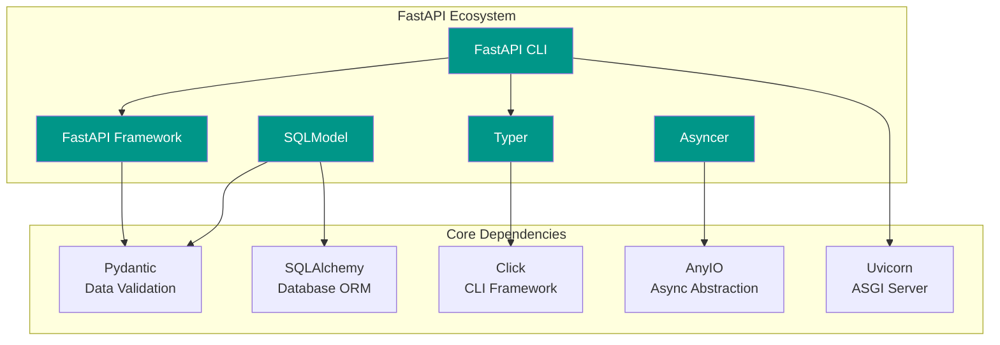
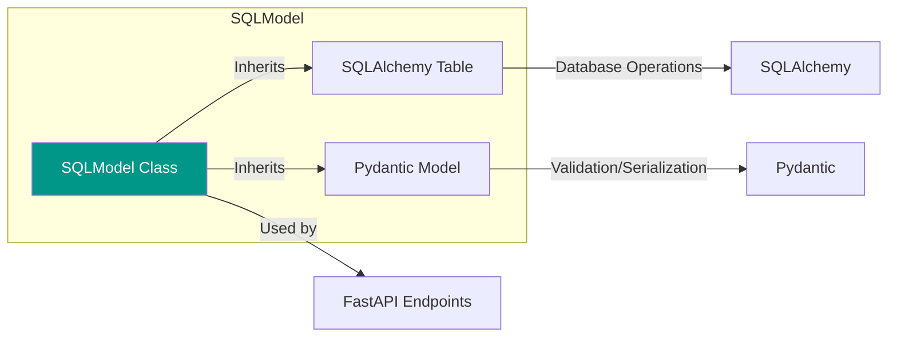

# Project Exploration: FastAPI Ecosystem

## Overview

The FastAPI ecosystem is a collection of Python libraries and tools created primarily by Sebastián Ramírez (tiangolo) that share a common design philosophy: leveraging Python type hints to provide exceptional developer experience, automatic validation, and tooling support.

This ecosystem includes:

1. **FastAPI CLI** - Command-line tooling for running and managing FastAPI applications
2. **SQLModel** - SQL database ORM combining SQLAlchemy and Pydantic
3. **Typer** - CLI application builder based on Python type hints
4. **Asyncer** - Async/await utilities built on AnyIO

All these projects share:
- Type-first design using Python type annotations
- Excellent editor support (autocompletion, inline errors)
- MIT license
- PDM-based build system
- Comprehensive documentation with MkDocs

## Directory Structure

```
/home/darkvoid/Boxxed/@formulas/src.rust/src.fastapi/
├── asyncer/           # Async utilities library
│   ├── asyncer/       # Source code (_main.py, _compat.py)
│   ├── docs/          # Documentation (MkDocs)
│   ├── docs_src/      # Tutorial code examples
│   ├── tests/         # Test suite
│   └── pyproject.toml
├── fastapi-cli/       # FastAPI CLI tool
│   ├── src/fastapi_cli/  # Source code (cli.py, discover.py)
│   ├── tests/         # Test assets and test files
│   └── pyproject.toml
├── sqlmodel/          # SQL ORM library
│   ├── sqlmodel/      # Source code (main.py, orm/, sql/)
│   ├── docs/          # Documentation
│   ├── docs_src/      # Tutorial examples
│   ├── tests/         # Test suite
│   └── pyproject.toml
└── typer/             # CLI framework
    ├── typer/         # Source code (main.py, core/, params.py)
    ├── typer-cli/     # Standalone CLI runner
    ├── docs/          # Documentation
    ├── docs_src/      # Tutorial examples
    ├── tests/         # Comprehensive test suite
    └── pyproject.toml
```

## Architecture

### High-Level Diagram (Mermaid)



### Design Philosophy

The FastAPI ecosystem follows these core principles:

1. **Type Hints First** - All libraries use Python type annotations as the single source of truth
2. **Developer Experience** - Excellent editor support with autocompletion and inline error detection
3. **Zero Duplication** - Define types once, use everywhere (validation, serialization, documentation)
4. **Compatibility** - Works seamlessly with existing libraries (SQLAlchemy, Pydantic, Click)
5. **Performance** - Built on high-performance foundations (Starlette, Uvicorn, AnyIO)

---

## FastAPI Framework

While the FastAPI framework itself is not in this directory, the ecosystem tools are designed to work with it.

### Key Features

#### 1. Python Type Hints for Automatic Validation

FastAPI uses Python type hints to automatically:
- Validate request data
- Convert data types (strings to ints, dates, etc.)
- Generate error responses with details

```python
from fastapi import FastAPI
from pydantic import BaseModel

app = FastAPI()

class Item(BaseModel):
    name: str
    price: float
    quantity: int = 1  # Default value

@app.post("/items/")
def create_item(item: Item):
    # 'item' is already validated and converted
    return {"total": item.price * item.quantity}
```

#### 2. Pydantic Integration

Pydantic is the data validation library that powers FastAPI's data handling:

- **BaseModel** - Base class for data models with validation
- **Field** - Define constraints (gt, lt, min_length, regex, etc.)
- **Automatic serialization/deserialization** - JSON to Python objects

```python
from pydantic import BaseModel, Field, EmailStr

class User(BaseModel):
    username: str = Field(min_length=3, max_length=50)
    email: EmailStr  # Automatic email validation
    age: int = Field(ge=0, le=150)
```

#### 3. Automatic OpenAPI/Swagger Documentation

FastAPI automatically generates:
- **OpenAPI schema** at `/openapi.json`
- **Interactive Swagger UI** at `/docs`
- **ReDoc documentation** at `/redoc`

This is generated from:
- Path operation decorators (`@app.get()`, `@app.post()`)
- Type annotations on parameters and return values
- Pydantic model definitions

#### 4. Dependency Injection System

FastAPI has a powerful dependency injection system:

```python
from fastapi import Depends, FastAPI

app = FastAPI()

def get_db():
    db = Database()
    try:
        yield db
    finally:
        db.close()

@app.get("/users/")
def list_users(db: Database = Depends(get_db)):
    return db.query(User)
```

Dependencies can:
- Be nested (depend on other dependencies)
- Return values or yield (for cleanup)
- Handle authentication, database sessions, etc.

---

## SQLModel ORM

**Location:** `/home/darkvoid/Boxxed/@formulas/src.rust/src.fastapi/sqlmodel`

**Version:** 0.0.24

**Repository:** https://github.com/fastapi/sqlmodel

### Overview

SQLModel is a database ORM that combines SQLAlchemy and Pydantic into a single model definition. It was created specifically to simplify database interactions in FastAPI applications.

### Key Innovation: Single Model Definition

Before SQLModel, you needed separate models for:
1. SQLAlchemy (database operations)
2. Pydantic (data validation/serialization)

With SQLModel:

```python
from typing import Optional
from sqlmodel import Field, SQLModel, Session, create_engine, select

class Hero(SQLModel, table=True):
    id: Optional[int] = Field(default=None, primary_key=True)
    name: str
    secret_name: str
    age: Optional[int] = None

# Create database
engine = create_engine("sqlite:///database.db")
SQLModel.metadata.create_all(engine)

# Insert data
with Session(engine) as session:
    hero = Hero(name="Spider-Boy", secret_name="Pedro Parqueador")
    session.add(hero)
    session.commit()

# Query data
with Session(engine) as session:
    statement = select(Hero).where(Hero.name == "Spider-Boy")
    hero = session.exec(statement).first()
```

### How SQLModel Bridges Database and API Models



### Architecture Components

#### 1. SQLModelMetaclass

The metaclass that combines Pydantic's `ModelMetaclass` and SQLAlchemy's `DeclarativeMeta`:

```python
class SQLModelMetaclass(ModelMetaclass, DeclarativeMeta):
    # Handles both Pydantic model creation
    # and SQLAlchemy table registration
```

#### 2. Field Function

Extended Pydantic Field with SQLAlchemy-specific parameters:

```python
def Field(
    # Pydantic validation parameters
    gt: Optional[float] = None,      # Greater than
    lt: Optional[float] = None,      # Less than
    min_length: Optional[int] = None,
    max_length: Optional[int] = None,
    # SQLAlchemy database parameters
    primary_key: bool = False,
    foreign_key: Optional[str] = None,
    unique: bool = False,
    nullable: bool = True,
    index: bool = False,
    sa_type: Optional[Type] = None,  # Custom SQLAlchemy type
)
```

#### 3. Relationship Function

Define database relationships:

```python
class Team(SQLModel, table=True):
    id: Optional[int] = Field(default=None, primary_key=True)
    name: str
    heroes: List["Hero"] = Relationship(back_populates="team")

class Hero(SQLModel, table=True):
    id: Optional[int] = Field(default=None, primary_key=True)
    name: str
    team_id: Optional[int] = Field(default=None, foreign_key="team.id")
    team: Optional[Team] = Relationship(back_populates="heroes")
```

### FastAPI Integration

SQLModel models work directly as FastAPI request/response models:

```python
from fastapi import FastAPI
from sqlmodel import Session, select

app = FastAPI()

@app.post("/heroes/")
def create_hero(hero: Hero):  # Hero as request body
    with Session(engine) as session:
        session.add(hero)
        session.commit()
        session.refresh(hero)
        return hero  # Hero as response

@app.get("/heroes/")
def list_heroes():
    with Session(engine) as session:
        heroes = session.exec(select(Hero)).all()
        return heroes
```

---

## Typer CLI

**Location:** `/home/darkvoid/Boxxed/@formulas/src.rust/src.fastapi/typer`

**Version:** 0.15.2

**Repository:** https://github.com/fastapi/typer

### Overview

Typer is a library for building CLI applications using Python type hints. It's described as "FastAPI of CLIs" because it applies the same type-first philosophy to command-line interfaces.

### Core Concepts

#### 1. Type Hints Become CLI Arguments

```python
import typer

app = typer.Typer()

@app.command()
def greet(name: str, formal: bool = False):
    if formal:
        print(f"Good day, {name}")
    else:
        print(f"Hey {name}!")

if __name__ == "__main__":
    app()
```

Running this:
```bash
$ python greet.py --help
$ python greet.py Alice
$ python greet.py Alice --formal
```

#### 2. Automatic Help Generation

Typer automatically generates help messages from:
- Parameter names and types
- Docstrings
- Default values

```
Usage: greet.py [OPTIONS] NAME

Arguments:
  NAME  [required]

Options:
  --formal / --no-formal  [default: no-formal]
  --help                  Show this message
```

#### 3. Subcommands

```python
app = typer.Typer()

@app.command()
def create(name: str):
    print(f"Creating {name}")

@app.command()
def delete(name: str):
    print(f"Deleting {name}")

# Usage: cli.py create foo, cli.py delete bar
```

### Architecture

#### Typer Class

Main application class:

```python
class Typer:
    def __init__(
        self,
        name: Optional[str] = None,
        callback: Optional[Callable] = None,
        rich_markup_mode: MarkupMode = "markdown",
        # ... many Click-compatible options
    )

    def command(self, func: Callable) -> Callable:
        """Register a function as a CLI command"""

    def callback(self) -> Callable:
        """Register a callback for the group"""
```

#### Click Integration

Typer is built on top of Click but provides a cleaner interface:

```python
# Typer handles Click parameter conversion internally
def get_click_param(param_meta: ParamMeta) -> Tuple[click.Parameter, Any]:
    # Converts Python types to Click parameters
```

### typer-cli

A standalone CLI runner that can execute any Python script as a CLI:

```bash
$ typer my_script.py run arg1 --option value
```

---

## Asyncer Utilities

**Location:** `/home/darkvoid/Boxxed/@formulas/src.rust/src.fastapi/asyncer`

**Version:** 0.0.8

**Repository:** https://github.com/fastapi/asyncer

### Overview

Asyncer is a small library built on top of AnyIO that provides utilities for working with async/await code, focused on developer experience and type safety.

### Core Functions

#### 1. asyncify() - Call Sync Code from Async Code

Run blocking functions without blocking the event loop:

```python
import time
from asyncer import asyncify
import anyio

def do_sync_work(name: str) -> str:
    time.sleep(1)  # Blocking operation
    return f"Hello, {name}"

async def main():
    # Runs in worker thread, doesn't block event loop
    message = await asyncify(do_sync_work)(name="World")
    print(message)

anyio.run(main)
```

#### 2. syncify() - Call Async Code from Sync Code

Call async functions from regular (blocking) code:

```python
from asyncer import syncify
import anyio

async def fetch_data(name: str) -> str:
    await anyio.sleep(1)
    return f"Data for {name}"

def main():
    # Call async function from sync context
    result = syncify(fetch_data)(name="World")
    print(result)
```

#### 3. create_task_group() - Concurrent Task Execution

Enhanced task group with `soonify()` for better type support:

```python
from asyncer import create_task_group
import anyio

async def main():
    async with create_task_group() as task_group:
        # Start multiple tasks concurrently
        result1 = task_group.soonify(fetch_data)("task1")
        result2 = task_group.soonify(fetch_data)("task2")
        result3 = task_group.soonify(fetch_data)("task3")

    # Access results after all tasks complete
    print(result1.value)
    print(result2.value)
    print(result3.value)

anyio.run(main)
```

#### 4. runnify() - Run Async Function as Sync

Convert an async function to a sync function that creates its own event loop:

```python
from asyncer import runnify

async def program(name: str) -> str:
    return f"Hello {name}"

# Creates event loop automatically
result = runnify(program)(name="World")
```

### SoonValue Pattern

`soonify()` returns a `SoonValue[T]` object that holds the pending result:

```python
class SoonValue(Generic[T]):
    @property
    def value(self) -> T:
        """Access result after task group exits"""

    @property
    def ready(self) -> bool:
        """Check if result is available"""
```

---

## FastAPI CLI

**Location:** `/home/darkvoid/Boxxed/@formulas/src.rust/src.fastapi/fastapi-cli`

**Version:** 0.0.8

**Repository:** https://github.com/fastapi/fastapi-cli

### Overview

FastAPI CLI is a command-line tool for serving and managing FastAPI applications. It's included when you install FastAPI with `pip install "fastapi[standard]"`.

### Commands

#### fastapi dev - Development Server

```bash
$ fastapi dev main.py

FastAPI  Starting development server 🚀

         Searching for package file structure
         Importing from /home/user/app

  module 🐍 main.py

    app    Using import string: main:app

  server   Server started at http://127.0.0.1:8000
           Documentation at http://127.0.0.1:8000/docs
```

Features:
- Auto-reload enabled
- Listens on 127.0.0.1 (localhost only)
- Automatic FastAPI app detection

#### fastapi run - Production Server

```bash
$ fastapi run main.py
```

Features:
- Auto-reload disabled
- Listens on 0.0.0.0 (all interfaces)
- Production-ready configuration

### App Discovery

The `discover.py` module automatically finds the FastAPI app:

1. Searches for files: `main.py`, `app.py`, `api.py`
2. Searches in directories: `app/main.py`, `app/app.py`, `app/api.py`
3. Looks for variables named: `app`, `api`
4. Falls back to first `FastAPI` instance found

```python
def get_import_data(
    path: Optional[Path] = None,
    app_name: Optional[str] = None
) -> ImportData:
    # Returns module path, import string, and app name
```

---

## Key Insights

### 1. Unified Type System

All FastAPI ecosystem libraries use Python type hints as the single source of truth:

```
Type Annotations → Validation + Serialization + Documentation
```

This eliminates code duplication and ensures consistency.

### 2. Developer Experience Focus

Each library prioritizes:
- **Autocompletion** - Editor support for function arguments and return values
- **Inline Errors** - Type checking catches mistakes before runtime
- **Intuitive APIs** - Minimal boilerplate, sensible defaults

### 3. Compatibility Layer

The ecosystem is designed to work with existing libraries:

| Library | Base Libraries | Purpose |
|---------|---------------|---------|
| FastAPI | Starlette, Pydantic | Web APIs |
| SQLModel | SQLAlchemy, Pydantic | Database ORM |
| Typer | Click | CLI Applications |
| Asyncer | AnyIO | Async Utilities |
| FastAPI CLI | Typer, Uvicorn | CLI Tooling |

### 4. FastAPI + SQLModel Integration

SQLModel was specifically designed to work seamlessly with FastAPI:

```python
# One model for everything
class User(SQLModel, table=True):
    id: Optional[int] = Field(primary_key=True)
    email: str
    password: str

# Use in FastAPI
@app.post("/users/")
def create(user: User) -> User:  # Same class for input/output/DB
    ...
```

### 5. Async-First Design

All libraries are async-compatible:
- FastAPI is fully async (Starlette-based)
- SQLModel supports async sessions
- Asyncer provides async/await utilities
- Typer can call async functions

### 6. Testing Infrastructure

Each project includes:
- Comprehensive test suites
- Tutorial example tests (`docs_src/` + `tests/test_tutorial/`)
- Coverage reporting (via coverage-badge)
- GitHub Actions workflows

### 7. Documentation Strategy

All projects use:
- MkDocs with custom theme
- Embedded tutorial code (`docs_src/`)
- Automatic testing of documentation examples
- Rich terminal output with `termy` code blocks

---

## Dependencies Summary

```
fastapi-cli
├── typer >= 0.12.3
├── uvicorn[standard] >= 0.15.0
└── rich-toolkit >= 0.11.1

sqlmodel
├── SQLAlchemy >= 2.0.14, < 2.1.0
└── pydantic >= 1.10.13, < 3.0.0

typer
├── click >= 8.0.0
└── typing-extensions >= 3.7.4.3
[standard]
├── shellingham >= 1.3.0
└── rich >= 10.11.0

asyncer
├── anyio >= 3.4.0, < 5.0
└── typing_extensions >= 4.8.0 (Python < 3.10)
```

---

## Conclusion

The FastAPI ecosystem represents a cohesive suite of Python libraries that share a common philosophy: use Python type hints to provide automatic validation, excellent developer experience, and seamless integration between components. Whether building web APIs (FastAPI), database applications (SQLModel), CLI tools (Typer), or async utilities (Asyncer), the ecosystem provides consistent patterns and interoperability that reduce boilerplate and improve code quality.
