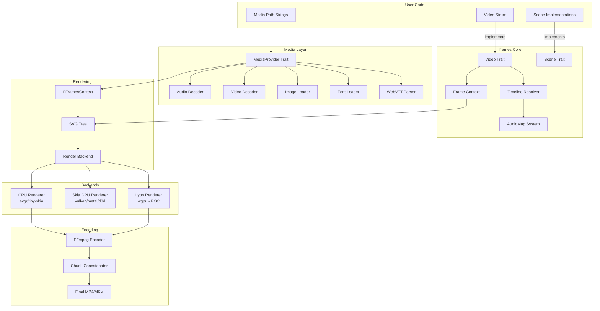

# Project Exploration: FFrames - Rust Video Rendering Framework

## Overview

FFrames is a **Rust-based video generation and rendering framework** that uses SVG as its primary scene description language and FFmpeg for final encoding. It provides a declarative, code-first approach to creating videos programmatically with support for:

- Scene-based composition with timeline management
- Audio visualization and mixing
- WebVTT subtitle rendering
- Multiple renderer backends (CPU, Skia GPU, Lyon/WGPU)
- Web-based video editor with WASM bindings
- Spring-physics and keyframe animations

The framework is currently in **beta** (version 1.0.0-beta.6.rc-3.2) and is licensed under **MIT** for the core libraries, with GPL considerations for FFmpeg codec licensing.

## Directory Structure

```
/home/darkvoid/Boxxed/@formulas/src.rust/src.fframes/
├── fframes/                          # Main monorepo
│   ├── fframes/                      # Core framework crate
│   │   ├── src/
│   │   │   ├── animation/            # Animation system (spring physics, keyframes)
│   │   │   ├── frame.rs              # Frame abstraction with temporal helpers
│   │   │   ├── scenes.rs             # Scene trait and timeline resolution
│   │   │   ├── video.rs              # Video trait (user's main interface)
│   │   │   ├── audio_map.rs          # Audio timeline and mixing
│   │   │   ├── media_provider.rs     # Media resolution abstraction
│   │   │   ├── fframes_context.rs    # Rendering context
│   │   │   ├── text.rs               # Text shaping and line breaking
│   │   │   └── svgr.rs               # SVG tree conversion
│   │   └── Cargo.toml
│   ├── fframes-renderer/             # Main renderer with FFmpeg encoding
│   │   ├── src/
│   │   │   ├── cpu.rs                # CPU-based SVG rasterization
│   │   │   ├── encoder.rs            # FFmpeg encoder wrapper
│   │   │   ├── encoder_frame.rs      # Frame encoding logic
│   │   │   ├── concatenator.rs       # Multi-threaded chunk concatenation
│   │   │   ├── stream.rs             # AV stream management
│   │   │   └── transcoding.c         # C bindings for transcoding
│   │   └── Cargo.toml
│   ├── fframes-skia-renderer/        # Skia GPU-accelerated renderer
│   ├── fframes-lyon-renderer/        # Lyon + WGPU pure-Rust renderer (POC)
│   ├── fframes-media-loaders/        # Media loading (audio, video, images, fonts)
│   ├── fframes-editor/               # Web-based video editor UI
│   │   ├── src/
│   │   │   ├── Player.res            # Video player component
│   │   │   ├── MediaList.res         # Media browser
│   │   │   ├── EditorContext.res     # Editor state management
│   │   │   └── WasmController.res    # WASM bridge to Rust
│   │   └── package.json
│   ├── fframes-editor-controller/    # WASM bindings for editor
│   ├── webvtt-parser/                # WebVTT subtitle parser
│   ├── svgr-macro/                   # Compile-time SVG macros
│   ├── media-dir-macro/              # Media directory macros
│   ├── fframes-test-utils/           # Testing utilities
│   └── examples/
│       ├── podcast/                  # Audio visualization example
│       ├── hello-world/              # Basic example
│       ├── audio-announce/           # Subtitle + visualization
│       ├── beta/                     # Multi-scene demo
│       ├── marketing/                # Marketing video template
│       ├── tiktok/                   # Vertical video format
│       └── low-poly-art/             # Performance stress test
├── rust-ffmpeg-sys/                  # FFmpeg FFI bindings
├── rust-skia/                        # Skia FFI bindings (fork)
├── resvg/                            # Rust SVG renderer (dependency)
├── svgtypes/                         # SVG type definitions
└── fframes_ios_demo_project/         # iOS integration demo
```

## Architecture

### High-Level Diagram



## Core Crates

### fframes (Core Framework)

The main crate providing:

| Module | Purpose |
|--------|---------|
| `Video` trait | Primary interface - defines FPS, dimensions, duration, audio, scenes |
| `Scene` trait | Per-scene rendering with `render_frame(frame, ctx) -> Svgr` |
| `Frame` struct | Temporal context (index, fps, current_second) with animation helpers |
| `FFramesContext` | Runtime context with media resolution and scene info |
| `AudioMap` | Audio timeline composition and mixing |
| `MediaProvider` | Trait for resolving audio/video/images/fonts/subtitles |
| `animation` | Keyframe animations with spring physics |
| `Duration` | Flexible duration specification (seconds, frames, from-audio, auto) |

### fframes-renderer

The production renderer with:

- **CPU Rasterization**: Uses `svgr` (tiny-skia based) for SVG to RGBA conversion
- **FFmpeg Integration**: Direct libav bindings via `ffmpeg-sys-fframes`
- **Multi-threaded Rendering**: Splits video into GOP-aligned chunks for parallel rendering
- **Chunk Concatenation**: Efficiently merges rendered segments with audio

Key encoder options:
```rust
EncoderOptions {
    preferred_video_codec: Option<&str>,  // e.g., "libx264", "libx265"
    preferred_audio_codec: Option<&str>,  // e.g., "aac", "mp3"
    pixel_format: AVPixelFormat,          // Default: YUV420P
    sample_format: AVSampleFormat,        // Default: FLTP
    video_bitrate: Option<i64>,
    audio_bitrate: Option<i64>,
    codec_params: Option<&[(&str, &str)]>, // e.g., [("crf", "23"), ("preset", "ultrafast")]
    gop_size: i32,                        // Group of Pictures size
    sample_rate: usize,                   // Default: 44100
}
```

### fframes-skia-renderer

GPU-accelerated renderer using Skia:

```toml
[features]
default = ["gpu", "binary-cache"]
gpu = ["skia-safe/gpu"]
metal = ["skia-safe/metal"]      # macOS
vulkan = ["skia-safe/vulkan"]    # Windows/Linux
d3d = ["skia-safe/d3d"]          # Windows
gl = ["skia-safe/gl"]            # OpenGL
```

### fframes-lyon-renderer

Experimental pure-Rust renderer using Lyon (path tessellation) + WGPU (GPU compute). Marked as POC (Proof of Concept).

### fframes-media-loaders

Handles all media loading with FFmpeg:

| Type | Loading Strategy |
|------|------------------|
| Audio | FFmpeg libavcodec/libavformat decoding |
| Video | FFmpeg with frame sync for compositing |
| Images | PNG/JPEG via `image` crate |
| SVG | `usvgr` (resvg fork) |
| Fonts | `ttf-parser` for text shaping |
| Subtitles | WebVTT parsing |

### webvtt-parser

Full WebVTT subtitle parser implementing the [WebVTT spec](https://w3c.github.io/webvtt/):

```rust
pub struct VttCue<'a> {
    pub start: Time,           // Start timestamp in milliseconds
    pub end: Time,             // End timestamp
    pub name: Option<&'a str>, // Optional cue identifier
    pub text: &'a str,         // Subtitle text (supports HTML-like tags)
    pub note: Option<&'a str>, // Comment/note
    pub cue_settings: Option<VttCueSettings>, // Positioning settings
}

pub struct VttCueSettings {
    pub vertical: Option<Vertical>,      // Writing direction
    pub line: Option<NumberOrPercentage>, // Vertical position
    pub position: Option<u8>,            // Horizontal position (%)
    pub size: Option<u8>,                // Text area width (%)
    pub align: Option<Align>,            // Text alignment
}
```

**Frame integration:**
```rust
// Get subtitle phrase for current frame
let phrase = frame.get_subtitle_phrase(&subtitles);

// Get full cue with metadata
let cue = frame.get_subtitle_cue(&subtitles);

// Get stack of active cues (for overlapping subtitles)
let stack = frame.get_cue_stack(&subtitles, overlap_ms);
```

### fframes-editor-controller

WASM bindings exposing fframes to the web editor:

- `wasm_bindgen` exports for video metadata, audio, fonts
- `serde-wasm-bindgen` for JS-Rust serialization
- `console_error_panic_hook` for debugging

### fframes-editor (Web UI)

ReScript-based web editor with:

- **Player.res**: Video preview with timeline scrubbing
- **MediaList.res**: Media asset browser
- **EditorContext.res**: State management
- **WasmController.res**: Bridge to Rust controller

## Video Rendering Pipeline

### 1. Video Definition

Users implement the `Video` trait:

```rust
impl Video for MyVideo {
    const FPS: usize = 60;
    const WIDTH: usize = 1920;
    const HEIGHT: usize = 1080;

    fn duration(&self) -> Duration {
        Duration::Auto  // Infer from scenes or audio
    }

    fn audio(&self) -> AudioMap {
        AudioMap::from([
            ("background.mp3", AudioTimestamp::Second(0.0)..AudioTimestamp::Second(60.0))
        ])
    }

    fn render_frame(&self, frame: Frame, ctx: &FFramesContext) -> Svgr {
        svgr!(<svg>...</svg>)
    }
}
```

### 2. Timeline Resolution

```rust
// From fframes-renderer/src/lib.rs
let timeline = fframes::resolve_timeline(
    &video.duration(),
    &ScenesWithAudio::new(&scenes),
    &time_base,
    &video.audio(),
    |name| resolve_audio_duration(name),
)?;
```

This resolves:
- Total duration in frames
- Scene ranges with overlap handling
- Audio sample ranges for mixing

### 3. Multi-threaded Rendering

```rust
// Split video into GOP-aligned chunks
let chunks = encoder_options.split_video_chunks(duration_in_frames, concurrency);

// Parallel chunk rendering
chunks.par_iter().enumerate().map(|(thread, range)| {
    // Each thread creates its own encoder
    Encoder::with_output(..., |encoder| {
        for frame_index in range {
            // 1. Render SVG
            let svg = video.render_frame(frame, ctx);

            // 2. Convert to raster
            let rtree = svg.into_svg_tree(options, cache, font_db);
            svgr::render(&rtree, ..., &mut pixmap);

            // 3. Encode frame
            frame.fill_from_rgba_pixmap(pixmap.data());
            encoder.send_frame(&encoder.video_stream, &frame);
        }
    })
})
```

### 4. Audio Encoding

Audio is mixed and encoded separately:

```rust
// From FFramesContext::get_mixed_audio_data_in_fltp
audio_map.0.iter().for_each(|(file, sample_range)| {
    if sample_range.contains(&start_sample) {
        let audio_data = media_source.resolve_audio(file);
        // Mix samples: filled + new - (filled * new) for normalization
    }
});
```

### 5. Chunk Concatenation

Rendered chunks are concatenated using FFmpeg's concat demuxer:

```rust
// From concatenator.rs
concat_video_files_with_audio(
    chunk_files,
    output_path,
    concurrency,
    timeline.audio_map,
    encoder_options,
)
```

## Scene-Based Composition Model

### Scene Trait

```rust
pub trait Scene: Debug + Sync + Send {
    fn duration(&self) -> Duration;

    fn render_frame(
        &self,
        frame: Frame,
        ctx: &FFramesContext
    ) -> Svgr;

    fn overlap(&self) -> Overlap {
        Overlap::None  // Cross-fade between scenes
    }

    fn audio(&self) -> AudioMap {
        AudioMap::none()
    }

    fn name(&self) -> &'static str {
        std::any::type_name::<Self>()
    }
}
```

### Scene Overlap

Scenes can overlap for transitions:

```rust
fn overlap(&self) -> Overlap {
    Overlap::PreviousAndNext {
        previous: 0.5,  // 0.5 seconds overlap with previous
        next: 0.5,      // 0.5 seconds overlap with next
    }
}
```

### SceneInfo Context

```rust
pub struct SceneInfo {
    pub duration_in_frames: usize,
    pub index: usize,
    pub total_scenes_in_video: usize,
    pub is_last: bool,
    pub start_frame: usize,
    pub end_frame: usize,
}
```

## Editor Architecture

### WASM Bridge Flow

```
┌─────────────────┐     ┌──────────────────────┐     ┌─────────────────┐
│  ReScript UI    │────▶│  WasmController.res  │────▶│  Rust WASM      │
│  (Player,       │◀────│  (serde-wasm-bindgen)│◀────│  Controller     │
│   MediaList)    │     │                      │     │  (fframes)      │
└─────────────────┘     └──────────────────────┘     └─────────────────┘
                                │
                                ▼
                       ┌──────────────────────┐
                       │  FFramesContext      │
                       │  - Editor mode       │
                       │  - Dynamic media     │
                       │  - WASM decoders     │
                       └──────────────────────┘
```

### Editor Modes

```rust
pub enum FFramesMode {
    Editor,                 // Live preview
    EditorTimelinePreview,  // Thumbnail generation
    Renderer,               // Final render
}
```

### Media Provider in Editor

```rust
pub struct DynamicMediaProvider<'media> {
    pub audio: HashMap<String, AudioData<'media>>,
    pub images: HashMap<String, ImageData>,
    pub subtitles: HashMap<String, Subtitles<'media>>,
    pub videos: HashMap<String, VideoMedia>,
    pub fontdata: Vec<RawFontData>,
}
```

## Key Insights

### 1. SVG-First Design

All visual output is defined as SVG, which provides:
- Resolution-independent rendering
- Easy composition via `<g>`, `<use>`, `<pattern>`
- CSS-like styling and transforms
- Text shaping support via `ttf-parser`

### 2. Zero-Copy Media (Where Possible)

The `webvtt-parser` and other loaders use borrowed lifetimes:

```rust
pub struct Vtt<'a> {
    pub cues: Vec<VttCue<'a>>,  // Borrows from original string
}
```

This avoids allocations during parsing but requires careful lifetime management.

### 3. Spring Physics Animation

Animations use physically-based spring simulation:

```rust
pub enum Easing {
    Linear(f32),  // duration
    Spring {
        mass: f32,
        stiffness: f32,
        damping: f32,
    },
}

// Usage with timeline! macro
frame.animate!(timeline!(
    on 2.3, val 1400.0 => 770.0, Easing::Spring { mass: 1.85, stiffness: 130.0, damping: 16.0 }
))
```

### 4. GOP-Aware Parallel Rendering

Video is split at Group of Pictures boundaries to enable parallel encoding:

```rust
// Minimum chunk = 2 * GOP size
let min_chunk = 2 * gop_size;  // Default GOP = 24 frames
```

### 5. License Considerations

The framework itself is MIT-licensed, but FFmpeg codec licensing requires attention:

```toml
[dependencies]
fframes_renderer = { version = "0.1.0", features = [
    "h264",                    # libx264 (GPL)
    "libav-agree-gpl"          # Accept GPL terms
]}
```

### 6. Audio-Driven Duration

Videos can automatically determine duration from audio:

```rust
fn duration(&self) -> Duration {
    Duration::Auto  // Resolves from scenes or audio map
}

fn audio(&self) -> AudioMap {
    AudioMap::from([
        ("final.mp3", AudioTimestamp::Second(0.0)..AudioTimestamp::Eof)
    ])
}
```

### 7. Text Wrapping with Caching

```rust
let wrapped = frame.text_break_lines_structure(
    &ctx,
    "Long text...",
    BreakLinesOpts {
        width: 500,
        font_family: "Roboto",
        x: "100",
        y: "100",
        align: TextAlign::Center,
        ..Default::default()
    }
);
```

Results are cached in an LRU cache per frame.

## Dependencies Graph

```
fframes
├── ffmpeg-sys-fframes (FFmpeg bindings)
├── usvgr (resvg fork for SVG)
├── svgr (rendering engine)
├── ttf-parser (font shaping)
├── tiny-skia (CPU rasterization)
├── image (PNG/JPEG loading)
├── microfft (audio FFT)
├── lru (caching)
├── parking_lot (synchronization)
└── wasm-bindgen (WASM target)

fframes-skia-renderer
└── skia-safe (GPU rendering)
    ├── vulkan/metal/d3d (GPU backends)
    └── ash (Vulkan bindings)

fframes-lyon-renderer
├── lyon (path tessellation)
└── wgpu (GPU compute)
```

## Example: Podcast Video

The `podcast` example demonstrates:

```rust
pub struct PodcastVideo<'a> {
    pub goose_audio: &'a str,
    pub duck_audio: &'a str,
    pub guest_audio: &'a str,
}

impl Video for PodcastVideo<'_> {
    const FPS: usize = 60;
    const WIDTH: usize = 1920;
    const HEIGHT: usize = 1080;

    fn audio(&self) -> AudioMap {
        AudioMap::from([(
            "final.mp3",
            AudioTimestamp::Second(0.0)..AudioTimestamp::Second(60.0)
        )])
    }

    fn render_frame(&self, frame: Frame, ctx: &FFramesContext) -> Svgr {
        // Get audio data for visualization
        let goose_vis = ctx.get_audio(self.goose_audio)
            .map(|audio| frame.visualize_audio_frame(VisualizeFrameInput {
                smooth_level: 2,
                audio,
                sample_size: SampleSize::S32,
                window: None,
            }));

        // Render SVG with embedded visualizations
        svgr!(<svg>
            <circle fill="url(#goose)" />
            {goose_vis.iter().map(|fr| svgr!(<rect height={fr * 200} />))}
        </svg>)
    }
}
```

## Build System

Uses `just` (command runner) for common tasks:

```bash
just init-repo          # Initialize all dependencies
just run podcast        # Run editor preview
just render podcast     # Render final video
just watch-editor       # Watch editor for changes
```

System dependencies:
- **Linux**: `apt install yasm nasm ffmpeg libx264-dev libx265-dev libopus-dev libclang-dev`
- **Arch**: `pacman -S ninja yasm nasm ffmpeg x264 x265 opus clang`
- **macOS**: `brew install pkg-config ffmpeg x264 x265 opus nasm`

## Summary

FFrames is a sophisticated video generation framework that combines:

1. **Declarative SVG-based scene composition** - All visuals defined as SVG
2. **Rust performance** - Multi-threaded rendering with SIMD-optimized rasterization
3. **FFmpeg encoding** - Professional-grade video encoding
4. **WASM editor** - Web-based preview and timeline editing
5. **Flexible media handling** - Audio, video, images, fonts, subtitles
6. **Physics-based animations** - Spring dynamics for natural motion

The architecture is well-suited for programmatic video generation use cases like:
- Social media content automation
- Podcast visualizations
- Marketing video templates
- Data visualization videos
