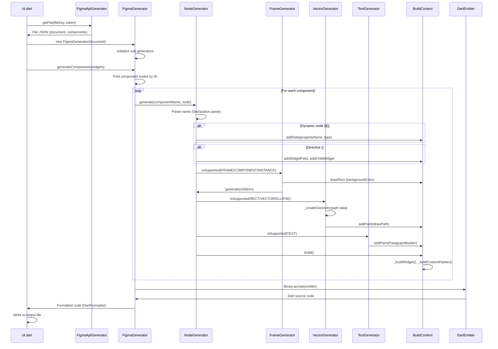

# Project Exploration: figma-to-flutter

## Overview

The `figma-to-flutter` project by Aloïs Deniel is an experimental toolset that bridges Figma design files with Flutter applications. It provides a complete pipeline for converting Figma's JSON API representation into executable Flutter widget code, enabling designers and developers to maintain closer parity between design and implementation.

The project consists of four main sub-packages:

1. **figma_to_flutter** - The core code generation tool that parses Figma's file JSON structure and generates Flutter `CustomPainter` widgets
2. **flutter_figma** - A runtime widget library that renders Figma components directly in Flutter apps using the Figma API
3. **figma_theme** - Annotation definitions for theme generation
4. **figma_theme_generator** - A build runner that generates Flutter theme classes from Figma style libraries

The core philosophy is reverse-engineering Figma's rendering logic since the actual rendering source code is not publicly available. This means the project attempts to replicate how Figma renders nodes (frames, vectors, text, groups) using Flutter's canvas and widget system.

## Repository

- **Location:** `/home/darkvoid/Boxxed/@formulas/src.flutter/figma-to-flutter`
- **Remote:** `https://github.com/aloisdeniel/figma-to-flutter`
- **Primary Language:** Dart
- **License:** MIT (detected from LICENSE files)
- **Current Branch:** `master`
- **Recent Activity:** Last commit "Layout fixes and updated dependencies" (07b7a0e)

## Directory Structure

```
figma-to-flutter/
├── figma_to_flutter/              # Main conversion tool (code generator)
│   ├── cli/                       # Command-line interface
│   │   ├── bin/
│   │   │   ├── cli.dart           # CLI entry point
│   │   │   └── sample.json        # Sample Figma file JSON
│   │   └── pubspec.yaml
│   ├── docs/                      # Documentation website assets
│   │   ├── index.html
│   │   ├── main.js                # Compiled Dart (dart2js)
│   │   ├── workflow.png           # Workflow diagram
│   │   └── [assets]
│   ├── generator/                 # Build-time generator wrapper
│   │   ├── lib/
│   │   └── pubspec.yaml
│   ├── generator_annotations/     # Annotations for generator
│   │   ├── lib/
│   │   └── pubspec.yaml
│   ├── sample/                    # Sample Flutter app
│   │   ├── lib/
│   │   ├── android/, ios/         # Platform folders
│   │   └── pubspec.yaml
│   ├── src/                       # Core library source
│   │   ├── lib/
│   │   │   ├── figma_to_flutter.dart  # Main export
│   │   │   ├── api.dart               # Figma API client
│   │   │   ├── file.dart              # File-level generator
│   │   │   ├── context.dart           # BuildContext for codegen
│   │   │   ├── base/                  # Base type generators
│   │   │   │   ├── color.dart         # Color -> Color.fromARGB
│   │   │   │   ├── paint.dart         # Fill/stroke paints
│   │   │   │   ├── path.dart          # SVG path -> Flutter Path
│   │   │   │   ├── text_styles.dart   # Text style generators
│   │   │   │   ├── constraints.dart   # Layout constraints
│   │   │   │   ├── effect.dart        # Shadow/blur effects
│   │   │   │   ├── transform.dart     # Matrix transforms
│   │   │   │   └── base.dart          # Utilities
│   │   │   ├── nodes/                 # Node type generators
│   │   │   │   ├── node.dart          # Main NodeGenerator (dispatcher)
│   │   │   │   ├── component.dart     # ComponentGenerator (root)
│   │   │   │   ├── frame.dart         # Frame/Component/Instance
│   │   │   │   ├── vector.dart        # RECT, VECTOR, ELLIPSE, etc.
│   │   │   │   ├── text.dart          # TEXT nodes
│   │   │   │   ├── group.dart         # GROUP nodes
│   │   │   │   └── directive.dart     # Custom directives (#tap, #widget)
│   │   │   ├── parsing/
│   │   │   │   └── declaration.dart   # Name parsing (static/dynamic/directive)
│   │   │   └── tools/
│   │   │       ├── code.dart          # Code helpers
│   │   │       ├── code_catalog.dart  # Deduplication catalog
│   │   │       ├── format.dart        # Naming utilities
│   │   │       └── positions.dart     # Position calculations
│   │   └── pubspec.yaml
│   ├── website/                   # Web demo
│   │   ├── web/
│   │   └── pubspec.yaml
│   ├── LICENSE
│   └── README.md
│
├── flutter_figma/                 # Runtime widget library
│   ├── lib/
│   │   ├── figma.dart             # Figma InheritedWidget
│   │   ├── widgets.dart           # Widget exports
│   │   └── src/
│   │       ├── figma.dart         # Figma client wrapper
│   │       ├── design/
│   │       │   ├── design.dart    # FigmaDesignFile, FigmaDesignNode
│   │       │   └── storage.dart   # Cache storage (FileFigmaDesignStorage)
│   │       ├── helpers/
│   │       │   ├── api_extensions.dart  # Node/Color/Paint extensions
│   │       │   └── api_copy_with.dart   # CopyWith helpers
│   │       ├── rendering/
│   │       │   ├── decoration.dart      # FigmaPaintDecoration
│   │       │   └── layouts/
│   │       │       ├── auto_layout.dart # Figma auto_layout support
│   │       │       ├── constrained_layout.dart
│   │       │       └── rotated.dart     # Rotated frame handling
│   │       └── widgets/
│   │           ├── frame.dart           # FigmaFrame widget
│   │           ├── text.dart            # FigmaText widget
│   │           ├── vector.dart          # FigmaVector widget
│   │           ├── rectangle.dart       # FigmaRectangle widget
│   │           ├── mask.dart            # Clipping/masking
│   │           ├── blurred.dart         # Blur effects
│   │           └── layouts/
│   │               ├── auto_layout.dart # FigmaAuto, FigmaConstrained
│   │               ├── constrained_layout.dart
│   │               └── rotated.dart
│   ├── example/
│   │   ├── lib/
│   │   ├── example_response.json  # Sample Figma API response
│   │   └── pubspec.yaml
│   ├── CHANGELOG.md
│   └── pubspec.yaml
│
├── figma_theme/                   # Theme annotations
│   ├── lib/
│   │   ├── figma_theme.dart
│   │   └── src/
│   │       └── annotations.dart   # @FigmaTheme annotation
│   └── pubspec.yaml
│
├── figma_theme_generator/         # Theme code generator
│   ├── lib/
│   │   ├── figma_theme_generator.dart
│   │   ├── builder.dart           # SharedPartBuilder
│   │   └── src/
│   │       ├── generator.dart     # GeneratorForAnnotation
│   │       ├── builders/
│   │       │   ├── builder.dart   # FigmaThemeBuilder (download/build)
│   │       │   ├── base.dart      # Style builder utilities
│   │       │   ├── nodes.dart     # FileBuilder, FillStyleBuilder, etc.
│   │       │   ├── context.dart   # FileBuildContext
│   │       │   └── data_class_builder.dart
│   │       └── helpers/
│   │           ├── extensions.dart
│   │           └── data_class_builder.dart
│   ├── example/
│   │   ├── lib/
│   │   └── pubspec.yaml
│   ├── doc/                       # Documentation images
│   └── pubspec.yaml
│
└── figma_to_flutter.code-workspace
```

## Architecture

### High-Level Pipeline Diagram

```mermaid
flowchart TB
    subgraph Figma["Figma Platform"]
        F[Design File]
        S[Style Library]
    end

    subgraph API["Figma API"]
        FA[GET /files/:key]
        SA[GET /files/:key/styles]
    end

    subgraph CodeGen["Code Generation Path"]
        direction TB
        GC1[CLI: cli.dart]
        GC2[FigmaApiGenerator]
        GC3[FigmaGenerator]
        GC4[NodeGenerator]
        GC5[ComponentGenerator]
        GC6[BuildContext]
    end

    subgraph Runtime["Runtime Rendering Path"]
        direction TB
        RT1[FigmaDesignFile]
        RT2[FigmaDesignNode]
        RT3[FigmaNode]
        RT4[FigmaFrame/FigmaText/FigmaVector]
    end

    subgraph Theme["Theme Generation Path"]
        direction TB
        TH1[@FigmaTheme annotation]
        TH2[FigmaThemeGenerator]
        TH3[FigmaThemeBuilder]
        TH4[Style Builders]
    end

    subgraph Output["Generated Output"]
        GW[Flutter Widgets]
        GP[CustomPainter classes]
        GT[Theme Data classes]
        GR[Runtime Widgets]
    end

    F -->|JSON| FA
    FA -->|File JSON| GC2
    GC2 -->|Parsed JSON| GC3

    GC3 -->|Component Map| GC5
    GC4 -->|Dispatches by type| GC5
    GC5 -->|Creates| GC6
    GC6 -->|Builds| GW
    GC6 -->|Builds| GP

    S -->|Styles| SA
    SA -->|Styles JSON| TH3
    TH1 -->|Triggers| TH2
    TH2 -->|Downloads| TH3
    TH3 -->|Delegates| TH4
    TH4 -->|Builds| GT

    F -->|Live API| RT1
    RT1 -->|Provides context| RT2
    RT2 -->|Finds node| RT3
    RT3 -->|Type dispatch| RT4
    RT4 -->|Renders| GR

    style Figma fill:#f9f,stroke:#333
    style Output fill:#9f9,stroke:#333
    style CodeGen fill:#ccf,stroke:#333
    style Runtime fill:#cff,stroke:#333
    style Theme fill:#fcc,stroke:#333
```

### Data Flow: Figma JSON to Flutter Code



## Component Breakdown

### figma_to_flutter (Core Generator)

- **Location:** `figma_to_flutter/src/lib/`
- **Purpose:** Converts Figma file JSON into Flutter widget code
- **Dependencies:** `path_parsing`, `http`, `vector_math`, `yaml`, `recase`, `source_gen`, `code_builder`
- **Dependents:** CLI tool, generator package, website

**Key Classes:**

| Class | Responsibility |
|-------|----------------|
| `FigmaApiGenerator` | HTTP client for Figma Files API |
| `FigmaGenerator` | Top-level generator, orchestrates component generation |
| `ComponentGenerator` | Generates widget + CustomPainter pair for a component |
| `NodeGenerator` | Dispatcher that routes nodes to type-specific generators |
| `FrameGenerator` | Handles FRAME, COMPONENT, INSTANCE nodes |
| `VectorGenerator` | Handles RECT, VECTOR, ELLIPSE, STAR, BOOLEAN_OPERATION |
| `TextGenerator` | Handles TEXT nodes with style overrides |
| `GroupGenerator` | Handles GROUP nodes (transform composition) |
| `DirectiveGenerator` | Handles #tap and #widget directives |
| `BuildContext` | Accumulates code statements for widget/painter generation |

### flutter_figma (Runtime Library)

- **Location:** `flutter_figma/lib/`
- **Purpose:** Runtime rendering of Figma components in Flutter apps
- **Dependencies:** `figma` (Dart Figma API client), `path_drawing`, `collection`, `path_provider`
- **Dependents:** Apps that want live Figma rendering

**Key Classes:**

| Class | Responsibility |
|-------|----------------|
| `Figma` | InheritedWidget providing FigmaClient to descendants |
| `FigmaDesignFile` | StatefulWidget that fetches/caches Figma file JSON |
| `FigmaDesignNode` | Widget that finds and renders a specific node/component |
| `FigmaNode` | Type-dispatch widget (Text/Frame/Rectangle/Vector) |
| `FigmaFrame` | Renders frames with auto_layout, decoration, clipping |
| `FigmaText` | Renders text with Figma typography |
| `FigmaVector` | Renders vector paths |
| `FigmaPaintDecoration` | Decoration for fills, strokes, effects |
| `FigmaAutoLayout` | Implements Figma's auto_layout behavior |

### figma_theme (Annotations)

- **Location:** `figma_theme/lib/`
- **Purpose:** Provides `@FigmaTheme` annotation for code generation
- **Dependencies:** `meta`, `collection`, `flutter`

**Key Class:**

```dart
class FigmaTheme {
  final String apiToken;
  final String fileKey;
  final int version;  // Increment to trigger regeneration
  const FigmaTheme(this.version, {this.apiToken, this.fileKey, this.package});
}
```

### figma_theme_generator (Theme Generator)

- **Location:** `figma_theme_generator/lib/`
- **Purpose:** Generates Flutter theme classes from Figma style library
- **Dependencies:** `figma`, `figma_theme`, `analyzer`, `code_builder`, `build`, `source_gen`, `dart_style`

**Key Classes:**

| Class | Responsibility |
|-------|----------------|
| `FigmaThemeGenerator` | GeneratorForAnnotation implementation |
| `FigmaThemeBuilder` | Downloads file JSON, builds theme library |
| `FileBuilder` | Orchestrates style extraction and class generation |
| `FillStyleBuilder` | Extracts colors and gradients from fill styles |
| `BorderStyleBuilder` | Extracts borders from stroke styles |
| `TextStyleBuilder` | Extracts TextStyles from text styles |
| `EffectBuilder` | Extracts BoxShadows from effect styles |
| `DataClassBuilder` | Generates the main theme data class |

## Entry Points

### CLI Entry Point (`figma_to_flutter/cli/bin/cli.dart`)

```dart
void main(List<String> args) async {
  // Parse arguments: --token, --fileKey, --widget, --output
  var api = FigmaApiGenerator(Client(), results["token"]);
  var file = await api.getFile(results["fileKey"]);

  var generator = FigmaGenerator(file);
  var code = generator.generateComponents(widgets);

  await File(results["output"]).writeAsString(code);
}
```

**Execution Flow:**
1. Parse CLI arguments (token, fileKey, widget names, output path)
2. Fetch Figma file JSON via API
3. Save raw JSON to `.json` file (for debugging)
4. Initialize `FigmaGenerator` with file structure
5. Generate Dart code for specified widgets
6. Format code with `DartFormatter`
7. Write to output `.dart` file

### Build Runner Entry Point (`figma_theme_generator`)

**Usage Pattern:**
```dart
@FigmaTheme(
  1,  // version
  fileKey: '<file_key>',
  apiToken: '<api_token>',
)
class ExampleTheme extends InheritedWidget {
  final ExampleThemeData data;
  // ...
}
```

**Execution Flow:**
1. `build_runner` detects `@FigmaTheme` annotation
2. `FigmaThemeGenerator.generateForAnnotatedElement()` is called
3. Extract `apiToken`, `fileKey`, `package` from annotation
4. `FigmaThemeBuilder.download()` fetches file JSON
5. `FileBuilder.build()` extracts styles and generates classes
6. Generated part file (`*.g.dart`) is written

### Runtime Entry Point (`flutter_figma`)

**Usage Pattern:**
```dart
Figma(
  token: '<api_token>',
  child: FigmaDesignFile(
    fileId: '<file_id>',
    child: FigmaDesignNode.component(
      name: 'MyComponent',
    ),
  ),
)
```

**Execution Flow:**
1. `Figma` widget initializes `FigmaClient` with token
2. `FigmaDesignFile` fetches file JSON on init
3. Caches JSON if `cacheMode` is enabled
4. `FigmaDesignNode` finds component by name in file
5. `FigmaNode` dispatches to type-specific widget
6. Widgets render using Figma's design properties

## External Dependencies

| Dependency | Version | Purpose |
|------------|---------|---------|
| `figma` | ^2.0.3 | Dart client for Figma API (used by flutter_figma, figma_theme_generator) |
| `http` | 0.11.3+17 | HTTP client for API requests |
| `code_builder` | 3.1.1 | Programmatic Dart code generation |
| `source_gen` | 0.8.3 | Annotation-based code generation framework |
| `build` | ^1.0.0 | Build system for Dart |
| `dart_style` | ^1.3.6 | Code formatting for generated output |
| `path_parsing` | 0.1.2 | SVG path data parsing |
| `path_drawing` | ^0.4.1 | Path manipulation utilities |
| `vector_math` | 2.0.8 | Matrix/vector math for transforms |
| `analyzer` | ^0.39.14 | Dart AST analysis for source_gen |
| `collection` | ^1.14.13 | Collection utilities |
| `recase` | ^3.0.0 | String case conversion (snake_case to PascalCase) |

## Configuration

### Figma API Requirements

1. **API Token:** Personal access token from Figma account settings
   - Generated once, must be stored securely
   - Used for all API requests

2. **File Key:** Extracted from Figma share URL
   - Format: `https://www.figma.com/file/<FILE_KEY>/<name>`

### CLI Configuration

```bash
dart bin/cli.dart \
  --token <API_TOKEN> \
  --fileKey <FILE_KEY> \
  --widget ComponentName \
  --output lib/generated/widget.dart \
  --withComments \
  --withDataClasses
```

### Theme Generator Configuration

```yaml
# pubspec.yaml
dependencies:
  figma_theme: ^0.1.1

dev_dependencies:
  build_runner:
  figma_theme_generator:
```

### Caching (flutter_figma)

```dart
FigmaDesignFile(
  fileId: '...',
  cacheMode: FigmaDesignCacheMode.useCacheRefreshFailed,
  cacheStorage: FileFigmaDesignStorage(),
  child: ...,
)
```

**Cache Modes:**
- `never` - Always fetch from API
- `useCacheAlwaysWhenAvailable` - Use cache if available, never refresh
- `useCacheRefreshFailed` - Try to refresh, fall back to cache

## Testing Strategy

Based on the README roadmap and codebase analysis:

### Current State
- **Unit tests:** Mentioned in roadmap as future work ("Unit tests: create automated tests for validating rendering")
- **Test directories:** No dedicated test directories found in the repository
- **Manual testing:** Relies on sample apps and visual verification

### Testing Challenges
1. **Visual regression:** Comparing Figma exports to Flutter screenshots requires image diffing
2. **API dependency:** Tests would need mock Figma API responses
3. **Reverse engineering:** Since rendering logic is reverse-engineered, expected behavior must be validated against actual Figma rendering

### Suggested Test Structure (from roadmap)
```dart
// Future automated test concept
test('Button component renders like Figma', () {
  final figmaExport = loadFigmaExport('button.png');
  final flutterRender = renderWidget(ButtonComponent());
  expect(pixelDiff(figmaExport, flutterRender), lessThan(threshold));
});
```

## Key Insights

### Architecture Insights

1. **Two conversion paths:** The project supports both build-time code generation (figma_to_flutter) and runtime rendering (flutter_figma). Code gen produces standalone widgets; runtime rendering fetches live designs.

2. **CustomPainter-based rendering:** Generated components use `CustomPainter` with direct canvas operations rather than composing Flutter widgets. This provides pixel-perfect control but sacrifices some Flutter optimizations.

3. **Catalog pattern for deduplication:** Colors, paths, text styles, and effects are deduplicated using catalog classes (`_ColorCatalog`, `_PathCatalog`, etc.) to reduce generated code size.

4. **Transform hierarchy:** Figma's transform system is replicated by composing matrix transforms. Group nodes combine transforms before applying to children.

### Figma-to-Flutter Mapping

| Figma Concept | Flutter Equivalent |
|---------------|-------------------|
| Frame | Container + DecoratedBox + ClipRRect |
| Auto Layout | Row/Column or FigmaAutoLayout |
| Rectangle | CustomPainter + drawRect |
| Vector | CustomPainter + drawPath |
| Text | CustomPainter + drawParagraph |
| Component | StatelessWidget + CustomPainter |
| Instance | Component with overrides |
| Constraints | Positioned + layout constraints |
| Blend Modes | BlendMode enum |
| Effects | CustomPainter with masks/filters |

### Naming Conventions for Dynamic Elements

- `$name` - Marks a node as dynamic (generates data class property)
- `#tap(callback)` - Makes rectangle tappable (generates InkWell)
- `#widget(child)` - Includes external widget at node position

### Data Classes Generated

```dart
class Data { final bool isVisible; }
class TextData extends Data { final String text; }
class VectorData extends Data { }
```

### Version Control for Themes

The `version` parameter in `@FigmaTheme` is a manual increment trigger. Since build_runner caching can't detect remote Figma changes, incrementing the version forces regeneration.

## Open Questions

1. **Null safety migration:** The repository has a `null-safety-migration` branch. What is the current null-safety status of the main branch?

2. **Active development:** The last commit message mentions "Layout fixes and updated dependencies" but the README still says "experimental and under active development." What is the current maintenance status?

3. **Figma API changes:** How does the project handle breaking changes in Figma's API? Is there a versioning strategy for the `figma` package dependency?

4. **Performance characteristics:** For large components with many nodes, what is the performance impact of CustomPainter-based rendering vs. native widget composition?

5. **Auto Layout completeness:** The roadmap mentions auto layout support. How complete is the implementation for nested auto layouts, padding, and item spacing?

6. **Image handling:** How are Figma images (imageRef) handled? Are they downloaded and cached locally, or referenced remotely?

7. **Component variants:** Figma's component variants feature is relatively new. Does the project support variants, or only classic components?

8. **Dev Mode API:** Figma has introduced new APIs for Dev Mode. Are there plans to integrate these for more accurate style extraction?

---

*Generated exploration following the .agents/exploration-agent.md format.*
