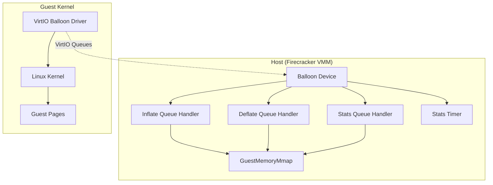
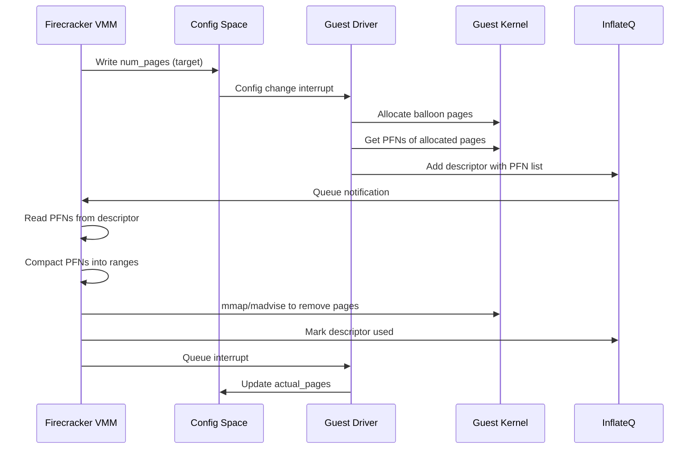
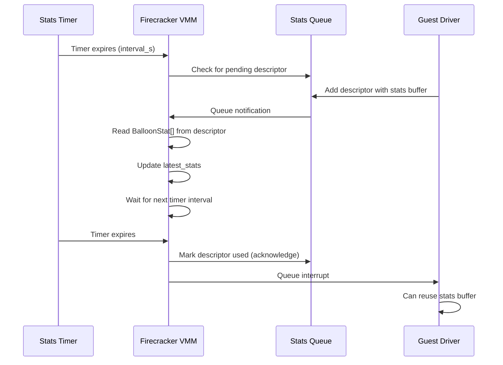

# Firecracker VirtIO Balloon Device Deep Dive

## Overview

The VirtIO Balloon device in Firecracker provides dynamic memory management capabilities for microVMs. It allows the host to reclaim memory from the guest (inflation) or return memory to the guest (deflation) without requiring a VM restart. This is essential for:

- **Memory overcommitment** - Running more VMs than physical memory by reclaiming unused pages
- **Dynamic resizing** - Adjusting VM memory allocation at runtime
- **Memory pressure handling** - Responding to host memory pressure by inflating balloons
- **Statistics collection** - Gathering guest memory statistics for monitoring and optimization

The balloon device implements the VirtIO Balloon specification (virtio-balloon) with Firecracker-specific extensions for statistics reporting.

## Architecture

### High-Level Diagram



### Queue Architecture

The balloon device uses **3 VirtIO queues**:

| Queue | Index | Purpose | Direction |
|-------|-------|---------|-----------|
| Inflate | 0 | Guest returns pages to host | Guest → Host |
| Deflate | 1 | Host returns pages to guest | Host → Guest |
| Statistics | 2 | Guest sends memory stats | Guest → Host |

```rust
pub const BALLOON_NUM_QUEUES: usize = 3;
pub const INFLATE_INDEX: usize = 0;
pub const DEFLATE_INDEX: usize = 1;
pub const STATS_INDEX: usize = 2;

// Queue sizes (max entries)
pub const BALLOON_QUEUE_SIZES: [u16; BALLOON_NUM_QUEUES] = [256, 256, 256];
```

### Key Constants

```rust
// Page frame number shift (4KB pages)
const VIRTIO_BALLOON_PFN_SHIFT: u32 = 12;

// Maximum pages per descriptor chain
const MAX_PAGES_IN_DESC: usize = 256;

// Maximum page frame numbers that can be compacted at once
const MAX_PAGE_COMPACT_BUFFER: usize = 1024;

// Conversion: 1 MiB = 256 4KB pages
const MIB_TO_4K_PAGES: u32 = 256;

// Config space size
const BALLOON_CONFIG_SPACE_SIZE: usize = 8;  // 2 x u32
```

## Balloon Device Structure

```rust
pub struct Balloon {
    // VirtIO feature negotiation
    pub(crate) avail_features: u64,
    pub(crate) acked_features: u64,

    // Configuration space (visible to guest)
    pub(crate) config_space: ConfigSpace,

    // Activation event
    pub(crate) activate_evt: EventFd,

    // VirtIO transport fields
    pub(crate) queues: Vec<Queue>,
    pub(crate) queue_evts: [EventFd; BALLOON_NUM_QUEUES],
    pub(crate) device_state: DeviceState,
    pub(crate) irq_trigger: IrqTrigger,

    // Restoration flag (for snapshot resume)
    pub(crate) restored_from_file: bool,

    // Statistics handling
    pub(crate) stats_polling_interval_s: u16,
    pub(crate) stats_timer: TimerFd,
    pub(crate) stats_desc_index: Option<u16>,  // Pending stats descriptor
    pub(crate) latest_stats: BalloonStats,

    // Page frame number buffer for batch processing
    pub(crate) pfn_buffer: [u32; MAX_PAGE_COMPACT_BUFFER],
}

#[repr(C)]
#[derive(Clone, Copy, Debug, Default, PartialEq)]
pub(crate) struct ConfigSpace {
    pub num_pages: u32,      // Target balloon size (pages to inflate)
    pub actual_pages: u32,   // Current balloon size (pages inflated)
}
```

### Feature Bits

```rust
const VIRTIO_F_VERSION_1: u32 = 32;           // VirtIO 1.0 compliance
const VIRTIO_BALLOON_F_STATS_VQ: u32 = 1;     // Statistics queue support
const VIRTIO_BALLOON_F_DEFLATE_ON_OOM: u32 = 2;  // Deflate on OOM (not implemented)
```

**Feature Advertisement:**
```rust
pub fn new(
    amount_mib: u32,
    deflate_on_oom: bool,
    stats_polling_interval_s: u16,
    restored_from_file: bool,
) -> Result<Balloon, BalloonError> {
    let mut avail_features = 1u64 << VIRTIO_F_VERSION_1;

    if deflate_on_oom {
        avail_features |= 1u64 << VIRTIO_BALLOON_F_DEFLATE_ON_OOM;
    }

    if stats_polling_interval_s > 0 {
        avail_features |= 1u64 << VIRTIO_BALLOON_F_STATS_VQ;
    }

    // ... rest of initialization
}
```

## Configuration Space

The configuration space is shared between host and guest:

```
Offset  Size  Field         Access  Description
------  ----  -----         ------  -----------
0       4     num_pages     H→G     Target balloon size (in 4KB pages)
4       4     actual_pages  G→H     Current balloon size (in 4KB pages)
```

**Host Write (Set Target):**
```rust
pub fn update_size(&mut self, amount_mib: u32) -> Result<(), BalloonError> {
    if self.is_activated() {
        self.config_space.num_pages = mib_to_pages(amount_mib)?;
        // Signal config change interrupt to notify guest
        self.irq_trigger
            .trigger_irq(IrqType::Config)
            .map_err(BalloonError::InterruptError)
    } else {
        Err(BalloonError::DeviceNotActive)
    }
}
```

**Guest Update (Report Actual):**
- Guest driver writes to `actual_pages` after inflating/deflating

## Inflate Operation (Memory Reclamation)

### Overview

Inflation is the process of reclaiming memory from the guest. The host requests a certain number of pages, and the guest responds by providing page frame numbers (PFNs) of pages it can surrender.

### Inflate Flow



### Inflate Queue Processing

```rust
pub(crate) fn process_inflate(&mut self) -> Result<(), BalloonError> {
    let mem = self.device_state.mem().unwrap();
    METRICS.inflate_count.inc();

    let queue = &mut self.queues[INFLATE_INDEX];
    let mut pfn_buffer_idx = 0;  // Index into pfn_buffer
    let mut needs_interrupt = false;
    let mut valid_descs_found = true;

    // Process descriptors until pfn_buffer is full or no more descriptors
    while valid_descs_found {
        valid_descs_found = false;

        while let Some(head) = queue.pop()? {
            let len = head.len as usize;
            let max_len = MAX_PAGES_IN_DESC * SIZE_OF_U32;
            valid_descs_found = true;

            // Validate descriptor: must be read-only (guest provides data)
            // and length must be multiple of u32 (PFN size)
            if !head.is_write_only() && len % SIZE_OF_U32 == 0 {
                // Check for bogus page count
                if len > max_len {
                    error!("Inflate descriptor has bogus page count {} > {}",
                           len / SIZE_OF_U32, MAX_PAGES_IN_DESC);
                    continue;
                }

                // Check pfn_buffer has space for this descriptor
                if MAX_PAGE_COMPACT_BUFFER - pfn_buffer_idx < len / SIZE_OF_U32 {
                    queue.undo_pop();  // Put descriptor back
                    break;  // Process accumulated PFNs first
                }

                // Read PFNs from guest memory
                for index in (0..len).step_by(SIZE_OF_U32) {
                    let addr = head.addr.checked_add(index as u64)
                        .ok_or(BalloonError::MalformedDescriptor)?;

                    let pfn = mem.read_obj::<u32>(addr)
                        .map_err(|_| BalloonError::MalformedDescriptor)?;

                    self.pfn_buffer[pfn_buffer_idx] = pfn;
                    pfn_buffer_idx += 1;
                }
            }

            // Acknowledge descriptor
            queue.add_used(head.index, 0)?;
            needs_interrupt = true;
        }

        // Compact PFNs into ranges for efficient processing
        let page_ranges = compact_page_frame_numbers(
            &mut self.pfn_buffer[..pfn_buffer_idx]
        );
        pfn_buffer_idx = 0;  // Reset buffer index

        // Remove each page range from guest memory
        for (pfn, range_len) in page_ranges {
            let guest_addr = GuestAddress(
                u64::from(pfn) << VIRTIO_BALLOON_PFN_SHIFT
            );

            if let Err(err) = remove_range(
                mem,
                (guest_addr, u64::from(range_len) << VIRTIO_BALLOON_PFN_SHIFT),
                self.restored_from_file,
            ) {
                error!("Error removing memory range: {:?}", err);
            }
        }
    }

    queue.advance_used_ring_idx();

    if needs_interrupt {
        self.signal_used_queue()?;
    }

    Ok(())
}
```

### Descriptor Validation

The inflate handler performs strict validation:

1. **Write-only check**: Descriptor must NOT be write-only (guest provides PFNs)
2. **Alignment check**: Descriptor length must be multiple of 4 bytes (u32 size)
3. **Count check**: Number of PFNs must not exceed `MAX_PAGES_IN_DESC`
4. **Buffer space check**: pfn_buffer must have space for all PFNs

**Invalid Descriptor Handling:**
```rust
if !head.is_write_only() && len % SIZE_OF_U32 == 0 {
    if len > max_len {
        // Log error and skip descriptor
        error!("Inflate descriptor has bogus page count");
        continue;
    }
    // Process descriptor...
}
// Invalid descriptors are implicitly acknowledged without processing
```

## Deflate Operation (Memory Return)

### Overview

Deflation returns memory to the guest. The host signals it no longer needs certain pages, and the guest can free its balloon allocation.

**Note:** In Firecracker's current implementation, deflate is a **no-op placeholder**. The actual memory return happens implicitly when the balloon driver in the guest frees its allocations.

### Deflate Queue Processing

```rust
pub(crate) fn process_deflate_queue(&mut self) -> Result<(), BalloonError> {
    METRICS.deflate_count.inc();

    let queue = &mut self.queues[DEFLATE_INDEX];
    let mut needs_interrupt = false;

    // Simply acknowledge all descriptors without processing
    // The guest handles memory return internally
    while let Some(head) = queue.pop()? {
        queue.add_used(head.index, 0)?;
        needs_interrupt = true;
    }
    queue.advance_used_ring_idx();

    if needs_interrupt {
        self.signal_used_queue()
    } else {
        Ok(())
    }
}
```

## Statistics Reporting

### Overview

The statistics queue provides visibility into guest memory usage. The guest periodically sends statistics about memory pressure, swap usage, and page faults.

### Statistics Structure

```rust
#[repr(C, packed)]  // Packed to avoid Rust padding (10 bytes, not 16)
struct BalloonStat {
    pub tag: u16,   // Statistic type
    pub val: u64,   // Statistic value
}

#[derive(Clone, Default, Debug, PartialEq, Eq, Serialize)]
pub struct BalloonStats {
    pub target_pages: u32,
    pub actual_pages: u32,
    pub target_mib: u32,
    pub actual_mib: u32,
    #[serde(skip_serializing_if = "Option::is_none")]
    pub swap_in: Option<u64>,      // VIRTIO_BALLOON_S_SWAP_IN
    #[serde(skip_serializing_if = "Option::is_none")]
    pub swap_out: Option<u64>,     // VIRTIO_BALLOON_S_SWAP_OUT
    #[serde(skip_serializing_if = "Option::is_none")]
    pub major_faults: Option<u64>, // VIRTIO_BALLOON_S_MAJFLT
    #[serde(skip_serializing_if = "Option::is_none")]
    pub minor_faults: Option<u64>, // VIRTIO_BALLOON_S_MINFLT
    #[serde(skip_serializing_if = "Option::is_none")]
    pub free_memory: Option<u64>,  // VIRTIO_BALLOON_S_MEMFREE
    #[serde(skip_serializing_if = "Option::is_none")]
    pub total_memory: Option<u64>, // VIRTIO_BALLOON_S_MEMTOT
    #[serde(skip_serializing_if = "Option::is_none")]
    pub available_memory: Option<u64>, // VIRTIO_BALLOON_S_AVAIL
    #[serde(skip_serializing_if = "Option::is_none")]
    pub disk_caches: Option<u64>,  // VIRTIO_BALLOON_S_CACHES
    #[serde(skip_serializing_if = "Option::is_none")]
    pub hugetlb_allocations: Option<u64>, // VIRTIO_BALLOON_S_HTLB_PGALLOC
    #[serde(skip_serializing_if = "Option::is_none")]
    pub hugetlb_failures: Option<u64>,  // VIRTIO_BALLOON_S_HTLB_PGFAIL
}
```

### Statistics Tags

```rust
const VIRTIO_BALLOON_S_SWAP_IN: u16 = 0;   // Pages swapped in
const VIRTIO_BALLOON_S_SWAP_OUT: u16 = 1;  // Pages swapped out
const VIRTIO_BALLOON_S_MAJFLT: u16 = 2;    // Major page faults
const VIRTIO_BALLOON_S_MINFLT: u16 = 3;    // Minor page faults
const VIRTIO_BALLOON_S_MEMFREE: u16 = 4;   // Free memory (bytes)
const VIRTIO_BALLOON_S_MEMTOT: u16 = 5;    // Total memory (bytes)
const VIRTIO_BALLOON_S_AVAIL: u16 = 6;     // Available memory (bytes)
const VIRTIO_BALLOON_S_CACHES: u16 = 7;    // Disk caches (bytes)
const VIRTIO_BALLOON_S_HTLB_PGALLOC: u16 = 8;  // Hugetlb allocations
const VIRTIO_BALLOON_S_HTLB_PGFAIL: u16 = 9;   // Hugetlb failures
```

### Statistics Flow



### Timer-Based Polling

```rust
pub fn process_stats_timer_event(&mut self) -> Result<(), BalloonError> {
    self.stats_timer.read();
    self.trigger_stats_update()
}

fn trigger_stats_update(&mut self) -> Result<(), BalloonError> {
    // Acknowledge previous stats descriptor (if any)
    if let Some(index) = self.stats_desc_index.take() {
        self.queues[STATS_INDEX].add_used(index, 0)?;
        self.queues[STATS_INDEX].advance_used_ring_idx();
        self.signal_used_queue()
    } else {
        error!("Failed to update balloon stats, missing descriptor.");
        Ok(())
    }
}
```

### Stats Queue Processing

```rust
pub(crate) fn process_stats_queue(&mut self) -> Result<(), BalloonError> {
    let mem = self.device_state.mem().unwrap();
    METRICS.stats_updates_count.inc();

    while let Some(head) = self.queues[STATS_INDEX].pop()? {
        // Check for protocol violation (multiple pending buffers)
        if let Some(prev_stats_desc) = self.stats_desc_index {
            error!("balloon: driver is not compliant, more than one stats buffer received");
            self.queues[STATS_INDEX].add_used(prev_stats_desc, 0)?;
        }

        // Parse statistics from descriptor
        for index in (0..head.len).step_by(SIZE_OF_STAT) {
            let addr = head.addr.checked_add(u64::from(index))
                .ok_or(BalloonError::MalformedDescriptor)?;

            let stat = mem.read_obj::<BalloonStat>(addr)
                .map_err(|_| BalloonError::MalformedDescriptor)?;

            self.latest_stats.update_with_stat(&stat).map_err(|_| {
                METRICS.stats_update_fails.inc();
                BalloonError::MalformedPayload
            })?;
        }

        // Store descriptor index for later acknowledgment
        self.stats_desc_index = Some(head.index);
    }

    Ok(())
}
```

### Statistics Update Interval

```rust
pub fn update_stats_polling_interval(&mut self, interval_s: u16) -> Result<(), BalloonError> {
    if self.stats_polling_interval_s == interval_s {
        return Ok(());
    }

    // Cannot change state from disabled to enabled or vice versa
    if self.stats_polling_interval_s == 0 || interval_s == 0 {
        return Err(BalloonError::StatisticsStateChange);
    }

    self.trigger_stats_update()?;

    self.stats_polling_interval_s = interval_s;
    self.update_timer_state();
    Ok(())
}

pub fn update_timer_state(&mut self) {
    let timer_state = TimerState::Periodic {
        current: Duration::from_secs(u64::from(self.stats_polling_interval_s)),
        interval: Duration::from_secs(u64::from(self.stats_polling_interval_s)),
    };
    self.stats_timer
        .set_state(timer_state, SetTimeFlags::Default);
}
```

## Page Frame Number Compaction

### Algorithm

The `compact_page_frame_numbers` function transforms a list of PFNs into ranges of consecutive pages for efficient memory operations.

```rust
pub(crate) fn compact_page_frame_numbers(v: &mut [u32]) -> Vec<(u32, u32)> {
    if v.is_empty() {
        return vec![];
    }

    // Sort PFNs (required for range detection)
    v.sort_unstable();

    let mut result = Vec::with_capacity(MAX_PAGE_COMPACT_BUFFER);
    let mut previous = 0;  // Index of first PFN in current range
    let mut length = 1;    // Length of current range

    for pfn_index in 1..v.len() {
        let pfn = v[pfn_index];

        // Skip duplicates
        if pfn == v[pfn_index - 1] {
            error!("Skipping duplicate PFN {}.", pfn);
            continue;
        }

        // Check adjacency
        if pfn == v[previous] + length {
            // Extend current range
            length += 1;
        } else {
            // Save completed range
            result.push((v[previous], length));
            // Start new range
            previous = pfn_index;
            length = 1;
        }
    }

    // Don't forget the last range
    result.push((v[previous], length));

    result
}
```

### Example

**Input PFNs:**
```
[100, 101, 102, 103, 200, 201, 500, 501, 502]
```

**Output Ranges:**
```
[(100, 4), (200, 2), (500, 3)]
```

Meaning:
- Range 1: Start PFN 100, length 4 pages (100-103)
- Range 2: Start PFN 200, length 2 pages (200-201)
- Range 3: Start PFN 500, length 3 pages (500-502)

## Memory Removal

### remove_range Implementation

```rust
pub(crate) fn remove_range(
    guest_memory: &GuestMemoryMmap,
    range: (GuestAddress, u64),
    restored_from_file: bool,
) -> Result<(), RemoveRegionError> {
    let (guest_address, range_len) = range;

    if let Some(region) = guest_memory.find_region(guest_address) {
        // Validate range is within region bounds
        if guest_address.0 + range_len > region.start_addr().0 + region.len() {
            return Err(RemoveRegionError::MalformedRange);
        }

        // Translate guest address to host address
        let phys_address = guest_memory
            .get_host_address(guest_address)
            .map_err(|_| RemoveRegionError::AddressTranslation)?;

        // For snapshot-restore: mmap anonymous region over existing
        if restored_from_file {
            // SAFETY: Address and length are validated
            let ret = unsafe {
                libc::mmap(
                    phys_address.cast(),
                    u64_to_usize(range_len),
                    libc::PROT_READ | libc::PROT_WRITE,
                    libc::MAP_FIXED | libc::MAP_ANONYMOUS | libc::MAP_PRIVATE,
                    -1,
                    0,
                )
            };
            if ret == libc::MAP_FAILED {
                return Err(RemoveRegionError::MmapFail(io::Error::last_os_error()));
            }
        }

        // Madvise to mark pages as not needed
        // SAFETY: Address and length are validated
        let ret = unsafe {
            libc::madvise(
                phys_address.cast(),
                u64_to_usize(range_len),
                libc::MADV_DONTNEED
            )
        };
        if ret < 0 {
            return Err(RemoveRegionError::MadviseFail(io::Error::last_os_error()));
        }

        Ok(())
    } else {
        Err(RemoveRegionError::RegionNotFound)
    }
}
```

### Removal Methods

| Method | Purpose | When Used |
|--------|---------|-----------|
| `mmap(MAP_ANONYMOUS)` | Replace with anonymous mapping | After snapshot restore |
| `madvise(MADV_DONTNEED)` | Mark pages as discardable | Normal operation |

**Why Different Methods?**

After snapshot restore, guest memory is mapped from a file as private. The `MADV_DONTNEED` advice doesn't work correctly in this case, so Firecracker uses `mmap` with `MAP_FIXED | MAP_ANONYMOUS` to overlay an anonymous mapping.

## Unit Conversion

```rust
fn mib_to_pages(amount_mib: u32) -> Result<u32, BalloonError> {
    amount_mib
        .checked_mul(MIB_TO_4K_PAGES)
        .ok_or(BalloonError::TooManyPagesRequested)
}

fn pages_to_mib(amount_pages: u32) -> u32 {
    amount_pages / MIB_TO_4K_PAGES
}
```

**Conversion Factor:**
- 1 MiB = 256 × 4KB pages
- 1 page (4KB) = 0.00390625 MiB

## Error Types

### BalloonError

```rust
#[derive(Debug, thiserror::Error, displaydoc::Display)]
pub enum BalloonError {
    /// EventFd operation failed: {0}
    EventFd(std::io::Error),

    /// Timer operation failed: {0}
    Timer(std::io::Error),

    /// Interrupt trigger failed: {0}
    InterruptError(IrqTriggerError),

    /// Invalid available ring index
    InvalidAvailIdx(InvalidAvailIdx),

    /// Device is not active
    DeviceNotActive,

    /// Malformed descriptor
    MalformedDescriptor,

    /// Malformed payload
    MalformedPayload,

    /// Too many pages requested
    TooManyPagesRequested,

    /// Statistics state change not allowed
    StatisticsStateChange,

    /// Region removal error: {0}
    RemoveRegionError(RemoveRegionError),
}

#[derive(Debug, thiserror::Error, displaydoc::Display)]
pub enum RemoveRegionError {
    /// Malformed range
    MalformedRange,
    /// Address translation failed
    AddressTranslation,
    /// mmap failed: {0}
    MmapFail(std::io::Error),
    /// madvise failed: {0}
    MadviseFail(std::io::Error),
    /// Region not found
    RegionNotFound,
}
```

## Metrics

```rust
// Inflate operations
METRICS.inflate_count          // Number of inflate operations

// Deflate operations
METRICS.deflate_count          // Number of deflate operations

// Statistics
METRICS.stats_updates_count    // Statistics updates received
METRICS.stats_update_fails     // Statistics update failures

// General
METRICS.event_fails            // Event processing failures
METRICS.activate_fails         // Device activation failures
```

## Device Activation

```rust
fn activate(&mut self, mem: GuestMemoryMmap) -> Result<(), ActivateError> {
    // Initialize all queues with guest memory
    for q in self.queues.iter_mut() {
        q.initialize(&mem)
            .map_err(ActivateError::QueueMemoryError)?;
    }

    self.device_state = DeviceState::Activated(mem);

    // Signal activation
    if self.activate_evt.write(1).is_err() {
        METRICS.activate_fails.inc();
        self.device_state = DeviceState::Inactive;
        return Err(ActivateError::EventFd);
    }

    // Start statistics timer if enabled
    if self.stats_enabled() {
        self.update_timer_state();
    }

    Ok(())
}
```

## Balloon Configuration

```rust
#[derive(Clone, Default, Debug, PartialEq, Eq, Serialize)]
pub struct BalloonConfig {
    pub amount_mib: u32,                  // Target size in MiB
    pub deflate_on_oom: bool,             // Deflate on OOM feature
    pub stats_polling_interval_s: u16,    // Stats interval (0 = disabled)
}

impl Balloon {
    pub fn config(&self) -> BalloonConfig {
        BalloonConfig {
            amount_mib: self.size_mb(),
            deflate_on_oom: self.deflate_on_oom(),
            stats_polling_interval_s: self.stats_polling_interval_s(),
        }
    }
}
```

## Usage Examples

### Create Balloon Device

```rust
let balloon = Balloon::new(
    128,   // 128 MiB target
    true,  // Deflate on OOM enabled
    5,     // Stats every 5 seconds
    false, // Not restored from file
)?;
```

### Update Target Size

```rust
// Increase balloon to 256 MiB
balloon.update_size(256)?;
// This triggers a config interrupt to notify the guest
```

### Get Current Statistics

```rust
if let Some(stats) = balloon.latest_stats() {
    println!("Target: {} MiB", stats.target_mib);
    println!("Actual: {} MiB", stats.actual_mib);
    println!("Free memory: {:?} bytes", stats.free_memory);
    println!("Swap out: {:?} pages", stats.swap_out);
}
```

### Update Stats Interval

```rust
// Change from 5s to 10s interval
balloon.update_stats_polling_interval(10)?;
```

## Key Design Decisions

### 1. Batch PFN Processing

Instead of processing each PFN individually, Firecracker accumulates PFNs in a buffer and processes them in batches:

**Benefits:**
- Reduces syscall overhead (fewer `madvise` calls)
- Enables range compaction for contiguous pages
- Better cache locality

**Trade-off:**
- Increased latency for individual operations
- Memory overhead for buffer (1024 × 4 bytes = 4KB)

### 2. Range Compaction

Converting individual PFNs to ranges optimizes memory removal:

```rust
// Without compaction: 1000 individual madvise calls
// With compaction: ~10-20 madvise calls (depending on fragmentation)
```

### 3. Timer-Based Statistics

Statistics are collected on a fixed interval rather than on-demand:

**Benefits:**
- Predictable overhead
- Consistent monitoring data
- Guest controls sampling rate

### 4. Packed Statistics Structure

The `BalloonStat` structure uses `#[repr(C, packed)]` to avoid padding:

```rust
// Without packed: 16 bytes (2 + 6 padding + 8)
// With packed: 10 bytes (2 + 8)
```

This reduces guest memory overhead for statistics buffers.

### 5. Deflate as No-Op

Firecracker's deflate queue processing is essentially a no-op:

**Rationale:**
- Guest driver handles memory return internally
- Host doesn't need to track which pages are returned
- Simpler implementation

**Implication:**
- `actual_pages` in config space is guest-responsible
- Host trusts guest to report accurately

## Security Considerations

### 1. Descriptor Validation

Strict validation prevents malformed descriptor attacks:

- Length checks prevent buffer overflows
- Write-only flag check prevents direction confusion
- Duplicate PFN handling prevents accounting errors

### 2. Guest Memory Access

All guest memory accesses are bounds-checked:

```rust
let addr = head.addr.checked_add(index as u64)
    .ok_or(BalloonError::MalformedDescriptor)?;

let pfn = mem.read_obj::<u32>(addr)
    .map_err(|_| BalloonError::MalformedDescriptor)?;
```

### 3. Range Validation

Memory removal operations validate ranges:

```rust
if guest_address.0 + range_len > region.start_addr().0 + region.len() {
    return Err(RemoveRegionError::MalformedRange);
}
```

### 4. Size Limit Enforcement

Conversion functions check for overflow:

```rust
fn mib_to_pages(amount_mib: u32) -> Result<u32, BalloonError> {
    amount_mib
        .checked_mul(MIB_TO_4K_PAGES)
        .ok_or(BalloonError::TooManyPagesRequested)
}
```

## Testing

### Property-Based Testing

The compaction algorithm is validated with property-based tests:

```rust
#[test]
fn test_pfn_compact() {
    proptest!(|(mut input in random_pfn_u32_max())| {
        // Property: uncompact(compact(input)) == sorted_deduped(input)
        prop_assert!(
            uncompact(compact_page_frame_numbers(input.as_mut_slice()))
                == sort_and_dedup(input.as_slice())
        );
    });
}
```

### Key Test Cases

1. **Empty input** - Returns empty vector
2. **Single range** - All consecutive PFNs
3. **Multiple ranges** - Disjoint PFN groups
4. **Duplicates** - Same PFN appears multiple times
5. **Out of order** - PFNs not sorted
6. **Boundary values** - u32::MAX, etc.
