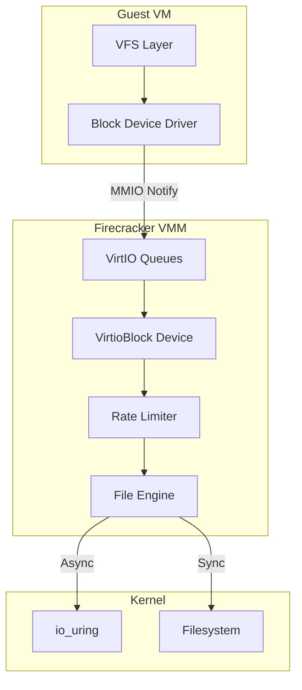
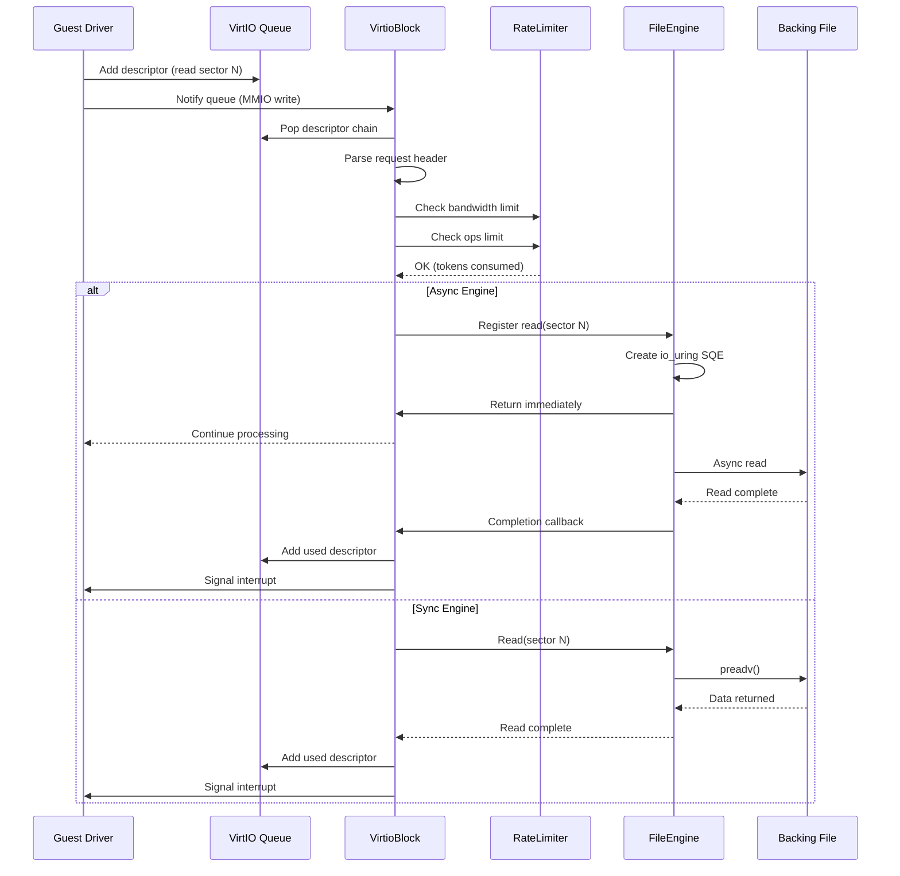

# Firecracker Block Device Deep Dive

## Overview

Firecracker's VirtIO Block device provides paravirtualized disk access to guest VMs. The implementation supports both synchronous (blocking syscalls) and asynchronous (io_uring) I/O engines, rate limiting for bandwidth/ops control, and cache type configuration for flush handling.

The block device is one of the most critical components in Firecracker, as it handles all persistent storage operations including root filesystem access and additional drive attachments.



## 1. Device Architecture

### VirtIO Block Device Structure

```rust
// src/vmm/src/devices/virtio/block/virtio/device.rs
pub struct VirtioBlock {
    // Virtio fields
    pub avail_features: u64,
    pub acked_features: u64,
    pub config_space: ConfigSpace,
    pub activate_evt: EventFd,

    // Transport related fields
    pub queues: Vec<Queue>,
    pub queue_evts: [EventFd; 1],  // Single queue for block
    pub device_state: DeviceState,
    pub irq_trigger: IrqTrigger,

    // Implementation specific fields
    pub id: String,
    pub partuuid: Option<String>,
    pub cache_type: CacheType,
    pub root_device: bool,
    pub read_only: bool,

    // Host file and properties
    pub disk: DiskProperties,
    pub rate_limiter: RateLimiter,
    pub is_io_engine_throttled: bool,
    pub metrics: Arc<BlockDeviceMetrics>,
}

#[repr(C)]
pub struct ConfigSpace {
    pub capacity: u64,  // Device capacity in 512-byte sectors
}
```

### Disk Properties

The `DiskProperties` helper manages the backing file:

```rust
pub struct DiskProperties {
    pub file_path: String,
    pub file_engine: FileEngine,  // Sync or Async
    pub nsectors: u64,            // Device size in sectors
    pub image_id: [u8; VIRTIO_BLK_ID_BYTES],  // Device serial
}

impl DiskProperties {
    pub fn new(
        disk_image_path: String,
        is_disk_read_only: bool,
        file_engine_type: FileEngineType,
    ) -> Result<Self, VirtioBlockError> {
        let mut disk_image = Self::open_file(&disk_image_path, is_disk_read_only)?;
        let disk_size = Self::file_size(&disk_image_path, &mut disk_image)?;
        let image_id = Self::build_disk_image_id(&disk_image);

        Ok(Self {
            file_path: disk_image_path,
            file_engine: FileEngine::from_file(disk_image, file_engine_type)?,
            nsectors: disk_size >> SECTOR_SHIFT,  // Convert to 512-byte sectors
            image_id,
        })
    }

    fn build_device_id(disk_file: &File) -> Result<String, VirtioBlockError> {
        let blk_metadata = disk_file.metadata()?;
        // Use device, rdevice, and inode numbers (same as kvmtool)
        format!("{}{}{}", blk_metadata.st_dev(), blk_metadata.st_rdev(), blk_metadata.st_ino())
    }
}
```

### File Engine Types

Firecracker supports two I/O engine types:

```rust
#[derive(Debug, Default, Clone, Copy, PartialEq, Eq)]
pub enum FileEngineType {
    /// Async engine using io_uring (non-blocking)
    Async,
    /// Sync engine using blocking syscalls (preadv/pwritev)
    #[default]
    Sync,
}

// FileEngine wrapper
pub enum FileEngine {
    Async(AsyncEngine),
    Sync(SyncEngine),
}
```

**Async Engine (io_uring):**
- Non-blocking I/O operations
- Uses Linux io_uring for async read/write
- Better for high-throughput workloads
- Requires kernel 5.7+ for full features

**Sync Engine (blocking):**
- Uses `preadv`/`pwritev` syscalls
- Simpler, works on older kernels
- Can block vCPU thread during I/O

## 2. VirtIO Block Protocol

### Feature Bits

```rust
// src/vmm/src/devices/virtio/block/virtio/device.rs
let mut avail_features = (1u64 << VIRTIO_F_VERSION_1)
                       | (1u64 << VIRTIO_RING_F_EVENT_IDX);

if config.cache_type == CacheType::Writeback {
    avail_features |= 1u64 << VIRTIO_BLK_F_FLUSH;  // Flush support
}

if config.is_read_only {
    avail_features |= 1u64 << VIRTIO_BLK_F_RO;  // Read-only flag
}
```

| Feature | Bit | Description |
|---------|-----|-------------|
| `VIRTIO_F_VERSION_1` | 32 | VirtIO 1.0 compliance |
| `VIRTIO_RING_F_EVENT_IDX` | 29 | Used buffer notification |
| `VIRTIO_BLK_F_FLUSH` | 4 | Flush command support |
| `VIRTIO_BLK_F_RO` | 5 | Read-only device |

### Request Types

```rust
// src/vmm/src/devices/virtio/block/virtio/request.rs
pub enum RequestType {
    Read,           // Read sectors from device
    Write,          // Write sectors to device
    Flush,          // Flush write cache
    Discard,        // Discard blocks (TRIM)
    WriteZeroes,    // Write zeros to blocks
    GetId,          // Get device ID string
    Unsupported,
}

pub struct Request {
    pub request_type: RequestType,
    pub sector: u64,      // Starting sector
    pub data_len: u32,    // Data length in bytes
    pub status_addr: GuestAddress,  // Status write address
}
```

### Request Parsing

```rust
impl Request {
    pub fn parse(
        desc_chain: &mut DescriptorChain,
        disk_nsectors: u64,
    ) -> Result<Request, VirtioBlockError> {
        let mut descriptor = desc_chain.next().ok_or(VirtioBlockError::DescriptorChainTooShort)?;

        // Request header is 16 bytes: type(4) + reserved(4) + sector(8)
        if descriptor.len < VIRTIO_BLK_HEADER_SIZE as u32 {
            return Err(VirtioBlockError::DescriptorChainTooShort);
        }

        let header: VirtioBlockReqHeader = desc_chain
            .memory()
            .read_obj::<VirtioBlockReqHeader>(descriptor.addr)
            .map_err(VirtioBlockError::GuestMemoryMmap)?;

        let mut request_type = match header.type_ {
            VIRTIO_BLK_T_IN => RequestType::Read,
            VIRTIO_BLK_T_OUT => RequestType::Write,
            VIRTIO_BLK_T_FLUSH => RequestType::Flush,
            VIRTIO_BLK_T_DISCARD => RequestType::Discard,
            VIRTIO_BLK_T_WRITE_ZEROES => RequestType::WriteZeroes,
            VIRTIO_BLK_T_GET_ID => RequestType::GetId,
            _ => RequestType::Unsupported,
        };

        Ok(Request {
            request_type,
            sector: header.sector,
            data_len: desc_chain.len() - VIRTIO_BLK_HEADER_SIZE,
            status_addr: desc_chain
                .last()
                .map(|d| d.addr)
                .ok_or(VirtioBlockError::DescriptorChainTooShort)?,
        })
    }
}
```

### VirtIO Block Header

```rust
#[repr(C)]
struct VirtioBlockReqHeader {
    type_: u32,           // Request type
    reserved: u32,
    sector: u64,          // Starting sector (512-byte units)
}

// Sector size constant
pub const SECTOR_SIZE: u32 = 512;
pub const SECTOR_SHIFT: u32 = 9;  // log2(512)
```

## 3. Request Processing Flow

### Event Handler

```rust
// src/vmm/src/devices/virtio/block/virtio/event_handler.rs
impl MutEventSubscriber for VirtioBlock {
    fn process(&mut self, event: Events, ops: &mut EventOps) {
        let source = event.fd();

        // Handle queue event
        if source == self.queue_evts[0].as_raw_fd() {
            self.process_queue_event();
        }

        // Handle rate limiter timer
        if source == self.rate_limer.timer_fd() {
            self.process_rate_limiter_timer();
        }

        // Handle async I/O completion
        if let Some(engine) = self.disk.file_engine.as_async() {
            if source == engine.completion_evt().as_raw_fd() {
                self.process_async_io_completion();
            }
        }
    }
}
```

### Queue Processing

```rust
impl VirtioBlock {
    fn process_queue_event(&mut self) {
        // Consume the queue event
        self.queue_evts[0].read().unwrap();

        // Check if device is activated
        if !self.is_activated() {
            return;
        }

        self.process_virtio_queues();
    }

    fn process_virtio_queues(&mut self) {
        // Only one queue for block device
        let queue = &mut self.queues[0];

        loop {
            // Pop a descriptor chain from the queue
            let mut desc_chain = match queue.pop() {
                Ok(Some(chain)) => chain,
                Ok(None) => break,  // No more descriptors
                Err(_) => break,
            };

            // Parse the request header
            let request = match Request::parse(&mut desc_chain, self.disk.nsectors) {
                Ok(req) => req,
                Err(_) => {
                    self.metrics.invalid_reqs.inc();
                    queue.add_used(desc_chain.head_index(), 0).unwrap();
                    continue;
                }
            };

            // Check rate limiter
            if !self.consume_rate_limiter(&request) {
                // Rate limited, re-queue the request
                queue.undo_pop();
                break;
            }

            // Process the request
            self.process_request(request, desc_chain);
        }

        // Signal used queue if there are completed requests
        if queue.used_rings_event_idx_changed() {
            self.signal_used_queue();
        }
    }

    fn consume_rate_limiter(&mut self, request: &Request) -> bool {
        // Rate limit by bytes for read/write
        if matches!(request.request_type, RequestType::Read | RequestType::Write) {
            if !self.rate_limiter.consume(request.data_len as u64, TokenType::Bytes) {
                self.metrics.rate_limiter_throttled_events.inc();
                return false;
            }
        }

        // Rate limit by operations
        if !self.rate_limiter.consume(1, TokenType::Ops) {
            self.metrics.rate_limiter_throttled_events.inc();
            return false;
        }

        true
    }
}
```

### Request Execution

```rust
impl VirtioBlock {
    fn process_request(&mut self, request: Request, mut desc_chain: DescriptorChain) {
        match request.request_type {
            RequestType::Read => self.process_read(request, desc_chain),
            RequestType::Write => self.process_write(request, desc_chain),
            RequestType::Flush => self.process_flush(request, desc_chain),
            RequestType::Discard => self.process_discard(request, desc_chain),
            RequestType::WriteZeroes => self.process_write_zeroes(request, desc_chain),
            RequestType::GetId => self.process_get_id(request, desc_chain),
            RequestType::Unsupported => {
                self.metrics.unsupported_reqs.inc();
                self.complete_request(desc_chain, VIRTIO_BLK_S_IOERR);
            }
        }
    }

    fn process_read(&mut self, request: Request, desc_chain: DescriptorChain) {
        let mem = desc_chain.memory();
        let data_slice = desc_chain
            .skip_data_queues()
            .next()
            .map(|d| mem.get_slice(d.addr, d.len as usize))
            .ok_or(VirtioBlockError::DataDescriptorNotFound)?;

        match &self.disk.file_engine {
            FileEngine::Async(engine) => {
                // Register async read with io_uring
                let user_data = self.register_async_request(AsyncOp::Read {
                    sector: request.sector,
                    data_slice,
                    desc_chain,
                });
                engine.register_read(request.sector << SECTOR_SHIFT, data_slice, user_data);
            }
            FileEngine::Sync(engine) => {
                // Synchronous read
                let bytes_read = engine
                    .read_at(request.sector << SECTOR_SHIFT, data_slice)
                    .unwrap_or(0);

                self.metrics.read_bytes.add(bytes_read as u64);
                self.complete_request(desc_chain, VIRTIO_BLK_S_OK);
            }
        }
    }

    fn process_write(&mut self, request: Request, desc_chain: DescriptorChain) {
        let mem = desc_chain.memory();
        let data_slice = desc_chain
            .skip_data_queues()
            .next()
            .map(|d| mem.get_slice(d.addr, d.len as usize))
            .ok_or(VirtioBlockError::DataDescriptorNotFound)?;

        match &self.disk.file_engine {
            FileEngine::Async(engine) => {
                let user_data = self.register_async_request(AsyncOp::Write {
                    sector: request.sector,
                    data_slice,
                    desc_chain,
                });
                engine.register_write(request.sector << SECTOR_SHIFT, data_slice, user_data);
            }
            FileEngine::Sync(engine) => {
                let bytes_written = engine
                    .write_at(request.sector << SECTOR_SHIFT, data_slice)
                    .unwrap_or(0);

                self.metrics.write_bytes.add(bytes_written as u64);
                self.complete_request(desc_chain, VIRTIO_BLK_S_OK);
            }
        }
    }

    fn process_flush(&mut self, request: Request, desc_chain: DescriptorChain) {
        if self.cache_type == CacheType::Unsafe {
            // No flush needed
            self.complete_request(desc_chain, VIRTIO_BLK_S_OK);
            return;
        }

        match &self.disk.file_engine {
            FileEngine::Async(engine) => {
                let user_data = self.register_async_request(AsyncOp::Flush { desc_chain });
                engine.register_flush(user_data);
            }
            FileEngine::Sync(engine) => {
                engine.sync_all().map_err(VirtioBlockError::Flush)?;
                self.metrics.flush_count.inc();
                self.complete_request(desc_chain, VIRTIO_BLK_S_OK);
            }
        }
    }

    fn complete_request(&mut self, desc_chain: DescriptorChain, status: u8) {
        let queue = &mut self.queues[0];

        // Write status byte to guest memory
        desc_chain
            .memory()
            .write_obj::<u8>(status, request.status_addr)
            .unwrap_or_else(|err| error!("Failed to write status: {:?}", err));

        // Add to used ring
        queue.add_used(desc_chain.head_index(), 0).unwrap();

        self.metrics.block_reqs_completed.inc();
    }
}
```

## 4. Async I/O Engine

### io_uring Integration

```rust
// src/vmm/src/devices/virtio/block/virtio/io/async_io.rs
pub struct AsyncEngine {
    ring: IoUring<PendingOperation>,
    completion_evt: EventFd,
    pending_ops: HashMap<u64, PendingOperation>,
    next_user_data: u64,
}

impl AsyncEngine {
    pub fn register_read(
        &mut self,
        offset: u64,
        data_slice: GuestMemorySlice,
        user_data: u64,
    ) {
        let op = Operation::read(
            self.registered_fd(),  // Fixed FD index
            data_slice.as_ptr() as usize,
            data_slice.len(),
            offset.into(),
            user_data,
        );
        self.ring.push(op).unwrap();
        self.ring.submit().unwrap();
    }

    pub fn register_write(
        &mut self,
        offset: u64,
        data_slice: GuestMemorySlice,
        user_data: u64,
    ) {
        let op = Operation::write(
            self.registered_fd(),
            data_slice.as_ptr() as usize,
            data_slice.len(),
            offset.into(),
            user_data,
        );
        self.ring.push(op).unwrap();
        self.ring.submit().unwrap();
    }

    pub fn register_flush(&mut self, user_data: u64) {
        let op = Operation::fsync(
            self.registered_fd(),
            0,  // No flags
            user_data,
        );
        self.ring.push(op).unwrap();
        self.ring.submit().unwrap();
    }

    pub fn process_completions(&mut self) -> Vec<(u64, i32, u32)> {
        let mut results = Vec::new();

        while let Ok(Some(cqe)) = self.ring.pop() {
            let user_data = cqe.user_data();
            let result = cqe.result();
            let flags = cqe.flags();

            results.push((user_data, result, flags));
        }

        results
    }
}
```

### Pending Operation Tracking

```rust
#[derive(Debug)]
pub struct PendingOperation {
    op_type: AsyncOpType,
    data_slice: Option<GuestMemorySlice>,
    desc_chain: Option<DescriptorChain>,
}

enum AsyncOpType {
    Read,
    Write,
    Flush,
}

impl VirtioBlock {
    fn process_async_io_completion(&mut self) {
        unwrap_async_file_engine_or_return!(self.disk.file_engine);

        let completions = engine.process_completions();

        for (user_data, result, _flags) in completions {
            let op = self.pending_ops.remove(&user_data).unwrap();

            match op.op_type {
                AsyncOpType::Read => {
                    if result >= 0 {
                        self.metrics.read_bytes.add(result as u64);
                    }
                    self.complete_request(op.desc_chain.unwrap(), VIRTIO_BLK_S_OK);
                }
                AsyncOpType::Write => {
                    if result >= 0 {
                        self.metrics.write_bytes.add(result as u64);
                    }
                    self.complete_request(op.desc_chain.unwrap(), VIRTIO_BLK_S_OK);
                }
                AsyncOpType::Flush => {
                    if result >= 0 {
                        self.metrics.flush_count.inc();
                    }
                    self.complete_request(op.desc_chain.unwrap(), VIRTIO_BLK_S_OK);
                }
            }
        }

        // Re-process queue if we were throttled
        if self.is_io_engine_throttled {
            self.is_io_engine_throttled = false;
            self.process_virtio_queues();
        }
    }
}
```

## 5. Rate Limiter Integration

### Rate Limiting Configuration

```rust
// src/vmm/src/devices/virtio/block/virtio/device.rs
pub struct VirtioBlockConfig {
    pub drive_id: String,
    pub path_on_host: String,
    pub is_read_only: bool,
    pub cache_type: CacheType,
    pub rate_limiter: Option<RateLimiterConfig>,  // Bandwidth and ops limits
    pub file_engine_type: FileEngineType,
}

// RateLimiterConfig structure
pub struct RateLimiterConfig {
    pub bandwidth: Option<TokenBucketConfig>,  // Bytes per second
    pub ops: Option<TokenBucketConfig>,        // Operations per second
}
```

### Token Bucket for Block I/O

```rust
impl VirtioBlock {
    fn consume_rate_limiter(&mut self, request: &Request) -> bool {
        // Check bandwidth limit for read/write
        if matches!(request.request_type, RequestType::Read | RequestType::Write) {
            if !self.rate_limiter.consume(request.data_len as u64, TokenType::Bytes) {
                self.metrics.rate_limiter_throttled_events.inc();
                return false;
            }
        }

        // Check ops limit
        if !self.rate_limiter.consume(1, TokenType::Ops) {
            self.metrics.rate_limiter_throttled_events.inc();
            return false;
        }

        true
    }

    fn process_rate_limiter_timer(&mut self) {
        // Timer fired - replenish tokens
        if self.rate_limiter.timer_expired() {
            self.process_virtio_queues();
        }
    }
}
```

## 6. Cache Types

### Writeback vs Unsafe

```rust
#[derive(Clone, Copy, Debug, Default, PartialEq, Eq)]
pub enum CacheType {
    /// No flush will be advertised to guest
    /// Writes may be cached on host
    /// Fastest but not crash-consistent
    #[default]
    Unsafe,

    /// Flush will be advertised and honored
    /// Guest can request explicit flush
    /// Crash-consistent when flush is used
    Writeback,
}

// Feature negotiation
if config.cache_type == CacheType::Writeback {
    avail_features |= 1u64 << VIRTIO_BLK_F_FLUSH;
}
```

### Flush Handling

```rust
fn process_flush(&mut self, request: Request, desc_chain: DescriptorChain) {
    match self.cache_type {
        CacheType::Unsafe => {
            // Guest requested flush but we ignore it
            // This is valid per VirtIO spec when flush not advertised
            self.complete_request(desc_chain, VIRTIO_BLK_S_OK);
        }
        CacheType::Writeback => {
            // Actually flush to disk
            match &self.disk.file_engine {
                FileEngine::Sync(engine) => {
                    engine.sync_all().unwrap();
                    self.metrics.flush_count.inc();
                    self.complete_request(desc_chain, VIRTIO_BLK_S_OK);
                }
                FileEngine::Async(engine) => {
                    engine.register_flush(user_data);
                }
            }
        }
    }
}
```

## 7. Block Device Metrics

```rust
// src/vmm/src/devices/virtio/block/virtio/metrics.rs
pub struct BlockDeviceMetrics {
    // Operation counts
    pub read_count: MetricWithArray,
    pub write_count: MetricWithArray,
    pub flush_count: MetricWithArray,

    // Byte counts
    pub read_bytes: MetricWithArray,
    pub write_bytes: MetricWithArray,

    // Error counts
    pub invalid_reqs: MetricWithArray,      // Malformed requests
    pub unsupported_reqs: MetricWithArray,  // Unsupported operations
    pub rate_limiter_throttled_events: MetricWithArray,

    // Completion tracking
    pub block_reqs_completed: MetricWithArray,
    pub block_fails: MetricWithArray,
}

// Per-device metrics stored in BTreeMap keyed by drive_id
type BlockMetricsPerDevice = BTreeMap<String, Arc<BlockDeviceMetrics>>;

// Global aggregate metrics
pub static METRICS: Lazy<BlockMetrics> = Lazy::new(|| BlockMetrics {
    devices: Mutex::new(BTreeMap::new()),
});
```

## 8. Device Configuration API

### Block Device Config

```rust
// src/vmm/src/vmm_config/drive.rs
#[derive(Debug, Clone, Serialize, Deserialize)]
pub struct BlockDeviceConfig {
    #[serde(default)]
    pub drive_id: String,           // Unique identifier
    pub path_on_host: Option<String>,  // Path to backing file
    pub is_root_device: bool,       // Is this the root filesystem
    pub partuuid: Option<String>,   // Partition UUID for boot
    #[serde(default)]
    pub is_read_only: Option<bool>, // Open read-only
    #[serde(default)]
    pub cache_type: CacheType,      // Cache strategy
    pub rate_limiter: Option<RateLimiterConfig>,
    #[serde(default)]
    pub file_engine_type: Option<FileEngineType>,  // Async or Sync
    pub socket: Option<String>,     // For vhost-user block (optional)
}
```

### API Example

```bash
# Add a block device
curl --unix-socket /tmp/firecracker.socket \
  -X PUT 'http://localhost/drives/rootfs' \
  -d '{
    "drive_id": "rootfs",
    "path_on_host": "/images/rootfs.ext4",
    "is_root_device": true,
    "is_read_only": false,
    "cache_type": "Writeback",
    "io_engine": "Async"
  }'

# Add rate-limited secondary drive
curl --unix-socket /tmp/firecracker.socket \
  -X PUT 'http://localhost/drives/data' \
  -d '{
    "drive_id": "data",
    "path_on_host": "/images/data.ext4",
    "is_root_device": false,
    "is_read_only": true,
    "rate_limiter": {
      "bandwidth": {
        "size": 10485760,
        "refill_time": 1000
      },
      "ops": {
        "size": 100,
        "refill_time": 1000
      }
    }
  }'
```

## 9. Error Handling

### VirtioBlockError Types

```rust
#[derive(Debug, thiserror::Error)]
pub enum VirtioBlockError {
    /// Backing file error: {0} for path {1}
    BackingFile(std::io::Error, String),

    /// File engine error: {0}
    FileEngine(FileEngineError),

    /// Descriptor chain too short
    DescriptorChainTooShort,

    /// Guest memory error: {0}
    GuestMemoryMmap(GuestMemoryError),

    /// Flush operation failed: {0}
    Flush(std::io::Error),

    /// Rate limiter error: {0}
    RateLimiter(RateLimiterError),

    /// Async I/O error: {0}
    AsyncIo(IoUringError),

    /// Invalid configuration
    Config,

    /// Unknown request type
    UnknownRequestType(u32),

    /// Device already activated
    AlreadyActivated,
}
```

### Status Codes

```rust
// VirtIO Block status codes
pub const VIRTIO_BLK_S_OK: u8 = 0;      // Success
pub const VIRTIO_BLK_S_IOERR: u8 = 1;   // I/O error
pub const VIRTIO_BLK_S_UNSUPP: u8 = 2;  // Unsupported operation
```

## 10. Request Flow Diagram



## 11. Performance Considerations

### Async vs Sync Performance

| Metric | Async (io_uring) | Sync (preadv) |
|--------|------------------|---------------|
| Latency (P99) | Lower | Higher |
| Throughput | Higher | Limited |
| vCPU blocking | None | Possible |
| Kernel requirement | 5.7+ | Any |

### Optimizations

1. **Descriptor Caching**: Reuse allocated buffers
2. **Request Batching**: Combine adjacent sector reads
3. **Write Coalescing**: Merge sequential writes
4. **Prefetching**: Anticipate sequential reads

## 12. Summary

Firecracker's block device implementation provides:

- **VirtIO compliance** - Full VirtIO 1.1 block device specification
- **Dual I/O engines** - Async (io_uring) and Sync (preadv/pwritev) options
- **Rate limiting** - Bandwidth and ops/s control per device
- **Cache control** - Writeback (crash-consistent) and Unsafe (performance) modes
- **Flush support** - Optional flush command for durability
- **Read-only mode** - Write protection for immutable drives
- **Comprehensive metrics** - Per-device statistics tracking
- **Error handling** - Graceful error reporting and recovery

The block device is optimized for cloud workloads where predictable I/O performance and isolation are critical. The async engine provides the best performance on modern kernels, while the sync engine ensures compatibility with older systems.
