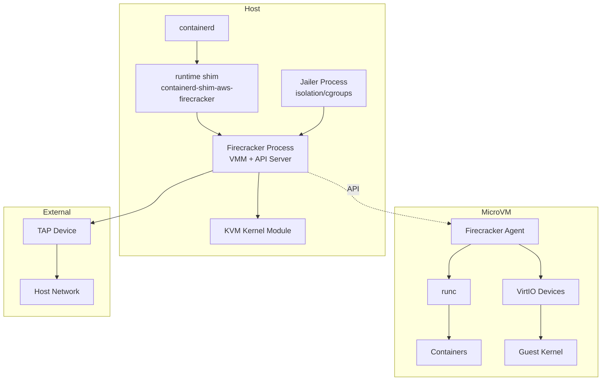
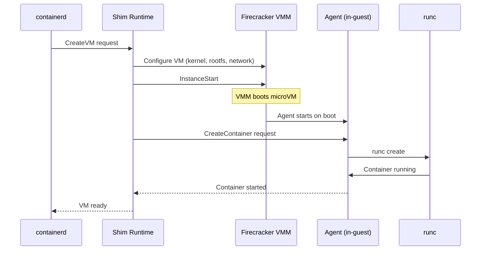

# Firecracker Ecosystem Deep Dive Exploration

## Overview

This exploration covers the complete Firecracker ecosystem - a virtualization technology purpose-built for creating and managing secure, multi-tenant container and function-based services that provide serverless operational models. Firecracker runs workloads in lightweight virtual machines called **microVMs**, which combine the security and isolation properties of hardware virtualization with the speed and flexibility of containers.

The ecosystem consists of multiple repositories and components:
- **firecracker** - The core VMM (Virtual Machine Monitor) written in Rust
- **firecracker-containerd** - Integration with containerd for container orchestration
- **firecracker-go-sdk** - Go SDK for interacting with Firecracker API
- **firectl** - Command-line tool for running Firecracker microVMs
- **kvm-bindings** - Rust bindings for KVM
- **micro-http** - Lightweight HTTP library used by Firecracker
- **versionize** - Serialization/deserialization library for snapshot support

## Repository Structure

```
src.firecracker/
├── firecracker/                    # Core VMM - Rust implementation
│   ├── src/firecracker/            # Main VMM source code
│   ├── src/jailer/                 # Process isolation/jailing utility
│   ├── src/seccompiler/            # Seccomp filter compiler
│   ├── resources/                  # Guest kernel configs, overlay files
│   │   ├── guest_configs/          # Kernel .config files for CI
│   │   └── overlay/                # Root filesystem overlay templates
│   ├── docs/                       # Comprehensive documentation
│   │   ├── api_requests/           # API endpoint documentation
│   │   ├── cpu_templates/          # CPU templating docs
│   │   ├── snapshotting/           # Snapshot feature documentation
│   │   ├── rootfs-and-kernel-setup.md
│   │   ├── jailer.md
│   │   └── design.md
│   └── tools/
│       └── devtool                 # Build/test automation script
│
├── firecracker-containerd/         # containerd integration
│   ├── agent/                      # Agent running inside microVM
│   ├── runtime/                    # containerd v2 runtime shim
│   ├── firecracker-control/        # Control plugin for containerd
│   ├── tools/image-builder/        # Root filesystem image builder
│   └── docs/                       # Architecture and setup docs
│
├── firecracker-go-sdk/             # Go SDK
│   ├── client.go                   # API client implementation
│   ├── machine.go                  # MicroVM machine abstraction
│   └── cni/                        # CNI networking support
│
├── firectl/                        # CLI tool for Firecracker
│   ├── main.go                     # CLI entrypoint
│   └── firecracker.go              # Firecracker process management
│
├── kvm-bindings/                   # Rust KVM bindings
│   ├── src/                        # Auto-generated KVM FFI bindings
│   └── build.rs                    # Bindgen build script
│
├── micro-http/                     # Minimal HTTP library
│   └── src/                        # HTTP parser/server
│
└── versionize/                     # Serialization for snapshots
    └── src/                        # Version-aware serialization
```

## Architecture

### High-Level Diagram



### Container Launch Sequence



## Key Components

### 1. Firecracker VMM (Rust)

**Location:** `firecracker/src/firecracker/`

The core virtual machine monitor that:
- Uses KVM for hardware-assisted virtualization
- Exposes a RESTful API over Unix domain socket
- Implements VirtIO devices (net, block, vsock, balloon, entropy)
- Supports snapshotting for fast restore
- Implements CPU templates for consistent CPU feature exposure

**Key Design Decisions:**
- **Single microVM per process** - Each Firecracker process encapsulates exactly one microVM for isolation
- **Minimal device model** - Only essential devices to reduce attack surface
- **Thread architecture:**
  - API thread - Handles control plane, never in fast path
  - VMM thread - Exposes machine model, device emulation
  - vCPU threads - One per guest core, runs KVM_RUN loop

**API Resources:**
- `/machine-config` - Configure vCPUs, memory, CPU template
- `/boot-source` - Kernel image and boot arguments
- `/drives` - Block devices (rootfs and additional drives)
- `/network-interfaces` - Network interface configuration
- `/snapshot/create` and `/snapshot/load` - Snapshot operations
- `/actions` - Start instance and other actions

### 2. Jailer

**Location:** `firecracker/src/jailer/`

The jailer is a dedicated process that starts Firecracker with enhanced security:

**Operations:**
1. Validates all paths and VM ID
2. Creates chroot directory structure
3. Copies Firecracker binary into jail
4. Sets up cgroups (v1 or v2) for resource isolation
5. Creates mount namespace with `pivot_root()`
6. Creates `/dev/kvm` and `/dev/net/tun` inside jail
7. Drops privileges (setuid/setgid)
8. Optionally spawns in new PID namespace
9. Execs into Firecracker binary

**Security Benefits:**
- Filesystem isolation via chroot
- Resource limits via cgroups
- Process isolation via namespaces
- Privilege dropping before exec

### 3. Firecracker Containerd

**Location:** `firecracker-containerd/`

Enables containerd to manage Firecracker microVMs:

**Components:**
- **Control Plugin** - Compiled into containerd binary, implements control API
- **Runtime Shim** - Out-of-process shim communicating over ttrpc
- **Agent** - Runs inside microVM, invokes runc for containers
- **Image Builder** - Creates root filesystem images

**Root Filesystem Requirements:**
- Firecracker-containerd agent (starts on boot via systemd)
- runc binary
- Standard Linux mounts (procfs, sysfs)
- cgroup v1 filesystem
- Overlay support for read-only base + RW layer

### 4. Firecracker Go SDK

**Location:** `firecracker-go-sdk/`

Go library for programmatic Firecracker control:

**Features:**
- Machine abstraction for VM lifecycle
- Static network interface configuration
- CNI-configured network interfaces
- Drives, vsock, and machine config support
- Snapshotting support

**Network Configuration:**
```go
// CNI-configured interface
NetworkInterfaces: []firecracker.NetworkInterface{{
    CNIConfiguration: &firecracker.CNIConfiguration{
        NetworkName: "fcnet",
        IfName: "veth0",
    },
}}

// Static interface
NetworkInterfaces: []firecracker.NetworkInterface{{
    StaticConfiguration: &firecracker.StaticNetworkConfiguration{
        MachineConfiguration: &firecracker.MachineNetworkConfiguration{
            MacAddress: "06:00:AC:10:00:02",
        },
        InterfaceConfiguration: &firecracker.InterfaceConfiguration{
            IPs: []net.IP{net.ParseIP("172.16.0.2")},
        },
    },
}}
```

### 5. Firectl

**Location:** `firectl/`

Simple CLI for running Firecracker microVMs:

```bash
firectl \
  --kernel=~/bin/vmlinux \
  --root-drive=/images/image.img \
  --ncpus=2 \
  --memory=1024 \
  --tap-device=tap0/06:00:AC:10:00:02
```

## Kernel and RootFS Setup

### Building Linux Kernel for Firecracker

**Manual compilation:**
```bash
git clone https://github.com/torvalds/linux.git linux.git
cd linux.git
git checkout v6.1  # Use supported version

# Copy recommended config from firecracker repo
cp microvm-kernel-ci-x86_64-6.1.config .config
make menuconfig  # Optional adjustments

# Build kernel
make vmlinux  # x86_64
# make Image  # aarch64
```

**Using Firecracker's devtool:**
```bash
./tools/devtool build_ci_artifacts kernels 6.1
```

**Required Kernel Config Options:**
```
# Minimal boot (initrd)
CONFIG_BLK_DEV_INITRD=y
CONFIG_VIRTIO_MMIO=y  # aarch64
CONFIG_KVM_GUEST=y    # x86_64

# Root block device boot
CONFIG_VIRTIO_BLK=y
CONFIG_ACPI=y         # x86_64
CONFIG_PCI=y          # x86_64

# Console output
CONFIG_SERIAL_8250_CONSOLE=y
CONFIG_PRINTK=y

# VirtIO devices
CONFIG_VIRTIO_NET=y
CONFIG_VIRTIO_VSOCKETS=y
CONFIG_HW_RANDOM_VIRTIO=y
CONFIG_VIRTIO_BALLOON=y

# RNG
CONFIG_RANDOM_TRUST_CPU=y
```

### Building Root Filesystem

**Manual EXT4 build:**
```bash
# Create empty filesystem
dd if=/dev/zero of=rootfs.ext4 bs=1M count=500
mkfs.ext4 rootfs.ext4
mkdir /mnt/rootfs
mount rootfs.ext4 /mnt/rootfs

# Use Docker to populate (Alpine + OpenRC example)
docker run -it --rm -v /mnt/rootfs:/my-rootfs alpine
apk add openrc util-linux
ln -s agetty /etc/init.d/agetty.ttyS0
echo ttyS0 > /etc/securetty
rc-update add agetty.ttyS0 default
rc-update add devfs boot
rc-update add procfs boot
rc-update add sysfs boot
for d in bin etc lib root sbin usr; do tar c "/$d" | tar x -C /my-rootfs; done
for dir in dev proc run sys var; do mkdir /my-rootfs/${dir}; done
exit

umount /mnt/rootfs
```

**Using firecracker-containerd image-builder:**
```bash
cd firecracker-containerd/tools/image-builder
make image  # Creates Debian-based rootfs
sudo cp rootfs.img /var/lib/firecracker-containerd/runtime/default-rootfs.img
```

## Snapshot Support

Firecracker supports full microVM snapshotting:

**Snapshot Types:**
- **Full snapshots** - Complete VM state and memory dump
- **Diff snapshots** - Only changed pages since last snapshot

**API Flow:**
```bash
# 1. Pause VM
curl --unix-socket /tmp/firecracker.socket -X PATCH \
  'http://localhost/vm' \
  -d '{"state": "Paused"}'

# 2. Create snapshot
curl --unix-socket /tmp/firecracker.socket -X PUT \
  'http://localhost/snapshot/create' \
  -d '{
    "snapshot_type": "Full",
    "snapshot_path": "/path/to/snapshot_file",
    "mem_file_path": "/path/to/mem_file"
  }'

# 3. Resume VM (optional, if keeping original running)
curl --unix-socket /tmp/firecracker.socket -X PATCH \
  'http://localhost/vm' \
  -d '{"state": "Resumed"}'

# 4. Load snapshot (in new Firecracker instance)
curl --unix-socket /tmp/firecracker.socket -X PUT \
  'http://localhost/snapshot/load' \
  -d '{
    "snapshot_path": "/path/to/snapshot_file",
    "mem_backend": {
      "backend_path": "/path/to/mem_file",
      "backend_type": "File"
    }
  }'
```

**Important Considerations:**
- Snapshots must resume on identical hardware
- Network connectivity not guaranteed after restore
- VMGenID device reseeds guest PRNG on restore
- Don't resume same snapshot twice (security risk)

## Supported Platforms

### Host Kernel Support
| Page Size | Host Kernel | Min Version | End of Support |
|-----------|-------------|-------------|----------------|
| 4K        | v5.10       | v1.0.0      | 2024-01-31     |
| 4K        | v6.1        | v1.5.0      | 2025-10-12     |

### Guest Kernel Support
| Page Size | Guest Kernel | Min Version | End of Support |
|-----------|--------------|-------------|----------------|
| 4K        | v5.10        | v1.0.0      | 2024-01-31     |
| 4K        | v6.1         | v1.9.0      | 2026-09-02     |

### Tested EC2 Instance Types
- c5n.metal, m5n.metal, m6i.metal, m7i.metal-24xl/48xl
- m6a.metal, m7a.metal-48xl
- m6g.metal, m7g.metal, m8g.metal-24xl/48xl

## Configuration Examples

### Minimal Firecracker Config JSON
```json
{
  "boot-source": {
    "kernel_image_path": "/path/to/vmlinux",
    "boot_args": "console=ttyS0 reboot=k panic=1 pci=off"
  },
  "drives": [
    {
      "drive_id": "rootfs",
      "path_on_host": "/path/to/rootfs.ext4",
      "is_root_device": true,
      "is_read_only": false
    }
  ],
  "network-interfaces": [
    {
      "iface_id": "net1",
      "host_dev_name": "tap0"
    }
  ],
  "machine-config": {
    "vcpu_count": 2,
    "mem_size_mib": 1024,
    "smt": false
  }
}
```

### containerd Runtime Config
```json
{
  "firecracker_binary_path": "/usr/local/bin/firecracker",
  "kernel_image_path": "/var/lib/firecracker-containerd/runtime/vmlinux.bin",
  "kernel_args": "console=ttyS0 noapic reboot=k panic=1 pci=off nomodules rw systemd.unit=firecracker.target init=/sbin/overlay-init",
  "root_drive": "/var/lib/firecracker-containerd/runtime/default-rootfs.img",
  "cpu_template": "T2",
  "log_fifo": "/var/log/firecracker/fc-logs.fifo",
  "log_levels": ["debug"]
}
```

## Key Insights

1. **Security-first design** - Every component is designed with multi-tenant isolation in mind:
   - Seccomp filters limit syscalls per thread
   - Jailer provides cgroup/namespace isolation
   - Minimal device model reduces attack surface

2. **Fast startup** - MicroVMs boot in <125ms:
   - Lightweight VMM (~30MB resident memory)
   - No legacy BIOS/UEFI overhead
   - PVH boot mode support (FreeBSD, some Linux kernels)

3. **Snapshot optimization** - Designed for serverless:
   - Copy-on-write memory loading
   - Diff snapshots for incremental state
   - Fast restore from paused state

4. **Container integration** - Firecracker-containerd bridges two worlds:
   - OCI image compatibility
   - VM-level isolation for containers
   - Overlay filesystem for shared base images

5. **Rust implementation** - Core VMM is ~100K lines of safe Rust:
   - Memory safety guarantees
   - Zero-cost abstractions for KVM
   - Version-aware serialization for snapshots

## Open Questions / Areas for Further Exploration

1. **vhost-user block support** - Newer feature for external block backends
2. **Dragonball VMM** - Alibaba's Firecracker fork with additional features
3. **Kata Containers integration** - How Firecracker integrates with Kubernetes
4. **Flintlock** - Cloud Native Computing Foundation project for bare-metal provisioning
5. **CPU template customization** - Creating custom CPU templates for specific workloads
