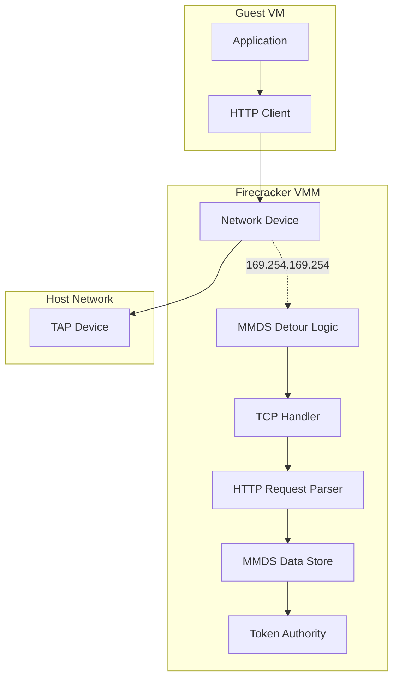

# Firecracker MMDS (Microvm Metadata Service) Deep Dive

## Overview

MMDS (Microvm Metadata Service) is Firecracker's implementation of a metadata service compatible with AWS EC2 Instance Metadata Service (IMDS). It provides a mechanism for guests to retrieve instance metadata and configuration data at runtime through an HTTP API accessible only from within the microVM.

The service supports both **IMDSv1** (optional token authentication) and **IMDSv2** (required token-based authentication with session tokens), providing backward compatibility while enabling stronger security posture.

## Architecture

### High-Level Diagram



### Network Detour Architecture

MMDS intercepts network traffic destined for the special IP `169.254.169.254` (the link-local address used by cloud metadata services):

```rust
// In network device model
pub fn is_mmds_frame(&self, src: &[u8]) -> bool {
    if let Ok(eth) = EthernetFrame::from_bytes(src) {
        match eth.ethertype() {
            ETHERTYPE_ARP => test_speculative_tpa(src, self.ipv4_addr),
            ETHERTYPE_IPV4 => test_speculative_dst_addr(src, self.ipv4_addr),
            _ => false,
        }
    } else {
        false
    }
}

pub fn detour_frame(&mut self, src: &[u8]) -> bool {
    if let Ok(eth) = EthernetFrame::from_bytes(src) {
        match eth.ethertype() {
            ETHERTYPE_ARP => return self.detour_arp(eth),
            ETHERTYPE_IPV4 => return self.detour_ipv4(eth),
            _ => (),
        }
    }
    false
}
```

## MMDS Network Stack (`mmds/ns.rs`)

### Configuration

```rust
const DEFAULT_MAC_ADDR: &str = "06:01:23:45:67:01";
const DEFAULT_IPV4_ADDR: [u8; 4] = [169, 254, 169, 254];  // 169.254.169.254
const DEFAULT_TCP_PORT: u16 = 80;
const DEFAULT_MAX_CONNECTIONS: usize = 30;
const DEFAULT_MAX_PENDING_RESETS: usize = 100;
```

### MmdsNetworkStack Structure

```rust
pub struct MmdsNetworkStack {
    // Network interface MAC address from which frames arrived
    remote_mac_addr: MacAddr,
    // The Ethernet MAC address of the MMDS server
    pub(crate) mac_addr: MacAddr,
    // MMDS server IPv4 address (default: 169.254.169.254)
    pub ipv4_addr: Ipv4Addr,
    // ARP reply destination IPv4 address
    pending_arp_reply_dest: Option<Ipv4Addr>,
    // TCP handler for MMDS<->guest interaction
    pub(crate) tcp_handler: TcpIPv4Handler,
    // Data store reference shared across all MmdsNetworkStack instances
    pub mmds: Arc<Mutex<Mmds>>,
}
```

### ARP Handling

The MMDS network stack handles ARP requests to resolve its MAC address:

```rust
fn detour_arp(&mut self, eth: EthernetFrame<&[u8]>) -> bool {
    if let Ok(arp) = EthIPv4ArpFrame::request_from_bytes(eth.payload()) {
        // Store the requester's MAC for reply
        self.remote_mac_addr = arp.sha();
        self.pending_arp_reply_dest = Some(arp.spa());
        return true;
    }
    false
}

fn write_arp_reply(&self, buf: &mut [u8]) -> Result<Option<NonZeroUsize>, WriteArpFrameError> {
    let arp_reply_dest = self.pending_arp_reply_dest
        .ok_or(WriteArpFrameError::NoPendingArpReply)?;

    let mut eth_unsized = self.prepare_eth_unsized(buf, ETHERTYPE_ARP)?;

    let arp_len = EthIPv4ArpFrame::write_reply(
        eth_unsized.inner_mut().payload_mut(),
        self.mac_addr,
        self.ipv4_addr,
        self.remote_mac_addr,
        arp_reply_dest,
    )?.len();

    Ok(Some(eth_unsized.with_payload_len_unchecked(arp_len).len()))
}
```

**ARP Reply Format:**
- Operation: REPLY (2)
- SHA (Sender Hardware Address): MMDS MAC
- SPA (Sender Protocol Address): 169.254.169.254
- THA (Target Hardware Address): Requester's MAC
- TPA (Target Protocol Address): Requester's IP

### IPv4/TCP Detour

TCP packets to MMDS are processed through the TCP handler:

```rust
fn detour_ipv4(&mut self, eth: EthernetFrame<&[u8]>) -> bool {
    if let Ok(ip) = IPv4Packet::from_bytes(eth.payload(), false) {
        if ip.protocol() == PROTOCOL_TCP {
            // Store source MAC for response framing
            self.remote_mac_addr = eth.src_mac();

            let mmds_instance = self.mmds.clone();
            match &mut self.tcp_handler.receive_packet(&ip, move |request| {
                super::convert_to_response(mmds_instance, request)
            }) {
                Ok(event) => {
                    METRICS.mmds.rx_count.inc();
                    match event {
                        RecvEvent::NewConnectionSuccessful => {
                            METRICS.mmds.connections_created.inc()
                        }
                        RecvEvent::NewConnectionReplacing => {
                            METRICS.mmds.connections_created.inc();
                            METRICS.mmds.connections_destroyed.inc();
                        }
                        RecvEvent::EndpointDone => {
                            METRICS.mmds.connections_destroyed.inc();
                        }
                        _ => (),
                    }
                }
                Err(_) => METRICS.mmds.rx_accepted_err.inc(),
            }
        } else {
            // Non-TCP IPv4 packet to MMDS - unusual
            METRICS.mmds.rx_accepted_unusual.inc();
        }
        return true;
    }
    false
}
```

### Frame Transmission

```rust
pub fn write_next_frame(&mut self, buf: &mut [u8]) -> Option<NonZeroUsize> {
    // Priority 1: ARP replies
    if self.pending_arp_reply_dest.is_some() {
        return match self.write_arp_reply(buf) {
            Ok(something) => {
                METRICS.mmds.tx_count.inc();
                self.pending_arp_reply_dest = None;
                something
            }
            Err(_) => {
                METRICS.mmds.tx_errors.inc();
                None
            }
        };
    }

    // Priority 2: TCP segments (responses)
    let call_write = match self.tcp_handler.next_segment_status() {
        NextSegmentStatus::Available => true,
        NextSegmentStatus::Timeout(value) => timestamp_cycles() >= value,
        NextSegmentStatus::Nothing => false,
    };

    if call_write {
        return match self.write_packet(buf) {
            Ok(something) => {
                METRICS.mmds.tx_count.inc();
                something
            }
            Err(_) => {
                METRICS.mmds.tx_errors.inc();
                None
            }
        };
    }
    None
}
```

## Data Store (`mmds/data_store.rs`)

### Mmds Structure

```rust
pub struct Mmds {
    version: MmdsVersion,           // V1 or V2
    data_store: Value,              // JSON data tree
    token_authority: TokenAuthority, // Token generation/validation
    is_initialized: bool,           // Has data been set?
    data_store_limit: usize,        // Max size (default: 51200 bytes)
}

#[derive(Clone, Copy, Debug, Default, PartialEq, Eq, Deserialize, Serialize)]
pub enum MmdsVersion {
    #[default]
    V1,  // Optional token authentication
    V2,  // Required token authentication
}
```

### Data Store Operations

**Initialization:**
```rust
impl Mmds {
    pub fn try_new(data_store_limit: usize) -> Result<Self, MmdsDatastoreError> {
        Ok(Mmds {
            version: MmdsVersion::default(),
            data_store: Value::default(),
            token_authority: TokenAuthority::try_new()?,
            is_initialized: false,
            data_store_limit,
        })
    }

    pub fn set_aad(&mut self, instance_id: &str) {
        self.token_authority.set_aad(instance_id);
    }
}
```

**PUT Data (Full Replacement):**
```rust
pub fn put_data(&mut self, data: Value) -> Result<(), MmdsDatastoreError> {
    if to_vec(&data).unwrap().len() > self.data_store_limit {
        Err(MmdsDatastoreError::DataStoreLimitExceeded)
    } else {
        self.data_store = data;
        self.is_initialized = true;
        Ok(())
    }
}
```

**PATCH Data (JSON Merge Patch - RFC 7396):**
```rust
pub fn patch_data(&mut self, patch_data: Value) -> Result<(), MmdsDatastoreError> {
    self.check_data_store_initialized()?;
    let mut data_store_clone = self.data_store.clone();

    super::json_patch(&mut data_store_clone, &patch_data);

    if to_vec(&data_store_clone).unwrap().len() > self.data_store_limit {
        return Err(MmdsDatastoreError::DataStoreLimitExceeded);
    }
    self.data_store = data_store_clone;
    Ok(())
}
```

**JSON Merge Patch Implementation:**
```rust
pub fn json_patch(target: &mut Value, patch: &Value) {
    if patch.is_object() {
        if !target.is_object() {
            *target = Value::Object(Map::new());
        }

        let doc = target.as_object_mut().unwrap();
        for (key, value) in patch.as_object().unwrap() {
            if value.is_null() {
                // null values remove keys
                doc.remove(key.as_str());
            } else {
                // Recursive merge
                json_patch(doc.entry(key.as_str()).or_insert(Value::Null), value);
            }
        }
    } else {
        *target = patch.clone();
    }
}
```

**GET Value (Retrieval with Path Navigation):**
```rust
pub fn get_value(
    &self,
    path: String,
    format: OutputFormat,
) -> Result<String, MmdsDatastoreError> {
    // Handle trailing slash for JSON pointer compatibility
    let value = if path.ends_with('/') {
        self.data_store.pointer(&path.as_str()[..(path.len() - 1)])
    } else {
        self.data_store.pointer(path.as_str())
    };

    if let Some(json) = value {
        match format {
            OutputFormat::Json => Ok(json.to_string()),
            OutputFormat::Imds => Mmds::format_imds(json),
        }
    } else {
        Err(MmdsDatastoreError::NotFound)
    }
}
```

**IMDS Format Conversion:**
```rust
fn format_imds(json: &Value) -> Result<String, MmdsDatastoreError> {
    match json.as_object() {
        Some(map) => {
            let mut ret = Vec::new();
            for key in map.keys() {
                let mut key = key.clone();
                // Append "/" for nested objects
                if map[&key].is_object() {
                    key.push('/');
                }
                ret.push(key);
            }
            Ok(ret.join("\n"))
        }
        None => {
            // For leaf values, only support strings
            match json.as_str() {
                Some(str_val) => Ok(str_val.to_string()),
                None => Err(MmdsDatastoreError::UnsupportedValueType),
            }
        }
    }
}
```

### Example Data Structure

```json
{
    "meta-data": {
        "instance-id": "i-12345678",
        "ami-id": "ami-abcdef12",
        "instance-type": "m5.large",
        "region": "us-west-2"
    },
    "user-data": "base64-encoded-user-data"
}
```

**IMDS Format Output (GET /):**
```
meta-data/
user-data
```

**IMDS Format Output (GET /meta-data/):**
```
instance-id
ami-id
instance-type
region
```

## Token Authentication (`mmds/token.rs`, `mmds/token_headers.rs`)

### Token Headers

```rust
// Token request/response headers
pub const X_METADATA_TOKEN_HEADER: &str = "X-metadata-token";
pub const X_METADATA_TOKEN_TTL_SECONDS_HEADER: &str = "X-metadata-token-ttl-seconds";
pub const X_AWS_EC2_METADATA_TOKEN_HEADER: &str = "X-aws-ec2-metadata-token";
pub const X_AWS_EC2_METADATA_TOKEN_SSL_SECONDS_HEADER: &str = "X-aws-ec2-metadata-token-ttl-seconds";

// Security header (rejected for PUT requests)
pub const X_FORWARDED_FOR_HEADER: &str = "X-Forwarded-For";

// Token endpoint path
pub const PATH_TO_TOKEN: &str = "/latest/api/token";
```

### Token Lifetime Constraints

```rust
pub const MIN_TOKEN_TTL_SECONDS: u32 = 60;     // 1 minute
pub const MAX_TOKEN_TTL_SECONDS: u32 = 21600;  // 6 hours
```

### Token Generation (PUT /latest/api/token)

**Request:**
```http
PUT /latest/api/token HTTP/1.1
X-metadata-token-ttl-seconds: 3600
```

**Response:**
```http
HTTP/1.1 200 OK
Content-Type: text/plain

AQAAAKu...base64-encoded-token...==
```

### Validation Flow

**IMDSv1 (Token Optional):**
```rust
fn respond_to_get_request_v1(mmds: &Mmds, request: Request) -> Response {
    // Track metrics for token presence
    match get_header_value_pair(
        request.headers.custom_entries(),
        &[X_METADATA_TOKEN_HEADER, X_AWS_EC2_METADATA_TOKEN_HEADER],
    ) {
        Some((_, token)) => {
            if !mmds.is_valid_token(token) {
                METRICS.mmds.rx_invalid_token.inc();
            }
            // Token invalid but request still accepted in V1
        }
        None => {
            METRICS.mmds.rx_no_token.inc();
        }
    }
    respond_to_get_request(mmds, request)
}
```

**IMDSv2 (Token Required):**
```rust
fn respond_to_get_request_v2(mmds: &Mmds, request: Request) -> Response {
    let token = match get_header_value_pair(
        request.headers.custom_entries(),
        &[X_METADATA_TOKEN_HEADER, X_AWS_EC2_METADATA_TOKEN_HEADER],
    ) {
        Some((_, token)) => token,
        None => {
            METRICS.mmds.rx_no_token.inc();
            return build_response(
                request.http_version(),
                StatusCode::Unauthorized,
                MediaType::PlainText,
                Body::new(VmmMmdsError::NoTokenProvided.to_string()),
            );
        }
    };

    match mmds.is_valid_token(token) {
        true => respond_to_get_request(mmds, request),
        false => {
            METRICS.mmds.rx_invalid_token.inc();
            build_response(
                request.http_version(),
                StatusCode::Unauthorized,
                MediaType::PlainText,
                Body::new(VmmMmdsError::InvalidToken.to_string()),
            )
        }
    }
}
```

### PUT Request Handling

```rust
fn respond_to_put_request(mmds: &mut Mmds, request: Request) -> Response {
    let custom_headers = request.headers.custom_entries();

    // Security: Reject X-Forwarded-For header (prevent spoofing)
    if let Some((header, _)) = get_header_value_pair(custom_headers, &[X_FORWARDED_FOR_HEADER]) {
        let error_msg = RequestError::HeaderError(HttpHeaderError::UnsupportedName(header.to_string())).to_string();
        return build_response(
            request.http_version(),
            StatusCode::BadRequest,
            MediaType::PlainText,
            Body::new(error_msg),
        );
    }

    let uri = request.uri().get_abs_path();
    let json_path = sanitize_uri(uri.to_string());

    // Only /latest/api/token is valid for PUT
    if json_path != PATH_TO_TOKEN {
        return build_response(
            request.http_version(),
            StatusCode::NotFound,
            MediaType::PlainText,
            Body::new(VmmMmdsError::ResourceNotFound(String::from(uri)).to_string()),
        );
    }

    // Parse TTL from header
    let ttl_seconds = match get_header_value_pair(
        custom_headers,
        &[X_METADATA_TOKEN_TTL_SECONDS_HEADER, X_AWS_EC2_METADATA_TOKEN_SSL_SECONDS_HEADER],
    ) {
        Some((k, v)) => match v.parse::<u32>() {
            Ok(ttl) => ttl,
            Err(_) => return build_response(
                request.http_version(),
                StatusCode::BadRequest,
                MediaType::PlainText,
                Body::new(RequestError::HeaderError(HttpHeaderError::InvalidValue(k.into(), v.into())).to_string()),
            ),
        },
        None => return build_response(
            request.http_version(),
            StatusCode::BadRequest,
            MediaType::PlainText,
            Body::new(VmmMmdsError::NoTtlProvided.to_string()),
        ),
    };

    // Generate token
    match mmds.generate_token(ttl_seconds) {
        Ok(token) => build_response(
            request.http_version(),
            StatusCode::OK,
            MediaType::PlainText,
            Body::new(token),
        ),
        Err(err) => build_response(
            request.http_version(),
            StatusCode::BadRequest,
            MediaType::PlainText,
            Body::new(err.to_string()),
        ),
    }
}
```

## HTTP Request Processing (`mmds/mod.rs`)

### Request Router

```rust
pub fn convert_to_response(mmds: Arc<Mutex<Mmds>>, request: Request) -> Response {
    let uri = request.uri().get_abs_path();

    // Validate non-empty URI
    if uri.is_empty() {
        return build_response(
            request.http_version(),
            StatusCode::BadRequest,
            MediaType::PlainText,
            Body::new(VmmMmdsError::InvalidURI.to_string()),
        );
    }

    let mut mmds_guard = mmds.lock().expect("Poisoned lock");

    // Route by HTTP method
    match request.method() {
        Method::Get => match mmds_guard.version() {
            MmdsVersion::V1 => respond_to_get_request_v1(&mmds_guard, request),
            MmdsVersion::V2 => respond_to_get_request_v2(&mmds_guard, request),
        },
        Method::Put => respond_to_put_request(&mut mmds_guard, request),
        _ => {
            let mut response = build_response(
                request.http_version(),
                StatusCode::MethodNotAllowed,
                MediaType::PlainText,
                Body::new(VmmMmdsError::MethodNotAllowed.to_string()),
            );
            response.allow_method(Method::Get);
            response.allow_method(Method::Put);
            response
        }
    }
}
```

### URI Sanitization

```rust
fn sanitize_uri(mut uri: String) -> String {
    let mut len = usize::MAX;
    // Iteratively remove duplicate slashes
    while uri.len() < len {
        len = uri.len();
        uri = uri.replace("//", "/");
    }
    uri
}
```

**Examples:**
- `//meta-data///instance-id` → `/meta-data/instance-id`
- `////` → `/`
- `/latest/api/token` → `/latest/api/token`

### Content Negotiation

```rust
impl From<MediaType> for OutputFormat {
    fn from(media_type: MediaType) -> Self {
        match media_type {
            MediaType::ApplicationJson => OutputFormat::Json,
            MediaType::PlainText => OutputFormat::Imds,
        }
    }
}

fn respond_to_get_request(mmds: &Mmds, request: Request) -> Response {
    let uri = request.uri().get_abs_path();
    let json_path = sanitize_uri(uri.to_string());
    let content_type = request.headers.accept();

    match mmds.get_value(json_path, content_type.into()) {
        Ok(response_body) => build_response(
            request.http_version(),
            StatusCode::OK,
            content_type,
            Body::new(response_body),
        ),
        Err(MmdsDatastoreError::NotFound) => build_response(
            request.http_version(),
            StatusCode::NotFound,
            MediaType::PlainText,
            Body::new(VmmMmdsError::ResourceNotFound(String::from(uri)).to_string()),
        ),
        Err(MmdsDatastoreError::UnsupportedValueType) => build_response(
            request.http_version(),
            StatusCode::NotImplemented,
            MediaType::PlainText,
            Body::new("Cannot retrieve value. The value has an unsupported type.".to_string()),
        ),
        Err(MmdsDatastoreError::DataStoreLimitExceeded) => build_response(
            request.http_version(),
            StatusCode::PayloadTooLarge,
            MediaType::PlainText,
            Body::new("Data store limit exceeded.".to_string()),
        ),
        _ => unreachable!(),
    }
}
```

**Accept Header Handling:**
- `Accept: application/json` → JSON output
- `Accept: text/plain` → IMDS format (plaintext)
- `Accept: */*` or missing → Defaults to text/plain (IMDS format)

## Error Types

### VmmMmdsError

```rust
#[derive(Debug, thiserror::Error, displaydoc::Display)]
pub enum VmmMmdsError {
    /// Token validation failed
    InvalidToken,
    /// URI is empty or malformed
    InvalidURI,
    /// HTTP method not GET or PUT
    MethodNotAllowed,
    /// GET request without token in V2 mode
    NoTokenProvided,
    /// PUT request without TTL header
    NoTtlProvided,
    /// Resource path does not exist
    ResourceNotFound(String),
}
```

### MmdsDatastoreError

```rust
#[derive(Debug, thiserror::Error, displaydoc::Display)]
pub enum MmdsDatastoreError {
    /// Patch would exceed size limit
    DataStoreLimitExceeded,
    /// Path not found in data store
    NotFound,
    /// Data store not initialized before patch
    NotInitialized,
    /// Token generation/validation error
    TokenAuthority(#[from] TokenError),
    /// Value type cannot be formatted (e.g., integer in IMDS format)
    UnsupportedValueType,
}
```

## Metrics

MMDS tracks comprehensive metrics:

```rust
// Request metrics
METRICS.mmds.rx_count              // Total requests received
METRICS.mmds.rx_no_token           // Requests without token
METRICS.mmds.rx_invalid_token      // Requests with invalid token
METRICS.mmds.rx_accepted_err       // Requests resulting in errors
METRICS.mmds.rx_accepted_unusual   // Non-standard requests (non-TCP to MMDS)
METRICS.mmds.rx_bad_eth            // Malformed Ethernet frames
METRICS.mmds.rx_bad_ipv4           // Malformed IPv4 packets

// Response metrics
METRICS.mmds.tx_count              // Frames transmitted
METRICS.mmds.tx_errors             // Transmission errors

// Connection metrics
METRICS.mmds.connections_created   // TCP connections established
METRICS.mmds.connections_destroyed // TCP connections closed
```

## Request/Response Examples

### IMDSv2 Session (Recommended)

**1. Create Session Token:**
```bash
TOKEN=$(curl -X PUT "http://169.254.169.254/latest/api/token" \
  -H "X-metadata-token-ttl-seconds: 21600")
```

**2. Get Instance Metadata:**
```bash
curl -H "X-metadata-token: $TOKEN" \
  http://169.254.169.254/latest/meta-data/instance-id
```

### IMDSv1 (Legacy)

```bash
# Token optional in V1
curl http://169.254.169.254/latest/meta-data/instance-id

# Can also use token if available
curl -H "X-metadata-token: $TOKEN" \
  http://169.254.169.254/latest/meta-data/instance-id
```

### JSON Output

```bash
curl -H "Accept: application/json" \
  http://169.254.169.254/latest/meta-data/
```

Response:
```json
{
  "instance-id": "i-12345678",
  "ami-id": "ami-abcdef12"
}
```

### Error Responses

**401 Unauthorized (V2 without token):**
```http
HTTP/1.1 401 Unauthorized
Content-Type: text/plain

No MMDS token provided. Use `X-metadata-token` or `X-aws-ec2-metadata-token` \
header to specify the session token.
```

**404 Not Found:**
```http
HTTP/1.1 404 Not Found
Content-Type: text/plain

Resource not found: /invalid/path.
```

**405 Method Not Allowed:**
```http
HTTP/1.1 405 Method Not Allowed
Content-Type: text/plain
Allow: GET, PUT

Not allowed HTTP method.
```

**400 Bad Request (Invalid TTL):**
```http
HTTP/1.1 400 Bad Request
Content-Type: text/plain

Invalid time to live value provided for token: 30. \
Please provide a value between 60 and 21600.
```

## Security Considerations

### 1. Token-Based Authentication (IMDSv2)

- Prevents SSRF (Server-Side Request Forgery) attacks
- Tokens are cryptographically generated with configurable TTL
- Tokens can include Additional Authenticated Data (AAD) for binding to instance

### 2. X-Forwarded-For Rejection

```rust
// Reject requests with X-Forwarded-For header
if let Some((header, _)) = get_header_value_pair(custom_headers, &[X_FORWARDED_FOR_HEADER]) {
    return build_response(
        request.http_version(),
        StatusCode::BadRequest,
        MediaType::PlainText,
        Body::new("Invalid header. Reason: Unsupported header name.".to_string()),
    );
}
```

This prevents attackers from spoofing client IP addresses through proxy headers.

### 3. Network Isolation

- MMDS only accessible via the special IP `169.254.169.254`
- Traffic is detoured at the network stack level
- No external network access to MMDS

### 4. Data Store Limits

- Default limit: 51,200 bytes
- Prevents memory exhaustion attacks
- Both PUT and PATCH operations validate size

## Integration Points

### Setting MMDS Data from Host

```rust
// Via Firecracker API
curl --unix-socket /tmp/firecracker.socket \
  -X PUT "http://localhost/mmds/config" \
  -d '{
    "version": "V2",
    "network_interfaces": ["tap0"],
    "ipv4_address": "169.254.169.254"
  }'

curl --unix-socket /tmp/firecracker.socket \
  -X PATCH "http://localhost/mmds" \
  -d '{
    "meta-data": {
      "instance-id": "i-12345678",
      "region": "us-west-2"
    },
    "user-data": "base64-encoded-data"
  }'
```

### Guest Access Pattern

```python
import requests

# IMDSv2 pattern
def get_metadata():
    # Get token
    token_response = requests.put(
        'http://169.254.169.254/latest/api/token',
        headers={'X-metadata-token-ttl-seconds': '21600'}
    )
    token = token_response.text

    # Use token
    metadata = requests.get(
        'http://169.254.169.254/latest/meta-data/',
        headers={'X-metadata-token': token}
    )
    return metadata.text
```

## Key Design Decisions

### 1. Link-Local Address (169.254.169.254)

- Standard across cloud providers (AWS, GCP, Azure)
- Non-routable, ensuring guest-only access
- Familiar to operators migrating from AWS EC2

### 2. Dual-Version Support (V1/V2)

- V1 for backward compatibility
- V2 for security-sensitive deployments
- Version configurable per-instance

### 3. JSON Merge Patch for Updates

- Efficient partial updates
- Null values for deletion
- Preserves existing structure

### 4. Dual Output Formats

- IMDS format for AWS compatibility
- JSON for programmatic access
- Content negotiation via Accept header

### 5. TCP Handler Integration

- Full TCP stack for reliable delivery
- Connection tracking and state management
- Proper connection lifecycle (SYN/SYN-ACK/ACK)

## Testing

### Unit Tests Coverage

```rust
#[test]
fn test_sanitize_uri() {
    assert_eq!(sanitize_uri("/a/b/c/d".to_owned()), "/a/b/c/d");
    assert_eq!(sanitize_uri("/a////b/c//d".to_owned()), "/a/b/c/d");
    assert_eq!(sanitize_uri("///////a//b///c//d".to_owned()), "/a/b/c/d");
}

#[test]
fn test_json_patch() {
    let mut data = serde_json::json!({
        "name": {"first": "John", "second": "Doe"},
        "age": "43"
    });

    let patch = serde_json::json!({
        "name": {"second": null, "last": "Kennedy"},
        "age": "44"
    });

    json_patch(&mut data, &patch);

    assert_eq!(data["name"]["second"], Value::Null);  // Removed
    assert_eq!(data["name"]["last"], "Kennedy");      // Added
    assert_eq!(data["age"], "44");                    // Updated
}

#[test]
fn test_respond_to_request_mmdsv2() {
    let mmds = populate_mmds();
    mmds.lock().set_version(MmdsVersion::V2);

    // Without token -> 401
    let request = Request::try_from(
        b"GET http://169.254.169.254/ HTTP/1.0\r\n\r\n", None
    ).unwrap();
    let response = convert_to_response(mmds.clone(), request);
    assert_eq!(response.status(), StatusCode::Unauthorized);

    // With valid token -> 200
    // ... (generate token, include in request)
}
```
