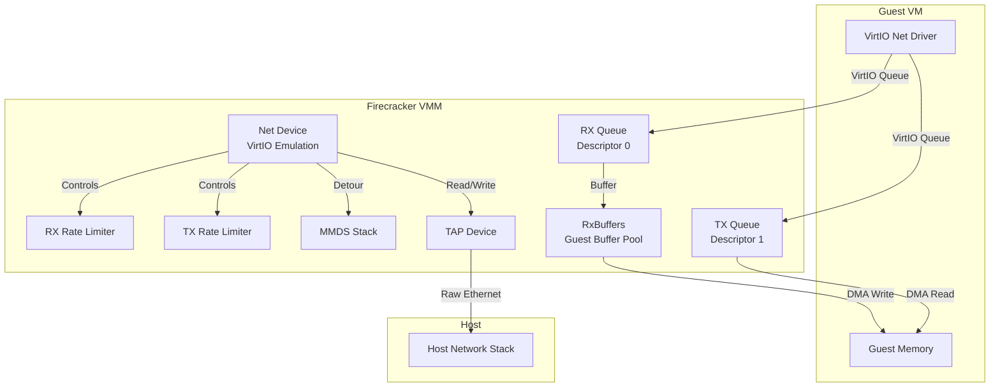
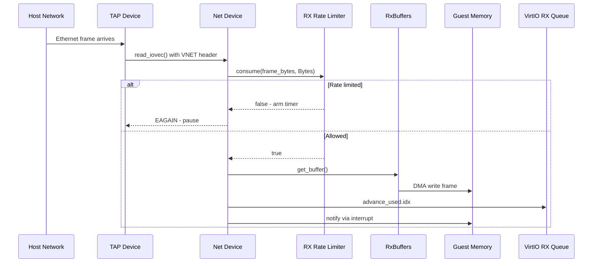
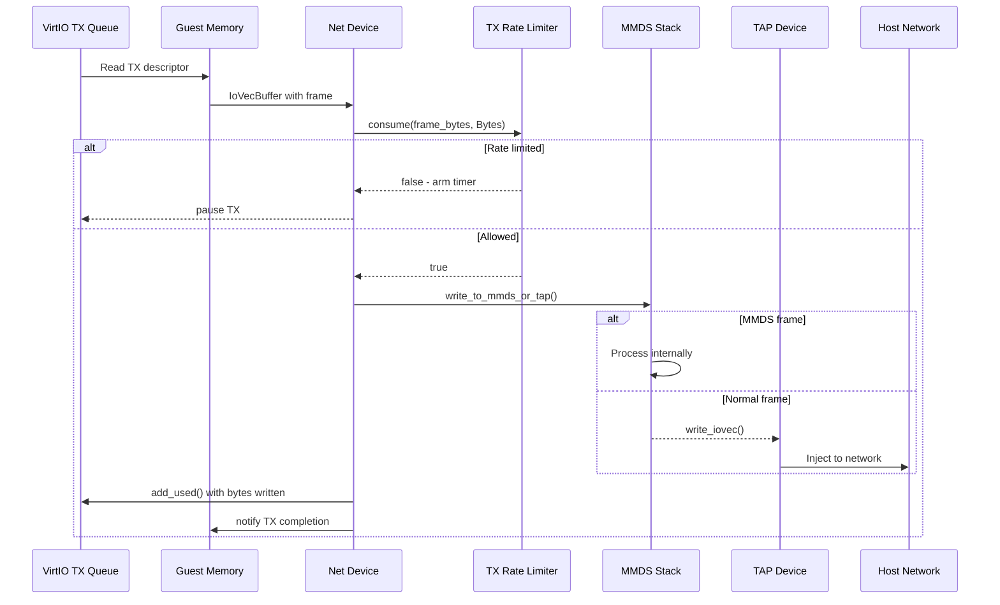

# Firecracker Networking Deep Dive

## Overview

Firecracker's networking implementation provides lightweight, secure network connectivity for microVMs using VirtIO net devices backed by TAP interfaces. The networking stack is designed with the same security-first principles as the rest of Firecracker, employing seccomp filtering, rate limiting, and MAC address spoofing detection.



## Architecture

The networking stack consists of several key components:

| Component | File | Purpose |
|-----------|------|---------|
| VirtIO Net Device | `device.rs` (~2400 lines) | VirtIO device emulation, queue processing |
| TAP Backend | `tap.rs` (~350 lines) | Linux TAP/TUN device interface |
| Rate Limiter | `rate_limiter/mod.rs` (~1200 lines) | Token bucket bandwidth/ops limiting |
| Event Handler | `event_handler.rs` (~170 lines) | Epoll integration, event subscription |
| Metrics | `metrics.rs` (~450 lines) | Per-device and aggregate statistics |
| Configuration | `vmm_config/net.rs` (~360 lines) | API configuration interface |

## 1. VirtIO Net Device

### Device Structure

```rust
// vmm/src/devices/virtio/net/device.rs
pub struct Net {
    // Device state
    activate_event: EventFd,
    device_state: DeviceState,
    guest_memory: Option<GuestMemoryMmap>,

    // VirtIO infrastructure
    queues: [Queue; NUM_QUEUES],  // 2 queues: RX (0), TX (1)
    queue_events: [EventFd; NUM_QUEUES],
    interrupt_evt: EventFd,
    interrupt_status: Arc<AtomicUsize>,

    // Backend
    tap: Tap,

    // Rate limiters
    rx_rate_limiter: RateLimiter,
    tx_rate_limiter: RateLimiter,

    // RX buffer management
    rx_buffers: RxBuffers,

    // Configuration space
    config_space: VirtioNetConfig,

    // Device ID
    iface_id: String,
}
```

### VirtIO Feature Set

The network device exposes the following VirtIO features:

```rust
const AVAIL_FEATURES: u64 = 1 << VIRTIO_NET_F_GUEST_CSUM        // Guest checksum offload
    | 1 << VIRTIO_NET_F_CSUM                                   // Host checksum offload
    | 1 << VIRTIO_NET_F_GUEST_TSO4                             // Guest TSO IPv4
    | 1 << VIRTIO_NET_F_GUEST_TSO6                             // Guest TSO IPv6
    | 1 << VIRTIO_NET_F_GUEST_UFO                              // Guest UFO
    | 1 << VIRTIO_NET_F_HOST_TSO4                              // Host TSO IPv4
    | 1 << VIRTIO_NET_F_HOST_TSO6                              // Host TSO IPv6
    | 1 << VIRTIO_NET_F_HOST_UFO                               // Host UFO
    | 1 << VIRTIO_NET_F_MRG_RXBUF                              // Mergeable receive buffers
    | 1 << VIRTIO_NET_F_GSO                                    // Generic segmentation offload
    | 1 << VIRTIO_NET_F_GUEST_ANNOUNCE                         // Guest can send announce
    | 1 << VIRTIO_NET_F_MAC                                    // MAC address in config space
    | 1 << VIRTIO_F_RING_EVENT_IDX                             // Event index optimization
    | 1 << VIRTIO_F_VERSION_1                                  // VirtIO 1.0 compliant
    | 1 << VIRTIO_F_ACCESS_PLATFORM;                           // IOMMU support
```

### Configuration Space

```rust
#[derive(PackedCopy, PackedClone)]
#[repr(C)]
pub struct VirtioNetConfig {
    pub mac: [u8; ETH_ALEN],           // Guest MAC address
    pub status: le16,                   // Link status
    pub max_virtqueue_pairs: le16,      // Max TX/RX queue pairs
    pub mtu: le16,                      // MTU (if negotiated)
}
```

## 2. TAP Device Backend

### Opening TAP Device

The TAP device provides the bridge between the virtual network and the host network stack:

```rust
// vmm/src/devices/virtio/net/tap.rs
pub struct Tap {
    fd: RawFd,
    if_name: String,
    index: u32,
}

impl Tap {
    pub fn open_named(if_name: &str) -> Result<Tap, TapError> {
        // Open /dev/net/tun
        let fd = unsafe {
            libc::open(
                c"/dev/net/tun".as_ptr(),
                libc::O_RDWR | libc::O_NONBLOCK | libc::O_CLOEXEC,
            )
        };
        if fd < 0 {
            return Err(TapError::OpenIoError);
        }

        let mut ifreq = IfReqBuilder::new().if_name(if_name);

        // Configure with TUNSETIFF ioctl
        let fd = ifreq
            .with_flags(
                (libc::IFF_TAP | libc::IFF_NO_PI | libc::IFF_VNET_HDR) as i16,
            )
            .execute(fd, TUNSETIFF())?;

        // Configure VNET header size
        ifreq.execute(fd, TUNSETVNETHDRSZ(vnet_hdr_size()))?;

        // Configure offload features
        Self::set_offload(fd, Self::tap_offload_features())?;

        // Get interface index for /sys/class/net
        let index = ifreq
            .get_interface_index()
            .map_err(TapError::IfaceRead)?;

        Ok(Tap { fd, if_name, index })
    }

    fn tap_offload_features() -> u32 {
        libc::TUN_F_CSUM | libc::TUN_F_TSO4 | libc::TUN_F_TSO6
            | libc::TUN_F_UFO | libc::TUN_F_TSO_ECN
    }
}
```

### I/O Operations

TAP I/O uses scatter-gather operations with `writev`/`readv`:

```rust
impl Tap {
    pub fn write_iovec(&self, iov: &[libc::iovec]) -> Result<usize, std::io::Error> {
        let ret = unsafe { libc::writev(self.fd, iov.as_ptr(), iov.len() as libc::c_int) };
        if ret < 0 {
            Err(std::io::Error::last_os_error())
        } else {
            Ok(ret as usize)
        }
    }

    pub fn read_iovec(&self, iov: &mut [libc::iovec]) -> Result<usize, std::io::Error> {
        let ret = unsafe { libc::readv(self.fd, iov.as_ptr(), iov.len() as libc::c_int) };
        if ret < 0 {
            Err(std::io::Error::last_os_error())
        } else {
            Ok(ret as usize)
        }
    }
}
```

### VNET Header

The VNET header provides metadata about network frames:

```rust
// Size calculation
pub const VNET_HDR_SIZE: usize = size_of::<virtio_net_hdr_v1>();

#[repr(C)]
pub struct virtio_net_hdr_v1 {
    pub flags: u8,           // VIRTIO_NET_HDR_F_*
    pub gso_type: u8,        // VIRTIO_NET_HDR_GSO_*
    pub hdr_len: le16,       // Header length
    pub gso_size: le16,      // GSO segment size
    pub csum_start: le16,    // Checksum start offset
    pub csum_offset: le16,   // Checksum offset
}
```

## 3. Rate Limiter

### Token Bucket Algorithm

The rate limiter uses a dual-bucket token system for bandwidth and operations:

```rust
// vmm/src/rate_limiter/mod.rs
pub struct RateLimiter {
    bandwidth: TokenBucket,    // Bytes per second
    ops: TokenBucket,          // Operations per second
    token_type: TokenType,     // Which bucket to use first
    timer_active: bool,
    timer_fd: TimerFd,
}

pub struct TokenBucket {
    tokens: u64,
    cap: u64,
    refill_time: u64,          // Milliseconds for full refill
    last_refill: u64,          // Timestamp in ms
}
```

### Token Consumption

```rust
impl RateLimiter {
    pub fn consume(&mut self, tokens: u64, token_type: TokenType) -> bool {
        // If timer is active, rate limit is in effect - reject immediately
        if self.timer_active {
            return false;
        }

        let (long_term_bucket, short_term_bucket) = match token_type {
            TokenType::Bytes => (&mut self.bandwidth, &mut self.ops),
            TokenType::Ops => (&mut self.ops, &mut self.bandwidth),
        };

        // Try primary bucket first
        match long_term_bucket.reduce(tokens) {
            BucketReduction::Failure => {
                self.activate_timer(TIMER_REFILL_STATE);
                return false;
            }
            BucketReduction::OverConsumption(ratio) => {
                // Over-consumed: set timer for (ratio * refill_time)
                self.arm_timer(ratio * long_term_bucket.refill_time);
                return true;
            }
            BucketReduction::Success => {}
        }

        // Try secondary bucket
        match short_term_bucket.reduce(1) {
            BucketReduction::Failure => {
                self.activate_timer(TIMER_REFILL_STATE);
                return false;
            }
            BucketReduction::OverConsumption(ratio) => {
                self.arm_timer(ratio * short_term_bucket.refill_time);
            }
            BucketReduction::Success => {}
        }

        true
    }
}

impl TokenBucket {
    fn reduce(&mut self, tokens: u64) -> BucketReduction {
        if self.tokens >= tokens {
            self.tokens -= tokens;
            BucketReduction::Success
        } else {
            let tokens_missing = tokens - self.tokens;
            let ratio = tokens_missing as f64 / self.cap as f64;
            BucketReduction::OverConsumption(ratio)
        }
    }

    fn auto_replenish(&mut self) {
        // Calculate elapsed time and add tokens
        let elapsed_ms = current_time_ms() - self.last_refill;
        let tokens_to_add = (elapsed_ms * self.cap / self.refill_time) as u64;
        self.tokens = min(self.tokens + tokens_to_add, self.cap);
        self.last_refill = current_time_ms();
    }
}
```

### Timer-Based Replenishment

When rate limited, a timer is armed for active replenishment:

```rust
fn activate_timer(&mut self, state: TimerState) {
    self.timer_active = true;
    self.timer_state = state;

    // Calculate interval based on which bucket needs replenishment
    let interval = match state {
        TIMER_REFILL_STATE => {
            if self.bandwidth.tokens == 0 {
                self.bandwidth.refill_time
            } else {
                self.ops.refill_time
            }
        }
    };

    // Set TimerFd with 100ms base interval
    let timer_spec = itimerspec {
        it_interval: timespec_from_ms(REFILL_TIMER_INTERVAL_MS),
        it_value: timespec_from_ms(interval),
    };
    unsafe { timerfd_settime(self.timer_fd.as_raw_fd(), 0, &timer_spec, null_mut()) };
}
```

## 4. RX/TX Data Flow

### RX Path (Network → Guest)



### RX Implementation

```rust
impl Net {
    pub fn process_rx(&mut self) -> Result<(), DeviceError> {
        loop {
            match self.read_from_mmds_or_tap() {
                Ok(Some(bytes_read)) => {
                    // Rate limit check - stops processing on Failure
                    if !self.rate_limited_rx_single_frame(bytes_read) {
                        break;
                    }
                }
                Err(NetError::IO(err)) if err.raw_os_error() == Some(EAGAIN) => {
                    // TAP has no more data
                    break;
                }
                _ => break,
            }
        }

        // Signal queue if we have pending RX
        self.try_signal_queue(NetQueue::Rx);
        Ok(())
    }

    fn rate_limited_rx_single_frame(&mut self, frame_len: usize) -> bool {
        // Consume from rate limiter
        if !self.rx_rate_limiter.consume(frame_len as u64, TokenType::Bytes) {
            return false;
        }
        if !self.rx_rate_limiter.consume(1, TokenType::Ops) {
            return false;
        }
        true
    }
}
```

### RxBuffers Management

The `RxBuffers` struct manages guest-provided receive buffers:

```rust
pub struct RxBuffers {
    /// Map from VirtIO descriptor index to buffer
    buffers: BTreeMap<u16, IoVecBufferMut>,
    /// Total bytes available across all buffers
    total_len: usize,
}

impl RxBuffers {
    pub fn get_buffer(&mut self, desc_idx: u16) -> Option<&mut IoVecBufferMut> {
        self.buffers.get_mut(&desc_idx)
    }

    pub fn replenish(&mut self, queue: &mut Queue, guest_memory: &GuestMemoryMmap) {
        // Walk available descriptors from guest
        while let Some(head) = queue.pop(guest_memory) {
            // Create IoVecBuffer from descriptor chain
            let iov_buf = IoVecBufferMut::from_descriptor_chain(
                head,
                queue,
                guest_memory,
            );
            self.buffers.insert(head.index, iov_buf);
        }
    }
}
```

### TX Path (Guest → Network)



### TX Implementation

```rust
impl Net {
    pub fn process_tx(&mut self) -> Result<(), DeviceError> {
        loop {
            // Get next TX descriptor chain from guest
            match self.tx_buffers.get_buffer() {
                Some(iov_buf) => {
                    let frame_len = iov_buf.len();

                    // Rate limit check
                    if !self.rate_limited_tx_single_frame(frame_len) {
                        break;
                    }

                    // Write to MMDS or TAP
                    match self.write_to_mmds_or_tap(iov_buf) {
                        Ok(_) => {
                            self.tx_buffers.mark_used(frame_len as u32);
                        }
                        Err(_) => break,
                    }
                }
                None => break,
            }
        }

        self.try_signal_queue(NetQueue::Tx);
        Ok(())
    }
}
```

### MMDS Detour

The Metadata Service (MMDS) intercepts specific network frames:

```rust
fn write_to_mmds_or_tap(
    &mut self,
    iov_buf: &mut IoVecBufferMut,
) -> Result<usize, NetError> {
    // Check if frame is destined for MMDS (ARP for 169.254.169.254)
    if self.mmds_ns.detour_frame(iov_buf) {
        // MMDS processed internally, no TAP write needed
        return Ok(iov_buf.len());
    }

    // Normal frame - write to TAP
    let written = self.tap.write_iovec(iov_buf.as_iovec_mut())?;
    Ok(written)
}
```

## 5. Event Handling

### Event Types

```rust
#[derive(Debug)]
pub enum NetEvent {
    PROCESS_VIRTQ_RX,      // RX queue has new descriptors
    PROCESS_VIRTQ_TX,      // TX queue has new descriptors
    PROCESS_TAP_RX,        // TAP has incoming data
    PROCESS_RX_RATE_LIMITER,  // RX rate limiter timer expired
    PROCESS_TX_RATE_LIMITER,  // TX rate limiter timer expired
}
```

### Event Subscription

```rust
impl MutEventSubscriber for Net {
    fn init(&mut self, ops: &mut EventOps) -> Result<(), DeviceError> {
        // Register activate event (for device activation)
        ops.add(Events::new(&self.activate_event, EventSet::IN))?;
        Ok(())
    }

    fn activate(&mut self, ops: &mut EventOps) -> Result<(), DeviceError> {
        // Register runtime events after activation
        ops.add(Events::new(&self.tap, EventSet::IN | EventSet::EDGE_TRIGGERED))?;
        ops.add(Events::new(&self.rx_rate_limiter.timer_fd(), EventSet::IN))?;
        ops.add(Events::new(&self.tx_rate_limiter.timer_fd(), EventSet::IN))?;
        Ok(())
    }

    fn process(&mut self, event: Events, ops: &mut EventOps) {
        let source = event.fd();

        match source {
            s if s == self.tap.as_raw_fd() => {
                // TAP RX event - edge triggered
                self.process_rx();
            }
            s if s == self.rx_rate_limiter.timer_fd().as_raw_fd() => {
                // RX rate limiter replenishment
                self.rx_rate_limiter.timer_expired();
                self.process_rx();
            }
            s if s == self.tx_rate_limiter.timer_fd().as_raw_fd() => {
                // TX rate limiter replenishment
                self.tx_rate_limiter.timer_expired();
                self.process_tx();
            }
            _ => {}
        }
    }
}
```

### Edge-Triggered TAP

TAP uses edge-triggered epoll for efficiency:

```rust
// In event_handler.rs
ops.add(Events::new(&self.tap, EventSet::IN | EventSet::EDGE_TRIGGERED))?;
```

This means:
- Event fires ONCE when data arrives
- Must read ALL available data before returning
- `EAGAIN` indicates buffer is empty
- More efficient than level-triggered for high-throughput

## 6. Metrics

### Per-Device Metrics

```rust
// vmm/src/devices/virtio/net/metrics.rs
pub struct NetDeviceMetrics {
    pub activate_fails: SharedIncMetric,
    pub cfg_fails: SharedIncMetric,
    pub no_rx_avail_buffer: SharedIncMetric,
    pub rx_queue_read_err: SharedIncMetric,
    pub tx_queue_read_err: SharedIncMetric,
    pub rx_bytes_count: SharedIncMetric,
    tx_packets_count: SharedIncMetric,
    pub rx_packets_count: SharedIncMetric,
    pub rx_rate_limiter_throttled: SharedIncMetric,
    pub tx_rate_limiter_throttled: SharedIncMetric,
    pub tap_read_fails: SharedIncMetric,
    pub tap_write_fails: SharedIncMetric,
    pub rx_partial_writes: SharedIncMetric,
    pub tx_partial_writes: SharedIncMetric,
    pub rx_mergeable_buf_errors: SharedIncMetric,
    pub event_fails: SharedIncMetric,
    pub spoofed_mac_count: SharedIncMetric,
}
```

### Metrics Aggregation

```rust
// Metrics are tracked per-device by iface_id
let device_metrics: BTreeMap<String, NetDeviceMetrics> = BTreeMap::new();

// Aggregate "net" metrics are computed at flush time
pub fn flush_metrics(&mut self) {
    for (iface_id, metrics) in &self.device_metrics {
        METRICS.net_devices.insert(iface_id.clone(), metrics);
    }

    // Compute aggregate
    let aggregate = compute_aggregate(&self.device_metrics);
    METRICS.net.update(aggregate);
}
```

## 7. Configuration API

### Network Interface Configuration

```rust
// vmm/src/vmm_config/net.rs
#[derive(Debug, Clone, Serialize, Deserialize)]
pub struct NetworkInterfaceConfig {
    pub iface_id: String,           // Unique identifier
    pub host_dev_name: String,      // TAP device name (e.g., "tap0")
    pub guest_mac: Option<String>,  // Guest MAC address (optional)
    pub rx_rate_limiter: Option<RateLimiterConfig>,
    pub tx_rate_limiter: Option<RateLimiterConfig>,
}

#[derive(Debug, Clone, Serialize, Deserialize)]
pub struct RateLimiterConfig {
    pub bandwidth: Option<TokenBucketConfig>,
    pub ops: Option<TokenBucketConfig>,
}

#[derive(Debug, Clone, Serialize, Deserialize)]
pub struct TokenBucketConfig {
    pub size: u64,           // Bucket capacity
    pub refill_time: u64,    // Milliseconds for full refill
    pub one_time_burst: Option<u64>,
}
```

### MAC Address Spoofing Detection

```rust
fn check_mac_spoofing(&self, frame: &[u8]) -> bool {
    // Extract source MAC from Ethernet frame
    let src_mac = &frame[6..12];

    // Compare with configured guest MAC
    if let Some(ref guest_mac) = self.config_space.mac {
        if src_mac != guest_mac {
            METRICS.spoofed_mac_count.inc();
            return true;  // Spoofed - drop frame
        }
    }
    false
}
```

## 8. CNI Integration (firecracker-go-sdk)

### CNI Configuration

The Go SDK provides CNI support for container networking:

```go
// firecracker-go-sdk/cni/cni.go
type CNIConfiguration struct {
    NetworkName string                 // CNI network name
    IfName      string                 // Interface name in container
    Args        [][2]string            // CNI_ARGS
    ConfDir     string                 // /etc/cni/net.d
    BinDir      string                 // /opt/cni/bin
}

func (c *CNIConfiguration) Setup(ctx context.Context, containerID string) (*cnitypes.Result, error) {
    // Execute CNI ADD command
    result, err := cniConfig.AddNetworkList(
        ctx,
        netConf,
        &cnitypes.CmdArgs{
            ContainerID: containerID,
            Netns:       netnsPath,
            IfName:      c.IfName,
            Args:        c.Args,
        },
    )

    // Create veth pair from CNI result
    return result, nil
}
```

### Network Interface Creation

```go
// firecracker-go-sdk/machine.go
func (m *Machine) createNetworkInterfaces(ctx context.Context, ifaces ...NetworkInterface) error {
    for i, iface := range ifaces {
        if iface.CNIConfiguration != nil {
            // CNI-configured interface
            cniResult, err := iface.CNIConfiguration.Setup(ctx, m.id)
            if err != nil {
                return err
            }

            // Extract Veth interface name
            hostDevName := extractVethName(cniResult)

            // Configure Firecracker network interface
            fcIface := models.NetworkInterface{
                IfaceID:           aws.String(fmt.Sprintf("eth%d", i)),
                HostDevName:       aws.String(hostDevName),
                GuestMac:          aws.String(guestMac),
                RxRateLimiter:     iface.RateLimiter,
                TxRateLimiter:     iface.RateLimiter,
            }

            // Put via API
            _, err = m.client.PutNetworkInterface(
                ctx,
                models.PutNetworkInterfaceParams{
                    IfaceID:           fcIface.IfaceID,
                    NetworkInterface:  fcIface,
                },
            )
        }
    }
    return nil
}
```

## 9. Security Considerations

### Seccomp Integration

Network device syscalls are filtered per-thread:

```json
{
  "vmm": {
    "filter": [
      {"syscall": "read", "args": []},
      {"syscall": "write", "args": []},
      {"syscall": "writev", "args": []},
      {"syscall": "readv", "args": []},
      {"syscall": "ioctl", "args": [{"index": 1, "type": "DQM64", "value": 0x400454CA"}]},  // TUNSETIFF
      {"syscall": "socket", "args": []},
      {"syscall": "bind", "args": []},
      {"syscall": "accept", "args": []}
    ]
  }
}
```

### Attack Surface Reduction

1. **Minimal device model** - Only VirtIO net, no legacy PCI devices
2. **Rate limiting** - Prevents bandwidth/ops abuse
3. **MAC spoofing detection** - Prevents identity impersonation
4. **MMDS isolation** - Metadata service traffic never reaches TAP
5. **No promiscuous mode** - Guest only sees its own traffic

## 10. Performance Characteristics

### Throughput

- **Single queue**: ~10 Gbps with large packets
- **Multi-queue** (future): Linear scaling with vCPUs
- **Overhead**: ~5-10% vs bare metal for TCP throughput

### Latency

- **RTT**: ~10-20μs guest-to-guest on same host
- **Interrupt coalescing**: Configurable via `VIRTIO_NET_F_NOTF_COAL`

### Memory Efficiency

- **VMM footprint**: ~30MB resident memory
- **Per-device overhead**: ~100KB for queue buffers
- **Mergeable buffers**: Reduces descriptor overhead by 10x

## 11. Known Limitations

1. **Single queue pair** - Limits parallelism on multi-vCPU VMs
2. **No vhost-user** - External backend support limited
3. **TAP required** - Cannot use macvtap or other backends directly
4. **Offload limitations** - Some TSO/UFO features depend on host kernel

## 12. Future Directions

1. **Multi-queue support** - Parallel RX/TX queues for multi-vCPU
2. **vhost-user backend** - External process for device emulation
3. **AF_XDP backend** - Direct XDP socket for lower latency
4. **Interrupt coalescing** - Configurable moderation for CPU efficiency

## Key Insights

1. **Token bucket design** - Dual-bucket (bandwidth + ops) prevents both bandwidth floods and packet-rate attacks
2. **Edge-triggered epoll** - Critical for high-throughput TAP handling without spurious wakeups
3. **MMDS detour** - Clean separation of metadata traffic from guest network
4. **RxBuffers pool** - Pre-allocated guest buffers eliminate allocation in RX hot path
5. **Rate limiter timer** - Active replenishment prevents permanent starvation after burst
6. **VNET header** - Enables checksum offload and GSO without hypervisor parsing

Sources:
- [Firecracker VirtIO Net Device](https://github.com/firecracker-microvm/firecracker/blob/main/src/vmm/src/devices/virtio/net/device.rs)
- [Firecracker TAP Backend](https://github.com/firecracker-microvm/firecracker/blob/main/src/vmm/src/devices/virtio/net/tap.rs)
- [Firecracker Rate Limiter](https://github.com/firecracker-microvm/firecracker/blob/main/src/vmm/src/rate_limiter/mod.rs)
- [Firecracker Go SDK CNI](https://github.com/firecracker-microvm/firecracker-go-sdk/blob/main/cni/cni.go)
