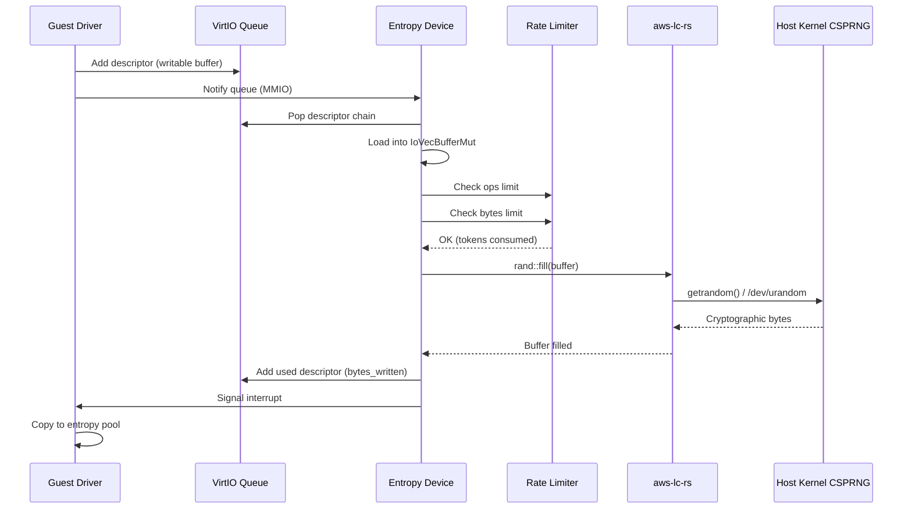

# Firecracker VirtIO RNG Device Deep Dive

## Overview

Firecracker's VirtIO RNG (Random Number Generator) device provides cryptographically secure random entropy to guest VMs. The implementation is minimal and focused, exposing host entropy through a single VirtIO queue with rate limiting support.

The RNG device is essential for guest operations that require randomness, including:
- Cryptographic key generation
- SSL/TLS session establishment
- Password salting
- Security token generation
- Guest kernel entropy pool initialization

```mermaid
graph TB
    subgraph Guest VM
        KERNEL[Guest Kernel]
        HWRNG[VirtIO RNG Driver]
        POOL[/dev/random<br/>/dev/urandom]
    end

    subgraph Firecracker VMM
        VIRTQ[VirtIO Queue]
        RATE[Rate Limiter]
        ENTROPY[Entropy Device]
    end

    subgraph Host
        AWS_LC[aws-lc-rs<br/>Cryptographic Library]
        HOST_RNG[/dev/urandom<br/>Host entropy]
    end

    KERNEL --> HWRNG
    HWRNG -- MMIO Notify --> VIRTQ
    VIRTQ --> ENTROPY
    ENTROPY --> RATE
    ENTROPY --> AWS_LC
    AWS_LC --> HOST_RNG
    POOL -.entropy.- HWRNG
```

## 1. Device Architecture

### Entropy Device Structure

```rust
// src/vmm/src/devices/virtio/rng/device.rs
pub struct Entropy {
    // VirtIO fields
    avail_features: u64,
    acked_features: u64,
    activate_event: EventFd,

    // Transport fields
    device_state: DeviceState,
    pub(crate) queues: Vec<Queue>,
    queue_events: Vec<EventFd>,
    irq_trigger: IrqTrigger,

    // Device specific fields
    rate_limiter: RateLimiter,
    buffer: IoVecBufferMut,  // Reusable I/O vector buffer
}

// Queue configuration
pub(crate) const RNG_NUM_QUEUES: usize = 1;
pub(crate) const RNG_QUEUE: usize = 0;
```

### Key Design Decisions

1. **Single Queue Design**: Unlike balloon (3 queues) or other complex devices, RNG uses a single queue for all entropy requests
2. **No Config Space**: The device has no configuration space - guests simply request entropy
3. **No Feature Negotiation**: Only `VIRTIO_F_VERSION_1` is advertised, no optional features
4. **Reusable Buffer**: A single `IoVecBufferMut` is reused for all requests to avoid allocations

## 2. VirtIO RNG Specification

### Feature Bits

```rust
// src/vmm/src/devices/virtio/rng/device.rs
impl Entropy {
    pub fn new(rate_limiter: RateLimiter) -> Result<Self, EntropyError> {
        // ...
        Ok(Self {
            avail_features: 1 << VIRTIO_F_VERSION_1,
            acked_features: 0u64,
            // ...
        })
    }
}
```

| Feature | Bit | Description |
|---------|-----|-------------|
| `VIRTIO_F_VERSION_1` | 32 | VirtIO 1.0 compliance (mandatory) |

Notably absent compared to other VirtIO devices:
- No `VIRTIO_RING_F_EVENT_IDX` (notification suppression)
- No device-specific feature bits
- No config space access

### Device Type ID

```rust
// src/vmm/src/devices/virtio/mod.rs
pub const TYPE_RNG: u32 = 4;  // VirtIO RNG device type

impl VirtioDevice for Entropy {
    fn device_type(&self) -> u32 {
        TYPE_RNG
    }
}
```

## 3. Entropy Request Flow

### Guest Request Pattern

The guest driver follows a simple pattern:

1. Allocate a writable buffer in guest memory
2. Create a descriptor chain pointing to the buffer
3. Add descriptor to the virtqueue
4. Notify the device via MMIO write
5. Wait for interrupt signaling completion
6. Read entropy bytes from the buffer

```rust
// Host-side processing
impl Entropy {
    fn process_entropy_queue(&mut self) -> Result<(), InvalidAvailIdx> {
        let mut used_any = false;

        while let Some(desc) = self.queues[RNG_QUEUE].pop()? {
            let mem = self.device_state.mem().unwrap();
            let index = desc.index;
            METRICS.entropy_event_count.inc();

            // Load descriptor chain into reusable buffer
            let bytes = match unsafe { self.buffer.load_descriptor_chain(mem, desc) } {
                Ok(()) => {
                    debug!(
                        "entropy: guest request for {} bytes of entropy",
                        self.buffer.len()
                    );

                    // Check rate limiting
                    if !self.rate_limit_request(u64::from(self.buffer.len())) {
                        debug!("entropy: throttling entropy queue");
                        METRICS.entropy_rate_limiter_throttled.inc();
                        self.queues[RNG_QUEUE].undo_pop();
                        break;
                    }

                    // Generate entropy
                    self.handle_one().unwrap_or_else(|err| {
                        error!("entropy: {err}");
                        METRICS.entropy_event_fails.inc();
                        0
                    })
                }
                Err(err) => {
                    error!("entropy: Could not parse descriptor chain: {err}");
                    METRICS.entropy_event_fails.inc();
                    0
                }
            };

            // Mark descriptor as used
            match self.queues[RNG_QUEUE].add_used(index, bytes) {
                Ok(_) => {
                    used_any = true;
                    METRICS.entropy_bytes.add(bytes.into());
                }
                Err(err) => {
                    error!("entropy: Could not add used descriptor to queue: {err}");
                    Self::rate_limit_replenish_request(&mut self.rate_limiter, bytes.into());
                    METRICS.entropy_event_fails.inc();
                    break;
                }
            }
        }

        self.queues[RNG_QUEUE].advance_used_ring_idx();

        if used_any {
            self.signal_used_queue().unwrap_or_else(|err| {
                error!("entropy: {err:?}");
                METRICS.entropy_event_fails.inc()
            });
        }

        Ok(())
    }
}
```

### Entropy Generation

```rust
impl Entropy {
    fn handle_one(&mut self) -> Result<u32, EntropyError> {
        // Empty buffer check
        if self.buffer.is_empty() {
            return Ok(0);
        }

        // Allocate temporary buffer for random bytes
        let mut rand_bytes = vec![0; self.buffer.len() as usize];

        // Fill with cryptographic randomness using aws-lc-rs
        rand::fill(&mut rand_bytes).inspect_err(|_| {
            METRICS.host_rng_fails.inc();
        })?;

        // Write entropy to guest buffer
        self.buffer.write_all_volatile_at(&rand_bytes, 0).unwrap();
        Ok(self.buffer.len())
    }
}
```

### Cryptographic Backend

Firecracker uses **aws-lc-rs** (AWS Library Cryptography - Rust) for entropy generation:

```rust
use aws_lc_rs::rand;

// Fill buffer with cryptographically secure random bytes
rand::fill(&mut rand_bytes)?;
```

**aws-lc-rs** is a Rust wrapper around AWS-LC (AWS' fork of BoringSSL/OpenSSL), which:
- Uses host kernel's CSPRNG (`getrandom()` syscall or `/dev/urandom`)
- Provides FIPS 140-2 compliance when needed
- Is maintained and audited by AWS security teams

## 4. Rate Limiting

### Rate Limiter Configuration

```rust
impl Entropy {
    fn rate_limit_request(&mut self, bytes: u64) -> bool {
        // Check operations limit
        if !self.rate_limiter.consume(1, TokenType::Ops) {
            return false;
        }

        // Check bandwidth (bytes) limit
        if !self.rate_limiter.consume(bytes, TokenType::Bytes) {
            // Replenish ops token since bytes failed
            self.rate_limiter.manual_replenish(1, TokenType::Ops);
            return false;
        }

        true
    }
}
```

The rate limiter uses a dual token bucket approach:
- **Ops bucket**: Limits number of entropy requests per second
- **Bytes bucket**: Limits total entropy bytes per second

### Rate Limiter Event Handling

```rust
impl Entropy {
    pub(crate) fn process_rate_limiter_event(&mut self) {
        METRICS.rate_limiter_event_count.inc();
        match self.rate_limiter.event_handler() {
            Ok(_) => {
                // Tokens replenished, process pending requests
                self.process_entropy_queue().unwrap()
            }
            Err(err) => {
                error!("entropy: Failed to handle rate-limiter event: {err:?}");
                METRICS.entropy_event_fails.inc();
            }
        }
    }
}
```

### Example Configuration

```rust
// 4000 bytes/second, no burst, 1 second refill
let rate_limiter = RateLimiter::new(
    4000,  // bytes
    0,     // burst bytes
    1000,  // refill ms
    0,     // ops
    0,     // burst ops
    100    // refill ms
)?;
```

## 5. Event Handler Integration

### Event Registration

```rust
impl Entropy {
    const PROCESS_ACTIVATE: u32 = 0;
    const PROCESS_ENTROPY_QUEUE: u32 = 1;
    const PROCESS_RATE_LIMITER: u32 = 2;

    fn register_runtime_events(&self, ops: &mut EventOps) {
        // Queue event
        ops.add(Events::with_data(
            &self.queue_events()[RNG_QUEUE],
            Self::PROCESS_ENTROPY_QUEUE,
            EventSet::IN,
        )?;

        // Rate limiter timer event
        ops.add(Events::with_data(
            self.rate_limiter(),
            Self::PROCESS_RATE_LIMITER,
            EventSet::IN,
        )?;
    }

    fn register_activate_event(&self, ops: &mut EventOps) {
        ops.add(Events::with_data(
            self.activate_event(),
            Self::PROCESS_ACTIVATE,
            EventSet::IN,
        )?;
    }
}
```

### Event Processing

```rust
impl MutEventSubscriber for Entropy {
    fn process(&mut self, events: Events, ops: &mut EventOps) {
        let event_set = events.event_set();
        let source = events.data();

        if !event_set.contains(EventSet::IN) {
            warn!("entropy: Received unknown event: {event_set:?}");
            return;
        }

        if !self.is_activated() {
            warn!("entropy: Device not activated. Spurious event: {source}");
            return;
        }

        match source {
            Self::PROCESS_ACTIVATE => self.process_activate_event(ops),
            Self::PROCESS_ENTROPY_QUEUE => self.process_entropy_queue_event(),
            Self::PROCESS_RATE_LIMITER => self.process_rate_limiter_event(),
            _ => warn!("entropy: Unknown event: {source}"),
        }
    }
}
```

## 6. Device Activation

### Activation Flow

```rust
impl VirtioDevice for Entropy {
    fn activate(&mut self, mem: GuestMemoryMmap) -> Result<(), ActivateError> {
        // Initialize all queues with guest memory
        for q in self.queues.iter_mut() {
            q.initialize(&mem)
                .map_err(ActivateError::QueueMemoryError)?;
        }

        // Signal activation
        self.activate_event.write(1).map_err(|_| {
            METRICS.activate_fails.inc();
            ActivateError::EventFd
        })?;

        self.device_state = DeviceState::Activated(mem);
        Ok(())
    }
}
```

### Activate Event Handler

```rust
impl Entropy {
    fn process_activate_event(&self, ops: &mut EventOps) {
        // Consume the activate event
        if let Err(err) = self.activate_event().read() {
            error!("entropy: Failed to consume activate event: {err}");
        }

        // Register runtime events (queue + rate limiter)
        self.register_runtime_events(ops);

        // Remove activate event from monitoring
        ops.remove(Events::with_data(
            self.activate_event(),
            Self::PROCESS_ACTIVATE,
            EventSet::IN,
        ))?;
    }
}
```

## 7. Error Handling

### EntropyError Types

```rust
#[derive(Debug, thiserror::Error, displaydoc::Display)]
pub enum EntropyError {
    /// Error while handling an Event file descriptor: {0}
    EventFd(#[from] io::Error),

    /// Bad guest memory buffer: {0}
    GuestMemory(#[from] GuestMemoryError),

    /// Could not get random bytes: {0}
    Random(#[from] aws_lc_rs::error::Unspecified),

    /// Underlying IovDeque error: {0}
    IovDeque(#[from] IovDequeError),
}
```

### Error Recovery

The device handles errors gracefully:
- **EventFd errors**: Logged, metric incremented, continue processing
- **GuestMemory errors**: Logged, metric incremented, return 0 bytes
- **Random generation errors**: Logged, metric incremented, return 0 bytes
- **Rate limiter errors**: Logged, tokens replenished, request re-queued

## 8. Metrics

### Entropy Device Metrics

```rust
// src/vmm/src/devices/virtio/rng/metrics.rs
pub(super) static METRICS: EntropyDeviceMetrics = EntropyDeviceMetrics::new();

pub(super) struct EntropyDeviceMetrics {
    /// Number of device activation failures
    pub activate_fails: SharedIncMetric,

    /// Number of entropy queue event handling failures
    pub entropy_event_fails: SharedIncMetric,

    /// Number of entropy requests handled
    pub entropy_event_count: SharedIncMetric,

    /// Number of entropy bytes provided to guest
    pub entropy_bytes: SharedIncMetric,

    /// Number of errors while getting random bytes on host
    pub host_rng_fails: SharedIncMetric,

    /// Number of times an entropy request was rate limited
    pub entropy_rate_limiter_throttled: SharedIncMetric,

    /// Number of events associated with the rate limiter
    pub rate_limiter_event_count: SharedIncMetric,
}
```

### JSON Output Format

```json
{
  "entropy": {
    "activate_fails": 0,
    "entropy_event_fails": 0,
    "entropy_event_count": 150,
    "entropy_bytes": 65536,
    "host_rng_fails": 0,
    "entropy_rate_limiter_throttled": 12,
    "rate_limiter_event_count": 8
  }
}
```

## 9. Config Space (None)

Unlike other VirtIO devices, the RNG device has **no configuration space**:

```rust
impl VirtioDevice for Entropy {
    fn read_config(&self, _offset: u64, mut _data: &mut [u8]) {
        // No-op - no config space
    }

    fn write_config(&mut self, _offset: u64, _data: &[u8]) {
        // No-op - no config space
    }
}
```

This is by design - the VirtIO RNG specification defines a simple interface where:
- Guests request entropy by providing writable buffers
- Host provides entropy bytes
- No device capabilities or status to report

## 10. API Configuration

### Drive Config (for reference comparison)

The RNG device is configured at VM creation time:

```bash
# Add RNG device via API
curl --unix-socket /tmp/firecracker.socket \
  -X PUT 'http://localhost/entropy-device' \
  -d '{
    "rate_limiter": {
      "bandwidth": {
        "size": 1048576,
        "refill_time": 1000
      },
      "ops": {
        "size": 100,
        "refill_time": 1000
      }
    }
  }'
```

### Default Configuration

```rust
// Default: no rate limiting
let entropy = Entropy::new(RateLimiter::default())?;
```

## 11. Request Flow Diagram



## 12. Security Considerations

### Entropy Source Security

1. **Cryptographic Quality**: aws-lc-rs provides cryptographically secure random bytes
2. **Host Isolation**: Guest cannot affect host entropy generation
3. **Rate Limiting**: Prevents guest from exhausting host entropy pool

### Guest Memory Safety

```rust
// SAFETY comments from code:
// SAFETY: This descriptor chain points to a single `DescriptorChain` memory buffer,
// no other `IoVecBufferMut` object points to the same `DescriptorChain` at the same
// time and we clear the `iovec` after we process the request.
let bytes = match unsafe { self.buffer.load_descriptor_chain(mem, desc) } {
    // ...
};
```

### Descriptor Validation

The device validates:
- Descriptor chains must be writable (not read-only)
- Buffer sizes are respected
- Invalid descriptors result in 0 bytes returned, not crashes

## 13. Snapshot Persistence

```rust
// src/vmm/src/devices/virtio/rng/persist.rs
impl Persist for Entropy {
    type State = EntropyState;
    type ConstructorArgs = ();

    fn save(&self) -> Self::State {
        EntropyState {
            queues: self.queues_state(),
            rate_limiter_state: self.rate_limiter.save(),
            // No device-specific state beyond queues and rate limiter
        }
    }

    fn restore(
        constructor_args: Self::ConstructorArgs,
        state: Self::State,
    ) -> Result<Self, Self::Error> {
        let mut device = Entropy::new(state.rate_limiter_state.restore())?;
        device.queues_restore(state.queues);
        Ok(device)
    }
}
```

The RNG device has minimal state:
- Queue state (descriptor ring indices)
- Rate limiter state (token bucket levels)
- No config space to restore
- No internal buffers with state

## 14. Testing

### Unit Test Coverage

The device includes comprehensive tests:

```rust
#[test]
fn test_new() {
    let entropy_dev = default_entropy();
    assert_eq!(entropy_dev.avail_features(), 1 << VIRTIO_F_VERSION_1);
    assert_eq!(entropy_dev.acked_features(), 0);
    assert!(!entropy_dev.is_activated());
}

#[test]
fn test_handle_one() {
    // Test entropy generation with valid and invalid descriptors
    // - Read-only descriptor (should fail)
    // - Write-only descriptor with 10 bytes (should succeed)
    // - Write-only descriptor with 0 bytes (should succeed, edge case)
}

#[test]
fn test_entropy_event() {
    // Test full event processing flow
    // Metrics validation for event counts and bytes
}

#[test]
fn test_bandwidth_rate_limiter() {
    // Test bytes/second limiting
    // Verify throttling and replenishment
}

#[test]
fn test_ops_rate_limiter() {
    // Test operations/second limiting
    // Verify throttling and timer-based replenishment
}
```

## 15. Performance Characteristics

### Latency

- **Typical**: < 1 microsecond per request (dominated by guest notification)
- **Cryptographic**: aws-lc-rs `rand::fill()` is highly optimized
- **No blocking**: Entropy generation is non-blocking on modern kernels

### Throughput

Limited by:
1. **Rate limiter**: Configurable, default unlimited
2. **Queue depth**: Single queue, 256 entries max
3. **Guest driver**: How quickly guest can process interrupts

### Memory Efficiency

- **Device footprint**: ~1KB (queues + state)
- **Buffer reuse**: Single `IoVecBufferMut` reused for all requests
- **No allocations**: Entropy generation uses stack-allocated temporary buffer

## 16. Comparison with Other RNG Implementations

### Linux virtio-rng

Linux kernel's virtio-rng implementation:
- Same VirtIO specification compliance
- Integrates with kernel hwrng framework
- Feeds into /dev/hwrng and entropy pool

### QEMU virtio-rng

QEMU's implementation:
- Uses `/dev/random` or EGD (Entropy Gathering Daemon)
- More configurable backends
- Heavier weight (full QEMU process)

### Firecracker Advantages

1. **Simplicity**: Minimal code surface, easier to audit
2. **aws-lc-rs**: FIPS-capable cryptographic backend
3. **Rate limiting**: Built-in DoS protection
4. **Metrics**: Comprehensive observability

## 17. Summary

The Firecracker VirtIO RNG device is a minimal, secure implementation of the VirtIO RNG specification:

**Architecture:**
- Single queue design for simplicity
- No config space or feature negotiation
- Reusable buffer for zero-allocation processing

**Security:**
- aws-lc-rs cryptographic backend
- Rate limiting for DoS protection
- Comprehensive descriptor validation

**Integration:**
- Clean event-driven architecture
- Snapshot persistence support
- Detailed metrics for observability

**Performance:**
- Sub-microsecond latency
- Configurable throughput via rate limiting
- Minimal memory footprint

The device exemplifies Firecracker's design philosophy: minimal attack surface, focused functionality, and defense in depth through rate limiting and comprehensive error handling.
