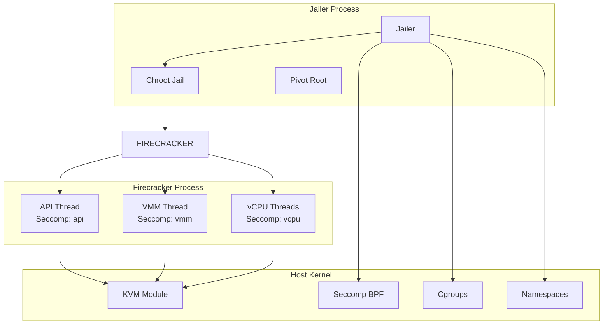
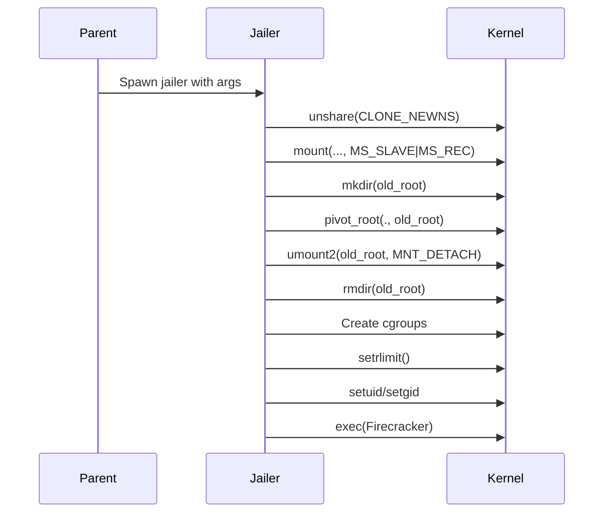

# Firecracker Security Model Deep Dive

## Overview

Firecracker's security model is built on the principle of **defense in depth**, employing multiple layers of isolation and restriction to minimize the attack surface. The security architecture consists of four main pillars:

1. **Seccomp Filtering** - Syscall-level restriction using BPF
2. **Jailer Isolation** - Process containment using namespaces, cgroups, and chroot
3. **CPU Templates** - Consistent CPU feature exposure to prevent side-channel attacks
4. **Minimal Device Model** - Reduced attack surface through limited emulation



## 1. Seccomp Filtering

### Architecture

Firecracker uses a **per-thread-category** seccomp filtering approach. Each thread category has a dedicated BPF filter:

| Thread Category | Purpose | Filter Strictness |
|----------------|---------|-------------------|
| `vcpu` | Guest code execution via KVM | Most restrictive |
| `vmm` | Device emulation, event loop | Moderate |
| `api` | HTTP API server | Least restrictive |

### Seccompiler

Firecracker uses a custom tool called **Seccompiler** to generate binary BPF filters at compile time.

**Source Format (JSON):**
```json
{
  "vcpu": {
    "default_action": "trap",
    "filter_action": "allow",
    "filter": [
      {
        "syscall": "kvm_ioctls",
        "args": []
      },
      {
        "syscall": "exit",
        "args": []
      }
    ]
  }
}
```

**Compilation Process:**
```
seccompiler-bin \
  --input seccomp.json \
  --arch x86_64 \
  --output-binary seccomp_filter.bpf
```

**Build Integration:**
```rust
// In firecracker/Cargo.toml build.rs
fn main() {
    compile_bpf(
        "seccomp.json",
        "x86_64",
        "seccomp_filter.bpf"
    );
}
```

### Filter Application

Filters are applied at thread startup:

```rust
// vmm/src/seccomp.rs
pub fn apply_filter(bpf_filter: BpfProgramRef) -> Result<(), InstallationError> {
    if bpf_filter.is_empty() {
        return Ok(());
    }

    // First, set NO_NEW_PRIVS to prevent privilege escalation
    unsafe {
        let rc = libc::prctl(libc::PR_SET_NO_NEW_PRIVS, 1, 0, 0, 0);
        if rc != 0 {
            return Err(InstallationError::Prctl(std::io::Error::last_os_error()));
        }
    }

    // Apply the seccomp filter via seccomp syscall
    let bpf_prog = SockFprog {
        len: bpf_filter_len,
        filter: bpf_filter.as_ptr(),
    };
    unsafe {
        let rc = libc::syscall(
            libc::SYS_seccomp,
            libc::SECCOMP_SET_MODE_FILTER,
            0,
            &bpf_prog,
        );
        if rc != 0 {
            return Err(InstallationError::Prctl(std::io::Error::last_os_error()));
        }
    }
    Ok(())
}
```

### Filter Actions

| Action | Description |
|--------|-------------|
| `allow` | Syscall permitted |
| `trap` | Syscall triggers SIGSYS (default deny) |
| `kill_process` | Terminate entire process |
| `errno(value)` | Return specific errno |

### VCPU Filter (Most Restrictive)

The vCPU filter is the most restrictive since vCPUs only need to:
1. Execute `KVM_RUN` ioctl
2. Handle exit signals
3. Basic thread operations

**Key syscalls allowed:**
- `ioctl` (KVM only)
- `exit`, `exit_group`
- `sigreturn`
- `mmap`, `munmap` (for kvm_run shared page)

### VMM Filter

The VMM filter allows device emulation operations:
- `eventfd2`, `epoll_*` - Event handling
- `ioctl` - KVM and device operations
- `mmap`, `munmap`, `mprotect` - Memory management
- `read`, `write` - File I/O for devices

### API Filter

The API filter is the least restrictive, allowing:
- Socket operations (`socket`, `bind`, `accept`, `listen`)
- File I/O for logging
- HTTP parsing operations

## 2. Jailer Isolation

### Purpose

The Jailer is a dedicated process isolation utility that provides:
- Filesystem isolation via `pivot_root()` + chroot
- Resource limits via cgroups
- Process isolation via namespaces
- Privilege dropping before exec

### Jailer Execution Flow



### Chroot Implementation

The jailer uses `pivot_root()` instead of simple `chroot()` for stronger isolation:

```rust
// jailer/src/chroot.rs
pub fn chroot(path: &Path) -> Result<(), JailerError> {
    // 1. Unshare into new mount namespace
    unsafe { libc::unshare(libc::CLONE_NEWNS) }
        .into_empty_result()
        .map_err(JailerError::UnshareNewNs)?;

    // 2. Change propagation type to SLAVE (required for pivot_root)
    unsafe {
        libc::mount(
            null(),
            c"/".as_ptr(),
            null(),
            libc::MS_SLAVE | libc::MS_REC,
            null(),
        )
    }
    .into_empty_result()
    .map_err(JailerError::MountPropagationSlave)?;

    // 3. Bind mount the jail root over itself
    // (pivot_root requires new and old root on different filesystems)
    unsafe {
        libc::mount(
            chroot_dir.as_ptr(),
            chroot_dir.as_ptr(),
            null(),
            libc::MS_BIND | libc::MS_REC,
            null(),
        )
    }
    .into_empty_result()
    .map_err(JailerError::MountBind)?;

    // 4. Create old_root directory
    unsafe { libc::mkdir(OLD_ROOT_DIR.as_ptr(), libc::S_IRUSR | libc::S_IWUSR) }
        .into_empty_result()
        .map_err(JailerError::MkdirOldRoot)?;

    // 5. Execute pivot_root
    unsafe {
        libc::syscall(
            libc::SYS_pivot_root,
            CURRENT_DIR.as_ptr(),
            OLD_ROOT_DIR.as_ptr(),
        )
    }
    .into_empty_result()
    .map_err(JailerError::PivotRoot)?;

    // 6. Umount and remove old_root
    unsafe { libc::umount2(OLD_ROOT_DIR.as_ptr(), libc::MNT_DETACH) }
        .into_empty_result()
        .map_err(JailerError::UmountOldRoot)?;
    unsafe { libc::rmdir(OLD_ROOT_DIR.as_ptr()) }
        .into_empty_result()
        .map_err(JailerError::RmOldRootDir)?;

    Ok(())
}
```

### Cgroup Configuration

The jailer supports both cgroup v1 and v2:

**Cgroup v1:**
- Multiple hierarchies (cpu, memory, io, etc.)
- Controllers mounted at different paths
- Format: `cpu.shares=100`, `memory.limit_in_bytes=512M`

**Cgroup v2:**
- Single unified hierarchy
- Format: `cpu.max=10000 100000`, `memory.max=536870912`

**Jailer Command Example:**
```bash
jailer \
  --id my-microvm \
  --exec-file /usr/bin/firecracker \
  --uid 1234 \
  --gid 1234 \
  --chroot-base-dir /srv/jailer \
  --cgroup cpu.shares=100 \
  --cgroup memory.limit_in_bytes=512M \
  --netns /var/run/netns/my-ns \
  --daemonize
```

### Cgroup Implementation (v1)

```rust
// jailer/src/cgroup.rs
impl CgroupV1 {
    pub fn new(id: &str, parent_cg: &Path, hierarchy: &Path) -> Result<Self, JailerError> {
        // Create cgroup directory
        let cgroup_path = hierarchy.join(parent_cg).join(id);
        fs::create_dir_all(&cgroup_path)?;

        // Inherit settings from parent if needed
        inherit_from_parent(&cgroup_path, "cpuset.cpus", false)?;
        inherit_from_parent(&cgroup_path, "cpuset.mems", false)?;

        Ok(CgroupV1 {
            base: CgroupBase {
                location: cgroup_path,
                properties: Vec::new(),
            },
            cg_parent_depth: /* calculated depth */,
        })
    }

    pub fn add_property(&mut self, file: String, value: String) -> Result<(), JailerError> {
        // Validate file name (prevent path traversal)
        validate_cgroup_file(&file)?;
        self.base.properties.push(CgroupProperty { file, value });
        Ok(())
    }

    pub fn write_values(&self) -> Result<(), JailerError> {
        for prop in &self.base.properties {
            let file_path = self.base.location.join(&prop.file);
            writeln_special(&file_path, &prop.value)?;
        }
        Ok(())
    }

    pub fn attach_pid(&self) -> Result<(), JailerError> {
        let tasks_path = self.base.location.join("tasks");
        writeln_special(&tasks_path, process::id())?;
        Ok(())
    }
}
```

### Resource Limits

The jailer sets process resource limits via `setrlimit`:

```rust
// Resource limit configuration
--resource-limit no-file=1024    # Maximum open file descriptors
--resource-limit fsize=1048576   # Maximum file size (bytes)
```

**Implementation:**
```rust
pub fn set_resource_limits(rlimits: &[(libc::c_int, u64)]) -> Result<(), JailerError> {
    for (resource, limit) in rlimits {
        let rl = libc::rlimit {
            rlim_cur: *limit,
            rlim_max: *limit,
        };
        // SAFETY: Safe as parameters are valid
        let rc = unsafe { libc::setrlimit(*resource, &rl as *const libc::rlimit) };
        if rc != 0 {
            return Err(JailerError::Setrlimit(format!(
                "Failed to set resource limit for {:?}",
                resource
            )));
        }
    }
    Ok(())
}
```

### Process Sanitization

Before exec'ing Firecracker, the jailer sanitizes the process environment:

```rust
fn sanitize_process() -> Result<(), JailerError> {
    // Close all inherited file descriptors (except 0, 1, 2)
    close_inherited_fds()?;

    // Remove all environment variables to prevent leaks
    clean_env_vars()?;

    Ok(())
}

fn clean_env_vars() {
    for (key, _) in p_env::vars() {
        unsafe {
            p_env::remove_var(key);
        }
    }
}

fn close_inherited_fds() -> Result<(), JailerError> {
    // Use close_range syscall (kernel 5.9+)
    unsafe {
        libc::syscall(
            libc::SYS_close_range,
            3,  // Start FD
            libc::c_uint::MAX,
            libc::CLOSE_RANGE_UNSHARE,
        )
    }
    .into_empty_result()
    .map_err(JailerError::CloseRange)
}
```

### Device Creation

The jailer creates minimal device nodes inside the jail:

```rust
// Create /dev/kvm and /dev/net/tun
fn create_required_devices(jail_root: &Path) -> Result<(), JailerError> {
    // /dev/kvm (character device 10, 232)
    mknod_dev(jail_root.join("dev/kvm"), libc::S_IFCHR | 0o666, 10, 232)?;

    // /dev/net/tun (character device 10, 200)
    fs::create_dir_all(jail_root.join("dev/net"))?;
    mknod_dev(jail_root.join("dev/net/tun"), libc::S_IFCHR | 0o666, 10, 200)?;

    // /dev/urandom (character device 1, 9)
    mknod_dev(jail_root.join("dev/urandom"), libc::S_IFCHR | 0o444, 1, 9)?;

    Ok(())
}
```

## 3. CPU Templates

### Purpose

CPU templates provide consistent CPU feature exposure across instances, preventing:
- **Side-channel attacks** (Spectre, Meltdown, etc.)
- **Live migration failures** due to CPU feature mismatch
- **Information leakage** via CPUID

### Static CPU Templates (x86_64)

| Template | Target Platform | Purpose |
|----------|-----------------|---------|
| `T2` | AWS T2 instances | Baseline for T2 |
| `T2S` | AWS T2 (Spectre mitigated) | T2 + Spectre fixes |
| `T2CL` | AWS T2 (Clear state) | T2 + state clear |
| `T2A` | AWS T2 (AMD) | T2 for AMD EPYC |
| `C3` | AWS C3 instances | Baseline for C3 |

### CPU Template Structure

```rust
#[derive(Debug, Clone, Serialize, Deserialize)]
pub struct CustomCpuTemplate {
    pub cpuid_modifiers: HashMap<CpuidKey, CpuidLeafModifier>,
    pub msr_modifiers: HashMap<MsrKey, MsrModifier>,
    pub kvm_capabilities: Vec<KvmCapability>,
}

#[derive(Debug, Clone, Serialize, Deserialize)]
pub struct CpuidLeafModifier {
    pub register: CpuidRegister,
    pub bitmap: String,  // Hex bitmask
    pub value: String,   // Value to set/clear
}
```

### CPUID Modifiers

CPUID modifiers control which CPU features are exposed:

```json
{
  "cpuid_modifiers": {
    "0x00000001:ecx": {
      "register": "ecx",
      "bitmap": "0x00000008",
      "value": "0x00000000"
    },
    "0x00000007:edx": {
      "register": "edx",
      "bitmap": "0x00004000",
      "value": "0x00000000"
    }
  }
}
```

**Example: Disabling Speculative Features**
```json
{
  "0x00000007:ecx": {
    "register": "ecx",
    "bitmap": "0x00000004",  // SPEC_CTRL bit
    "value": "0x00000000"    // Clear to disable
  }
}
```

### MSR Modifiers

MSR modifiers control Model-Specific Registers:

```json
{
  "msr_modifiers": [
    {
      "addr": "0x000001a0",  // IA32_MISC_ENABLE
      "bitmap": "0x00000001",
      "value": "0x00000001"
    }
  ]
}
```

### KVM Capabilities

CPU templates can also specify required/forbidden KVM capabilities:

```json
{
  "kvm_capabilities": [
    "10",      // KVM_CAP_IRQCHIP (required)
    "!25"      // KVM_CAP_X2APIC_API (forbidden)
  ]
}
```

### Template Application

Templates are applied during vCPU initialization:

```rust
// vmm/src/builder.rs
pub fn build_microvm_for_boot(...) -> Result<Arc<Mutex<Vmm>>, StartMicrovmError> {
    let cpu_template = vm_resources
        .machine_config
        .cpu_template
        .get_cpu_template()?;

    let (mut vmm, mut vcpus) = create_vmm_and_vcpus(
        instance_info,
        event_manager,
        vm_resources.machine_config.vcpu_count,
        cpu_template.kvm_capabilities.clone(),
    )?;

    // ... device attachment ...

    configure_system_for_boot(
        &mut vmm,
        vcpus.as_mut(),
        &vm_resources.machine_config,
        &cpu_template,
        entry_point,
        &initrd,
        boot_cmdline,
    )?;
}
```

### CPUID Normalization

Firecracker normalizes CPUID values to ensure consistency:

```rust
// vmm/src/cpu_config/x86_64/cpuid/normalize.rs
pub fn normalize_cpuid(cpuid: &mut Cpuid) {
    // Clear variable bits that differ between CPUs
    // but don't affect functionality

    // For example, clear the APIC ID bits that vary per core
    for entry in cpuid.iter_mut() {
        match entry.function {
            0x00000001 => {
                // Clear APIC ID (bits 31:24 of EBX)
                entry.ebx &= !0xFF000000;
            }
            _ => {}
        }
    }
}
```

## 4. Minimal Device Model

### Attack Surface Reduction

Firecracker deliberately limits emulated devices:

| Device | Included | Rationale |
|--------|----------|-----------|
| VirtIO Block | Yes | Essential for storage |
| VirtIO Net | Yes | Essential for networking |
| VirtIO RNG | Yes | Entropy for guest |
| VirtIO Balloon | Optional | Memory management |
| VirtIO Vsock | Optional | Host-guest communication |
| ACPI | Yes (x86) | Required for boot |
| RTC | Yes (aarch64) | Timekeeping |
| Serial | Yes | Console output |
| PS/2 Controller | No | Legacy, not needed |
| VGA | No | Headless operation |
| USB | No | Not needed for cloud |
| PCI | Limited | Only for VirtIO MMIO |

### Seccomp Integration with Device Model

Each device only has access to syscalls it needs:

```rust
// Example: Block device syscall requirements
// - io_uring: io_uring_setup, io_uring_enter
// - Async I/O: preadv, pwritev
// - File: open, close, fstat, fsync

// Example: Network device syscall requirements
// - TAP: read, write, ioctl (TUNSETIFF, etc.)
// - Rate limiting: timerfd_create, timerfd_read
```

## 5. Security Best Practices

### Production Deployment Checklist

1. **Always use Jailer** - Never run Firecracker directly
2. **Enable seccomp** - Never use `--no-seccomp` in production
3. **Use CPU templates** - Ensure consistent CPU features
4. **Network namespaces** - Isolate network access
5. **Resource limits** - Set appropriate cgroup limits
6. **Dedicated users** - Run each microVM as different user
7. **Read-only rootfs** - Where possible, use read-only root filesystem

### Example Secure Deployment

```bash
# Create network namespace
ip netns add fc-ns
ip netns exec fc-ns ip link set lo up

# Create veth pair
ip link add veth0 type veth peer name veth1
ip link set veth0 netns fc-ns
ip link set veth1 up

# Start Firecracker via Jailer
jailer \
  --id my-secure-vm \
  --exec-file /usr/bin/firecracker \
  --uid 10001 \
  --gid 10001 \
  --chroot-base-dir /srv/jailer \
  --cgroup cpu.shares=100 \
  --cgroup memory.limit_in_bytes=512M \
  --netns /var/run/netns/fc-ns \
  --resource-limit no-file=1024 \
  --daemonize

# Configure VM via API socket
curl --unix-socket /srv/jailer/firecracker/my-secure-vm/root/firecracker.socket \
  -X PUT 'http://localhost/machine-config' \
  -d '{"vcpu_count": 2, "mem_size_mib": 512, "cpu_template": "T2S"}'
```

## 6. Known Limitations

### Seccomp

- Cannot filter ioctls by command (only by syscall)
- KVM device passthrough requires broader syscall access

### Jailer

- Requires root to start (privilege dropping happens after setup)
- Cgroup v2 support still maturing

### CPU Templates

- Only x86_64 and aarch64 supported
- Custom templates require careful testing
- Some CPU features cannot be safely modified

## 7. Security Metrics

Firecracker tracks security-related metrics:

```rust
// Metrics tracked
METRICS.seccomp.num_faults  // Seccomp violations
METRICS.vmm.panic_count     // VMM panics
METRICS.vcpu.failures       // vCPU failures
```

These can be monitored to detect potential security incidents.
