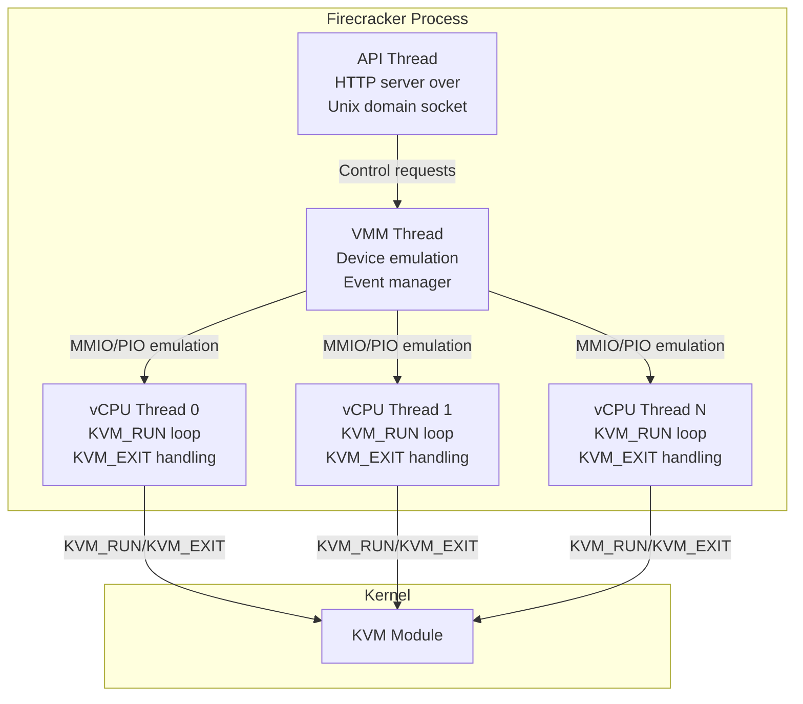
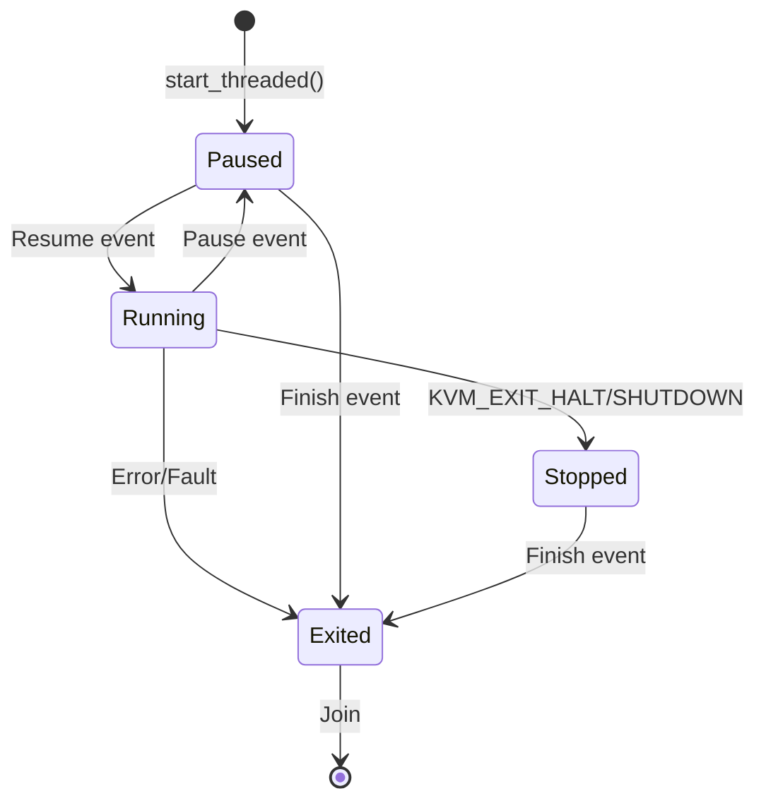
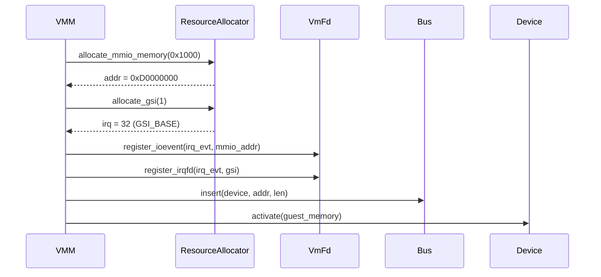

# Firecracker VMM Internals Deep Dive

## Overview

The Firecracker VMM (Virtual Machine Monitor) is a ~100K line Rust application that manages lightweight microVMs using Linux KVM. This document provides an in-depth exploration of the VMM's internal architecture, threading model, device emulation, and KVM interaction.

## Thread Architecture

Firecracker uses a carefully designed multi-threaded architecture optimized for security and performance:



### Thread Categories and Seccomp

Each thread category has its own seccomp filter:

| Thread | Purpose | Seccomp Filter |
|--------|---------|----------------|
| API | HTTP request handling, JSON parsing | `api` - restricted syscalls for network/socket |
| VMM | Event loop, device emulation | `vmm` - syscalls for device emulation |
| vCPU | Guest code execution | `vcpu` - minimal syscalls, mostly KVM ioctls |

## Main Entry Point and Initialization

### `main.rs` Flow

```
main() → main_exec() → run_with_api() / run_without_api()
                              ↓
                   build_and_boot_microvm()
                              ↓
              create_vmm_and_vcpus()
                              ↓
        [Vmm struct with KVM, devices, vCPUs]
                              ↓
              start_vcpus() - launches threads
                              ↓
              event_manager.run() - main loop
```

Key initialization steps in `main_exec()`:

1. **Logger initialization** - Sets up structured logging with metrics
2. **Argument parsing** - Parses CLI args (api-sock, config-file, seccomp options)
3. **Signal handler registration** - Handles SIGBUS, SIGSEGV, etc.
4. **FD table resizing** - Pre-emptively grows FD table to avoid reallocation during snapshot restore
5. **Seccomp filter creation** - Creates BPF filters per thread category
6. **VMM construction and boot** - Either via API or direct JSON config

## VMM Core Structure

### `Vmm` struct (`vmm/src/lib.rs`)

```rust
pub struct Vmm {
    events_observer: Option<std::io::Stdin>,
    instance_info: InstanceInfo,
    shutdown_exit_code: Option<FcExitCode>,

    // Core VM resources
    kvm: Kvm,
    vm: Vm,
    uffd: Option<Uffd>,  // Userfaultfd for snapshot lazy loading
    vcpus_handles: Vec<VcpuHandle>,
    vcpus_exit_evt: EventFd,

    // Guest resource allocator
    resource_allocator: ResourceAllocator,

    // Device managers
    mmio_device_manager: MMIODeviceManager,
    #[cfg(target_arch = "x86_64")]
    pio_device_manager: PortIODeviceManager,
    acpi_device_manager: ACPIDeviceManager,
}
```

### VMM Lifecycle States

The VMM manages the VM state machine:

```
NotStarted → Paused → Running → Paused → (snapshot) → Restored
                ↑          ↓
                └──────────┘
```

## vCPU Implementation

### vCPU State Machine

Each vCPU runs as a separate thread with its own state machine:



### Key vCPU Operations

**`run_emulation()`** - Core emulation loop:
```rust
pub fn run_emulation(&mut self) -> Result<VcpuEmulation, VcpuError> {
    match self.kvm_vcpu.fd.run() {
        Err(err) if err.errno() == libc::EINTR => {
            // Signal interrupted, return to check events
            Ok(VcpuEmulation::Interrupted)
        }
        Ok(exit_reason) => handle_kvm_exit(exit_reason)
    }
}
```

**KVM Exit Handling** (`handle_kvm_exit`):

| Exit Reason | Action |
|-------------|--------|
| `MmioRead(addr, data)` | Route to MMIO bus handler |
| `MmioWrite(addr, data)` | Route to MMIO bus handler |
| `Hlt` | Signal VM stopped (CPU halt) |
| `Shutdown` | Signal VM stopped (system reset) |
| `FailEntry` | Fatal error, exit vCPU |
| `InternalError` | Fatal KVM error |
| `SystemEvent(RESET/SHUTDOWN)` | Signal VM stopped |

### vCPU Communication Channel

vCPUs communicate with the VMM via MPSC channels:

```rust
// Events sent TO vCPU
enum VcpuEvent {
    Finish,      // Thread termination
    Pause,       // Pause execution
    Resume,      // Resume execution
    SaveState,   // Snapshot: save CPU state
    DumpCpuConfig, // CPU template: export config
}

// Responses FROM vCPU
enum VcpuResponse {
    Error(VcpuError),
    Exited(FcExitCode),
    NotAllowed(String),
    Paused,
    Resumed,
    SavedState(Box<VcpuState>),
    DumpedCpuConfig(Box<CpuConfiguration>),
}
```

### Signal-based vCPU Kicking

Firecracker uses `SIGRTMIN` to kick vCPUs out of KVM_RUN:

```rust
extern "C" fn handle_signal(_: c_int, _: *mut siginfo_t, _: *mut c_void) {
    TLS_VCPU_PTR.with(|cell| {
        if let Some(kvm_run_ptr) = &mut *cell.borrow_mut() {
            kvm_run_ptr.as_mut_ref().immediate_exit = 1;
            fence(Ordering::Release);
        }
    })
}
```

This sets `immediate_exit` in the shared `kvm_run` struct, causing KVM_RUN to return with EINTR.

## Device Model

### MMIO Device Manager

All VirtIO devices are mapped to MMIO space:

```rust
pub struct MMIODeviceManager {
    pub(crate) bus: crate::devices::Bus,
    pub(crate) id_to_dev_info: HashMap<(DeviceType, String), MMIODeviceInfo>,
    #[cfg(target_arch = "x86_64")]
    pub(crate) dsdt_data: Vec<u8>,  // ACPI DSDT for device enumeration
}

pub struct MMIODeviceInfo {
    pub addr: u64,      // MMIO base address
    pub len: u64,       // Region size (0x1000 = 4KB)
    pub irq: Option<u32>, // GSI interrupt
}
```

### Device Registration Flow



### VirtIO Device Types

| Device | Type ID | Purpose |
|--------|---------|---------|
| Block | `TYPE_BLOCK` (2) | Disk storage |
| Net | `TYPE_NET` (1) | Network interface |
| Balloon | `TYPE_BALLOON` (5) | Memory ballooning |
| Vsock | `TYPE_VSOCK` (19) | Host-guest socket |
| RNG | `TYPE_RNG` (4) | Entropy source |

### MMIO Transport

The `MmioTransport` wraps VirtIO devices:

```rust
pub struct MmioTransport {
    guest_memory: GuestMemoryMmap,
    device: Arc<Mutex<dyn VirtioDevice>>,
    is_vhost_user: bool,

    // VirtIO MMIO register mapping
    registers::VirtioMagic,          // 0x000 - Magic value (0x74726976)
    registers::VirtioVersion,        // 0x004 - VirtIO version
    registers::VirtioDeviceStatus,   // 0x070 - Device status
    registers::VirtioQueueSelector,  // 0x030 - Queue selection
    registers::VirtioQueueNotify,    // 0x050 - Queue notification
}
```

## KVM Interaction

### KVM Wrapper (`vmm/src/vstate/kvm.rs`)

```rust
pub struct Kvm {
    fd: Arc<Kvm>,  // kvm-ioctls Kvm fd
    capabilities: Vec<KvmCapability>,
}

impl Kvm {
    pub fn new(capabilities: Vec<KvmCapability>) -> Result<Self, KvmError> {
        let kvm = Kvm::new()?;  // Open /dev/kvm
        for cap in capabilities {
            kvm.check_extension(cap.into())?;
        }
        Ok(Kvm { fd: Arc::new(kvm), capabilities })
    }
}
```

### VM Wrapper (`vmm/src/vstate/vm.rs`)

```rust
pub struct Vm {
    fd: Arc<VmFd>,
    guest_memory: Option<GuestMemoryMmap>,
}

impl Vm {
    pub fn new(kvm: &Kvm) -> Result<Self, VmError> {
        let vm_fd = kvm.fd.create_vm()?;
        Ok(Vm { fd: Arc::new(vm_fd), guest_memory: None })
    }

    pub fn register_memory_regions(&mut self, mem: GuestMemoryMmap) {
        for region in mem.iter() {
            self.fd.user_memory_region(region)?;
        }
        self.guest_memory = Some(mem);
    }
}
```

### vCPU Creation

```rust
// In Vm::create_vcpus()
pub fn create_vcpus(&mut self, vcpu_count: u8) -> Result<(Vec<Vcpu>, EventFd)> {
    let exit_evt = EventFd::new(EFD_NONBLOCK)?;
    let mut vcpus = Vec::new();

    for i in 0..vcpu_count {
        let vcpu = Vcpu::new(i, self, exit_evt.try_clone()?)?;
        vcpus.push(vcpu);
    }

    Ok((vcpus, exit_evt))
}
```

## Event Manager

Firecracker uses the `event_manager` crate for epoll-based event loop:

```rust
pub type EventManager = BaseEventManager<Arc<Mutex<dyn MutEventSubscriber>>>;

// Main event loop
loop {
    event_manager.run().expect("Failed to start the event manager");

    match vmm.lock().unwrap().shutdown_exit_code() {
        Some(FcExitCode::Ok) => break,
        Some(exit_code) => return exit_code,
        None => continue,
    }
}
```

### Subscriber Pattern

Devices and VMM implement `MutEventSubscriber`:

```rust
impl MutEventSubscriber for Vmm {
    fn process(&mut self, event: Events, ops: &mut EventOps) {
        let source = event.fd();
        let event_set = event.event_set();

        if source == self.vcpus_exit_evt.as_raw_fd() {
            // vCPU exited, check exit code
            let _ = self.vcpus_exit_evt.read();
            // ... handle exit
        }
    }

    fn init(&mut self, ops: &mut EventOps) {
        // Register interest in vcpu exit event
        ops.add(Events::new(&self.vcpus_exit_evt, EventSet::IN));
    }
}
```

## Memory Management

### Guest Memory Layout

```
Guest Physical Address Space:
0x00000000 ┌────────────────────┐
           │   Kernel Image     │
           ├────────────────────┤
           │   InitRD (if any)  │
           ├────────────────────┤
           │   ACPI Tables      │ (x86_64)
           ├────────────────────┤
           │   MMIO Devices     │ (0xD0000000+)
           │   - Boot Timer     │
           │   - VirtIO Block   │
           │   - VirtIO Net     │
           │   - VirtIO Balloon │
           │   - VirtIO Vsock   │
           │   - VirtIO RNG     │
           ├────────────────────┤
           │   Guest RAM        │
           └────────────────────┘
```

### Memory Operations

```rust
// GuestMemory trait abstraction
pub trait GuestMemory {
    fn read(&self, buf: &mut [u8], addr: GuestAddress) -> Result<usize>;
    fn write(&self, buf: &[u8], addr: GuestAddress) -> Result<usize>;
    fn read_bytes_from_volatile_slice(&self, buf: &VolatileSlice, addr: GuestAddress) -> Result<usize>;
}

// GuestMemoryMmap - concrete implementation
pub struct GuestMemoryMmap {
    regions: Vec<GuestRegionMmap>,
}
```

## Build Process (`builder.rs`)

### MicroVM Build Sequence

```rust
pub fn build_and_boot_microvm(...) -> Result<Arc<Mutex<Vmm>>, StartMicrovmError> {
    // 1. Create VMM and vCPUs (paused state)
    let (mut vmm, mut vcpus) = create_vmm_and_vcpus(...)?;

    // 2. Register guest memory
    vmm.vm.register_memory_regions(guest_memory)?;

    // 3. Load kernel
    let entry_point = load_kernel(&kernel_file, vmm.vm.guest_memory())?;

    // 4. Attach devices
    attach_boot_timer_device(&mut vmm, ...)?;
    attach_block_devices(&mut vmm, ...)?;
    attach_net_devices(&mut vmm, ...)?;
    attach_vmgenid_device(&mut vmm)?;

    // 5. Configure system for boot (CPUID, MSRs, registers)
    configure_system_for_boot(&mut vmm, &mut vcpus, ...)?;

    // 6. Start vCPU threads (remain paused)
    vmm.start_vcpus(vcpus, seccomp_filter)?;

    // 7. Apply VMM seccomp filter
    apply_seccomp_filter(vmm_filter)?;

    // 8. Resume VM (vCPUs start executing)
    vmm.resume_vm()?;

    Ok(vmm)
}
```

## Key Design Decisions

### 1. Single VM per Process

Each Firecracker process manages exactly one microVM:
- Simplifies isolation boundaries
- Makes seccomp filtering straightforward
- Easier resource accounting

### 2. Minimal Device Model

Only essential VirtIO devices:
- Reduces attack surface
- Simpler codebase
- Faster boot times

### 3. API Thread Isolation

The API thread:
- Never touches the fast path
- Only handles control plane
- Can be heavily seccomp-restricted

### 4. Immediate Exit for Kicking

Uses `immediate_exit` flag in `kvm_run` struct:
- No need for complex IPI mechanisms
- Works with KVM's built-in support
- Clean integration with signal handling

### 5. MMIO-only Device Access

All devices accessed via MMIO:
- Simpler than PIO + MMIO split
- Consistent across architectures
- Easier ACPI enumeration

## Performance Characteristics

### Boot Time Optimization

- **< 125ms** cold boot to guest userspace
- Factors:
  - Minimal device emulation
  - No BIOS/UEFI overhead
  - PVH boot mode support
  - Efficient memory layout

### vCPU Scheduling

- One thread per vCPU
- Direct KVM_RUN execution
- No VMM mediation for guest code
- Exit handling optimized for common cases (MMIO, IRQ injection)

### Memory Efficiency

- **~30MB** resident memory for VMM process
- No memory overcommit
- Direct guest memory mapping
- Copy-on-write snapshot support

## Error Handling

### Exit Codes

```rust
pub enum FcExitCode {
    Ok = 0,
    GenericError = 1,
    BadSyscall = 148,     // Seccomp violation
    SIGBUS = 149,         // Memory access error
    SIGSEGV = 150,        // Segmentation fault
    BadConfiguration = 152,
    ArgParsing = 153,
}
```

### vCPU Teardown

Teardown protocol to avoid deadlocks:

```
1. vcpu.exit(exit_code)
2. vcpu.exit_evt.write(1)
3. VMM receives exit event
4. vmm.stop() sends VcpuEvent::Finish
5. vCPU thread exits KVM_RUN loop
6. VcpuHandle::join() waits for thread
7. vmm.shutdown_exit_code = Some(exit_code)
8. Main event loop breaks
```
