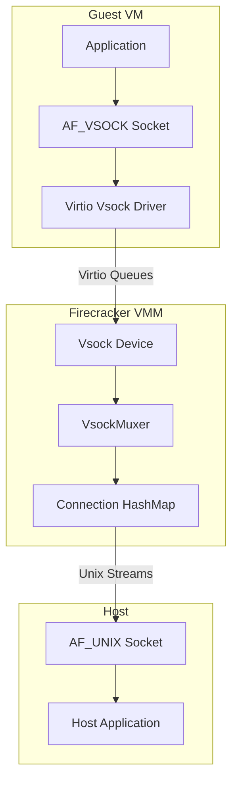
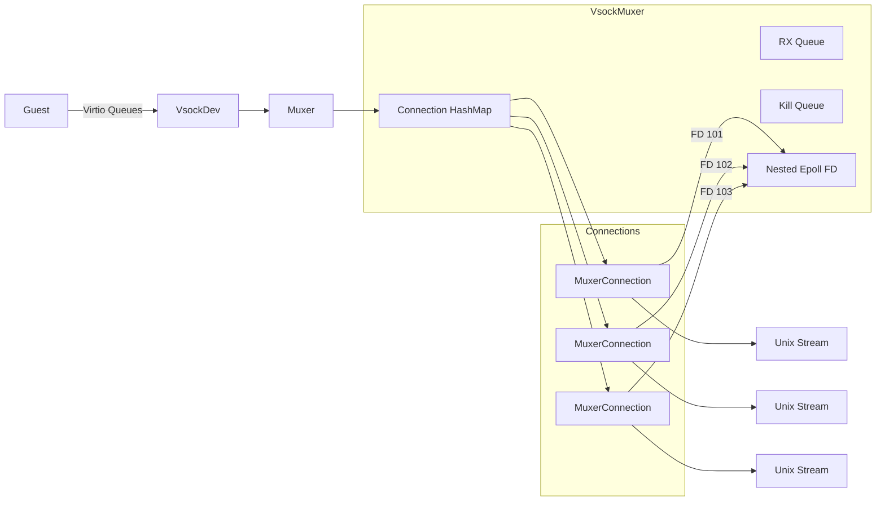
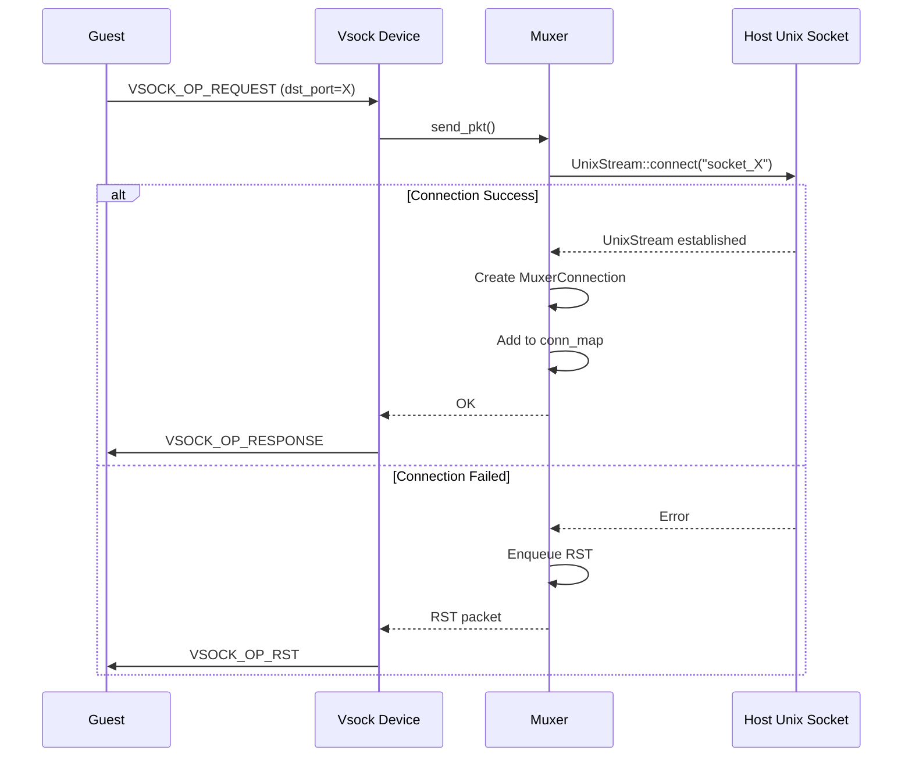
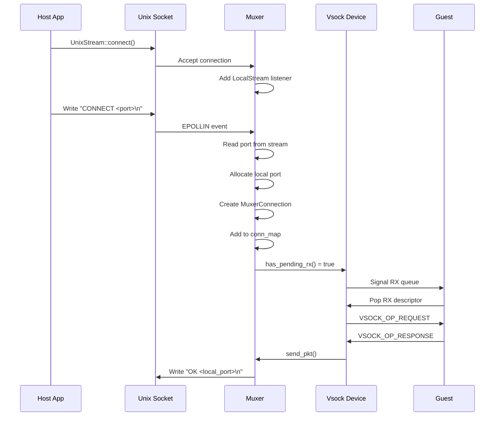

# Firecracker Vsock Device Deep Dive

## Overview

The Firecracker vsock device provides full virtio-vsock support to software running inside the guest VM, while bypassing vhost kernel code on the host. Firecracker implements the virtio-vsock device model and mediates communication between AF_UNIX sockets (on the host end) and AF_VSOCK sockets (on the guest end).

Vsock enables efficient bidirectional communication between the host and guest without requiring network stack overhead, making it ideal for:
- Container runtime communication (firecracker-containerd agent)
- Host-guest control plane traffic
- Metadata and configuration delivery
- Guest introspection and monitoring



## Architecture

### Device Structure

The vsock device is implemented in `devices/virtio/vsock/device.rs`:

```rust
pub struct Vsock<B> {
    cid: u64,                    // Guest CID (Context ID)
    pub(crate) queues: Vec<VirtQueue>,    // 3 virtio queues (RX, TX, Event)
    pub(crate) queue_events: Vec<EventFd>, // Queue notification FDs
    pub(crate) backend: B,       // VsockBackend (e.g., VsockMuxer)
    pub(crate) avail_features: u64,
    pub(crate) acked_features: u64,
    pub(crate) irq_trigger: IrqTrigger,
    pub(crate) activate_evt: EventFd,
    pub(crate) device_state: DeviceState,
    pub rx_packet: VsockPacketRx,  // RX packet buffer
    pub tx_packet: VsockPacketTx,  // TX packet buffer
}
```

### VirtIO Features

The vsock device supports these virtio features:
- `VIRTIO_F_VERSION_1` - Device conforms to virtio spec version 1.0+
- `VIRTIO_F_IN_ORDER` - Used buffers returned in same order as made available

```rust
pub(crate) const AVAIL_FEATURES: u64 =
    (1 << VIRTIO_F_VERSION_1 as u64) | (1 << VIRTIO_F_IN_ORDER as u64);
```

### Queue Architecture

The vsock device uses 3 virtio queues:

| Queue | Index | Purpose | Size |
|-------|-------|---------|------|
| RX (Receive) | 0 | Guest receives packets from host | 256 |
| TX (Transmit) | 1 | Guest sends packets to host | 256 |
| Event | 2 | Transport events (RESET, etc.) | 256 |

```rust
pub const VSOCK_NUM_QUEUES: usize = 3;
pub const VSOCK_QUEUE_SIZES: [u16; VSOCK_NUM_QUEUES] = [
    FIRECRACKER_MAX_QUEUE_SIZE,  // RX
    FIRECRACKER_MAX_QUEUE_SIZE,  // TX
    FIRECRACKER_MAX_QUEUE_SIZE,  // Event
];
```

## Vsock Packet Protocol

### Packet Header Structure

The vsock packet header is 44 bytes and defined in `packet.rs`:

```c
struct virtio_vsock_hdr {
    le64 src_cid;      // Source Context ID
    le64 dst_cid;      // Destination Context ID
    le32 src_port;     // Source Port
    le32 dst_port;     // Destination Port
    le32 len;          // Data length (bytes)
    le16 type;         // Socket type (STREAM=1)
    le16 op;           // Operation (REQUEST, RESPONSE, RW, etc.)
    le32 flags;        // Optional flags (SHUTDOWN_RCV, SHUTDOWN_SEND)
    le32 buf_alloc;    // Sender's buffer allocation
    le32 fwd_cnt;      // Forward count (bytes consumed)
};
```

### Rust Header Structure

```rust
#[repr(C, packed)]
#[derive(Copy, Clone, Debug, Default)]
pub struct VsockPacketHeader {
    src_cid: u64,
    dst_cid: u64,
    src_port: u32,
    dst_port: u32,
    len: u32,
    type_: u16,
    op: u16,
    flags: u32,
    buf_alloc: u32,
    fwd_cnt: u32,
}
```

### Operation Types

| Operation | Value | Description |
|-----------|-------|-------------|
| `VSOCK_OP_REQUEST` | 1 | Connection request |
| `VSOCK_OP_RESPONSE` | 2 | Connection response |
| `VSOCK_OP_RST` | 3 | Connection reset |
| `VSOCK_OP_SHUTDOWN` | 4 | Clean shutdown |
| `VSOCK_OP_RW` | 5 | Data transfer |
| `VSOCK_OP_CREDIT_UPDATE` | 6 | Flow control credit update |
| `VSOCK_OP_CREDIT_REQUEST` | 7 | Flow control credit request |

### Packet Flags

| Flag | Value | Description |
|------|-------|-------------|
| `VSOCK_FLAGS_SHUTDOWN_RCV` | 1 | Sender will receive no more data |
| `VSOCK_FLAGS_SHUTDOWN_SEND` | 2 | Sender will send no more data |

### Packet Assembly

Packets are assembled from virtio descriptor chains. The first descriptor holds the header, and an optional second descriptor holds the data:

```rust
// TX Packet parsing (guest -> host)
pub fn parse(
    &mut self,
    mem: &GuestMemoryMmap,
    chain: DescriptorChain,
) -> Result<(), VsockError> {
    // Load descriptor chain into IoVecBuffer
    unsafe { self.buffer.load_descriptor_chain(mem, chain)? };

    // Read header from buffer
    self.buffer.read_exact_volatile_at(hdr.as_mut_slice(), 0)?;

    // Validate packet length
    if hdr.len > defs::MAX_PKT_BUF_SIZE {
        return Err(VsockError::InvalidPktLen(hdr.len));
    }

    Ok(())
}
```

### Maximum Packet Size

```rust
pub const MAX_PKT_BUF_SIZE: u32 = 64 * 1024;  // 64KB max data payload
```

## Vsock Backend Architecture

### Backend Trait

The vsock device uses a pluggable backend architecture:

```rust
/// A vsock channel that handles packet traffic
pub trait VsockChannel {
    fn recv_pkt(&mut self, pkt: &mut VsockPacketRx) -> Result<(), VsockError>;
    fn send_pkt(&mut self, pkt: &VsockPacketTx) -> Result<(), VsockError>;
    fn has_pending_rx(&self) -> bool;
}

/// An epoll listener for event-driven processing
pub trait VsockEpollListener: AsRawFd {
    fn get_polled_evset(&self) -> EventSet;
    fn notify(&mut self, evset: EventSet);
}

/// Combined backend trait
pub trait VsockBackend: VsockChannel + VsockEpollListener + Send {}
```

### VsockUnixBackend - Unix Socket Muxer

The primary backend implementation translates guest AF_VSOCK to host AF_UNIX sockets.



### VsockMuxer Structure

```rust
pub struct VsockMuxer {
    cid: u64,                        // Guest CID
    conn_map: HashMap<ConnMapKey, MuxerConnection>,  // Active connections
    listener_map: HashMap<RawFd, EpollListener>,     // Epoll listeners
    rxq: MuxerRxQ,                   // RX packet queue
    killq: MuxerKillQ,               // Connection termination queue
    host_sock: UnixListener,         // Host Unix socket listener
    host_sock_path: String,          // Unix socket path prefix
    epoll: Epoll,                    // Nested epoll FD
    local_port_set: HashSet<u32>,    // Allocated local ports
    local_port_last: u32,            // Last allocated port
}
```

### Connection Map Key

```rust
#[derive(Clone, Copy, Debug, Eq, Hash, PartialEq)]
pub struct ConnMapKey {
    local_port: u32,   // Host-side port
    peer_port: u32,    // Guest-side port
}
```

## Connection Lifecycle

### Connection Types

1. **Guest-Initiated (Peer Init)**: Guest connects to host Unix socket
2. **Host-Initiated (Local Init)**: Host connects to guest port

### Guest-Initiated Connection Flow



### Host-Initiated Connection Flow



### Connection States (MuxerConnection)

The connection state machine (in `csm.rs`) manages:

```rust
pub enum ConnState {
    /// Initial state - awaiting connection response
    LocalInit,
    /// Connection established - bidirectional communication
    Established,
    /// Shutdown initiated - draining buffers
    ShuttingDown,
    /// Connection killed - awaiting RST
    Killed,
}
```

## Packet Processing

### RX Processing (Host -> Guest)

```rust
pub fn process_rx(&mut self) -> Result<bool, InvalidAvailIdx> {
    let mem = self.device_state.mem().unwrap();
    let queue = &mut self.queues[RXQ_INDEX];
    let mut have_used = false;

    while let Some(head) = queue.pop()? {
        let index = head.index;
        let used_len = match self.rx_packet.parse(mem, head) {
            Ok(()) => {
                if self.backend.recv_pkt(&mut self.rx_packet).is_ok() {
                    match self.rx_packet.commit_hdr() {
                        Ok(()) => VSOCK_PKT_HDR_SIZE + self.rx_packet.hdr.len(),
                        Err(err) => {
                            warn!("vsock: Error writing packet header: {:?}", err);
                            0
                        }
                    }
                } else {
                    queue.undo_pop();
                    break;
                }
            }
            Err(err) => {
                warn!("vsock: RX queue error: {:?}", err);
                0
            }
        };

        have_used = true;
        queue.add_used(index, used_len)?;
    }
    queue.advance_used_ring_idx();
    Ok(have_used)
}
```

### TX Processing (Guest -> Host)

```rust
pub fn process_tx(&mut self) -> Result<bool, InvalidAvailIdx> {
    let mem = self.device_state.mem().unwrap();
    let queue = &mut self.queues[TXQ_INDEX];
    let mut have_used = false;

    while let Some(head) = queue.pop()? {
        let index = head.index;

        match self.tx_packet.parse(mem, head) {
            Ok(()) => (),
            Err(err) => {
                error!("vsock: error reading TX packet: {:?}", err);
                queue.add_used(index, 0)?;
                continue;
            }
        };

        if self.backend.send_pkt(&self.tx_packet).is_err() {
            queue.undo_pop();
            break;
        }

        have_used = true;
        queue.add_used(index, 0)?;
    }
    queue.advance_used_ring_idx();
    Ok(have_used)
}
```

## Muxer RX Queue

### Purpose

The RX queue decouples packet production from consumption, allowing the muxer to:
- Queue packets from multiple connections
- Generate RST packets for invalid requests
- Maintain ordering guarantees

### Queue Item Types

```rust
#[derive(Clone, Copy, Debug)]
pub enum MuxerRx {
    ConnRx(ConnMapKey),      // Fetch from connection
    RstPkt { local_port: u32, peer_port: u32 },  // Generate RST
}
```

### Queue Synchronization

```rust
pub fn recv_pkt(&mut self, pkt: &mut VsockPacketRx) -> Result<(), VsockError> {
    // Sync queue if empty but connections have data
    if self.rxq.is_empty() && !self.rxq.is_synced() {
        self.rxq = MuxerRxQ::from_conn_map(&self.conn_map);
    }

    while let Some(rx) = self.rxq.peek() {
        match rx {
            MuxerRx::RstPkt { local_port, peer_port } => {
                // Build RST packet
                pkt.hdr.set_op(uapi::VSOCK_OP_RST)
                    .set_src_cid(uapi::VSOCK_HOST_CID)
                    .set_dst_cid(self.cid)
                    .set_src_port(local_port)
                    .set_dst_port(peer_port);
                self.rxq.pop();
                return Ok(());
            }
            MuxerRx::ConnRx(key) => {
                // Delegate to connection
                let mut conn_res = Err(VsockError::NoData);
                self.apply_conn_mutation(key, |conn| {
                    conn_res = conn.recv_pkt(pkt);
                });
                self.rxq.pop();
                return conn_res;
            }
        }
    }
    Err(VsockError::NoData)
}
```

## Event Processing

### Nested Epoll Architecture

The muxer uses a nested epoll pattern for efficient event dispatch:

```rust
impl VsockEpollListener for VsockMuxer {
    fn as_raw_fd(&self) -> RawFd {
        self.epoll.as_raw_fd()  // Nested epoll FD
    }

    fn get_polled_evset(&self) -> EventSet {
        EventSet::IN  // Only interested in EPOLLIN
    }

    fn notify(&mut self, _: EventSet) {
        let mut epoll_events = vec![EpollEvent::new(EventSet::empty(), 0); 32];

        match self.epoll.wait(0, epoll_events.as_mut_slice()) {
            Ok(ev_cnt) => {
                for ev in &epoll_events[0..ev_cnt] {
                    self.handle_event(ev.fd(), EventSet::from_bits(ev.events).unwrap());
                }
            }
            Err(err) => {
                warn!("vsock: failed to consume muxer epoll event: {}", err);
            }
        }
    }
}
```

### Listener Types

```rust
enum EpollListener {
    Connection { key: ConnMapKey, evset: EventSet },  // Active connection
    HostSock,            // Host Unix socket listener
    LocalStream(UnixStream),  // Pending host-initiated connection
}
```

### Event Handling

```rust
fn handle_event(&mut self, fd: RawFd, event_set: EventSet) {
    match self.listener_map.get_mut(&fd) {
        Some(EpollListener::Connection { key, .. }) => {
            // Forward to connection
            self.apply_conn_mutation(*key, |conn| conn.notify(event_set));
        }

        Some(EpollListener::HostSock) => {
            // Accept new host connection
            if self.conn_map.len() == defs::MAX_CONNECTIONS {
                self.host_sock.accept().map(|_| 0).unwrap_or(0);
                return;
            }
            self.host_sock.accept()
                .and_then(|stream, _| {
                    stream.set_nonblocking(true);
                    self.add_listener(stream.as_raw_fd(), EpollListener::LocalStream(stream))
                });
        }

        Some(EpollListener::LocalStream(_)) => {
            // Read "CONNECT <port>" from host stream
            if let Some(EpollListener::LocalStream(stream)) = self.remove_listener(fd) {
                Self::read_local_stream_port(&mut stream)
                    .and_then(|peer_port| {
                        let local_port = self.allocate_local_port();
                        self.add_connection(
                            ConnMapKey { local_port, peer_port },
                            MuxerConnection::new_local_init(stream, ...),
                        )
                    });
            }
        }
        _ => {}
    }
}
```

## Connection Multiplexing

### Host Port Allocation

```rust
fn allocate_local_port(&mut self) -> u32 {
    loop {
        self.local_port_last = (self.local_port_last + 1) & !(1 << 31) | (1 << 30);
        if self.local_port_set.insert(self.local_port_last) {
            break;
        }
    }
    self.local_port_last
}

fn free_local_port(&mut self, port: u32) {
    self.local_port_set.remove(&port);
}
```

### Connection Management

```rust
fn add_connection(
    &mut self,
    key: ConnMapKey,
    conn: MuxerConnection,
) -> Result<(), VsockUnixBackendError> {
    self.sweep_killq();  // Clean up dying connections

    if self.conn_map.len() >= defs::MAX_CONNECTIONS {
        return Err(VsockUnixBackendError::TooManyConnections);
    }

    self.add_listener(conn.as_raw_fd(), EpollListener::Connection { key, evset: conn.get_polled_evset() })
        .map(|_| {
            if conn.has_pending_rx() {
                self.rxq.push(MuxerRx::ConnRx(key));
            }
            self.conn_map.insert(key, conn);
            METRICS.conns_added.inc();
        })
}

fn remove_connection(&mut self, key: ConnMapKey) {
    if let Some(conn) = self.conn_map.remove(&key) {
        self.remove_listener(conn.as_raw_fd());
        METRICS.conns_removed.inc();
    }
    self.free_local_port(key.local_port);
}
```

## Kill Queue

### Purpose

The kill queue manages connections awaiting termination after shutdown:

```rust
pub struct MuxerKillQ {
    q: Vec<(ConnMapKey, Instant)>,  // Connection + expiry time
    synced: bool,                    // Sync state
}
```

### Connection Termination

```rust
fn kill_connection(&mut self, key: ConnMapKey) {
    let mut had_rx = false;
    METRICS.conns_killed.inc();

    self.conn_map.entry(key).and_modify(|conn| {
        had_rx = conn.has_pending_rx();
        conn.kill();  // Schedule RST
    });

    // Add to RX queue if not already queued
    if !had_rx {
        self.rxq.push(MuxerRx::ConnRx(key));
    }
}

fn sweep_killq(&mut self) {
    while let Some(key) = self.killq.pop() {
        let mut kill = false;
        self.conn_map.entry(key).and_modify(|conn| {
            kill = conn.has_expired();
        });
        if kill {
            self.kill_connection(key);
        }
    }

    // Resync if empty but out of sync
    if self.killq.is_empty() && !self.killq.is_synced() {
        self.killq = MuxerKillQ::from_conn_map(&self.conn_map);
        METRICS.killq_resync.inc();
        self.sweep_killq();
    }
}
```

### Shutdown Timeout

```rust
pub const CONN_SHUTDOWN_TIMEOUT_MS: u64 = 1000;  // 1 second
```

## Host-Guest Communication

### Unix Socket Path Convention

Host Unix sockets are named using the pattern:
```
<host_sock_path>_<port>
```

Example:
- `/tmp/vsock_5000` - Socket for guest port 5000

### Connection String Protocol

Host-initiated connections send a "CONNECT" command:
```
CONNECT <port>\n
```

Example:
```
CONNECT 5000\n
```

### Connection Acknowledgment

On successful connection, the muxer sends:
```
OK <local_port>\n
```

Example:
```
OK 1073741824\n
```

## CID (Context ID) Handling

### Well-Known CIDs

| CID | Description |
|-----|-------------|
| 0 | Reserved |
| 1 | Loopback (guest) |
| 2 | Host (VSOCK_HOST_CID) |
| 3+ | Guest VMs |

### CID Validation

```rust
// Drop packets for unknown CIDs
if pkt.hdr.dst_cid() != uapi::VSOCK_HOST_CID {
    info!("vsock: dropping guest packet for unknown CID: {:?}", pkt.hdr);
    return Ok(());
}
```

## Configuration

### Creating a Vsock Device

```rust
// Create vsock with Unix socket backend
let backend = VsockUnixBackend::new(cid, "/tmp/vsock".to_string())?;
let vsock = Vsock::new(cid, backend)?;
```

### Jailer Integration

The jailer creates the required device nodes:
```rust
// /dev/vsock is NOT needed - Firecracker handles everything in userspace
```

## Metrics

The vsock device tracks comprehensive metrics:

```rust
pub struct VsockMetrics {
    pub tx_packets_count: Counter,     // TX packets
    pub rx_packets_count: Counter,     // RX packets
    pub tx_bytes_count: Counter,       // TX bytes
    pub rx_bytes_count: Counter,       // RX bytes
    pub conns_added: Counter,          // Connections created
    pub conns_removed: Counter,        // Connections removed
    pub conns_killed: Counter,         // Connections killed
    pub muxer_event_fails: Counter,    // Event handling failures
    pub conn_event_fails: Counter,     // Connection event failures
    pub killq_resync: Counter,         // Kill queue resyncs
    pub cfg_fails: Counter,            // Config access failures
    pub activate_fails: Counter,       // Activation failures
    pub ev_queue_event_fails: Counter, // Event queue failures
}
```

## Error Handling

### VsockError Types

```rust
pub enum VsockError {
    DescChainTooShortForPacket(u32, u32),
    EmptyQueue,
    EventFd(std::io::Error),
    GuestMemoryMmap(GuestMemoryError),
    GuestMemoryBounds,
    DescChainTooShortForHeader(usize),
    DescChainOverflow,
    InvalidPktLen(u32),
    NoData,
    PktBufMissing,
    UnreadableDescriptor,
    UnwritableDescriptor,
    VirtioState(VirtioStateError),
    VsockUdsBackend(VsockUnixBackendError),
    IovDeque(IovDequeError),
    IovDequeOverflow,
}
```

### Backend Errors

```rust
pub enum VsockUnixBackendError {
    UnixBind(std::io::Error),
    UnixAccept(std::io::Error),
    UnixRead(std::io::Error),
    UnixConnect(std::io::Error),
    EpollFdCreate(std::io::Error),
    EpollAdd(std::io::Error),
    InvalidPortRequest,
    TooManyConnections,
}
```

## Security Considerations

### Socket Isolation

- Each vsock device has its own Unix socket path
- Host sockets should be placed in jailer chroot
- Socket permissions control access

### Connection Limits

```rust
pub const MAX_CONNECTIONS: usize = 128;  // Default limit
```

### Packet Validation

All packets are validated before processing:
- Length bounds checking
- Type validation (only STREAM supported)
- CID validation
- Descriptor chain validation

## Usage Examples

### Guest-Side (Using AF_VSOCK)

```c
// C example using Linux AF_VSOCK
struct sockaddr_vm addr = {
    .svm_family = AF_VSOCK,
    .svm_cid = 2,  // Host CID
    .svm_port = 5000,
};

int fd = socket(AF_VSOCK, SOCK_STREAM, 0);
connect(fd, (struct sockaddr*)&addr, sizeof(addr));
```

### Host-Side (Using AF_UNIX)

```rust
// Connect to guest port 5000
let stream = UnixStream::connect("/tmp/vsock_5000")?;

// Send connect command
writeln!(stream, "CONNECT 5000")?;

// Read acknowledgment
let mut buf = String::new();
stream.read_to_string(&mut buf)?;
// buf = "OK <local_port>\n"
```

### Firecracker API Configuration

```json
{
  "vsock": {
    "guest_cid": 3,
    "uds_path": "/tmp/vsock"
  }
}
```

## Design Decisions

### 1. Userspace Implementation

Firecracker implements the entire vsock stack in userspace:
- No kernel module dependencies
- Simplified security model
- Full control over connection lifecycle

### 2. Unix Socket Translation

Using AF_UNIX as the host transport:
- Leverages existing Unix socket infrastructure
- Simple firewall and access control
- No special host kernel support needed

### 3. Connection Multiplexing

Single muxer manages all connections:
- Efficient epoll-based event dispatch
- Centralized connection state management
- Consistent flow control

### 4. In-Order Feature

Using `VIRTIO_F_IN_ORDER`:
- Simplifies used ring management
- Reduces reordering overhead
- Matches natural connection ordering

## Performance Characteristics

### Connection Setup Latency

- Guest-initiated: ~100-200μs (Unix socket connect)
- Host-initiated: ~100-200μs (Unix socket + CONNECT parsing)

### Throughput

- Limited by Unix socket performance
- Typical: 500MB/s - 1GB/s per connection
- Aggregate: Multiple GB/s with multiple connections

### Memory Efficiency

- Per-connection overhead: ~1KB
- RX queue: 256 entries max
- Kill queue: 32 entries max

## Limitations

### Socket Types

Only `SOCK_STREAM` (connection-oriented) is supported:
- `SOCK_DGRAM` receives RST response
- No multicast/broadcast support

### Feature Limitations

- No vhost-user backend support
- No multi-device support (one vsock per VM)
- No live migration support for active connections

### Platform Support

- Linux host only (requires Unix sockets, epoll)
- x86_64 and aarch64 guests
