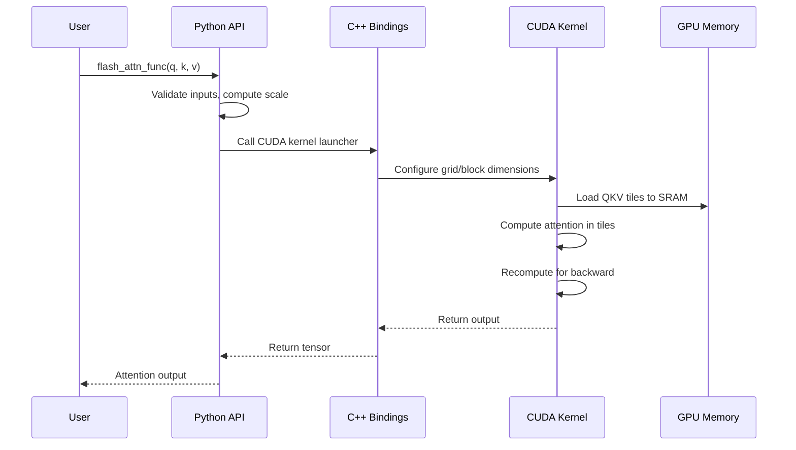
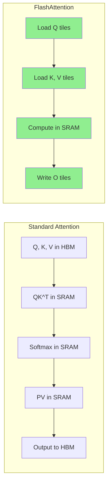

# Project Exploration: flash-attention

## Overview

FlashAttention is a high-performance implementation of the attention mechanism used in transformer models. This repository contains the official implementation of FlashAttention, FlashAttention-2, and FlashAttention-3 - a family of algorithms that make attention both faster and more memory-efficient.

The key innovation is an IO-aware approach that minimizes memory reads/writes by using tiling and recomputation techniques. This allows training transformers with longer sequences and larger models while using less memory and achieving significant speedups compared to standard attention implementations.

## Repository

- **Location:** `/home/darkvoid/Boxxed/@formulas/src.augmentcode/flash-attention`
- **Remote:** git@github.com:augmentcode/flash-attention
- **Primary Language:** CUDA C++, Python
- **License:** BSD (based on typical UC Berkeley licensing)

## Directory Structure

```
flash-attention/
├── csrc/
│   └── flash_attn/
│       ├── flash_api.cpp              # C++ API bindings for PyTorch
│       ├── flash.h                    # Core flash attention header
│       ├── block_info.h               # Block information structures
│       ├── dropout.h                  # Dropout implementation
│       ├── alibi.h                    # ALiBi (attention with linear bias)
│       └── *.cu                       # CUDA kernel implementations
│           ├── flash_bwd_hdim*_bf16_*.cu  # Backward pass (BF16)
│           └── flash_bwd_hdim*_fp16_*.cu  # Backward pass (FP16)
├── flash_attn/
│   ├── __init__.py                    # Package initialization
│   ├── flash_attention_interface.py   # Main Python interface
│   ├── flash_attn_triton.py           # Triton implementation
│   ├── modules/
│   │   └── mha.py                     # Multi-head attention layer
│   └── models/
│       └── gpt.py                     # Full GPT model implementation
├── hopper/
│   ├── setup.py                       # FlashAttention-3 build
│   └── test_flash_attn.py             # H100-specific tests
├── benchmarks/
│   ├── benchmark_flash_attention.py   # Main benchmarking script
│   ├── benchmark_alibi.py             # ALiBi benchmarking
│   ├── benchmark_causal.py            # Causal attention benchmarking
│   └── benchmark_gemm.py              # GEMM benchmarking
├── tests/
│   ├── test_flash_attn.py             # Main test suite
│   └── test_flash_attn_ck.py          # Composable Kernel tests (AMD)
├── training/
│   └── [GPT2/GPT3 training scripts]   # Training scripts for LLMs
├── assets/
│   ├── flashattn_banner.*             # Marketing banners
│   ├── flashattention_logo.png        # Project logo
│   ├── flash2_*.png                   # Performance charts
│   └── gpt*_*.jpg                     # Training efficiency charts
├── README.md                          # Main documentation
├── usage.md                           # Usage examples and adoption list
├── setup.py                           # Python package setup
├── Makefile                           # Build automation
└── LICENSE                            # License file
```

## Architecture

### High-Level Diagram

```mermaid
flowchart TB
    subgraph Python Interface
        PY[flash_attention_interface.py]
        MHA[modules/mha.py]
        GPT[models/gpt.py]
    end

    subgraph C++ Bindings
        CPP[csrc/flash_attn/flash_api.cpp]
    end

    subgraph CUDA Kernels
        FWD[Forward Kernels]
        BWD[Backward Kernels]
        TILING[Tiling Logic]
        SOFTMAX[Softmax Kernels]
    end

    subgraph Hardware
        NVIDIA[NVIDIA GPUs]
        AMD[AMD GPUs (ROCm)]
    end

    PY --> CPP
    MHA --> PY
    GPT --> PY
    CPP --> FWD
    CPP --> BWD
    FWD --> TILING
    FWD --> SOFTMAX
    BWD --> TILING
    FWD --> NVIDIA
    BWD --> NVIDIA
    FWD --> AMD
```

### Component Breakdown

#### Python Interface (`flash_attention_interface.py`)

**Location:** `flash_attn/flash_attention_interface.py`

**Purpose:** Main Python API for FlashAttention functions

**Key Functions:**
```python
flash_attn_qkvpacked_func(qkv, dropout_p, softmax_scale, causal, window_size, alibi_slopes, deterministic)
# Input: (batch_size, seqlen, 3, nheads, headdim)
# Output: (batch_size, seqlen, nheads, headdim)

flash_attn_func(q, k, v, dropout_p, softmax_scale, causal, window_size, alibi_slopes, deterministic)
# Supports MQA/GQA (Multi-Query/Grouped-Query Attention)

flash_attn_with_kvcache(q, k_cache, v_cache, k, v, rotary_cos, rotary_sin, ...)
# For incremental decoding with KV cache support
```

#### CUDA Kernels (`csrc/flash_attn/*.cu`)

**Location:** `csrc/flash_attn/`

**Purpose:** GPU-accelerated attention computation

**Key Files:**
- `flash_bwd_hdim{64,128,160,192,224,256}_fp16/bf16_*.cu` - Backward pass kernels for different head dimensions
- Support for causal and non-causal masking
- Different variants for FP16 and BF16 precision

**Kernel Organization:**
```
flash_bwd_hdim{HDIM}_bf16_causal_sm80.cu
                            │
                            ├── Target: SM80 (A100) or SM90 (H100)
                            ├── Precision: BF16 or FP16
                            ├── Head Dimension: 64-256
                            └── Masking: Causal or standard
```

#### Triton Implementation (`flash_attn_triton.py`)

**Location:** `flash_attn/flash_attn_triton.py`

**Purpose:** Alternative implementation using Triton DSL

**Advantages:**
- More readable and easier to modify than CUDA
- Closer to paper notation
- Experimental support for attention bias (ALiBi)

#### Multi-Head Attention Module (`modules/mha.py`)

**Location:** `flash_attn/modules/mha.py`

**Purpose:** Complete MHA layer including QKV projection and output projection

**Usage:**
```python
from flash_attn.modules.mha import MHA
mha = MHA(embed_dim, num_heads, dropout=0.0)
output = mha(qkv)
```

## Entry Points

### Package Installation

```bash
pip install flash-attn --no-build-isolation
```

### Main API Functions

```python
from flash_attn import flash_attn_func, flash_attn_qkvpacked_func

# Basic attention
output = flash_attn_func(q, k, v, softmax_scale=1/sqrt(d), causal=False)

# QKV packed (more efficient when q=k=v)
qkv = torch.stack([q, k, v], dim=2)  # (b, s, 3, h, d)
output = flash_attn_qkvpacked_func(qkv, causal=True)

# With KV cache for inference
output = flash_attn_with_kvcache(q, k_cache, v_cache, k, v,
                                   rotary_cos=cos, rotary_sin=sin,
                                   cache_seqlens=seqlens, causal=True)
```

### Execution Flow



## Data Flow

### FlashAttention Algorithm



**Key Innovation:** FlashAttention tiles the computation to fit in SRAM, avoiding repeated HBM accesses. The O(N²) attention matrix is never materialized in memory.

## External Dependencies

| Dependency | Version | Purpose |
|------------|---------|---------|
| PyTorch | 1.12+ | Deep learning framework |
| CUDA | 11.7+ | GPU compute platform (NVIDIA) |
| ROCm | 6.0+ | GPU compute platform (AMD) |
| packaging | Latest | Python package utilities |
| ninja | Latest | Fast parallel builds |

## Configuration

### Hardware Requirements

**NVIDIA CUDA:**
- CUDA 11.7+
- Ampere, Ada, or Hopper GPUs (A100, RTX 3090/4090, H100)
- FP16 and BF16 support
- Head dimensions up to 256

**AMD ROCm:**
- ROCm 6.0+
- MI200 or MI300 GPUs
- FP16 and BF16 support
- Forward head dim up to 256, backward up to 128

### Build Configuration

```bash
# Limit parallel compilation jobs (for low-memory systems)
MAX_JOBS=4 pip install flash-attn --no-build-isolation

# FlashAttention-3 (H100 only)
cd hopper
python setup.py install
```

## Testing

### Running Tests

```bash
# Main test suite
pytest -q -s tests/test_flash_attn.py

# ROCm/Composable Kernel tests
pytest tests/test_flash_attn_ck.py

# Hopper (FlashAttention-3) tests
export PYTHONPATH=$PWD
pytest -q -s test_flash_attn.py
```

### Test Coverage

Tests verify:
- Numerical correctness against PyTorch reference implementation
- Gradient correctness for backward pass
- Support for various head dimensions (64-256)
- Causal and non-causal masking
- ALiBi support
- KV cache functionality

## Performance

### Speedup Over Standard Attention

FlashAttention-2 provides 2x speedup over FlashAttention-1, and up to 6x speedup over standard PyTorch attention depending on sequence length.

**A100 80GB SXM5 (FP16/BF16):**
| Sequence Length | Speedup |
|-----------------|---------|
| 512             | ~2x     |
| 1K              | ~2.5x   |
| 2K              | ~3x     |
| 4K              | ~4x     |
| 8K              | ~5x     |
| 16K             | ~6x     |

**H100 SXM5 (FlashAttention-3):**
Additional 1.5-2x speedup over FlashAttention-2 on H100 GPUs.

### Memory Savings

Memory savings are proportional to sequence length:
- 2K sequences: 10x memory savings
- 4K sequences: 20x memory savings

This enables training with much longer sequences than standard attention.

## Key Insights

1. **IO-Awareness:** The key insight is that attention is memory-bound, not compute-bound. By minimizing HBM accesses, FlashAttention achieves significant speedups.

2. **Tiling:** The algorithm tiles the attention computation to fit in SRAM, processing one tile at a time while maintaining numerical equivalence to standard attention.

3. **Recomputation:** For the backward pass, FlashAttention recomputes some values instead of storing them, trading compute for memory savings.

4. **Evolution:** FlashAttention-2 improves parallelism and work partitioning. FlashAttention-3 is optimized specifically for H100's new features (FP8, TMA, etc.).

5. **Adoption:** FlashAttention has been widely adopted and is now used in major LLM training (GPT-3, LLaMA, etc.) and is integrated into PyTorch's scaled_dot_product_attention.

## Changelog Summary

| Version | Features |
|---------|----------|
| 2.0 | Complete rewrite, 2x faster |
| 2.1 | Changed causal mask alignment |
| 2.2 | Optimized KV cache for inference |
| 2.3 | Sliding window (local) attention |
| 2.4 | ALiBi support, deterministic backward |
| 2.5 | Paged KV cache (vLLM-style) |
| 2.6 | Attention softcapping (Gemma-2, Grok) |
| 3.0 | H100 optimization (beta) |

## Open Questions

1. What is the current status of FlashAttention-3 BF16 and FP8 support?
2. How does FlashAttention compare to alternative implementations like xformers or triton attention?
3. What are the specific TMA (Tensor Memory Accelerator) optimizations in FlashAttention-3?

## Related Papers

1. **FlashAttention:** [arXiv:2205.14135](https://arxiv.org/abs/2205.14135)
2. **FlashAttention-2:** [tridao.me/publications/flash2/flash2.pdf](https://tridao.me/publications/flash2/flash2.pdf)
3. **FlashAttention-3:** [tridao.me/publications/flash3/flash3.pdf](https://tridao.me/publications/flash3/flash3.pdf)

## Citation

```bibtex
@inproceedings{dao2022flashattention,
  title={Flash{A}ttention: Fast and Memory-Efficient Exact Attention with {IO}-Awareness},
  author={Dao, Tri and Fu, Daniel Y. and Ermon, Stefano and Rudra, Atri and R{\'e}, Christopher},
  booktitle={NeurIPS},
  year={2022}
}

@inproceedings{dao2023flashattention2,
  title={Flash{A}ttention-2: Faster Attention with Better Parallelism and Work Partitioning},
  author={Dao, Tri},
  booktitle={ICLR},
  year={2024}
}
```
