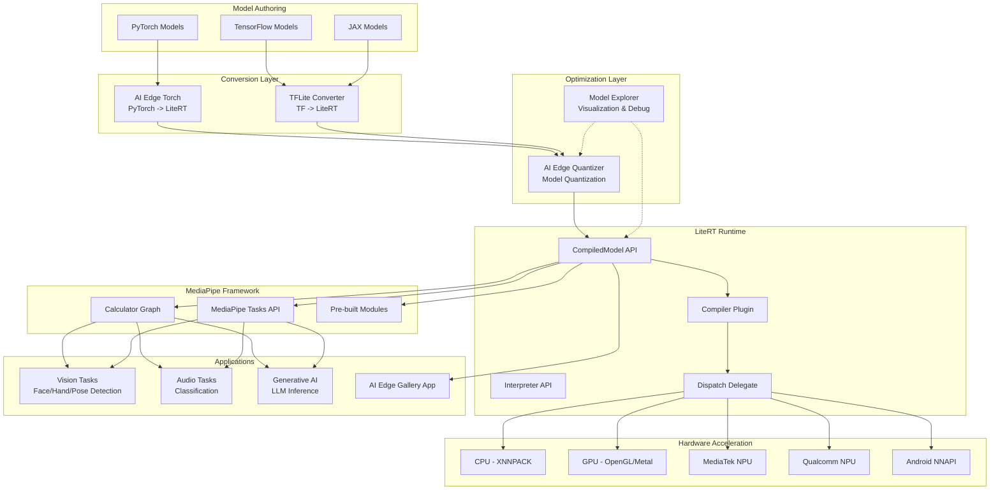
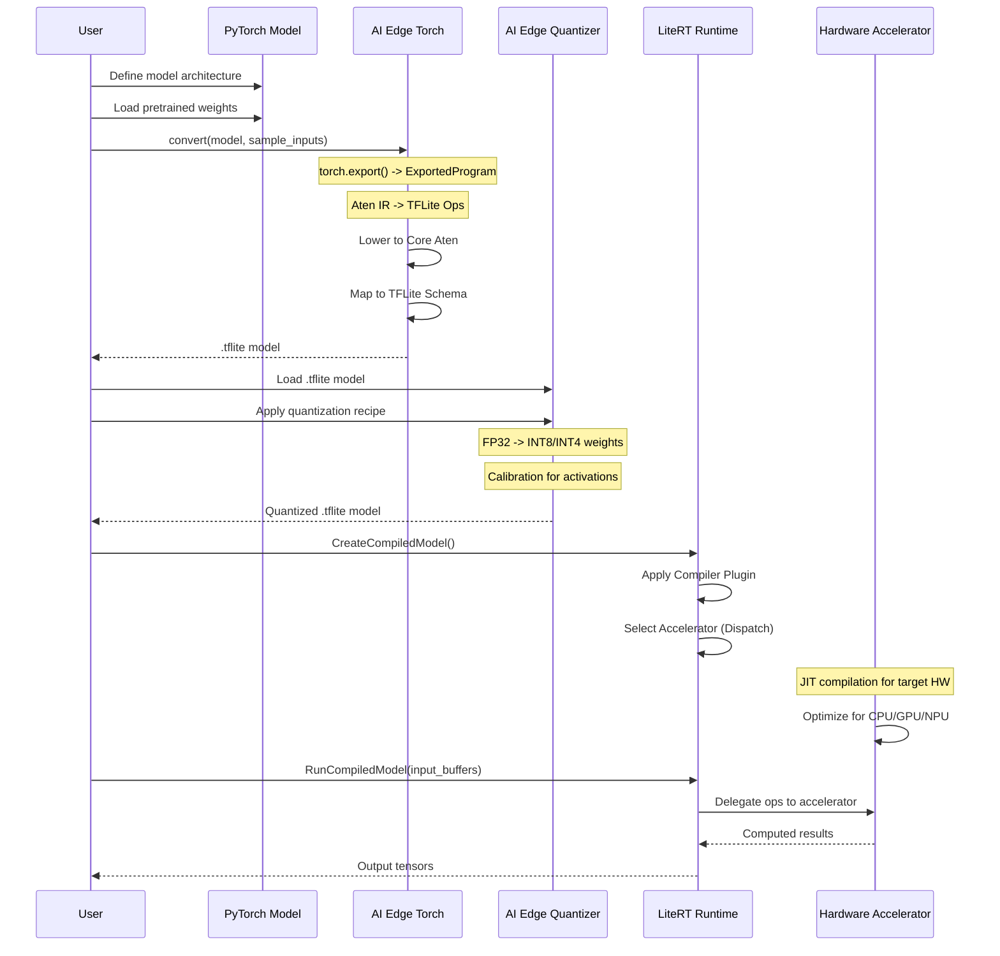
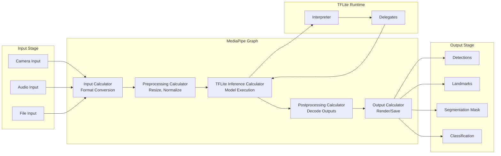
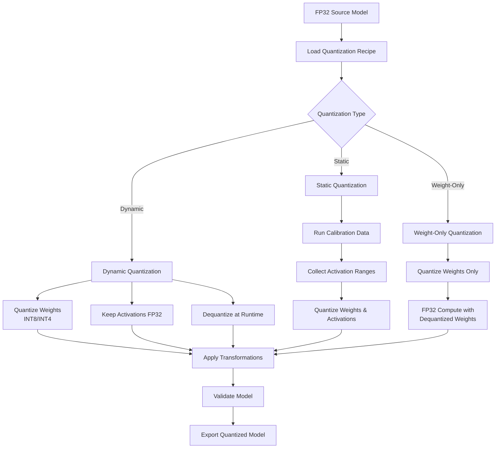

# Project Exploration: Google AI Edge Ecosystem

## Overview

The Google AI Edge ecosystem is a comprehensive suite of on-device machine learning and AI tools designed for deploying ML models to mobile, embedded, and edge devices. This collection brings together Google's flagship edge AI technologies, enabling developers to convert, optimize, quantize, and run models completely on-device without requiring cloud connectivity.

The ecosystem consists of several interconnected components: **LiteRT** (formerly TensorFlow Lite) serves as the high-performance runtime for on-device inference; **MediaPipe** provides a flexible framework for building ML pipelines that process video, audio, and sensor data; **AI Edge Torch** enables PyTorch-to-LiteRT conversion; **AI Edge Quantizer** offers advanced quantization for model optimization; and **Model Explorer** provides visualization and debugging capabilities for model graphs.

This stack powers real-time AI features in production applications including hand tracking, face detection, pose estimation, object detection, image segmentation, and increasingly, generative AI workloads like on-device LLMs. The entire pipeline from model authoring to deployment is designed for offline operation, making it ideal for privacy-sensitive applications and environments with limited connectivity.

## Repository

- **Location:** `/home/darkvoid/Boxxed/@formulas/src.google-ai-edge`
- **Remote:** N/A - not a git repository (source submodules from google-ai-edge GitHub organization)
- **Primary Language:** Python, C++, TypeScript
- **License:** Apache 2.0

## Directory Structure

```
/home/darkvoid/Boxxed/@formulas/src.google-ai-edge/
├── LiteRT/                          # Core on-device inference runtime (formerly TFLite)
│   ├── build/                       # Docker-based build infrastructure
│   ├── ci/                          # Continuous integration scripts and tools
│   ├── litert/                      # LiteRT Next API (new C/C++/Kotlin APIs)
│   │   ├── c/                       # Stable C API (74 header/source files)
│   │   ├── cc/                      # C++ API wrappers
│   │   ├── compiler/                # Model compiler and optimization passes
│   │   ├── core/                    # Shared compiler/runtime components
│   │   ├── runtime/                 # Runtime implementation
│   │   │   ├── accelerators/        # Hardware accelerator backends
│   │   │   │   ├── dispatch/        # Auto-accelerator selection
│   │   │   │   ├── xnnpack/         # XNNPACK CPU backend
│   │   │   │   ├── gpu/             # GPU acceleration
│   │   │   │   ├── mediatek/        # MediaTek NPU support
│   │   │   │   └── qualcomm/        # Qualcomm NPU support
│   │   │   ├── dispatch/            # Delegate dispatch mechanism
│   │   │   └── compiler/            # JIT compilation support
│   │   ├── kotlin/                  # Kotlin language bindings
│   │   ├── python/                  # Python bindings
│   │   ├── samples/                 # Sample applications
│   │   ├── sdk_util/                # SDK utilities
│   │   ├── tools/                   # Benchmark and profiling tools
│   │   └── vendors/                 # Vendor-specific implementations
│   ├── tflite/                      # Legacy TensorFlow Lite runtime
│   │   ├── acceleration/            # Acceleration configuration
│   │   ├── c/                       # TFLite C API
│   │   ├── core/                    # Core interpreter implementation
│   │   ├── delegates/               # Hardware delegation layers
│   │   │   ├── gpu/                 # GPU delegate (OpenGL/Metal)
│   │   │   ├── xnnpack/             # XNNPACK delegate
│   │   │   ├── hexagon/             # Qualcomm Hexagon DSP
│   │   │   ├── coreml/              # Apple CoreML
│   │   │   └── external/            # External delegate framework
│   │   ├── kernels/                 # Operator implementations
│   │   ├── nnapi/                   # Android NNAPI integration
│   │   ├── python/                  # Python interpreter
│   │   ├── schema/                  # FlatBuffer schema definitions
│   │   └── tools/                   # Command-line tools
│   └── third_party/                 # Third-party dependencies
│
├── ai-edge-torch/                   # PyTorch to LiteRT conversion
│   ├── ai_edge_torch/
│   │   ├── _convert/                # Core conversion logic
│   │   ├── fx_infra/                # Torch FX infrastructure
│   │   ├── generative/              # GenAI/LLM support APIs
│   │   ├── lowertools/              # Low-level torch operations
│   │   ├── odml_torch/              # On-device ML Torch utilities
│   │   ├── quantize/                # Quantization-aware training
│   │   └── examples/                # Conversion examples
│   ├── bazel/                       # Bazel build configuration
│   ├── docs/                        # PyTorch converter documentation
│   └── test/                        # E2E tests
│
├── ai-edge-quantizer/               # Model quantization tools
│   ├── ai_edge_quantizer/
│   │   ├── algorithms/              # Quantization algorithms
│   │   │   ├── uniform_quantize/    # Uniform quantization
│   │   │   └── nonlinear_quantize/  # Non-linear quantization
│   │   ├── policies/                # Quantization policies
│   │   ├── recipes/                 # Pre-built quantization recipes
│   │   ├── transformations/         # Graph transformations
│   │   ├── utils/                   # Utility functions
│   │   ├── calibrator.py            # Calibration for static quantization
│   │   ├── quantizer.py             # Main quantizer API
│   │   └── recipe_manager.py        # Recipe management
│   ├── colabs/                      # Jupyter notebooks
│   │   ├── getting_started.ipynb
│   │   ├── selective_quantization_isnet.ipynb
│   │   └── torch_convert_and_quantize.ipynb
│   └── test_pip_package.sh
│
├── ai-edge-apis/                    # On-device AI API definitions
│   ├── local_agents/
│   │   ├── core/                    # Core agent infrastructure
│   │   ├── function_calling/        # Function calling API
│   │   └── rag/                     # RAG (Retrieval Augmented Generation)
│   ├── litert_tools/                # LiteRT tooling APIs
│   ├── examples/                    # Example implementations
│   └── third_party/                 # Third-party dependencies
│
├── mediapipe/                       # Cross-platform ML pipeline framework
│   ├── mediapipe/
│   │   ├── calculators/             # Processing nodes (calculators)
│   │   │   ├── audio/               # Audio processing calculators
│   │   │   ├── image/               # Image processing calculators
│   │   │   ├── tensor/              # Tensor operations
│   │   │   ├── tflite/              # TFLite inference calculators
│   │   │   └── video/               # Video processing calculators
│   │   ├── framework/               # Core framework components
│   │   │   ├── CalculatorGraph    # Graph execution engine
│   │   │   ├── Packet               # Data passing mechanism
│   │   │   ├── Executor             # Thread pool execution
│   │   │   └── Timestamp            # Timestamp management
│   │   ├── gpu/                     # GPU processing infrastructure
│   │   ├── tasks/                   # High-level task APIs
│   │   │   ├── cc/                  # C++ task implementations
│   │   │   │   ├── core/            # Task infrastructure
│   │   │   │   ├── vision/          # Vision tasks
│   │   │   │   ├── audio/           # Audio tasks
│   │   │   │   ├── text/            # Text tasks
│   │   │   │   └── genai/           # Generative AI tasks
│   │   │   ├── java/                # Java bindings
│   │   │   ├── python/              # Python bindings
│   │   │   └── web/                 # Web/JS bindings
│   │   ├── modules/                 # Pre-built module graphs
│   │   │   ├── face_detection/
│   │   │   ├── face_landmark/
│   │   │   ├── hand_landmark/
│   │   │   ├── pose_detection/
│   │   │   └── selfie_segmentation/
│   │   ├── model_maker/             # Model customization tools
│   │   ├── python/                  # Python bindings
│   │   └── web/                     # Web/JavaScript support
│   ├── docs/                        # Documentation
│   ├── examples/                    # Example applications (Android, iOS, Desktop)
│   └── third_party/                 # Dependencies (OpenCV, TensorFlow, etc.)
│
├── mediapipe-samples/               # MediaPipe sample implementations
│   ├── codelabs/                    # Step-by-step tutorials
│   ├── examples/                    # Task-specific examples
│   │   ├── face_landmarker/
│   │   ├── hand_landmarker/
│   │   ├── image_classification/
│   │   ├── image_segmentation/
│   │   ├── object_detection/
│   │   ├── pose_landmarker/
│   │   ├── llm_inference/
│   │   └── image_generation/
│   └── tutorials/                   # Beginner tutorials
│
├── model-explorer/                  # Model visualization/debugging tool
│   ├── src/
│   │   ├── builtin-adapter/         # Built-in model format adapters
│   │   │   ├── tflite/              # TFLite adapter
│   │   │   ├── pytorch/             # PyTorch ExportedProgram adapter
│   │   │   ├── tfjs/                # TensorFlow.js adapter
│   │   │   └── mlir/                # MLIR adapter
│   │   ├── server/                  # Local development server
│   │   ├── ui/                      # Web-based visualizer UI
│   │   ├── example_adapters/        # Example custom adapters
│   │   └── custom_element_demos/    # Web component demos
│   ├── ci/                          # CI scripts
│   ├── example_colabs/              # Colab notebooks
│   └── test/                        # Tests
│
├── litert-samples/                  # LiteRT usage examples
│   └── examples/
│       ├── audio_classification/
│       ├── digit_classifier/
│       ├── image_classification/
│       ├── image_segmentation/
│       ├── object_detection/
│       ├── reinforcement_learning/
│       ├── super_resolution/
│       └── text_classification/
│
├── models-samples/                  # Sample models and conversion notebooks
│   ├── convert_jax/                 # JAX to LiteRT conversion
│   └── convert_pytorch/             # PyTorch conversion examples
│       ├── DIS_segmentation_and_quantization.ipynb
│       ├── Image_classification_with_convnext_v2.ipynb
│       └── SegNext_segmentation_and_quantization.ipynb
│
└── gallery/                         # Model gallery Android app
    ├── Android/                     # Android app source
    └── model_allowlist.json         # Allowed models configuration
```

## Architecture

### High-Level Architecture



### Model Conversion Flow (PyTorch/TensorFlow -> LiteRT)



### MediaPipe Pipeline Architecture



### Quantization Process



## Component Breakdown

### LiteRT Runtime

#### LiteRT Next (CompiledModel API)

- **Location:** `LiteRT/litert/c/`, `LiteRT/litert/cc/`
- **Purpose:** New high-level API for on-device inference with automatic accelerator selection and async execution
- **Key Features:**
  - Streamlined model loading without separate builder step
  - Automatic hardware accelerator selection via Dispatch Delegate
  - Native hardware buffer interoperability (zero-copy with Android Hardware Buffers, OpenCL, OpenGL)
  - True async execution using sync fences
- **Dependencies:** TFLite runtime internals, vendor SDKs (MediaTek, Qualcomm)
- **Dependents:** MediaPipe Tasks, Gallery app, custom applications

**Core C API Files:**
| File | Purpose |
|------|---------|
| `litert_common.h` | Common types and status codes |
| `litert_model.h` | Model representation and loading |
| `litert_compiled_model.h` | High-level compiled model API |
| `litert_accelerator.h` | Hardware accelerator interface |
| `litert_tensor_buffer.h` | Buffer management for I/O |
| `litert_options.h` | Compilation and runtime options |
| `options/litert_gpu_options.h` | GPU-specific configuration |
| `options/litert_qualcomm_options.h` | Qualcomm NPU configuration |
| `options/litert_mediatek_options.h` | MediaTek NPU configuration |

#### TFLite Interpreter API (Legacy)

- **Location:** `LiteRT/tflite/`
- **Purpose:** Original TFLite interpreter API, still widely used
- **Key Files:** `interpreter.h`, `model.h`, `context.h`
- **Status:** Legacy, new development should use LiteRT Next API

#### Compiler Plugin

- **Location:** `LiteRT/litert/compiler/`
- **Purpose:** Model optimization and transformation during loading
- **Features:**
  - Graph optimization passes
  - Operator fusion
  - Memory planning
  - Hardware-specific code generation

#### Dispatch Delegate

- **Location:** `LiteRT/litert/runtime/dispatch/`, `LiteRT/litert/runtime/accelerators/`
- **Purpose:** Automatic accelerator selection and operation partitioning
- **Mechanism:** Analyzes model graph, partitions operations to best available hardware (CPU, GPU, NPU)
- **Supported Backends:**
  - XNNPACK (CPU)
  - GPU (OpenGL ES, Metal)
  - MediaTek NPU
  - Qualcomm NPU
  - Google Tensor

### MediaPipe Framework

#### Calculator Graph

- **Location:** `mediapipe/mediapipe/framework/`
- **Purpose:** Core execution engine for ML pipelines
- **Key Concepts:**
  - **Calculator:** Processing node that consumes and produces packets
  - **Packet:** Data container with timestamp
  - **InputStream/OutputStream:** Typed connections between calculators
  - **SidePacket:** Configuration data available throughout graph execution
  - **Timestamp:** Monotonically increasing time base for synchronization

**Execution Flow:**
1. `Initialize(config)` - Parse graph configuration
2. `Open()` - Open all calculators, allocate resources
3. `Process()` - Process packets as they arrive on input streams
4. `Close()` - Clean up resources

#### TFLite Calculators

- **Location:** `mediapipe/mediapipe/calculators/tflite/`
- **Key Calculators:**
| Calculator | Purpose |
|------------|---------|
| `TfliteModelCalculator` | Load TFLite model from file |
| `TfliteInferenceCalculator` | Run model inference on input tensors |
| `TfliteConverterCalculator` | Convert between image and tensor formats |
| `TfliteTensorsToDetectionsCalculator` | Decode detection outputs |
| `TfliteTensorsToLandmarksCalculator` | Decode landmark/keypoint outputs |
| `TfliteTensorsToSegmentationCalculator` | Decode segmentation masks |
| `TfliteCustomOpResolverCalculator` | Register custom operators |

#### MediaPipe Tasks API

- **Location:** `mediapipe/mediapipe/tasks/`
- **Purpose:** High-level, task-specific APIs built on MediaPipe Framework
- **Available Tasks:**
  - **Vision:** FaceDetector, FaceLandmarker, HandLandmarker, PoseLandmarker, ImageClassifier, ImageSegmenter, ObjectDetector, GestureRecognizer
  - **Audio:** AudioClassifier
  - **Text:** TextClassifier, TextEmbedder
  - **GenAI:** LlmInference, ImageGenerator

**Task Architecture:**
```
BaseOptions (file, model type)
    -> TaskOptions (task-specific config)
        -> Task (creates ModelResources, runs inference)
            -> Results (task-specific output type)
```

#### Model Maker

- **Location:** `mediapipe/mediapipe/model_maker/`
- **Purpose:** Customize models with user data
- **Supports:** Image classification, object detection, question answering, text classification

### AI Edge Torch

- **Location:** `ai-edge-torch/ai_edge_torch/`
- **Purpose:** Convert PyTorch models to LiteRT format
- **Key Components:**

**Conversion Pipeline:**
1. `torch.export()` - Capture PyTorch model as ExportedProgram
2. Core ATen decomposition - Lower to core operators
3. Operator mapping - Map Aten ops to TFLite ops
4. Graph optimization - Apply TFLite optimizations
5. Export - Serialize to .tflite FlatBuffer

**Generative API:**
- **Location:** `ai_edge_torch/generative/`
- **Purpose:** Support for LLMs and transformer models
- **Features:**
  - KV cache optimization
  - Streaming decoding
  - Quantization-aware export

### AI Edge Quantizer

- **Location:** `ai-edge-quantizer/ai_edge_quantizer/`
- **Purpose:** Post-training quantization for LiteRT models
- **Key Modules:**

| Module | Purpose |
|--------|---------|
| `quantizer.py` | Main entry point, `Quantizer` class |
| `recipe_manager.py` | Recipe parsing and management |
| `calibrator.py` | Calibration for static quantization |
| `algorithms/` | Quantization algorithm implementations |
| `transformations/` | Graph transformations for quantization |
| `policies/` | Default quantization policies |

**Quantization Recipes:**
| Recipe | Weights | Activations | Use Case |
|--------|---------|-------------|----------|
| `DYNAMIC_WI8_AFP32` | INT8 | FP32 | General purpose |
| `DYNAMIC_WI4_AFP32` | INT4 | FP32 | LLMs, memory-constrained |
| `STATIC_WI8_AI16` | INT8 | INT16 | High accuracy |
| `STATIC_WI8_AI8` | INT8 | INT8 | Maximum performance |
| `WEIGHTONLY_WI8_AFP32` | INT8 | FP32 | GenAI models |

**Supported Operators:**
FULLY_CONNECTED, CONV_2D, BATCH_MATMUL, EMBEDDING_LOOKUP, DEPTHWISE_CONV_2D, CONV_2D_TRANSPOSE, AVERAGE_POOL_2D, SOFTMAX, GELU, ADD, MUL, and more.

### Model Explorer

- **Location:** `model-explorer/src/`
- **Purpose:** Interactive model graph visualization and debugging
- **Supported Formats:** TFLite, TensorFlow, PyTorch (ExportedProgram), MLIR, TensorFlow.js
- **Features:**
  - Hierarchical layer visualization
  - Node search and filtering
  - Metadata overlay on nodes
  - Input/output highlighting
  - GPU-accelerated graph rendering
  - Custom adapter framework

**Architecture:**
```
Server (Python/Flask)
    -> Builtin Adapters (TFLite, PyTorch, TF, MLIR, TFJS)
    -> Graph Data Model
    -> Web UI (TypeScript/React)
        -> D3-based Graph Visualization
```

### Gallery App

- **Location:** `gallery/Android/`
- **Purpose:** Experimental app for exploring on-device GenAI models
- **Features:**
  - Model switching (Hugging Face integration)
  - Text chat (multi-turn LLM)
  - Ask Image (visual question answering)
  - Prompt Lab (single-turn use cases)
  - Performance metrics (TTFT, decode speed)
  - BYOM (Bring Your Own Model) support

## Entry Points

### LiteRT Inference (C API)

```c
// 1. Create environment
LiteRtEnvironment env;
LiteRtCreateEnvironment(&env);

// 2. Load model
LiteRtModel model;
LiteRtLoadModelFromPath(env, "model.tflite", &model);

// 3. Create compilation options (select accelerator)
LiteRtOptions options;
LiteRtCreateOptions(env, &options);
LiteRtOptionsSetGpuEnabled(options, true);

// 4. Compile model
LiteRtCompiledModel compiled;
LiteRtCreateCompiledModel(env, model, options, &compiled);

// 5. Get buffer requirements
LiteRtTensorBufferRequirements input_reqs;
LiteRtGetCompiledModelInputBufferRequirements(compiled, 0, 0, &input_reqs);

// 6. Create input/output buffers
LiteRtTensorBuffer input_buffer, output_buffer;
LiteRtCreateTensorBuffer(..., &input_buffer);
LiteRtCreateTensorBuffer(..., &output_buffer);

// 7. Fill input buffer with data
LiteRtTensorBufferCopyFromMemory(input_buffer, input_data, size);

// 8. Run inference
LiteRtRunCompiledModel(compiled, 0, 1, &input_buffer, 1, &output_buffer);

// 9. Read output
void* output_data;
LiteRtTensorBufferCopyToMemory(output_buffer, &output_data, &size);

// 10. Cleanup
LiteRtDestroyTensorBuffer(input_buffer);
LiteRtDestroyTensorBuffer(output_buffer);
LiteRtDestroyCompiledModel(compiled);
LiteRtDestroyModel(model);
LiteRtDestroyEnvironment(env);
```

### MediaPipe Task (Python)

```python
import mediapipe as mp

# 1. Initialize task
BaseOptions = mp.tasks.BaseOptions
ImageClassifier = mp.tasks.vision.ImageClassifier

options = mp.tasks.vision.ImageClassifierOptions(
    base_options=BaseOptions(model_asset_path="model.tflite"),
    running_mode=mp.tasks.vision.RunningMode.IMAGE
)

classifier = ImageClassifier.create_from_options(options)

# 2. Load image
image = mp.Image.create_from_file("image.jpg")

# 3. Run inference
result = classifier.classify(image)

# 4. Process results
for category in result.classifications[0].categories:
    print(f"{category.category_name}: {category.score}")

# 5. Cleanup
classifier.close()
```

### PyTorch to LiteRT Conversion

```python
import torch
import ai_edge_torch

# 1. Load PyTorch model
model = torch.load("model.pth")
model.eval()

# 2. Define sample inputs
sample_inputs = (torch.randn(1, 3, 224, 224),)

# 3. Convert to LiteRT
edge_model = ai_edge_torch.convert(model, sample_inputs)

# 4. Export to .tflite
edge_model.export("model.tflite")
```

### Quantization

```python
from ai_edge_quantizer import quantizer, recipe

# 1. Load source model
qt = quantizer.Quantizer("model_fp32.tflite")

# 2. Load quantization recipe
qt.load_quantization_recipe(
    recipe.dynamic_wi8_afp32()  # Dynamic INT8 weights, FP32 activations
)

# 3. Quantize and export
result = qt.quantize()
result.export_model("model_int8.tflite")
```

## Data Flow

### End-to-End ML Pipeline

```mermaid
flowchart LR
    subgraph "1. Model Development"
        A[PyTorch/TF/JAX<br/>Model Definition]
        B[Training &<br/>Validation]
    end

    subgraph "2. Conversion"
        C[AI Edge Torch<br/>or TFL Converter]
        D[.tflite<br/>FlatBuffer]
    end

    subgraph "3. Optimization"
        E[Model Explorer<br/>Visualization]
        F[AI Edge Quantizer<br/>INT8/INT4]
    end

    subgraph "4. Integration"
        G[MediaPipe Graph<br/>or Tasks API]
        H[Pre/Post Processing<br/>Calculators]
    end

    subgraph "5. Deployment"
        I[LiteRT Runtime<br/>CompiledModel]
        J[Hardware<br/>Acceleration]
    end

    A --> B --> C --> D --> E --> F --> G --> H --> I --> J
```



## External Dependencies

| Dependency | Version | Purpose |
|------------|---------|---------|
| Bazel | 6.x+ | Build system |
| TensorFlow | 2.x | Model conversion, TFLite |
| PyTorch | >=2.4.0 | Source framework for conversion |
| XNNPACK | Latest | CPU acceleration backend |
| FlatBuffers | Latest | Model serialization format |
| OpenCL/OpenGL | ES 3.1+ | GPU acceleration |
| ONNX Runtime | Optional | Alternative runtime |
| OpenCV | 4.x | Image processing in MediaPipe |
| Protocol Buffers | 3.x | Configuration serialization |
| NumPy | Latest | Python array operations |
| absl | Latest | Google utility library |

## Configuration

### Build Configuration

LiteRT and MediaPipe use Bazel as the primary build system. Key configuration files:
- `WORKSPACE` - External dependencies
- `BUILD` / `BUILD.bazel` - Build targets
- `.bazelrc` - Build flags

### Runtime Configuration

**LiteRT Accelerator Selection:**
```python
# Via CompiledModel options
options = LiteRtOptions()
options.set_cpu_num_threads(4)
options.enable_gpu()
# Or via vendor-specific options
options.set_qualcomm_options(QualcommOptions())
```

**MediaPipe Graph Configuration:**
```pbtxt
# Calculator graph config
num_threads: 4
default_executor: "AUTO"

calculators: {
  calculator: "TfliteInferenceCalculator"
  input_stream: "TENSOR:input_tensor"
  output_stream: "TENSOR:output_tensor"
  options: {
    [mediapipe.TfliteInferenceCalculatorOptions.ext]: {
      model_file: "model.tflite"
      use_xnnpack: true
    }
  }
}
```

### Environment Variables

| Variable | Purpose |
|----------|---------|
| `LITERT_DELEGATES` | Force specific delegate |
| `TF_CPP_MIN_LOG_LEVEL` | TensorFlow logging level |
| `MEDIAPIPE_MODEL_BUNDLE` | Model bundle path |

## Testing

### LiteRT Testing

- **Location:** `LiteRT/litert/test/`, `LiteRT/litert/integration_test/`
- **Strategy:** Unit tests for C/C++ APIs, integration tests for full inference
- **Test Types:**
  - Model loading tests
  - Accelerator compatibility tests
  - Buffer interoperability tests
  - Async execution tests
  - Metrics collection tests

### MediaPipe Testing

- **Location:** `mediapipe/mediapipe/framework/*_test.cc`
- **Strategy:** Per-calculator tests, full graph tests
- **Test Types:**
  - Calculator unit tests
  - Graph integration tests
  - GPU tests with mock buffers
  - End-to-end pipeline tests

### AI Edge Torch Testing

- **Location:** `ai-edge-torch/test/`, `ai-edge-torch/ai_edge_torch/e2e_tests/`
- **Strategy:** Convert known models, compare outputs with PyTorch
- **Coverage:** Vision models, LLMs, transformers

### Quantizer Testing

- **Location:** `ai-edge-quantizer/ai_edge_quantizer/algorithms/*_test.py`
- **Strategy:** Per-operator architecture tests, accuracy validation
- **Test Types:**
  - Op architecture tests for each supported operator
  - Accuracy tests comparing FP32 vs quantized outputs
  - Calibration correctness tests

## Key Insights

### LiteRT Architecture

1. **Two API Generations:** LiteRT exists in two parallel forms - the legacy TFLite Interpreter API and the new LiteRT Next (CompiledModel) API. New development should target CompiledModel API for better hardware support and simpler APIs.

2. **Dispatch Delegate Magic:** The Dispatch Delegate is the key innovation in LiteRT Next - it automatically analyzes the model graph and partitions operations across available hardware (CPU, GPU, NPU) without manual delegate configuration.

3. **Zero-Copy Buffers:** LiteRT Next supports native hardware buffer interoperability, allowing direct use of Android Hardware Buffers, OpenCL buffers, and OpenGL textures without CPU memory copies. This is critical for real-time video processing.

4. **Vendor SDKs:** Hardware acceleration for NPUs (MediaTek, Qualcomm) is implemented via vendor-provided SDKs that JIT-compile model subgraphs to vendor-specific instruction formats.

### MediaPipe Integration

1. **Calculator-Based Pipelines:** MediaPipe's power comes from its calculator-based architecture where each processing step (preprocessing, inference, postprocessing) is an independent, reusable calculator.

2. **TFLite Integration:** The `TfliteInferenceCalculator` is the bridge between MediaPipe and LiteRT, handling model loading, tensor allocation, and inference execution.

3. **Task Abstraction:** MediaPipe Tasks provide a higher-level API that hides the complexity of graph configuration, making it easier to integrate common vision, audio, and text tasks.

4. **Cross-Platform:** MediaPipe runs on Android, iOS, Web (WASM/WebGPU), and desktop (Linux, macOS, Windows) with consistent APIs.

### Quantization Strategy

1. **Recipe-Driven:** Quantization is recipe-driven, allowing fine-grained control over which operators get quantized and with what precision.

2. **Dynamic vs Static:** Dynamic quantization quantizes weights at model load time and keeps activations in FP32. Static quantization quantizes both weights and activations, requiring calibration data.

3. **GenAI Focus:** Weight-only quantization (INT4/INT8 weights, FP32 compute) is optimized for LLMs where memory bandwidth is the bottleneck.

### Conversion Pipeline

1. **Torch Export Foundation:** AI Edge Torch builds on `torch.export()` to capture PyTorch models as ExportedProgram, then lowers to Core Aten operators before mapping to TFLite schema.

2. **Operator Coverage:** The conversion success depends on operator coverage - models using unsupported PyTorch ops may fail conversion or require custom op registration.

## Open Questions

1. **NPU Availability:** The LiteRT NPU acceleration is available through an Early Access Program - what is the general availability timeline and which specific chipsets are supported?

2. **GenAI Performance:** What are the expected performance characteristics (tokens/second, memory footprint) for various LLM sizes (1B, 3B, 7B parameters) on different device classes?

3. **Custom Operators:** What is the recommended approach for registering and implementing custom operators that aren't in the TFLite schema?

4. **Training on Edge:** Are there any plans for on-device training/fine-tuning capabilities, or is the focus purely on inference?

5. **WebGPU Backend:** MediaPipe Web mentions WebGPU support - what is the current status and performance compared to WASM?

6. **Model Compression:** Beyond quantization, are there plans for other compression techniques like pruning or knowledge distillation in the AI Edge toolkit?

7. **Debugging Support:** What debugging tools exist for diagnosing poor quantization accuracy or accelerator fallback issues?

## Testing Strategies

### Unit Testing

- **C/C++ APIs:** GoogleTest-based unit tests for each API surface
- **Python APIs:** PyTest-based tests with mock models
- **Calculators:** Per-calculator tests with synthetic input packets

### Integration Testing

- **Model Tests:** End-to-end inference tests with known-good models
- **Graph Tests:** Full MediaPipe graph execution tests
- **Cross-Platform:** Tests on Android, iOS, and desktop targets

### Performance Testing

- **Benchmark Tool:** LiteRT includes a benchmark_model tool for latency measurement
- **Metrics API:** HW-specific metrics collection (memory bandwidth, compute utilization)
- **Power Profiling:** Power consumption measurement on supported devices

### Accuracy Testing

- **Golden Comparison:** Compare quantized model outputs against FP32 reference
- **Dataset Evaluation:** Evaluate on validation datasets to measure accuracy degradation
- **Operator Tests:** Per-operator numerical correctness tests

## Getting Started

1. **Install LiteRT:**
   ```bash
   pip install tflite-runtime  # Or build from source
   ```

2. **Install AI Edge Torch:**
   ```bash
   pip install ai-edge-torch
   ```

3. **Install AI Edge Quantizer:**
   ```bash
   pip install ai-edge-quantizer-nightly
   ```

4. **Install Model Explorer:**
   ```bash
   pip install ai-edge-model-explorer
   model-explorer  # Launch web UI
   ```

5. **Install MediaPipe:**
   ```bash
   pip install mediapipe
   ```

This exploration provides a foundation for understanding the Google AI Edge ecosystem. For hands-on work, start with the sample code in `litert-samples/` and `mediapipe-samples/`, and use Model Explorer to visualize model graphs during development.
