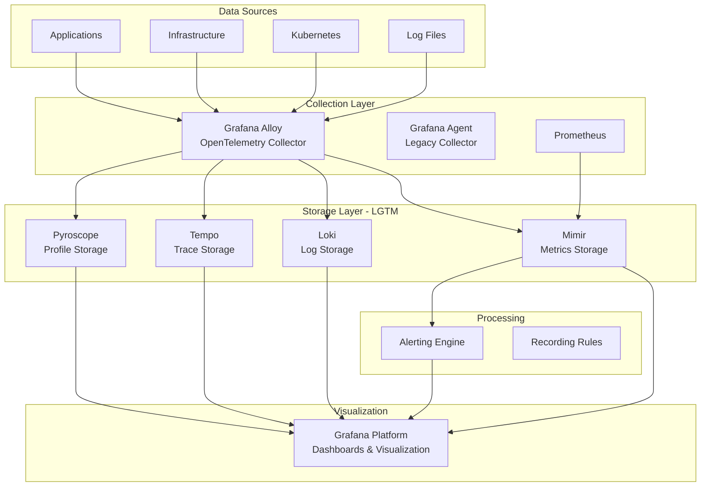
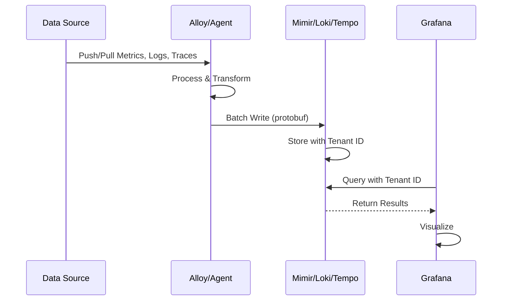
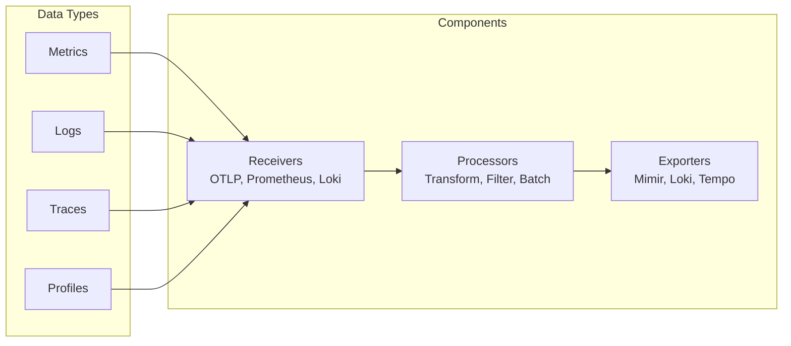
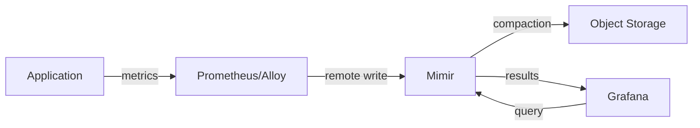
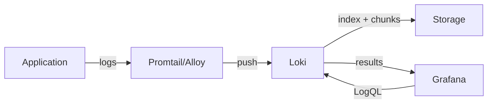
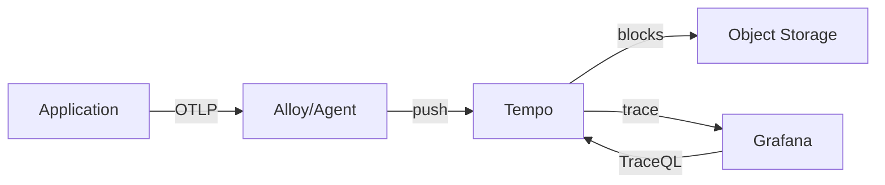

# Project Exploration: Grafana Ecosystem

## Overview

This exploration covers the comprehensive Grafana observability ecosystem located at `/home/darkvoid/Boxxed/@formulas/src.graphana`. The directory contains 28+ individual repositories that make up the complete Grafana LGTM stack (Loki, Grafana, Tempo, Mimir) plus supporting tools and services.

The Grafana ecosystem represents one of the most complete open-source observability platforms available, providing:

- **Metrics**: Mimir (long-term Prometheus storage) and Grafana for visualization
- **Logs**: Loki for log aggregation and querying
- **Traces**: Tempo for distributed tracing
- **Profiling**: Pyroscope for continuous profiling
- **Collection**: Alloy and Agent for OTel-based telemetry collection
- **Testing**: k6 for load testing

The ecosystem is built primarily in Go (backend services) with TypeScript/React (frontend), and increasingly Rust (performance-critical components like augurs for ML-based anomaly detection).

## Repository

- **Location:** `/home/darkvoid/Boxxed/@formulas/src.graphana`
- **Remote:** N/A - contains multiple independent repositories
- **Primary Languages:** Go, TypeScript, Rust
- **License:** Apache-2.0 (AGPL-3.0 for some components like Grafana core)

## Directory Structure

```
/home/darkvoid/Boxxed/@formulas/src.graphana/
├── agent/                          # Grafana Agent - telemetry collector (deprecated, migrating to Alloy)
├── alerting/                       # Alerting engine - notification and rule evaluation
├── alloy/                          # Grafana Alloy - OpenTelemetry collector distribution
├── augurs/                         # ML-based time series anomaly detection (Rust)
├── cog/                            # Code generation for Grafana SDKs
├── dskit/                          # Distributed systems toolkit - shared Go libraries
├── gotip/                          # Go tip tooling
├── grafana/                        # Main Grafana observability platform and UI
├── grafana-ci-otel-collector/      # CI-specific OpenTelemetry collector
├── intro-to-mltp/                  # ML training platform examples
├── k6/                             # Load testing tool
├── killercoda/                     # Interactive tutorial scenarios
├── levitate/                       # JavaScript/TypeScript package analysis tool
├── loki/                           # Log aggregation system
├── mcp-grafana/                    # Model Context Protocol for Grafana
├── mimir/                          # Long-term storage for Prometheus
├── oats/                           # OpenAPI testing tools
├── opensearch-datasource/          # OpenSearch integration for Grafana
├── otel-checker/                   # OpenTelemetry validation
├── pyroscope/                      # Continuous profiling platform
├── pyroscope-rs/                   # Pyroscope Rust components
├── scenes/                         # Grafana Scenes - dynamic dashboard framework
├── smtprelay/                      # SMTP relay service for notifications
├── tanka/                          # Kubernetes configuration tool (Jsonnet)
├── tempo/                          # Distributed tracing backend
└── tempo-operator/                 # Kubernetes operator for Tempo
```

## Architecture

### High-Level LGTM Stack Architecture



### Data Flow: Collection to Visualization



### Alloy/Agent Collection Pipeline



## Component Breakdown

### Core LGTM Stack

#### Grafana
- **Location:** `/home/darkvoid/Boxxed/@formulas/src.graphana/grafana`
- **Purpose:** Main observability platform providing dashboards, visualization, and data exploration
- **Dependencies:** All LGTM components, Prometheus, various datasources
- **Dependents:** End users, alerting system, Scenes
- **Key Features:**
  - Multi-datasource queries
  - Dashboard management
  - Alerting UI
  - Plugin ecosystem
  - RBAC and multi-tenancy

#### Loki
- **Location:** `/home/darkvoid/Boxxed/@formulas/src.graphana/loki`
- **Purpose:** Horizontally scalable log aggregation system
- **Dependencies:** dskit, Prometheus components
- **Dependents:** Grafana, LogCLI, operators
- **Key Features:**
  - Label-based indexing (like Prometheus)
  - LogQL query language
  - Multi-tenancy support
  - Cloud storage integration (S3, GCS, Azure)
  - Bloom filters for fast log filtering

#### Mimir
- **Location:** `/home/darkvoid/Boxxed/@formulas/src.graphana/mimir`
- **Purpose:** Long-term storage for Prometheus metrics
- **Dependencies:** dskit, Prometheus, Thanos objstore
- **Dependents:** Grafana, recording rules, alerting
- **Key Features:**
  - Horizontal scalability
  - Query federation
  - Recording rules at scale
  - Multi-tenancy
  - Efficient compression

#### Tempo
- **Location:** `/home/darkvoid/Boxxed/@formulas/src.graphana/tempo`
- **Purpose:** Distributed tracing backend
- **Dependencies:** dskit, OpenTelemetry, Parquet
- **Dependents:** Grafana, trace query tools
- **Key Features:**
  - Trace ID-based lookup
  - TraceQL query language
  - Parquet storage format
  - Integration with Loki and Mimir (metrics from traces)
  - Span metrics generation

### Collection Layer

#### Alloy
- **Location:** `/home/darkvoid/Boxxed/@formulas/src.graphana/alloy`
- **Purpose:** OpenTelemetry collector distribution with pipeline configuration
- **Dependencies:** OTel Collector, Prometheus, Loki client
- **Dependents:** LGTM storage backends
- **Key Features:**
  - Pipeline-based configuration
  - Hot-reloadable configs
  - Extensive component library
  - Built-in service discovery
  - Kubernetes-native

#### Agent (Legacy)
- **Location:** `/home/darkvoid/Boxxed/@formulas/src.graphana/agent`
- **Purpose:** Legacy telemetry collector (being deprecated for Alloy)
- **Dependencies:** Prometheus, OTel components
- **Dependents:** LGTM storage backends
- **Note:** Users should migrate to Alloy for new deployments

### Supporting Infrastructure

#### dskit
- **Location:** `/home/darkvoid/Boxxed/@formulas/src.graphana/dskit`
- **Purpose:** Shared distributed systems toolkit for Grafana projects
- **Dependencies:** Prometheus, gRPC, memberlist
- **Dependents:** Loki, Mimir, Tempo, Agent, Alloy
- **Key Features:**
  - Ring-based service discovery
  - gRPC server/client utilities
  - Multi-tenancy helpers
  - Instrumentation utilities
  - Caching utilities

#### Alerting
- **Location:** `/home/darkvoid/Boxxed/@formulas/src.graphana/alerting`
- **Purpose:** Alerting engine for rule evaluation and notifications
- **Dependencies:** Grafana, Prometheus rules
- **Dependents:** Notification channels, Grafana UI
- **Key Features:**
  - Prometheus-compatible rules
  - Multiple notification channels
  - Silencing and inhibition
  - Multi-tenancy

#### Tanka
- **Location:** `/home/darkvoid/Boxxed/@formulas/src.graphana/tanka`
- **Purpose:** Kubernetes configuration tool using Jsonnet
- **Dependencies:** Jsonnet, Kubernetes API
- **Dependents:** Deployment configurations

### Testing & Development

#### k6
- **Location:** `/home/darkvoid/Boxxed/@formulas/src.graphana/k6`
- **Purpose:** Load testing tool for developers
- **Dependencies:** Go, JavaScript runtime (Sobek)
- **Dependents:** CI/CD pipelines, performance testing
- **Key Features:**
  - JavaScript test scripting
  - High-performance load generation
  - OTLP export
  - Cloud integration
  - Browser testing (xk6-browser)

#### Scenes
- **Location:** `/home/darkvoid/Boxxed/@formulas/src.graphana/scenes`
- **Purpose:** Framework for building dynamic dashboards
- **Dependencies:** React, Grafana UI
- **Dependents:** Dashboard authors, plugin developers
- **Key Features:**
  - Component-based dashboards
  - State management
  - Reactive updates
  - Embedded analytics

#### Cog
- **Location:** `/home/darkvoid/Boxxed/@formulas/src.graphana/cog`
- **Purpose:** Code generation for Grafana SDKs
- **Dependencies:** Schema definitions
- **Dependents:** SDK generation for multiple languages

### ML & Analysis

#### Augurs
- **Location:** `/home/darkvoid/Boxxed/@formulas/src.graphana/augurs`
- **Purpose:** Time series anomaly detection using ML
- **Dependencies:** Rust ML ecosystem
- **Dependents:** Grafana, alerting systems
- **Key Features:**
  - Multiple detection algorithms
  - Rust performance
  - JavaScript bindings
  - Demo applications

#### Pyroscope
- **Location:** `/home/darkvoid/Boxxed/@formulas/src.graphana/pyroscope`
- **Purpose:** Continuous profiling platform
- **Dependencies:** dskit, eBPF, pprof
- **Dependents:** Grafana, performance analysis
- **Key Features:**
  - eBPF-based collection
  - Language-specific agents
  - Flame graph visualization
  - Differential profiling

### Integrations

#### OpenSearch Datasource
- **Location:** `/home/darkvoid/Boxxed/@formulas/src.graphana/opensearch-datasource`
- **Purpose:** OpenSearch integration for Grafana
- **Dependencies:** OpenSearch API, Grafana datasource SDK

#### MCP-Grafana
- **Location:** `/home/darkvoid/Boxxed/@formulas/src.graphana/mcp-grafana`
- **Purpose:** Model Context Protocol integration for AI/LLM access

## Entry Points

### Grafana Server
- **File:** `grafana/pkg/cmd/grafana-cli/main.go`
- **Description:** Main Grafana server entry point
- **Flow:**
  1. Parse command-line flags
  2. Load configuration files
  3. Initialize services (database, auth, datasources)
  4. Start HTTP server
  5. Handle dashboard/alert queries

### Loki
- **File:** `loki/cmd/loki/main.go`
- **Description:** Loki server entry point
- **Flow:**
  1. Initialize configuration
  2. Set up ring-based service discovery
  3. Start ingester, querier, distributor modules
  4. Begin accepting log writes and queries

### Mimir
- **File:** `mimir/cmd/mimir/main.go`
- **Description:** Mimir server entry point
- **Flow:**
  1. Load configuration
  2. Initialize storage backend
  3. Start ingester, querier, compactor modules
  4. Accept Prometheus-compatible writes/queries

### Tempo
- **File:** `tempo/cmd/tempo/main.go`
- **Description:** Tempo server entry point
- **Flow:**
  1. Configuration loading
  2. Initialize trace storage backend
  3. Start ingester, querier, ingester modules
  4. Accept OTLP, Jaeger, Zipkin traces

### Alloy
- **File:** `alloy/main.go`
- **Description:** Alloy collector entry point
- **Flow:**
  1. Parse CLI flags
  2. Load configuration (Alloy syntax)
  3. Build component graph
  4. Start receivers, processors, exporters
  5. Hot-reload on config changes

### k6
- **File:** `k6/cmd/k6/main.go`
- **Description:** k6 load testing CLI
- **Flow:**
  1. Parse command (run, archive, cloud)
  2. Load test script
  3. Initialize VUs (virtual users)
  4. Execute test with metrics collection
  5. Output results

## Data Flow

### Metrics Pipeline


### Logs Pipeline


### Traces Pipeline


## External Dependencies

| Dependency | Version | Purpose |
|------------|---------|---------|
| Prometheus | v0.302+ | Metrics scraping and rule evaluation |
| OpenTelemetry | v1.35+ | Telemetry data standard |
| gRPC | v1.72+ | Inter-service communication |
| memberlist | grafana-fork | Gossip-based service discovery |
| Thanos objstore | grafana-fork | Cloud storage abstraction |
| React | 18.x | Frontend UI framework |
| TypeScript | 5.x | Type-safe JavaScript |
| Rust | 1.75+ | Performance-critical components |
| Jsonnet | - | Configuration templating |
| Kubernetes | v0.32+ | Container orchestration |

## Configuration

### Alloy Configuration (Alloy syntax)
```alloy
otelcol.receiver.otlp "default" {
  grpc {}
  output {
    metrics = [otelcol.processor.batch.metrics.input]
    logs    = [otelcol.processor.batch.logs.input]
    traces  = [otelcol.processor.batch.traces.input]
  }
}

otelcol.exporter.prometheus "default" {
  forward_to = [prometheus.remote_write.mimir.receiver]
}

prometheus.remote_write "mimir" {
  endpoint {
    url = "http://mimir:8080/api/v1/push"
  }
}
```

### Loki Configuration (YAML)
```yaml
auth_enabled: true
server:
  http_listen_port: 3100
  grpc_listen_port: 9096
common:
  path_prefix: /loki
  storage:
    filesystem:
      chunks_directory: /loki/chunks
      rules_directory: /loki/rules
  replication_factor: 1
schema_config:
  configs:
    - from: 2020-10-24
      store: tsdb
      object_store: filesystem
      schema: v13
      index:
        prefix: index_
        period: 24h
```

### Grafana Configuration (INI)
```ini
[server]
http_port = 3000
domain = localhost

[database]
type = sqlite3
path = grafana.db

[security]
admin_user = admin
admin_password = admin

[alerting]
enabled = true
```

## Testing

### k6 Testing Strategies
k6 provides comprehensive load testing capabilities:

```javascript
import http from 'k6/http';
import { check, sleep } from 'k6';

export const options = {
  stages: [
    { duration: '30s', target: 100 },
    { duration: '1m', target: 100 },
    { duration: '30s', target: 0 },
  ],
  thresholds: {
    http_req_duration: ['p(95)<500'],
  },
};

export default function () {
  const res = http.get('http://grafana:3000/api/health');
  check(res, { 'status is 200': (r) => r.status === 200 });
  sleep(1);
}
```

### Integration Testing
- **Mimir:** Uses `github.com/grafana/e2e` for microservices testing
- **Loki:** Extensive integration tests in `integration/` directory
- **Tempo:** E2E tests with real trace ingestion

### Unit Testing
All components use Go's `testing` package with testify for assertions:
```go
func TestIngester(t *testing.T) {
    ingester := NewIngester(cfg)
    err := ingester.Push(ctx, req)
    require.NoError(t, err)
}
```

## Key Insights

1. **Unified Collection Strategy**: Alloy represents the convergence of Grafana Agent and OpenTelemetry Collector, providing a single collection point for all telemetry types.

2. **Shared Infrastructure**: The `dskit` package is critical - it provides the distributed systems primitives (rings, gRPC, multi-tenancy) used by Loki, Mimir, Tempo, and Agent.

3. **Storage Convergence**: All LGTM components support the same cloud storage backends (S3, GCS, Azure Blob), enabling unified storage strategies.

4. **Query Language Evolution**: Each component has its own query language (LogQL, PromQL, TraceQL) but they integrate seamlessly in Grafana queries.

5. **Performance Optimization**: Rust is being adopted for performance-critical components (augurs for ML, pyroscope-rs for profiling).

6. **Fork Strategy**: Grafana maintains forks of critical dependencies (memberlist, prometheus, alertmanager) to control release timing and add features.

7. **Multi-tenancy First**: All components are built with multi-tenancy as a first-class concern, using tenant IDs throughout the data path.

8. **Horizontal Scalability**: The architecture prioritizes horizontal scaling through consistent hashing rings and stateless query layers.

## Open Questions

1. **Migration Path**: What is the recommended timeline for migrating from Grafana Agent to Alloy?

2. **Storage Costs**: What are the recommended retention policies and storage tiering strategies for each LGTM component?

3. **Federation**: How does query federation work across multiple Mimir/Loki/Tempo clusters?

4. **ML Integration**: How deeply is the augurs anomaly detection integrated with Grafana alerting?

5. **Trace-Metrics Correlation**: What's the current state of automatic correlation between traces in Tempo and metrics in Mimir?

6. **k6 Cloud Integration**: How does local k6 testing integrate with k6 Cloud for distributed load testing?

7. **Plugin Development**: What's the recommended approach for developing custom datasources vs using existing integrations?
