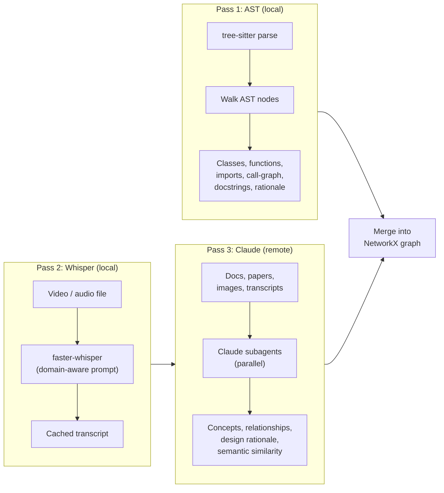
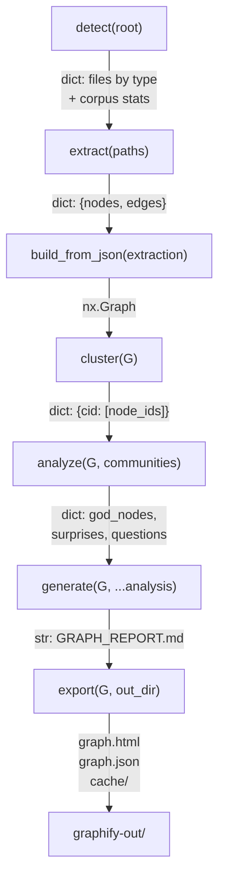

# Graphify -- Overview

Graphify is an AI coding assistant skill that transforms mixed-media corpora -- code, documentation, papers, images, video, and audio -- into queryable knowledge graphs. It ships as a Python library (`graphifyy` on PyPI, v0.5.6) with a CLI entry point and integrates with 14 platforms including Claude Code, Codex, Cursor, and Gemini CLI. The core value proposition is structural: a 52-file mixed corpus (code + papers + images) compresses to 71.5x fewer tokens per query compared to reading raw files, while preserving every relationship's provenance.

## The Three-Pass Extraction Model

Every corpus passes through three extraction stages. The first two are local and deterministic; only the third requires an LLM.



**Pass 1 -- Deterministic AST** (`graphify/extract.py`). tree-sitter parses code files into syntax trees. The extractor walks each tree, collecting classes, functions, imports, and call-graph edges. A second pass resolves cross-file imports into class-level INFERRED edges (e.g., `DigestAuth --uses--> Response`). Rationale comments (`# WHY:`, `# HACK:`, `# NOTE:`, `# IMPORTANT:`) are extracted as `rationale_for` nodes. No LLM is involved. This covers 25 languages.

**Pass 2 -- Whisper Transcription** (`graphify/transcribe.py`). Video and audio files are transcribed locally using faster-whisper. The transcription prompt is domain-aware: it derives vocabulary from the corpus's god nodes so technical terms are spelled correctly. Transcripts are cached in `graphify-out/transcripts/` and reused on subsequent runs.

**Pass 3 -- Claude Semantic Extraction** (via `skill.md` or `graphify/llm.py`). Documents, papers, images, and transcripts are dispatched to Claude subagents running in parallel. Each subagent extracts concepts, relationships, and design rationale, returning structured JSON that conforms to the extraction schema. Confidence labels are assigned to every edge.

## The 7-Stage Pipeline

The pipeline is a linear sequence of pure functions. Each stage lives in its own module and communicates through plain Python dicts and NetworkX graphs. There is no shared state and no side effects outside `graphify-out/`.



| Stage | Module | Function | What It Does |
|-------|--------|----------|-------------|
| 1. Detect | `detect.py` | `detect(root)` | Walks the directory tree, classifies files by type (code, document, paper, image, video), applies `.graphifyignore` patterns, skips sensitive files, and returns a manifest with corpus statistics |
| 2. Extract | `extract.py` | `extract(paths)` | Runs per-file AST extraction via tree-sitter, then a cross-file import resolution pass. Returns `{nodes, edges}` dict. Results are SHA256-cached |
| 3. Build | `build.py` | `build_from_json(extraction)` | Assembles node and edge dicts into a NetworkX graph. Validates against the extraction schema, normalizes IDs, and handles deduplication |
| 4. Cluster | `cluster.py` | `cluster(G)` | Runs Leiden community detection (via graspologic) with Louvain fallback. Splits oversized communities (>25% of graph, minimum 10 nodes) with a second pass |
| 5. Analyze | `analyze.py` | `god_nodes(G)`, `surprising_connections(G, communities)`, `suggest_questions(G, communities, labels)` | Identifies highest-degree entities, ranks cross-file/cross-community edges by a composite surprise score, and generates graph-derived questions |
| 6. Report | `report.py` | `generate(G, communities, ...)` | Produces a `GRAPH_REPORT.md` string with corpus stats, confidence breakdown, god nodes, surprising connections, community summaries, ambiguous edges, knowledge gaps, and suggested questions |
| 7. Export | `export.py` | `to_json()`, `to_html()`, `to_svg()`, `to_obsidian()`, `to_canvas()`, `to_cypher()`, `to_graphml()`, `push_to_neo4j()` | Writes the graph to multiple output formats. The HTML export uses vis.js with community filtering, search, and click-to-inspect |

## Supported Languages (25 total)

The AST extraction pass supports 25 languages. 21 use tree-sitter language bindings with a corresponding `tree-sitter-<lang>` dependency in `pyproject.toml`. Four languages use alternative parsers:

| Language | Extension(s) | Extractor Function |
|----------|-------------|-------------------|
| Python | `.py` | `extract_python` |
| JavaScript | `.js`, `.jsx`, `.mjs` | `extract_js` |
| TypeScript | `.ts`, `.tsx` | `extract_js` |
| Go | `.go` | `extract_go` |
| Rust | `.rs` | `extract_rust` |
| Java | `.java` | `extract_java` |
| C | `.c`, `.h` | `extract_c` |
| C++ | `.cpp`, `.cc`, `.cxx`, `.hpp` | `extract_cpp` |
| Ruby | `.rb` | `extract_ruby` |
| C# | `.cs` | `extract_csharp` |
| Kotlin | `.kt`, `.kts` | `extract_kotlin` |
| Scala | `.scala` | `extract_scala` |
| PHP | `.php`, `.blade.php` | `extract_php`, `extract_blade` (regex) |
| Swift | `.swift` | `extract_swift` |
| Lua | `.lua`, `.toc` | `extract_lua` |
| Zig | `.zig` | `extract_zig` |
| PowerShell | `.ps1` | `extract_powershell` |
| Elixir | `.ex`, `.exs` | `extract_elixir` |
| Objective-C | `.m`, `.mm` | `extract_objc` |
| Julia | `.jl` | `extract_julia` |
| Verilog / SystemVerilog | `.v`, `.sv` | `extract_verilog` |
| Vue | `.vue` | `extract_js` (tree-sitter) |
| Svelte | `.svelte` | `extract_js` (tree-sitter) |
| Dart | `.dart` | `extract_dart` (regex) |

Non-code file types are handled by Claude semantic extraction:

| Type | Extensions | Extraction Method |
|------|-----------|-------------------|
| Documents | `.md`, `.mdx`, `.html`, `.txt`, `.rst` | Claude subagent |
| Office | `.docx`, `.xlsx` | Converted to markdown, then Claude subagent |
| Papers | `.pdf` | Citation mining + concept extraction via Claude |
| Images | `.png`, `.jpg`, `.webp`, `.gif` | Claude vision |
| Video / Audio | `.mp4`, `.mov`, `.mkv`, `.webm`, `.avi`, `.m4v`, `.mp3`, `.wav`, `.m4a`, `.ogg` | Whisper transcription, then Claude subagent |

## The Confidence System

Every edge in the graph carries one of three confidence labels, defined in `graphify/validate.py:5` as the constant `VALID_CONFIDENCES`:

| Label | Meaning | Example |
|-------|---------|---------|
| `EXTRACTED` | Relationship is explicitly stated in source. Always confidence_score 1.0 | An `import` statement, a direct function call, a citation reference |
| `INFERRED` | Reasonable deduction. Carries a `confidence_score` between 0.0 and 1.0 | Cross-file call-graph second pass, co-occurrence in context, semantic similarity |
| `AMBIGUOUS` | Uncertain relationship. Flagged for human review in GRAPH_REPORT.md | Vague conceptual link where the extractor could not determine the exact relation |

The confidence system enables the report to surface edges that need verification. The `analyze.py` module generates suggested questions specifically targeting AMBIGUOUS edges and nodes with many INFERRED connections.

## Output Directory Structure

A single run of `/graphify .` produces the following output:

```
graphify-out/
|-- graph.html           Interactive vis.js graph -- open in any browser.
|                         Click nodes, search, filter by community, hover for edge details.
|-- GRAPH_REPORT.md      Audit trail: god nodes, surprising connections,
|                         community summaries, ambiguous edges, knowledge gaps,
|                         suggested questions.
|-- graph.json            Persistent graph in NetworkX node-link format.
|                         Query weeks later without re-reading source files.
|-- cache/
|   |-- ast/              SHA256-keyed extraction cache for code files.
|   |   `-- <hash>.json   One entry per source file. Invalidated when content changes.
|   `-- semantic/         SHA256-keyed cache for Claude semantic extractions.
|       `-- <hash>.json   Separate from AST to prevent hash collisions (#582).
|-- transcripts/          Whisper transcripts for video/audio files.
|-- converted/            Markdown sidecars for .docx/.xlsx files.
|-- manifest.json         File modification times for incremental --update runs.
`-- cost.json             Local token tracking (input/output token counts).
```

## Platform Integrations

Graphify integrates with 14 AI coding platforms. Each platform gets a tailored install command that sets up the skill file, always-on hooks (where supported), and the `/graphify` trigger.

| Platform | Install Command | Hook Mechanism |
|----------|----------------|----------------|
| Claude Code (Linux/Mac) | `graphify install` | `PreToolUse` hook in `settings.json` |
| Claude Code (Windows) | `graphify install --platform windows` | `PreToolUse` hook in `settings.json` |
| Codex | `graphify install --platform codex` | `PreToolUse` hook in `.codex/hooks.json` |
| OpenCode | `graphify install --platform opencode` | `tool.execute.before` plugin |
| Cursor | `graphify cursor install` | `.cursor/rules/graphify.mdc` (alwaysApply) |
| Gemini CLI | `graphify install --platform gemini` | `BeforeTool` hook in `.gemini/settings.json` |
| GitHub Copilot CLI | `graphify install --platform copilot` | Skill file only |
| VS Code Copilot Chat | `graphify vscode install` | `.github/copilot-instructions.md` |
| Aider | `graphify install --platform aider` | `AGENTS.md` |
| OpenClaw | `graphify install --platform claw` | `AGENTS.md` |
| Factory Droid | `graphify install --platform droid` | `AGENTS.md` (uses Task tool) |
| Trae | `graphify install --platform trae` | `AGENTS.md` (uses Agent tool) |
| Kiro IDE/CLI | `graphify kiro install` | `.kiro/steering/graphify.md` (inclusion: always) |
| Google Antigravity | `graphify antigravity install` | `.agents/rules/` + `.agents/workflows/` |

## Token Reduction

The benchmark module (`graphify/benchmark.py`) measures the ratio of raw corpus tokens to graph-subgraph tokens for a set of sample questions. On the worked example with 52 files (Karpathy repos + 5 papers + 4 images), the measured reduction is **71.5x**. The first run pays the extraction cost. Every subsequent query reads the compact graph representation instead of raw files. The SHA256 cache ensures re-runs only re-process changed files.

Token reduction scales with corpus size. A 6-file corpus fits in a single context window anyway, so the graph adds structural clarity rather than compression. At 52+ files the compression benefit dominates.

## Design Principles

**Deterministic AST, not probabilistic parsing.** Code extraction uses tree-sitter, which produces exact syntax trees. The LLM is only involved for documents, papers, and images where structural parsing is not possible.

**No embeddings.** Clustering is graph-topology-based. Leiden/Louvain finds communities by edge density. The semantic similarity edges that Claude extracts (`semantically_similar_to`, marked INFERRED) are already in the graph, so they influence community detection directly. The graph structure is the similarity signal. No separate embedding step, no vector database.

**Cached by content hash.** Every extraction result is cached under `graphify-out/cache/{ast,semantic}/<sha256>.json`. The hash covers file contents and the path relative to the project root, so cache entries are portable across machines. Markdown files hash only the body below the YAML frontmatter, so metadata-only changes do not invalidate the cache.

**Explicit provenance.** Every edge carries a `confidence` label and a `source_file` with `source_location`. The report separates what was found from what was guessed. AMBIGUOUS edges are surfaced for human review.

## Key Insights: How the Graph Actually Works

**Every file is already a network.** Before any cross-file analysis, each source file has internal structure: a file-level hub node, class nodes, method nodes, and edges showing which methods call which. This is the micro-network. The first time you run graphify on a project, you see this structure immediately -- no LLM needed.

**Cross-file resolution is deferred, not parallel.** The AST walk doesn't try to resolve external imports while parsing. It collects unresolved callee names in a `raw_calls` list. After every file is processed, a global label-to-node map is built and all deferred calls are resolved at once. This keeps the walker language-agnostic -- no language needs to know how imports work in another language.

**Confidence drops as scope increases.** Intra-file relationships are 100% certain (`EXTRACTED`). Cross-file relationships are reasoned but likely correct (`INFERRED`). Semantic relationships are useful hypotheses (`AMBIGUOUS`). The graph never lies about what it knows -- every edge carries its confidence label.

**No vector database, no embeddings.** Community detection runs on graph topology alone. Leiden/Louvain finds communities by edge density. If two modules have many `imports` and `calls` edges between them, they cluster together. If Claude extracts a `semantically_similar_to` edge, that also influences clustering. The graph structure IS the similarity signal.

**Member calls are intentionally skipped in cross-file resolution.** `obj.log()` is excluded because common method names (`log`, `run`, `init`) appear everywhere. Only bare function names like `authenticate()` are resolved cross-file, where the callee name is unique enough to be meaningful.

## Lazy Imports

The package uses lazy attribute loading in `graphify/__init__.py` so that `graphify install` works before heavy dependencies (networkx, tree-sitter) are installed:

```python
"""graphify - extract . build . cluster . analyze . report."""


def __getattr__(name):
    # Lazy imports so `graphify install` works before heavy deps are in place.
    _map = {
        "extract": ("graphify.extract", "extract"),
        "collect_files": ("graphify.extract", "collect_files"),
        "build_from_json": ("graphify.build", "build_from_json"),
        "cluster": ("graphify.cluster", "cluster"),
        "score_all": ("graphify.cluster", "score_all"),
        "cohesion_score": ("graphify.cluster", "cohesion_score"),
        "god_nodes": ("graphify.analyze", "god_nodes"),
        "surprising_connections": ("graphify.analyze", "surprising_connections"),
        "suggest_questions": ("graphify.analyze", "suggest_questions"),
        "generate": ("graphify.report", "generate"),
        "to_json": ("graphify.export", "to_json"),
        "to_html": ("graphify.export", "to_html"),
        "to_svg": ("graphify.export", "to_svg"),
        "to_canvas": ("graphify.export", "to_canvas"),
        "to_wiki": ("graphify.wiki", "to_wiki"),
    }
    if name in _map:
        import importlib
        mod_name, attr = _map[name]
        mod = importlib.import_module(mod_name)
        return getattr(mod, attr)
    raise AttributeError(f"module 'graphify' has no attribute {name!r}")
```

This pattern means the top-level `graphify` module never imports networkx, tree-sitter, or any other heavy dependency at import time. The actual import only happens when a pipeline function is first accessed.

## Source

`/home/darkvoid/Boxxed/@formulas/src.rust/src.llamacpp/src.Graphify/graphify/`
