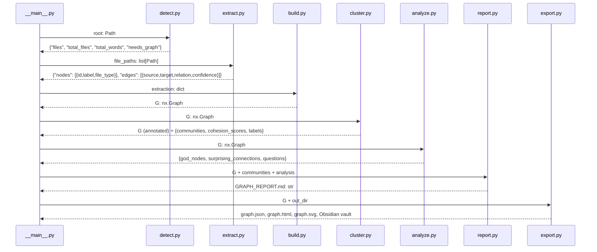
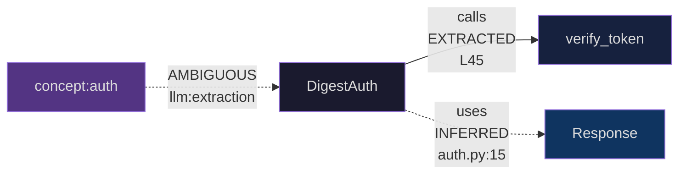

# Architecture

Graphify is a Python library and CLI skill that turns any folder of code, documents, papers, images, or videos into a queryable knowledge graph. The pipeline reads a directory, extracts structural information from source files using tree-sitter, assembles a NetworkX graph, detects communities, analyses it, and exports the result in multiple formats. Each stage communicates through plain Python dicts and NetworkX graphs -- no shared state, no side effects outside `graphify-out/`.

- **Related documents:** [Detection Guide](02-detection.md) | [Extraction Guide](03-extraction.md)
- **Source root:** `/home/darkvoid/Boxxed/@formulas/src.rust/src.llamacpp/src.Graphify/graphify/graphify/`

## Directory Structure

```
graphify/                          # Python package
  __init__.py                      # Lazy-import facade
  __main__.py                      # CLI entry point (`graphify install`)
  detect.py                        # File discovery, type classification, corpus health
  extract.py                       # Tree-sitter AST extraction (25 languages)
  build.py                         # Assemble dicts into NetworkX graph
  cluster.py                       # Leiden/Louvain community detection
  analyze.py                       # God nodes, surprising connections, questions
  report.py                        # Generate GRAPH_REPORT.md audit trail
  export.py                        # Write JSON, HTML, SVG, GraphML, Obsidian, Neo4j
  ingest.py                        # Fetch URLs (tweets, arxiv, PDFs) as annotated markdown
  cache.py                         # Per-file SHA256 extraction cache
  security.py                      # URL validation, safe fetch, label sanitisation
  serve.py                         # MCP stdio server for graph queries
  watch.py                         # Filesystem watcher for auto --update
  benchmark.py                     # Token-reduction benchmark
  llm.py                           # Direct LLM backends (Claude, Kimi K2.6)
  validate.py                      # Extraction JSON schema validation
  hooks.py                         # Git post-commit / post-checkout hook integration
  wiki.py                          # Wikipedia-style markdown export
  manifest.py                      # Re-export of incremental-detection helpers
  transcribe.py                    # Video/audio transcription via faster-whisper
  skill.md, skill-*.md             # AI agent skill files (Claude Code, Aider, etc.)
```

## Module Map

All 21 Python modules, their primary exported function, and what they consume and produce:

| Module | Function | Input | Output |
|--------|----------|-------|--------|
| `__init__.py` | lazy `__getattr__` | attribute name | deferred module import |
| `__main__.py` | `main()` | CLI args | subprocess calls / skill install |
| `detect.py` | `detect()`, `detect_incremental()` | `Path` root | `{files, total_files, total_words, needs_graph, warning}` dict |
| `extract.py` | `extract()` | `list[Path]` code files | `{nodes, edges, input_tokens, output_tokens}` dict |
| `build.py` | `build_from_json()` | extraction dict | `nx.Graph` (or `nx.DiGraph`) |
| `cluster.py` | `cluster()` | `nx.Graph` | graph with `community` node attr + `{cohesion_scores, labels}` |
| `analyze.py` | `god_nodes()`, `surprising_connections()`, `suggest_questions()` | `nx.Graph` | sorted lists of dicts |
| `report.py` | `generate()` | graph + analysis results | `GRAPH_REPORT.md` string |
| `export.py` | `to_json()`, `to_html()`, `to_svg()` | `nx.Graph` + output dir | files on disk |
| `ingest.py` | `ingest()` | URL string | `.md` file in corpus dir |
| `cache.py` | `load_cached()`, `save_cached()` | `Path`, cache root | cached extraction dict or `None` |
| `security.py` | `validate_url()`, `safe_fetch()`, `sanitize_label()` | URL/path/label | validated value or `ValueError` |
| `validate.py` | `validate_extraction()` | extraction dict | `list[str]` errors (empty = valid) |
| `serve.py` | `start_server()` | graph `.json` path | MCP stdio server |
| `watch.py` | `watch()` | directory path | writes flag file on change |
| `benchmark.py` | `run_benchmark()` | graph file path | token comparison report |
| `llm.py` | extraction functions | file paths + LLM config | semantic extraction dict |
| `hooks.py` | `install_hooks()`, `uninstall_hooks()` | git repo path | `.git/hooks/*` scripts |
| `wiki.py` | `to_wiki()` | `nx.Graph` + communities | wiki markdown files |
| `manifest.py` | re-exports from `detect` | -- | `save_manifest`, `load_manifest`, `detect_incremental` |
| `transcribe.py` | `transcribe()` | video/audio path | transcript text in `graphify-out/transcripts/` |

## Pipeline Sequence Diagram

The seven-stage pipeline runs sequentially. Each arrow shows the data type passed between stages:



## Module Communication Diagram

Modules do not share state. Data flows through function return values:

```mermaid
graph LR
    D[detect.py] -->|files dict| E[extract.py]
    E -->|{nodes, edges} dict| B[build.py]
    B -->|nx.Graph| C[cluster.py]
    C -->|nx.Graph + communities| A[analyze.py]
    A -->|{god_nodes, surprises}| R[report.py]
    C -->|nx.Graph + communities| R
    R -->|GRAPH_REPORT.md| X[export.py]
    B -->|nx.Graph| X

    Cache[cache.py] -.->|load_cached| E
    Security[security.py] -.->|validate_url| Ingest[ingest.py]
    Validate[validate.py] -.->|validate_extraction| B
```

## How Relationships Form the Network

The graph's value comes from how edges connect structural entities. Every edge has a `relation`, `confidence`, `source_file`, and `source_location` -- you can trace any connection back to the exact line of code that produced it.

### Edge Anatomy



### Relationship Density

The graph reveals which parts of a codebase are tightly coupled (many edges) vs. loosely coupled (few edges). A class with 20+ `calls` edges is a coordination hub. A class with zero incoming edges is dead code. A file that `imports` 15 other files is a facade or orchestrator.

### Edge Categories by Origin

| Origin | Relations | Confidence | Certainty |
|--------|-----------|------------|-----------|
| AST walker (single file) | `contains`, `method`, `calls`, `imports` | `EXTRACTED` | Syntactically proven |
| Cross-file resolver | `uses`, `imports`, `calls` | `INFERRED` | Resolved by naming convention |
| LLM semantic extraction | `semantically_similar_to`, `related_to` | `AMBIGUOUS` | LLM judgment call |

### The Network Effect

Individual files produce small trees. Cross-file resolution connects these trees into a forest. Community detection finds which clusters of trees grow together. The result is a map of architectural boundaries:

```
auth.py          models.py         handlers.py
├─ DigestAuth ───┤                 ├─ login_handler ──calls──▶ authenticate()
│  ├─ validate() │                 │
│  └─ authenticate() ──uses──▶ Response
└─ hash_password()│                 └─ logout_handler
                  │
                  ├─ Response      services.py
                  └─ User          └─ EmailService
                                      └─ send()
                                         ▲
                                    calls │
                                          │
                               password_reset_handler
```

The `calls` edge from `password_reset_handler` to `EmailService.send()` crosses three module boundaries. In a 500-file project, this edge is one of thousands -- but it tells you that the password reset flow depends on email delivery, which is architecturally significant.

## Data Model

### Node Dict Schema

Every node in the extraction output follows this schema (enforced by `validate.py:6`):

```python
# Required fields (validate.py:6)
REQUIRED_NODE_FIELDS = {"id", "label", "file_type", "source_file"}

# Valid file_type values (validate.py:4)
VALID_FILE_TYPES = {"code", "document", "paper", "image", "rationale", "concept"}

# Example node (from extract.py _extract_generic):
{
    "id": "models_user",                      # stable, lowercase, [a-z0-9_] only
    "label": "User",                           # human-readable name
    "file_type": "code",                       # from VALID_FILE_TYPES
    "source_file": "src/models/user.py",       # project-relative path
    "source_location": "L42",                  # line number, or null
}
```

Node IDs are generated by `_make_id()` in `extract.py:14-18`, which strips punctuation, collapses non-alphanumeric sequences to underscores, and lowercases the result:

```python
def _make_id(*parts: str) -> str:
    """Build a stable node ID from one or more name parts."""
    combined = "_".join(p.strip("_.") for p in parts if p)
    cleaned = re.sub(r"[^a-zA-Z0-9]+", "_", combined)
    return cleaned.strip("_").lower()
```

### Edge Dict Schema

Every edge follows this schema (enforced by `validate.py:7`):

```python
# Required fields (validate.py:7)
REQUIRED_EDGE_FIELDS = {"source", "target", "relation", "confidence", "source_file"}

# Valid confidence values (validate.py:5)
VALID_CONFIDENCES = {"EXTRACTED", "INFERRED", "AMBIGUOUS"}

# Example edge (from extract.py _extract_generic):
{
    "source": "auth_digest_auth",
    "target": "models_response",
    "relation": "uses",              # calls, imports, imports_from, uses, etc.
    "confidence": "INFERRED",        # EXTRACTED, INFERRED, or AMBIGUOUS
    "source_file": "src/auth.py",
    "source_location": "L15",
    "weight": 0.8,                   # numeric, 0.0-1.0
}
```

### Confidence Labels

| Label | Meaning | Source |
|-------|---------|--------|
| `EXTRACTED` | Relationship is explicitly stated in source (import, call, citation) | AST walk, first pass |
| `INFERRED` | Reasonable deduction (cross-file import resolution, call-graph second pass) | Cross-file resolution, second pass |
| `AMBIGUOUS` | Relationship is uncertain; flagged for human review | LLM semantic extraction |

## Dependencies

### Core (required)

- `networkx` -- graph data structure and algorithms
- `tree-sitter>=0.23.0` -- incremental parsing framework (Language API v2)
- 21 tree-sitter language bindings: `tree-sitter-python`, `tree-sitter-javascript`, `tree-sitter-typescript`, `tree-sitter-go`, `tree-sitter-rust`, `tree-sitter-java`, `tree-sitter-c`, `tree-sitter-cpp`, `tree-sitter-ruby`, `tree-sitter-c-sharp`, `tree-sitter-kotlin`, `tree-sitter-scala`, `tree-sitter-php`, `tree-sitter-swift`, `tree-sitter-lua`, `tree-sitter-zig`, `tree-sitter-powershell`, `tree-sitter-elixir`, `tree-sitter-objc`, `tree-sitter-julia`, `tree-sitter-verilog`

### Optional (extras)

| Extra | Packages | Purpose |
|-------|----------|---------|
| `mcp` | `mcp` | MCP stdio server (`graphify serve`) |
| `neo4j` | `neo4j` | Neo4j Cypher export |
| `pdf` | `pypdf`, `html2text` | PDF text extraction, HTML-to-markdown |
| `watch` | `watchdog` | Filesystem watching (`graphify watch`) |
| `svg` | `matplotlib` | SVG graph visualization |
| `leiden` | `graspologic` (Python < 3.13) | Leiden community detection |
| `office` | `python-docx`, `openpyxl` | DOCX/XLSX to markdown conversion |
| `video` | `faster-whisper`, `yt-dlp` | Video/audio transcription |
| `kimi` | `openai` | Kimi K2.6 LLM backend |
| `all` | All of the above | Full feature set |
