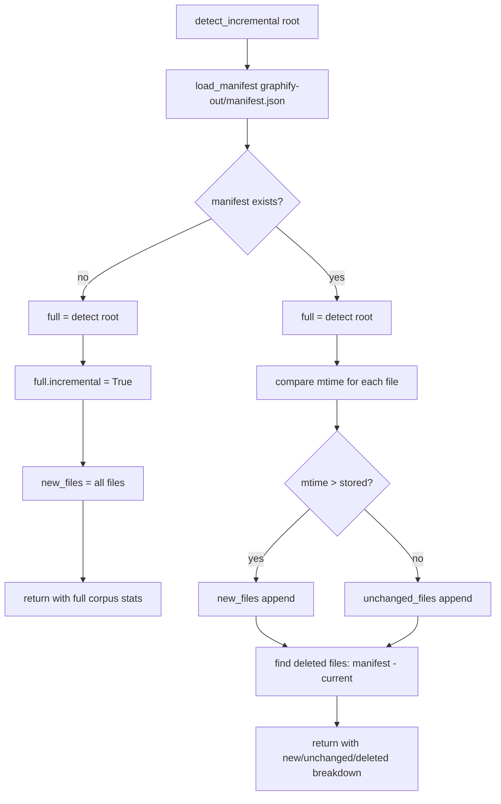

# Detection

The `detect.py` module is the first stage of the Graphify pipeline. It walks a directory tree, classifies every file by type, counts corpus size, filters out sensitive files and noise directories, and returns a structured dict that drives the rest of the pipeline. Every other module depends on its output.

- **Source file:** `/home/darkvoid/Boxxed/@formulas/src.rust/src.llamacpp/src.Graphify/graphify/graphify/graphify/detect.py`
- **Related documents:** [Architecture](01-architecture.md) | [Extraction](03-extraction.md)

## FileType Enum

Files are classified into one of five categories (`detect.py:11-16`):

```python
class FileType(str, Enum):
    CODE = "code"
    DOCUMENT = "document"
    PAPER = "paper"
    IMAGE = "image"
    VIDEO = "video"
```

## File Extension Sets

Each file type is matched against a set of extensions (`detect.py:21-26`):

| Type | Extensions | Count |
|------|-----------|-------|
| `CODE` | `.py`, `.ts`, `.js`, `.jsx`, `.tsx`, `.mjs`, `.ejs`, `.go`, `.rs`, `.java`, `.cpp`, `.cc`, `.cxx`, `.c`, `.h`, `.hpp`, `.rb`, `.swift`, `.kt`, `.kts`, `.cs`, `.scala`, `.php`, `.lua`, `.toc`, `.zig`, `.ps1`, `.ex`, `.exs`, `.m`, `.mm`, `.jl`, `.vue`, `.svelte`, `.dart`, `.v`, `.sv` | 39 |
| `DOCUMENT` | `.md`, `.mdx`, `.txt`, `.rst`, `.html` | 5 |
| `PAPER` | `.pdf` | 1 |
| `IMAGE` | `.png`, `.jpg`, `.jpeg`, `.gif`, `.webp`, `.svg` | 6 |
| `OFFICE` | `.docx`, `.xlsx` | 2 (treated as DOCUMENT after conversion) |
| `VIDEO` | `.mp4`, `.mov`, `.webm`, `.mkv`, `.avi`, `.m4v`, `.mp3`, `.wav`, `.m4a`, `.ogg` | 10 |

The special case of `.blade.php` is handled explicitly: `classify_file()` checks `path.name.lower().endswith(".blade.php")` before the generic suffix lookup (`detect.py:83-84`).

## Pipeline Flowchart

```mermaid
flowchart TD
    A[detect root: Path] --> B[load .graphifyignore from root and ancestors]
    B --> C[scan_paths = root + graphify-out/memory/ if exists]
    C --> D[os.walk each scan_root]
    D --> E{prune dirs}
    E -->|skip| F[_SKIP_DIRS, hidden dirs, ignored]
    E -->|keep| G[collect filenames]
    G --> H{classify each file}
    H -->|sensitive?| I[skip, record in skipped_sensitive]
    H -->|ignored?| J[skip via .graphifyignore]
    H -->|.docx/.xlsx| K[convert_office_file to markdown sidecar]
    H -->|CODE| L[files[CODE].append]
    H -->|DOCUMENT| M[files[DOCUMENT].append]
    H -->|PAPER| N[files[PAPER].append]
    H -->|IMAGE| O[files[IMAGE].append]
    H -->|VIDEO| P[files[VIDEO].append]
    L --> Q[count_words per file]
    M --> Q
    N --> Q
    K --> Q
    Q --> R{corpus health check}
    R -->|words < 50000| S[warn: may not need a graph]
    R -->|words > 500000 or files > 200| T[warn: expensive semantic extraction]
    R -->|healthy| U[needs_graph = True]
    S --> V[return detection dict]
    T --> V
    U --> V
```

## classify_file() Logic

The classification function (`detect.py:81-104`) applies rules in this order:

1. **Blade templates** -- `.blade.php` files are always `CODE` (checked via `path.name.lower().endswith()` before suffix lookup)
2. **Code extensions** -- if `ext in CODE_EXTENSIONS` return `FileType.CODE`
3. **PDF papers** -- if `ext in PAPER_EXTENSIONS` return `FileType.PAPER`, unless the file lives inside an Xcode asset catalog directory (`.imageset`, `.xcassets`, etc.)
4. **Images** -- if `ext in IMAGE_EXTENSIONS` return `FileType.IMAGE`
5. **Documents with paper heuristic** -- if `ext in DOC_EXTENSIONS`, check `_looks_like_paper()`; if it matches, return `FileType.PAPER`, otherwise `FileType.DOCUMENT`
6. **Office documents** -- if `ext in OFFICE_EXTENSIONS` return `FileType.DOCUMENT` (later converted to markdown)
7. **Video/audio** -- if `ext in VIDEO_EXTENSIONS` return `FileType.VIDEO`
8. **Unknown** -- return `None` (file is silently ignored)

## Paper Detection

The `_looks_like_paper()` function (`detect.py:67-75`) reads the first 3000 characters of a text file and checks it against 13 regex patterns (`detect.py:43-57`). A file is classified as a paper if at least 3 patterns match:

| Signal | Pattern | Examples |
|--------|---------|----------|
| arxiv | `\barxiv\b` | "arxiv preprint" |
| DOI | `\bdoi\s*:` | "doi: 10.1000/xyz" |
| Abstract | `\babstract\b` | Section heading |
| Proceedings | `\bproceedings\b` | Conference paper |
| Journal | `\bjournal\b` | Journal name |
| Preprint | `\bpreprint\b` | "arXiv preprint" |
| LaTeX cite | `\\cite\{` | `\cite{smith2020}` |
| Numbered cite | `\[\d+\]` | "[1]", "[23]" |
| Multi-line cite | `\[\n\d+\n\]` | Citation split across lines |
| Equation ref | `eq.\s*\d+` | "eq. 3", "equation 5" |
| arXiv ID | `\d{4}\.\d{4,5}` | "1706.03762" |
| Academic phrasing | `\bwe propose\b` | "we propose a novel" |
| Literature | `\bliterature\b` | "from the literature" |

Threshold: 3 out of 13 signals must match (`detect.py:58`).

## Sensitive File Detection

Files that may contain secrets are skipped silently. Six regex patterns in `_SENSITIVE_PATTERNS` (`detect.py:33-40`) catch:

| Pattern | Matches |
|---------|---------|
| `(^|[\\/])\.(env|envrc)(\|$)` | `.env`, `.envrc`, `.env.local` |
| `\.(pem|key|p12|pfx|cert|crt|der|p8)$` | Certificate and key files |
| `(credential|secret|passwd|password|token|private_key)` | Files with credential-like names |
| `(id_rsa|id_dsa|id_ecdsa|id_ed25519)(\.pub)?$` | SSH private/public keys |
| `(\.netrc|\.pgpass|\.htpasswd)$` | Auth credential files |
| `(aws_credentials|gcloud_credentials|service.account)` | Cloud credential files |

## Directory Pruning

Three sets control which directories and files are excluded from the scan (`detect.py:237-263`):

```python
_SKIP_DIRS = {
    "venv", ".venv", "env", ".env",
    "node_modules", "__pycache__", ".git",
    "dist", "build", "target", "out",
    "site-packages", "lib64",
    ".pytest_cache", ".mypy_cache", ".ruff_cache",
    ".tox", ".eggs", "*.egg-info",
    "graphify-out",   # never treat own output as source input (#524)
}

_SKIP_FILES = {
    "package-lock.json", "yarn.lock", "pnpm-lock.yaml",
    "Cargo.lock", "poetry.lock", "Gemfile.lock",
    "composer.lock", "go.sum", "go.work.sum",
}
```

The `_is_noise_dir()` function (`detect.py:254-263`) additionally skips any directory ending in `_venv`, `_env`, or `.egg-info`.

## .graphifyignore Support

The `_load_graphifyignore()` function (`detect.py:266-293`) reads `.graphifyignore` files from the scan root and all ancestor directories up to a `.git` boundary or the filesystem root. This means ignore patterns written in a parent directory still apply when running graphify on a subfolder.

The `_is_ignored()` function (`detect.py:296-334`) matches each file against all loaded patterns using `fnmatch`. It checks three levels of the path: the full relative path, the filename alone, and each path prefix segment. Patterns are evaluated both relative to the scan root and relative to the anchor directory where each `.graphifyignore` was found.

## Corpus Health Thresholds

Three constants control corpus size warnings (`detect.py:28-30`):

```python
CORPUS_WARN_THRESHOLD = 50_000      # words -- below this, warn "you may not need a graph"
CORPUS_UPPER_THRESHOLD = 500_000    # words -- above this, warn about token cost
FILE_COUNT_UPPER = 200               # files -- above this, warn about token cost
```

- **Below 50,000 words:** The corpus fits in a single context window. A warning suggests you may not need a graph.
- **Above 500,000 words or 200 files:** A warning advises that semantic extraction will be expensive and suggests using `--no-semantic` for AST-only mode or running on a subfolder.

## Office File Conversion

Office documents are converted to markdown sidecars before extraction (`detect.py:122-219`):

- **`docx_to_markdown(path)`** -- Uses `python-docx` to read paragraphs and tables. Headings become `#`, `##`, `###` markdown. List items become `- ` bullets. Tables become pipe-separated markdown tables.
- **`xlsx_to_markdown(path)`** -- Uses `openpyxl` to read each sheet. The first row becomes a header, subsequent rows become data rows. Empty rows are skipped.
- **`convert_office_file(path, out_dir)`** -- Converts and writes a `.md` sidecar to `graphify-out/converted/`. The filename uses a SHA256 hash prefix (first 8 chars of the resolved path hash) to avoid collisions. Returns the output path or `None` if conversion failed.

These functions gracefully degrade: if the required library (`python-docx` or `openpyxl`) is not installed, they return an empty string and the file is recorded in `skipped_sensitive` with a note to `pip install graphifyy[office]`.

## Memory Directory Inclusion

The `detect()` function (`detect.py:352-355`) always includes `graphify-out/memory/` in the scan paths alongside the source root. This allows query results filed back into the graph by agents to be picked up as new source material:

```python
memory_dir = root / "graphify-out" / "memory"
scan_paths = [root]
if memory_dir.exists():
    scan_paths.append(memory_dir)
```

Files in the memory tree skip the hidden-file and noise-directory pruning that applies to the source tree (`detect.py:361, 390`).

## Incremental Detection

The `--update` mode re-runs extraction only on files that have changed since the last run. This flow is handled by `detect_incremental()`:



Two supporting functions handle the manifest persistence:

- **`load_manifest(manifest_path)`** (`detect.py:448-453`) -- Loads `graphify-out/manifest.json` as a dict mapping file paths to their modification timestamps.
- **`save_manifest(files, manifest_path)`** (`detect.py:456-466`) -- Writes current file mtimes to the manifest.
- **`detect_incremental(root, manifest_path)`** (`detect.py:469-511`) -- Runs `detect()`, then compares each file's current mtime against the stored manifest. Returns the full detection dict augmented with `new_files`, `unchanged_files`, `new_total`, and `deleted_files` keys.

## detect() Return Value

The `detect()` function (`detect.py:337-445`) returns:

```python
{
    "files": {
        "code": ["src/main.py", "src/utils.py", ...],
        "document": ["README.md", "docs/guide.txt", ...],
        "paper": ["papers/attention.pdf", ...],
        "image": ["assets/logo.png", ...],
        "video": ["demos/demo.mp4", ...],
    },
    "total_files": 42,
    "total_words": 125_000,
    "needs_graph": True,
    "warning": None,                    # or warning string if corpus too small/large
    "skipped_sensitive": [".env", ...], # files skipped (secrets or office conversion failed)
    "graphifyignore_patterns": 3,       # number of loaded .graphifyignore patterns
}
```
