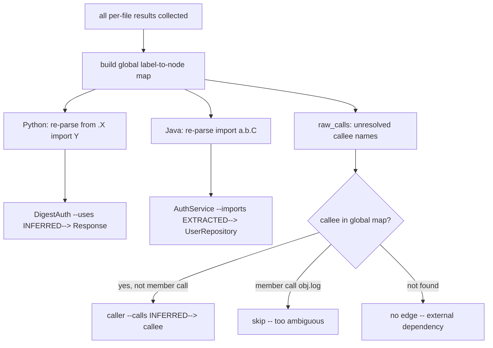
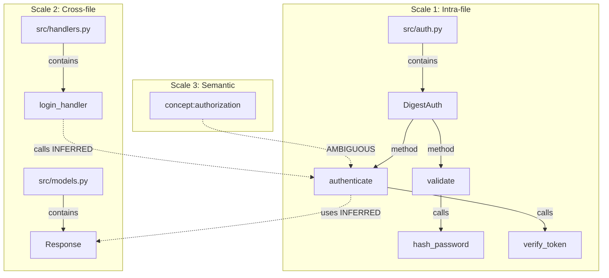

# Extraction

The `extract.py` module is the second stage of the Graphify pipeline. It parses source code files using tree-sitter, walks their ASTs, and produces a deterministic set of nodes and edges representing the structural relationships within each file. All AST edges are `EXTRACTED` -- meaning they are directly stated in the source, not inferred.

- **Source file:** `/home/darkvoid/Boxxed/@formulas/src.rust/src.llamacpp/src.Graphify/graphify/graphify/graphify/extract.py` (3547 lines)
- **Related documents:** [Architecture](01-architecture.md) | [Detection](02-detection.md) | [Graph Building](04-graph-building.md)

## Aha Moments: How Graphify Builds the Network

These are the key design decisions that make the extraction work:

**1. Every file is a micro-network.** Before any cross-file analysis exists, each file already has internal structure: a file-level hub node contains classes, classes contain methods, and methods call each other. The graph is built bottom-up -- local structure first, global connections second.

**2. `raw_calls` as deferred resolution.** The extractor doesn't try to resolve external calls during the AST walk. Instead, every unresolved callee is saved to a `raw_calls` list: `{"caller_nid": ..., "callee": "ClassName", "is_member_call": false, ...}`. Pass 2 builds a global label-to-node map and resolves all deferred calls at once. This means the AST walk stays simple and language-agnostic -- no language needs to know how imports work in other languages.

**3. Member calls are intentionally NOT resolved cross-file.** When `obj.log()` is called, the extractor marks `is_member_call: true` and excludes it from cross-file resolution. Common method names like `log`, `run`, `init` appear in hundreds of files -- resolving them would create thousands of false-positive edges. The `raw_calls` pass only resolves bare function names (`authenticate()`) where the callee name is unique enough to be meaningful.

**4. The `LanguageConfig` dataclass makes all 21 tree-sitter languages share one walker.** Instead of 21 separate AST walkers, a single `_extract_generic()` function reads a config that maps tree-sitter node types to graphify concepts. A Python `class_definition` and a Rust `struct_item` are both just "something in `class_types`". Language-specific quirks (C/C++ declarator unwrapping, PHP helper functions, Swift enum cases) plug in as optional callbacks.

**5. `seen_call_pairs` prevents duplicate edges.** If function A calls function B three times, only one `calls` edge is emitted. The `seen_call_pairs` set tracks `(caller_nid, tgt_nid)` pairs and skips duplicates.

## Tree-Sitter AST Walk Deep Dive

The core relationship-extraction engine is the recursive `walk()` function inside `_extract_generic()` (`extract.py:766-1330`). It processes every node in the tree-sitter syntax tree and produces nodes and edges:

```python
def walk(node, parent_class_nid: str | None = None) -> None:
    t = node.type

    # 1. Import statements → delegate to language-specific handler
    if t in config.import_types:
        if config.import_handler:
            config.import_handler(node, source, file_nid, stem, edges, str_path)
        return  # Don't recurse into import nodes

    # 2. Class declarations → create node + "contains" edge from file
    if t in config.class_types:
        class_name = _read_text(node.child_by_field_name(config.name_field), source)
        class_nid = _make_id(stem, class_name)
        add_node(class_nid, class_name, line)
        add_edge(file_nid, class_nid, "contains", line)
        # Language-specific inheritance (Python superclasses, Java extends, etc.)
        walk_class_body(node, class_nid)

    # 3. Function/method declarations → create node + edge
    if t in config.function_types:
        func_name = resolve_function_name(node, config, source)
        func_nid = _make_id(parent or stem, func_name)
        add_node(func_nid, func_name, line)
        add_edge(parent_class_nid or file_nid, func_nid, "contains" if parent_class_nid else "contains", line)

    # 4. Call expressions → build call graph
    if t in config.call_types:
        callee_name = resolve_callee(node, config, source)
        is_member_call = detect_member_access(node, config, source)
        if callee_name:
            tgt_nid = label_to_nid.get(callee_name.lower())
            if tgt_nid and tgt_nid != caller_nid:
                if (caller_nid, tgt_nid) not in seen_call_pairs:
                    seen_call_pairs.add((caller_nid, tgt_nid))
                    edges.append({"source": caller_nid, "target": tgt_nid, "relation": "calls", ...})
            elif callee_name and not tgt_nid:
                raw_calls.append({"caller_nid": caller_nid, "callee": callee_name,
                                  "is_member_call": is_member_call, ...})

    # 5. Recurse into children
    for child in node.children:
        walk(child, parent_class_nid)
```

### How `LanguageConfig` Drives the Walk

The config tells the walker what each AST node type means in graph terms:

```
Node in tree:                          →  Graphify edge:
─────────────────────────────────────────────────────────
type in config.class_types             →  file ──contains──▶ Class
type in config.function_types          →  file/Class ──contains──▶ func()
type in config.call_types              →  caller ──calls──▶ callee
type in config.import_types            →  file ──imports/imports_from──▶ module
type in config.static_prop_types       →  Class ──uses_static_prop──▶ X
                                       →  (PHP-specific)
PHP config('key') call                 →  Class ──bound_to──▶ service
PHP event listener property            →  event ──listened_by──▶ handler
```

### The `call_types` Edge Builder

Call extraction is the most language-sensitive part because each language represents member access differently:

| Language | Call Node Type | Accessor Pattern | Member Detection |
|----------|---------------|-----------------|-----------------|
| Python | `call` | `attribute` → `field` | `attribute.field` → member |
| JavaScript | `call_expression` | `member_expression` | `.` or `?.` → member |
| Rust | `call_expression` | `field_expression` | `.` → member |
| C/C++ | `call_expression` | `field_expression` / `qualified_identifier` | both → member |
| Java | `method_invocation` | `object` field | present → member |
| PHP | `function_call_expression` | `member_call_expression` | type check → member |
| Go | `call_expression` | `selector_expression` | `.` → member |

When a callee is found, it's looked up in the per-file `label_to_nid` map. If found locally, a `calls` edge is emitted immediately with `EXTRACTED` confidence. If not found locally, it goes into `raw_calls` for pass 2 resolution.

## Two-Pass Extraction Overview

Extraction runs in two passes:

```mermaid
flowchart LR
    A[Per-file extraction] -->|{nodes, edges}| B[Collect all results]
    B --> C[ID remapping: absolute to relative]
    C --> D[Cross-file Python import resolution]
    D --> E[Cross-file Java import resolution]
    E --> F[Cross-language call resolution via raw_calls]
    F --> G[Path relativization]
    G --> H[Final {nodes, edges} dict]
```

**Pass 1 -- Per-file structural extraction.** Each file is parsed by its language-specific extractor (either the generic `_extract_generic()` or a custom extractor like `extract_rust()`). The extractor builds nodes for classes, functions, methods, and imports, and edges for `contains`, `calls`, `imports`, `imports_from`, `inherits`, `implements`, `extends`, and `uses`. It also collects unresolved cross-file calls in a `raw_calls` list.

**Pass 2 -- Cross-file resolution.** After all files are extracted, the `extract()` function (`extract.py:3289`) resolves:
- Python `from .module import X` statements into class-level `uses` edges with `INFERRED` confidence
- Java `import a.b.C;` statements into class-level `imports` edges with `EXTRACTED` confidence
- Unresolved `calls` from `raw_calls` -- any callee that exists as a node in another file gets an `INFERRED` `calls` edge (member calls like `obj.log()` are excluded to avoid false positives)

## LanguageConfig Dataclass

The `LanguageConfig` dataclass (`extract.py:66-107`) drives the generic extractor. It describes how tree-sitter maps to graphify concepts for each language:

| Field | Type | Purpose |
|-------|------|---------|
| `ts_module` | `str` | Python module name (e.g., `"tree_sitter_python"`) |
| `ts_language_fn` | `str` | Function name to get Language object (default `"language"`) |
| `class_types` | `frozenset` | AST node types that represent classes |
| `function_types` | `frozenset` | AST node types that represent functions/methods |
| `import_types` | `frozenset` | AST node types that represent import statements |
| `call_types` | `frozenset` | AST node types that represent function calls |
| `static_prop_types` | `frozenset` | AST node types for static property access |
| `helper_fn_names` | `frozenset` | Helper function names (e.g., PHP `config`) |
| `container_bind_methods` | `frozenset` | Service container bind methods (PHP Laravel) |
| `event_listener_properties` | `frozenset` | Event listener array property names (PHP Laravel) |
| `name_field` | `str` | Tree-sitter field for node names (default `"name"`) |
| `name_fallback_child_types` | `tuple` | Fallback child types when `name_field` is absent |
| `body_field` | `str` | Tree-sitter field for function/class bodies (default `"body"`) |
| `body_fallback_child_types` | `tuple` | Fallback body child types (e.g., `"declaration_list"`) |
| `call_function_field` | `str` | Field on call node for callee name |
| `call_accessor_node_types` | `frozenset` | Node types for member/attribute access |
| `call_accessor_field` | `str` | Field on accessor node for method name |
| `function_boundary_types` | `frozenset` | Stop recursion at these call types |
| `import_handler` | `Callable` | Custom import handler function |
| `resolve_function_name_fn` | `Callable` | Custom name resolver (C/C++ declarator unwrapping) |
| `function_label_parens` | `bool` | If True, functions get `"name()"` label |
| `extra_walk_fn` | `Callable` | Extra walk hook (JS arrow functions, C# namespaces) |

## Supported Languages

All 25 supported languages and their extractors:

| Language | Extensions | Extractor | Approach |
|----------|-----------|-----------|----------|
| Python | `.py` | `extract_python()` | Generic + rationale post-pass |
| JavaScript | `.js`, `.jsx`, `.mjs` | `extract_js()` | Generic |
| TypeScript | `.ts`, `.tsx` | `extract_js()` (reuses JS config) | Generic + tsconfig alias resolution |
| Vue | `.vue` | `extract_js()` (JS config) | Generic |
| Svelte | `.svelte` | `extract_js()` (JS config) | Generic |
| Go | `.go` | `extract_go()` | Custom walk |
| Rust | `.rs` | `extract_rust()` | Custom walk |
| Java | `.java` | `extract_java()` | Generic |
| C | `.c`, `.h` | `extract_c()` | Generic + declarator unwrapping |
| C++ | `.cpp`, `.cc`, `.cxx`, `.hpp` | `extract_cpp()` | Generic + declarator unwrapping |
| Ruby | `.rb` | `extract_ruby()` | Generic |
| C# | `.cs` | `extract_csharp()` | Generic + namespace extra walk |
| Kotlin | `.kt`, `.kts` | `extract_kotlin()` | Generic |
| Scala | `.scala` | `extract_scala()` | Generic |
| PHP | `.php` | `extract_php()` | Generic + Laravel helpers |
| Blade | `.blade.php` | `extract_blade()` | Regex-based |
| Swift | `.swift` | `extract_swift()` | Generic + enum entry extra walk |
| Lua | `.lua`, `.toc` | `extract_lua()` | Generic |
| Zig | `.zig` | `extract_zig()` | Custom walk |
| PowerShell | `.ps1` | `extract_powershell()` | Custom walk |
| Elixir | `.ex`, `.exs` | `extract_elixir()` | Custom walk |
| Objective-C | `.m`, `.mm` | `extract_objc()` | Custom walk |
| Julia | `.jl` | `extract_julia()` | Custom walk |
| Dart | `.dart` | `extract_dart()` | Regex-based |
| Verilog | `.v`, `.sv` | `extract_verilog()` | Custom walk |

## File-Level Hub Nodes

Every file gets a node with its filename as label. All classes, functions, and other entities defined in that file get a `contains` edge from the file node. This is created in `_extract_generic()` at `extract.py:754`:

```python
file_nid = _make_id(str(path))
add_node(file_nid, path.name, 1)
```

## Relation Types

| Relation | Meaning | Extracted by |
|----------|---------|-------------|
| `contains` | File contains a function/class/module | Generic walker |
| `method` | Class contains a method | Generic walker |
| `calls` | Function A calls function B | Call-graph pass |
| `imports` | File imports a module | Import handlers |
| `imports_from` | File imports from a module | Import handlers |
| `extends` | Class extends a superclass | Language-specific (Java, Swift, C#) |
| `implements` | Class implements an interface | Language-specific (Java, C#) |
| `inherits` | Class inherits from (Python `superclasses`, Swift conformance) | Language-specific |
| `uses` | Cross-file import resolution (`from .X import Y`) | `_resolve_cross_file_imports()` |
| `listened_by` | Laravel event listener mapping | Generic walker (PHP) |
| `bound_to` | Laravel service container binding | Generic walker (PHP) |
| `uses_static_prop` | Static property access (PHP) | Generic walker (PHP) |
| `references_constant` | Class constant reference (PHP) | Generic walker (PHP) |
| `uses_config` | PHP `config('foo.bar')` call | Generic walker (PHP) |
| `defines` | Module/type definition (Julia, Dart, Verilog) | Custom extractors |
| `case_of` | Swift enum case | Swift extra walk |
| `instantiates` | Verilog module instantiation | Verilog extractor |
| `rationale_for` | Rationale comment or docstring points to code | `_extract_python_rationale()` |

## tsconfig Alias Resolution

TypeScript path aliases from `tsconfig.json` are resolved during import processing (`extract.py:33-63`). The `_load_tsconfig_aliases()` function walks up from the file's directory to find `tsconfig.json`, parses `compilerOptions.paths`, and maps alias prefixes to resolved base directories. Results are cached by tsconfig path.

```python
# In _import_js():
aliases = _load_tsconfig_aliases(Path(str_path).parent)
for alias_prefix, alias_base in aliases.items():
    if raw == alias_prefix or raw.startswith(alias_prefix + "/"):
        resolved_alias = Path(os.path.normpath(Path(alias_base) / rest))
        break
```

## Rationale Comment Extraction

Python rationale comments are extracted in a post-pass (`extract.py:1352-1453`). The function `_extract_python_rationale()` scans for:

1. **Module-level docstrings** -- the first expression statement in the file root
2. **Class docstrings** -- the first expression statement in a class body
3. **Function docstrings** -- the first expression statement in a function body
4. **Rationale comments** -- lines starting with one of these prefixes:

```python
_RATIONALE_PREFIXES = (
    "# NOTE:", "# IMPORTANT:", "# HACK:",
    "# WHY:", "# RATIONALE:", "# TODO:", "# FIXME:",
)
```

Each rationale becomes a node with `file_type: "rationale"` and a `rationale_for` edge pointing to the enclosing class, function, or file node.

## Cross-File Import Resolution

Cross-file resolution turns file-level import edges into class-level relationship edges. This happens after all per-file extractions are complete:



### Python (`_resolve_cross_file_imports`, `extract.py:2664-2795`)

Two-pass resolution:
1. Build a global map `{stem: {ClassName: node_id}}` across all extracted Python files
2. Re-parse each file, find `from .module import Name` statements, and for each imported name look up its node ID. Add `uses` edges with `INFERRED` confidence from each class in the importing file to the imported entity.

This turns a file-level `auth.py --imports_from--> models.py` into class-level `DigestAuth --uses--> Response` edges.

### Java (`_resolve_cross_file_java_imports`, `extract.py:2797-2880`)

Two-pass resolution:
1. Build a global index `{ClassName: [node_id, ...]}` across all Java files (only uppercase-starting names, excluding methods and file nodes)
2. Re-parse each Java file, find `import a.b.C;` statements, resolve `C` against the index. Wildcard imports (`.*`) and stdlib imports produce no edge.

### All Languages (`raw_calls` resolution in `extract()`, `extract.py:3428-3449`)

Each per-file extractor saves unresolved callee references in a `raw_calls` list. After all files are processed, the main `extract()` function builds a global `{label: node_id}` map and resolves any callee that exists in another file. Member calls (`obj.method()`) are excluded to avoid false positives from common method names like `log`.

## Node ID Generation

The `_make_id()` function (`extract.py:14-18`) generates stable node IDs:

```python
def _make_id(*parts: str) -> str:
    """Build a stable node ID from one or more name parts."""
    combined = "_".join(p.strip("_.") for p in parts if p)
    cleaned = re.sub(r"[^a-zA-Z0-9]+", "_", combined)
    return cleaned.strip("_").lower()
```

File-level IDs use the full path as the sole part (`_make_id(str(path))`). Class/function IDs combine the file stem with the entity name (`_make_id(stem, class_name)`). Method IDs combine the class node ID with the method name (`_make_id(parent_class_nid, func_name)`).

To avoid ID collisions when multiple files share the same filename in different directories, `_file_stem()` (`extract.py:21-27`) qualifies the stem with the parent directory name:

```python
def _file_stem(path: Path) -> str:
    parent = path.parent.name
    if parent and parent not in (".", ""):
        return f"{parent}.{path.stem}"
    return path.stem
```

## Cache Integration

Each file extraction checks the cache first (`extract.py:3393-3398`):

```python
cached = load_cached(path, cache_root or root)
if cached is not None:
    per_file.append(cached)
    continue
```

The cache (`cache.py`) uses SHA256 hashes of file contents plus relative path, so entries are portable across machines. Cache entries are stored in `graphify-out/cache/ast/` by default. For markdown files, only the body below YAML frontmatter is hashed, so metadata-only changes do not invalidate the cache.

## extract() Return Value

The main `extract()` function (`extract.py:3289`) returns:

```python
{
    "nodes": [
        {"id": "models_user", "label": "User", "file_type": "code",
         "source_file": "src/models/user.py", "source_location": "L42"},
        ...
    ],
    "edges": [
        {"source": "auth_digest_auth", "target": "models_response",
         "relation": "uses", "confidence": "INFERRED",
         "source_file": "src/auth.py", "source_location": "L15", "weight": 0.8},
        ...
    ],
    "input_tokens": 0,
    "output_tokens": 0,
}
```

All `source_file` paths are relativized to the common root of the input paths, ensuring portability across machines (`extract.py:3451-3462`).

## Network Formation: From Micro to Macro

The graph builds up through three distinct scales, each adding a new layer of connectivity:

### Scale 1: Intra-file (the micro-network)

Within a single file, the AST walk creates a small network:

```
src/auth.py
   │
   ├──contains──▶ DigestAuth (class)
   │                │
   │                ├──method──▶ validate()
   │                │              │
   │                │              └──calls──▶ hash_password()
   │                │
   │                └──method──▶ authenticate()
   │                               │
   │                               └──calls──▶ verify_token()
   │
   └──contains──▶ hash_password()
   └──contains──▶ verify_token()
```

These are all `EXTRACTED` edges -- directly visible in the syntax tree. No inference needed. Every relationship here is structurally certain.

### Scale 2: Cross-file (the meso-network)

Pass 2 connects files together by resolving imports and raw calls:

```
src/auth.py:DigestAuth ──uses(INFERRED)──▶ src/models.py:Response
src/handlers.py:login_handler ──calls(INFERRED)──▶ src/auth.py:authenticate
src/app.py:app ──imports(EXTRACTED)──▶ src/auth.py
```

Python `from .X import Y` becomes class-level `uses` edges. Java `import a.b.C` becomes class-level `imports` edges. Unresolved `raw_calls` become `calls` edges where the callee exists in another file. These edges are `INFERRED` because they depend on naming conventions -- `DigestAuth` uses `Response` because the import says `from models import Response`, not because the AST proves a data flow.

### Scale 3: Semantic (the macro-network)

When Claude semantic extraction runs (Pass 3 of the full pipeline), it adds concept nodes that don't exist in any AST:

```
concept:rate_limiting ──AMBIGUOUS──▶ src/auth.py:DigestAuth
concept:authorization ──AMBIGUOUS──▶ src/auth.py:authenticate
concept:token_expiry ──AMBIGUOUS──▶ src/auth.py:verify_token
```

These are `AMBIGUOUS` edges because the LLM is making judgment calls about conceptual relationships. They are valuable for understanding but flagged for review.

### The Complete Picture



The key insight: **confidence drops as scope increases**. Intra-file relationships are 100% certain (`EXTRACTED`). Cross-file relationships are reasoned but likely correct (`INFERRED`). Semantic relationships are useful hypotheses (`AMBIGUOUS`). The graph never lies about what it knows -- every edge carries its confidence label.
