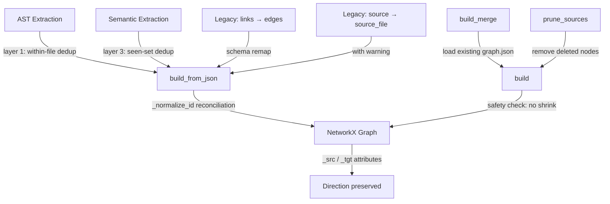
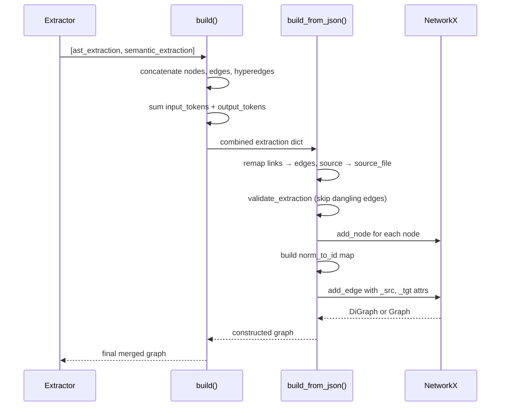

# Graph Building: From Extraction Dicts to NetworkX

The `build.py` module transforms raw extraction dictionaries — produced by AST and semantic extractors — into a NetworkX graph, applying three layers of deduplication and preserving edge direction metadata. It is the structural core that every export and analysis function depends on.

See [Clustering and Community Detection](05-clustering.md) for how the built graph feeds into Leiden clustering, and [Analysis](06-analysis.md) for what happens after the graph is constructed.

## Single Extraction: `build_from_json()`

`build_from_json(extraction, *, directed=False)` takes one extraction dict and returns a `nx.Graph` (undirected) or `nx.DiGraph` (directed). The `directed=True` flag preserves source-to-target edge direction, which matters for display functions that otherwise show edges backwards ([`build.py:42-106`](graphify/build.py:42)).

```python
from graphify.build import build_from_json

extraction = {
    "nodes": [{"id": "auth_login", "label": "login", "source_file": "auth.py"}],
    "edges": [{"source": "auth_login", "target": "db_query", "relation": "calls"}],
}
G = build_from_json(extraction, directed=True)
# G is a DiGraph — edge auth_login → db_query has a defined direction
```

### Legacy Schema Handling

The function silently remaps old schema formats so extractions from earlier graphify versions still work:

- `"links"` → `"edges"` (NetworkX <= 3.1 serialization used `"links"`) — [`build.py:49-50`](graphify/build.py:49)
- Node `"source"` → `"source_file"` with a stderr warning that counts affected edges — [`build.py:53-67`](graphify/build.py:53)
- Edge `"from"` → `"source"` and `"to"` → `"target"` — [`build.py:83-86`](graphify/build.py:83)

The `"source"` → `"source_file"` rename prints a warning like:

```
[graphify] WARNING: node 'auth_login' uses field 'source' instead of 'source_file' — 3 edge(s) may be misrouted.
```

### Dangling Edge Handling

Edges whose source or target do not match any node ID are silently dropped. This is expected behavior for stdlib or external import edges. Only real schema errors (not dangling edges) are printed as warnings — [`build.py:70-73`](graphify/build.py:70).

**Aha: dangling edges are a feature, not a bug.** When `extract.py` produces an edge `auth_digest_auth --imports--> os`, the `os` node doesn't exist in the graph because stdlib modules aren't extracted. The edge is dropped, but the fact that it was dropped tells you this file imports from the standard library. The `GRAPH_REPORT.md` knowledge gaps section flags files with many dropped edges as potentially having untracked dependencies.

### ID Normalization via `_normalize_id()`

Before dropping an edge, the function tries to reconcile mismatched IDs. `_normalize_id(s)` lowercases the string and replaces all non-alphanumeric characters with underscores, stripping leading/trailing underscores — [`build.py:32-39`](graphify/build.py:32).

```python
_normalize_id("Session_ValidateToken")  # → "session_validatetoken"
_normalize_id("session-validate-token")  # → "session_validatetoken" (same result)
```

A normalized map `norm_to_id` lets edges survive when the LLM generates IDs with slightly different casing or punctuation than the AST extractor — [`build.py:80-94`](graphify/build.py:80).

**Aha: this is how AST and LLM extractions merge.** The AST extractor produces IDs like `auth_digest_auth` while the LLM might produce `Auth-Digest-Auth`. Without normalization, every LLM edge would be dropped as dangling. The `norm_to_id` map reconciles these formats so both extraction methods contribute to the same graph.

### Edge Direction Preservation

Even in undirected graphs, the original edge direction is preserved via `_src` and `_tgt` attributes stored on every edge. This prevents display functions from showing edges backwards — [`build.py:98-102`](graphify/build.py:98).

```python
# Edge stored with direction metadata
G.edges["auth_login", "db_query"]
# → {"relation": "calls", "_src": "auth_login", "_tgt": "db_query", ...}
```

## Merging Multiple Extractions: `build()`

`build(extractions, *, directed=False)` merges a list of extraction dicts into one graph. Nodes and edges are concatenated in order, then passed to `build_from_json()`. Because NetworkX `add_node()` is idempotent, the last extraction's attributes win for duplicate node IDs — [`build.py:109-127`](graphify/build.py:109).

```python
G = build([ast_extraction, semantic_extraction], directed=True)
# semantic_extraction nodes overwrite AST nodes with the same ID
```

Pass AST results before semantic results so semantic labels (richer, cross-file context) take precedence over AST nodes (precise `source_location` but less context) — [`build.py:115-118`](graphify/build.py:115).

## Three-Layer Deduplication

### Layer 1: Within-File (AST Extractor)

Each extractor tracks a `seen_ids` set. A node ID is emitted at most once per file, so duplicate class or function definitions within the same source file are collapsed to the first occurrence — [`build.py:4-7`](graphify/build.py:4).

### Layer 2: Between-Files (Build Phase)

NetworkX `add_node()` is idempotent — calling it twice with the same ID overwrites attributes with the second call's values. Nodes are added in extraction order (AST first, then semantic), so semantic nodes silently overwrite AST nodes for the same entity — [`build.py:9-16`](graphify/build.py:9).

### Layer 3: Semantic Merge (Skill Level)

Before `build()` is called, the skill merges cached and new semantic results using an explicit `seen` set keyed on `node["id"]`. Duplicates across cache hits and new extractions are resolved before any graph construction — [`build.py:18-21`](graphify/build.py:18).

## Deduplication by Label: `deduplicate_by_label()`

`deduplicate_by_label(nodes, edges)` merges nodes that share a normalized label (lowercase, alphanumeric only). It prefers IDs without chunk suffixes (`_c\d+`) and shorter IDs when tied, then rewrites all edge references and drops self-loops created by the merge — [`build.py:135-178`](graphify/build.py:135).

```python
# These three nodes all normalize to the same label "user authentication"
nodes = [
    {"id": "user_auth_c1", "label": "User Authentication"},
    {"id": "user_authentication", "label": "user authentication"},
    {"id": "ua", "label": "USER-AUTHENTICATION"},
]
deduped_nodes, deduped_edges = deduplicate_by_label(nodes, edges)
# "user_authentication" wins (no chunk suffix, shorter than "ua")
```

The normalization function `_norm_label()` strips all non-alphanumeric characters and lowercases — [`build.py:130-132`](graphify/build.py:130).

## Incremental Updates: `build_merge()`

`build_merge(new_chunks, graph_path, prune_sources=None, *, directed=False)` loads an existing `graph.json`, merges new chunk extractions into it, and saves back. It never replaces — only grows (or prunes deleted-file nodes via `prune_sources`) — [`build.py:181-234`](graphify/build.py:181).

### Safety Check: Refuses to Shrink

If the merged graph has fewer nodes than the existing one and `prune_sources` was not passed, `build_merge()` raises a `ValueError` to prevent silent data loss — [`build.py:224-232`](graphify/build.py:224).

```
ValueError: graphify: build_merge would shrink graph from 150 → 120 nodes.
Pass prune_sources explicitly if you intend to remove nodes.
```

### Pruning Deleted Sources

When source files are deleted, pass their paths to `prune_sources` to cleanly remove their nodes:

```python
G = build_merge(new_chunks, prune_sources=["src/old_module.py"])
# Pruned 15 node(s) from deleted sources.
```

Nodes are removed if their `source_file` attribute matches any path in `prune_sources` — [`build.py:215-222`](graphify/build.py:215).

### Validation Integration

`build_from_json()` calls `validate_extraction()` from the `validate` module and filters out "does not match any node id" errors (these are expected for dangling edges). Remaining errors are printed as stderr warnings — [`build.py:69-73`](graphify/build.py:69).

## Architecture Diagram



## Data Flow Diagram



## Quick Reference

| Function | Purpose | Key Parameters |
|---|---|---|
| `build_from_json()` | Single extraction → graph | `extraction`, `directed` |
| `build()` | Merge multiple extractions | `extractions` (list), `directed` |
| `deduplicate_by_label()` | Merge same-label nodes | `nodes`, `edges` |
| `build_merge()` | Incremental graph update | `new_chunks`, `graph_path`, `prune_sources` |
| `_normalize_id()` | Reconcile LLM vs AST IDs | `s` (string) |
