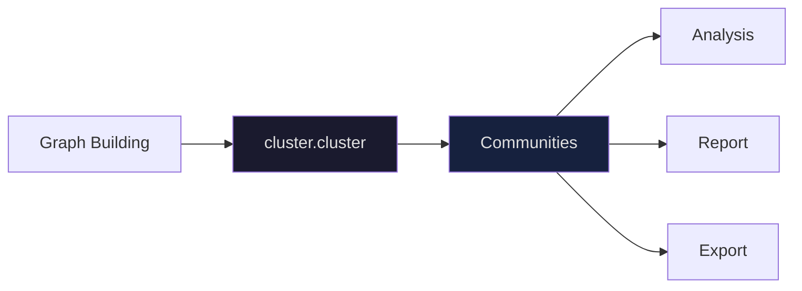
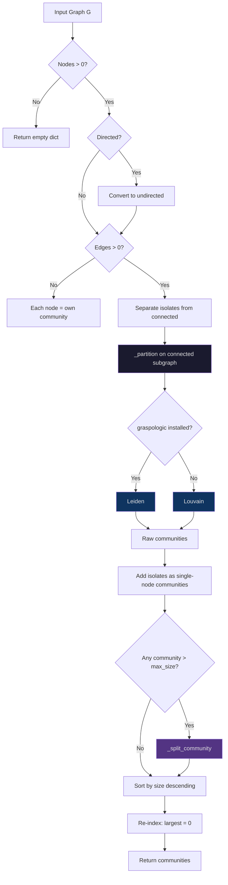
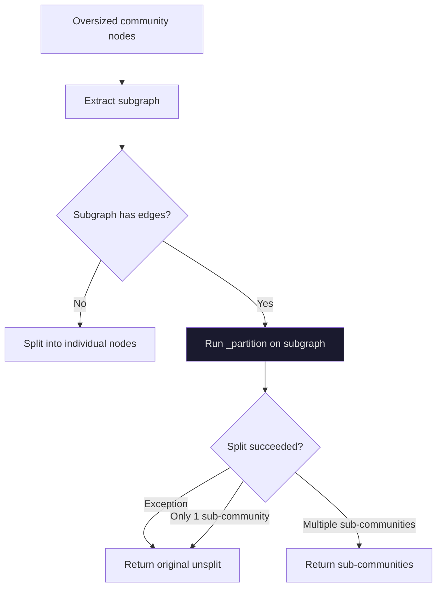

# Graphify -- Clustering

Community detection groups related nodes into clusters based on graph topology alone. No embeddings, no LLM calls -- just edge structure. The `cluster.py` module runs Leiden community detection (with Louvain fallback), splits oversized communities, handles isolates, and scores cohesion.

**Source:** `graphify/cluster.py`

---

## Pipeline Position

Clustering sits after graph building and before analysis. The graph is fully assembled (nodes, edges, confidence labels) before any community detection runs.



---

## The `cluster()` Function

The main entry point. Takes a NetworkX graph and returns a dict mapping community IDs to lists of node IDs.

```python
# graphify/cluster.py:59
def cluster(G: nx.Graph) -> dict[int, list[str]]:
```

**Signature:** `cluster(G: nx.Graph) -> dict[int, list[str]]`

**Returns:** `{community_id: [node_ids]}` where community 0 is always the largest.

### Execution Steps

1. Empty graph -- return `{}`
2. Directed graph -- convert to undirected (Leiden/Louvain require undirected input)
3. Edgeless graph -- each node gets its own community
4. Separate isolates (degree-0 nodes) from connected nodes
5. Run `_partition()` on the connected subgraph
6. Assign each isolate its own single-node community
7. Split any community exceeding the size threshold
8. Re-index communities by size descending (largest = 0)

```python
# graphify/cluster.py:69-74
if G.number_of_nodes() == 0:
    return {}
if G.is_directed():
    G = G.to_undirected()
if G.number_of_edges() == 0:
    return {i: [n] for i, n in enumerate(sorted(G.nodes))}
```

---

## Algorithm Dispatch: `_partition()`

The `_partition()` function runs the actual community detection algorithm. It tries Leiden first, then falls back to Louvain.

```python
# graphify/cluster.py:21
def _partition(G: nx.Graph) -> dict[str, int]:
```

**Returns:** `{node_id: community_id}`

### Algorithm Priority

| Priority | Algorithm | Library | Notes |
|----------|-----------|---------|-------|
| 1 | Leiden | `graspologic.partition.leiden` | Best quality, preferred |
| 2 | Louvain | `nx.community.louvain_communities` | Built into NetworkX 2.7+, automatic fallback |

The fallback happens via a simple `try/except ImportError` on `graspologic`. If graspologic is not installed, Louvain runs instead.

### Louvain Compatibility

The Louvain call inspects the function signature at runtime to detect whether `max_level` is supported:

```python
# graphify/cluster.py:48-50
kwargs: dict = {"seed": 42, "threshold": 1e-4}
if "max_level" in inspect.signature(nx.community.louvain_communities).parameters:
    kwargs["max_level"] = 10
```

The `max_level` parameter was added in a later NetworkX release and prevents hangs on large sparse graphs.

---

## Clustering Flow



---

## Oversized Community Splitting

Two constants control when splitting occurs:

| Constant | Value | Purpose |
|----------|-------|---------|
| `_MAX_COMMUNITY_FRACTION` | `0.25` | Communities larger than 25% of graph nodes get split |
| `_MIN_SPLIT_SIZE` | `10` | Only split if community has at least 10 nodes |

The actual threshold is `max(_MIN_SPLIT_SIZE, int(G.number_of_nodes() * _MAX_COMMUNITY_FRACTION))`. This means for a 100-node graph, any community with more than 25 nodes is split. For a 20-node graph, the threshold is 10 (the minimum).

```python
# graphify/cluster.py:55-56
_MAX_COMMUNITY_FRACTION = 0.25
_MIN_SPLIT_SIZE = 10
```

### `_split_community()`

Runs a second Leiden/Louvain pass on the subgraph of the oversized community.

```python
# graphify/cluster.py:107
def _split_community(G: nx.Graph, nodes: list[str]) -> list[list[str]]:
```

**Behavior:**

1. Extract the subgraph for the community's nodes
2. If the subgraph has no edges, split into individual single-node communities
3. Run `_partition()` on the subgraph
4. If the partition produces only one community (cannot be split further), return the original
5. If `_partition()` raises any exception, return the original unsplit community

This function is **not recursive** in the strict sense -- it calls `_partition()` once on the subgraph. If the result is still oversized after one split pass, it stays as-is.



---

## Isolate Handling

Disconnected nodes (degree 0) are handled separately because Leiden warns and drops them. Before running `_partition()`, the code separates isolates from connected nodes:

```python
# graphify/cluster.py:77-78
isolates = [n for n in G.nodes() if G.degree(n) == 0]
connected_nodes = [n for n in G.nodes() if G.degree(n) > 0]
```

Each isolate gets its own single-node community with a unique ID:

```python
# graphify/cluster.py:88-90
next_cid = max(raw.keys(), default=-1) + 1
for node in isolates:
    raw[next_cid] = [node]
    next_cid += 1
```

---

## Deterministic Ordering

Communities are re-indexed by size descending after all splitting is complete. This means community 0 is always the largest, community 1 is the second largest, and so on:

```python
# graphify/cluster.py:103-104
final_communities.sort(key=len, reverse=True)
return {i: sorted(nodes) for i, nodes in enumerate(final_communities)}
```

Within each community, node IDs are alphabetically sorted. This guarantees deterministic output across runs given the same graph.

---

## Cohesion Scoring

### `cohesion_score()`

Measures how tightly connected a community is. Returns the ratio of actual intra-community edges to the maximum possible edges.

```python
# graphify/cluster.py:125
def cohesion_score(G: nx.Graph, community_nodes: list[str]) -> float:
```

**Formula:** `actual_edges / (n * (n - 1) / 2)`

Where `n` is the number of nodes in the community and the denominator is the maximum number of undirected edges in a complete graph.

| Community size | Max possible edges | Cohesion 1.0 means |
|---------------|-------------------|---------------------|
| 1 node | 0 | Returns 1.0 (trivially cohesive) |
| 2 nodes | 1 | Both nodes connected |
| 5 nodes | 10 | All 10 possible edges exist |
| 10 nodes | 45 | All 45 possible edges exist |

The result is rounded to 2 decimal places.

### `score_all()`

Convenience function that computes `cohesion_score()` for every community in the dict:

```python
# graphify/cluster.py:136-137
def score_all(G: nx.Graph, communities: dict[int, list[str]]) -> dict[int, float]:
    return {cid: cohesion_score(G, nodes) for cid, nodes in communities.items()}
```

---

## Directed Graph Handling

Both Leiden and Louvain require undirected input. If the input graph is a `DiGraph`, `cluster()` converts it to undirected before processing:

```python
# graphify/cluster.py:71-72
if G.is_directed():
    G = G.to_undirected()
```

This conversion is local to `cluster()` -- the caller's original directed graph is not modified. The `to_undirected()` call merges bidirectional edges into single undirected edges.

---

## Topology-Only Clustering

Clustering is purely graph-topology-based. No node attributes (labels, source files, file types), no embeddings, and no LLM calls are used. The only inputs are nodes and edges. This makes clustering fast, deterministic (given fixed random seeds), and independent of the extraction quality.

---

## Output Suppression on Windows

graspologic's `leiden()` function emits ANSI escape sequences (progress bars, colored warnings) that corrupt PowerShell 5.1's scroll buffer on Windows (see issue #19). Two suppression mechanisms prevent this:

```python
# graphify/cluster.py:10-18
def _suppress_output():
    """Context manager to suppress stdout/stderr during library calls."""
    return contextlib.redirect_stdout(io.StringIO())
```

During the Leiden call, both stdout and stderr are redirected:

```python
# graphify/cluster.py:34-39
old_stderr = sys.stderr
try:
    sys.stderr = io.StringIO()
    with _suppress_output():
        result = leiden(G)
finally:
    sys.stderr = old_stderr
```

This prevents ANSI codes from reaching the terminal without losing any graphify output.

---

## Summary

| Aspect | Detail |
|--------|--------|
| Primary algorithm | Leiden (graspologic) |
| Fallback algorithm | Louvain (NetworkX) |
| Split threshold | 25% of graph or 10 nodes (whichever is larger) |
| Isolate handling | Each gets own community |
| Ordering | Largest community = ID 0 |
| Cohesion metric | Intra-community edges / max possible edges |
| Input requirement | Undirected (auto-converts DiGraph) |
| Embeddings used | None -- pure topology |

---

## Next

- [06-analysis](./06-analysis.md) -- god nodes, surprising connections, suggested questions
- [04-graph-building](./04-graph-building.md) -- how the graph is assembled before clustering
