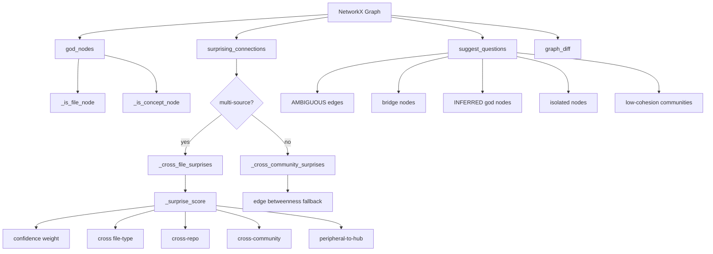
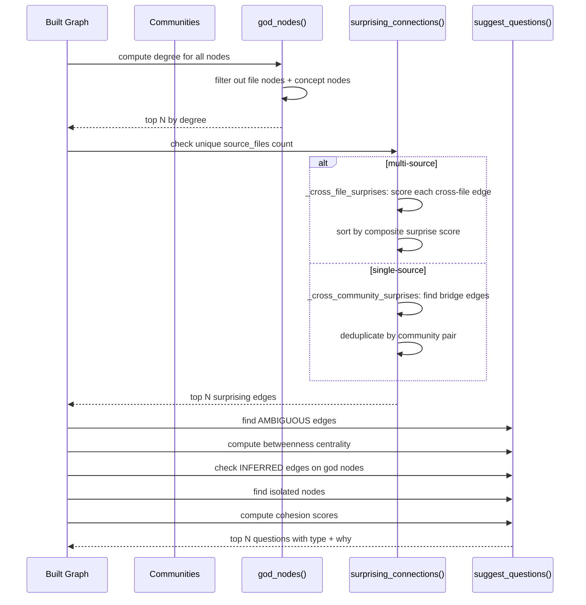

# Graph Analysis: God Nodes, Surprises, and Suggested Questions

The `analyze.py` module answers three questions about any knowledge graph: what are the core abstractions, what connections are non-obvious, and what questions does the graph uniquely position us to answer. It operates on the NetworkX graph after clustering has assigned nodes to communities.

See [Graph Building](04-graph-building.md) for how the graph is constructed, and [Clustering](05-clustering.md) for how communities are detected before analysis runs.

## God Nodes: The Core Abstractions

`god_nodes(G, top_n=10)` returns the top N most-connected real entities, sorted by degree. File-level hub nodes and concept nodes are excluded because they accumulate edges mechanically and do not represent meaningful architectural abstractions — [`analyze.py:39-58`](graphify/analyze.py:39).

```python
from graphify.analyze import god_nodes

top = god_nodes(G, top_n=5)
# [{"id": "auth_login", "label": "login", "degree": 23}, ...]
```

### `_is_file_node()`: Detection Rules

A node is classified as a file-level hub if any of these conditions hold — [`analyze.py:11-36`](graphify/analyze.py:11):

1. **File-level hub**: The node's `label` matches the basename of its `source_file` (e.g., label `"client"` with `source_file="src/client.py"`).
2. **Method stub**: The label starts with `.` and ends with `()` (e.g., `.auth_flow()`), which is how the AST extractor labels method stubs.
3. **Module-level function stub**: The label ends with `()` and the node has degree <= 1 — these are real functions but structurally isolated by definition.

```python
def _is_file_node(G, node_id):
    attrs = G.nodes[node_id]
    label = attrs.get("label", "")
    # File-level hub: label matches actual source filename
    source_file = attrs.get("source_file", "")
    if source_file and label == Path(source_file).name:
        return True
    # Method stub: ".method_name()"
    if label.startswith(".") and label.endswith("()"):
        return True
    # Module-level stub: "function_name()" with degree <= 1
    if label.endswith("()") and G.degree(node_id) <= 1:
        return True
    return False
```

### `_is_concept_node()`: Empty or Non-File Labels

A node is a concept node if it was manually injected for semantic annotation rather than found in source code — [`analyze.py:93-109`](graphify/analyze.py:93):

- `source_file` is empty or missing
- `source_file` has no file extension in its basename (e.g., `"Architecture Pattern"` is a concept label, not a real file path)

Concept nodes are excluded from god nodes, surprising connections, and knowledge gap reporting because they are intentional annotations, not discovered entities.

## Surprising Connections: Two Strategies

`surprising_connections(G, communities, top_n=5)` uses two different strategies depending on the corpus — [`analyze.py:61-90`](graphify/analyze.py:61).

### Multi-File Corpora: Cross-File Surprise Scoring

When the graph contains nodes from more than one unique `source_file`, the function uses `_cross_file_surprises()`. It finds edges between real entities from different files, ranks them by a composite surprise score, and returns the top N — [`analyze.py:187-246`](graphify/analyze.py:187).

Structural edges (`imports`, `imports_from`, `contains`, `method`) are skipped because they are expected, not surprising.

### Single-File Corpora: Cross-Community Betweenness

When there is only one source file, `_cross_community_surprises()` finds edges that bridge different Leiden communities. Without community info, it falls back to edge betweenness centrality — [`analyze.py:249-334`](graphify/analyze.py:249).

Results are deduplicated by community pair so a single high-betweenness god node does not dominate all results — [`analyze.py:327-334`](graphify/analyze.py:327).

## Surprise Scoring Table

`_surprise_score()` computes a composite score from five factors — [`analyze.py:131-184`](graphify/analyze.py:131):

| Factor | Score | Example Reason |
|---|---|---|
| **AMBIGUOUS** confidence | +3 | "ambiguous connection - not explicitly stated in source" |
| **INFERRED** confidence | +2 | "inferred connection - not explicitly stated in source" |
| **EXTRACTED** confidence | +1 | baseline |
| Cross file-type | +2 | "crosses file types (code ↔ paper)" |
| Cross-repo (different top-level dir) | +2 | "connects across different repos/directories" |
| Cross-community (Leiden) | +1 | "bridges separate communities" |
| `semantically_similar_to` relation | ×1.5 multiplier | "semantically similar concepts with no structural link" |
| Peripheral-to-hub (deg<=2 to deg>=5) | +1 | "peripheral node `x` unexpectedly reaches hub `y`" |

The minimum score is 1 (EXTRACTED, same file-type, same repo, same community). The maximum unbounded score grows with each additional factor.

### File Type Categories

`_file_category()` classifies paths using extension sets from `graphify.detect` — [`analyze.py:115-123`](graphify/analyze.py:115):

- **code**: `.py`, `.ts`, `.rs`, `.go`, `.java`, etc.
- **paper**: `.pdf`
- **image**: `.png`, `.jpg`, `.gif`, `.webp`, `.svg`
- **doc**: everything else (`.md`, `.txt`, `.rst`, etc.)

### Cross-Repo Detection

`_top_level_dir()` returns the first path component. Different top-level directories trigger the cross-repo bonus — [`analyze.py:126-128`](graphify/analyze.py:126).

## Suggested Questions: What the Graph Can Answer

`suggest_questions(G, communities, community_labels, top_n=7)` generates questions the graph is uniquely positioned to answer — [`analyze.py:337-456`](graphify/analyze.py:337). Each question has a `type`, `question`, and `why` field.

### Question Types

1. **`ambiguous_edge`**: Generated for every AMBIGUOUS-confidence edge. Asks what the exact relationship is between the two nodes.

2. **`bridge_node`**: Generated for high-betweenness centrality nodes that connect multiple communities. Uses `nx.betweenness_centrality()` with k-sampling for large graphs (>1000 nodes) — [`analyze.py:364-386`](graphify/analyze.py:364).

3. **`verify_inferred`**: Generated for god nodes with 2+ INFERRED edges. Asks whether the model-reasoned connections are actually correct — [`analyze.py:388-417`](graphify/analyze.py:388).

4. **`isolated_nodes`**: Generated when weakly-connected nodes (degree <= 1) exist. Asks what connects them to the rest of the system — [`analyze.py:419-430`](graphify/analyze.py:419).

5. **`low_cohesion`**: Generated for communities with cohesion score < 0.15 and 5+ nodes. Asks whether the community should be split into smaller modules — [`analyze.py:432-442`](graphify/analyze.py:432).

If no signal is found, a single `no_signal` question is returned explaining that the corpus needs more files or deeper extraction — [`analyze.py:444-454`](graphify/analyze.py:444).

## Graph Diff: Comparing Snapshots

`graph_diff(G_old, G_new)` compares two graph snapshots and returns what changed — [`analyze.py:459-540`](graphify/analyze.py:459).

```python
diff = graph_diff(G_before, G_after)
# {
#   "new_nodes": [{"id": "new_func", "label": "new_function"}],
#   "removed_nodes": [],
#   "new_edges": [{"source": "a", "target": "b", "relation": "calls", "confidence": "EXTRACTED"}],
#   "removed_edges": [],
#   "summary": "1 new node, 1 new edge"
# }
```

Edge comparison is relation-aware: for directed graphs, edges are keyed as `(u, v, relation)`. For undirected graphs, they are normalized to `(min(u,v), max(u,v), relation)`.

## Helper: Community Map Inversion

`_node_community_map(communities)` inverts a `{community_id: [node_ids]}` dict into `{node_id: community_id}`. This is used by both surprise scoring and question generation — [`analyze.py:6-8`](graphify/analyze.py:6).

## Architecture Diagram



## Analysis Pipeline Flow



## Quick Reference

| Function | Purpose | Key Parameters |
|---|---|---|
| `god_nodes()` | Top N most-connected entities | `G`, `top_n` |
| `surprising_connections()` | Non-obvious cross-file/community edges | `G`, `communities`, `top_n` |
| `suggest_questions()` | Generate architecture questions | `G`, `communities`, `community_labels`, `top_n` |
| `graph_diff()` | Compare two graph snapshots | `G_old`, `G_new` |
| `_is_file_node()` | Detect file-level hub nodes | `G`, `node_id` |
| `_is_concept_node()` | Detect semantic concept nodes | `G`, `node_id` |
| `_surprise_score()` | Composite surprise scoring | `G`, `u`, `v`, `data`, `node_community` |
