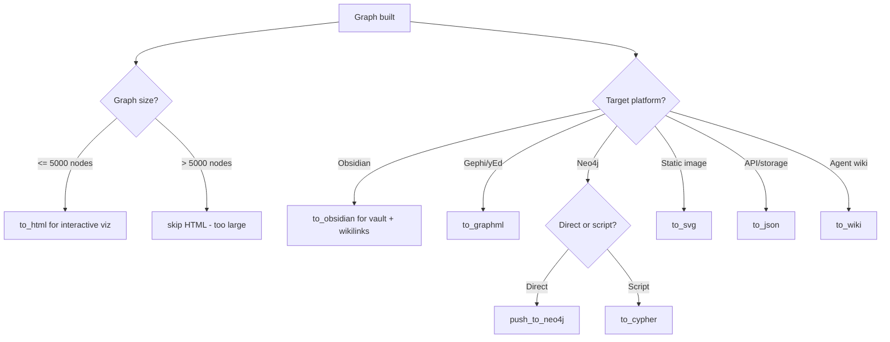

# Report Generation and Export Formats

The `report.py` module generates a human-readable audit trail as `GRAPH_REPORT.md`, while `export.py` and `wiki.py` write the graph to interactive HTML, SVG, GraphML, Obsidian vaults, Neo4j Cypher scripts, and Canvas files. Together they answer: what did the graph find, and how do I navigate it?

See [Analysis](06-analysis.md) for how god nodes and surprising connections are computed before they appear in the report.

## Report Generation: `report.py`

`generate()` assembles a complete `GRAPH_REPORT.md` string from the graph, communities, analysis results, and token cost data — [`report.py:15-181`](graphify/report.py:15).

### Report Sections

The report contains these sections in order:

1. **Corpus Check**: File count, word count, and verdict on whether the corpus is large enough for graph analysis. If the corpus is too small, a warning is shown instead — [`report.py:42-50`](graphify/report.py:42).

2. **Summary**: Node count, edge count, community count, confidence breakdown percentages, token cost, and INFERRED average confidence — [`report.py:56-63`](graphify/report.py:56).

3. **Community Hubs (Navigation)**: Wikilinks to `_COMMUNITY_*.md` files in the Obsidian vault. Without these, the report is a dead-end and the vault splits into disconnected components — [`report.py:67-72`](graphify/report.py:67).

4. **God Nodes**: Numbered list of the most-connected abstractions with their degree — [`report.py:74-79`](graphify/report.py:74).

5. **Surprising Connections**: Each connection shows the source and target labels, relation type, confidence tag (with INFERRED score if applicable), source files, and explanatory note — [`report.py:81-99`](graphify/report.py:81).

6. **Hyperedges**: Group relationships with node labels and confidence — [`report.py:101-109`](graphify/report.py:101).

7. **Communities**: For each community, shows the label, cohesion score, and up to 8 member nodes (with a "+N more" suffix for larger communities) — [`report.py:111-126`](graphify/report.py:111).

8. **Ambiguous Edges**: Lists all AMBIGUOUS-confidence edges for review — [`report.py:128-137`](graphify/report.py:128).

9. **Knowledge Gaps**: Shows isolated nodes, thin communities (fewer than 3 real nodes), and high ambiguity warnings (>20% AMBIGUOUS edges) — [`report.py:139-166`](graphify/report.py:139).

10. **Suggested Questions**: Questions the graph is uniquely positioned to answer — [`report.py:168-179`](graphify/report.py:168).

### Confidence Breakdown

The report computes percentages for each confidence level across all edges — [`report.py:29-33`](graphify/report.py:29):

```
- Extraction: 45% EXTRACTED · 38% INFERRED · 17% AMBIGUOUS
```

INFERRED edges also show an average confidence score (the `confidence_score` attribute, defaulting to 0.5 for INFERRED edges):

```
· INFERRED: 42 edges (avg confidence: 0.73)
```

The default confidence scores are defined in `export.py` — [`export.py:283`](graphify/export.py:283):
- EXTRACTED: 1.0
- INFERRED: 0.5
- AMBIGUOUS: 0.2

### Community Hub Navigation

Community hub links use `_safe_community_name()` to generate safe filenames that match the Obsidian vault export. This function strips special characters (`\/*?:"<>|#^[]`), replaces newlines with spaces, and removes trailing `.md`/`.mdx`/`.markdown` extensions — [`report.py:8-12`](graphify/report.py:8).

```python
_safe_community_name("Data & Analytics")  # → "Data  Analytics"
_safe_community_name("CLAUDE.md")          # → "CLAUDE"
```

## Export Formats: `export.py`

### Output Format Comparison

| Format | Function | Best For | Dependencies |
|---|---|---|---|
| **JSON** | `to_json()` | Graph storage, API exchange | NetworkX (built-in) |
| **HTML** | `to_html()` | Interactive browser visualization | vis.js (CDN) |
| **SVG** | `to_svg()` | Static images, GitHub READMEs | matplotlib |
| **Canvas** | `to_canvas()` | Obsidian Canvas layout | None |
| **Obsidian** | `to_obsidian()` | Obsidian vault with wikilinks | None |
| **Wiki** | `to_wiki()` (wiki.py) | Agent-crawlable wiki articles | None |
| **GraphML** | `to_graphml()` | Gephi, yEd import | NetworkX (built-in) |
| **Neo4j** | `push_to_neo4j()` | Production graph database | `neo4j` package |
| **Cypher** | `to_cypher()` | Cypher script generation | None |

### JSON Export: NetworkX Node-Link Format

`to_json(G, communities, output_path, *, force=False)` serializes the graph using NetworkX's `node_link_data` format, adds community IDs and normalized labels to each node, and fills in `confidence_score` defaults for edges — [`export.py:297-333`](graphify/export.py:297).

Safety check: refuses to overwrite an existing `graph.json` if the new graph has fewer nodes (unless `force=True`) — [`export.py:299-316`](graphify/export.py:299).

### HTML Export: Interactive vis.js Visualization

`to_html(G, communities, output_path, community_labels, member_counts)` generates a fully interactive HTML file — [`export.py:378-503`](graphify/export.py:378).

**Features:**
- Dark theme (`#0f0f1a` background) — [`export.py:29-61`](graphify/export.py:29)
- Node size scaled by degree (or community member count) — [`export.py:413-418`](graphify/export.py:413)
- ForceAtlas2-based physics layout with 200 stabilization iterations — [`export.py:137-150`](graphify/export.py:137)
- Click-to-inspect panel showing node type, community, source file, degree, and neighbors — [`export.py:166-183`](graphify/export.py:166)
- Search box with live autocomplete (top 20 matches) — [`export.py:215-238`](graphify/export.py:215)
- Community legend with click-to-filter (Show All / Hide All buttons) — [`export.py:245-279`](graphify/export.py:245)
- Confidence-styled edges: solid for EXTRACTED, dashed for INFERRED/AMBIGUOUS — [`export.py:439-448`](graphify/export.py:439)
- Hyperedge rendering as shaded regions via canvas overlay — [`export.py:64-104`](graphify/export.py:64)
- XSS prevention via `esc()` HTML-escape function and `</script>` sanitization — [`export.py:114-116`, `export.py:459-460`](graphify/export.py:459)

**Size limit:** Raises `ValueError` if the graph exceeds `MAX_NODES_FOR_VIZ` (5,000 nodes) — [`export.py:25`, `export.py:394-398`](graphify/export.py:394).

### SVG Export: Matplotlib Static Image

`to_svg(G, communities, output_path, community_labels, figsize)` produces a static SVG using matplotlib with a dark background (`#1a1a2e`) — [`export.py:997-1064`](graphify/export.py:997).

- Spring layout with seed 42 for reproducibility
- Node size scales with degree (300–1500 range)
- Community colors match the HTML output palette
- Dashed lines for non-EXTRACTED edges
- Legend showing community names and member counts

### Canvas Export: Obsidian Canvas File

`to_canvas(G, communities, output_path, community_labels, node_filenames)` generates a `.canvas` JSON file for Obsidian's infinite canvas — [`export.py:755-911`](graphify/export.py:755).

- Communities arranged in a grid layout (sqrt-based columns/rows)
- Nodes arranged in rows of 3 within each community group
- Edges capped at 200 highest-weight connections
- Six canvas colors cycle through communities

### GraphML Export

`to_graphml(G, communities, output_path)` writes a standard GraphML file that opens in Gephi or yEd — [`export.py:980-994`](graphify/export.py:980). Community IDs are added as node attributes for coloring.

### Neo4j Integration

**`to_cypher()`**: Generates a `.cypher` script file with MERGE statements for nodes and edges — [`export.py:356-375`](graphify/export.py:356). Node types are derived from `file_type` (capitalized, sanitized). Relation types are uppercased and sanitized.

**`push_to_neo4j()`**: Pushes the graph directly to a running Neo4j instance via the Python driver — [`export.py:914-977`](graphify/export.py:914). Uses MERGE for safe upserts. Returns `{"nodes": N, "edges": M}` counts.

### Obsidian Vault Export

`to_obsidian(G, communities, output_dir, community_labels, cohesion)` creates a full Obsidian vault — [`export.py:510-752`](graphify/export.py:510):

- One `.md` file per node with YAML frontmatter (source_file, type, community, tags) and wikilinks for connections
- One `_COMMUNITY_name.md` overview per community with member list, Dataview query, cross-community links, and top bridge nodes
- `.obsidian/graph.json` for community-colored graph view in Obsidian
- Filename deduplication with numeric suffixes
- Community tag format: `community/Community_Name`

### Wiki Export (wiki.py)

`to_wiki(G, communities, output_dir, community_labels, cohesion, god_nodes_data)` generates an agent-crawlable wiki — [`wiki.py:168-227`](graphify/wiki.py:168):

- **`index.md`**: Entry point with catalog of all communities and god nodes — [`wiki.py:128-165`](graphify/wiki.py:128)
- **Community articles**: One per community with key concepts, cross-community links, source files, and confidence audit trail — [`wiki.py:25-89`](graphify/wiki.py:25)
- **God node articles**: One per god node with connections grouped by relation type — [`wiki.py:92-125`](graphify/wiki.py:92)
- Slug deduplication with numeric suffixes — [`wiki.py:195-202`](graphify/wiki.py:195)

### Community Color Palette

`COMMUNITY_COLORS` defines a 10-color palette (Tableau 10) used consistently across HTML, SVG, Obsidian, and Canvas exports — [`export.py:20-23`](graphify/export.py:20):

| Index | Color | Usage |
|---|---|---|
| 0 | `#4E79A7` | Blue |
| 1 | `#F28E2B` | Orange |
| 2 | `#E15759` | Red |
| 3 | `#76B7B2` | Teal |
| 4 | `#59A14F` | Green |
| 5 | `#EDC948` | Yellow |
| 6 | `#B07AA1` | Purple |
| 7 | `#FF9DA7` | Pink |
| 8 | `#9C755F` | Brown |
| 9 | `#BAB0AC` | Gray |

### Label Sanitization

All user-facing labels pass through `security.sanitize_label()` before embedding in HTML, JSON, or other outputs. This strips control characters (`\x00-\x1f`, `\x7f`) and caps length at 256 characters — [`security.py:228-239`](graphify/security.py:228). The HTML export additionally uses `html.escape()` for direct DOM injection — [`export.py:410`](graphify/export.py:410).

## Architecture Diagram

```mermaid
graph TD
    G[NetworkX Graph] --> R[generate report.py]
    G --> E[export.py]
    G --> W[wiki.py]

    R --> S1[Corpus Check]
    R --> S2[Summary + Confidence %]
    R --> S3[Community Hubs nav]
    R --> S4[God Nodes]
    R --> S5[Surprising Connections]
    R --> S6[Communities + Cohesion]
    R --> S7[Ambiguous Edges]
    R --> S8[Knowledge Gaps]
    R --> S9[Suggested Questions]

    E --> J1[to_json: graph.json]
    E --> J2[to_html: graph.html]
    E --> J3[to_svg: graph.svg]
    E --> J4[to_canvas: canvas.json]
    E --> J5[to_obsidian: vault/]
    E --> J6[to_graphml: graph.graphml]
    E --> J7[to_cypher: import.cypher]
    E --> J8[push_to_neo4j]

    W --> W1[index.md]
    W --> W2[Community articles]
    W --> W3[God node articles]
```



## Export Decision Flow



## Quick Reference

| Function | Module | Output | Max Size |
|---|---|---|---|
| `generate()` | report.py | GRAPH_REPORT.md string | Unlimited |
| `to_json()` | export.py | graph.json | Unlimited |
| `to_html()` | export.py | graph.html | 5000 nodes |
| `to_svg()` | export.py | graph.svg | Unlimited (slow for large) |
| `to_canvas()` | export.py | canvas.json | Unlimited |
| `to_obsidian()` | export.py | vault/*.md | Unlimited |
| `to_wiki()` | wiki.py | wiki/*.md | Unlimited |
| `to_graphml()` | export.py | graph.graphml | Unlimited |
| `to_cypher()` | export.py | import.cypher | Unlimited |
| `push_to_neo4j()` | export.py | Neo4j database | Unlimited |
