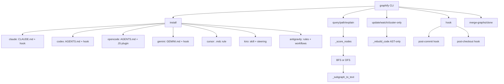
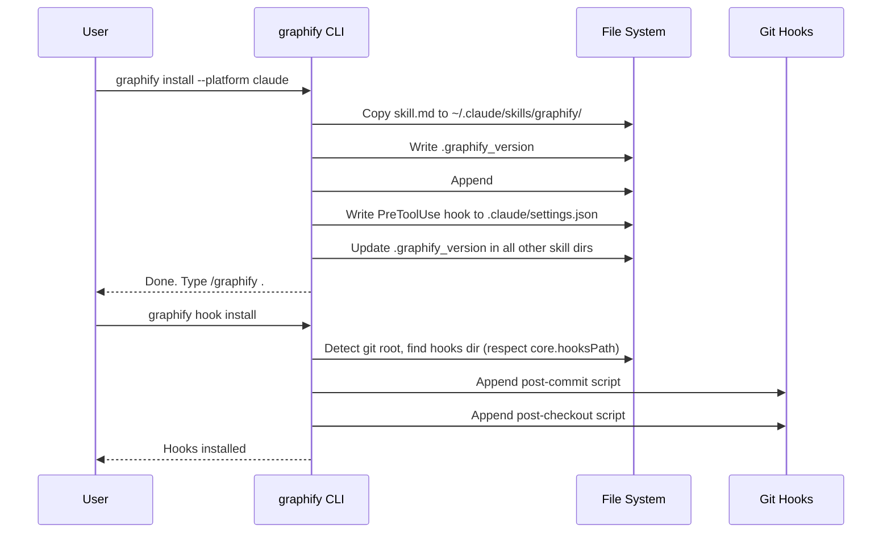

# CLI Integration: Commands, Platform Installs, and Hooks

The `__main__.py` module provides the `graphify` CLI, a single entry point that handles knowledge graph construction, platform-specific skill installation, graph querying, and git hook management. It integrates with 14+ AI coding platforms, each with its own skill file, configuration mechanism, and hook system.

See [Graph Building](04-graph-building.md) for the underlying graph construction and [Report Export](07-report-export.md) for output formats the CLI produces.

## All CLI Commands

Running `graphify --help` (or `graphify` with no arguments) prints the full command list — [`__main__.py:984-1051`](graphify/__main__.py:984).

### Core Commands

| Command | Description |
|---|---|
| `graphify` (no args) | Show help |
| `graphify install` | Copy skill to platform config dir (default: claude, or windows on Windows) |
| `graphify install --platform P` | Install for specific platform |
| `graphify update <path>` | Re-extract code files and update graph (AST-only, no LLM needed) |
| `graphify watch <path>` | Watch a folder and rebuild the graph on code changes |
| `graphify cluster-only <path>` | Re-run clustering on existing graph.json, regenerate report |
| `graphify check-update <path>` | Check `needs_update` flag for semantic re-extraction (cron-safe) |

### Graph Query Commands

| Command | Description |
|---|---|
| `graphify query "<question>"` | BFS traversal of graph.json for a question |
| `graphify query "<Q>" --dfs` | Use depth-first instead of breadth-first |
| `graphify query "<Q>" --budget N` | Cap output at N tokens (default 2000) |
| `graphify path "A" "B"` | Shortest path between two nodes |
| `graphify explain "X"` | Plain-language explanation of a node and its neighbors |

### Content Management

| Command | Description |
|---|---|
| `graphify add <url>` | Fetch a URL and save to `./raw`, then update the graph |
| `graphify clone <github-url>` | Clone a GitHub repo locally for `/graphify` processing |
| `graphify merge-graphs <g1> <g2>` | Merge two or more graph.json files into one cross-repo graph |
| `graphify save-result` | Save a Q&A result to `graphify-out/memory/` for feedback loop |

### Utility Commands

| Command | Description |
|---|---|
| `graphify benchmark [graph.json]` | Measure token reduction vs naive full-corpus approach |
| `graphify hook install` | Install post-commit/post-checkout git hooks |
| `graphify hook uninstall` | Remove git hooks |
| `graphify hook status` | Check if git hooks are installed |

### Platform-Specific Commands

Each platform has `install` and `uninstall` subcommands: `claude`, `gemini`, `cursor`, `vscode`, `copilot`, `codex`, `opencode`, `aider`, `claw`, `droid`, `trae`, `trae-cn`, `hermes`, `kiro`, `antigravity`.

## Platform Install Matrix

The `install(platform)` function dispatches to platform-specific installers — [`__main__.py:140-198`](graphify/__main__.py:140).

| Platform | Skill File | Config Destination | Mechanism |
|---|---|---|---|
| **claude** | `skill.md` | `~/.claude/skills/graphify/SKILL.md` | CLAUDE.md + PreToolUse hook |
| **codex** | `skill-codex.md` | `~/.agents/skills/graphify/SKILL.md` | AGENTS.md + PreToolUse hook |
| **opencode** | `skill-opencode.md` | `~/.config/opencode/skills/graphify/SKILL.md` | AGENTS.md + JS plugin |
| **gemini** | `skill.md` | `~/.gemini/skills/graphify/SKILL.md` | GEMINI.md + BeforeTool hook |
| **cursor** | N/A | `.cursor/rules/graphify.mdc` | MDC rule (alwaysApply: true) |
| **vscode** | `skill-vscode.md` | `~/.copilot/skills/graphify/SKILL.md` | copilot-instructions.md |
| **copilot** | `skill-copilot.md` | `~/.copilot/skills/graphify/SKILL.md` | Skill file only |
| **aider** | `skill-aider.md` | `~/.aider/graphify/SKILL.md` | AGENTS.md |
| **claw** | `skill-claw.md` | `~/.openclaw/skills/graphify/SKILL.md` | AGENTS.md |
| **droid** | `skill-droid.md` | `~/.factory/skills/graphify/SKILL.md` | AGENTS.md |
| **trae** | `skill-trae.md` | `~/.trae/skills/graphify/SKILL.md` | AGENTS.md |
| **trae-cn** | `skill-trae.md` | `~/.trae-cn/skills/graphify/SKILL.md` | AGENTS.md |
| **hermes** | `skill-claw.md` | `~/.hermes/skills/graphify/SKILL.md` | AGENTS.md |
| **kiro** | `skill-kiro.md` | `.kiro/skills/graphify/SKILL.md` | Skill + steering file |
| **windows** | `skill-windows.md` | `~/.claude/skills/graphify/SKILL.md` | CLAUDE.md + PreToolUse hook (default on Windows) |
| **antigravity** | `skill.md` | `~/.agents/skills/graphify/SKILL.md` | .agents/rules + .agents/workflows + YAML frontmatter |

### Platform-Specific Mechanisms

**PreToolUse Hooks (Claude Code, Codex):** JSON hooks in `.claude/settings.json` and `.codex/hooks.json` fire when grep/find/bash commands are used, injecting a reminder to read the knowledge graph first — [`__main__.py:40-60`, `__main__.py:713-731`](graphify/__main__.py:40).

**AGENTS.md (OpenCode, Aider, Claw, Droid, Trae, Hermes):** A `## graphify` section is appended to the project's `AGENTS.md` with rules for using the graph — [`__main__.py:214-226`, `__main__.py:770-796`](graphify/__main__.py:770).

**.cursor/rules (Cursor):** A `.mdc` file with `alwaysApply: true` frontmatter ensures Cursor always includes graph context — [`__main__.py:593-619`](graphify/__main__.py:593).

**GEMINI.md (Gemini):** A `## graphify` section is written to `GEMINI.md`, plus a BeforeTool hook in `.gemini/settings.json` — [`__main__.py:230-256`, `__main__.py:259-289`](graphify/__main__.py:259).

**.kiro/steering (Kiro):** A steering file with `inclusion: always` ensures Kiro always reads the graph context — [`__main__.py:457-494`](graphify/__main__.py:457).

**OpenCode Plugin:** A JavaScript plugin (`graphify.js`) registers a `tool.execute.before` hook that prepends a graph reminder to bash commands — [`__main__.py:632-686`](graphify/__main__.py:632).

### The `_PLATFORM_CONFIG` Dict

`_PLATFORM_CONFIG` maps platform names to their configuration — [`__main__.py:71-137`](graphify/__main__.py:71):

```python
_PLATFORM_CONFIG = {
    "claude": {
        "skill_file": "skill.md",
        "skill_dst": Path(".claude") / "skills" / "graphify" / "SKILL.md",
        "claude_md": True,  # Also register in ~/.claude/CLAUDE.md
    },
    "codex": {
        "skill_file": "skill-codex.md",
        "skill_dst": Path(".agents") / "skills" / "graphify" / "SKILL.md",
        "claude_md": False,
    },
    # ... 13 more platforms
}
```

Each entry specifies the skill file name, destination path, and whether to also register in `CLAUDE.md`.

## Version Tracking: `.graphify_version` Files

Every skill installation writes a `.graphify_version` file next to the skill file containing the current package version — [`__main__.py:168`](graphify/__main__.py:168).

On subsequent CLI runs (not during install/uninstall), `_check_skill_version()` compares installed versions against `__version__` and warns if they differ — [`__main__.py:18-25`](graphify/__main__.py:18).

`_refresh_all_version_stamps()` updates version stamps in all other previously-installed skill dirs after a successful install, preventing stale-version warnings from platforms that were installed previously but not explicitly re-installed — [`__main__.py:28-38`](graphify/__main__.py:28).

## Git Hooks Integration

`graphify hook install` installs two git hooks — [`hooks.py:195-206`](graphify/hooks.py:195):

### Post-Commit Hook

Runs after each commit, diffing `HEAD~1` against `HEAD` to find changed files. If any changed, it runs `_rebuild_code()` to update the graph (AST-only, no LLM cost). Skips during rebase/merge/cherry-pick — [`hooks.py:45-84`](graphify/hooks.py:45).

### Post-Checkout Hook

Runs on branch switches (not file checkouts). Rebuilds the code graph if `graphify-out/` exists. Also skips during rebase/merge/cherry-pick — [`hooks.py:87-126`](graphify/hooks.py:87).

Both hooks auto-detect the correct Python interpreter (handles pipx, venv, system installs) with an allowlist-based path sanitization to prevent injection — [`hooks.py:12-43`](graphify/hooks.py:12).

The hook installer respects `core.hooksPath` (e.g., Husky) and appends to existing hooks rather than overwriting them — [`hooks.py:138-171`](graphify/hooks.py:138).

## Query System: BFS/DFS with Token Budget

`graphify query "<question>"` performs graph traversal to find relevant context — [`__main__.py:1169-1226`](graphify/__main__.py:1169).

1. **Node Scoring**: `_score_nodes(G, terms)` scores nodes by how well their labels match the question's terms (words longer than 2 characters).
2. **Traversal**: Starts from the top 5 scored nodes and traverses to depth 2 using BFS (default) or DFS (`--dfs` flag).
3. **Token Budget**: `_subgraph_to_text()` caps output at N tokens (default 2000).

```bash
graphify query "How does authentication connect to the database?"
graphify query "How does auth work?" --dfs --budget 5000
graphify query "Explain the event system" --graph custom/path/graph.json
```

`graphify path "A" "B"` finds the shortest path between two nodes using `nx.shortest_path()`, scoring both labels via `_score_nodes()` first — [`__main__.py:1246-1294`](graphify/__main__.py:1246).

`graphify explain "X"` finds a node matching the label, prints its metadata (source, type, community, degree), and lists up to 20 neighbors sorted by degree — [`__main__.py:1296-1338`](graphify/__main__.py:1296).

## `_SETTINGS_HOOK`: Claude Code Grep/Find Interception

The `_SETTINGS_HOOK` intercepts Claude Code's Bash tool when the command contains grep, ripgrep, find, fd, ack, or ag — [`__main__.py:40-60`](graphify/__main__.py:40).

Since Claude Code v2.1.117 removed dedicated Grep/Glob tools (searches now go through Bash), the hook matches on `"Bash"` and inspects the command string. If it finds grep/find patterns and `graphify-out/graph.json` exists, it injects context suggesting the user read `GRAPH_REPORT.md` first.

## Architecture Diagram



## Platform Configuration Flow



## Platform Comparison: Hook Mechanisms

| Platform | Pre-Tool Interception | Persistent Instructions | Skill Discovery |
|---|---|---|---|
| Claude Code | PreToolUse hook in `settings.json` | `CLAUDE.md` | `~/.claude/skills/` |
| Codex | PreToolUse hook in `.codex/hooks.json` | `AGENTS.md` | `~/.agents/skills/` |
| OpenCode | JS `tool.execute.before` plugin | `AGENTS.md` | `~/.config/opencode/skills/` |
| Gemini | BeforeTool hook in `.gemini/settings.json` | `GEMINI.md` | `~/.gemini/skills/` |
| Cursor | None (alwaysApply rule) | `.cursor/rules/*.mdc` | N/A (rule-based) |
| VS Code | None | `.github/copilot-instructions.md` | `~/.copilot/skills/` |
| Aider | None | `AGENTS.md` | `~/.aider/` |
| Kiro | None (steering file) | `.kiro/steering/*.md` | `.kiro/skills/` |
| Antigravity | None | `.agents/rules/` + `.agents/workflows/` | `~/.agents/skills/` |

## Quick Reference

| Command | Source | Key Functions |
|---|---|---|
| `install` | `__main__.py:140` | `install()`, `_agents_install()`, `gemini_install()` |
| `query` | `__main__.py:1169` | `_score_nodes()`, `_bfs()`, `_dfs()` |
| `path` | `__main__.py:1246` | `_score_nodes()`, `nx.shortest_path()` |
| `explain` | `__main__.py:1296` | `_find_node()` |
| `hook install` | `__main__.py:1157` | `hooks.install()`, `hooks.uninstall()` |
| `update` | `__main__.py:1413` | `_rebuild_code()` |
| `cluster-only` | `__main__.py:1380` | `cluster()`, `score_all()`, `generate()` |
| `merge-graphs` | `__main__.py:1444` | `nx.compose_all()` |
| `save-result` | `__main__.py:1227` | `save_query_result()` |
