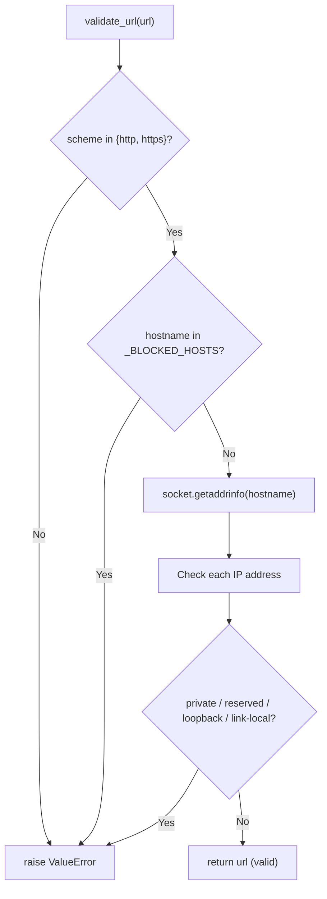
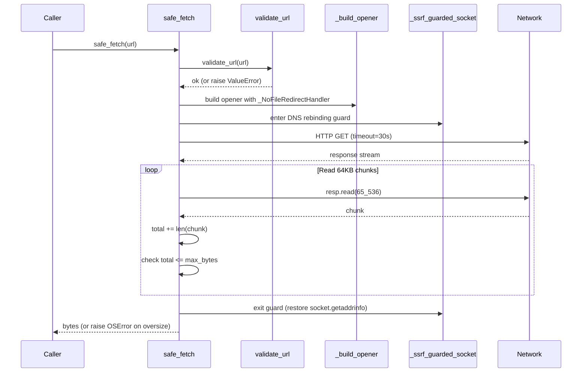
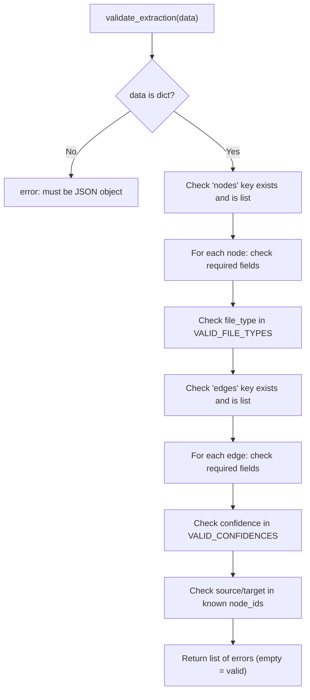

# Graphify -- Security and Validation

Graphify's security layer protects against server-side request forgery (SSRF), path traversal, DNS rebinding, and malformed extraction data. Every URL that enters the system passes through `security.py` before any network I/O, and every extraction JSON from an LLM is validated by `validate.py` before graph assembly. Together these modules form a defense-in-depth boundary between untrusted external input and the core pipeline.

Related: [Overview](00-overview.md) -- [Data Flow](11-data-flow.md)

## Threat Model

Graphify runs as a CLI tool inside a developer's workspace, which means it operates with the same permissions as the user. The security modules focus on the specific attack vectors that matter in this context.

| Threat | Attack Vector | Mitigation | Module |
|--------|--------------|------------|--------|
| SSRF via `file://` | `graphify ingest file:///etc/passwd` | Scheme allowlist (`http`, `https` only) | `security.py:15` |
| SSRF via redirect | `http://evil.com` redirects to `http://169.254.169.254/` | `_NoFileRedirectHandler` re-validates every redirect target | `security.py:101` |
| SSRF via private IP | URL resolves to `10.0.0.5` or `127.0.0.1` | DNS resolution + `ipaddress` check for private/reserved/loopback/link-local | `security.py:27` |
| SSRF via cloud metadata | `metadata.google.internal` or AWS `169.254.169.254` | Blocked hostnames + reserved IP range check | `security.py:20`, `security.py:57` |
| DNS rebinding | DNS returns public IP first, then private IP on actual connect | `_ssrf_guarded_socket` patches `socket.getaddrinfo` during fetch | `security.py:71` |
| Path traversal | `graphify query --graph ../../../etc/shadow` | `validate_graph_path` enforces containment within `graphify-out/` | `security.py:178` |
| Label injection | Malicious node labels with control chars or `<script>` | `sanitize_label` strips control chars, caps at 256, HTML-escapes | `security.py:228` |
| Malformed extraction | LLM returns JSON missing `id`, `label`, or with invalid `file_type` | `validate_extraction` checks every field and enum value | `validate.py:10` |
| Dangling edges | Edge references a node id that does not exist | Detected and reported as validation error | `validate.py:59` |

## URL Validation

The `validate_url` function (`security.py:27`) is the first line of defense. It rejects any URL that is not `http` or `https`, then resolves the hostname and checks every returned IP address against private, reserved, loopback, and link-local ranges using Python's `ipaddress` module.

```python
# security.py:15
_ALLOWED_SCHEMES = {"http", "https"}
_MAX_FETCH_BYTES = 52_428_800   # 50 MB hard cap for binary downloads
_MAX_TEXT_BYTES  = 10_485_760   # 10 MB hard cap for HTML / text

# security.py:20
_BLOCKED_HOSTS = {"metadata.google.internal", "metadata.google.com"}
```

Cloud metadata hostnames are blocked by name before DNS resolution. Private IP ranges are blocked by value after resolution. If DNS resolution itself fails, the URL is rejected with a descriptive error.



## DNS Rebinding Guard

The `_ssrf_guarded_socket` context manager (`security.py:71`) solves the time-of-check-to-time-of-use (TOCTOU) problem inherent in DNS rebinding attacks. A malicious DNS server could return a legitimate public IP during `validate_url` and then swap to a private IP when the actual HTTP connection is made. The guard patches `socket.getaddrinfo` for the duration of the fetch, re-validating every IP address at connect time.

```python
# security.py:71-98
@contextlib.contextmanager
def _ssrf_guarded_socket():
    original = socket.getaddrinfo
    def _guarded(host, port, *args, **kwargs):
        results = original(host, port, *args, **kwargs)
        for info in results:
            addr = info[4][0]
            ip = ipaddress.ip_address(addr)
            if ip.is_private or ip.is_reserved or ip.is_loopback or ip.is_link_local:
                raise OSError(f"SSRF blocked: IP {addr} resolved from '{host}' is private/reserved")
        return results
    socket.getaddrinfo = _guarded
    try:
        yield
    finally:
        socket.getaddrinfo = original
```

The comment in the source notes this is not thread-safe, but graphify is a single-threaded CLI tool so this is acceptable.

## Redirect Protection

The `_NoFileRedirectHandler` class (`security.py:101`) extends `urllib.request.HTTPRedirectHandler`. Every redirect target is re-validated through `validate_url` before the redirect is followed. This prevents open-redirect SSRF where a benign `http://` URL redirects to `file:///etc/passwd` or an internal service.

```python
# security.py:108-110
def redirect_request(self, req, fp, code, msg, headers, newurl):
    validate_url(newurl)          # raises ValueError if scheme is wrong
    return super().redirect_request(req, fp, code, msg, headers, newurl)
```

## Safe Fetch

`safe_fetch` (`security.py:121`) combines all protections into a single function. It validates the URL, builds a custom opener with the redirect handler, wraps the connection in the DNS rebinding guard, and streams the response body in 64 KB chunks with a hard size cap.

```python
# security.py:121-162
def safe_fetch(url: str, max_bytes: int = _MAX_FETCH_BYTES, timeout: int = 30) -> bytes:
```

The response is read in a loop of 64 KB chunks. If the cumulative total exceeds `max_bytes`, an `OSError` is raised and the connection is closed. Non-2xx status codes raise `urllib.error.HTTPError`. The `safe_fetch_text` wrapper (`security.py:165`) uses tighter defaults (10 MB cap, 15-second timeout) and decodes the result as UTF-8 with error replacement.



## Path Validation

`validate_graph_path` (`security.py:178`) prevents path traversal attacks by ensuring any requested path stays within the `graphify-out/` directory. If no explicit base is provided, it auto-detects `graphify-out` by walking up from the requested path. The base directory must exist, preventing an attacker from forcing graphify to read files before any graph has been built.

```python
# security.py:205-212
resolved = Path(path).resolve()
try:
    resolved.relative_to(base)
except ValueError:
    raise ValueError(
        f"Path {path!r} escapes the allowed directory {base}. "
        "Only paths inside graphify-out/ are permitted."
    )
```

## Label Sanitization

`sanitize_label` (`security.py:228`) strips ASCII control characters (0x00-0x1f and 0x7f), caps the length to 256 characters, and returns a clean string. The result is safe for embedding in JSON data inside `<script>` tags. For direct HTML output, the caller should additionally wrap with `html.escape()`.

```python
# security.py:224-239
_CONTROL_CHAR_RE = re.compile(r"[\x00-\x1f\x7f]")
_MAX_LABEL_LEN = 256

def sanitize_label(text: str | None) -> str:
    if text is None:
        return ""
    text = _CONTROL_CHAR_RE.sub("", str(text))
    if len(text) > _MAX_LABEL_LEN:
        text = text[:_MAX_LABEL_LEN]
    return text
```

## Extraction Validation

The `validate.py` module validates extraction JSON returned by LLM backends before it reaches the graph builder. It catches missing fields, invalid enum values, and dangling edges.

### Required Fields

Every node must have `id`, `label`, `file_type`, and `source_file` (`validate.py:6`). Every edge must have `source`, `target`, `relation`, `confidence`, and `source_file` (`validate.py:7`).

```python
# validate.py:4-7
VALID_FILE_TYPES = {"code", "document", "paper", "image", "rationale", "concept"}
VALID_CONFIDENCES = {"EXTRACTED", "INFERRED", "AMBIGUOUS"}
REQUIRED_NODE_FIELDS = {"id", "label", "file_type", "source_file"}
REQUIRED_EDGE_FIELDS = {"source", "target", "relation", "confidence", "source_file"}
```

### Valid Enum Values

The `file_type` field on nodes must be one of: `code`, `document`, `paper`, `image`, `rationale`, `concept`. The `confidence` field on edges must be one of: `EXTRACTED`, `INFERRED`, `AMBIGUOUS`. Invalid values produce specific error messages listing the allowed options.

### Dangling Edge Handling

When node IDs are available, the validator checks that every edge's `source` and `target` reference an existing node. These are reported as errors (not warnings) in `validate.py:59-62`. However, the `build.py` module handles dangling edges at assembly time with a warning rather than an error -- edges referencing missing nodes are logged but not dropped silently.

### Validation Flow



The `assert_valid` function (`validate.py:67`) wraps `validate_extraction` and raises a `ValueError` with all errors formatted as a bullet list if validation fails.

```python
# validate.py:67-72
def assert_valid(data: dict) -> None:
    errors = validate_extraction(data)
    if errors:
        msg = f"Extraction JSON has {len(errors)} error(s):\n" + "\n".join(f"  - {e}" for e in errors)
        raise ValueError(msg)
```

## Integration Points

Security checks are woven through the pipeline at every trust boundary:

- **`ingest.py:194`** -- `validate_url` called before fetching any URL
- **`ingest.py:10`** -- `safe_fetch` and `safe_fetch_text` used for all HTTP I/O
- **`transcribe.py:55`** -- `validate_url` called before `yt-dlp` downloads audio
- **`build.py`** -- `assert_valid` called on extraction JSON before graph assembly
- **`export.py`** -- `validate_graph_path` called when loading graph files for queries

## Source Files

- `/home/darkvoid/Boxxed/@formulas/src.rust/src.llamacpp/src.Graphify/graphify/graphify/security.py` -- URL validation, safe fetch, path guards, label sanitization
- `/home/darkvoid/Boxxed/@formulas/src.rust/src.llamacpp/src.Graphify/graphify/graphify/validate.py` -- Extraction JSON schema validation
