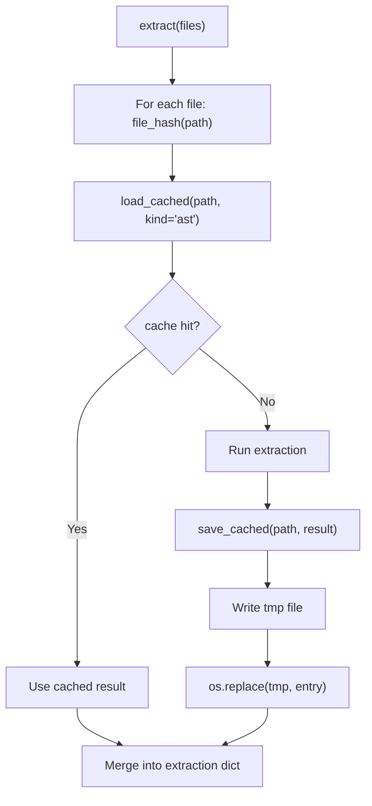
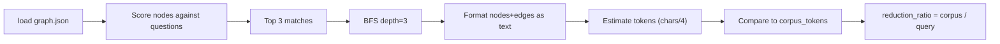
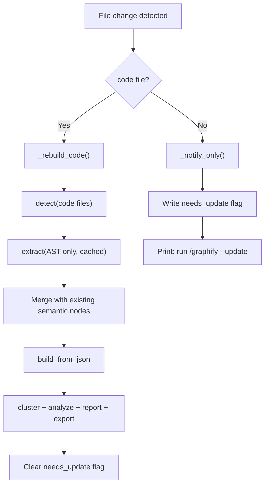

# Graphify -- Caching and Performance

Graphify uses three complementary caching strategies to minimize redundant work: a per-file SHA256 content cache for extraction results, a token-reduction benchmark to quantify context savings, and a filesystem watcher for incremental rebuilds. Together they ensure that repeated runs over stable corpora cost near-zero tokens and that code-only changes rebuild without any LLM calls.

Related: [Overview](00-overview.md) -- [Data Flow](11-data-flow.md) -- [LLM Backend](12-llm-backend.md)

## Per-File Extraction Cache

The cache module (`cache.py`) stores extraction results keyed by the SHA256 hash of file contents. A file that has not changed since the last run returns its cached result instantly, skipping both AST parsing and LLM extraction.

### Cache Directory Structure

Cache entries are stored under `graphify-out/cache/` with separate subdirectories for AST and semantic results:

```
graphify-out/cache/
  ast/
    <sha256>.json      # AST extraction result for a code file
    <sha256>.json
  semantic/
    <sha256>.json      # Semantic extraction result for a doc/paper/image file
    <sha256>.json
```

The separation (`cache.py:46-54`) prevents semantic cache entries from overwriting AST entries for the same `source_file` (issue #582). A legacy flat `cache/*.json` directory is also checked for backward compatibility with pre-0.5.3 installations.

### File Hashing

`file_hash` (`cache.py:20`) computes a SHA256 hash of the file content plus its relative path. The relative path ensures cache entries are portable across machines and checkout directories -- the same file at `/home/user/project/foo.py` and `/home/dev/project/foo.py` produces the same cache key.

```python
# cache.py:20-43
def file_hash(path: Path, root: Path = Path(".")) -> str:
    """SHA256 of file contents + path relative to root."""
    p = Path(path)
    raw = p.read_bytes()
    content = _body_content(raw) if p.suffix.lower() == ".md" else raw
    h = hashlib.sha256()
    h.update(content)
    h.update(b"\x00")
    try:
        rel = p.resolve().relative_to(Path(root).resolve())
        h.update(str(rel).encode())
    except ValueError:
        h.update(str(p.resolve()).encode())
    return h.hexdigest()
```

For Markdown files, YAML frontmatter is stripped before hashing (`cache.py:10-17`). This means metadata-only changes (e.g., `reviewed: true`, status updates, tag changes) do not invalidate the cache -- only actual body content changes trigger re-extraction.

### Load and Save

`load_cached` (`cache.py:57`) returns the cached extraction if the file's current hash matches a stored entry. `save_cached` (`cache.py:88`) writes results atomically using a `.tmp` file followed by `os.replace`, with a Windows fallback for file locking issues.



### Semantic Cache

`check_semantic_cache` (`cache.py:149`) takes a list of file paths and splits them into cached and uncached groups. Cached files contribute their nodes, edges, and hyperedges directly. Uncached files are returned as a list for LLM extraction.

```python
# cache.py:149-172
def check_semantic_cache(files: list[str], root: Path = Path(".")) -> tuple[list[dict], list[dict], list[dict], list[str]]:
    """Returns (cached_nodes, cached_edges, cached_hyperedges, uncached_files)."""
```

`save_semantic_cache` (`cache.py:175`) groups results by `source_file` and saves one cache entry per file. It returns the count of files cached.

### Cache Clearing

`clear_cache` (`cache.py:134`) deletes all cache entries across `ast/`, `semantic/`, and legacy flat directories.

## Token-Reduction Benchmark

The benchmark module (`benchmark.py`) quantifies how much context graphify saves compared to a naive full-corpus approach. It measures tokens needed to answer questions using the graph subgraph versus sending the entire corpus to an LLM.

### How It Works

`run_benchmark` (`benchmark.py:64`) loads the built graph, scores nodes against sample questions, performs a BFS traversal to collect a relevant subgraph, and estimates token counts using the `_CHARS_PER_TOKEN = 4` approximation.

```python
# benchmark.py:9
_CHARS_PER_TOKEN = 4  # standard approximation
```

The `_query_subgraph_tokens` function (`benchmark.py:16`) performs BFS from the top-3 matching nodes (by keyword overlap) up to a configurable depth (default 3). It formats visited nodes and edges as text lines and estimates the token count.

```python
# benchmark.py:64-111
def run_benchmark(
    graph_path: str = "graphify-out/graph.json",
    corpus_words: int | None = None,
    questions: list[str] | None = None,
) -> dict:
```

The returned dict contains:

| Key | Description |
|-----|-------------|
| `corpus_tokens` | Estimated tokens for the full corpus |
| `corpus_words` | Word count (provided or estimated) |
| `nodes` | Total nodes in the graph |
| `edges` | Total edges in the graph |
| `avg_query_tokens` | Average tokens per query question |
| `reduction_ratio` | `corpus_tokens / avg_query_tokens` -- how many times cheaper graph queries are |
| `per_question` | List of per-question results with individual reduction ratios |

The default sample questions are: "how does authentication work", "what is the main entry point", "how are errors handled", "what connects the data layer to the api", "what are the core abstractions" (`benchmark.py:55-61`).



## Filesystem Watcher

The watch module (`watch.py`) uses the `watchdog` library to monitor a directory for file changes and trigger automatic rebuilds.

### Watched Extensions

The watcher monitors all file types that graphify recognizes: code, documents, papers, and images (`watch.py:9-12`). Files in dot-prefixed directories (like `.git`) and the `graphify-out/` output directory are excluded.

### Code Rebuild Path

`_rebuild_code` (`watch.py:36`) re-runs AST extraction, build, clustering, analysis, report generation, and export -- all without any LLM calls. It is a pure local rebuild of the code graph.

```python
# watch.py:36-136
def _rebuild_code(watch_path: Path, *, follow_symlinks: bool = False) -> bool:
    """Re-run AST extraction + build + cluster + report for code files. No LLM needed."""
```

The rebuild preserves semantic nodes and edges from a previous full run. Only code nodes (where `file_type == "code"`) are replaced; INFERRED and AMBIGUOUS edges are kept since they come from semantic analysis, not AST parsing (`watch.py:66-82`).



### Debounce

The watcher uses a configurable debounce period (default 3.0 seconds) to batch rapid saves from editors. After the last file change, it waits for the debounce window before triggering a rebuild (`watch.py:221`).

### Non-Code Changes

When non-code files change (docs, papers, images), the watcher writes a `graphify-out/needs_update` flag file and prints a notification telling the user to run `/graphify --update` for semantic re-extraction (`watch.py:154-162`). The `check_update` function (`watch.py:139`) is cron-safe -- it always returns `True` and simply checks whether the flag exists.

```python
# watch.py:139-151
def check_update(watch_path: Path) -> bool:
    """Check for pending semantic update flag and notify the user if set.
    Cron-safe: always returns True so cron jobs do not alarm."""
```

### Observer Selection

On macOS, a `PollingObserver` is used instead of the native `Observer` because FSEvents can miss rapid saves in some editors (`watch.py:209`). On other platforms, the native observer is used.

## Source Files

- `/home/darkvoid/Boxxed/@formulas/src.rust/src.llamacpp/src.Graphify/graphify/graphify/cache.py` -- Per-file SHA256 extraction cache
- `/home/darkvoid/Boxxed/@formulas/src.rust/src.llamacpp/src.Graphify/graphify/graphify/benchmark.py` -- Token-reduction benchmark
- `/home/darkvoid/Boxxed/@formulas/src.rust/src.llamacpp/src.Graphify/graphify/graphify/watch.py` -- Filesystem watcher for incremental rebuilds
