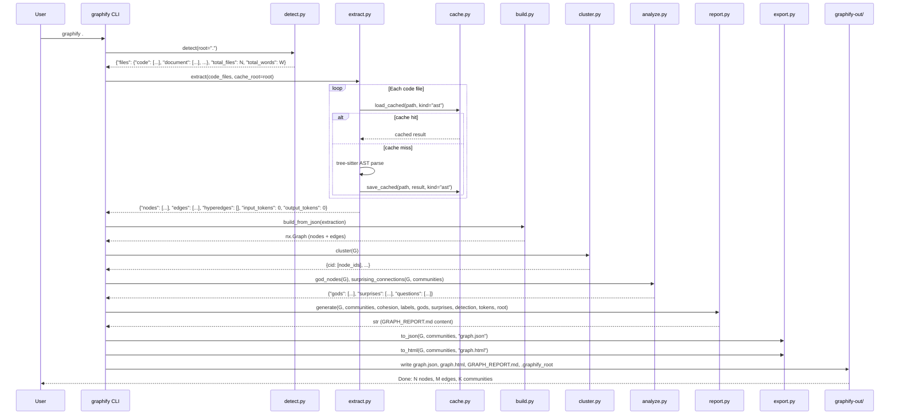
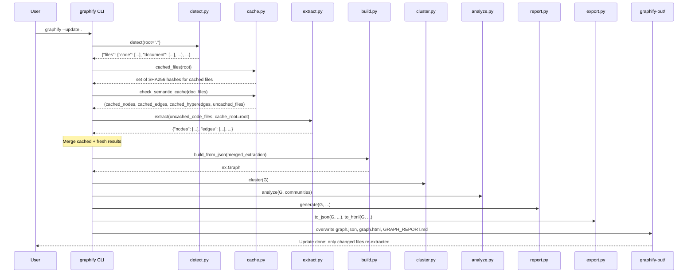
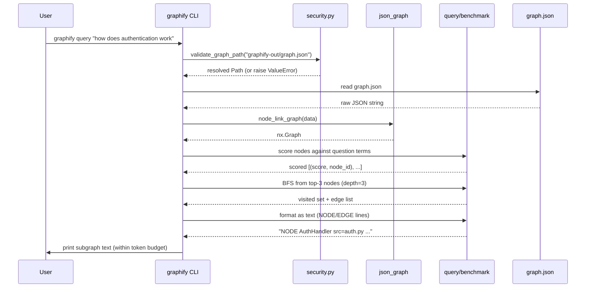
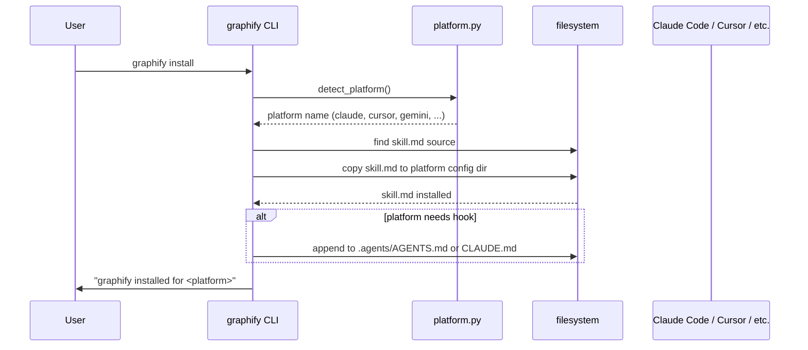
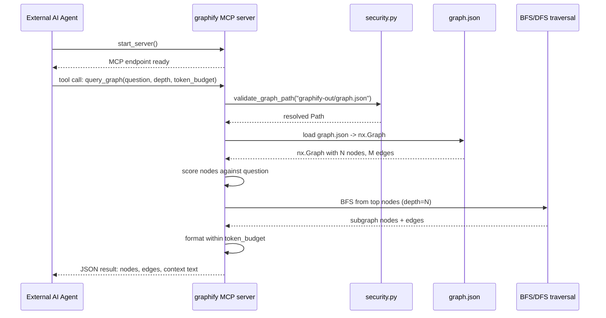

# Graphify -- Data Flow

This document traces the five primary data flows through graphify, from initial corpus detection through query and MCP server. Each flow is illustrated with a sequence diagram using actual function names and data shapes from the source code.

Related: [Overview](00-overview.md) -- [Caching](10-caching-performance.md) -- [LLM Backend](12-llm-backend.md)

## Flow 1: Full Graph Build (`graphify .`)

A full build processes the entire corpus through all seven pipeline stages. This is the most common entry point.

The data shapes flowing between stages are:

| Stage Output | Type | Key Fields |
|-------------|------|-----------|
| `detect()` | `dict` | `files.code`, `files.document`, `total_files`, `total_words` |
| `extract()` | `dict` | `nodes[]`, `edges[]`, `hyperedges[]`, `input_tokens`, `output_tokens` |
| `build_from_json()` | `nx.Graph` | Nodes with `id`, `label`, `file_type`, `source_file`; Edges with `source`, `target`, `relation`, `confidence` |
| `cluster()` | `dict` | `{community_id: [node_ids]}` |
| `analyze()` | multiple | God nodes (high degree), surprising connections (cross-community), suggested questions |
| `generate()` | `str` | Full `GRAPH_REPORT.md` markdown |
| `to_json()` / `to_html()` | files | `graph.json`, `graph.html` |

## Flow 2: Incremental Update (`graphify update .`)

An incremental update detects which files have changed, re-extracts only those files, and merges the results into the existing graph.

Key difference from full build: `check_semantic_cache` (`cache.py:149`) splits document/paper/image files into cached (hash unchanged) and uncached (new or modified). Only uncached files go through LLM extraction. Code files are re-extracted via AST only, using `load_cached` with `kind="ast"`.

## Flow 3: Graph Query (`graphify query "question"`)

A query loads the built graph, scores nodes against the question, traverses a relevant subgraph, and returns token-budgeted context.

The scoring logic (`benchmark.py:18-26`) tokenizes the question into terms (words longer than 2 characters), then counts how many terms appear in each node's label. The top 3 scoring nodes serve as BFS seeds. The traversal collects neighbors up to `depth=3` hops, formatting nodes and edges as readable text lines.

## Flow 4: CLI Install (`graphify install`)

The install command copies the skill file to the target platform's configuration directory and sets up hooks.

Platform detection checks for known config files/directories (e.g., `~/.claude/`, `.cursor/`). The skill file (`skill.md`) contains the full graphify prompt and instructions for Claude Code subagents.

## Flow 5: MCP Server Query

The MCP server exposes graph traversal as a tool call, enabling external AI agents to query the graph programmatically.

The MCP server uses the same scoring and traversal logic as the CLI query (`benchmark.py:16-52`), but returns structured JSON instead of formatted text. The `validate_graph_path` call ensures the server cannot be tricked into reading files outside `graphify-out/`.

## Cross-Cutting Concerns

### Caching in Every Flow

Every flow that reads or writes files interacts with the cache:

- **Flow 1**: `save_cached` after first extraction; `load_cached` on re-run
- **Flow 2**: `check_semantic_cache` splits cached vs. uncached; `save_semantic_cache` after LLM extraction
- **Flow 3**: No cache -- reads the pre-built `graph.json`
- **Flow 4**: No cache -- filesystem copy
- **Flow 5**: No cache -- reads `graph.json` per query

### Security Guards in Every Flow

Every flow that touches external data passes through security checks:

- **Flows 1-2**: `validate_extraction` validates LLM output before `build_from_json`
- **Flows 3, 5**: `validate_graph_path` prevents path traversal on graph.json load
- **Ingestion** (not shown): `validate_url` + `safe_fetch` protect all URL fetches

## Source Files

- `/home/darkvoid/Boxxed/@formulas/src.rust/src.llamacpp/src.Graphify/graphify/graphify/cache.py` -- Per-file extraction cache
- `/home/darkvoid/Boxxed/@formulas/src.rust/src.llamacpp/src.Graphify/graphify/graphify/benchmark.py` -- Token-reduction benchmark (query subgraph traversal)
- `/home/darkvoid/Boxxed/@formulas/src.rust/src.llamacpp/src.Graphify/graphify/graphify/watch.py` -- Filesystem watcher with incremental rebuild
- `/home/darkvoid/Boxxed/@formulas/src.rust/src.llamacpp/src.Graphify/graphify/graphify/security.py` -- Path validation for graph file loading
