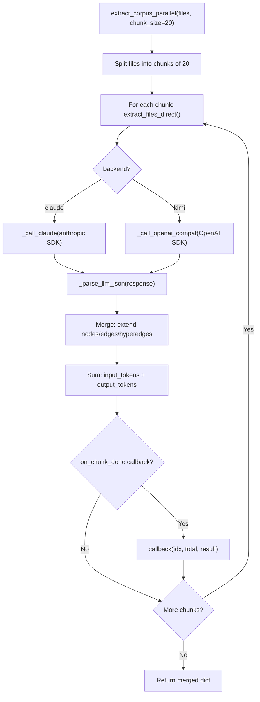
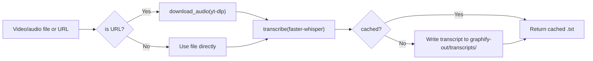
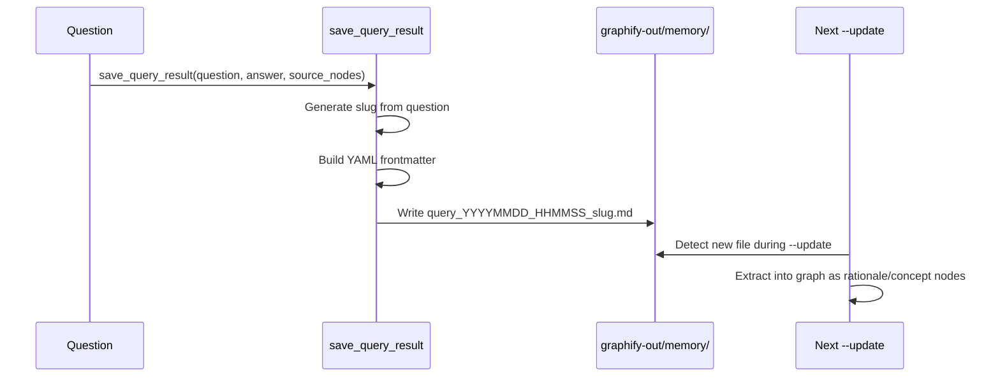

# Graphify -- LLM Backend

Graphify supports two direct LLM backends for semantic extraction: Anthropic Claude and Moonshot Kimi. These are used when running outside Claude Code (e.g., `graphify . --backend kimi`) or when the skill.md subagent pipeline is unavailable. The default pipeline uses Claude Code subagents; the direct backend module provides a fallback for non-Claude-Code environments.

Related: [Overview](00-overview.md) -- [Security](09-security-validation.md) -- [Caching](10-caching-performance.md)

## Backend Configuration

The `BACKENDS` dictionary (`llm.py:14-29`) defines two backends with their API endpoints, default models, environment variable names, pricing, and temperature settings.

| Backend | Model | API Endpoint | Input ($/1M tok) | Output ($/1M tok) | Temperature |
|---------|-------|-------------|-------------------|--------------------|-------------|
| `claude` | `claude-sonnet-4-6` | `api.anthropic.com` | $3.00 | $15.00 | 0 |
| `kimi` | `kimi-k2.6` | `api.moonshot.ai/v1` | $0.74 | $4.66 | None (fixed) |

```python
# llm.py:14-29
BACKENDS: dict[str, dict] = {
    "claude": {
        "base_url": "https://api.anthropic.com",
        "default_model": "claude-sonnet-4-6",
        "env_key": "ANTHROPIC_API_KEY",
        "pricing": {"input": 3.0, "output": 15.0},
        "temperature": 0,
    },
    "kimi": {
        "base_url": "https://api.moonshot.ai/v1",
        "default_model": "kimi-k2.6",
        "env_key": "MOONSHOT_API_KEY",
        "pricing": {"input": 0.74, "output": 4.66},
        "temperature": None,  # kimi-k2.6 enforces its own fixed temperature
    },
}
```

Kimi's `temperature=None` is important: `kimi-k2.6` enforces its own fixed temperature and returns a 400 error if any temperature value is sent. The `_call_openai_compat` function conditionally adds `temperature` to the request kwargs only when it is not `None` (`llm.py:103-104`).

## Extraction System Prompt

The `_EXTRACTION_SYSTEM` prompt (`llm.py:31-45`) defines the rules, ID format, and output schema for all LLM backends.

```python
_EXTRACTION_SYSTEM = """\
You are a graphify semantic extraction agent. Extract a knowledge graph fragment from the files provided.
Output ONLY valid JSON -- no explanation, no markdown fences, no preamble.

Rules:
- EXTRACTED: relationship explicit in source (import, call, citation, reference)
- INFERRED: reasonable inference (shared data structure, implied dependency)
- AMBIGUOUS: uncertain -- flag for review, do not omit

Node ID format: lowercase, only [a-z0-9_], no dots or slashes.
Format: {stem}_{entity} where stem = filename without extension, entity = symbol name (both normalised).
"""
```

Key constraints in the prompt:

- **Confidence labels**: `EXTRACTED` for explicit relationships, `INFERRED` for reasonable inference, `AMBIGUOUS` for uncertain connections. The model must not omit uncertain edges -- it must flag them as AMBIGUOUS.
- **Node ID format**: `{stem}_{entity}` using only lowercase letters, digits, and underscores. No dots or slashes.
- **Output schema**: A single JSON object with `nodes`, `edges`, `hyperedges`, `input_tokens`, and `output_tokens`.

## Direct Extraction

`extract_files_direct` (`llm.py:137`) reads a list of files, formats them into a user message, and dispatches to the appropriate backend. Each file is truncated to 20,000 characters (`llm.py:60`) to stay within context limits.

```python
# llm.py:137-165
def extract_files_direct(
    files: list[Path],
    backend: str = "kimi",
    api_key: str | None = None,
    model: str | None = None,
    root: Path = Path("."),
) -> dict:
```

The function validates the backend name, resolves the API key from the parameter or environment variable, reads the files via `_read_files` (`llm.py:48-61`), and calls either `_call_claude` or `_call_openai_compat`.

### Claude Backend

`_call_claude` (`llm.py:113-134`) uses the Anthropic Python SDK directly. The system prompt is passed as the `system` parameter (not as a message), which is the correct Anthropic API pattern.

```python
# llm.py:113-134
def _call_claude(api_key: str, model: str, user_message: str) -> dict:
    client = anthropic.Anthropic(api_key=api_key)
    resp = client.messages.create(
        model=model,
        max_tokens=8192,
        system=_EXTRACTION_SYSTEM,
        messages=[{"role": "user", "content": user_message}],
    )
```

Token usage is extracted from `resp.usage.input_tokens` and `resp.usage.output_tokens`.

### Kimi Backend

`_call_openai_compat` (`llm.py:78-110`) uses the OpenAI Python SDK against Moonshot's OpenAI-compatible endpoint. The `temperature` kwarg is omitted when `temperature=None` (Kimi's case).

```python
# llm.py:78-110
def _call_openai_compat(base_url, api_key, model, user_message, temperature=0) -> dict:
    client = OpenAI(api_key=api_key, base_url=base_url)
    kwargs = {"model": model, "messages": [...], "max_completion_tokens": 8192}
    if temperature is not None:
        kwargs["temperature"] = temperature
    resp = client.chat.completions.create(**kwargs)
```

Token usage comes from `resp.usage.prompt_tokens` and `resp.usage.completion_tokens`.

## JSON Parsing

`_parse_llm_json` (`llm.py:64-75`) handles LLM responses that may include markdown code fences. It strips leading and trailing ```` ``` ```` blocks and parses the inner content. On failure, it returns an empty fragment (`{"nodes": [], "edges": [], "hyperedges": []}`) rather than crashing.

```python
# llm.py:64-75
def _parse_llm_json(raw: str) -> dict:
    if raw.startswith("```"):
        raw = raw.split("```", 2)[1]
        if raw.startswith("json"):
            raw = raw[4:]
        raw = raw.rsplit("```", 1)[0]
    try:
        return json.loads(raw.strip())
    except json.JSONDecodeError:
        return {"nodes": [], "edges": [], "hyperedges": []}
```

## Parallel Corpus Extraction

`extract_corpus_parallel` (`llm.py:168-197`) chunks a large file list into batches of `chunk_size` (default 20) and processes each chunk sequentially. Results are merged by extending the `nodes`, `edges`, and `hyperedges` lists and summing token counts. An optional `on_chunk_done` callback enables progress reporting.



## Cost Estimation

`estimate_cost` (`llm.py:200-205`) calculates USD cost from token counts using published pricing:

```python
# llm.py:200-205
def estimate_cost(backend: str, input_tokens: int, output_tokens: int) -> float:
    p = BACKENDS[backend]["pricing"]
    return (input_tokens * p["input"] + output_tokens * p["output"]) / 1_000_000
```

For example, 50,000 input tokens + 10,000 output tokens on Claude costs `(50000 * 3.0 + 10000 * 15.0) / 1_000_000 = $0.30`. On Kimi the same usage costs `(50000 * 0.74 + 10000 * 4.66) / 1_000_000 = $0.084`.

## Backend Auto-Detection

`detect_backend` (`llm.py:208-218`) checks environment variables in order: `MOONSHOT_API_KEY` first, then `ANTHROPIC_API_KEY`. Kimi is checked first to respect opt-in preference. If neither is set, it returns `None`.

## Video Transcription

The `transcribe.py` module handles local video/audio transcription using `faster-whisper`. Transcripts are treated as text documents and fed into the semantic extraction pipeline.

### Transcription Flow



### Domain-Aware Prompt

`build_whisper_prompt` (`transcribe.py:93-113`) constructs a domain hint from the corpus's god nodes. The top 5 god node labels are formatted into a topic string: `"Technical discussion about <label1>, <label2>, <label3>, <label4>, <label5>. Use proper punctuation and paragraph breaks."` This improves Whisper's accuracy for domain-specific terminology. The prompt can be overridden via the `GRAPHIFY_WHISPER_PROMPT` environment variable.

### Audio Download

`download_audio` (`transcribe.py:48-90`) uses `yt-dlp` to download audio-only streams. Files are named by URL hash (`yt_<12-char-sha1>.<ext>`) for stability and are cached -- if a matching file already exists in the output directory, it is returned without re-downloading. The `validate_url` security check runs before `yt-dlp` is invoked.

### Model Configuration

The default Whisper model is `base` (`transcribe.py:12`). It can be overridden via the `GRAPHIFY_WHISPER_MODEL` environment variable. The model runs on CPU with `int8` compute type and `beam_size=5`.

## URL Ingestion

The `ingest.py` module fetches URLs and saves them as graphify-ready files. It classifies URLs into types and applies targeted extraction.

### URL Type Classification

`_detect_url_type` (`ingest.py:27-44`) identifies these types:

| Type | Detection | Action |
|------|-----------|--------|
| `tweet` | `twitter.com` or `x.com` in URL | Fetch via Twitter oEmbed API |
| `arxiv` | `arxiv.org` in URL | Fetch abstract page, extract title/authors/abstract |
| `github` | `github.com` in URL | Treat as webpage |
| `youtube` | `youtube.com` or `youtu.be` | Download audio via `yt-dlp` |
| `pdf` | URL ends in `.pdf` | Download binary directly |
| `image` | URL ends in image extension | Download binary directly |
| `webpage` | Everything else | Fetch HTML, convert to markdown |

### Ingest Function

`ingest` (`ingest.py:184-235`) validates the URL via `security.validate_url`, dispatches to the appropriate fetcher based on URL type, and saves the result with YAML frontmatter containing `source_url`, `type`, `captured_at`, and `contributor` metadata. If the target filename already exists, a counter suffix is appended (up to 999).

### Query Result Persistence

`save_query_result` (`ingest.py:238-285`) saves Q&A results as markdown files in `graphify-out/memory/` with YAML frontmatter. This creates a feedback loop: saved query results become part of the corpus and are extracted into the graph on the next `--update` run.



## Source Files

- `/home/darkvoid/Boxxed/@formulas/src.rust/src.llamacpp/src.Graphify/graphify/graphify/llm.py` -- Direct LLM backends (Claude, Kimi)
- `/home/darkvoid/Boxxed/@formulas/src.rust/src.llamacpp/src.Graphify/graphify/graphify/transcribe.py` -- Video/audio transcription with faster-whisper
- `/home/darkvoid/Boxxed/@formulas/src.rust/src.llamacpp/src.Graphify/graphify/graphify/ingest.py` -- URL ingestion and query result persistence
