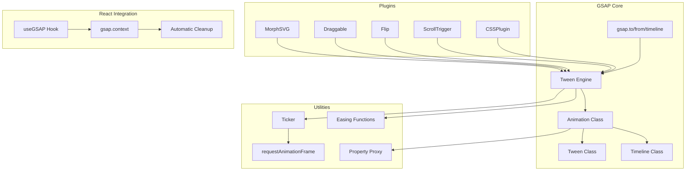

# Project Exploration: GSAP (GreenSock Animation Platform)

## Overview

GSAP (GreenSock Animation Platform) is a high-performance, framework-agnostic JavaScript animation library that provides professional-grade animation tools. At its core, GSAP is a property manipulation engine that updates values over time with extreme accuracy - up to 20x faster than jQuery. The library is completely free (as of 2024, thanks to Webflow) and works in every major browser.

**Key characteristics:**
- **Zero dependencies** - Pure JavaScript with no external requirements
- **Framework-agnostic** - Works with vanilla JS, React, Vue, Angular, etc.
- **High performance** - Optimized rendering with intelligent batching
- **Accurate timing** - Sub-millisecond precision for animation timing
- **Browser compatibility** - Handles all browser inconsistencies internally

## Directory Structure

```
/home/darkvoid/Boxxed/@formulas/src.UIFrameworks/src.gsap/
├── GSAP/                          # Main GSAP library (v3.13.0)
│   ├── src/                       # Source files (unminified, development)
│   │   ├── gsap-core.js           # Core animation engine (~3800 lines)
│   │   ├── CSSPlugin.js           # CSS property animation plugin
│   │   ├── ScrollTrigger.js       # Scroll-based animations
│   │   ├── Flip.js                # FLIP animation technique
│   │   ├── Draggable.js           # Drag-and-drop interactions
│   │   ├── MorphSVGPlugin.js      # SVG path morphing
│   │   ├── MotionPathPlugin.js    # Path-based animations
│   │   ├── Observer.js            # Normalized touch/mouse/scroll events
│   │   ├── TextPlugin.js          # Text content animation
│   │   ├── CustomEase.js          # Custom easing functions
│   │   └── utils/                 # Utility modules
│   │       ├── matrix.js          # Matrix transformations
│   │       ├── paths.js           # SVG path utilities
│   │       └── VelocityTracker.js # Velocity tracking
│   ├── esm/                       # ES Module builds
│   ├── dist/                      # Distribution files (minified/unminified)
│   ├── types/                     # TypeScript definitions
│   ├── README.md
│   └── package.json
│
└── react/                         # @gsap/react package (v2.1.2)
    ├── src/
    │   └── index.js               # useGSAP hook implementation
    ├── dist/                      # Built distribution files
    ├── types/
    │   └── index.d.ts             # TypeScript definitions
    ├── README.md
    └── package.json
```

## Architecture

### High-Level Diagram (Mermaid)



### Core Components

1. **Animation Class** - Base class for all animations with timing controls
2. **Tween Class** - Animates properties on target elements
3. **Timeline Class** - Container for sequencing multiple animations
4. **PropTween** - Individual property tweens linked in a chain
5. **GSCache** - Per-element cache for transforms and computed values
6. **Ticker** - Central timing mechanism using requestAnimationFrame
7. **Context** - Scoping mechanism for cleanup and organization

## Core GSAP Library

### gsap-core.js Architecture

The core engine (`gsap-core.js`, ~3800 lines) provides the foundation for all GSAP animations:

#### Key Data Structures

```javascript
// Animation properties (shared by Tween and Timeline)
{
    _time: 0,        // Current time in seconds
    _tTime: 0,       // Total time (including repeats)
    _dur: 0,         // Duration
    _tDur: 0,        // Total duration (with repeats)
    _ts: 1,          // Time scale
    _rts: 1,         // Recorded time scale (for pause state)
    _start: 0,       // Start time in parent timeline
    _dp: 0,          // Detached parent (for removed animations)
    ratio: 0,        // Current progress ratio (0-1)
    _initted: false  // Whether init() has been called
}

// PropTween - linked list of property tweens
{
    _next: ...,  // Next PropTween in chain
    t: target,   // Target element
    p: property, // Property name
    b: begin,    // Starting value
    c: change,   // Change amount
    u: unit,     // Unit (px, %, etc.)
    r: renderFn  // Render function
}
```

### How gsap.to(), gsap.from(), gsap.timeline() Work

#### gsap.to() - Forward Animation

```javascript
// User calls:
gsap.to(".box", { x: 100, duration: 1, ease: "power1" });

// Internal flow:
// 1. _createTweenType(0, arguments) is called (type 0 = to)
// 2. Tween constructor is invoked with targets and vars
// 3. _initTween() parses all properties and creates PropTweens
// 4. CSSPlugin intercepts CSS properties (x, opacity, etc.)
// 5. Each property gets a PropTween with getter/setter
// 6. Tween is added to global timeline or specified parent
// 7. On each tick, render() updates ratio and applies values
```

#### gsap.from() - Backward Animation

```javascript
// User calls:
gsap.from(".box", { x: 100, duration: 1 });

// Internal flow:
// 1. _createTweenType(1, arguments) is called (type 1 = from)
// 2. vars.runBackwards = 1 is set
// 3. Current values are recorded as end values
// 4. fromVars become the starting values
// 5. Animation renders from end state to start state
```

#### gsap.timeline() - Sequencing Container

```javascript
// User calls:
const tl = gsap.timeline();
tl.to(".box", { x: 100 })
  .to(".box", { y: 100 });

// Internal flow:
// 1. Timeline extends Animation class
// 2. Children are added via _addToTimeline()
// 3. Children are linked in _first/_last chain
// 4. Timeline renders by iterating children at correct local time
// 5. smoothChildTiming can auto-adjust child start times
```

### The Tweening Engine Core

#### Initialization Phase

```javascript
// Simplified _initTween() flow:
function _initTween(tween, time, tTime) {
    // 1. Parse targets (selector, element, or array)
    targets = _toArray(tween.targets);

    // 2. Get harness plugin for target type (CSS, SVG, etc.)
    harness = _harness(targets)[0]._gsap.harness;

    // 3. Parse all tween properties
    for (p in vars) {
        if (p in _plugins) {
            // Plugin handles this property (CSSPlugin, etc.)
            plugin.init(prop, value, tween, method, targets);
        }
    }

    // 4. Create PropTween linked list
    // Each PropTween handles one property on one target

    tween._initted = true;
}
```

#### Rendering Phase

```javascript
// Simplified render() flow:
function render(totalTime, suppressEvents, force) {
    // 1. Calculate progress ratio based on time, repeat, yoyo
    let ratio = clamp(0, 1, (time - start) / duration);
    ratio = ease(ratio); // Apply easing

    // 2. Iterate through PropTween chain
    let pt = tween._pt;
    while (pt) {
        // Call render function for each property
        // _renderCSSProp, _renderPropWithEnd, etc.
        pt.r(ratio, pt.d);
        pt = pt._next;
    }

    // 3. Fire callbacks (onUpdate, onComplete, etc.)
    if (ratio === 1 && !prevRatio) {
        _callback(tween, "onComplete");
    }
}
```

#### CSSPlugin Integration

CSSPlugin is the most important plugin - it handles all CSS properties:

```javascript
// CSSPlugin special handling:
const _propertyAliases = {
    autoAlpha: "opacity,visibility",
    scale: "scaleX,scaleY",
    alpha: "opacity",
    rotation: "rotation,rotationZ"
};

// Transform properties use GPU acceleration:
const _transformProps = {
    x: 1, y: 1, z: 1,
    rotation: 1, rotationX: 1, rotationY: 1, rotationZ: 1,
    scale: 1, scaleX: 1, scaleY: 1,
    transform: 1, transformOrigin: 1
};

// Non-transform CSS properties use style property:
element.style.opacity = value;
element.style.backgroundColor = value;
```

## ScrollTrigger Plugin

ScrollTrigger enables scroll-based animations by monitoring scroll position and triggering animations at specified points.

### Architecture

```javascript
// ScrollTrigger core concepts:
class ScrollTrigger {
    constructor(vars, animation) {
        this.scroller = _getTarget(vars.scroller || window);
        this.trigger = _getTarget(vars.trigger);
        this.start = parsePosition(vars.start); // e.g., "top center"
        this.end = parsePosition(vars.end);     // e.g., "bottom top"
        this.animation = animation;
        this.pin = vars.pin; // Element to pin during scroll
    }

    update(reset, recordVelocity, forceFake) {
        // 1. Get current scroll position
        let scroll = this.scroll();

        // 2. Calculate progress (0-1) between start and end
        let progress = clamp(0, 1, (scroll - this.start) / this.change);

        // 3. Update animation based on progress
        if (this.animation) {
            this.animation.totalProgress(progress);
        }

        // 4. Handle pinning (position: fixed during scroll range)
        if (this.pin && progress > 0 && progress < 1) {
            this._applyPinState(progress);
        }

        // 5. Fire callbacks (onEnter, onLeave, etc.)
        this._checkCallbacks(progress);
    }
}
```

### Key Features

1. **Start/End Positions** - Define animation range using flexible syntax:
   - `"top center"` - trigger top at viewport center
   - `"bottom bottom"` - trigger bottom at viewport bottom
   - `+=100` - Offset by pixels
   - `{scroll: 100, trigger: "element"}` - Object syntax

2. **Pinning** - Holds element in place during scroll:
   ```javascript
   ScrollTrigger.create({
       trigger: ".section",
       start: "top top",
       end: "+=1000",
       pin: true, // Creates spacer element to prevent layout shift
       pinSpacing: "padding" // or "margin" or false
   });
   ```

3. **Scrubbing** - Links animation progress to scroll:
   ```javascript
   gsap.to(element, {
       scrollTrigger: {
           trigger: element,
           scrub: 1, // 1 second smooth scrubbing
           // scrub: true // instant scrubbing
       }
   });
   ```

4. **Markers** - Visual debugging:
   ```javascript
   scrollTrigger: {
       markers: {
           startColor: "green",
           endColor: "red",
           fontSize: "16px"
       }
   }
   ```

### Scroll Position Calculation

```javascript
// Parse position like "top center" or "100px bottom"
function _parsePosition(value, trigger, scrollerSize, direction, scroll) {
    if (isFunction(value)) {
        value = value(self);
    }

    if (_isString(value)) {
        let offsets = value.split(" ");
        // Calculate local offset from trigger bounds
        let localOffset = _offsetToPx(offsets[0], triggerBounds[direction.d]);
        // Calculate global offset from scroll container
        let globalOffset = _offsetToPx(offsets[1] || "0", scrollerSize);
        // Final scroll position
        value = bounds[direction.p] - scrollerBounds[direction.p]
                + localOffset - globalOffset;
    }

    return Math.round(value);
}
```

## @gsap/react Hook

### useGSAP() Implementation

The React hook (`react/src/index.js`, ~50 lines) provides automatic cleanup and scoping:

```javascript
import { useEffect, useLayoutEffect, useRef } from "react";
import gsap from "gsap";

let useIsomorphicLayoutEffect = typeof document !== "undefined"
    ? useLayoutEffect
    : useEffect;

export const useGSAP = (callback, dependencies = []) => {
    // Handle config object syntax
    let config = isConfig(callback) ? callback :
                 isConfig(dependencies) ? dependencies : defaultConfig;

    const { scope, revertOnUpdate } = config;
    const mounted = useRef(false);

    // Create context for scoping and cleanup
    const context = useRef(gsap.context(() => { }, scope));

    // Create contextSafe function reference
    const contextSafe = useRef((func) => context.current.add(null, func));

    // Defer cleanup if dependencies exist and revertOnUpdate is false
    const deferCleanup = dependencies && dependencies.length && !revertOnUpdate;

    // Cleanup effect - runs on unmount
    deferCleanup && useIsomorphicLayoutEffect(() => {
        mounted.current = true;
        return () => context.current.revert();
    }, []);

    // Main effect - runs on mount and dependency changes
    useIsomorphicLayoutEffect(() => {
        callback && context.current.add(callback, scope);

        if (!deferCleanup || !mounted.current) {
            return () => context.current.revert();
        }
    }, dependencies);

    return { context: context.current, contextSafe: contextSafe.current };
};
```

### How useGSAP() Handles Cleanup

1. **Context Creation** - `gsap.context()` creates a container that tracks all GSAP objects created during its execution

2. **Automatic Tracking** - Any GSAP animation, ScrollTrigger, or other GSAP object created inside the context callback is automatically added to the context's internal list

3. **Revert on Cleanup** - When the component unmounts or re-renders, `context.current.revert()` is called, which:
   - Reverts all tweens to their pre-animation state
   - Kills all ScrollTriggers and removes their event listeners
   - Removes any markers
   - Restores original CSS properties

4. **Isomorphic Layout Effect** - Uses `useLayoutEffect` on client (for synchronous rendering before paint) and falls back to `useEffect` for SSR

### contextSafe() Pattern for Event Handlers

The `contextSafe()` function is crucial for event handlers and delayed callbacks:

```javascript
// Problem: Event handlers fire AFTER useGSAP() executes
// Solution: Wrap handlers in contextSafe()

const { contextSafe } = useGSAP({ scope: container });

// BAD - not context-safe
const onClickBad = () => {
    gsap.to(".box", { rotation: 180 });
    // This animation won't be tracked by the context!
    // Selector text won't be scoped to container!
};

// GOOD - context-safe
const onClickGood = contextSafe(() => {
    gsap.to(".box", { rotation: 180 });
    // Animation IS tracked by context
    // Selector text IS scoped to container
    // Will be cleaned up when context reverts
});

// Inside useGSAP callback, contextSafe is second argument:
useGSAP((context, contextSafe) => {
    const onClick = contextSafe(() => {
        gsap.to(goodRef.current, { rotation: 180 });
    });

    element.addEventListener("click", onClick);

    // Cleanup: remove event listeners
    return () => {
        element.removeEventListener("click", onClick);
    };
}, { scope: container });
```

### Scope for Selector Text

```javascript
// Without scope - need refs for everything
const box1 = useRef();
const box2 = useRef();
const box3 = useRef();

useGSAP(() => {
    gsap.from([box1.current, box2.current, box3.current], { opacity: 0 });
});

// With scope - use selector text (scoped to descendants)
const container = useRef();

useGSAP(() => {
    gsap.from(".box", { opacity: 0, stagger: 0.1 });
    // Only finds .box elements INSIDE container
}, { scope: container });
```

## Key APIs

### Core Animation Methods

```javascript
// Basic tweens
gsap.to(target, { duration: 1, x: 100, opacity: 0 });
gsap.from(target, { duration: 1, x: 100 });
gsap.fromTo(target, { x: 0 }, { x: 100 });

// Timeline sequencing
const tl = gsap.timeline();
tl.to(".box", { x: 100 })
  .to(".box", { y: 100 }, "+=0.5") // start 0.5s after previous ends
  .to(".box", { rotation: 360 }, "-=0.25"); // start 0.25s before previous ends

// Control methods
animation.play();
animation.pause();
animation.reverse();
animation.seek(2); // go to 2 seconds
animation.progress(0.5); // go to 50%
animation.timeScale(2); // 2x speed
animation.kill(); // stop and clean up
```

### Utility Methods

```javascript
// Distribution and staggering
gsap.utils.distribute({ base: 0.5, from: "center" });
gsap.utils.random(0, 100, 5); // random in increments of 5
gsap.utils.shuffle(array);

// Value manipulation
gsap.utils.interpolate(0, 100, 0.5); // 50
gsap.utils.mapRange(0, 100, 0, 1, 50); // 0.5
gsap.utils.clamp(0, 100, 150); // 100
gsap.utils.snap(10, 23); // 20

// Color utilities
gsap.utils.splitColor("rgb(255,0,0)"); // [255, 0, 0]

// DOM utilities
gsap.utils.toArray(".class"); // Returns actual Array (not NodeList)
gsap.utils.selector(scope); // Returns scoped selector function
```

## Animation Examples

### Basic Tween

```javascript
import gsap from "gsap";

// Animate element position and opacity
gsap.to(".box", {
    x: 100,           // Translate X 100px
    y: 50,            // Translate Y 50px
    rotation: 360,    // Rotate 360 degrees
    opacity: 0,
    duration: 2,
    ease: "power2.inOut",
    onComplete: () => console.log("Animation complete!")
});
```

### Timeline Sequence

```javascript
import gsap from "gsap";

const tl = gsap.timeline({ defaults: { duration: 1 } });

tl.from(".logo", { y: -100, opacity: 0 })
  .from(".nav li", { y: -20, opacity: 0, stagger: 0.1 }, "-=0.5")
  .from(".hero h1", { x: -50, opacity: 0 }, "-=0.3")
  .from(".hero p", { x: -30, opacity: 0 }, "-=0.3")
  .to(".hero img", { scale: 1.1, duration: 3 }, 0); // Start at time 0
```

### ScrollTrigger Animation

```javascript
import gsap from "gsap";
import { ScrollTrigger } from "gsap/ScrollTrigger";

gsap.registerPlugin(ScrollTrigger);

gsap.utils.toArray(".section").forEach(section => {
    gsap.from(section.children, {
        y: 100,
        opacity: 0,
        stagger: 0.1,
        scrollTrigger: {
            trigger: section,
            start: "top 80%",    // Section top at 80% viewport height
            end: "top 20%",
            toggleActions: "play none none reverse",
            scrub: 1 // Smooth scrubbing with 1 second lag
        }
    });
});
```

### React Component with useGSAP

```javascript
import { useRef } from "react";
import gsap from "gsap";
import { useGSAP } from "@gsap/react";

gsap.registerPlugin(useGSAP);

function AnimatedComponent() {
    const container = useRef();

    const { contextSafe } = useGSAP({ scope: container });

    useGSAP(() => {
        // Initial animation - automatically cleaned up
        gsap.from(".box", {
            opacity: 0,
            y: 50,
            stagger: 0.1
        });
    });

    const handleClick = contextSafe(() => {
        // This animation is also tracked and cleaned up
        gsap.to(".box", {
            rotation: 360,
            duration: 1
        });
    });

    return (
        <div ref={container}>
            <button onClick={handleClick}>Animate</button>
            <div className="box">Box 1</div>
            <div className="box">Box 2</div>
        </div>
    );
}
```

## Key Insights

### Performance Optimizations

1. **Transform-Based Animation** - GSAP prefers CSS transforms (translate3d, rotate, scale) over top/left/opacity because:
   - Transforms use GPU acceleration
   - Transforms don't trigger layout recalculation
   - Transforms create their own compositing layer

2. **Property Caching** - `GSCache` stores computed values per element:
   ```javascript
   // Cache stores transform state
   element._gsap = {
       x: 100,
       y: 50,
       rotation: 45,
       scaleX: 1,
       scaleY: 1,
       renderTransform: function(ratio, cache) {
           // Batch all transform updates into one CSS set
           element.style.transform = `translate(${cache.x}px, ${cache.y}px) rotate(${cache.rotation}deg)`;
       }
   };
   ```

3. **Lazy Rendering** - Tweens with lazy:true defer property calculation until first render, reducing initialization overhead

4. **Batched Updates** - PropTweens are rendered in a single loop per tick, minimizing DOM access

5. **Ticker Optimization** - Uses requestAnimationFrame with intelligent sleep detection:
   ```javascript
   // Ticker auto-sleeps after 120 frames of inactivity
   _config.autoSleep = 120;
   ```

6. **Context-Based Cleanup** - `gsap.context()` tracks all animations for efficient batch cleanup, preventing memory leaks

### Architecture Principles

1. **Plugin System** - Everything except core timing is a plugin (CSSPlugin, ScrollTrigger, etc.). This keeps the core small and allows tree-shaking.

2. **Linked List PropTweens** - Property tweens are stored as a linked list rather than array for faster iteration and easier addition/removal during animation.

3. **Ratio-Based Rendering** - All tweens render based on a 0-1 ratio, making it easy to support repeats, yoyos, and variable timeScales.

4. **Parent-Child Hierarchy** - Animations can be nested in timelines, which can be nested in other timelines. Global time is calculated by traversing up the parent chain.

5. **Overwrite Protection** - GSAP can automatically kill conflicting tweens when new tweens start on the same properties.

### Browser Workarounds

GSAP handles numerous browser bugs internally:

- Safari z-origin transform bug (extracted to separate property)
- iOS scroll event inconsistencies
- Firefox getBBox() errors on hidden SVG elements
- IE9 vendor prefix requirements
- Chrome sub-pixel rendering issues

## Summary

GSAP is a mature, highly optimized animation platform that has evolved over 15+ years. Its architecture prioritizes:

1. **Performance** through GPU-accelerated transforms, intelligent caching, and batched rendering
2. **Flexibility** through a plugin system and framework-agnostic design
3. **Reliability** through extensive browser testing and internal bug workarounds
4. **Developer Experience** through intuitive APIs, comprehensive documentation, and helpful error messages

The `@gsap/react` package extends this with React-specific patterns for cleanup and scoping, making it safe and easy to use GSAP in React applications without worrying about memory leaks or selector conflicts.
