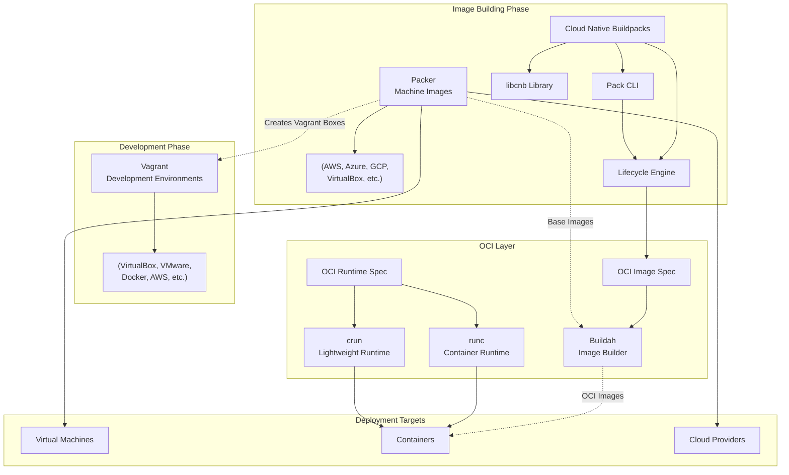
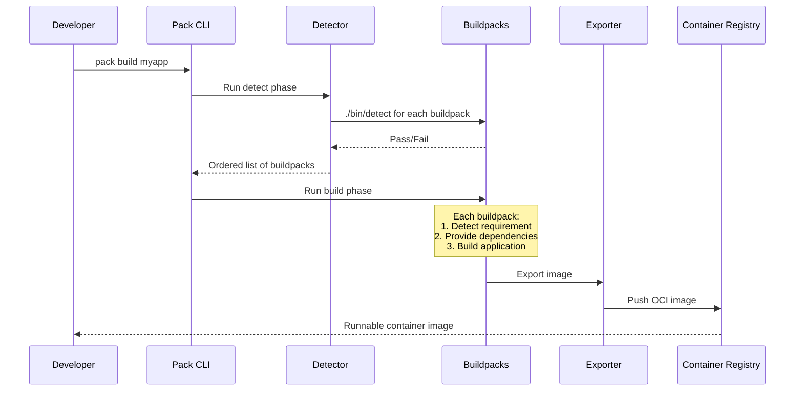
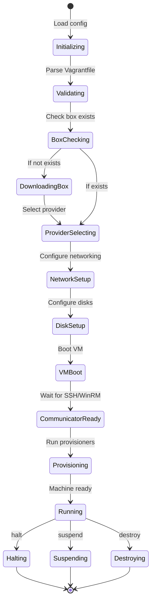
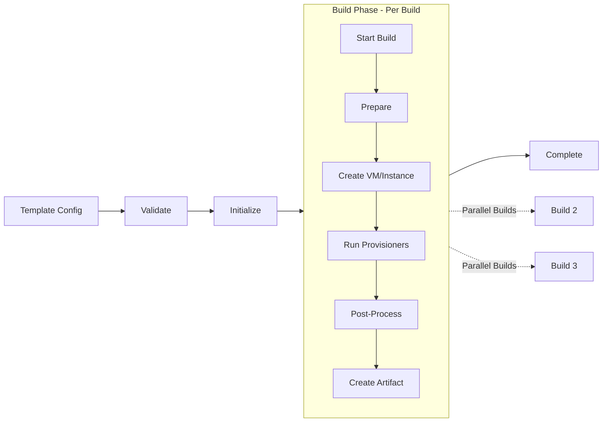
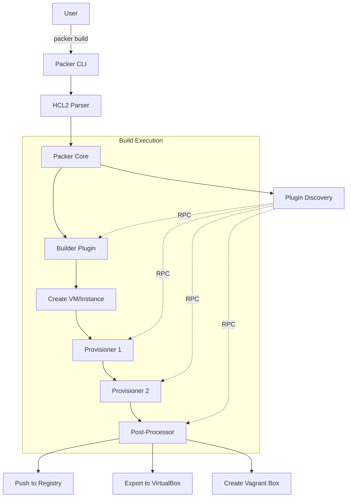
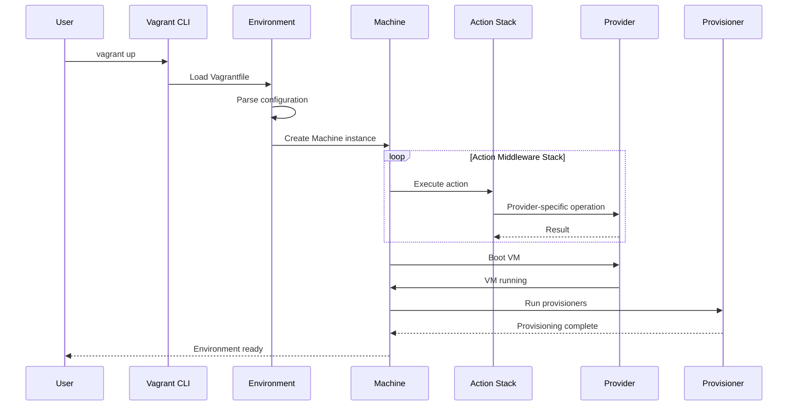
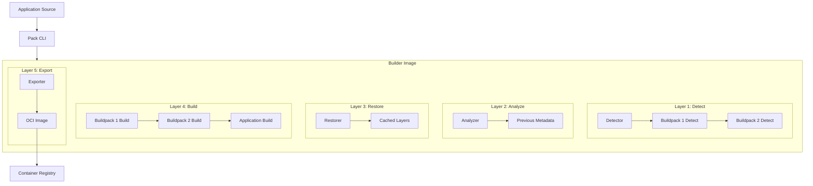

# Project Exploration: HashiCorp Infrastructure & Deployment Ecosystem

## Overview

This exploration covers four major project groups within the HashiCorp ecosystem that span the infrastructure provisioning, development environment management, and container image building lifecycle:

**Packer** is an automated machine image builder that creates identical images for multiple platforms from a single source configuration. It supports various platforms through external plugins and can output images compatible with Vagrant. Packer uses a plugin-based architecture written in Go.

**Vagrant** is a development environment manager that creates and configures portable development environments on local virtualized platforms (VirtualBox, VMware), in the cloud (AWS, OpenStack), or in containers (Docker, LXC). Written primarily in Ruby, it has a rich plugin ecosystem for providers, provisioners, and synced folders.

**Cloud Native Buildpacks** (CNB) transform application source code into OCI container images without requiring Dockerfiles. The ecosystem includes `libcnb` (Go library for writing buildpacks), `lifecycle` (reference implementation of the CNB specification), and `pack` (CLI tool for using buildpacks).

**Open Containers Initiative (OCI) Tools** include runtime implementations and specifications that define standard formats for container images and runtimes. Key projects include `runc` (CLI tool for spawning containers), `buildah` (OCI image builder), `crun` (lightweight container runtime), and various specification documents.

Together, these tools form a comprehensive deployment ecosystem: Packer creates base machine images, Vagrant manages development environments, Buildpacks convert source code to container images, and OCI tools provide the underlying container runtime standards.

## Repository Information

### Packer
- **Location:** `/home/darkvoid/Boxxed/@formulas/src.rust/src.hashicorp/packer`
- **Remote:** N/A (not a git repository - snapshot)
- **Primary Language:** Go
- **License:** BUSL-1.1

### Vagrant
- **Location:** `/home/darkvoid/Boxxed/@formulas/src.rust/src.hashicorp/vagrant`
- **Remote:** git@github.com:hashicorp/vagrant.git
- **Primary Language:** Ruby
- **License:** BUSL-1.1
- **Recent Commits:**
  - `0b7d460a4` Bump ruby/setup-ruby from 1.288.0 to 1.293.0 (#13792)
  - `d3cecace8` Merge pull request #13791 from hashicorp/changelog/vagrant-license-pr-2026-03-10
  - `bafec23b7` Update LICENSE
  - `92e88862e` Bump ruby/setup-ruby from 1.269.0 to 1.288.0 (#13787)

### Cloud Native Buildpacks
- **Location:** `/home/darkvoid/Boxxed/@formulas/src.rust/src.hashicorp/src.buildpacks`
- **Remote:** github.com/buildpacks (libcnb, lifecycle, pack)
- **Primary Language:** Go
- **License:** Apache-2.0

### Open Containers Initiative Tools
- **Location:** `/home/darkvoid/Boxxed/@formulas/src.rust/src.hashicorp/src.opencontainers`
- **Remote:** github.com/opencontainers
- **Primary Language:** Go, C (crun), Rust (netavark)
- **License:** Apache-2.0 / BSD

## Directory Structure

### Packer Structure

```
packer/
├── main.go                          # Application entry point
├── commands.go                      # Command registrations
├── config.go                        # Configuration handling
├── log.go                           # Logging setup
├── panic.go                         # Panic handling
├── checkpoint.go                    # Update checking
├── Makefile                         # Build configuration
├── go.mod / go.sum                  # Go module dependencies
├── command/                         # CLI command implementations
│   ├── build.go                     # packer build command
│   ├── validate.go                  # packer validate command
│   ├── fmt.go                       # packer fmt command
│   ├── init.go                      # packer init command
│   ├── plugins.go                   # Plugin management commands
│   ├── fix.go                       # Template fixer
│   └── test-fixtures/               # Test template files
├── packer/                          # Core Packer logic
│   ├── core.go                      # Core build orchestration
│   ├── build.go                     # Build execution
│   ├── plugin.go                    # Plugin interface
│   ├── plugin_client.go             # Plugin RPC client
│   ├── provisioner.go               # Provisioner interface
│   └── post_processor_mock.go       # Post-processor interface
├── builder/                         # Built-in builders
│   ├── file/                        # File builder (creates files)
│   └── null/                        # Null builder (no actual machine)
├── provisioner/                     # Built-in provisioners
│   ├── shell/                       # Shell script provisioner
│   ├── powershell/                  # PowerShell provisioner
│   ├── file/                        # File copy provisioner
│   ├── breakpoint/                  # Debug breakpoint
│   └── hcp-sbom/                    # SBOM generation
├── post-processor/                  # Built-in post-processors
│   ├── checksum/                    # Generate checksums
│   ├── compress/                    # Compress artifacts
│   └── manifest/                    # Generate manifest
├── hcl2template/                    # HCL2 template parsing
│   ├── parser.go                    # Template parser
│   ├── decode.go                    # HCL decoding
│   ├── types.build.go               # Build type definitions
│   ├── types.datasource.go          # Datasource types
│   └── function/                    # Template functions
├── fix/                             # Template fixers (legacy -> HCL2)
│   ├── fixer_amazon_*.go            # AWS-specific fixers
│   ├── fixer_azure_*.go             # Azure-specific fixers
│   └── fixer_virtualbox_*.go        # VirtualBox fixers
├── datasource/                      # Data sources for templates
│   ├── hcp-packer-artifact/         # HCP Packer integration
│   ├── hcp-packer-image/
│   ├── hcp-packer-iteration/
│   └── http/                        # HTTP data source
├── internal/                        # Internal packages
│   ├── dag/                         # Directed acyclic graph
│   └── hcp/                         # HashiCorp Cloud Platform
├── helper/                          # Helper utilities
├── version/                         # Version information
├── acctest/                         # Acceptance tests
├── packer_test/                     # Core tests
└── website/                         # Documentation site
```

### Vagrant Structure

```
vagrant/
├── vagrant.gemspec                  # Ruby gem specification
├── Gemfile                          # Ruby dependencies
├── Rakefile                         # Build tasks
├── version.txt                      # Version file
├── lib/
│   ├── vagrant.rb                   # Main entry point
│   └── vagrant/
│       ├── action/                  # Action middleware system
│       │   ├── builder.rb           # Action sequence builder
│       │   ├── hook.rb              # Hook system
│       │   └── builtin/             # Built-in actions
│       │       ├── box_add.rb       # Box addition
│       │       ├── box_remove.rb    # Box removal
│       │       ├── handle_box.rb    # Box handling
│       │       ├── disk.rb          # Disk management
│       │       └── provisioner.rb   # Provisioning
│       ├── plugin/                  # Plugin system
│       │   ├── manager.rb           # Plugin manager
│       │   ├── remote.rb            # Remote plugins
│       │ └── v2.rb                  # V2 plugin API
│       ├── config/                  # Configuration classes
│       ├── guest/                   # Guest OS support
│       │   ├── capabilities/        # Guest capabilities
│       │   └── plugin.rb
│       ├── host/                    # Host OS detection
│       ├── box/                     # Box management
│       ├── machine/                 # Machine representation
│       ├── machine_index.rb         # Machine indexing
│       ├── environment.rb           # Vagrant environment
│       ├── batch_action.rb          # Batch operations
│       ├── capability_host.rb       # Capability resolution
│       └── util/                    # Utilities
│           ├── credential_scrubber.rb
│           ├── shell_executor.rb
│           └── ssh.rb
├── plugins/                         # Core plugins
│   ├── commands/                    # CLI commands
│   │   ├── up/                      # vagrant up
│   │   ├── destroy/                 # vagrant destroy
│   │   ├── provision/               # vagrant provision
│   │   ├── ssh/                     # vagrant ssh
│   │   ├── reload/                  # vagrant reload
│   │   └── package/                 # vagrant package
│   ├── providers/                   # Provider plugins
│   │   ├── virtualbox/              # VirtualBox provider
│   │   ├── docker/                  # Docker provider
│   │   ├── libvirt/                 # Libvirt provider
│   │   └── hyperv/                  # Hyper-V provider
│   ├── provisioners/                # Provisioner plugins
│   │   ├── shell/                   # Shell provisioner
│   │   ├── ansible/                 # Ansible provisioner
│   │   ├── chef/                    # Chef provisioner
│   │   ├── puppet/                  # Puppet provisioner
│   │   └── docker/                  # Docker provisioner
│   ├── synced_folders/              # Synced folder implementations
│   ├── guests/                      # Guest OS plugins
│   ├── hosts/                       # Host OS plugins
│   └── communicators/               # Communication layers
│       ├── ssh/                     # SSH communicator
│       └── winrm/                   # WinRM communicator
├── builtin/                         # Built-in extensions
│   ├── configvagrant/
│   ├── httpdownloader/
│   └── myplugin/
├── templates/                       # ERB templates
│   ├── commands/
│   ├── config/
│   ├── nfs/
│   └── provisioners/
├── keys/                            # Default SSH keys
│   ├── vagrant                      # Private key
│   └── vagrant.pub                  # Public key
├── test/                            # Test suites
│   ├── unit/                        # Unit tests
│   ├── acceptance/                  # Acceptance tests
│   └── support/                     # Test support code
├── .ci/                             # CI configuration
├── website/                         # Documentation
└── ext/                             # C extensions
    └── vagrant/
        └── vagrant_ssl/             # SSL extension
```

### Cloud Native Buildpacks Structure

```
src.buildpacks/
├── libcnb/                          # Go CNB library
│   ├── main.go                      # Library entry point
│   ├── build.go                     # Build API
│   ├── detect.go                    # Detection API
│   ├── generate.go                  # Generation API
│   ├── environment.go               # Environment handling
│   ├── layer.go                     # Layer management
│   ├── platform.go                  # Platform integration
│   ├── buildpack.go                 # Buildpack metadata
│   ├── build_plan.go                # Build plan structures
│   ├── exec_d.go                    # Exec.d support
│   ├── log/                         # Logging utilities
│   ├── internal/                    # Internal packages
│   ├── mocks/                       # Test mocks
│   └── examples/                    # Example buildpacks
├── lifecycle/                       # CNB reference implementation
│   ├── cmd/                         # Lifecycle binaries
│   │   ├── analyzer/                # Image analysis
│   │   ├── detector/                # Buildpack detection
│   │   ├── restorer/                # Cache restoration
│   │   ├── builder/                 # Build execution
│   │   ├── exporter/                # Image export
│   │   ├── creator/                 # Combined phases
│   │   ├── rebaser/                 # Image rebasing
│   │   └── launcher/                # App launcher
│   ├── phase/                       # Lifecycle phases
│   ├── buildpack/                   # Buildpack handling
│   ├── cache/                       # Cache management
│   ├── image/                       # Image handling
│   ├── layers/                      # Layer management
│   ├── platform/                    # Platform interface
│   ├── launch/                      # Launch configuration
│   ├── archive/                     # Archive utilities
│   ├── auth/                        # Registry auth
│   ├── api/                         # API versioning
│   ├── env/                         # Environment
│   ├── log/                         # Logging
│   └── acceptance/                  # Acceptance tests
├── pack/                            # Pack CLI tool
│   ├── cmd/
│   │   ├── pack.go                  # Main CLI
│   │   └── docker_init.go           # Docker initialization
│   ├── pkg/                         # Core packages
│   │   ├── client/                  # API client
│   │   ├── build/                   # Build operations
│   │   ├── builder/                 # Builder management
│   │   ├── config/                  # Configuration
│   │   ├── dist/                    # Distribution
│   │   ├── image/                   # Image handling
│   │   ├── logging/                 # Logging
│   │   └── project/                 # Project config
│   ├── internal/                    # Internal packages
│   ├── builder/                     # Builder support
│   ├── registry/                    # Buildpack registry
│   ├── benchmarks/                  # Performance tests
│   └── acceptance/                  # Acceptance tests
├── imgutil/                         # Image utilities library
│   ├── local/                       # Local image handling
│   ├── remote/                      # Remote image handling
│   ├── layout/                      # OCI layout support
│   ├── layer/                       # Layer manipulation
│   └── testhelpers/                 # Test helpers
├── profile/                         # Buildpack profiler
│   ├── profile/
│   └── cmd/
├── spec/                            # CNB specifications
│   ├── buildpack.md                 # Buildpack spec
│   ├── platform.md                  # Platform spec
│   ├── distribution.md              # Distribution spec
│   └── extensions/                  # Extension spec
├── samples/                         # Sample buildpacks & apps
│   ├── buildpacks/
│   ├── apps/
│   ├── builders/
│   └── cicd/
├── rfcs/                            # Request for comments
├── docs/                            # Documentation
└── packs-legacy-deprecated/         # Legacy pack implementations
```

### Open Containers Initiative Tools Structure

```
src.opencontainers/
├── runc/                            # OCI container runtime
│   ├── main.go                      # CLI entry point
│   ├── init.go                      # Container init
│   ├── create.go                    # Container create
│   ├── run.go                       # Container run
│   ├── exec.go                      # Container exec
│   ├── delete.go                    # Container delete
│   ├── libcontainer/                # Core container logic
│   │   ├── container.go             # Container interface
│   │   ├── config.go                # Container config
│   │   ├── rootfs/                  # Root filesystem
│   │   ├── namespaces/              # Namespace handling
│   │   ├── cgroups/                 # Cgroup management
│   │   ├── seccomp/                 # Seccomp profiles
│   │   ├── apparmor/                # AppArmor profiles
│   │   └── integration/             # Integration tests
│   ├── internal/                    # Internal packages
│   ├── types/                       # Type definitions
│   ├── docs/                        # Documentation
│   ├── man/                         # Man pages
│   └── tests/                       # Integration tests
├── buildah/                         # OCI image builder
│   ├── buildah.go                   # Main API
│   ├── cmd/buildah/                 # CLI implementation
│   │   ├── main.go
│   │   ├── build.go                 # Build images
│   │   ├── from.go                  # Create containers
│   │   ├── run.go                   # Run commands
│   │   ├── commit.go                # Commit containers
│   │   ├── push.go                  # Push images
│   │   └── pull.go                  # Pull images
│   ├── imagebuildah/                # Dockerfile builder
│   ├── define/                      # Type definitions
│   ├── copier/                      # File copier
│   ├── chroot/                      # Chroot isolation
│   ├── bind/                        # Bind mounts
│   ├── docker/                      # Docker compatibility
│   ├── pkg/                         # Utility packages
│   ├── docs/                        # Documentation
│   └── tests/                       # Integration tests
├── crun/                            # Lightweight OCI runtime (C)
│   ├── src/                         # C source code
│   ├── libcrun/                     # Core library
│   ├── python/                      # Python handlers
│   ├── lua/                         # Lua handlers
│   ├── tests/                       # Tests
│   └── docs/                        # Documentation
├── image-spec/                      # OCI image specification
│   ├── spec.md                      # Main specification
│   ├── descriptor.md                # Descriptor format
│   ├── manifest.md                  # Manifest format
│   ├── image-index.md               # Index format
│   ├── image-layout.md              # Filesystem layout
│   ├── layer.md                     # Layer format
│   ├── config.md                    # Config format
│   ├── schema/                      # JSON schemas
│   └── specs-go/                    # Go types
├── runtime-spec/                    # OCI runtime specification
│   ├── spec.md                      # Main specification
│   ├── config.md                    # Runtime config
│   ├── bundle.md                    # Bundle format
│   ├── features.md                  # Feature detection
│   ├── config-linux.md              # Linux-specific config
│   ├── config-windows.md            # Windows-specific config
│   ├── schema/                      # JSON schemas
│   └── specs-go/                    # Go types
├── runtime-tools/                   # OCI runtime tools
│   ├── validate/                    # Config validation
│   ├── generate/                    # Config generation
│   ├── cmd/oci-runtime-tool/        # CLI tool
│   └── man/                         # Documentation
├── go-digest/                       # Content digest library
│   ├── digest.go                    # Digest types
│   ├── algorithm.go                 # Hash algorithms
│   ├── digestset/                   # Digest sets
│   └── blake3/                      # BLAKE3 support
├── cgroups/                         # Cgroup management library
│   ├── v1/                          # Cgroup v1
│   ├── v2/                          # Cgroup v2
│   ├── systemd/                     # Systemd support
│   └── devices/                     # Device handling
├── selinux/                         # SELinux utilities
│   ├── go-selinux/                  # Go SELinux bindings
│   └── pkg/                         # Utilities
├── umoci/                           # OCI image manipulation
│   ├── cmd/umoci/                   # CLI tool
│   ├── mutate/                      # Image mutation
│   ├── oci/                         # OCI operations
│   ├── pkg/                         # Utilities
│   └── test/                        # Tests
├── netavark/                        # Container networking (Rust)
│   ├── src/                         # Rust source
│   └── test/                        # Tests
└── distribution-spec/               # OCI distribution spec
    ├── spec.md                      # Distribution specification
    ├── conformance/                 # Conformance tests
    └── extensions/                  # Extension specifications
```

## Architecture

### High-Level Ecosystem Diagram



### Buildpacks Data Flow



### Vagrant Action Workflow



### Packer Build Flow



## Component Breakdown

### Packer Components

#### Core Engine
- **Location:** `packer/`
- **Purpose:** Orchestrates the entire build process from template to artifact
- **Dependencies:** packer-plugin-sdk, hcl/v2, mitchellh/cli
- **Dependents:** All builder and provisioner plugins

#### Template Parser (HCL2)
- **Location:** `hcl2template/`
- **Purpose:** Parses HCL2 configuration files into build instructions
- **Dependencies:** hashicorp/hcl/v2, zclconf/go-cty
- **Key Files:** `parser.go`, `decode.go`, `types.build.go`

#### Plugin System
- **Location:** `packer/plugin.go`, `packer/plugin_client.go`
- **Purpose:** Discovers and manages external plugins via RPC
- **Pattern:** Plugin architecture with isolated processes

#### Builders
- **Location:** `builder/` (built-in), external plugins
- **Purpose:** Create source machines for image creation
- **Built-in:** `file` (creates files), `null` (no actual machine)
- **External:** AWS, Azure, GCP, Docker, VirtualBox, VMware, etc.

#### Provisioners
- **Location:** `provisioner/`
- **Purpose:** Configure the machine with software and settings
- **Types:** `shell`, `powershell`, `file`, `ansible`, `chef`, `puppet`

#### Post-Processors
- **Location:** `post-processor/`
- **Purpose:** Transform artifacts after build completion
- **Types:** `checksum`, `compress`, `manifest`, `vagrant`

### Vagrant Components

#### Action Middleware System
- **Location:** `lib/vagrant/action/`
- **Purpose:** Composable middleware stack for all Vagrant operations
- **Pattern:** Chain of responsibility for up, destroy, provision, etc.
- **Key Files:** `builder.rb`, `hook.rb`, `builtin/`

#### Plugin Manager
- **Location:** `lib/vagrant/plugin/`
- **Purpose:** Discovers, loads, and manages plugins
- **API Version:** V2 plugin API (`v2.rb`)

#### Machine Representation
- **Location:** `lib/vagrant/machine.rb`
- **Purpose:** Represents a single Vagrant-managed machine
- **Responsibilities:** State tracking, action invocation, provider delegation

#### Providers
- **Location:** `plugins/providers/`
- **Purpose:** Abstract virtualization platform interactions
- **Providers:** VirtualBox, Docker, libvirt, Hyper-V, AWS

#### Provisioners
- **Location:** `plugins/provisioners/`
- **Purpose:** Configure machines with software
- **Types:** Shell, Ansible, Chef, Puppet, Docker, File

#### Communicators
- **Location:** `plugins/communicators/`
- **Purpose:** Handle remote execution and file transfer
- **Types:** SSH (Linux), WinRM (Windows)

#### Box Management
- **Location:** `lib/vagrant/box/`
- **Purpose:** Handle box downloading, installation, and versioning
- **Box Format:** Tarball with metadata and provider images

### Buildpacks Components

#### libcnb Library
- **Location:** `libcnb/`
- **Purpose:** Go library for implementing CNB buildpacks
- **API:** Build, Detect, Generate functions
- **Features:** Layer management, environment handling, SBOM generation

#### Lifecycle Engine
- **Location:** `lifecycle/`
- **Purpose:** Reference implementation of CNB specification
- **Binaries:** analyzer, detector, restorer, builder, exporter, creator, rebaser, launcher
- **Phases:**
  1. **Analyze:** Read previous image metadata
  2. **Detect:** Choose buildpacks via detect scripts
  3. **Restore:** Restore cached layers
  4. **Build:** Execute buildpacks
  5. **Export:** Create OCI image

#### Pack CLI
- **Location:** `pack/`
- **Purpose:** User-facing CLI for buildpack operations
- **Commands:** `build`, `builder`, `buildpack`, `image`, `sbom`
- **Integration:** Works with Docker daemon or OCI registries

#### Image Utilities
- **Location:** `imgutil/`
- **Purpose:** Library for working with OCI and Docker images
- **Features:** Local and remote image handling, layer manipulation

### OCI Tools Components

#### runc Runtime
- **Location:** `runc/`
- **Purpose:** Reference implementation of OCI runtime specification
- **Key Features:** Namespaces, cgroups, seccomp, AppArmor, SELinux
- **Core Library:** `libcontainer/`

#### Buildah Builder
- **Location:** `buildah/`
- **Purpose:** Build OCI images without requiring a daemon
- **Modes:** CLI tool, Go library, Dockerfile builder
- **Features:** Mount containers, run commands, commit images

#### crun Runtime
- **Location:** `crun/`
- **Purpose:** Lightweight OCI runtime written in C
- **Advantages:** Faster startup, lower memory footprint than runc
- **Features:** Systemd integration, seccomp, AppArmor

#### Specifications
- **Locations:** `image-spec/`, `runtime-spec/`, `distribution-spec/`
- **Purpose:** Define standard formats for containers
- **Artifacts:** JSON schemas, Go types, markdown specifications

#### Supporting Libraries
- **go-digest:** Content-addressable digest handling
- **cgroups:** Cgroup v1/v2 management
- **selinux:** SELinux bindings
- **umoci:** OCI image manipulation tool
- **runtime-tools:** Config validation and generation

## Entry Points

### Packer Entry Point

**File:** `packer/main.go`

The Packer application uses panicwrap for panic handling and checkpoint for update checking.

**Execution Flow:**
1. `main()` calls `realMain()`
2. Check if running as plugin or wrapped via panicwrap
3. Setup logging to temp file for panic recovery
4. Generate UUID for the run (`PACKER_RUN_UUID`)
5. Initialize checkpoint reporter for crash reporting
6. Create CLI app with mitchellh/cli
7. Register all commands (build, validate, fmt, etc.)
8. Execute requested command via CLI framework

**Key Commands:**
- `packer build <template>` - Build images from template
- `packer validate <template>` - Validate template syntax
- `packer fmt <template>` - Format HCL2 templates
- `packer init <template>` - Install required plugins
- `packer plugins install/remove` - Plugin management

### Vagrant Entry Point

**File:** `bin/vagrant` (shell wrapper) -> `lib/vagrant.rb`

**Execution Flow:**
1. Load shared helpers and environment setup
2. Initialize log4r logging with VAGRANT_LOG level
3. Setup credential scrubber for sensitive data
4. Load plugin manager and discover plugins
5. Parse CLI arguments via OptionParser
6. Resolve command and load environment
7. Execute command through action middleware stack

**Key Commands:**
- `vagrant up` - Create and provision environment
- `vagrant destroy` - Remove environment
- `vagrant provision` - Re-run provisioners
- `vagrant ssh` - SSH into machine
- `vagrant halt` - Gracefully shutdown
- `vagrant package` - Create box from environment

### Buildpacks Entry Point (Pack CLI)

**File:** `src.buildpacks/pack/cmd/pack.go`

**Execution Flow:**
1. Initialize Docker client (if needed)
2. Setup logging and configuration
3. Register commands via cmd package
4. Execute requested command

**Key Commands:**
- `pack build <name>` - Build image from source
- `pack builder create` - Create custom builder
- `pack buildpack package` - Package buildpack
- `pack sbom download` - Download SBOM materials

### OCI Tools Entry Points

**runc:** `runc/main.go`
- Commands: `create`, `start`, `run`, `exec`, `delete`, `list`

**buildah:** `buildah/cmd/buildah/main.go`
- Commands: `build`, `from`, `run`, `commit`, `push`, `pull`

## Data Flow

### Packer Build Data Flow



### Vagrant Up Data Flow



### Buildpack Build Data Flow



## External Dependencies

### Packer Dependencies

| Dependency | Version | Purpose |
|------------|---------|---------|
| github.com/hashicorp/packer-plugin-sdk | v0.6.0 | Plugin development SDK |
| github.com/hashicorp/hcl/v2 | v2.19.1 | Configuration parsing |
| github.com/zclconf/go-cty | v1.13.3 | Type system for HCL |
| github.com/mitchellh/cli | v1.1.5 | CLI framework |
| github.com/mitchellh/mapstructure | v1.5.0 | Map to struct decoding |
| github.com/hashicorp/go-getter/v2 | v2.2.2 | File downloading |
| github.com/hashicorp/hcp-sdk-go | v0.136.0 | HCP Packer integration |
| golang.org/x/crypto | v0.35.0 | Cryptographic functions |
| github.com/go-git/go-git/v5 | v5.13.0 | Git operations |

### Vagrant Dependencies

| Dependency | Version | Purpose |
|------------|---------|---------|
| log4r | ~> 1.1.9 | Logging framework |
| i18n | ~> 1.12 | Internationalization |
| net-ssh | ~> 7.0 | SSH connectivity |
| net-sftp | ~> 4.0 | SFTP file transfer |
| net-scp | ~> 4.0 | SCP file transfer |
| winrm | >= 2.3.9 | Windows remote management |
| childprocess | ~> 5.1 | Child process management |
| listen | ~> 3.7 | File system monitoring |
| hashicorp-checkpoint | ~> 0.1.5 | Update checking |
| vagrant_cloud | ~> 3.1.2 | Vagrant Cloud API |
| rubyzip | ~> 2.3.2 | ZIP file handling |
| bcrypt_pbkdf | ~> 1.1 | Key derivation |

### Buildpacks Dependencies

| Dependency | Version | Purpose |
|------------|---------|---------|
| github.com/BurntSushi/toml | v1.5.0 | TOML parsing |
| github.com/google/go-containerregistry | v0.20.x | Container registry access |
| github.com/docker/docker | v27.x | Docker daemon integration |
| github.com/buildpacks/imgutil | v0.0.0 | Image utilities |
| github.com/onsi/gomega | v1.37.x | Testing framework |
| github.com/Masterminds/semver | v1.5.0 | Semantic versioning |
| github.com/go-git/go-git/v5 | v5.15.x | Git operations |
| github.com/heroku/color | v0.0.6 | Colored output |

### OCI Tools Dependencies

| Dependency | Version | Purpose |
|------------|---------|---------|
| github.com/opencontainers/runtime-spec | v1.2.x | OCI runtime specification |
| github.com/opencontainers/image-spec | v1.1.x | OCI image specification |
| github.com/containers/storage | v1.58.x | Container storage |
| github.com/containers/image/v5 | v5.35.x | Image handling |
| github.com/docker/go-units | v0.5.0 | Unit parsing |
| github.com/moby/sys/capability | v0.4.0 | Linux capabilities |
| github.com/seccomp/libseccomp-golang | v0.10.x | Seccomp support |
| github.com/cyphar/filepath-securejoin | v0.4.x | Secure path joining |

## Configuration

### Packer Configuration

Packer uses HCL2 (HashiCorp Configuration Language) for templates:

**Template Structure:**
```hcl
packer {
  required_plugins {
    amazon = {
      version = ">= 1.0.0"
      source  = "github.com/hashicorp/amazon"
    }
  }
}

source "amazon-ebs" "my-ami" {
  ami_name      = "my-ami"
  instance_type = "t2.micro"
  region        = "us-east-1"
  source_ami    = "ami-xxxxxxxx"
}

build {
  sources = ["source.amazon-ebs.my-ami"]

  provisioner "shell" {
    inline = ["sudo apt-get update"]
  }

  post-processor "manifest" {
    output = "manifest.json"
  }
}
```

**Environment Variables:**
- `PACKER_LOG` - Enable logging (true/false)
- `PACKER_LOG_PATH` - Log file location
- `PACKER_CACHE_DIR` - Plugin cache directory
- `PACKER_CONFIG` - Configuration file path
- `PACKER_RUN_UUID` - Unique identifier for the run

### Vagrant Configuration

Vagrant uses a `Vagrantfile` (Ruby DSL):

**Vagrantfile Structure:**
```ruby
Vagrant.configure("2") do |config|
  config.vm.box = "hashicorp/bionic64"
  config.vm.network "forwarded_port", guest: 80, host: 8080

  config.vm.provider "virtualbox" do |vb|
    vb.memory = "2048"
    vb.cpus = 2
  end

  config.vm.provision "shell", inline: <<-SHELL
    apt-get update
    apt-get install -y nginx
  SHELL
end
```

**Environment Variables:**
- `VAGRANT_LOG` - Log level (debug, info, warn, error)
- `VAGRANT_LOG_FILE` - Log file path
- `VAGRANT_HOME` - Custom home directory
- `VAGRANT_CWD` - Working directory
- `VAGRANT_DEFAULT_PROVIDER` - Default provider

### Buildpacks Configuration

Buildpacks use TOML configuration files:

**project.toml:**
```toml
[project]
name = "my-app"
version = "1.0.0"

[build]
builder = "paketobuildpacks/builder:base"

[[build.buildpacks]]
uri = "gcr.io/paketo-buildpacks/nodejs"
```

**buildpack.toml:**
```toml
api = "0.8"

[buildpack]
name = "Node.js Buildpack"
version = "1.0.0"
id = "paketo-buildpacks/nodejs"

[[stacks]]
id = "io.buildpacks.stacks.bionic"
```

**Environment Variables:**
- `PACK_BUILDER` - Default builder image
- `DOCKER_HOST` - Docker daemon socket
- `CNB_REGISTRY_AUTH` - Registry authentication

### OCI Runtime Configuration

OCI containers use `config.json`:

```json
{
  "ociVersion": "1.0.2",
  "process": {
    "terminal": true,
    "user": {"uid": 0, "gid": 0},
    "args": ["sh"],
    "cwd": "/"
  },
  "root": {
    "path": "rootfs",
    "readonly": true
  },
  "linux": {
    "namespaces": [
      {"type": "pid"},
      {"type": "network"},
      {"type": "mount"}
    ]
  }
}
```

## Testing

### Packer Testing Strategy

- **Unit Tests:** Go testing for individual components
- **Acceptance Tests:** Full build tests with real providers
- **Plugin Tests:** Isolated plugin testing via `acctest/`
- **Fixture Tests:** Template-based tests in `test-fixtures/`

**Running Tests:**
```bash
# Unit tests
go test ./packer/...

# Acceptance tests (requires credentials)
PACKER_ACC=1 go test -timeout 120m ./command/...

# Plugin tests
go test ./acctest/...
```

### Vagrant Testing Strategy

- **Unit Tests:** RSpec tests in `test/unit/`
- **Acceptance Tests:** Full VM lifecycle tests
- **Provider Tests:** Provider-specific test suites
- **Plugin Tests:** Isolated plugin testing

**Running Tests:**
```bash
# Unit tests
bundle exec rspec test/unit

# Acceptance tests
bundle exec rake acceptance

# Specific component tests
VAGRANT_TEST=provider bundle exec rspec test/unit/vagrant/action
```

### Buildpacks Testing Strategy

- **Unit Tests:** Go testing with spec framework
- **Acceptance Tests:** Full build lifecycle tests
- **Image Tests:** OCI image validation
- **Registry Tests:** Registry integration tests

**Running Tests:**
```bash
# Unit tests
go test ./libcnb/...

# Acceptance tests
LIFECYCLE_ACCEPTANCE_TESTS=true go test ./lifecycle/acceptance

# Pack integration tests
go test ./pack/acceptance
```

### OCI Tools Testing Strategy

- **runc:** Integration tests with actual containers
- **buildah:** Build and push/pull tests
- **Conformance:** OCI specification compliance tests

**Running Tests:**
```bash
# runc tests
make test
make integration

# buildah tests
make test
make test-integration

# OCI conformance
cd distribution-spec/conformance && go test
```

## Key Insights

### Architecture Patterns

1. **Plugin Architecture:** Both Packer and Vagrant heavily rely on plugins for extensibility. Packer uses RPC-based isolated plugins, while Vagrant uses Ruby's plugin system with a formal API.

2. **Middleware Stack:** Vagrant uses a sophisticated action middleware system where operations like `vagrant up` are composed of many small, composable actions.

3. **Layered Design:** Buildpacks follow a strict layered architecture where each phase (analyze, detect, restore, build, export) builds upon the previous one.

4. **Specification-First:** OCI tools are driven by formal specifications (image-spec, runtime-spec) with reference implementations (runc, buildah) following those specs.

5. **Process Isolation:** Packer runs plugins as separate processes communicating via RPC, providing crash isolation and language flexibility.

### Technology Choices

1. **Go for Infrastructure Tools:** Packer, Buildpacks, and OCI tools are all written in Go, chosen for its concurrency model, single binary deployment, and systems programming capabilities.

2. **Ruby for CLI Tools:** Vagrant uses Ruby for its expressiveness and rapid development capabilities, with a mature plugin ecosystem.

3. **HCL2 for Configuration:** Packer adopted HCL2 for its type system and interpolation capabilities, replacing the older JSON-based templates.

4. **TOML for Buildpacks:** CNB uses TOML for its simplicity and readability in buildpack and project configuration.

### Ecosystem Relationships

1. **Packer -> Vagrant:** Packer can create Vagrant boxes as post-processor outputs, enabling teams to build custom base boxes.

2. **Buildpacks -> OCI:** Buildpacks output OCI-compliant images that can run on any OCI-compatible runtime (runc, crun).

3. **OCI Standards:** The OCI specifications provide the common foundation that allows Packer-built images, Buildpacks images, and container runtimes to interoperate.

### Security Considerations

1. **Credential Handling:** Both Vagrant and Packer have credential scrubbers to prevent secrets from appearing in logs.

2. **Image Signing:** runc supports signature verification via keyrings.

3. **Isolation:** OCI runtimes implement namespace isolation, seccomp, AppArmor, and SELinux for container security.

## Open Questions

1. **Packer Plugin Compatibility:** What is the current state of community-maintained plugins vs HashiCorp-maintained plugins? The archived repository pattern suggests some plugins may be unmaintained.

2. **Vagrant Provider Evolution:** How actively maintained are providers beyond VirtualBox and Docker? What is the status of VMware and libvirt providers?

3. **Buildpacks Platform API:** What are the differences between Platform API versions 0.12, 0.13, and 0.14? What features does each version unlock?

4. **OCI Spec Compliance:** Which OCI tools fully implement the latest specifications, and which lag behind? Are there known compatibility gaps?

5. **HCP Packer Integration:** How deep is the integration between Packer and HCP Packer registry? What metadata is tracked?

6. **Cross-Tool Workflows:** What are the recommended patterns for combining these tools? For example:
   - Packer -> Vagrant Box -> Vagrant environment
   - Buildpacks -> OCI Image -> runc container
   - Packer base image -> Buildah modifications

7. **Cloud-Native Transition:** How is the ecosystem transitioning from VM-based deployments (Packer/Vagrant) to container-based deployments (Buildpacks/OCI)? Are there hybrid patterns?

8. **Buildpacks vs Dockerfile:** What are the concrete advantages of using Buildpacks over traditional Dockerfiles for teams already invested in Docker?

9. **runc vs crun:** When should operators choose runc over crun? What are the performance and feature tradeoffs?

10. **Vagrant Relevance:** How does Vagrant fit into a cloud-native world dominated by Kubernetes and containers? Is it primarily for local development or does it have production use cases?
