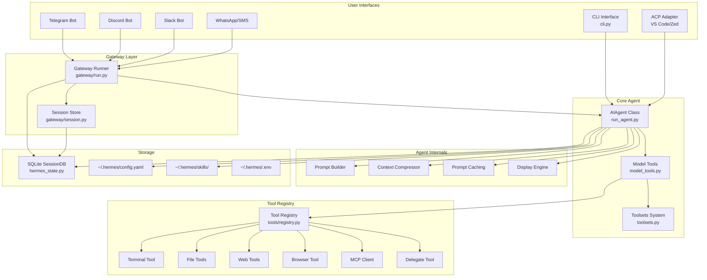
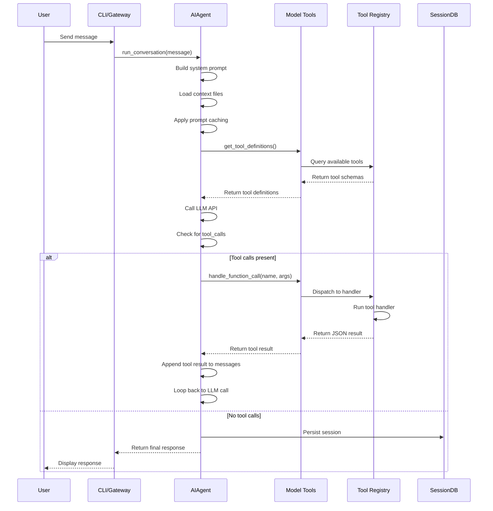

# Project Exploration: Hermes Agent

## Overview

Hermes Agent is a self-improving AI agent built by [Nous Research](https://nousresearch.com). It's the only agent with a built-in learning loop — it creates skills from experience, improves them during use, nudges itself to persist knowledge, searches its own past conversations, and builds a deepening model of who you are across sessions.

The agent can run on a $5 VPS, a GPU cluster, or serverless infrastructure that costs nearly nothing when idle. It's not tied to your laptop — talk to it from Telegram while it works on a cloud VM. Use any model you want — Nous Portal, OpenRouter (200+ models), z.ai/GLM, Kimi/Moonshot, MiniMax, OpenAI, or your own endpoint.

Key differentiators from other agents (OpenClaw/IronClaw style systems):
- **Closed learning loop**: Agent-curated memory with periodic nudges, autonomous skill creation after complex tasks, skills self-improve during use
- **FTS5 session search**: With LLM summarization for cross-session recall
- **Six terminal backends**: Local, Docker, SSH, Daytona, Singularity, and Modal
- **Multi-platform gateway**: Telegram, Discord, Slack, WhatsApp, Signal, Email, SMS, Home Assistant
- **Scheduled automations**: Built-in cron scheduler with delivery to any platform

## Repository

- **Location:** `/home/darkvoid/Boxxed/@formulas/src.rust/src.llamacpp/src.AICoders/src.NousResearch/hermes-agent`
- **Remote:** git@github.com:NousResearch/hermes-agent.git
- **Primary Language:** Python 3.11+
- **License:** MIT

## Directory Structure

```
hermes-agent/
├── run_agent.py          # AIAgent class — core conversation loop
├── model_tools.py        # Tool orchestration, _discover_tools(), handle_function_call()
├── toolsets.py           # Toolset definitions, _HERMES_CORE_TOOLS list
├── cli.py                # HermesCLI class — interactive CLI orchestrator
├── hermes_state.py       # SessionDB — SQLite session store (FTS5 search)
├── agent/                # Agent internals
│   ├── prompt_builder.py     # System prompt assembly
│   ├── context_compressor.py # Auto context compression
│   ├── prompt_caching.py     # Anthropic prompt caching
│   ├── auxiliary_client.py   # Auxiliary LLM client (vision, summarization)
│   ├── model_metadata.py     # Model context lengths, token estimation
│   ├── models_dev.py         # models.dev registry integration
│   ├── display.py            # KawaiiSpinner, tool preview formatting
│   ├── skill_commands.py     # Skill slash commands (shared CLI/gateway)
│   └── trajectory.py         # Trajectory saving helpers
├── hermes_cli/           # CLI subcommands and setup
│   ├── main.py           # Entry point — all `hermes` subcommands
│   ├── config.py         # DEFAULT_CONFIG, OPTIONAL_ENV_VARS, migration
│   ├── commands.py       # Slash command definitions + SlashCommandCompleter
│   ├── callbacks.py      # Terminal callbacks (clarify, sudo, approval)
│   ├── setup.py          # Interactive setup wizard
│   ├── skin_engine.py    # Skin/theme engine — CLI visual customization
│   ├── skills_config.py  # `hermes skills` — enable/disable skills per platform
│   ├── tools_config.py   # `hermes tools` — enable/disable tools per platform
│   ├── skills_hub.py     # `/skills` slash command (search, browse, install)
│   ├── models.py         # Model catalog, provider model lists
│   └── auth.py           # Provider credential resolution
├── tools/                # Tool implementations (one file per tool)
│   ├── registry.py       # Central tool registry (schemas, handlers, dispatch)
│   ├── approval.py       # Dangerous command detection
│   ├── terminal_tool.py  # Terminal orchestration
│   ├── process_registry.py # Background process management
│   ├── file_tools.py     # File read/write/search/patch
│   ├── web_tools.py      # Web search/extract (Parallel + Firecrawl)
│   ├── browser_tool.py   # Browserbase browser automation
│   ├── code_execution_tool.py # execute_code sandbox
│   ├── delegate_tool.py  # Subagent delegation
│   ├── mcp_tool.py       # MCP client (~1050 lines)
│   └── environments/     # Terminal backends (local, docker, ssh, modal, daytona, singularity)
├── gateway/              # Messaging platform gateway
│   ├── run.py            # Main loop, slash commands, message dispatch
│   ├── session.py        # SessionStore — conversation persistence
│   └── platforms/        # Adapters: telegram, discord, slack, whatsapp, homeassistant, signal
├── acp_adapter/          # ACP server (VS Code / Zed / JetBrains integration)
├── cron/                 # Scheduler (jobs.py, scheduler.py)
├── environments/         # RL training environments (Atropos)
├── optional-skills/      # Optional skills (not activated by default)
│   ├── autonomous-ai-agents/
│   ├── blockchain/
│   ├── creative/
│   ├── health/
│   ├── mcp/
│   ├── productivity/
│   ├── research/
│   └── security/
├── skills/               # Skill categories (25 categories, 100+ skills)
│   ├── apple/
│   ├── github/
│   ├── mlops/
│   ├── productivity/
│   ├── research/
│   └── software-development/
├── tests/                # Pytest suite (~3000 tests)
│   ├── acp/
│   ├── agent/
│   ├── gateway/
│   ├── hermes_cli/
│   ├── skills/
│   └── tools/
├── website/              # Documentation site (Docusaurus)
└── plans/                # Development planning documents
```

## Architecture

### High-Level Diagram



### Component Breakdown

#### AIAgent Class (run_agent.py)

- **Location:** `run_agent.py`
- **Purpose:** Core conversation loop orchestrator
- **Dependencies:** model_tools.py, agent/prompt_builder.py, agent/context_compressor.py
- **Dependents:** cli.py, gateway/run.py, batch_runner.py, environments/

The `AIAgent` class manages the full conversation lifecycle:
- Assembles effective prompt and tool schemas
- Selects correct provider/API mode (chat_completions, codex_responses, anthropic_messages)
- Makes interruptible model calls
- Executes tool calls (sequentially or concurrently)
- Maintains session history
- Handles compression, retries, and fallback models

```python
class AIAgent:
    def __init__(self,
        model: str = "anthropic/claude-opus-4.6",
        max_iterations: int = 90,
        enabled_toolsets: list = None,
        disabled_toolsets: list = None,
        quiet_mode: bool = False,
        save_trajectories: bool = False,
        platform: str = None,           # "cli", "telegram", etc.
        session_id: str = None,
        skip_context_files: bool = False,
        skip_memory: bool = False,
        # ... plus provider, api_mode, callbacks, routing params
    ): ...

    def chat(self, user_message: str) -> str:
        """Simple interface — returns final response string."""

    def run_conversation(self, user_message: str, system_message: str = None,
                         conversation_history: list = None, task_id: str = None) -> dict:
        """Full interface — returns dict with final_response + messages."""
```

#### Model Tools (model_tools.py)

- **Location:** `model_tools.py`
- **Purpose:** Tool orchestration layer
- **Dependencies:** tools/registry.py, toolsets.py
- **Dependents:** run_agent.py, cli.py, gateway/run.py, environments/

Thin orchestration layer over the tool registry. Each tool file in `tools/` self-registers its schema, handler, and metadata via `tools.registry.register()`. This module triggers discovery and provides the public API.

Key functions:
- `get_tool_definitions(enabled_toolsets, disabled_toolsets, quiet_mode) -> list`
- `handle_function_call(function_name, function_args, task_id, user_task) -> str`
- `TOOL_TO_TOOLSET_MAP: dict`
- `check_tool_availability(quiet) -> tuple`

#### Tool Registry (tools/registry.py)

- **Location:** `tools/registry.py`
- **Purpose:** Central registration and dispatch for all tools
- **Dependencies:** None (base module)
- **Dependents:** All tool files, model_tools.py

Singleton registry that collects tool schemas and handlers. Import chain is circular-import safe:

```
tools/registry.py  (no imports from model_tools or tool files)
       ^
tools/*.py  (import from tools.registry at module level)
       ^
model_tools.py  (imports tools.registry + all tool modules)
       ^
run_agent.py, cli.py, batch_runner.py, etc.
```

#### Toolsets System (toolsets.py)

- **Location:** `toolsets.py`
- **Purpose:** Flexible tool grouping and composition
- **Dependencies:** None
- **Dependents:** model_tools.py, cli.py, gateway/run.py

Defines tool aliases and toolsets that can be composed from individual tools or other toolsets. Key features:
- Define custom toolsets with specific tools
- Compose toolsets from other toolsets
- Built-in common toolsets for typical use cases
- Dynamic toolset resolution

Core toolsets include: `web`, `terminal`, `vision`, `browser`, `file`, `skills`, `messaging`, `rl`, `honcho`, `homeassistant`, and platform-specific sets like `hermes-cli`, `hermes-telegram`, `hermes-discord`, etc.

#### CLI Interface (cli.py)

- **Location:** `cli.py`
- **Purpose:** Interactive terminal interface
- **Dependencies:** agent/display.py, hermes_cli/, model_tools.py
- **Dependents:** None (entry point)

Features:
- Rich for banner/panels, prompt_toolkit for input with autocomplete
- KawaiiSpinner (agent/display.py) — animated faces during API calls
- Skin engine (hermes_cli/skin_engine.py) — data-driven CLI theming
- Slash command autocomplete via COMMAND_REGISTRY

#### Gateway (gateway/run.py)

- **Location:** `gateway/run.py` (~5800 lines)
- **Purpose:** Multi-platform messaging gateway
- **Dependencies:** gateway/platforms/, model_tools.py
- **Dependents:** None (entry point)

Manages connections to Telegram, Discord, Slack, WhatsApp, Signal, Email, SMS, and Home Assistant. Features:
- Session persistence via gateway/session.py
- Shared slash commands with CLI
- Background process notifications
- Platform-specific message formatting

#### Session Database (hermes_state.py)

- **Location:** `hermes_state.py`
- **Purpose:** SQLite session store with FTS5 full-text search
- **Dependencies:** None (stdlib only)
- **Dependents:** run_agent.py, cli.py, gateway/run.py

Key design decisions:
- WAL mode for concurrent readers + one writer
- FTS5 virtual table for fast text search across all session messages
- Compression-triggered session splitting via parent_session_id chains
- Session source tagging ('cli', 'telegram', 'discord', etc.)

#### Skills Hub (tools/skills_hub.py)

- **Location:** `tools/skills_hub.py` (~8700 lines)
- **Purpose:** Skill discovery, installation, and management
- **Dependencies:** httpx, yaml, tools/skills_guard.py
- **Dependents:** cli.py, agent/skill_commands.py

The Skills Hub provides:
- GitHubAuth: Shared GitHub API authentication (PAT, gh CLI, GitHub App)
- SkillSource ABC: Interface for all skill registry adapters
- GitHubSource: Fetch skills from any GitHub repo via Contents API
- HubLockFile: Track provenance of installed hub skills
- Quarantine, audit log, taps, and index cache management

## Entry Points

### CLI Entry Point

- **File:** `cli.py`
- **Description:** Interactive terminal interface
- **Flow:**
  1. Load configuration from ~/.hermes/config.yaml
  2. Initialize skin engine from display.skin config
  3. Create AIAgent instance with resolved toolsets
  4. Enter prompt_toolkit TUI loop
  5. Process user input, dispatch to AIAgent.chat()
  6. Stream tool output with KawaiiSpinner
  7. Persist session to hermes_state.db

### Gateway Entry Point

- **File:** `gateway/run.py`
- **Description:** Multi-platform messaging gateway
- **Flow:**
  1. Load configuration and initialize platform adapters
  2. Start async event loop
  3. Connect to all configured platforms (Telegram, Discord, etc.)
  4. Listen for incoming messages
  5. Route to AIAgent.run_conversation()
  6. Deliver responses back to platform

### Library Entry Point

- **File:** `run_agent.py`
- **Description:** AIAgent class for programmatic use
- **Flow:**
  1. Import AIAgent class
  2. Instantiate with desired configuration
  3. Call chat() or run_conversation()
  4. Receive response string or dict

## Data Flow



## External Dependencies

| Dependency | Version | Purpose |
|------------|---------|---------|
| openai | latest | OpenAI API client, OpenRouter, VLLM, SGLang |
| anthropic | >=0.39.0 | Anthropic Messages API |
| python-dotenv | latest | Environment variable loading |
| fire | latest | CLI argument parsing |
| httpx | latest | Async HTTP client |
| rich | latest | Terminal formatting |
| tenacity | latest | Retry logic |
| pyyaml | latest | YAML configuration |
| requests | latest | HTTP requests |
| jinja2 | latest | Template rendering |
| pydantic | >=2.0 | Data validation |
| prompt_toolkit | latest | Interactive CLI input |
| firecrawl-py | latest | Web crawling/scraping |
| parallel-web | >=0.4.2 | Parallel web search |
| fal-client | latest | Image generation |
| edge-tts | latest | Free text-to-speech |
| faster-whisper | >=1.0.0 | Speech transcription |
| litellm | >=1.75.5 | Multi-provider LLM abstraction |
| typer | latest | CLI framework |
| platformdirs | latest | Cross-platform paths |
| PyJWT | latest | GitHub App authentication |

## Configuration

### Config File: ~/.hermes/config.yaml

```yaml
# Model configuration
model: anthropic/claude-opus-4.6
provider: anthropic
base_url: https://api.anthropic.com

# Display configuration
display:
  skin: default
  prefill_messages: null
  reasoning_effort: medium

# Terminal configuration
terminal:
  environment: local  # local, docker, ssh, modal, daytona, singularity
  background: true
  check_interval: 2.0

# Tool configuration
tools:
  enabled_toolsets: [hermes-cli]
  disabled_toolsets: []

# Skills configuration
skills:
  enabled_categories: []
  disabled_categories: []

# Gateway configuration
gateway:
  platforms: [telegram, discord]
  background_process_notifications: all
```

### Environment Variables (~/.hermes/.env)

```bash
# Provider API keys
ANTHROPIC_API_KEY=...
OPENROUTER_API_KEY=...
GITHUB_TOKEN=...

# Tool-specific keys
FIRECRAWL_API_KEY=...
FAL_KEY=...
BROWSERBASE_API_KEY=...

# Terminal backend
MODAL_TOKEN_ID=...
MODAL_TOKEN_SECRET=...
DAYTONA_API_KEY=...

# Gateway tokens
TELEGRAM_BOT_TOKEN=...
DISCORD_BOT_TOKEN=...
SLACK_BOT_TOKEN=...
```

### Slash Command Registry

All slash commands are defined in a central `COMMAND_REGISTRY` list in `hermes_cli/commands.py`. Every downstream consumer derives from this registry automatically:

- **CLI** — `process_command()` resolves aliases via `resolve_command()`, dispatches on canonical name
- **Gateway** — `GATEWAY_KNOWN_COMMANDS` frozenset for hook emission
- **Telegram** — `telegram_bot_commands()` generates the BotCommand menu
- **Slack** — `slack_subcommand_map()` generates `/hermes` subcommand routing
- **Autocomplete** — `COMMANDS` flat dict feeds `SlashCommandCompleter`
- **CLI help** — `COMMANDS_BY_CATEGORY` dict feeds `show_help()`

## Testing

```bash
source venv/bin/activate
python -m pytest tests/ -q          # Full suite (~3000 tests, ~3 min)
python -m pytest tests/test_model_tools.py -q   # Toolset resolution
python -m pytest tests/test_cli_init.py -q       # CLI config loading
python -m pytest tests/gateway/ -q               # Gateway tests
python -m pytest tests/tools/ -q                 # Tool-level tests
```

Test organization:
- `tests/acp/` — ACP adapter tests
- `tests/agent/` — Agent internals tests
- `tests/gateway/` — Platform gateway tests
- `tests/hermes_cli/` — CLI command tests
- `tests/skills/` — Skills hub tests
- `tests/tools/` — Individual tool tests

## Key Insights

1. **Registry-based tool architecture**: Tools self-register at import time, avoiding circular dependencies and enabling plugin-style extensibility

2. **Toolset composition**: Toolsets can include other toolsets, enabling flexible grouping without duplication

3. **Async bridging**: Persistent event loops (`_get_tool_loop()`, `_get_worker_loop()`) prevent "Event loop is closed" errors from cached HTTP clients

4. **Dangerous command detection**: Pattern-based detection with per-session approval state and permanent allowlist persistence

5. **Skills Hub as a marketplace**: GitHub-backed skill registry with trust levels (builtin, trusted, community), quarantine, and audit logging

6. **Session continuity**: FTS5-powered search across all sessions with compression-triggered session splitting

7. **Multi-platform gateway**: Single codebase serves CLI, Telegram, Discord, Slack, WhatsApp, Signal, Email, SMS, and Home Assistant

8. **Six terminal backends**: Local, Docker, SSH, Daytona (serverless), Singularity (containers), Modal (serverless GPU)

9. **Prompt caching**: Anthropic prompt caching integration with automatic cache invalidation on context changes

10. **Subagent delegation**: Isolated subagents with separate context, tools, and iteration budgets

## Open Questions

1. **MCP OAuth flow**: The `tools/mcp_oauth.py` file suggests OAuth integration for MCP servers — how is this triggered and which providers support it?

2. **RL training environments**: The `environments/` directory contains Atropos RL environments — how does the training loop integrate with the agent?

3. **Trajectory compression**: The `agent/trajectory.py` mentions compression for training data — what format is used and how is it consumed?

4. **Honcho integration**: The `honcho_tools.py` and `HONCHO_TOOL_NAMES` suggest integration with plastic-labs/honcho for user modeling — how deep is this integration?

5. **Security policies**: The `tools/tirith_security.py` file — what security scanning does this provide?

6. **Voice mode**: The `tools/voice_mode.py` file — how does voice interaction work alongside text?

7. **NEUTTS synthesis**: The `tools/neutts_synth.py` file — what neural text-to-speech synthesis is this?

## File Sizes (Lines of Code)

| File | Lines |
|------|-------|
| run_agent.py | ~3000 |
| model_tools.py | ~800 |
| toolsets.py | ~570 |
| cli.py | ~1500 |
| hermes_state.py | ~400 |
| gateway/run.py | ~5800 |
| tools/skills_hub.py | ~2400 |
| tools/mcp_tool.py | ~2100 |
| tools/browser_tool.py | ~1900 |
| tools/terminal_tool.py | ~1700 |
| tools/file_tools.py | ~900 |
| tools/web_tools.py | ~2100 |
| tools/approval.py | ~700 |
| tools/registry.py | ~350 |
| hermes_cli/skin_engine.py | ~720 |
| hermes_cli/commands.py | ~1500 |
| agent/prompt_builder.py | ~800 |
| agent/context_compressor.py | ~600 |

**Total estimated:** ~25,000+ lines of Python

## Related Projects

- **OpenClaw/IronClaw**: Similar agent architectures that Hermes may have drawn inspiration from
- **Plastic Labs Honcho**: User modeling integration for cross-session memory
- **Agent Skills (agentskills.io)**: Open standard for skill definitions
- **Atropos**: RL training framework for agent optimization
