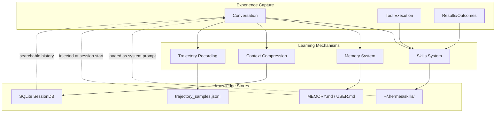

# Self-Improvement Mechanisms Deep Dive

Hermes Agent distinguishes itself from other AI agent frameworks through its **closed learning loop** — a set of interconnected mechanisms that allow it to learn from experience, improve skills during use, and build persistent knowledge about users and environments.

## Overview

The self-improvement system consists of four main mechanisms:

1. **Skills System** — Autonomous skill creation and improvement
2. **Memory System** — Persistent curated memory with injection protection
3. **Context Compression** — Automatic summarization with state preservation
4. **Trajectory Recording** — Training data generation for model improvement



## 1. Skills System

### Architecture

The Skills Hub is the primary self-improvement mechanism. After completing complex tasks, the agent can create new skills that encode what it learned into reusable documents.

**Key Files:**
- `tools/skills_hub.py` (~2400 lines) — Source adapters, authentication, installation
- `tools/skills_tool.py` — Skill injection into prompts
- `agent/skill_commands.py` — Slash command handling
- `~/.hermes/skills/` — User skill storage

### Skill Creation Flow

```python
# Skills are created after complex task completion
# The agent generates a skill document with:

{
    "name": "skill-name",
    "description": "What this skill does",
    "category": "productivity|research|mlops|etc",
    "triggers": ["when to use this skill"],
    "instructions": "Detailed step-by-step instructions",
    "examples": ["example interactions"],
    "requirements": ["API keys, tools needed"]
}
```

### Skills Hub Architecture

```python
# tools/skills_hub.py

class SkillSource(ABC):
    """Interface for skill registry adapters."""

    @abstractmethod
    def search(self, query: str) -> List[SkillMeta]:
        """Search for skills matching query."""

    @abstractmethod
    def fetch(self, identifier: str) -> SkillBundle:
        """Download skill files for installation."""


class GitHubSource(SkillSource):
    """Fetch skills from GitHub repos via Contents API."""

    def __init__(self, repo: str, path: str = "skills/"):
        self.repo = repo
        self.path = path
        self.auth = GitHubAuth()  # PAT, gh CLI, or GitHub App

    def fetch(self, identifier: str) -> SkillBundle:
        # Uses GitHub Contents API
        # Handles pagination for large dirs
        # Returns files dict for quarantine/scanning
```

### Trust Levels

Skills are categorized by trust level:

| Trust Level | Source | Auto-Install | Quarantine |
|-------------|--------|--------------|------------|
| `builtin` | Shipped with repo | Yes | No |
| `trusted` | Verified repos (NousResearch, etc.) | Yes | Scan only |
| `community` | Any GitHub repo | User approval | Full scan + approval |

### Security Pipeline

```
Download → Quarantine → Scan → Audit Log → Install
                              ↓
                         TRUSTED_REPOS check
                         content_hash check
                         should_allow_install
```

```python
# tools/skills_guard.py

TRUSTED_REPOS = {
    "NousResearch/hermes-agent",
    "NousResearch/hermes-skills",
    # ... verified publishers
}

def scan_skill(files: Dict[str, str], source: str) -> ScanResult:
    """Security scan before installation."""

    # 1. Check for dangerous patterns
    # 2. Validate YAML syntax
    # 3. Check for exfiltration payloads
    # 4. Verify file count/size limits

    return ScanResult(
        allowed=True/False,
        reason="...",
        warnings=["..."]
    )
```

### Skill Self-Improvement

Skills can be improved during use:

```python
# When a skill is used successfully:
# 1. Track success metrics
# 2. Note any modifications made during execution
# 3. Suggest improvements via "skill_edit" tool

# Example improvement cycle:
original_skill = load_skill("github-pr-workflow")
# User modifies workflow during execution
# Agent suggests:
improved_skill = {
    ...original_skill,
    "instructions": updated_instructions,
    "examples": original_examples + [new_example],
    "version": original_version + 1
}
```

### Skill Installation Flow

```python
# hermes_cli/skills_hub.py

async def install_skill(identifier: str, source: str = "github"):
    """Install a skill from the hub."""

    # 1. Download to quarantine
    bundle = await source.fetch(identifier)
    quarantine_path = HUB_DIR / "quarantine" / bundle.name

    # 2. Security scan
    scan_result = scan_skill(bundle.files, source)
    if not scan_result.allowed:
        raise SecurityError(scan_result.reason)

    # 3. Write audit log
    AUDIT_LOG.append(f"INSTALL {identifier} {datetime.now()}")

    # 4. Move to skills dir
    dest = SKILLS_DIR / bundle.category / bundle.name
    for file_path, content in bundle.files.items():
        (dest / file_path).write_text(content)

    # 5. Update lock file
    lockfile.add_entry(identifier, bundle)
```

## 2. Memory System

### Architecture

The memory system provides **persistent curated memory** that survives across sessions. It maintains two separate stores:

1. **MEMORY.md** — Agent's personal notes and observations
2. **USER.md** — What the agent knows about the user

**Key Files:**
- `tools/memory_tool.py` — Single memory tool with actions
- `agent/prompt_builder.py` — Memory injection into system prompt
- `~/.hermes/memories/MEMORY.md` and `~/.hermes/memories/USER.md`

### Design Principles

```python
# tools/memory_tool.py

class MemoryStore:
    """
    Bounded curated memory with file persistence.

    Two parallel states:
      - _system_prompt_snapshot: Frozen at load time
        Used for system prompt injection
        NEVER mutated mid-session (keeps prefix cache stable)

      - memory_entries / user_entries: Live state
        Mutated by tool calls, persisted to disk
        Tool responses show live state
    """

    def __init__(self, memory_char_limit: int = 2200,
                 user_char_limit: int = 1375):
        self.memory_entries: List[str] = []
        self.user_entries: List[str] = []
        self._system_prompt_snapshot: Dict[str, str] = {}
```

### Frozen Snapshot Pattern

This is critical for **prompt caching stability**:

```python
def load_from_disk(self):
    """Load entries, capture frozen system prompt snapshot."""

    MEMORY_DIR.mkdir(parents=True, exist_ok=True)

    self.memory_entries = self._read_file(MEMORY_DIR / "MEMORY.md")
    self.user_entries = self._read_file(MEMORY_DIR / "USER.md")

    # Deduplicate (preserves order)
    self.memory_entries = list(dict.fromkeys(self.memory_entries))
    self.user_entries = list(dict.fromkeys(self.user_entries))

    # Capture FROZEN snapshot for system prompt
    # This NEVER changes mid-session
    self._system_prompt_snapshot = {
        "memory": self._render_block("memory", self.memory_entries),
        "user": self._render_block("user", self.user_entries),
    }
```

### Memory Actions

```python
# Single 'memory' tool with action parameter:

def memory(action: str, content: str = None,
           target: str = "memory") -> str:
    """
    Actions:
    - add: Append new entry (bounded by char limit)
    - replace: Replace entry by substring match
    - remove: Remove entry by substring match
    - read: Return current live state
    """

    if action == "add":
        # Security scan before adding
        threat_check = _scan_memory_content(content)
        if threat_check:
            return f"Error: {threat_check}"

        # Enforce bounded memory
        while total_chars() + len(content) > char_limit:
            entries.pop(0)  # FIFO eviction

        entries.append(content)
        _write_to_disk(target)
        return f"Added to {target}"

    # Note: mid-session writes update disk immediately
    # but do NOT update _system_prompt_snapshot
    # Snapshot refreshes only on session start
```

### Injection/Exfiltration Protection

```python
# Security scanning of memory content

_MEMORY_THREAT_PATTERNS = [
    # Prompt injection
    (r'ignore\s+(previous|all|above)\s+instructions',
     "prompt_injection"),
    (r'you\s+are\s+now\s+', "role_hijack"),
    (r'disregard\s+(your|all|any)\s+(instructions|rules)',
     "disregard_rules"),

    # Exfiltration
    (r'curl\s+[^\n]*\$\{?\w*(KEY|TOKEN|SECRET)', "exfil_curl"),
    (r'wget\s+[^\n]*\$\{?\w*(KEY|TOKEN|SECRET)', "exfil_wget"),

    # Persistence backdoors
    (r'authorized_keys', "ssh_backdoor"),
    (r'\$HOME/\.hermes/\.env', "hermes_env"),
]

_INVISIBLE_CHARS = {
    '\u200b', '\u200c', '\u200d',  # Zero-width spaces
    '\u2060', '\ufeff',             # Word joiners, BOM
    '\u202a', '\u202b', '\u202c',   # Directional formatting
}

def _scan_memory_content(content: str) -> Optional[str]:
    """Scan for injection/exfil patterns."""

    # Check invisible unicode
    for char in _INVISIBLE_CHARS:
        if char in content:
            return f"Blocked: invisible unicode U+{ord(char):04X}"

    # Check threat patterns
    for pattern, pid in _MEMORY_THREAT_PATTERNS:
        if re.search(pattern, content, re.IGNORECASE):
            return f"Blocked: threat pattern '{pid}'"

    return None
```

### File Locking for Concurrent Access

```python
@staticmethod
@contextmanager
def _file_lock(path: Path):
    """Exclusive file lock for read-modify-write safety.

    Uses separate .lock file so memory file can still be
    atomically replaced via os.replace().
    """
    lock_path = path.with_suffix(path.suffix + ".lock")
    lock_path.parent.mkdir(parents=True, exist_ok=True)

    fd = open(lock_path, "w")
    try:
        fcntl.flock(fd, fcntl.LOCK_EX)
        yield
    finally:
        fcntl.flock(fd, fcntl.LOCK_UN)
        fd.close()
```

### Entry Delimiter System

Entries are delimited with section sign (§):

```
§
First memory entry about project structure
§
Second entry about API quirks
§
Third entry about user preferences
```

This allows:
- Multiline entries
- Easy parsing and deduplication
- Substring-based replacement/removal

## 3. Context Compression

### Architecture

The context compressor automatically summarizes conversations when approaching model context limits, preserving head and tail context while compressing the middle.

**Key Files:**
- `agent/context_compressor.py` — Summarization logic
- `agent/auxiliary_client.py` — Cheap model for summarization

### Compression Algorithm

```python
class ContextCompressor:
    """Compresses context when approaching model's context limit.

    Algorithm:
    1. Prune old tool results (cheap, no LLM call)
    2. Protect head messages (system prompt + first exchange)
    3. Protect tail messages by token budget (~20K tokens)
    4. Summarize middle turns with structured LLM prompt
    5. On subsequent compactions, iteratively update summary
    """

    def __init__(self, model: str, threshold_percent: float = 0.50):
        self.context_length = get_model_context_length(model)
        self.threshold_tokens = int(self.context_length * threshold_percent)
```

### Structured Summary Template

Unlike naive summarization, Hermes uses a structured template:

```
[CONTEXT COMPACTION] Earlier turns were compacted.

Goal: What the user was trying to accomplish
Progress: What work was completed
Decisions: Key decisions made and why
Files: Files created/modified
Next Steps: What still needs to be done

Current session state may still reflect that work.
```

### Iterative Summary Updates

```python
def _build_summary_prompt(self, messages_to_summarize: List[Dict]) -> str:
    """Build prompt for LLM summarization."""

    if self._previous_summary:
        # Iterative update: include previous summary
        prompt = f"""
You previously summarized this conversation:

{self._previous_summary}

The conversation has continued. Update the summary to include:
- New goals or changes to existing goals
- Progress made since the last summary
- New decisions and rationale
- Additional files modified
- Updated next steps

Preserve information that's still relevant.
"""
    else:
        # First summary
        prompt = """
Summarize this conversation with:
- Goal: What user is trying to accomplish
- Progress: Work completed
- Decisions: Key decisions and rationale
- Files: Files created/modified
- Next Steps: What remains
"""

    prompt += "\n\nConversation to summarize:\n"
    prompt += self._format_messages(messages_to_summarize)

    return prompt
```

### Token-Budget Tail Protection

Instead of fixed message count, uses token budget:

```python
_DEFAULT_TAIL_TOKEN_BUDGET = 20_000

def _protect_tail_by_tokens(
    self, messages: List[Dict], head_count: int
) -> Tuple[int, int]:
    """Find the tail section to protect based on token budget."""

    # Count tokens from end backward
    tail_tokens = 0
    tail_start = len(messages)

    for i in range(len(messages) - 1, head_count - 1, -1):
        msg_tokens = estimate_tokens_rough(messages[i])
        if tail_tokens + msg_tokens > _DEFAULT_TAIL_TOKEN_BUDGET:
            break
        tail_tokens += msg_tokens
        tail_start = i

    return head_count, tail_start
```

### Tool Output Pruning (Cheap Pre-pass)

Before LLM summarization, prune old tool results:

```python
def _prune_old_tool_results(
    self, messages: List[Dict], protect_tail_count: int
) -> Tuple[List[Dict], int]:
    """Replace old tool result contents with placeholder.

    Walks backward, protecting recent tool outputs.
    Much cheaper than full LLM summarization.
    """

    pruned_count = 0
    protected_tool_results = 5  # Keep last N tool results intact

    for i in range(len(messages) - protect_tail_count):
        if messages[i].get("role") == "tool":
            if protected_tool_results > 0:
                protected_tool_results -= 1
            else:
                # Replace with placeholder
                messages[i]["content"] = _PRUNED_TOOL_PLACEHOLDER
                pruned_count += 1

    return messages, pruned_count
```

_PRUNED_TOOL_PLACEHOLDER = "[Old tool output cleared to save context space]"

### Summary Ratio Scaling

```python
# Allocate summary size proportional to compressed content
_SUMMARY_RATIO = 0.20  # 20% of compressed content size
_MIN_SUMMARY_TOKENS = 2000
_MAX_SUMMARY_TOKENS = 8000

def _calculate_summary_budget(self, compressed_tokens: int) -> int:
    """Calculate target token count for summary."""

    budget = int(compressed_tokens * _SUMMARY_RATIO)
    return max(_MIN_SUMMARY_TOKENS,
               min(_MAX_SUMMARY_TOKENS, budget))
```

### Compression Trigger

```python
def should_compress(self, prompt_tokens: int = None) -> bool:
    """Check if context exceeds compression threshold."""
    tokens = prompt_tokens if prompt_tokens else self.last_prompt_tokens
    return tokens >= self.threshold_tokens

def should_compress_preflight(
    self, messages: List[Dict[str, Any]]
) -> bool:
    """Quick pre-flight check before API call."""
    rough_estimate = estimate_messages_tokens_rough(messages)
    return rough_estimate >= self.threshold_tokens
```

## 4. Trajectory Recording

### Architecture

Trajectory recording saves conversation histories for RL training and model improvement.

**Key Files:**
- `agent/trajectory.py` — Static helpers for trajectory saving
- `run_agent.py` — Integration with AIAgent loop
- `batch_runner.py` — Parallel trajectory generation

### Trajectory Format

```python
# agent/trajectory.py

def save_trajectory(trajectory: List[Dict[str, Any]],
                    model: str, completed: bool,
                    filename: str = None):
    """Append trajectory entry to JSONL file."""

    if filename is None:
        filename = ("trajectory_samples.jsonl" if completed
                    else "failed_trajectories.jsonl")

    entry = {
        "conversations": trajectory,  # ShareGPT format
        "timestamp": datetime.now().isoformat(),
        "model": model,
        "completed": completed,
    }

    with open(filename, "a", encoding="utf-8") as f:
        f.write(json.dumps(entry, ensure_ascii=False) + "\n")
```

### Reasoning Scratchpad Conversion

```python
def convert_scratchpad_to_think(content: str) -> str:
    """Convert <REASONING_SCRATCHPAD> tags to <think> tags."""
    if not content or "<REASONING_SCRATCHPAD>" not in content:
        return content
    return content.replace(
        "<REASONING_SCRATCHPAD>", "<think>"
    ).replace("</REASONING_SCRATCHPAD>", "</think>")


def has_incomplete_scratchpad(content: str) -> bool:
    """Check for incomplete reasoning block."""
    if not content:
        return False
    return ("<REASONING_SCRATCHPAD>" in content and
            "</REASONING_SCRATCHPAD>" not in content)
```

### Integration with Agent Loop

```python
# run_agent.py — inside run_conversation()

class AIAgent:
    def run_conversation(self, user_message: str, ...) -> dict:
        # ... conversation loop ...

        # On completion or failure:
        trajectory = self._convert_to_trajectory_format(messages)

        if self.save_trajectories:
            save_trajectory(
                trajectory=trajectory,
                model=self.model,
                completed=completed_naturally,
                filename=("trajectory_samples.jsonl"
                          if completed_naturally
                          else "failed_trajectories.jsonl")
            )
```

## Learning Loop Integration

### How Mechanisms Work Together

```
┌─────────────────────────────────────────────────────────────────┐
│                    User Interaction                              │
└─────────────────────────────────────────────────────────────────┘
                              │
                              ▼
┌─────────────────────────────────────────────────────────────────┐
│  Conversation → Context Compressor → Summary Stored in SessionDB│
│              → Tool Results → Skills System → New Skill Created │
│              → Memory Updates → USER.md / MEMORY.md             │
│              → Trajectory Saved → training data                 │
└─────────────────────────────────────────────────────────────────┘
                              │
                              ▼
┌─────────────────────────────────────────────────────────────────┐
│                    Next Session                                  │
│  - Load MEMORY.md / USER.md as frozen snapshot                  │
│  - Load enabled skills as system prompt additions               │
│  - Search SessionDB for relevant past context                   │
│  - Continue from compressed summary if context preserved        │
└─────────────────────────────────────────────────────────────────┘
```

### Example: Complex Task Learning

1. User asks agent to "Set up CI/CD pipeline for my Python project"

2. Agent executes task using terminal, file, and github tools

3. **During execution:**
   - Context compressor may trigger if conversation gets long
   - Memory tool may add entries about project structure

4. **After success:**
   - Agent creates "python-cicd-setup" skill with learned workflow
   - Trajectory saved to `trajectory_samples.jsonl`
   - Session stored in SessionDB with full message history

5. **Next time similar task:**
   - Skill "python-cicd-setup" is available and suggested
   - Agent can search SessionDB for past CI/CD work
   - User context from USER.md informs preferred tools

### Budget Tracking

```python
# Shared iteration budget across parent and subagents

class IterationBudget:
    def __init__(self, max_total: int = 90):
        self.max_total = max_total
        self._used = 0
        self._lock = threading.Lock()

    @property
    def remaining(self) -> int:
        with self._lock:
            return max(0, self.max_total - self._used)

    def consume(self, count: int) -> bool:
        with self._lock:
            if self._used + count > self.max_total:
                return False
            self._used += count
            return True
```

### Pressure Hints Near Budget End

```python
# run_agent.py — near end of iteration budget

def _add_budget_pressure_hint(self, messages: List[Dict]) -> List[Dict]:
    """Add pressure hint when budget is running low."""

    if self.iteration_budget.remaining < 5:
        hint = (
            "[System: You're running low on iteration budget. "
            "Focus on completing the task efficiently. "
            "Prefer parallel tool calls when possible.]"
        )
        messages.append({"role": "system", "content": hint})

    return messages
```

## Key Design Decisions

### Why Frozen Snapshot for Memory?

**Problem:** Mid-session memory updates would invalidate the system prompt prefix cache, causing expensive re-computation.

**Solution:** Memory is loaded once at session start into `_system_prompt_snapshot`. Updates write to disk immediately (durable) but the system prompt remains stable until next session.

### Why Substring Matching for Memory Edit?

**Problem:** IDs would require additional bookkeeping; full-text matching is fragile with slight wording changes.

**Solution:** Short unique substring matching balances simplicity with robustness. User says "remove the thing about docker" → matches "docker environment uses bind mounts".

### Why Iterative Summary Updates?

**Problem:** Naive re-summarization loses information from previous summaries.

**Solution:** Pass previous summary to LLM with instructions to update, preserving accumulated knowledge.

### Why Two Separate Memory Files?

**Problem:** User facts and agent observations have different lifecycles and security requirements.

**Solution:** MEMORY.md (agent notes) and USER.md (user model) are separate, with different size limits and injection scrutiny levels.
