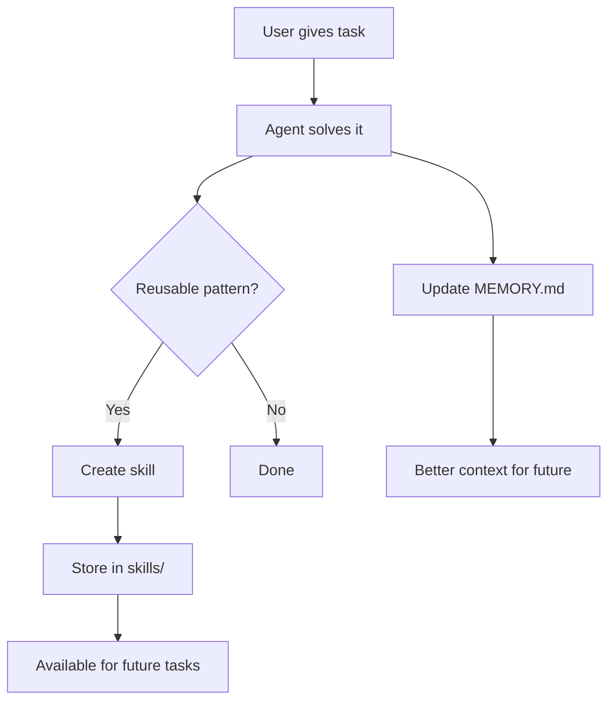

# Hermes Agent -- Overview

## What Hermes Is

Hermes Agent is a self-improving AI agent built by Nous Research. It's designed around three principles:

1. **Run anywhere** -- $5 VPS, cloud server, serverless function, or your laptop
2. **Talk to anyone** -- Telegram, Discord, Slack, WhatsApp, Signal, Matrix, Email, DingTalk, Feishu, SMS
3. **Get better over time** -- Creates skills from experience, searches past conversations, compresses and retains context

## Capabilities

```
┌─────────────────────────────────────────────────────────────────┐
│                         HERMES AGENT                             │
│                                                                  │
│  ┌─────────────┐  ┌─────────────┐  ┌─────────────┐             │
│  │ 40+ Tools   │  │ 10+ Plat-   │  │ Memory &    │             │
│  │ Terminal     │  │ forms       │  │ Context     │             │
│  │ Browser      │  │ Telegram    │  │ Providers   │             │
│  │ Files        │  │ Discord     │  │ Compression │             │
│  │ Web search   │  │ Slack       │  │ Search      │             │
│  │ Vision       │  │ WhatsApp    │  │ Skills      │             │
│  │ Image gen    │  │ Signal      │  │ Learning    │             │
│  │ APIs         │  │ Matrix      │  │             │             │
│  │ MCP          │  │ Email       │  │             │             │
│  └─────────────┘  └─────────────┘  └─────────────┘             │
│                                                                  │
│  ┌─────────────┐  ┌─────────────┐  ┌─────────────┐             │
│  │ LLM Back-   │  │ Scheduling  │  │ Plugins     │             │
│  │ ends        │  │ Cron jobs   │  │ Memory      │             │
│  │ Anthropic   │  │ Intervals   │  │ Context     │             │
│  │ OpenAI      │  │ One-shot    │  │ Image gen   │             │
│  │ Gemini      │  │ Timers      │  │ Custom      │             │
│  │ Bedrock     │  │             │  │             │             │
│  │ Codex       │  │             │  │             │             │
│  │ Local       │  │             │  │             │             │
│  └─────────────┘  └─────────────┘  └─────────────┘             │
│                                                                  │
│  ┌─────────────┐  ┌─────────────┐                               │
│  │ CLI/TUI     │  │ ACP/Editor  │                               │
│  │ Interactive  │  │ Cursor      │                               │
│  │ Headless    │  │ VSCode      │                               │
│  └─────────────┘  └─────────────┘                               │
└─────────────────────────────────────────────────────────────────┘
```

## Key Differentiators

### Multi-Platform Gateway

Hermes isn't just a CLI tool. The gateway module lets it live on messaging platforms as a persistent presence. Users interact via their preferred messaging app. The agent maintains per-user sessions, memories, and context across platforms.

### Self-Improvement Loop



When Hermes solves a problem, it can save the solution as a skill -- a reusable procedure. Next time a similar problem comes up, it has the skill ready. Working memory (MEMORY.md) captures preferences, facts, and patterns that persist across conversations.

### Pluggable Everything

Every major subsystem has an abstract base class:
- **LLM adapters** -- Plug in any provider
- **Memory providers** -- Plug in Honcho, Mem0, Hindsight, or custom
- **Context engines** -- Plug in custom compression strategies
- **Image generation** -- Plug in DALL-E, Grok, or custom
- **Tools** -- Self-registering tool registry

### RL Training Support

Hermes can generate trajectories (conversation traces with tool calls) for reinforcement learning training. This enables training custom models on Hermes's behavior.

## Technology Stack

| Concern | Choice |
|---------|--------|
| Language | Python 3.11+ |
| Package management | pip / uv |
| Build | setuptools via pyproject.toml |
| LLM clients | OpenAI SDK, Anthropic SDK, httpx |
| Messaging | python-telegram-bot, discord.py, slack-bolt |
| CLI | prompt_toolkit, curses |
| Schema validation | Pydantic |
| Async | asyncio, aiohttp |
| Browser automation | CDP (Chrome DevTools Protocol) |
| Testing | (not specified in pyproject.toml) |

## Entry Points

| Command | What It Does |
|---------|-------------|
| `hermes` | Interactive CLI/TUI |
| `hermes gateway` | Start multi-platform messaging gateway |
| `hermes setup` | Configuration wizard |
| `hermes model` | Switch LLM model |
| `hermes cron` | Manage scheduled jobs |
| `hermes tools` | Configure tools and skills |
| `hermes-agent` | Direct agent invocation (scripting) |
| `hermes-acp` | ACP server for editor integration |

## Configuration

```
~/.hermes/
├── config.yaml        Main configuration
├── MEMORY.md          Built-in working memory
├── USER.md            User profile
├── SOUL.md            AI persona definition
├── skills/            Custom skills
├── cron/
│   └── jobs.jsonl     Scheduled jobs
└── plugins/           Installed plugins
```

Project-level context files: `.hermes.md` or `HERMES.md` in the project root.
