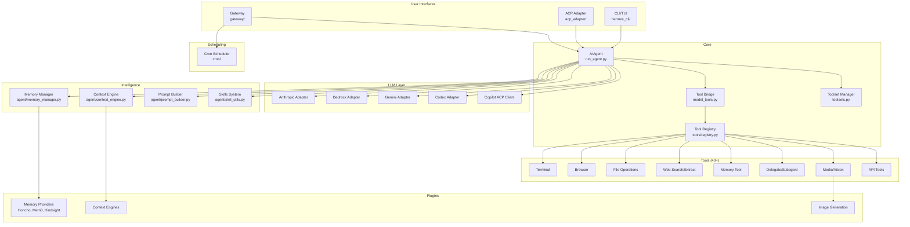
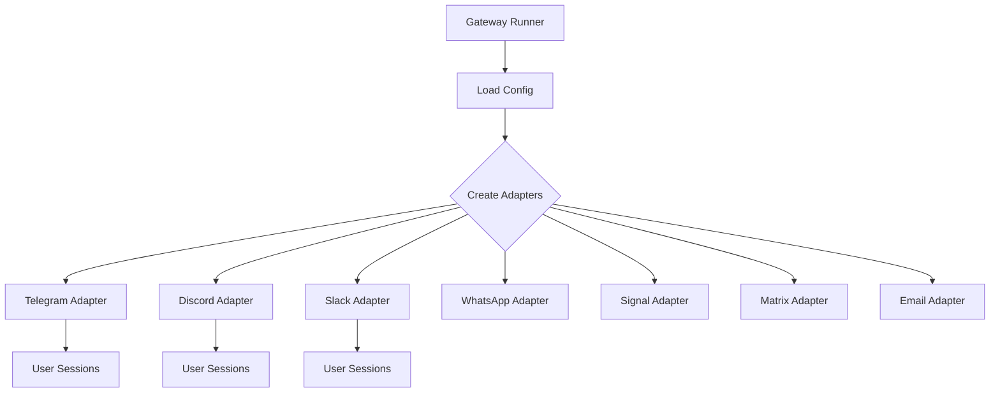
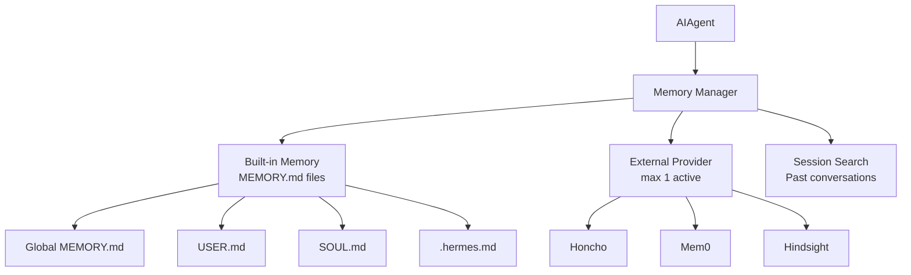

# Hermes Agent -- Architecture

## System Layers



## Module Dependencies

### Core → Everything Flows Through AIAgent

`run_agent.py` contains the `AIAgent` class -- the central orchestrator. It's 3,600+ lines and coordinates:
- LLM calls via adapter selection
- Tool dispatch via the registry
- Memory reading/writing
- Context compression
- Prompt assembly
- Skill loading

Every user interface (CLI, gateway, ACP) creates an `AIAgent` instance and runs it.

### LLM Adapters → Provider Abstraction

Each adapter converts Hermes's internal message format to/from a provider's API:

| Adapter | Provider | API Format |
|---------|----------|-----------|
| `anthropic_adapter.py` | Anthropic | Messages API |
| `bedrock_adapter.py` | AWS Bedrock | Bedrock Messages |
| `gemini_native_adapter.py` | Google Gemini | Gemini API |
| `gemini_cloudcode_adapter.py` | Google Cloud Code | Cloud API |
| `codex_responses_adapter.py` | OpenAI Codex | Responses API |
| `copilot_acp_client.py` | GitHub Copilot | ACP Protocol |

The default path uses the OpenAI SDK's chat completions format. Adapters handle cases where a provider's API diverges significantly.

### Tool Registry → Self-Registration

Tools self-register on import:

```python
# In tools/terminal_tool.py
from tools.registry import registry

@registry.register(
    name="terminal",
    description="Execute shell commands",
    input_schema={...}
)
async def terminal_tool(params, context):
    ...
```

When `tools/__init__.py` is imported, it imports all tool modules, which triggers registration. The registry then provides tool schemas (for LLM) and dispatch (for execution).

### Gateway → Per-Platform Adapters

The gateway creates per-platform adapter instances based on configuration:



Each adapter handles platform-specific:
- Authentication
- Message format conversion
- Media upload/download
- Thread/reply handling
- Rate limiting

### Memory → Layered Architecture



The memory manager orchestrates one built-in memory system (markdown files) plus at most one external provider. It prefetches relevant memories before each LLM call and syncs updates after.

## Communication Patterns

### 1. Synchronous: CLI → Agent → LLM

Direct function calls. The CLI calls `AIAgent.run()`, which calls the LLM adapter, which makes HTTP requests. Streaming responses flow back through callbacks.

### 2. Async: Gateway → Agent → Platform

The gateway uses asyncio. Incoming messages trigger async agent runs. Responses are delivered back to the originating platform asynchronously.

### 3. Self-Registration: Tool Loading

Tools register themselves when their module is imported. The registry maintains a dictionary of name → handler mappings. No central configuration file lists all tools.

### 4. Plugin Discovery: Abstract Base Classes

Plugins implement abstract base classes (`ContextEngine`, `MemoryProvider`). The plugin loader discovers them by package name and instantiates the configured implementation.

## Key Files Map

```
hermes-agent/
├── run_agent.py                 AIAgent class (3,600+ lines, core orchestrator)
├── model_tools.py               Tool dispatch bridge
├── toolsets.py                  Toolset composition
├── hermes_state.py              Session state persistence
├── hermes_constants.py          Global paths and constants
├── agent/
│   ├── anthropic_adapter.py     Anthropic LLM adapter
│   ├── bedrock_adapter.py       AWS Bedrock adapter
│   ├── gemini_native_adapter.py Gemini adapter
│   ├── context_engine.py        ABC for context compression
│   ├── context_compressor.py    Default compressor implementation
│   ├── memory_manager.py        Memory orchestration
│   ├── memory_provider.py       ABC for memory providers
│   ├── prompt_builder.py        System prompt assembly
│   ├── prompt_caching.py        Anthropic cache control
│   ├── model_metadata.py        Token limits, pricing
│   ├── skill_utils.py           Skill loading and execution
│   └── credential_pool.py       API key management
├── tools/
│   ├── registry.py              Central tool registry
│   ├── __init__.py              Imports all tool modules (triggers registration)
│   ├── terminal_tool.py         Shell execution
│   ├── browser_tool.py          Browser automation
│   ├── file_tools.py            File operations
│   ├── web_search_tool.py       Web search
│   ├── memory_tool.py           Memory operations
│   ├── delegate_tool.py         Subagent spawning
│   └── ... (30+ more)
├── hermes_cli/
│   ├── main.py                  CLI entry point
│   ├── commands.py              Interactive commands
│   ├── config.py                Configuration loading
│   └── auth.py                  Authentication
├── gateway/
│   ├── run.py                   Gateway runner
│   ├── session.py               Per-user sessions
│   ├── delivery.py              Message delivery
│   └── platforms/               Platform adapters
├── cron/
│   ├── scheduler.py             Cron tick scheduler
│   └── jobs.py                  Job CRUD
└── plugins/
    ├── honcho/                  Honcho memory provider
    ├── hindsight/               Hindsight memory provider
    ├── mem0/                    Mem0 memory provider
    └── image_gen/               Image generation plugins
```
